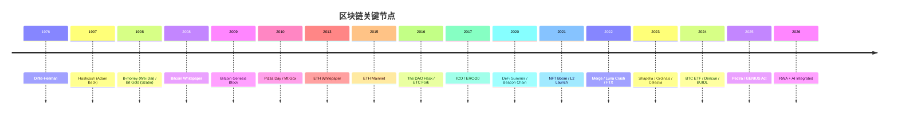

# 区块链发展史（Blockchain History 1980s–2026）

> **TL;DR**：区块链并非凭空诞生，而是 1980s 密码学（Diffie-Hellman、Merkle、Lamport、Chaum）、1990s 密码朋克运动（Hashcash、B-money、Bit Gold）、2008 Satoshi 综合为 Bitcoin 的结果。本篇沿「密码朋克 → Bitcoin → Ethereum → ICO → DeFi Summer → NFT/L2 → 模块化 → RWA → AI+Crypto」主线梳理 2026 年前的关键节点，辅以时间轴表格与分阶段图谱，帮助读者建立宏观叙事坐标。

## 1. 背景与动机

为什么读史？因为 Web3 每一个当下的技术选择——PoS、EVM、L2、Rollup、AA、Restaking——都背着沉重的历史路径依赖。不了解 Bitcoin OP_RETURN 的争论，就理解不了 Ordinals；不知道 2017 The DAO 攻击，就说不清 Ethereum 硬分叉与 ETC 的分裂；不懂 2020 的 DeFi Summer 超额流动性挖矿，就看不透 2024 Points 运动。**历史不是装饰，是读懂协议的背景逻辑。**

## 2. 核心原理：时间轴与六大阶段划分

### 2.1 形式化：把行业史拆成阶段的原则

我们用三个维度定义"阶段"：

- **技术突破**：有无新的密码学/协议原语？
- **资本结构**：资金来源和规模是否跃迁？
- **用户画像**：使用者从极客扩散到更广人群？

据此把 2008–2026 拆为 6 个阶段：Pre-Bitcoin（1980s-2008）→ Bitcoin 纪元（2009-2014）→ Ethereum 纪元（2015-2019）→ DeFi/NFT 浪潮（2020-2021）→ 模块化 + L2（2022-2023）→ RWA + AI + AA（2024-2026）。

### 2.2 Pre-Bitcoin：密码朋克的思想准备（1980s–2008）

- **1976** [Diffie-Hellman](https://ee.stanford.edu/~hellman/publications/24.pdf)：非对称密码学。
- **1979** Ralph Merkle：[Merkle Tree](http://www.merkle.com/papers/Thesis1979.pdf)。
- **1982** David Chaum：[Blind Signature](https://chaum.com/publications/Chaum-blind-unanticipated.PDF)，成立 [DigiCash](https://en.wikipedia.org/wiki/DigiCash)（1990），是第一种可用的电子货币，但中心化，1998 破产清算。
- **1992-94** [Cypherpunks Mailing List](https://en.wikipedia.org/wiki/Cypherpunk)（Tim May、Hal Finney、Eric Hughes）：《[A Cypherpunk's Manifesto](https://www.activism.net/cypherpunk/manifesto.html)》"Privacy is necessary for an open society"。
- **1997** Adam Back: [**Hashcash**](http://www.hashcash.org/papers/hashcash.pdf)（PoW 先驱，原为反垃圾邮件）。
- **1998** Wei Dai: [**B-money**](http://www.weidai.com/bmoney.txt)（分布式电子现金提案，含 PoW + 全员维护账本）。Nick Szabo: [**Bit Gold**](https://unenumerated.blogspot.com/2005/12/bit-gold.html)（每个 PoW 解作为 chain 的"位"）。
- **2004** Hal Finney: [**RPOW**](https://nakamotoinstitute.org/finney/rpow/)（可复用 PoW）。
- **2008-08** Satoshi 注册 bitcoin.org。**2008-10-31** 发表 [Bitcoin 白皮书 `bitcoin.pdf`](https://bitcoin.org/bitcoin.pdf)（9 页，8 引用）。

这些前置工作解决的子问题：
1. **数字稀缺**（Hashcash、Bit Gold）；
2. **不可伪造**（公钥签名）；
3. **可验证历史**（Merkle tree + 时间戳）；
4. **抗女巫**（PoW）；
5. **账本一致**（B-money 设想全员维护但未解决）。

Satoshi 的贡献是把这 5 个原语**整合在一个系统里并解决了拜占庭共识**——用最长链规则 + 经济激励。

### 2.3 Bitcoin 纪元（2009-2014）

- **2009-01-03** [Genesis Block](https://mempool.space/block/000000000019d6689c085ae165831e934ff763ae46a2a6c172b3f1b60a8ce26f)（block 0），coinbase 含 "The Times 03/Jan/2009 Chancellor on brink of second bailout for banks"。
- **2009-01-12** Satoshi 向 Hal Finney 发送 10 BTC：[首笔交易](https://mempool.space/tx/f4184fc596403b9d638783cf57adfe4c75c605f6356fbc91338530e9831e9e16)。
- **2010-05-22** Laszlo Hanyecz 花 10,000 BTC 买两个 Pizza：[**Bitcoin Pizza Day**](https://bitcointalk.org/index.php?topic=137.0)，首个现实世界兑换。
- **2010-07-17** [Mt.Gox](https://en.wikipedia.org/wiki/Mt._Gox) 上线，成为最大 BTC 交易所（2014 破产，损失 850,000 BTC）。
- **2010-08-15** ["Value Overflow Incident" CVE-2010-5139](https://en.bitcoin.it/wiki/Value_overflow_incident)：交易凭空产生 1,844 亿 BTC，紧急硬分叉修复（史上仅此一次）。
- **2010-12-12** [Satoshi 最后一次公开发帖](https://bitcointalk.org/index.php?topic=2216.msg29280#msg29280)，之后消失。
- **2011** 开始 [Silk Road](https://en.wikipedia.org/wiki/Silk_Road_(marketplace)) 接受 BTC 支付；Charlie Lee 发布 [Litecoin（LTC）](https://litecoin.org)。
- **2012** [BIP-32 HD Wallet](https://github.com/bitcoin/bips/blob/master/bip-0032.mediawiki)（Pieter Wuille）；[BIP-39 Mnemonic](https://github.com/bitcoin/bips/blob/master/bip-0039.mediawiki)（Marek Palatinus）。
- **2013-10** Silk Road 被 FBI 关闭，[Ross Ulbricht](https://en.wikipedia.org/wiki/Ross_Ulbricht) 被捕；BTC 价格首破 $1,000。
- **2013-12** Vitalik Buterin 发布 [Ethereum 白皮书](https://ethereum.org/en/whitepaper/)。**2014-07** Ethereum [预售](https://blog.ethereum.org/2014/07/22/launching-the-ether-sale)（众筹 31,000 BTC，约当时 $18M）。
- **2014** Mt.Gox 倒闭。

### 2.4 Ethereum 纪元与 ICO 泡沫（2015-2019）

- **2015-07-30** [Ethereum Frontier 主网上线](https://blog.ethereum.org/2015/07/30/ethereum-launches)，block 0 硬编码预分配地址（pre-sale 参与者）。
- **2016-06** [The DAO 被攻击](https://en.wikipedia.org/wiki/The_DAO_(organization))（约 3.6M ETH，当时 ~$60M），催生 2016-07-20 硬分叉，分裂出 [Ethereum Classic（ETC）](https://ethereumclassic.org)。
- **2016-10** Ethereum [Spurious Dragon](https://ethereum.org/en/history/#spurious-dragon) 硬分叉（DoS 攻击后修复）。
- **2017** **ICO 狂潮**：全年 ICO 募资超 $6B（[EOS $4.1B](https://www.sec.gov/news/press-release/2019-202)、Telegram TON 私募 $1.7B、Filecoin $257M、Tezos $232M）。[ERC-20 标准（EIP-20）](https://eips.ethereum.org/EIPS/eip-20) 确立。
- **2017-12** BTC 首破 $19,000，CME、CBOE 推出 BTC 期货。
- **2018-01** "加密寒冬"开始，BTC 跌至 $3,200（2018-12）。
- **2018-11** [Bitcoin Cash](https://bitcoincash.org) 分裂为 BCH 和 BSV。
- **2019** DAI 1.0（单抵押 SAI）→ [MCD（多抵押 DAI, 2019-11）](https://makerdao.com/en/whitepaper/)上线。Binance Launchpad 兴起 IEO 模式。[Libra（Facebook）](https://en.wikipedia.org/wiki/Diem_(digital_currency)) 发布白皮书，受监管围剿。

### 2.5 DeFi Summer 与 NFT 浪潮（2020-2021）

**2020 DeFi Summer**：

- **2020-03-12 ["黑色星期四"](https://forum.makerdao.com/t/black-thursday-response-thread/1433)**：ETH 一天跌 44%，MakerDAO 清算拍卖 bug 导致 $8.3M 坏账。
- **2020-05** [Compound 启动 $COMP 流动性挖矿](https://compound.finance/governance/proposals/7)，开启 Yield Farming 时代。
- **2020-06** [Yearn Finance](https://yearn.finance)（$YFI 零预挖，Andre Cronje 发行）。
- **2020-09** [SushiSwap "Vampire Attack"](https://docs.sushi.com) Uniswap，迫使 Uniswap 2020-09-17 发 [$UNI 空投](https://blog.uniswap.org/uni)（400 UNI/地址）。
- **2020-10** [Harvest Finance 遭 flash loan 攻击](https://rekt.news/harvest-rekt/)（$24M）。
- **2020-12-01** [Ethereum Beacon Chain 创世](https://ethereum.org/en/history/#beacon-chain-genesis)（PoS 信标链启动）。

**2021 NFT/L2 浪潮**：

- **2021-03-11** Beeple 的《[Everydays](https://onlineonly.christies.com/s/beeple-first-5000-days/beeple-b-1981-1/112924)》在 Christie's 拍出 $69M。
- **2021-04** [Axie Infinity](https://axieinfinity.com) 月入过亿，菲律宾 GameFi 热潮。
- **2021-05** BTC 首破 $60,000；Elon Musk 令 Tesla 停止收 BTC。
- **2021-08** [Poly Network 被黑 $611M](https://rekt.news/polynetwork-rekt/)，后全部归还。OpenSea 月交易量破 $3B。
- **2021-08** Ethereum London 硬分叉，[EIP-1559](https://eips.ethereum.org/EIPS/eip-1559) 费用市场（base fee + burn）。
- **2021-08-31** **[Arbitrum One 主网上线](https://arbitrum.io/blog/arbitrum-one-public-mainnet-launch)**；El Salvador 官方采用 BTC（2021-09-07）。
- **2021-09-14** Solana 首次宕机（之后 [2022 多次](https://status.solana.com/history)）。
- **2021-11** BTC 历史高点 $69,000；OpenSea $13B/月；Facebook 改名 Meta。
- **2021-12** **[Optimism](https://www.optimism.io) 公开主网**；**[dYdX](https://dydx.exchange)**（StarkEx）TVL 破 $1B。

### 2.6 模块化、L2 爆发与 Bear Market（2022-2023）

- **2022-04-07** [Axie Ronin 桥被黑 $625M（Lazarus Group）](https://rekt.news/ronin-rekt/)。
- **2022-05** [UST/LUNA 崩盘](https://en.wikipedia.org/wiki/Terra_(blockchain))（UST 脱锚，LUNA $80 → $0.0001），$40B+ 市值蒸发；3AC 倒闭；Celsius 暂停提款。
- **2022-08** [Tornado Cash 被 OFAC 制裁](https://home.treasury.gov/news/press-releases/jy0916)；USDC 冻结黑名单地址。
- **2022-09-15** **[The Merge](https://ethereum.org/en/roadmap/merge/)**：Ethereum 合并为 PoS，能耗 -99.95%。
- **2022-11** [FTX 崩盘](https://en.wikipedia.org/wiki/Bankruptcy_of_FTX)（$8B 客户资金亏空）、SBF 被捕。
- **2023-01** [Bitcoin Ordinals](https://docs.ordinals.com)（Casey Rodarmor）让 BTC NFT/BRC-20 成为现实。
- **2023-03** [USDC 因 SVB 临时脱钩 0.87](https://www.circle.com/blog/an-update-on-usdc-and-silicon-valley-bank)；[Euler 被黑 $197M（后返还）](https://rekt.news/euler-finance-rekt/)。
- **2023-04** Ethereum [Shapella 硬分叉（EIP-4895）](https://eips.ethereum.org/EIPS/eip-4895)，开启质押提款。
- **2023-06** [SEC 起诉 Binance](https://www.sec.gov/news/press-release/2023-101)、[Coinbase](https://www.sec.gov/news/press-release/2023-102)。
- **2023-06** **[EigenLayer](https://www.eigenlayer.xyz) Phase 1 主网**（Restaking 概念落地）；**2023-08** [PayPal PYUSD](https://www.paypal.com/us/digital-wallet/manage-money/crypto/pyusd) 发布。
- **2023-10-31** [Celestia 主网](https://blog.celestia.org/mainnet-beta-the-first-modular-blockchain-network-is-live/)，"模块化 DA" 落地。
- **2023-11** [HTX/Poloniex 被黑 > $200M](https://rekt.news/htx-poloniex-rekt/)；Sam Bankman-Fried 定罪。

### 2.7 RWA + AI + AA 纪元（2024-2026）

- **2024-01-10** **[美国 SEC 批准 Bitcoin 现货 ETF](https://www.sec.gov/news/statement/gensler-statement-spot-bitcoin-011023)**（[BlackRock IBIT](https://www.ishares.com/us/products/333011/ishares-bitcoin-trust-etf)、Fidelity FBTC 等 11 只），截至 2025 年累计净流入超 $40B。
- **2024-03-13** **[Dencun 升级](https://ethereum.org/en/history/#dencun)**（[EIP-4844](https://eips.ethereum.org/EIPS/eip-4844) Blob），L2 费用 -90%。
- **2024-03** **[BlackRock BUIDL](https://securitize.io/learn/press/blackrock-launches-first-tokenized-fund-buidl-on-the-ethereum-network)** 发布（链上美债基金），当年 TVL 破 $500M。
- **2024-05-23** [SEC 批准 ETH 现货 ETF 19b-4 提案](https://www.sec.gov/files/rules/sro/nysearca/2024/34-100224.pdf)；**2024-07-23** ETH spot ETF 上线。
- **2024-06** [Ondo OUSG](https://ondo.finance/ousg) 迁移到 BUIDL，RWA 叙事加固。
- **2024-09** [Worldcoin 改名 World](https://world.org)；EigenLayer 启动 Slashing。
- **2024-11** [Trump 当选美国总统](https://www.whitehouse.gov/)，承诺"美国成为加密之都"；BTC 首破 $100,000（2024-12-05）。
- **2025-01** [SEC SAB 121 撤销（SAB 122）](https://www.sec.gov/oca/staff-accounting-bulletin-122)，银行可托管加密资产。
- **2025-05-07** [Pectra 升级](https://ethereum.org/en/roadmap/pectra/)主网上线（[EIP-7702](https://eips.ethereum.org/EIPS/eip-7702) EOA→SCA 临时升级、[EIP-7251](https://eips.ethereum.org/EIPS/eip-7251) MaxEB 2048 ETH、[EIP-7691](https://eips.ethereum.org/EIPS/eip-7691) Blob 从 3/6 → 6/9）。
- **2025-07-18** [GENIUS Act](https://www.congress.gov/bill/119th-congress/senate-bill/1582) 稳定币法案签署成法。
- **2025-08-24** ETH 冲上历史高点 **$4,946**（见 [CoinGecko](https://www.coingecko.com/en/coins/ethereum)）。
- **2025-10-06** BTC 冲上历史高点 **$126,080**（见 [CoinGecko](https://www.coingecko.com/en/coins/bitcoin)）。
- **2025 Q4** AI-Agent + Crypto（Virtuals、ai16z 等）叙事降温，转向 RWA 与 PayFi。
- **2026-Q1 ↓ 回调**：BTC 从 ATH 回落至 ~$78K（−38%），ETH 回落至 ~$2.35K（−52%）；稳定币总市值 **~$316B**（[CoinGecko](https://www.coingecko.com/en/categories/stablecoins)）；[L2BEAT](https://l2beat.com/scaling/summary) 显示 L2 TVL Top 3：Arbitrum ~$16B、Base ~$12B、Mantle ~$1.7B；非稳定币 RWA（tokenized treasuries 等）聚集在 [rwa.xyz](https://app.rwa.xyz/) 口径 $15–20B。

### 2.8 图示：里程碑时间线



## 3. 架构剖析：每个阶段的「栈转移」

不同阶段，行业栈的「主阵地」在不同层。

### 3.1 Bitcoin 纪元的栈：单层 Monolithic

Bitcoin 把 Consensus + Execution + DA + Settlement + 应用（只有转账）**全部压入 L1**。脚本语言刻意图灵不完备。没有 middleware、没有 wallet 抽象（所有用户跑 full node）。

### 3.2 Ethereum 纪元的栈：L1 + dApps

Ethereum 在 L1 上增加了图灵完备 EVM，直接孕育出**应用层**（ERC-20、DAO、DeFi）。但 middleware（Oracle、Indexer）尚未成熟，DeFi 早期预言机事故频发（如 bZx、Harvest 闪电贷操纵）。

### 3.3 DeFi Summer 的栈：中间件起飞

Chainlink（2019 主网，2020 起爆发）、The Graph（2020-12）、Gnosis Safe、WalletConnect 等 **中间件层**补齐。Uniswap V2/V3 奠定 AMM 标准。

### 3.4 模块化纪元的栈：DA 与 Execution 分离

Celestia、EigenDA 把 DA 单拎出来作为一层；Rollup as Service（RaaS，Caldera、Conduit、Gelato）把 Execution 层产品化。

### 3.5 客户端多样性史

| 年份 | Ethereum EL 客户端格局 |
| --- | --- |
| 2015 | geth 一家独大 |
| 2018 | Parity（~30%）崛起，后 Parity Wallet 冻结事件 |
| 2020 | Nethermind、Besu、Erigon 起势 |
| 2024 | Geth ~52%、Nethermind ~24%、Reth（Rust 新秀）增长快 |

### 3.6 典型生命周期：一个用户资产的穿越

- 2017 的用户：BTC/ETH on CEX → 提到 Metamask → 手动调 Uniswap → 等 5 分钟。
- 2026 的用户：法币入 → Coinbase Smart Wallet（ERC-4337）→ Uniswap X Intent → Solver 在 Base + Arbitrum + Solana 找最优价 → 链下 Off-chain 匹配 → 链上结算 → 30 秒完成。

## 4. 关键代码 / 实现细节：Bitcoin Genesis Block

```
// bitcoin/src/chainparams.cpp:52 (近似，各版本字段略有调整)
// Genesis block timestamp (UNIX): 1231006505 = 2009-01-03 18:15:05 UTC
// Merkle root: 4a5e1e4baab89f3a32518a88c31bc87f618f76673e2cc77ab2127b7afdeda33b
// Coinbase tx raw input script:
//   04ffff001d0104455468652054696d65732030332f4a616e2f3230303920436861
//   6e63656c6c6f72206f6e206272696e6b206f66207365636f6e64206261696c6f75
//   7420666f722062616e6b73
// 解码: "The Times 03/Jan/2009 Chancellor on brink of second bailout for banks"
```

这条字符串被载入链上，永久存在，成为**历史上最著名的时间戳**——既证明 genesis block 不早于 2009-01-03，也是 Satoshi 对当时金融体系的讽刺。

## 5. 演进与版本对比：Ethereum 硬分叉史

| 硬分叉 | 时间 | 关键 EIP | 影响 |
| --- | --- | --- | --- |
| [Frontier](https://ethereum.org/en/history/#frontier) | 2015-07 | — | 主网启动 |
| [Homestead](https://ethereum.org/en/history/#homestead) | 2016-03 | [EIP-2](https://eips.ethereum.org/EIPS/eip-2)/[7](https://eips.ethereum.org/EIPS/eip-7) | 稳定性 |
| [DAO Fork](https://ethereum.org/en/history/#dao-fork) | 2016-07 | 硬编码 | 退款 The DAO |
| [Byzantium](https://ethereum.org/en/history/#byzantium) | 2017-10 | [EIP-649](https://eips.ethereum.org/EIPS/eip-649)/[658](https://eips.ethereum.org/EIPS/eip-658) | 难度炸弹延缓、区块奖励 5→3 ETH |
| [Constantinople](https://ethereum.org/en/history/#constantinople) | 2019-02 | [EIP-1234](https://eips.ethereum.org/EIPS/eip-1234) | 3→2 ETH |
| [Istanbul](https://ethereum.org/en/history/#istanbul) | 2019-12 | [EIP-2028](https://eips.ethereum.org/EIPS/eip-2028) | calldata gas 下调 |
| [Berlin](https://ethereum.org/en/history/#berlin) | 2021-04 | [EIP-2929](https://eips.ethereum.org/EIPS/eip-2929) | Gas 模型改 |
| [London](https://ethereum.org/en/history/#london) | 2021-08 | [EIP-1559](https://eips.ethereum.org/EIPS/eip-1559) | 费用市场 + burn |
| [Altair](https://ethereum.org/en/history/#altair) | 2021-10 | — | Beacon chain 第一次升级 |
| [Paris（The Merge）](https://ethereum.org/en/history/#paris) | 2022-09 | — | PoS |
| [Shanghai/Capella](https://ethereum.org/en/history/#shanghai) | 2023-04 | [EIP-4895](https://eips.ethereum.org/EIPS/eip-4895) | 质押提款 |
| [Dencun](https://ethereum.org/en/history/#dencun) | 2024-03 | [EIP-4844](https://eips.ethereum.org/EIPS/eip-4844) | Blob |
| [Pectra](https://ethereum.org/en/roadmap/pectra/) | 2025-05 | [EIP-7702](https://eips.ethereum.org/EIPS/eip-7702)/[7251](https://eips.ethereum.org/EIPS/eip-7251)/[7691](https://eips.ethereum.org/EIPS/eip-7691) | AA + MaxEB + 2x Blob |

## 6. 实战示例：访问创世块

```bash
# via Bitcoin Core RPC
bitcoin-cli getblockhash 0
# 000000000019d6689c085ae165831e934ff763ae46a2a6c172b3f1b60a8ce26f

bitcoin-cli getblock 000000000019d6689c085ae165831e934ff763ae46a2a6c172b3f1b60a8ce26f 2

# 解析 coinbase 里的 Times 信息：
bitcoin-cli getblock 000000000019d6689c085ae165831e934ff763ae46a2a6c172b3f1b60a8ce26f 2 \
  | jq -r '.tx[0].vin[0].coinbase' \
  | xxd -r -p
```

## 7. 安全与已知攻击：历史上影响最大的十起事件

1. **[Mt.Gox](https://en.wikipedia.org/wiki/Mt._Gox)**（2014）：850,000 BTC 丢失。
2. **[The DAO](https://en.wikipedia.org/wiki/The_DAO_(organization))**（2016）：~$60M，导致 ETC 硬分叉。
3. **[Parity Wallet Freeze](https://www.parity.io/blog/a-postmortem-on-the-parity-multi-sig-library-self-destruct/)**（2017）：~513K ETH 被冻结。
4. **[Coincheck](https://en.wikipedia.org/wiki/Coincheck)**（2018）：NEM 被黑 $530M。
5. **[Ronin Bridge](https://rekt.news/ronin-rekt/)**（2022）：$625M。
6. **[LUNA/UST](https://en.wikipedia.org/wiki/Terra_(blockchain))**（2022）：$40B+ 市值蒸发。
7. **[FTX](https://en.wikipedia.org/wiki/Bankruptcy_of_FTX)**（2022）：$8B 客户资金亏空。
8. **[Wormhole](https://rekt.news/wormhole-rekt/)**（2022）：$320M。
9. **[Multichain](https://rekt.news/multichain-rekt/)**（2023）：$126M 跑路。
10. **[DMM Bitcoin](https://www.dmm.com/news/2024/0531-1.html)**（2024-05）：$305M BTC 被盗（行业史上第 3 大单次被盗）。
11. **[Bybit](https://www.bybit.com/)**（2025-02）：$1.46B（Lazarus Group，史上最大单次交易所被黑）。

## 8. 与同类方案对比：比特币 vs 以太坊 vs Solana 起源叙事

| 维度 | Bitcoin | Ethereum | Solana |
| --- | --- | --- | --- |
| 创始人 | Satoshi Nakamoto（匿名） | Vitalik Buterin（公开） | Anatoly Yakovenko |
| 核心理念 | 数字黄金、抗审查货币 | 世界计算机 | 高吞吐单链 |
| 融资 | 无 ICO | 预售 31,000 BTC | VC 轮 |
| 治理 | BIP + 社区 | EIP + All Core Dev | 核心团队 + 基金会 |
| 典型硬分叉 | BCH/BSV | ETC、各 EIP 硬分叉 | 网络重启（历史 ~6 次宕机重启） |

## 9. 延伸阅读

- 《[Digital Gold](https://www.harpercollins.com/products/digital-gold-nathaniel-popper)》Nathaniel Popper：Bitcoin 起源。
- 《[The Infinite Machine](https://www.harpercollins.com/products/the-infinite-machine-camila-russo)》Camila Russo：Ethereum 起源。
- 《[Mastering Bitcoin](https://github.com/bitcoinbook/bitcoinbook)》Andreas Antonopoulos（开源）。
- 《[Mastering Ethereum](https://github.com/ethereumbook/ethereumbook)》Antonopoulos + Wood（开源）。
- [Nakamoto Institute 归档](https://nakamotoinstitute.org)。
- 中文：《[精通以太坊](https://github.com/inoutcode/ethereum_book)》、[登链社区](https://learnblockchain.cn) 早期报道。

## 10. 术语表

| 术语 | 英文 | 释义 |
| --- | --- | --- |
| 密码朋克 | Cypherpunk | 1990s 倡导用密码学保护隐私的技术社群 |
| 创世块 | Genesis Block | 区块链第 0 号区块 |
| 硬分叉 | Hard Fork | 不向下兼容的协议升级 |
| ICO | Initial Coin Offering | 代币首次发行 |
| DeFi Summer | — | 2020 年 DeFi 爆发期 |
| 合并 | The Merge | Ethereum PoW → PoS 升级 |
| Dencun | Cancun+Deneb | Ethereum 2024 升级，引入 Blob |
| Pectra | Prague+Electra | Ethereum 2025 升级，引入 AA |

---

*Last verified: 2026-04-23*
