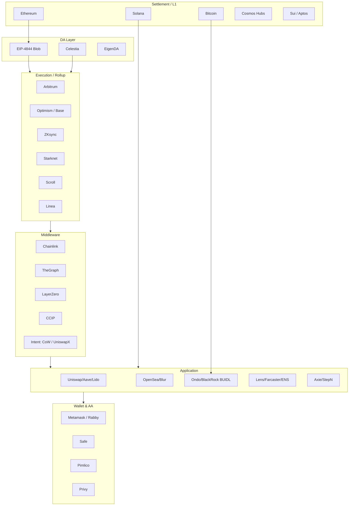

# Web3 行业全景（Web3 Landscape 2026）

> **TL;DR**：Web3 并非一个整体赛道，而是由「底层公链 / 扩容 / 中间件 / 钱包 / 合约语言 / 应用层 / 数据与安全」构成的多层栈。本篇自底向上拆解 2026 年的格局，梳理每层关键玩家（[Ethereum](https://ethereum.org) / [Solana](https://solana.com) / [Aptos](https://aptosfoundation.org) / [Celestia](https://celestia.org) / [Chainlink](https://chain.link) / [Pimlico](https://www.pimlico.io) / [Uniswap](https://uniswap.org) / [Aave](https://aave.com) / [Lido](https://lido.fi) / [Circle](https://www.circle.com) 等）、关键协议（[EIP-4844](https://eips.ethereum.org/EIPS/eip-4844) / [ERC-4337](https://eips.ethereum.org/EIPS/eip-4337) / [ERC-3643](https://eips.ethereum.org/EIPS/eip-3643) / [OP Stack](https://docs.optimism.io/stack/getting-started) / ZK Proof System）与典型 metric（TVL、L2 fee、Rollup DA cost），并给出本知识库 7 个模块的导览图，便于读者定位自己的学习路径。

## 1. 背景与动机

「Web3」作为术语最早由 [Gavin Wood](https://gavwood.com/web3lt.html) 于 2014 年《[DApps: What Web 3.0 Looks Like](https://gavwood.com/dappsweb3.html)》中提出，指一个基于公共区块链 + 加密身份 + P2P 通信的去中心化互联网栈。但 2017 ICO 泡沫、2020 DeFi Summer、2021 NFT 浪潮、2022 [LUNA](https://en.wikipedia.org/wiki/Terra_(blockchain))/[FTX](https://en.wikipedia.org/wiki/FTX) 崩盘、2023 L2 爆发、2024 [Bitcoin ETF 通过](https://www.sec.gov/news/statement/gensler-statement-spot-bitcoin-011023)、2025 RWA/AI 融合 —— 每一轮周期都大幅改写栈的形态。到 2026 年，下列事实已成共识：

1. **L1 不再通吃**：Ethereum 已将扩容路径全面委托给 L2（[Dencun](https://ethereum.org/en/history/#dencun) 硬分叉 2024-03 落地 [EIP-4844](https://eips.ethereum.org/EIPS/eip-4844) Blob）；Solana、Aptos、[Sui](https://sui.io)、[TON](https://ton.org) 则在单链高性能赛道上各自找到市场。
2. **模块化解耦**：DA（[Celestia](https://celestia.org)、[EigenDA](https://www.eigenlayer.xyz/eigenda)）、Settlement（Ethereum、[Bitcoin](https://bitcoin.org)）、Execution（Rollup）、Sequencer 分离；"主权 Rollup"、"Based Rollup" 等新形态出现。
3. **应用层沉淀**：[Uniswap](https://uniswap.org)、[Aave](https://aave.com)、[Lido](https://lido.fi)、[MakerDAO](https://makerdao.com)、[ENS](https://ens.domains) 已成为不可替代的 DeFi/Social 基础设施，TVL 头部协议护城河巨大。
4. **合规与 RWA**：[USDC](https://www.circle.com/usdc)、[PayPal PYUSD](https://www.paypal.com/us/digital-wallet/manage-money/crypto/pyusd)、[BlackRock BUIDL](https://securitize.io/learn/press/blackrock-launches-first-tokenized-fund-buidl-on-the-ethereum-network)、[Ondo OUSG](https://ondo.finance/ousg) 将 T-Bill、Money Market Fund 代币化；[ERC-3643](https://eips.ethereum.org/EIPS/eip-3643)、SBT、KYC-as-a-Service 成为合规桥。
5. **AA（Account Abstraction）与 Intents**：[ERC-4337](https://eips.ethereum.org/EIPS/eip-4337) + [ERC-7702](https://eips.ethereum.org/EIPS/eip-7702)（[Pectra 升级](https://ethereum.org/en/roadmap/pectra/)）让"无种子助记词"钱包落地；[Across](https://across.to)、[CoW Swap](https://cow.fi)、[Uniswap X](https://docs.uniswap.org/contracts/uniswapx/overview) 推动"用户只表达意图，Solver 负责执行"。

本库（web3-knowledge）正是对这个栈进行深度技术拆解的中文参考，7 个一级模块与本文结构一一对应。

## 2. 核心原理：Web3 技术栈分层（Layered Architecture）

要看清 Web3 行业地图，需要先理解**技术分层**。不同于 Web2（LAMP：Linux/Apache/MySQL/PHP），Web3 栈有自己的五层抽象 —— 每一层都有**多个竞争实现**，每一层都可能被**进一步拆分**。

### 2.1 形式化视角：从「状态机」到「协议栈」

区块链本质是一个**分布式复制状态机（Distributed Replicated State Machine）**：

- 状态 $S \in \mathcal{S}$；
- 交易 $T$ 为状态转移函数 $\delta: \mathcal{S} \times T \to \mathcal{S}$；
- 共识机制确保多节点对状态序列达成一致。

这个核心模型在 Web3 栈上被**解构和再组合**：

- **Monolithic L1**（[Bitcoin](https://bitcoin.org)、[Solana](https://solana.com)）：一个节点跑完 Execution + Consensus + DA + Settlement。
- **Modular Rollup**（[OP Stack](https://docs.optimism.io/stack/getting-started)、[Arbitrum Nitro](https://docs.arbitrum.io/how-arbitrum-works/inside-arbitrum-nitro)、[ZKsync](https://zksync.io)）：Execution 下放给 Rollup 节点，DA 写 Ethereum blob 或 Celestia，Settlement/争议解决回 Ethereum。
- **主权 Rollup**：Settlement 自行处理，仅借用 DA（[Rollkit](https://rollkit.dev) + Celestia）。

### 2.2 五层栈（The Web3 Stack）

```
┌──────────────────────────────────────────────────────┐
│ 7. Distribution / UX (Wallet, Frame, Browser ext.)   │← Metamask, Rabby, Rainbow, Phantom
├──────────────────────────────────────────────────────┤
│ 6. Application (DeFi, NFT, Social, GameFi, RWA)      │← Uniswap, Aave, Lens, Axie, Ondo
├──────────────────────────────────────────────────────┤
│ 5. Middleware (Oracle, Index, DA, Bridge, Intent)    │← Chainlink, The Graph, Across, CoW
├──────────────────────────────────────────────────────┤
│ 4. Smart Contract (EVM, SVM, MoveVM, WASM)           │← Solidity, Rust, Move, Cairo
├──────────────────────────────────────────────────────┤
│ 3. Execution Layer / Rollup                          │← Arbitrum, OP, ZKsync, Starknet, Base
├──────────────────────────────────────────────────────┤
│ 2. Consensus + DA                                    │← Ethereum PoS, Celestia, EigenDA
├──────────────────────────────────────────────────────┤
│ 1. Settlement / Ledger (L1)                          │← Ethereum, Bitcoin, Solana, Cosmos
└──────────────────────────────────────────────────────┘
```

### 2.3 子机制拆解

**（1）Ledger / Settlement**：最底层账本。Bitcoin（UTXO + PoW）、Ethereum（Account + PoS）、Solana（Account + PoH + Tower BFT）、Cosmos Hub（Account + Tendermint BFT）、Sui/Aptos（Object/Account + BFT + Move）。见 `01-infrastructure/ledger-model/`。

**（2）Consensus**：PoW（比特币、[Dogecoin](https://dogecoin.com)）、PoS（Ethereum、[Cosmos](https://cosmos.network)、Solana、[Cardano](https://cardano.org)）、DPoS（[EOS](https://eosnetwork.com) 已衰落）、PoH+BFT（Solana）、DAG-BFT（Sui [Narwhal-Bullshark](https://arxiv.org/abs/2201.05677)、Aptos [AptosBFT](https://aptos.dev/concepts/blockchain)、Celestia）。

**（3）DA（Data Availability）**：[2024 Dencun](https://ethereum.org/en/history/#dencun) 之后，Ethereum 提供 ~128 KB/block blob 空间（见 [EIP-4844](https://eips.ethereum.org/EIPS/eip-4844)）；Celestia 提供"按需扩容"的纯 DA 链；EigenDA 借 [EigenLayer](https://www.eigenlayer.xyz) restaking 提供 15+ MB/s。详见 `01-infrastructure/data-availability/`。

**（4）Execution / Rollup**：
- **Optimistic Rollup**：[Arbitrum](https://arbitrum.io)（Nitro，WASM Fraud Proof）、[Optimism](https://www.optimism.io)（OP Stack，[Cannon MIPS](https://github.com/ethereum-optimism/cannon)）、[Base](https://base.org)（OP 衍生）。7 天挑战期。
- **ZK Rollup**：[ZKsync Era](https://zksync.io)（LLVM → zkEVM）、[Starknet](https://www.starknet.io)（Cairo VM）、[Linea](https://linea.build)（Consensys）、[Scroll](https://scroll.io)、[Polygon zkEVM](https://polygon.technology/polygon-zkevm)、[Taiko](https://taiko.xyz)。
- **Sovereign Rollup**：[Dymension](https://dymension.xyz)、[Manta](https://manta.network)。

**（5）Smart Contract VM**：[EVM](https://ethereum.org/en/developers/docs/evm/)（绝对主导，> 80% TVL）、[SVM](https://solana.com/docs/core)（Solana）、[MoveVM](https://move-language.github.io/move/)（Sui/Aptos）、[CairoVM](https://docs.cairo-lang.org/)、[CosmWasm](https://cosmwasm.com)、[BitVM](https://bitvm.org)（Bitcoin 内的验证层）。

**（6）Middleware**：Oracle（[Chainlink](https://chain.link)、[Pyth](https://pyth.network)、[RedStone](https://redstone.finance)）、Indexer（[The Graph](https://thegraph.com)、[Goldsky](https://goldsky.com)、[Subsquid](https://www.sqd.ai)）、Bridge（[Wormhole](https://wormhole.com)、[LayerZero](https://layerzero.network)、[Across](https://across.to)、[CCIP](https://chain.link/cross-chain)、[Axelar](https://axelar.network)）、Intent（[CoW Swap](https://cow.fi)、[Uniswap X](https://docs.uniswap.org/contracts/uniswapx/overview)、Across Solver、[Anoma](https://anoma.net)）。

**（7）Application**：DeFi、NFT、Social/DAO、GameFi、RWA、Stablecoin、Privacy。

**（8）Wallet / UX**：EOA（[MetaMask](https://metamask.io)、[Rabby](https://rabby.io)、[Phantom](https://phantom.app)）、Smart Account（[Safe](https://safe.global)、[Argent](https://www.argent.xyz)、[Coinbase Smart Wallet](https://www.coinbase.com/wallet/smart-wallet)、[Pimlico](https://www.pimlico.io) 托管 Paymaster）、Mobile（[Trust Wallet](https://trustwallet.com)、[OKX Wallet](https://www.okx.com/web3)）、MPC（[Fireblocks](https://www.fireblocks.com)、[Privy](https://www.privy.io)、[Web3Auth](https://web3auth.io)）。

### 2.4 关键参数与 2026 现状（截至 2026-04-23）

| 指标 | 数值（实测） | 来源 |
| --- | --- | --- |
| BTC 价格 / 历史高点 | ~$78K / ATH $126K（2025-10-06） | [CoinGecko](https://www.coingecko.com/en/coins/bitcoin) |
| ETH 价格 / 历史高点 | ~$2.35K / ATH $4.95K（2025-08-24） | [CoinGecko](https://www.coingecko.com/en/coins/ethereum) |
| Ethereum Slot / Epoch | 12s / 6.4min（32 slots） | [beaconcha.in](https://beaconcha.in) |
| Ethereum Blob 容量 | target 3 / max 6 blobs per block（Pectra 后 6/9） | [EIP-7691](https://eips.ethereum.org/EIPS/eip-7691) |
| L2 TVL Top 3 | Arbitrum ~$16B / Base ~$12B / Mantle ~$1.7B | [L2BEAT](https://l2beat.com/scaling/summary) |
| 总 Stablecoin 市值 | ~$316B（USDT ~58%、USDC ~$78B） | [DefiLlama](https://defillama.com/stablecoins) / [CoinGecko](https://www.coingecko.com/en/categories/stablecoins) |
| ETH 质押量 / 占比 | ~39.3M ETH / 供给 121.6M，≈ 32% | [Ultra Sound Money](https://ultrasound.money) |
| RWA 代币化（剔除稳定币） | 国债类 top 产品 $BUIDL ~$2.5B、$USYC ~$2.9B、$USDY ~$2.1B；非稳定币 RWA 合计约 $15–20B 量级 | [rwa.xyz](https://app.rwa.xyz/) |
| 全球钱包 MAU | 量级 ~1 亿（含 CEX 派生钱包） | [a16z State of Crypto](https://a16zcrypto.com/state-of-crypto-report/) |

注：L2BEAT/DefiLlama/CoinGecko 等仪表盘是实时数据源，上表为 2026-04-23 抓取值，请以链接 dashboard 当日为准。

### 2.5 边界条件与失败模式

- **[MEV](https://ethereum.org/en/developers/docs/mev/) 外溢**：Sequencer 中心化时，Optimistic Rollup 事实上由单一 Sequencer 排序 → 审查攻击面。
- **DA 故障**：若 L2 使用 [Validium](https://ethereum.org/en/developers/docs/scaling/validium/)（链下 DA），DA committee 罢工 = 用户资金冻结。
- **Oracle 失准**：[2020-3-12 黑色星期四](https://forum.makerdao.com/t/black-thursday-response-thread/1433)、2023-3-11 USDC 脱锚事件均因预言机/抵押品异常导致清算失灵。
- **Bridge 漏洞**：2022-2025 跨链桥累计损失 > $2.5B（[Ronin $625M](https://rekt.news/ronin-rekt/)、[Nomad $190M](https://rekt.news/nomad-rekt/)、[Wormhole $320M](https://rekt.news/wormhole-rekt/)、[Orbit $82M](https://rekt.news/orbit-bridge-rekt/)、[Multichain $126M](https://rekt.news/multichain-rekt/)）。

### 2.6 图示：2026 行业地图



## 3. 架构剖析：本知识库的 7 模块与栈映射

知识库 7 个一级模块按「底层→上层」组织，**每个模块对应栈的一个或多个层**。

### 3.1 分层视图（仓库目录 → 栈层映射）

1. **00-overview**（总览）：本文 + glossary + 行业史，为跨层知识。
2. **01-infrastructure**（基础设施）：对应栈 Layer 1–3，覆盖 ledger-model、consensus、public-chains、layer2-scaling、data-availability、cross-chain。
3. **02-wallet**（钱包）：对应 Layer 7，覆盖 EOA、HD、Smart Account、ERC-4337、MPC、硬件钱包。
4. **03-smart-contract**（合约层）：对应 Layer 4，覆盖 EVM/Solidity、Move、CosmWasm、ink、跨 VM 对比。
5. **04-dapp**（应用层）：对应 Layer 6，覆盖 DeFi、NFT、Social/DAO、GameFi、RWA、Stablecoin、Token Standards。
6. **05-security**（安全）：横向，覆盖 Audit、常见漏洞、事件复盘、形式化验证。
7. **06-third-party**（第三方）：对应 Layer 5/7，覆盖 Oracle、Indexer、RPC、Explorer、Analytics、KYT、Dev Infra（Pimlico、Tenderly、Thirdweb）。
8. **07-privacy**（隐私）：横向，覆盖 Mixer、ZK、隐私 L1（Aztec、Aleo）。

### 3.2 模块核心清单（表格）

| 模块 | 代表文档 | 栈层 | Tier 1 来源 | 可替换实现 |
| --- | --- | --- | --- | --- |
| ledger-model | utxo / account / hybrid-models | L1 | BIP-31, Yellow Paper, Move Book | BTC / ETH / Sui |
| consensus | pos-basics / tendermint / bft-variants | L2 DA/共识 | Gasper, Tendermint Spec | Ethereum / Cosmos |
| layer2-scaling | op-rollup / zk-rollup / rollup-as-service | L3 | OP Stack spec, ZKsync docs | Arbitrum / Optimism |
| wallet | account-abstraction / mpc-wallet | L7 | ERC-4337, EIP-7702 | Metamask / Safe / Argent |
| smart-contract | evm / move / cosmwasm / ink | L4 | Yellow Paper, Move Book | Solidity / Move / Rust |
| dapp/defi | uniswap-evolution / aave | L6 | Uniswap docs, Aave v3 whitepaper | Uniswap / Curve |
| dapp/stablecoin | usdt / usdc / dai | L6 | Maker docs, Circle Transparency | USDT / USDC / DAI |
| third-party | chainlink / the-graph / pimlico | L5/L7 | Chainlink whitepaper | Oracle / Indexer |

### 3.3 典型数据流：一次 Uniswap Swap 的分层穿越

```
用户 -> Rabby/Metamask (L7 Wallet)
     -> 构造 EIP-1559 tx
     -> RPC Node (L5 Middleware, Alchemy/Infura)
     -> L2 Sequencer (Arbitrum, L3 Execution)
     -> EVM 执行 Uniswap V3 swap (L4 合约)
     -> Rollup 产生 batch
     -> Blob 写入 Ethereum L1 (L2 DA)
     -> State root finalize 在 Ethereum beacon chain (L1 Settlement)
     -> 用户收到 tx receipt, Dune/Nansen 10min 内索引 (L5 Analytics)
```

每一跳都值得一篇 deep dive。本知识库约 120+ 篇文档即沿这条路径展开。

### 3.4 客户端多样性与生态集中度

- **Ethereum Execution Clients**：[Geth](https://geth.ethereum.org)、[Nethermind](https://www.nethermind.io/nethermind-client)、[Erigon](https://erigon.tech)、[Besu](https://besu.hyperledger.org)、[Reth](https://reth.rs)（Paradigm，Rust，增长快）。当前份额见 [clientdiversity.org](https://clientdiversity.org)；客户端多样性 = 抗 Bug 的关键。
- **Consensus Clients**：[Prysm](https://docs.prylabs.network)、[Lighthouse](https://lighthouse-book.sigmaprime.io)、[Teku](https://docs.teku.consensys.io)、[Nimbus](https://nimbus.team)、[Lodestar](https://lodestar.chainsafe.io)。Prysm 历史曾 > 66% 引发单点风险。
- **Rollup Framework**：[OP Stack](https://docs.optimism.io/stack/getting-started)（Base、[Mantle](https://www.mantle.xyz)、[Blast](https://blast.io)、[World Chain](https://world.org/world-chain)）、[Arbitrum Orbit](https://arbitrum.io/orbit)、[Polygon CDK](https://polygon.technology/polygon-cdk)、[ZK Stack](https://zkstack.io)、Starknet [Madara](https://github.com/madara-alliance/madara)。

### 3.5 扩展 / 互操作接口

- **[JSON-RPC](https://ethereum.org/en/developers/docs/apis/json-rpc/)**（Ethereum 原生）、**gRPC**（Cosmos、Solana）、**GraphQL**（The Graph）。
- **跨链**：[IBC](https://ibc.cosmos.network)（Cosmos 生态）、[LayerZero](https://layerzero.network) / [CCIP](https://chain.link/cross-chain) / [Wormhole](https://wormhole.com) / [Axelar](https://axelar.network)。
- **账户**：ERC-4337 Bundler / Paymaster、[EIP-7702](https://eips.ethereum.org/EIPS/eip-7702) EOA→SCA 临时升级。

## 4. 关键代码 / 实现细节

行业地图本身没有「代码」，但我们可以通过**一个最小样本**展示跨层调用。以下 [Viem](https://viem.sh) 脚本演示 L7 → L3 → L4 调用 [Uniswap V3 Quoter](https://docs.uniswap.org/contracts/v3/reference/periphery/lens/Quoter)：

```ts
// file: scripts/landscape-demo.ts (演示用)
import { createPublicClient, http, parseEther } from 'viem';
import { arbitrum } from 'viem/chains';

const client = createPublicClient({
  chain: arbitrum,
  transport: http('https://arb1.arbitrum.io/rpc'), // L5 RPC
});

const quoter = '0x61fFE014bA17989E743c5F6cB21bF9697530B21e'; // Uniswap V3 Quoter V2

const abi = [{
  name: 'quoteExactInputSingle',
  type: 'function',
  stateMutability: 'nonpayable',
  inputs: [{ name: 'params', type: 'tuple', components: [
    { name: 'tokenIn', type: 'address' },
    { name: 'tokenOut', type: 'address' },
    { name: 'amountIn', type: 'uint256' },
    { name: 'fee', type: 'uint24' },
    { name: 'sqrtPriceLimitX96', type: 'uint160' },
  ]}],
  outputs: [
    { name: 'amountOut', type: 'uint256' },
    { name: 'sqrtPriceX96After', type: 'uint160' },
    { name: 'initializedTicksCrossed', type: 'uint32' },
    { name: 'gasEstimate', type: 'uint256' },
  ],
}] as const;

const USDC = '0xaf88d065e77c8cC2239327C5EDb3A432268e5831';
const WETH = '0x82aF49447D8a07e3bd95BD0d56f35241523fBab1';

const res = await client.simulateContract({
  address: quoter,
  abi,
  functionName: 'quoteExactInputSingle',
  args: [{ tokenIn: WETH, tokenOut: USDC, amountIn: parseEther('1'), fee: 500, sqrtPriceLimitX96: 0n }],
});
console.log('1 WETH -> USDC:', res.result[0]);
```

## 5. 演进与版本对比：行业里程碑（2008–2026）

| 年份 | 关键事件 | 对栈的影响 |
| --- | --- | --- |
| 2008 | Satoshi 发布 [Bitcoin 白皮书](https://bitcoin.org/bitcoin.pdf) | 创造 L1 |
| 2015 | Ethereum 主网（[Frontier](https://ethereum.org/en/history/#frontier)）上线 | 智能合约层诞生 |
| 2017 | ICO 浪潮 / [ERC-20](https://eips.ethereum.org/EIPS/eip-20) | Token Standard 成熟 |
| 2020 | DeFi Summer（[Uniswap V2](https://docs.uniswap.org/contracts/v2/overview), [Compound](https://compound.finance), [Yearn](https://yearn.finance)） | 应用层起飞 |
| 2021 | NFT 爆发 + L2 Rollup 起步（[Arbitrum One 上线 2021-08](https://arbitrum.io/blog/arbitrum-one-public-mainnet-launch)） | 扩容路线明确 |
| 2022 | [The Merge](https://ethereum.org/en/roadmap/merge/)（ETH PoS）、[Luna](https://en.wikipedia.org/wiki/Terra_(blockchain))/FTX 崩盘 | 合规需求提升 |
| 2023 | [SBT 论文](https://papers.ssrn.com/sol3/papers.cfm?abstract_id=4105763)落地、[ERC-4337](https://eips.ethereum.org/EIPS/eip-4337) 主网 | 身份/AA 新栈 |
| 2024-03 | [Dencun](https://ethereum.org/en/history/#dencun) + [EIP-4844](https://eips.ethereum.org/EIPS/eip-4844) Blob | L2 费用降 90% |
| 2024-01 | [Bitcoin 现货 ETF SEC 批准](https://www.sec.gov/news/statement/gensler-statement-spot-bitcoin-011023) | 机构入场 |
| 2025 | RWA 非稳定币部分破 $15B、[EigenLayer Slashing](https://www.eigenlayer.xyz) 启动 | AVS/Restaking |
| 2025-05 | [Pectra 升级](https://ethereum.org/en/roadmap/pectra/)（[EIP-7702](https://eips.ethereum.org/EIPS/eip-7702)/[EIP-7251](https://eips.ethereum.org/EIPS/eip-7251)/[EIP-7691](https://eips.ethereum.org/EIPS/eip-7691)） | AA + MaxEB 2048 ETH + Blob 6/9 |

## 6. 实战示例：如何"使用"本知识库

推荐三种路径：

1. **从底层到应用（技术向）**：00-overview → 01-infrastructure/ledger-model → consensus → layer2 → 03-smart-contract → 04-dapp。
2. **从应用到底层（产品向）**：04-dapp/defi/uniswap-evolution → 03-smart-contract/evm-solidity → 01-infrastructure/layer2 → 02-wallet/account-abstraction。
3. **从安全切入（审计向）**：05-security → 03-smart-contract → 04-dapp。

目录内所有文档遵循同一模板（见 `TEMPLATE.md`），带 ToC、代码引用、图、术语表。进度见 `PROGRESS.md`。

## 7. 安全与已知攻击：行业级别风险盘点

- **桥攻击**：[Ronin（2022, $625M）](https://rekt.news/ronin-rekt/)、[Nomad（$190M）](https://rekt.news/nomad-rekt/)、[Wormhole（$320M）](https://rekt.news/wormhole-rekt/)、[Multichain（$126M）](https://rekt.news/multichain-rekt/)、[Orbit（2024, $82M）](https://rekt.news/orbit-bridge-rekt/)。
- **预言机 / 价格操纵**：[Mango Markets（2022, $110M）](https://rekt.news/mango-markets-rekt/)、[Euler（2023, $197M，后返还）](https://rekt.news/euler-finance-rekt/)、Radiant（2024）。
- **稳定币脱钩**：UST/LUNA（2022, $40B+ 市值蒸发）、[USDC SVB 危机（2023-03, 临时脱钩 0.87）](https://www.circle.com/blog/an-update-on-usdc-and-silicon-valley-bank)。
- **CEX 雷**：[FTX（2022, $8B 亏空）](https://en.wikipedia.org/wiki/Bankruptcy_of_FTX)、[Mt.Gox（2014）](https://en.wikipedia.org/wiki/Mt._Gox)、QuadrigaCX。
- **L2 Sequencer 审查**：Optimism 2023 曾出现 90min 出块停滞；实时监测 [rollup.wtf](https://rollup.wtf)。
- **钱包/私钥**：[Atomic Wallet（$100M）](https://rekt.news/atomic-wallet-rekt/)、LastPass 间接导致 $30M+ 被盗。

详见 `05-security/event-postmortem/`。

## 8. 与同类方案对比：Web3 vs Web2 vs Federation

| 维度 | Web3（区块链） | Web2（中心化） | Federation（如 ActivityPub / Matrix） |
| --- | --- | --- | --- |
| 数据主权 | 用户 | 平台 | 节点运营者 |
| 可组合性 | 极高（合约互调） | 低（API 限流） | 中（协议受限） |
| 性能 | 低（L1）–高（L2） | 高 | 中 |
| 准入 | 免许可 | 许可 | 半许可 |
| 合规难度 | 高 | 成熟 | 中 |
| 典型应用 | Uniswap / ENS | Twitter / Uber | Mastodon / Matrix |

Web3 的真正差异点 = **无需许可的可组合性 + 可验证的所有权**。

## 9. 延伸阅读

- **Gavin Wood**: [Why We Need Web 3.0](https://gavwood.com/web3lt.html)（2018）
- **a16z**: [State of Crypto Report](https://a16zcrypto.com/state-of-crypto-report/)（年度）
- **Messari**: [Crypto Theses](https://messari.io/crypto-theses-for-2025)（年度报告）
- **Packy McCormick**: [Not Boring](https://www.notboring.co)（Web3 商业分析）
- 核心 dashboard：[DefiLlama](https://defillama.com)、[L2BEAT](https://l2beat.com)、[Dune](https://dune.com)、[Token Terminal](https://tokenterminal.com)、[rwa.xyz](https://app.rwa.xyz/)、[Ultra Sound Money](https://ultrasound.money)
- **中文**：[登链社区 learnblockchain.cn](https://learnblockchain.cn)、[ethresear.ch](https://ethresear.ch) 精选

## 10. 术语表

| 术语 | 英文 | 释义 |
| --- | --- | --- |
| L1 | Layer 1 | 底层区块链主网（Ethereum、Bitcoin） |
| L2 | Layer 2 | 依赖 L1 安全性的扩容层（Rollup） |
| DA | Data Availability | 数据可用性，确保区块内容可被任意节点下载 |
| TVL | Total Value Locked | 锁仓量，衡量 DeFi 协议规模 |
| AA | Account Abstraction | 账户抽象（ERC-4337） |
| RWA | Real World Asset | 现实世界资产代币化 |
| MEV | Maximal Extractable Value | 最大可提取价值 |
| SBT | Soulbound Token | 灵魂绑定代币 |
| Intent | Intent | 用户表达目标而非交易，Solver 执行 |

---

*Last verified: 2026-04-23*
