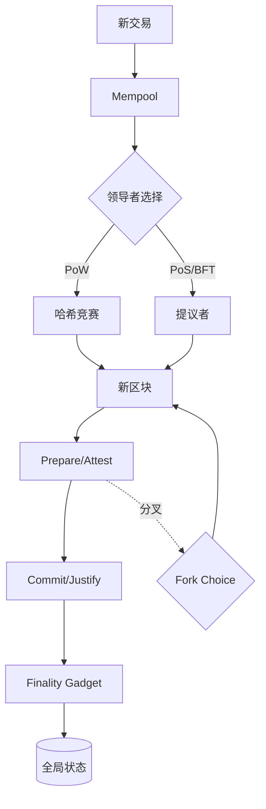

# 共识协议总览（Consensus Protocols Overview）

> **TL;DR**：区块链共识协议的核心目标是"让互不信任的参与者在分布式账本上就一组有序交易达成一致"。主流协议按是否"中本聪系（Nakamoto-style, 概率终局）"与"BFT 系（经典拜占庭容错, 确定性终局）"两大分支，再延伸出 PoS/DPoS、HotStuff 流水线、Avalanche 亚采样、PoH 时间戳等变体。所有协议都在 **CAP 不可能性** 与 **FLP 不可能性** 的理论约束下工作，并在 **安全（Safety）- 活性（Liveness）- 去中心化（Decentralization）** 三角中做取舍。本文给出分类学、理论下界与横向对比大表，为后续九篇细分协议打地基。

## 1. 背景与动机

"分布式一致性"问题比区块链古老得多。1978 年 Lamport 在 [《Time, Clocks, and the Ordering of Events in a Distributed System》](https://lamport.azurewebsites.net/pubs/time-clocks.pdf) 中定义了偏序/因果序；1982 年 Lamport、Shostak、Pease 在 [《The Byzantine Generals Problem》](https://lamport.azurewebsites.net/pubs/byz.pdf) 中证明，若要容忍 `f` 个任意故障节点，则需至少 `3f+1` 个诚实节点；1985 年 Fischer、Lynch、Paterson 的 FLP 定理证明：**在异步网络中，只要存在一个故障节点，就不存在确定性的共识算法**。这些结果意味着任何"实用"共识必须放宽假设——要么放弃确定性（概率共识），要么放弃异步（部分同步/同步模型），要么放弃容错上限。

90 年代以来，学术界基于上述不可能结果发展出两条主线：

- **BFT 主线**：Castro & Liskov 1999 年 [《Practical Byzantine Fault Tolerance》](https://pmg.csail.mit.edu/papers/osdi99.pdf)（PBFT）在部分同步模型下给出 `O(n²)` 消息复杂度的三阶段投票协议，成为 Tendermint、HotStuff、DiemBFT 的祖先。
- **Paxos/Raft 主线**：假设非拜占庭故障（崩溃故障，CFT），广泛用于传统分布式数据库与区块链的配置管理模块（如 etcd、Apache Kafka）。

2008 年中本聪的 [《Bitcoin: A Peer-to-Peer Electronic Cash System》](https://bitcoin.org/bitcoin.pdf) 开辟了第三条路——"工作量证明 + 最长链规则 + 随机领导者选择"。它牺牲了确定性终局（Probabilistic Finality），换来了开放的 **无许可（Permissionless）** 节点加入，并把节点身份（Sybil 抵抗）绑定在**物理算力**上。这套范式被称为 **Nakamoto Consensus**。

自此，公链共识设计主要围绕三个议题：

1. **Sybil 抵抗**：PoW（算力）、PoS（权益）、PoA（许可集合）、PoSpace/Time（空间-时间）等。
2. **领导者选择与出块机制**：概率随机（最长链/最重链）、轮换（Round-Robin）、VRF 随机、HotStuff 流水线。
3. **终局性**：概率终局（区块被回滚概率随确认数指数衰减）vs 确定性终局（BFT 2/3 签名一旦完成，Safety 在容错假设下永不被打破）。

区块链共识的"独特性"在于三点：**开放节点集**、**经济安全**（51% 攻击成本用 TWD/$ 计）、**激励兼容**（无可信协调者）。因此纯 PBFT 这类"许可链"算法不能直接移植到 L1 公链——必须先解决 Sybil 抵抗和经济激励问题（即 PoS、PoW 的本质角色）。

## 2. 核心原理（共识理论的形式化底座）

### 2.1 形式化定义：Safety、Liveness 与 Finality

一个**状态机复制（State Machine Replication, SMR）**协议 Π 在网络模型 M 下满足共识，要求：

- **Agreement（Safety-1）**：任意两个诚实节点若输出区块序列 `S_A` 与 `S_B`，则 `S_A` 是 `S_B` 的前缀或相反。形式化：`∀ i, j (honest), ∀ h: |S_i|, |S_j| ≥ h → S_i[h] = S_j[h]`。
- **Validity（Safety-2）**：输出的交易必须由某客户端合法提交且满足状态转换函数 δ。
- **Liveness**：若一笔诚实交易被广播，则在某有限时间 τ 后会进入所有诚实节点的输出序列。

在 Nakamoto 共识下，Safety 被放宽为 **概率 Safety**：`Pr[rollback of block at depth k] ≤ (q/p)^k`，其中 `p` 为诚实算力比、`q` 为攻击者算力比（见 [中本聪白皮书附录](https://bitcoin.org/bitcoin.pdf) 的二项式分析）。在 BFT 协议下，Safety 是**无条件的**，条件是恶意节点 `f < n/3`。

**Finality 终局性**分三层：

1. **Probabilistic Finality**：Bitcoin 6 confirmation，回滚概率 < 0.1%（假设 q=0.1）。
2. **Economic Finality**：Ethereum Casper FFG 下，回滚一个 justified checkpoint 需至少 1/3 stake 被 slash，经济上不可行。
3. **Deterministic Finality**：Tendermint/HotStuff 一旦 2/3 预提交投票到位，立即终局。

### 2.2 CAP 与 FLP：共识的理论天花板

**CAP 定理**（Brewer 2000，Gilbert-Lynch 2002 [证明](https://users.ece.cmu.edu/~adrian/731-sp04/readings/GL-cap.pdf)）：分布式系统在 **Consistency / Availability / Partition-tolerance** 三者中最多占两项。区块链默认选择 CP 或 AP：

- **BFT 家族（Tendermint）**：CP，网络分区时停止出块（活性损失但安全）。
- **Nakamoto 家族（Bitcoin）**：AP，网络分区时两侧都继续出块，合并时以最长链收敛（可能回滚，牺牲即时一致性）。

**FLP 不可能性**：异步网络下没有确定性共识能同时满足 Agreement、Validity、Termination。实用共识通过三条途径绕过：

1. **部分同步假设**：Dwork-Lynch-Stockmeyer 1988 引入 GST（Global Stabilization Time）模型，Tendermint/HotStuff/Casper 均基于此。
2. **随机化**：Ben-Or 1983、Nakamoto 共识通过概率性领导者选择，以"几乎必然"终止。
3. **同步假设**：Dfinity、Algorand 的强同步模型假设消息在 Δ 时间内送达。

### 2.3 子机制拆解

共识协议可拆成 6 个可组合子模块：

1. **Sybil 抵抗（Sybil Resistance）**：PoW 哈希工作、PoS 质押锁定、PoA 白名单、PoH 时间记录。本质是"让新节点加入/占坑变得昂贵"。
2. **领导者选择（Leader Election）**：PoW 的隐式随机（谁先算出哈希）、PoS 的 VRF/RANDAO、BFT 的轮换 Round-Robin、DPoS 的投票选举、HotStuff 的 view-change。
3. **投票与聚合（Voting & Aggregation）**：BFT 系的 `(prepare, pre-commit, commit)` 三阶段、Casper FFG 的 Justification/Finalization、Avalanche 的亚采样投票（k 节点采样）。签名聚合常用 BLS12-381（Ethereum）或 Ed25519（Cosmos）。
4. **分叉选择（Fork Choice）**：Bitcoin 最长链（Heaviest Work）、Ethereum LMD-GHOST（Latest Message Driven GHOST）、Avalanche 的 Snowman 偏好计数、Tendermint 单链无分叉。
5. **终局机制（Finality Gadget）**：Casper FFG 运行在 LMD-GHOST 之上的双层结构、Polkadot GRANDPA 运行在 BABE 之上、Mina 用 zkSNARK 递归压缩。
6. **激励与惩罚（Incentive & Slashing）**：PoW 出块奖励 + 交易费；PoS issuance + slashing；DPoS 投票分红；Restaking AVS 附加收益。

### 2.4 关键参数表（常量速查）

| 协议 | 出块时间 | Finality Gap | Byz 容错上限 | 签名方案 | 可治理 |
| --- | --- | --- | --- | --- | --- |
| Bitcoin PoW | ~10 分钟 | ~60 分钟（6 conf） | 51% 算力 | ECDSA-secp256k1 | 硬分叉 |
| Ethereum Gasper | 12 秒（slot）/ 6.4 分钟（epoch） | ~12.8 分钟（2 epoch） | 1/3 stake | BLS12-381 | EIP/硬分叉 |
| Solana PoH+TowerBFT | 400ms slot | ~12.8 秒（Optimistic）~31 秒（Rooted） | 1/3 stake | Ed25519 | SIMD |
| Cosmos Tendermint | ~6 秒 | 1 块（即时） | 1/3 stake | Ed25519 | 治理投票 |
| Avalanche Snowman | ~1-2 秒 | ~1-2 秒 | 1/5 stake（参数可调） | BLS | 治理 |
| Aptos DiemBFTv4 | ~250ms | ~900ms（3-chain commit） | 1/3 stake | BLS | 治理 |
| Sui Mysticeti | ~250ms | ~500ms | 1/3 stake | BLS | 治理 |

> 数据口径：来自各链 2025 Q3-Q4 实测与官方文档，截至 2026-04-22 验证。Sui Mysticeti 自 2024 年 Q3 上线（[Sui 博客](https://sui.io/blog)）。

### 2.5 边界条件与失败模式

- **算力/权益 51% 集中**：PoW 允许双花攻击；PoS 允许 slashing-based 经济惩罚，但短期仍可双花（长程攻击、弱主观性问题）。
- **网络分区**：BFT 停摆（牺牲 Liveness）；Nakamoto 分叉后合并（可能回滚已确认交易）。
- **时钟漂移**：PoH 依赖单机序列 CPU；Tendermint 要求 BFT time 中位数。时钟异常可能导致 slashing。
- **Validator 流失**：Ethereum 的 Inactivity Leak 机制会在 4+ epoch 无法 finalize 时自动扣除离线验证者 stake，确保剩余 2/3 能重新 finalize。

### 2.6 状态机图示



## 3. 架构剖析

### 3.1 分层视图：共识在协议栈中的定位

自顶向下分 5 层：

1. **Execution Layer**：EVM / SVM / MoveVM，消费共识输出的有序交易。
2. **Consensus Layer**：本文主题，负责"将无序 mempool 转为有序区块链"。
3. **Networking Layer**：libp2p / gossipsub / QUIC / Turbine，负责消息传播。
4. **Cryptography Layer**：BLS 聚合签名、VRF、哈希函数、Merkle 树。
5. **Storage Layer**：LevelDB / RocksDB / MDBX，存 Block、State、Receipts。

**模块化区块链**（Celestia、EigenDA）把上述五层解耦——共识层只做排序与数据可用性，执行层外包给 Rollup。这也是 2024-2026 年 L1 设计的主流范式。

### 3.2 核心模块清单（映射源码目录）

| 模块 | 职责 | 典型源码目录 | 可替换性 |
| --- | --- | --- | --- |
| Block Producer | 打包交易、生成区块 | `prysm/beacon-chain/rpc/validator/proposer/`、`go-ethereum/miner/` | 中（需改 API） |
| Fork Choice | 选择规范链 | `prysm/beacon-chain/forkchoice/`、`go-ethereum/eth/protocols/eth/` | 低 |
| Attestation Pool | 收集验证者投票 | `prysm/beacon-chain/operations/attestations/`、`lighthouse/beacon_node/operation_pool/` | 中 |
| Finality Gadget | FFG 检查点 | `prysm/beacon-chain/core/epoch/`、`consensus-specs/specs/phase0/beacon-chain.md` | 低 |
| Slashing Detector | 双签检测 | `prysm/beacon-chain/slashings/`、`lighthouse/beacon_node/slasher/` | 中 |
| Sync Service | 追赶主链 | `prysm/beacon-chain/sync/`、`go-ethereum/eth/downloader/` | 高 |
| P2P Layer | libp2p Gossipsub | `prysm/beacon-chain/p2p/`、`lighthouse/beacon_node/eth2_libp2p/` | 高 |
| Validator Client | 签名机 | `prysm/validator/`、`lighthouse/validator_client/` | 高 |
| Crypto BLS | 签名聚合 | `prysm/crypto/bls/`、`blst` 库 | 低 |
| Database | 状态持久化 | `prysm/beacon-chain/db/kv/`、`lighthouse/beacon_node/store/` | 中 |

### 3.3 端到端数据流：从 Tx 到 Finality

以 Ethereum Gasper 为例追踪一条交易：

1. **T+0ms**：用户签名交易，RPC 广播 → Execution Layer mempool（`geth/txpool`）。
2. **T+0–12000ms（下一个 slot）**：Beacon 提议者（由 RANDAO 选出）调用 engine API `engine_forkchoiceUpdatedV3` 要求 Execution 构造 ExecutionPayload。
3. **T+12000ms**：区块通过 libp2p gossipsub `/eth2/beacon_block/ssz_snappy` 广播。
4. **T+12000–16000ms**：32 个 committee 之一的 ~1/32 验证者在 slot 的前 4 秒内对该 block attest（[consensus-specs](https://github.com/ethereum/consensus-specs/blob/dev/specs/phase0/validator.md)）。
5. **T+0 ~ T+384s（一个 epoch = 32 slot = 6.4 分钟）**：所有 ~1M 验证者完成对本 epoch 的 attestation，聚合为 Epoch 的 justification vote。
6. **T+768s（2 个 epoch）**：若连续两个 epoch justified，首个 epoch 升级为 Finalized。
7. **Finalized 后**：Execution Layer 将该区块标记 `finalized`，RPC 用户可通过 `eth_getBlockByNumber("finalized")` 读。

### 3.4 客户端多样性

| 链 | 共识客户端 | 语言 | 市占（2024 Q4） |
| --- | --- | --- | --- |
| Ethereum | Prysm | Go | ~34% |
| Ethereum | Lighthouse | Rust | ~31% |
| Ethereum | Teku | Java | ~20% |
| Ethereum | Nimbus | Nim | ~10% |
| Ethereum | Lodestar | TypeScript | ~5% |
| Cosmos | CometBFT | Go | ~100% |
| Solana | Agave (Anza fork) | Rust | ~80%（2025 H2） |
| Solana | Firedancer (Jump) | C/C++ | ~20%（逐步上量） |
| Avalanche | AvalancheGo | Go | ~100% |

> 来源：[clientdiversity.org](https://clientdiversity.org/) 持续监测。客户端单一点是重大尾部风险——2023 年 5 月 Prysm 曾因 bug 导致 Ethereum 主网 finality 停摆 25 分钟（[postmortem](https://offchain.medium.com/post-mortem-report-ethereum-mainnet-finalisation-25-05-2023-95309dcb4b0d)）。

### 3.5 扩展与互操作接口

- **Ethereum Engine API**（[EIP-3675](https://eips.ethereum.org/EIPS/eip-3675)、[Engine API Spec](https://github.com/ethereum/execution-apis/tree/main/src/engine)）：CL↔EL 通信。
- **Cosmos ABCI 2.0**：CometBFT 与应用层 ABCI app 的接口。
- **IBC**（[ibc-go](https://github.com/cosmos/ibc-go)）：跨链消息传递，依赖 Tendermint 的确定性终局。
- **CometBFT RPC**：`/block`、`/commit`、`/validators`。

## 4. 关键代码：共识通用框架

以 `go-ethereum/consensus/consensus.go`（tag v1.14.0）为例，展示通用共识抽象：

```go
// consensus/consensus.go
// 所有共识引擎（Ethash、Clique、Beacon）必须实现 Engine 接口
type Engine interface {
    // 获取区块提议者地址
    Author(header *types.Header) (common.Address, error)
    
    // 验证区块头是否符合共识规则（难度、时间戳、签名）
    VerifyHeader(chain ChainHeaderReader, header *types.Header) error
    
    // 批量验证（用于同步追赶）
    VerifyHeaders(chain ChainHeaderReader, headers []*types.Header) (chan<- struct{}, <-chan error)
    
    // 验证 Uncle 块（仅 PoW 相关）
    VerifyUncles(chain ChainReader, block *types.Block) error
    
    // 准备区块头：设置难度、时间戳
    Prepare(chain ChainHeaderReader, header *types.Header) error
    
    // 完成区块：计算状态根、应用奖励
    Finalize(chain ChainHeaderReader, header *types.Header, state *state.StateDB, 
             txs []*types.Transaction, uncles []*types.Header, withdrawals []*types.Withdrawal)
    
    // 密封区块（PoW 挖矿或 PoS 签名）
    Seal(chain ChainHeaderReader, block *types.Block, results chan<- *types.Block, stop <-chan struct{}) error
    
    // 计算下一个区块难度
    CalcDifficulty(chain ChainHeaderReader, time uint64, parent *types.Header) *big.Int
}
```

此抽象允许 geth 在 The Merge 时从 Ethash 切换到 Beacon consensus（实际出块决策委托给 CL），只需替换 Engine 实现。

## 5. 演进时间线

| 年份 | 里程碑 | 影响 |
| --- | --- | --- |
| 1982 | Lamport 拜占庭将军论文 | 奠定 BFT 理论基础 |
| 1985 | FLP 不可能性定理 | 明确异步确定性共识不可能 |
| 1999 | Castro & Liskov PBFT | 首个实用 BFT，三阶段投票 |
| 2008 | 中本聪发布 Bitcoin 白皮书 | PoW + 最长链，首个无许可共识 |
| 2012 | PPCoin 首个 PoS 链 | Sunny King 提出"币龄"机制 |
| 2014 | Tendermint 白皮书（Jae Kwon） | PBFT + PoS，Cosmos 诞生 |
| 2017 | Casper FFG / TFG 草案（Vitalik） | Ethereum PoS 转型开始 |
| 2018 | HotStuff 论文（VMware Research） | 线性消息复杂度，Libra/Diem 采用 |
| 2018 | Avalanche 论文（Team Rocket） | 亚采样共识 |
| 2020 | Beacon Chain 上线（12/01） | Ethereum PoS 启动 |
| 2022 | Ethereum The Merge（09/15） | 完成 PoS 转型，能耗降 99.95% |
| 2022 | Aptos 主网（10/17，DiemBFTv4） | 生产级 HotStuff 变体 |
| 2022 | Narwhal-Bullshark 论文 | DAG 型 mempool + 共识 |
| 2024 | Sui Mysticeti 上线 | DAG 原生共识，亚秒终局 |
| 2024 | Firedancer 灰度（Solana） | 多客户端化 |

## 6. 实战示例：用一个表对比 9 个协议

下面是本章将展开的九个子主题在关键维度的横向对照。**请读者记住此表，后续 8 篇单协议文章会逐列深挖**：

| 协议 | Sybil | 领导者 | Finality | Byz 上限 | 典型链 | 出块延迟 |
| --- | --- | --- | --- | --- | --- | --- |
| PoW (Nakamoto) | 算力 | 隐式随机 | Probabilistic | 50% | Bitcoin, Litecoin | 10min |
| PoS (Gasper) | 权益 | RANDAO+Proposer | Economic (FFG) | 33% | Ethereum | 12s/6.4min |
| DPoS | 投票权益 | Round-Robin | Near-instant | 33% | EOS, Tron, BSC | 0.5-3s |
| Tendermint BFT | 权益 | Round-Robin | Deterministic | 33% | Cosmos Hub, Osmosis | 6s |
| HotStuff/DiemBFTv4 | 权益 | Pacemaker Rotation | Deterministic (3-chain) | 33% | Aptos | 250ms |
| Narwhal-Mysticeti | 权益 | DAG 证书 | Deterministic | 33% | Sui | 500ms |
| PoH + Tower BFT | 权益 | Leader Schedule | Optimistic + Rooted | 33% | Solana | 400ms |
| Avalanche Snowman | 权益 | 亚采样投票 | Probabilistic→Det. | 20%-50% | Avalanche | 1-2s |

## 7. 安全视角：不可能三角与历史教训

- **Solana 2022-09-30 连续停机**（[postmortem](https://status.solana.com/incidents/mb7m9l5z2z7w)）：见 `poh.md`。根本原因：单客户端 + 单领导者 + 交易风暴。
- **Ronin Bridge 2022-03-23 被盗 $625M**（[Ronin postmortem](https://roninblockchain.substack.com/p/community-alert-ronin-validators)）：9 个 PoA 验证者中 5 个私钥被 Lazarus 接管，BFT Byz 上限失效。见 `bft-family.md`。
- **Terra Luna 2022-05 崩盘**：虽直接原因是 UST 脱锚，但暴露出"PoS 代币市值骤降 → 共识安全预算骤降"的反身性风险，见 `pos.md` 与 `staking.md`。

## 8. 与同类方案对比：分类坐标轴

```
                 确定性终局
                     ▲
        HotStuff ●   │   ● Tendermint
      Mysticeti ●    │
                ● Aptos           ● Cosmos
  ───────────────────┼───────────────────► 去中心化
      ● Avalanche    │
                     │
              ● Solana (PoH)
     概率终局 ◀─────┼──── Bitcoin ●
                     ▼        Ethereum ●
                 概率终局
```

纵轴：终局性；横轴：Validator 规模与去中心化（越右越去中心化）。Ethereum 在"高度去中心化（百万验证者） + 经济终局（2 epoch）"平衡点独特，是 2026 年 L1 设计的标杆。

## 9. 延伸阅读

- **Tier 1**：
  - [Bitcoin Whitepaper](https://bitcoin.org/bitcoin.pdf) — Nakamoto 共识起源
  - [Ethereum Consensus Specs](https://github.com/ethereum/consensus-specs) — Gasper 官方规范
  - [PBFT Paper (1999)](https://pmg.csail.mit.edu/papers/osdi99.pdf) — BFT 祖先
  - [HotStuff Paper (2018)](https://arxiv.org/abs/1803.05069) — 线性复杂度 BFT
  - [Narwhal-Tusk Paper (2022)](https://arxiv.org/abs/2105.11827) — DAG mempool
- **Tier 2/3**：
  - Vitalik: [What's the difference between Nakamoto, HotStuff, Casper](https://vitalik.eth.limo/general/2020/11/06/pos2020.html)
  - Paradigm: [The Cosmos Hub is Ethereum's Biggest Competitor](https://www.paradigm.xyz/)
  - a16z: [Consensus mechanisms in the time of EIP-4844](https://a16zcrypto.com/)
  - learnblockchain.cn 共识专栏
- **相关 EIP / CIP**：
  - [EIP-2982](https://eips.ethereum.org/EIPS/eip-2982) — Serenity Phase 0
  - [EIP-7251](https://eips.ethereum.org/EIPS/eip-7251) — MaxEB 提升至 2048 ETH

## 10. 术语表

| 术语 | 英文 | 释义 |
| --- | --- | --- |
| 拜占庭容错 | Byzantine Fault Tolerance (BFT) | 容忍任意恶意故障的共识类别 |
| 崩溃故障容错 | Crash Fault Tolerance (CFT) | 只容忍宕机故障，如 Raft、Paxos |
| 部分同步 | Partial Synchrony | DLS 1988 模型，GST 之后消息有界延迟 |
| 领导者轮换 | View Change | BFT 协议中当前 leader 故障后切换新 leader |
| 分叉选择 | Fork Choice | 多条候选链中选定规范链的规则 |
| 弱主观性 | Weak Subjectivity | 新节点需信任近期 checkpoint 才能同步 |
| 经济终局 | Economic Finality | 回滚需要承担可量化经济损失 |
| 活性 | Liveness | 合法交易最终会被确认 |
| 安全 | Safety | 已确认的交易不会被回滚 |
| Slashing | Slashing | 对恶意或双签验证者的质押惩罚 |

---

*Last verified: 2026-04-22*
