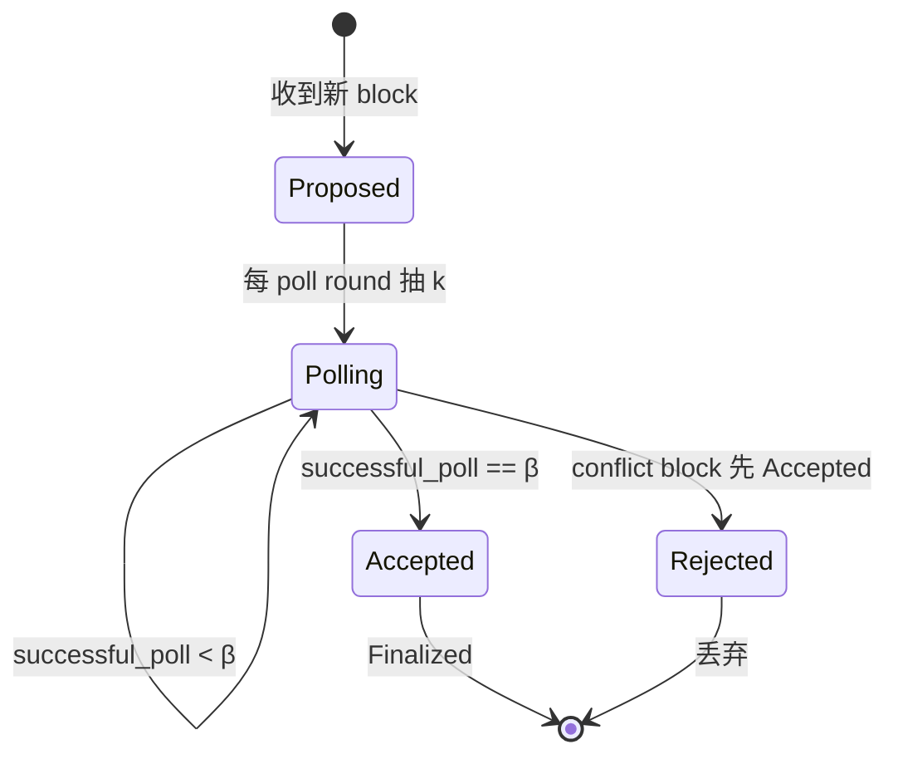

# Avalanche 共识（Snowflake → Snowball → Avalanche → Snowman）

> **TL;DR**：Avalanche 共识由 Team Rocket（化名）2018 年首次发表、2019 年由 Emin Gün Sirer 等人正式推出，是首个被生产化的 **亚采样（sub-sampled voting）** BFT 协议。核心范式："每个节点反复问少量（k ≈ 20）随机节点的意见，若多数（α ≈ 15）持同一意见则切换自己的偏好，持续 β ≈ 20 轮后做出决策。" 元稳定性（metastability）被 β 轮累计消除后达终局。协议链由 4 部分组成：Slush → Snowflake（计数） → Snowball（计数 + 置信） → Avalanche（DAG 版） / Snowman（链式）。Avalanche 主网自 2020-09 上线，采用 Snowman 作为 P-Chain/C-Chain 共识。本文从数学上推导亚采样投票的概率收敛性，剖析参数 (k, α, β) 的安全边界，并对比 PBFT。

## 1. 背景与动机

在 PBFT/HotStuff 家族中，每个 validator 必须与**所有** validator 通信（`O(n)` 或 `O(n²)` 消息），限制了网络规模（<200 节点）。Nakamoto 共识允许任意规模但代价是慢确认。2018 年 5 月 Team Rocket 发表 [Snowflake to Avalanche](https://web.archive.org/web/20180521204109/https://ipfs.io/ipfs/QmUy4jh5mGNZvLkjies1RWM4YuvJh5o2FYopNPVYwrRVGV) 技术报告，提出第三条路：**随机亚采样投票**，消息复杂度 `O(k log n)`，其中 `k ≈ 20` 与 n 无关。

关键洞察：若每个节点不断从全网随机选 k 个邻居，问"你认为哪个交易是合法的"，多数节点最初意见可能分裂，但**随机抽样会放大初始偏差**——若 50.1% 支持 A，随机 20 抽样中 A 占多数的概率远高于 50%，经过多轮后全网**几乎必然**收敛到同一意见。

Avalanche 的理论贡献：
1. 消息复杂度与网络规模**近乎无关**（log 级）。
2. 支持**超大验证者集**（~1500 活跃 + 数千备选，截至 2025 Q3 [avascan.info](https://avascan.info/)）。
3. 高吞吐（DAG 版的 Avalanche 协议可平行验证非冲突交易）。

代价：只是**概率终局**（虽可通过 β 参数调到任意高概率），在严格 BFT 定义下不是确定性终局。

## 2. 核心原理

### 2.1 渐进式推导

**第一阶段 — Slush**：最基础，仅一轮。节点有 initial color（R/B），每轮随机抽 k 个邻居，若 ≥ α 同色就切换到该色。只做 m 轮后停止。问题：无记忆，可能被反复拉锯，没有终局信号。

**第二阶段 — Snowflake**：引入 counter。若当前 sample 多数颜色与自己一致，计数 +1；若不一致，counter 重置为 1 并切换颜色。当 counter ≥ β 就 finalized。解决了终局问题，但 counter 清零太敏感，被网络噪声干扰。

**第三阶段 — Snowball**：引入 confidence vector。每颜色有独立 confidence count（不重置），当前 preference = confidence 最高者。若 sample 多数颜色的 confidence > 当前 preference，切换。Snowball 比 Snowflake 更稳健，是 Avalanche 系的基础。

**第四阶段 — Avalanche**（DAG）/ **Snowman**（链）：将 Snowball 应用到每个交易节点上，多条并发。Avalanche 协议允许无冲突 tx 平行确认；Snowman 将所有交易线性排序，性能更高但失去并行。Avalanche 主网 C-Chain 采用 **Snowman**。

### 2.2 形式化：亚采样投票的收敛定理

设网络有 n 个节点，分布式进程运行 Snowball，每轮每节点抽 k 个样本。设 β 个节点中 q 为 Byzantine。

**定理**（Team Rocket 2018，Thm 5.1 形式化）：若 α > k/2（即多数决），且诚实节点初始偏好比例差 `Δ` ≥ 某阈值，则全网收敛到多数颜色的概率为：

```
P(converge to majority) ≥ 1 - exp(-Ω(β · Δ²))
```

即 β 轮累计指数衰减错误概率。实践参数 `(k=20, α=15, β=20)` 可达 `safety failure probability < 2⁻⁴⁰`。

**Byzantine 容错**：若攻击者控制 O (< c · n) 个节点且网络同步，Avalanche safety 以高概率保持。严格容错比例 c 取决于 (k, α)：若 α = 0.8k，则攻击者需 > 20% 节点才能维持元稳定（metastability）攻击，这解释了 Avalanche 文档标称 "~20% Byzantine tolerance"。但注意：此容错是 **probabilistic**，β 越大容错越接近 50%。

### 2.3 关键数据结构

```go
// avalanchego/snow/consensus/snowball/unary_snowball.go
type unarySnowball struct {
    numSuccessfulPolls int  // β 计数
    finalized          bool
}

// avalanchego/snow/consensus/snowman/topological.go
type Topological struct {
    metrics     *metrics
    ctx         *snow.ConsensusContext
    params      snowball.Parameters
    head        ids.ID                   // 当前选定的 head block
    blocks      map[ids.ID]*snowmanBlock // 所有已知 block
    preferredIDs set.Set[ids.ID]         // 当前偏好链
    ...
}
```

### 2.4 子机制拆解

**子机制 1：Poll / Query**
节点对一个 container（block 或 tx）询问 k 个随机 validator：`AppRequest`，validator 回复 "yes/no"。

**子机制 2：Bag 聚合**
收集 k 个回复，若 ≥ α yes，记为 "successful poll"。

**子机制 3：Confidence Update**
对该 container 的 confidence +1；若 confidence > 其他兄弟 container 的 confidence，切换 preference。

**子机制 4：Finalize**
连续 β 次 successful poll 后 finalize。Avalanche 默认 `β₁ = 15`（virtuous，无冲突）、`β₂ = 20`（rogue，有冲突，需更严）。

**子机制 5：Virtuous vs Rogue Fork**
无冲突 tx（仅占用不同 UTXO）→ virtuous，低 β；有冲突 → rogue，高 β。源码 `snow/consensus/snowman/block.go`。

**子机制 6：Subnet / X-Chain / C-Chain / P-Chain**
- **P-Chain**：Platform Chain，管理 validator、subnet。Snowman。
- **X-Chain**：Exchange Chain，AVAX UTXO 交易。Avalanche DAG。
- **C-Chain**：Contract Chain，EVM 兼容。Snowman。
- **Subnet**：应用链，可自定义共识参数。

### 2.5 参数表

| 参数 | 默认值 | 说明 |
| --- | --- | --- |
| k (sample size) | 20 | 每轮抽样数 |
| α (quorum) | 15 (= 0.75k) | 成功 poll 阈值 |
| β₁ (virtuous) | 15 | 无冲突 tx 终局 |
| β₂ (rogue) | 20 | 冲突 tx 终局 |
| MinimumValidatorStake | 2000 AVAX | validator 门槛 |
| Max Active Validators | ~1500 | 2025 Q3 实测（[avascan.info](https://avascan.info/)） |
| P-Chain block time | ~1-2s | 动态 |
| C-Chain block time | ~2s | |
| Uniform Sampler | stake-weighted | 概率抽样按 stake |

### 2.6 状态图



## 3. 架构剖析

### 3.1 分层视图（AvalancheGo）

1. **Virtual Machine (VM) Layer**：C-VM（EVM 分叉）、X-VM、Subnet VM。
2. **Consensus Engine**：Snowman/Avalanche 核心。
3. **Network Layer**：AppGossip + AppRequest/Response，TLS + Ed25519。
4. **State DB**：Merkle DB。
5. **Platform Layer**：P-Chain 管理 validator 集和 subnet 订阅。

### 3.2 核心模块清单

| 模块 | 职责 | 源码 | 可替换 |
| --- | --- | --- | --- |
| Snowman Consensus | 链式共识 | `avalanchego/snow/consensus/snowman/` | 低 |
| Avalanche Consensus | DAG 共识 | `avalanchego/snow/consensus/avalanche/` | 低 |
| Snowball Core | 亚采样算法 | `avalanchego/snow/consensus/snowball/` | 低 |
| Chain Manager | 多链并发 | `avalanchego/chains/manager.go` | 中 |
| Network Handler | P2P TLS | `avalanchego/network/` | 中 |
| Validator Manager | Validator Set | `avalanchego/vms/platformvm/validators/` | 中 |
| VM Plugin | C-Chain、X-Chain | `avalanchego/vms/` | 高（subnet） |
| Bootstrap | 冷启同步 | `avalanchego/snow/engine/common/` | 中 |
| RPC | HTTP + WS | `avalanchego/api/` | 高 |

### 3.3 端到端数据流（C-Chain）

1. **T+0**：用户通过 MetaMask 发 EVM tx 到 C-Chain RPC `eth_sendRawTransaction`。
2. **T+0-100ms**：tx 进入 coreth 的 mempool。
3. **T+100-1000ms**：coreth 构造 block（含 EVM 执行），交给 Snowman。
4. **Snowman 询问**：本地 validator 抽 k=20 个其他 validator 问 `ChitsMessage`（支持哪个 block？）。
5. **Confidence 积累**：β=15-20 轮 successful poll 后 accepted。
6. **T+1-2s**：block finalized，RPC 返回 `Finalized`。

### 3.4 客户端多样性

- **AvalancheGo** (Go)：Ava Labs 维护，~100% 市占。
- **Subnet-EVM**（Rust/Go 插件）：主要用于应用链。
- **FUJI Testnet** 跑同一客户端。

客户端单一是 Avalanche 的重大风险。2024 年 Ava Labs 曾讨论 Rust rewrite 但无公开时间表。

### 3.5 接口

- **JSON-RPC**：C-Chain 兼容 Ethereum API；X/P-Chain 自定义 `platform.getValidators` 等。
- **HRP API**：[API reference](https://docs.avax.network/api-reference)。
- **Subnet SDK**：允许开发者定制共识参数（Warp Messaging）。
- **Warp Messaging (2023)**：subnet 间消息传递，利用 BLS 聚合签名。

## 4. 关键代码：Snowball 核心

```go
// avalanchego/snow/consensus/snowball/tree.go  (v1.10.x)
func (t *Tree) RecordPoll(votes bag.Bag[ids.ID]) bool {
    // 寻找 votes 中 majority 对应的 choice
    pollSuccessful := false
    maxChoice, numVotes := votes.Mode()
    // α 阈值检查
    if numVotes < t.params.AlphaPreference {
        t.RecordUnsuccessfulPoll()
        return pollSuccessful
    }
    // 更新 confidence
    preference := t.GetPreference()
    if maxChoice == preference {
        t.consecutiveSuccesses++
        if t.consecutiveSuccesses >= t.params.Beta {
            t.finalized = true  // 达成终局
            pollSuccessful = true
        }
    } else {
        // 切换到 majority
        t.consecutiveSuccesses = 1
        t.preference = maxChoice
    }
    return pollSuccessful
}
```

## 5. 演进时间线

| 年份 | 事件 |
| --- | --- |
| 2018-05 | Team Rocket 发布 Snowflake to Avalanche 技术报告 |
| 2019-06 | [Avalanche paper 正式 arXiv](https://arxiv.org/abs/1906.08936) |
| 2020-09-21 | 主网启动（3 链架构） |
| 2022-03 | Subnet 上线（任意链可定制共识） |
| 2023 | Warp Messaging（subnet 间通信） |
| 2023-06 | ACP-13（Durango）改良 VM 接口 |
| 2024-06 | Etna 升级，Subnet→L1（永久分离） |
| 2024 | HyperSDK 发布 |
| 2025 Q2 | Cortina 网络参数优化 |

## 6. 实战示例

```bash
# 启动本地 AvalancheGo
./avalanchego --network-id=local --staking-enabled=false
# C-Chain RPC 同 Ethereum
curl -X POST --data '{"jsonrpc":"2.0","method":"eth_blockNumber","params":[],"id":1}' \
     -H 'content-type:application/json;' http://localhost:9650/ext/bc/C/rpc
# 查询当前 validator 集合
curl -X POST --data '{"jsonrpc":"2.0","id":1,"method":"platform.getCurrentValidators","params":{}}' \
     -H 'content-type:application/json;' http://localhost:9650/ext/bc/P
```

## 7. 安全与已知攻击

- **Metastability 攻击**：理论攻击者不断在冲突 tx 之间投票制造拉锯。Team Rocket 2018 证明若 α > k/2 且 β 足够大，攻击者需 > 50% 节点才能长期维持，实践中 unfeasible。
- **Sybil 攻击**：通过 stake 门槛（2000 AVAX）抵御。
- **2024-03 P-Chain liveness 事件**：一次配置 bug 导致 P-Chain 出块 30 分钟延迟（[官方 status](https://status.avax.network/)）。非共识失败。
- **Subnet 验证者重叠风险**：2024 前 subnet validator 必须验证 Primary Network（C/X/P）；2024 ACP-77 引入 "L1" 概念允许独立 validator，降低主网安全迁移到 subnet 的风险。
- **理论批评**：Avalanche safety 是 probabilistic，跨链桥若需硬 finality 需额外等待 β' > β（实际 Avalanche 桥 wait 2 seconds + 10 block 共识）。

## 8. 与同类方案对比

| 维度 | Avalanche (Snowman) | PBFT | HotStuff | Solana PoH |
| --- | --- | --- | --- | --- |
| 消息复杂度 | O(k log n) | O(n²) | O(n) | O(n²) broadcast |
| Validator 规模 | ~1500 | <100 | <150 | ~1500 |
| Finality | Probabilistic (~1-2s) | Deterministic | Deterministic | Optimistic+Rooted |
| Byz 容错 | 20%-50%（参数调节） | 33% | 33% | 33% |
| 适应网络规模 | 极佳 | 差 | 中 | 中 |
| 出块时间 | 1-2s | ~3s | 250ms | 400ms |
| 终局保证 | 2⁻⁴⁰ 失败 | 绝对 | 绝对 | 绝对（Rooted） |
| 生产链 | Avalanche | BFT-SMaRt（研究） | Aptos, Flow | Solana |

**去中心化优势**：Avalanche 是目前唯一 validator 数超 1000 且出块 < 2s 的生产链；Ethereum validator 数更多但出块慢。

## 9. 延伸阅读

- **Tier 1**：
  - [Avalanche paper arXiv 2019](https://arxiv.org/abs/1906.08936)
  - [ava-labs/avalanchego](https://github.com/ava-labs/avalanchego)
  - [Avalanche Consensus docs](https://docs.avax.network/learn/avalanche/avalanche-consensus)
- **Tier 2/3**：
  - Messari Avalanche 年度报告
  - a16z [On sub-sampled consensus](https://a16zcrypto.com/)
  - Emin Gün Sirer Twitter 历史文档
  - learnblockchain.cn Avalanche 源码剖析
- **相关论文**：
  - Rocket et al. 2018 Whitepaper (v1)
  - Avalanche Platform Whitepaper v1.00 (2020)
  - [Frosty paper](https://arxiv.org/abs/2404.14250) — 2024 Snowman++ 改良

## 10. 术语表

| 术语 | 英文 | 释义 |
| --- | --- | --- |
| 亚采样 | Sub-sampling | 随机抽取 k 个节点投票 |
| 元稳定性 | Metastability | 系统在两稳定态间摇摆 |
| Slush / Snowflake / Snowball | 算法系列 | 复杂度递增 |
| Avalanche | Avalanche | DAG 版 Snowball |
| Snowman | Snowman | 链式 Snowball |
| k (sample size) | k | 每轮抽样数 |
| α (quorum) | α | 成功 poll 阈值 |
| β (threshold) | β | 连续成功次数终局阈值 |
| Subnet / L1 | Subnet / L1 | Avalanche 生态的应用链 |
| Virtuous / Rogue | Virtuous / Rogue | 无冲突 / 冲突交易 |

---

*Last verified: 2026-04-22*
