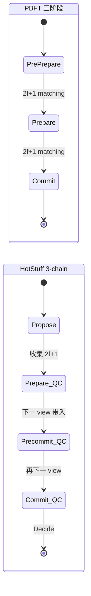

# BFT 共识家族（PBFT / Tendermint / HotStuff / Narwhal / Mysticeti）

> **TL;DR**：BFT 共识家族从 1999 年 Castro & Liskov 的 PBFT 开始，经 Tendermint/CometBFT、HotStuff、LibraBFT/DiemBFT/AptosBFTv4、Narwhal-Bullshark/Tusk/Mysticeti，演进出两条主线——**链式（chain-based）投票协议** 与 **DAG-based 共识**。BFT 协议的共性：部分同步假设、三阶段或多阶段投票、2/3 stake 法定人数、确定性终局。差异点：消息复杂度 `O(n²)` vs `O(n)`、leader-based vs leaderless、single-chain vs DAG、流水线深度。本文从 PBFT 原始三阶段推导到 DAG-based 的最新 Mysticeti，给出性能复杂度对比表。

## 1. 背景与动机

**PBFT 之前**：1982 Lamport 拜占庭将军只能解决同步模型；1988 Dwork-Lynch-Stockmeyer 引入部分同步但协议复杂。1999 Miguel Castro 与 Barbara Liskov 在 OSDI 发表 [《Practical Byzantine Fault Tolerance》](https://pmg.csail.mit.edu/papers/osdi99.pdf)，首次给出一个可在真实网络上跑的 BFT 协议——三阶段消息 (pre-prepare, prepare, commit) + view change，消息复杂度 `O(n²)`。

**区块链时代**：2014 年 Jae Kwon 发表 [Tendermint 白皮书](https://tendermint.com/static/docs/tendermint.pdf) 将 PBFT 与 PoS 结合，成为 Cosmos SDK 的共识内核。2018 年 VMware Research 的 Yin et al. 发表 [HotStuff 论文](https://arxiv.org/abs/1803.05069)，引入 **pipelining + threshold signature**，将消息复杂度降到 `O(n)`，这是 Libra（Facebook）/Diem/Aptos 的基础。

**DAG 时代**：2021 年 Danezis et al. 的 [Narwhal & Tusk 论文](https://arxiv.org/abs/2105.11827) 将 mempool 和共识解耦——Narwhal 负责可靠广播，Tusk/Bullshark 负责排序。2023 年 Mysten Labs 的 [Mysticeti 论文](https://arxiv.org/abs/2310.14821) 把共识 critical path 压到 3 个消息延迟，Sui 采用之。

动机三条线：
1. **降低消息复杂度**：从 PBFT 的 `O(n²)` 到 HotStuff 的 `O(n)`。
2. **提高吞吐**：mempool 与排序解耦（DAG）让 leader 不再是带宽瓶颈。
3. **支持 leader 失败**：view change 从 PBFT 的"同步等待 timeout"到 HotStuff 的"responsive pacemaker"。

## 2. 核心原理

### 2.1 PBFT 三阶段协议

模型：n 节点，f < n/3 拜占庭。部分同步。Leader（primary）选 `leader = view mod n`。

**三阶段**：

1. **Pre-Prepare**：Leader 收到 client 请求 `m`，广播 `<PRE-PREPARE, v, seq, digest(m)>`。
2. **Prepare**：每个 replica 收到后若合法，广播 `<PREPARE, v, seq, digest, node_id>` 给所有其他 replica。
3. **Commit**：收到 `2f+1` 个 matching Prepare（含自己），记为 `prepared(m, v, seq)`，广播 `<COMMIT, v, seq, digest, node_id>`。收到 `2f+1` 个 Commit 后，执行 `m` 并回复 client。

**View Change**：若 timer 超时（leader 失败），广播 `<VIEW-CHANGE, v+1, last_stable_ckpt, prepared_set>`。新 leader 收到 `2f+1` view-change 后广播 `NEW-VIEW`。

**消息复杂度**：每个正常阶段每对节点互相广播 1 个消息 → `O(n²)`；view change `O(n³)`（最坏）。

**Safety 定理**（Castro & Liskov 1999，Theorem 2）：若 `f < n/3`，则没有两个诚实 replica 会 commit 相同 seq 不同 digest。
**Liveness 定理**（同上，Theorem 3）：在 GST 后，请求最终被执行。

### 2.2 Tendermint

**区别于 PBFT**：

- **Round-based**：每个 height 内多个 round，每 round 有 propose / prevote / precommit 三阶段（对应 PBFT 的三阶段但术语不同）。
- **Lock-Unlock**：validator 在 `precommit` 阶段对一个 block 加 lock，只有看到更高 round 的 `polka`（2/3 prevote）才 unlock。
- **Finality 即时**：commit 后该 block 永不回滚。无分叉（Nakamoto 意义）。
- **验证者集动态变化**：每 block 可通过 governance tx 更新 validator set。

[CometBFT spec](https://github.com/cometbft/cometbft/blob/main/spec/consensus/consensus.md) 明确给出状态机：

```
NewHeight → NewRound → Propose → Prevote → Precommit → Commit → NewHeight
```

### 2.3 HotStuff 核心创新

HotStuff（[Yin et al. 2018](https://arxiv.org/abs/1803.05069)）四个关键创新：

1. **Threshold Signature / BLS 聚合**：取代 PBFT 的 `2f+1` 个单签名为一个聚合签名 QC（Quorum Certificate），消息复杂度降至 `O(n)`。
2. **线性 view change**：pacemaker 基于上一轮 QC 直接推进，无需额外 `O(n²)` 消息。
3. **Responsive**：leader 收齐 `2f+1` 签名即可推进，不用等最大 δ。
4. **3-chain commit rule**：block B 达到 commit 状态需要看到链 B←B'←B''←B''' 上三代 QC（Basic HotStuff）或 1-chain（Chained HotStuff）。

**Pipelining（Chained HotStuff）**：每轮 leader 提案 block 同时携带上轮 QC，一条消息承载多个阶段——`prepare(n)` 同时是 `pre-commit(n-1)` 同时是 `commit(n-2)` 同时是 `decide(n-3)`。实际 commit 需 3 个连续 QC 的 chain。

### 2.4 Narwhal + Bullshark + Mysticeti（DAG 共识）

**Narwhal**（mempool 层）：每 validator 定期生产 header（包含 batch digest + 上轮 2f+1 certificates 作为 parents），通过 Reliable Broadcast 扩散；2f+1 个 vote 后升级为 certificate。Certificate 形成 DAG，每轮每个 validator 最多 1 个 certificate。

**Bullshark**（共识层）：在 DAG 上每 2 轮选定 anchor（轮 leader 的 certificate），commit 时沿 anchor 做 DFS/BFS 确定顺序。零通信开销——只读本地 DAG。

**Mysticeti**（Sui 用，2023-2024）：把 Narwhal 的 Reliable Broadcast 简化为 Best-Effort Broadcast，将 commit 延迟压到 3 message delays（原 Bullshark ~5）。使用"implicit vote"：leader 的 block 含有上轮 2f+1 block 的 parents 即视为对它们的投票。

### 2.5 参数常量

| 协议 | f/n 上限 | 消息复杂度 | Finality 消息步数 | 主要实现 |
| --- | --- | --- | --- | --- |
| PBFT | 1/3 | O(n²) | 3 | UpRight, BFT-SMaRt |
| Tendermint | 1/3 | O(n²) | 3 | CometBFT |
| Basic HotStuff | 1/3 | O(n) | 4（3-chain） | Libra/Diem old |
| Chained HotStuff | 1/3 | O(n) | 3（pipelined） | Aptos, Flow |
| Fast-HotStuff (AptosBFTv4) | 1/3 | O(n) | 2（乐观） / 3 | Aptos ≥ v1.5 |
| Narwhal+Bullshark | 1/3 | O(n²) broadcast, O(n) consensus | ~5 | Sui（旧 Narwhal 时代） |
| Mysticeti | 1/3 | O(n²) broadcast | 3 | Sui（当前） |
| Avalanche Snowman | 20%-50% | O(k log n) 采样 | 概率 | Avalanche |

> 部分同步假设。Mysticeti 性能见 [Sui blog 2024-05](https://sui.io/blog/mysticeti-main)：主网测到 297K TPS，sub-second finality。

### 2.6 状态机示意



### 2.7 边界条件

- **Network Partition**：BFT 系在 minority partition 内停摆（CP），直到恢复。
- **> 1/3 恶意**：Safety 失守，可能出现两条 finalized 分叉。Tendermint/Cosmos 曾有 IBC 停摆历史（非 safety fault，但 liveness lost）。
- **Leader Crash**：HotStuff view change 自动推进，Tendermint 有 2·propose_timeout 等待。

## 3. 架构剖析

### 3.1 分层视图（CometBFT 为例）

1. **Application Layer**：通过 ABCI++ 接收 `CheckTx`、`FinalizeBlock`、`Commit` 回调。
2. **Consensus Layer**：`cometbft/consensus/state.go` 状态机。
3. **Mempool**：`cometbft/mempool/`。
4. **P2P**：`cometbft/p2p/`，MConnection 协议。
5. **Storage**：`cometbft/store/`，LevelDB/BadgerDB 存 Block/State。

### 3.2 核心模块清单

| 模块 | 职责 | 源码 | 可替换 |
| --- | --- | --- | --- |
| ConsensusReactor | 共识状态机 | `cometbft/consensus/state.go`、`reactor.go` | 低 |
| Mempool | 交易池 | `cometbft/mempool/v1/` | 高 |
| P2P Switch | 对等点管理 | `cometbft/p2p/` | 中 |
| PrivValidator | 签名机 | `cometbft/privval/` | 中（HSM） |
| EvidencePool | 双签证据 | `cometbft/evidence/` | 低 |
| BlockStore | 区块持久化 | `cometbft/store/` | 高 |
| StateStore | 状态持久化 | `cometbft/state/` | 高 |
| RPC | JSON-RPC 26657 | `cometbft/rpc/` | 高 |
| ABCI | 应用接口 | `cometbft/abci/` | 低（协议） |
| HotStuff Aptos | Aptos consensus | `aptos-core/consensus/src/` | 低 |

### 3.3 端到端数据流（Tendermint）

1. **T+0**：tx 进入 mempool，reactor gossip。
2. **Height=h 开始**：选定 proposer = `validators[(h + round) mod N]`。
3. **Propose 阶段**：proposer 广播 BlockProposal + PartSet。
4. **Prevote 阶段**：validator 验证 block，广播 Prevote。
5. **Precommit 阶段**：收到 `+2/3 Prevote`（"polka"）后锁定 block，广播 Precommit。
6. **Commit 阶段**：收到 `+2/3 Precommit` 后 finalize，广播到 P2P。
7. **ABCI FinalizeBlock**：应用状态变更。
8. **NewHeight h+1**：继续。

典型 block time：6 秒。

### 3.4 客户端多样性

- **Cosmos**：CometBFT（Go，Informal Systems 维护） ~100%。2023 前 Tendermint Core 改名后无其他实现。
- **Aptos**：`aptos-core`（Rust） ~100%。Movement、Solana-VM Labs 曾讨论 fork。
- **Sui**：`sui`（Rust） ~100%。Mysticeti 实现在 `sui-core/consensus/`.

### 3.5 接口

- **ABCI++**：`PrepareProposal`、`ProcessProposal`、`ExtendVote`、`VerifyVoteExtension`、`FinalizeBlock`（[ABCI++ spec](https://github.com/cometbft/cometbft/blob/main/spec/abci/README.md)）。
- **CometBFT RPC** 26657：`/block`、`/commit`、`/validators`、`/tx_search`。
- **Aptos REST API**：`/v1/transactions`、`/v1/blocks/by_height/{n}`。
- **Sui JSON-RPC**：`sui_getCheckpoint`、`sui_executeTransactionBlock`。

## 4. 关键代码：CometBFT 共识状态机

```go
// cometbft/consensus/state.go  (tag v0.38.x)
func (cs *State) enterPrevote(height int64, round int32) {
    logger := cs.Logger.With("height", height, "round", round)
    if cs.Height != height || round < cs.Round {
        logger.Debug("entering prevote step with invalid args")
        return
    }
    defer func() {
        cs.updateRoundStep(round, cstypes.RoundStepPrevote)
        cs.newStep()
    }()
    if cs.ProposalBlock == nil {
        logger.Debug("prevote step: ProposalBlock is nil; prevoting nil")
        cs.signAddVote(tmproto.PrevoteType, nil, types.PartSetHeader{})
        return
    }
    // 验证 block
    if err := cs.blockExec.ValidateBlock(cs.state, cs.ProposalBlock); err != nil {
        logger.Error("prevote step: ProposalBlock is invalid", "err", err)
        cs.signAddVote(tmproto.PrevoteType, nil, types.PartSetHeader{})
        return
    }
    // 如果已 lock 到某个 block，仅当 proposal 与 locked 一致才 prevote
    if cs.LockedBlock != nil && !cs.LockedBlock.HashesTo(cs.ProposalBlock.Hash()) {
        logger.Debug("prevote step: ProposalBlock differs from locked; prevoting nil")
        cs.signAddVote(tmproto.PrevoteType, nil, types.PartSetHeader{})
        return
    }
    // prevote for proposal
    cs.signAddVote(tmproto.PrevoteType, cs.ProposalBlock.Hash(), cs.ProposalBlockParts.Header())
}
```

## 5. 演进时间线

| 年份 | 协议 | 关键贡献 |
| --- | --- | --- |
| 1999 | PBFT | 首个实用 BFT |
| 2014 | Tendermint | BFT + PoS + Lock-Unlock |
| 2016 | Zyzzyva | 乐观路径优化 |
| 2018 | HotStuff | 线性消息 + pipelining |
| 2019 | LibraBFT v2 | HotStuff 变体 |
| 2020 | DiemBFT v3 | Liveness 改进 |
| 2021 | Narwhal + Tusk | DAG mempool |
| 2022 | Bullshark | DAG 共识下可用性 |
| 2022 | AptosBFTv4 / Fast-HotStuff | 乐观 2-round |
| 2023 | Mysticeti | 3 message delay |
| 2024 | Shoal++ | Bullshark 零 overhead 优化 |

## 6. 实战示例

```bash
# 启动 CometBFT + kvstore（教学）
cometbft init
cometbft node --proxy_app=kvstore
# 查询共识状态
curl http://localhost:26657/consensus_state | jq
# 提交 tx
curl 'http://localhost:26657/broadcast_tx_commit?tx="k=v"'
# 查看 validator set
curl http://localhost:26657/validators | jq
```

## 7. 安全与已知攻击

- **Cosmos Hub validator Sentinel key compromise 2022**：某验证者私钥泄露，双签导致被 slash。由 EvidencePool 自动检测 Double-Sign。
- **Ronin Bridge 2022-03-23 $625M**：9 个 PoA validator 中 5 个被社工接管，破坏 BFT 假设。教训：BFT 的 1/3 容错在许可链上等于"5/9 社工成功"，远低于 PoS 分布式假设。
- **Terra Classic 2022-05**：Tendermint 链本身未出 bug，但 UST 脱锚导致 LUNA 超高通胀，validator 的 stake 价值归零，反身性风险。
- **Aptos 2022-10 主网停摆**：某 mainnet 升级导致部分 validator consensus 状态机 panic，停机 ~5 小时。[Aptos post-mortem](https://aptoslabs.medium.com/)。
- **HotStuff 流水线 forensic 支持**：Zhang et al. 2023 证明 HotStuff 的 QC 可在 slash 时溯源恶意签名者，为 accountability 提供形式化证据。

## 8. 与同类方案对比

| 维度 | PBFT | Tendermint | HotStuff | Mysticeti | Avalanche |
| --- | --- | --- | --- | --- | --- |
| 消息复杂度 | O(n²) | O(n²) | O(n) | O(n²) 广播 | O(k log n) |
| Finality 延迟 | 3 message | ~6 s | 3 round | 3 msg | ~1 s |
| Leader 故障恢复 | O(n³) | O(n²) | O(n) | 无 leader（DAG） | 无 leader |
| 吞吐（实测 TPS） | ~1k | ~4k | ~10k | >100k | ~5k |
| 生产链 | BFT-SMaRt（研究） | Cosmos, Osmosis | Aptos, Flow | Sui | Avalanche |
| 验证者规模 | <100 | ~150 | ~150 | ~100 | ~1500 |

## 9. 延伸阅读

- **Tier 1**：
  - [PBFT paper 1999](https://pmg.csail.mit.edu/papers/osdi99.pdf)
  - [HotStuff paper 2018](https://arxiv.org/abs/1803.05069)
  - [Tendermint paper 2014](https://tendermint.com/static/docs/tendermint.pdf)
  - [Narwhal-Tusk paper 2022](https://arxiv.org/abs/2105.11827)
  - [Mysticeti paper 2023](https://arxiv.org/abs/2310.14821)
  - [cometbft/cometbft](https://github.com/cometbft/cometbft)
  - [aptos-labs/aptos-core](https://github.com/aptos-labs/aptos-core)
  - [MystenLabs/sui](https://github.com/MystenLabs/sui)
- **Tier 2/3**：
  - Paradigm [DAG consensus explained](https://www.paradigm.xyz/)
  - a16z [BFT consensus in the age of Mysticeti](https://a16zcrypto.com/)
  - Informal Systems [CometBFT docs](https://docs.cometbft.com/)
  - learnblockchain.cn CometBFT 源码解析
- **改良论文**：
  - Shoal++ (2024), Sailfish (2024)
  - Fast-HotStuff (2021)

## 10. 术语表

| 术语 | 英文 | 释义 |
| --- | --- | --- |
| 法定人数证书 | Quorum Certificate (QC) | 2/3 签名聚合 |
| 视图 | View | 一个 leader 任期 |
| 视图切换 | View Change | leader 失败后切换 |
| 安全性 | Safety | Agreement + Validity |
| 活性 | Liveness | 有限时间内终止 |
| 流水线 | Pipelining | HotStuff 多阶段合并 |
| DAG 共识 | DAG Consensus | 基于有向无环图的排序 |
| Polka | Polka | Tendermint 的 2/3 prevote |
| Lock-Unlock | Lock-Unlock | Tendermint 验证者对块加锁的机制 |
| Anchor | Anchor | Bullshark DAG 上的选定 leader block |

---

*Last verified: 2026-04-22*
