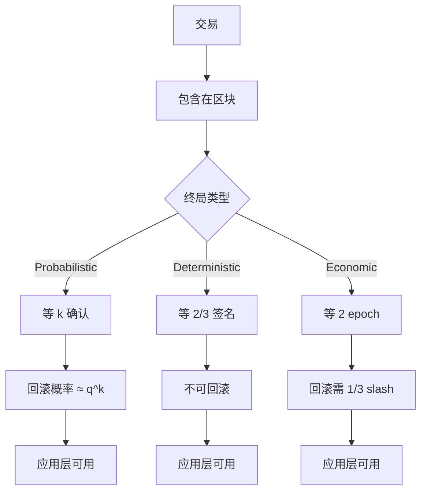

# 概率终局 vs 确定性终局（Probabilistic vs Deterministic Finality）

> **TL;DR**：区块链"终局性（Finality）"指交易被写入账本后**不能再被回滚**的程度。Bitcoin 的 PoW 给出 **概率终局**——交易被回滚概率随确认数呈指数衰减但永不为零；BFT 家族（Tendermint、HotStuff）给出 **确定性终局**——2/3 签名一旦达成立即不可逆（前提：<1/3 作恶）；Ethereum Casper FFG 提供 **经济终局**——回滚需 ≥ 1/3 stake 被 slash。三种终局各有优劣，深刻影响跨链桥设计、用户体验与再质押风险。本文形式化三种终局、推导 Bitcoin 6-conf 概率、分析 Restaking 对终局的冲击。

## 1. 背景与动机

终局性是区块链作为"清算层"的核心属性。若一笔 $10M 交易今天被认为 final、明天被回滚，任何基于它的下游逻辑（交易所出金、跨链桥释放、衍生品结算）都会爆炸。传统金融中，T+0 即时终局（如 Fedwire RTGS）是刚需；区块链提供多种折衷。

2008 年 Bitcoin 白皮书 [第 11 节](https://bitcoin.org/bitcoin.pdf) 用二项式分析给出"6 confirmation"规则：攻击者算力比 q=0.1 时，z=6 回滚概率 ~1.77e-6。这是最早的终局概率论证。

2014 年 Vitalik 提出 PoS 终局装置（Finality Gadget）概念，明确区分"可用性（short-range consensus）"与"终局（finality gadget）"。2017 年 Casper FFG 论文给出经济终局定义。2018-2020 Tendermint/HotStuff 提供了生产级确定性终局。

2023-2025 **Restaking**（EigenLayer 等）的兴起引入了对终局性的新挑战：再质押的 AVS 可能不共享 Ethereum 的终局；若它们与 Ethereum 共识产生冲突，用户需决定"信任哪层终局"。这是 2026 年生态的重要新议题。

## 2. 核心原理

### 2.1 三种终局的形式化

**定义 A（Probabilistic Finality）**：对任意 ε > 0 和交易 tx at depth k：

```
P[rollback(tx)] ≤ f(k, q)   且   lim_{k→∞} P[rollback] = 0
```

Bitcoin 的 `f(k, q) = (q/p)^k` 是典型。要注意：`f(k, q) > 0` 永远为真，终局是"无限趋近"。

**定义 B（Deterministic / Absolute Finality）**：存在有限时间 τ，交易一旦被 finalized：

```
P[rollback | < f Byzantine] = 0
```

前提是 Byzantine 容错假设（f < n/3）。Tendermint/HotStuff 属于此类。

**定义 C（Economic Finality）**：回滚一个 finalized 交易需要某些节点承担可量化的经济损失 L > L_min：

```
Revert(tx) ⟹ Slash(stake) ≥ L_min
```

Ethereum Casper FFG 下 L_min ≥ 1/3 总 stake。若 ETH 价格 $3000、total staked 34M ETH，则经济终局"保证"~$34B 回滚成本。

### 2.2 Bitcoin 6 Confirmation 的精确推导

假设攻击者占 q 算力、诚实 p=1-q 算力。Nakamoto 1 节建立等价于"两个赌徒赌输赢"模型。诚实链领先 z 块时，攻击者追上的概率：

```
q_z = (q/p)^z   (若 q < p)
```

攻击者发送 tx 到商户、同时私下挖 z'-block 分叉。当 z'-分叉超过公共链时回滚完成。

**Poisson 修正**：在 Nakamoto 论文附录，假设攻击者 z' 块到达服从 Poisson 分布 `λ = z · (q/p)`，则攻击者最终追上的概率：

```
P = 1 - Σ_{k=0}^{z} (λ^k · e^{-λ} / k!) · (1 - (q/p)^(z-k))
```

对 q=0.1：

| z | P(attack success) |
| --- | --- |
| 0 | 1.000 |
| 1 | 0.2046 |
| 2 | 0.0509 |
| 3 | 0.0132 |
| 4 | 0.00346 |
| 5 | 0.000914 |
| 6 | 0.000244 |

即 z=6 时攻击成功概率 ~0.024%，远低于白皮书正文的 0.00018%（正文模型简化未考虑 Poisson 方差）。Bitcoin 社区实际采 6 conf 在价值 < $1M 交易合理，大额（交易所 $10M+）通常用 100+ confirmations。

### 2.3 Ethereum Casper FFG 经济终局详解

FFG 双层：底层 LMD-GHOST 做 head selection（支持交易可用性），上层 FFG 提供 checkpoint finality。

**Justification**：epoch 边界 checkpoint c 若有 ≥ 2/3 总 stake 投票 "source→target" 指向它，则 c 被 justified。
**Finalization**：若连续两个 epoch justified（c_k、c_{k+1}），则 c_k 变 finalized。

**Slashing 条件**保证经济终局：若攻击者要回滚 finalized c_k，必须构造一条竞争链让 c_k' (≠ c_k) 也被 finalized。这需 ≥ 2/3 投票竞争 target；与原链 2/3 重叠 ≥ 1/3，这 1/3 验证者 **同时投了两条冲突 target** → Double Vote slashing。

最小损失：1/3 total stake 被 slash 至 0。截至 2026-04-22，Ethereum 质押 ~34M ETH，1/3 = ~11.3M ETH ≈ $34B（ETH $3000）。**回滚 Ethereum finalized 块的经济成本 = $34B**。

### 2.4 子机制拆解

**子机制 1：Confirmation Count**
Bitcoin 社区按交易金额设置 conf threshold：
- < $10K：1 confirmation
- $10K - $1M：3 confirmations
- > $1M：6+ confirmations
- 交易所热钱包：>20 confirmations

**子机制 2：Finality Gadget**
Ethereum FFG（见上），Polkadot GRANDPA（在 BABE 之上做 prevote+precommit），Avalanche 的 β 参数可视为 Probabilistic→近 Deterministic 的 finality gadget。

**子机制 3：Checkpoint / Weak Subjectivity**
PoS 系统需周期性 checkpoint 抵御 long-range attack。Ethereum 的 weak subjectivity period ≈ 2-4 个月（stake ratio、churn 决定）。新节点启动必须信任一个近期 checkpoint 才能安全 bootstrap。

**子机制 4：Reorg 容忍度**
协议层定义可接受的 reorg 深度。Ethereum 通常最多 2 slot（24s）reorg；finalized 之后绝不 reorg。Solana rooted 之前允许 reorg。Bitcoin 实际历史最深 reorg 是 2013-03-11 的 24 block（由 v0.7/v0.8 DB 兼容 bug 引发）。

**子机制 5：跨链桥的终局依赖**
Optimistic bridge（如 Stargate 旧版）假设源链 finality；若源链回滚，桥内资金失衡。Native bridge（如 Ethereum→L2 rollup）硬等 source chain finality（~12.8 min）。LayerZero 的 DVN 模型可配置"等待 N 块"。

### 2.5 参数表

| 链 | 类型 | 实际 finality 延迟 | 回滚条件 |
| --- | --- | --- | --- |
| Bitcoin | Probabilistic | ~60 分（6 conf） | 算力 > 50% 且挖 6+ 块 |
| Ethereum | Economic | ~12.8 分（2 epoch） | 1/3 stake slash |
| Cosmos Hub | Deterministic | ~6 秒（1 block） | <1/3 byz |
| Aptos | Deterministic | ~900ms（3-chain） | <1/3 byz |
| Sui | Deterministic | ~500ms | <1/3 byz |
| Avalanche | Probabilistic(高置信) | ~1-2 秒 (β=15) | byz > 20%+ 元稳定攻击 |
| Solana | Hybrid | Optimistic 12s / Rooted 31s | 2/3 stake 违规 |
| Polkadot | Economic | ~12-60 秒（GRANDPA） | 1/3 validator slash |

### 2.6 状态图



## 3. 架构剖析：终局性如何影响应用层

### 3.1 分层视图

1. **User Experience Layer**：wallet 显示"Pending / Confirmed / Finalized"。
2. **Application Layer**：CEX、bridge、DEX 的 risk engine。
3. **RPC / Indexer Layer**：暴露 `latest`、`safe`、`finalized` 区块标签（EIP-1898）。
4. **Consensus Layer**：产生 finality 信号。
5. **Economic Layer**：slashing 合约、保险基金。

### 3.2 核心模块清单

| 模块 | 职责 | 源码 | 可替换 |
| --- | --- | --- | --- |
| ForkChoice | 决定规范链 | `prysm/beacon-chain/forkchoice/`、`bitcoin/src/validation.cpp` | 低 |
| Finalization | FFG justify/finalize | `prysm/beacon-chain/core/epoch/` | 低 |
| Slashing Detector | 双签监测 | `prysm/beacon-chain/slashings/`、`lighthouse/beacon_node/slasher/` | 中 |
| Confirmation Tracker | conf 计数 | `btcd/blockchain/`、Bitcoin Core `chainman` | 高（应用层） |
| RPC finalized Tag | 暴露 finality | `geth/eth/api.go` | 中 |
| Weak Subjectivity Sync | checkpoint sync | `prysm/beacon-chain/sync/`、`lighthouse/beacon_node/network/` | 中 |
| Bridge Light Client | 验证源链 finality | `cosmos/ibc-go/light-clients/`、`LayerZero/endpoint-contracts/` | 中 |
| Reorg Monitor | 检测重组 | `etherscan-indexer`、各 block explorer | 高 |
| Insurance Fund | 异常时兜底 | MakerDAO PSM、dYdX v3 | 高 |

### 3.3 端到端数据流：Coinbase 如何处理终局

Coinbase 交易所深度入金确认实例：

1. **T+0**：用户发 1 BTC 到 Coinbase 地址，tx 广播。
2. **T+~10min（1 conf）**：入账"Pending"，不可提。
3. **T+~60min（6 conf）**：Coinbase 标记"Available"，可交易。
4. **T+~120min（12 conf）**：Coinbase 允许提币到外部。

ETH 策略：
1. **T+12s（1 block）**：Pending。
2. **T+65 block（~13 min）**：Coinbase 视为 probabilistic safe（2022 The Merge 前）。
3. **The Merge 后**：直接等 2 epoch finalized（~12.8 min）。

### 3.4 客户端多样性

- Bitcoin Core chainstate 计算 conf：`src/validation.cpp`。
- geth 提供 `eth_getBlockByNumber("finalized")`（EIP-1898）返回 Casper 最新 finalized。
- Prysm/Lighthouse beacon API `/eth/v1/beacon/states/finalized` 暴露 finalized checkpoint。

### 3.5 接口

- **Ethereum `finalized` tag**：[EIP-1898](https://eips.ethereum.org/EIPS/eip-1898) 标准化 `safe`、`finalized`。
- **Cosmos IBC light client**：信任上游 block → trusted height → 验证 membership proof。
- **LayerZero Security Stack 2.0**：DVN 可配置 `required_confirmations` per path。

## 4. 关键代码

```python
# consensus-specs/specs/phase0/fork-choice.md
# LMD-GHOST fork choice with finalized checkpoint
def get_head(store: Store) -> Root:
    # Start from justified checkpoint
    blocks = get_filtered_block_tree(store)
    head = store.justified_checkpoint.root
    while True:
        children = [
            root for root in blocks.keys()
            if blocks[root].parent_root == head
        ]
        if len(children) == 0:
            return head
        # 按 stake-weighted attestation 权重排序
        head = max(children, key=lambda root: (
            get_latest_attesting_balance(store, root),
            root
        ))
```

```python
# finality 检测
def is_finalized(beacon_state, target_epoch):
    return beacon_state.finalized_checkpoint.epoch >= target_epoch
```

```go
// go-ethereum/eth/api.go  (v1.14)
// 暴露 finalized block 给 RPC
func (api *EthereumAPI) GetBlockByNumber(ctx context.Context, number rpc.BlockNumber, fullTx bool) (map[string]interface{}, error) {
    block, err := api.b.BlockByNumber(ctx, number)
    // rpc.FinalizedBlockNumber 会调用 beacon chain 获取 finalized root
    ...
}
```

## 5. 演进时间线

| 年份 | 事件 |
| --- | --- |
| 2008 | Nakamoto 给出 6-conf 概率分析 |
| 2013-03-11 | Bitcoin 最深 reorg（24 block， v0.7/0.8 bug） |
| 2014 | Vitalik 提 Finality Gadget 概念 |
| 2017-10 | Casper FFG 论文 |
| 2020 | Polkadot GRANDPA 上线 |
| 2020-12-01 | Ethereum Beacon Chain 启动（分离 finality） |
| 2022-05 | Ethereum Beacon 曾出现 7-block reorg（非 finality fault） |
| 2022-09-15 | The Merge，Ethereum 获得 economic finality |
| 2023-05-11 | Ethereum finality 停摆 63 epoch |
| 2024 | Restaking 对 finality 的新挑战（EigenLayer） |
| 2025-Q1 | Ethereum Single-Slot Finality (SSF) 研究进入 Vitalik 路线图 |

## 6. 实战示例

```bash
# Ethereum：比较 latest、safe、finalized
cast block latest --rpc-url https://eth.llamarpc.com --field number
cast block safe --rpc-url https://eth.llamarpc.com --field number
cast block finalized --rpc-url https://eth.llamarpc.com --field number

# Bitcoin：查询某 tx 的 confirmation 数
bitcoin-cli getrawtransaction TXID true | jq '.confirmations'

# Cosmos：查询 IBC 客户端 trust_height 
gaiad query ibc client state 07-tendermint-0
```

## 7. 安全与已知攻击

- **Ethereum Classic 51% Attack 2019-01**：Coinbase 损失 $1.1M，攻击者重组 100+ 块（超 6 conf）。教训：小算力链 conf 阈值必须大幅提高。[Coinbase postmortem](https://blog.coinbase.com/ethereum-classic-etc-is-currently-being-51-attacked-33be13ce32de)。
- **Ethereum Beacon 2020-12 临时 reorg**：一个 epoch 出现短暂 7-block reorg，但 finalized 未受影响。
- **Ethereum Finality Delay 2023-05-11/12**：25 分钟无 finality，Prysm/Teku bug。非 finality violation，但展示 Inactivity Leak 的重要性。
- **Restaking 风险 (2024)**：Vitalik [批评](https://vitalik.eth.limo/general/2023/05/21/dont_overload.html)：若 AVS 与 Ethereum finality 冲突，AVS 验证者（同是 ETH validator）可能面临 slash 冲突。Vitalik 建议"不要让共识重用"。
- **跨链桥终局假设 Ronin 2022-03**：9 PoA validator 中 5 被攻陷。"确定性终局 ≠ 安全" — 终局保证仅在 Byz < 1/3 时才有效，许可链必须严控 key 管理。
- **Terra Luna 2022-05**：Tendermint 提供确定性终局，但稳定币脱锚与共识无关。显示终局 ≠ 应用层安全。

## 8. 与同类方案对比：该选哪种终局？

| 场景 | 推荐终局类型 | 原因 |
| --- | --- | --- |
| L1 抗审查货币 | Probabilistic (PoW) | 开放性最强，无需委员会 |
| 机构级清算 | Deterministic/Economic | 不可回滚是刚需 |
| 高吞吐 DeFi | Economic / Det. | 并发量需要快速 finality |
| 跨链桥 | Economic finality | 双重保证 |
| 游戏 / 社交 | Probabilistic 即可 | 1 conf 即可，UX 优先 |
| RWA 合规 | Deterministic | 法律回溯明确 |

**终局 trilemma**：**速度 vs 确定性 vs 去中心化**。Bitcoin 最去中心 + 概率；Tendermint 最快 + 最确定 + 最中心；Ethereum 折衷。

**Restaking 对终局的潜在影响**：
- **好处**：AVS 可复用 Ethereum 的 $34B 经济安全，降低新链启动成本。
- **风险**：AVS slashing 条件与 Ethereum finality 若冲突，attacker 可在 AVS 上作恶获益 > 在 ETH 上被 slash 的损失。Vitalik 的"Don't overload Ethereum consensus"核心论点。
- **Symbiotic / Karak** 等提供"隔离 slashing"试图解决此问题，但生态仍在早期。

## 9. 延伸阅读

- **Tier 1**：
  - [Bitcoin Whitepaper](https://bitcoin.org/bitcoin.pdf)
  - [Casper FFG paper](https://arxiv.org/abs/1710.09437)
  - [Ethereum consensus-specs](https://github.com/ethereum/consensus-specs)
  - [Polkadot GRANDPA paper](https://arxiv.org/abs/2007.01560)
- **Tier 2/3**：
  - Vitalik [Don't overload Ethereum consensus](https://vitalik.eth.limo/general/2023/05/21/dont_overload.html)
  - Vitalik [PoS FAQ: finality explained](https://vitalik.eth.limo/general/2020/11/06/pos2020.html)
  - Paradigm [Dencun finality analysis](https://www.paradigm.xyz/)
  - a16z [Restaking and consensus](https://a16zcrypto.com/)
- **相关 EIP**：
  - [EIP-1898 finalized tag](https://eips.ethereum.org/EIPS/eip-1898)
  - [EIP-2982 Serenity Phase 0](https://eips.ethereum.org/EIPS/eip-2982)

## 10. 术语表

| 术语 | 英文 | 释义 |
| --- | --- | --- |
| 概率终局 | Probabilistic Finality | 回滚概率指数衰减但非零 |
| 确定性终局 | Deterministic / Absolute Finality | 2/3 签名后绝不回滚 |
| 经济终局 | Economic Finality | 回滚需可量化经济损失 |
| Confirmation | Confirmation | 后续区块数 |
| Checkpoint | Checkpoint | epoch 边界块 |
| 弱主观性 | Weak Subjectivity | 新节点需信任近期 checkpoint |
| Reorg | Reorganization | 链重组 |
| Justified / Finalized | Justified / Finalized | FFG 两阶段终局 |
| Rooted | Rooted | Solana 的确定终局 |
| Single-Slot Finality (SSF) | SSF | Ethereum 未来目标：每 slot 即终局 |

---

*Last verified: 2026-04-22*
