# 历史证明（Proof of History, PoH）

> **TL;DR**：PoH 由 Solana 团队（Anatoly Yakovenko，前 Qualcomm 工程师）于 2017 年白皮书提出，核心思想是**用递归 SHA-256 哈希构造一个去中心化的"时钟"**，让节点能在**不相互通信**的前提下对事件顺序达成共识。PoH 本身**不是共识协议**——它只提供"可验证的时间戳"；Solana 将其与 **Tower BFT**（PoS 派生的 BFT 变体）耦合形成完整共识。学术界批评 PoH 的 VDF 属性不纯粹（SHA-256 递归 ≠ 严格 VDF），且实际安全性仍依赖 stake。本文剖析 PoH 的数学结构、Slot/Epoch 设计、与 Tower BFT 的耦合，以及 2020 年来的实际表现（2022-09 多次停机）。

## 1. 背景与动机

Anatoly 在 2017 年 11 月的 [Solana Whitepaper](https://solana.com/solana-whitepaper.pdf) 指出传统 BFT 共识的瓶颈在于 **验证者之间必须同步时钟**——要么用 NTP（中心化且可被攻击），要么用 message-based timestamp（消耗带宽）。他受 Qualcomm CDMA 基站同步启发，设计 PoH：**一个节点不断对自己前一个哈希进行 SHA-256，形成一条不可跳过的序列。序列中每个位置有可验证的"时间延迟"，其他节点通过重放哈希即可验证**。

这带来两个突破：
1. 验证者可以把交易 **插入到 PoH 序列** 中，通过哈希位置证明 tx 发生的先后顺序，无需 gossip timestamp。
2. Leader 提前被 schedule 知道自己的 slot 窗口，可以"流水线式"预打包并广播到全网，吞吐大幅提升。

Solana 主网 2020-03-16 上线，2021 TPS 峰值宣传 65k（实际复杂 tx <3k），2022 多次停机后逐步改良。2024 年起 Jump Trading 开发的 Firedancer（C++ 重写）与 Agave（Rust 原版）实现 **多客户端**，是 Solana 未来可靠性的最大杠杆。

## 2. 核心原理

### 2.1 PoH 的形式化

PoH 定义为序列 `H_0, H_1, H_2, ...`，其中：

```
H_0 = <预设种子>
H_{k+1} = SHA256(H_k || data_k)
```

若某 slot 内无 tx，`data_k = 空`；若有 tx，`data_k = tx_digest`。序列每一步只能串行执行（因 SHA-256 当前不可并行化），因此 `H_k` 之生成至少需要 `k × t_hash` 时间（`t_hash` 为单次 SHA-256 耗时，现代 CPU ~50ns）。

**可验证性**：验证者拿到 `(H_0, H_k, k)` 后，并行重放 `k` 次哈希检查是否匹配，即可验证"从 H_0 到 H_k 至少过了 `k × t_hash` 时间"。SHA-256 是 EDCSP 硬件并行友好，验证速度比生成快。

**VDF 讨论**：严格 VDF（Verifiable Delay Function）要求 (a) 顺序执行，(b) 验证远快于生成。SHA-256 递归满足 (a) 软件上，但在 ASIC 上可被一定程度并行（pipelining）；且 (b) 的"远快于"只有 log 级加速（多线程并行哈希），不如真正的 VDF（如 Pietrzak-Wesolowski 基于 RSA-group 的 VDF，验证 `log(T)`）。因此学术圈（如 Justin Drake）不承认 PoH 是严格 VDF，而称其为"近似 VDF"或"时间戳源"。

### 2.2 Tick、Slot、Epoch

```
1 PoH hash ≈ 50 ns
1 tick     = 12500 hashes ≈ 6.25 ms  (TICK_PER_S = 160)
1 slot     = 64 ticks ≈ 400 ms
1 epoch    = 432,000 slots ≈ 2 days
```

Leader schedule 每 epoch 预计算：用 VRF from stake-weighted seed 选出 slot leader。每个 leader 拥有连续 4 个 slot（1.6s 窗口）的出块权。

### 2.3 子机制拆解

**子机制 1：PoH 生成线程**
Agave 的 `poh-service`（`agave/poh/src/poh_service.rs`）独占一个 CPU 核，循环 SHA-256。每到 tick 边界就输出 `PohEntry{num_hashes, hash, transactions}`。

**子机制 2：Leader 调度**
Leader = `get_leader(slot) = VRF(epoch_seed, slot) % stake_weighted_set`。源码 `agave/ledger/src/leader_schedule.rs`。

**子机制 3：Gulf Stream（mempool-less）**
Solana 无传统 mempool。交易直接转发到已知的未来 leader。source `agave/gossip/` + `agave/rpc/`。优点：leader 零延迟打包；缺点：RPC 节点易成瓶颈（2022 停机原因之一）。

**子机制 4：Tower BFT**
Tower BFT（`agave/core/src/consensus/tower.rs`）是 PBFT 变体，每 vote 是对某个 slot 的"lockout"——validator 若 vote slot X 又想 vote 冲突的 Y，需等待指数 backoff（2^n slot）。最小 lockout = 2 slot，最大 = 32 slot（2^5）。当 2/3 validators 对某 slot 达到最大 lockout，该 slot 进入 **Rooted**（最终终局）。

**子机制 5：Turbine 广播**
Solana 用 Turbine（Reed-Solomon + 分层 fanout）把 block 拆成 shreds 广播。不依赖 gossip pull，leader 把 shreds 按 stake 加权的 fanout tree 推送。bandwidth `O(n)` 最优。

**子机制 6：Fork Choice**
"heaviest subtree weight based on stake-weighted votes"。每 slot leader 可以选择 parent slot，理论允许 fork；实践中 fork 极少。

### 2.4 参数表

| 参数 | 值 | 说明 |
| --- | --- | --- |
| hashes per tick | ~12,500 | PoH 速率 |
| ticks per slot | 64 | |
| slot duration | 400 ms | target |
| slots per epoch | 432,000 | ~2 天 |
| max lockout | 32 slots | Tower BFT 常数 |
| confirmation threshold | 2/3 stake | |
| 优化乐观 confirmation | 30-40 slot | ~12-16 秒 |
| rooted finality | 32 slot 后 | ~12.8 秒最少（实际 ~31 秒含传播） |
| total stake (2026-01) | ~390M SOL | beaconcha.in-like 指标 |

### 2.5 边界条件与失败模式

- **Leader 故障**：slot 空转。连续 48 个 slot（skipped slots 超阈）会触发 leader rotate。
- **网络过载**：交易洪水 → RPC 节点 drop，fee 市场无效 → 停机。2022 年 9 次停机多因此。
- **Equivocation**：Leader 双块提议会被其他 validator 拒绝并 slash（部分通过社会协调）。
- **时钟漂移**：PoH 理论上是硬件时钟，若 leader CPU 快于平均，可能抢 slot；Agave 的 `poh-recorder` 有 target_ns_per_tick 限速。

### 2.6 图示

```mermaid
flowchart LR
    POH[PoH 循环 SHA256] --> TICK[Tick: 12500 hashes]
    TICK --> SLOT[Slot: 64 ticks = 400ms]
    SLOT --> LEADER[Leader Schedule]
    LEADER --> PROPOSE[Leader 组装 block]
    PROPOSE --> TURBINE[Turbine 分片广播]
    TURBINE --> REPLAY[Replay + 验证]
    REPLAY --> VOTE[Tower BFT vote]
    VOTE --> OPTIMISTIC[乐观 confirmation]
    OPTIMISTIC --> ROOTED[Rooted 终局]
```



## 3. 架构剖析

### 3.1 分层视图（Agave）

1. **PoH Service**：独占核，生成 PoH 条目。
2. **Banking Stage**：流水线化交易执行（sigverify → prefetch → execute → record）。
3. **Replay Stage**：验证他人块，重放并对比状态。
4. **Turbine**：shred 传播。
5. **Gossip**：集群元数据（validator list、version）。
6. **RPC**：JSON-RPC 8899、WebSocket 8900。

### 3.2 核心模块清单

| 模块 | 职责 | 源码 | 可替换 |
| --- | --- | --- | --- |
| PoH Service | 哈希时钟 | `agave/poh/src/poh_service.rs` | 低 |
| PoH Recorder | 将 tick 编入块 | `agave/poh/src/poh_recorder.rs` | 低 |
| Banking Stage | 交易流水线 | `agave/core/src/banking_stage.rs` | 中 |
| Replay Stage | 远程块重放 | `agave/core/src/replay_stage.rs` | 中 |
| Tower BFT | 投票 + lockout | `agave/core/src/consensus/tower.rs` | 低 |
| Turbine | shred 广播 | `agave/turbine/` | 高 |
| Gossip | cluster info | `agave/gossip/` | 高 |
| Leader Schedule | VRF 调度 | `agave/ledger/src/leader_schedule.rs` | 低 |
| RPC | JSON-RPC | `agave/rpc/` | 高 |
| Firedancer Tile | Jump 的 C 版 | `firedancer-io/firedancer/src/disco/` | 高（独立实现） |

### 3.3 端到端数据流

1. **T+0**：wallet 调 RPC `sendTransaction` → RPC 节点转发到未来 3 个 leader（lookup leader schedule）。
2. **T+0 – 400ms**：leader 在自己 slot 开始前收到 tx，放入 banking pipeline。
3. **Slot start**：PoH service 标记 slot_start_hash，leader 开始从 banking 流水线 pop tx 打包，每 tx 插入 PoH entry。
4. **Slot end (~400ms)**：block 打包完成，拆为 shreds 广播（Turbine）。
5. **Replay**：其他 validator 接收 shred，重放 PoH + 交易执行，验证一致。
6. **Vote**：validator 通过 VoteProgram 交易对 slot 投票（含 lockout tower）。
7. **Optimistic Confirmation**：2/3 stake 投票（~12-16s 后），RPC 返回 `"confirmed"`。
8. **Rooted**：该 slot 被 32 slot 后的 2/3 投票锁定（~31s），返回 `"finalized"`。

### 3.4 客户端多样性

- **Agave**（Anza fork 自 Solana Labs）：Rust，2025 Q3 ~80% validator。
- **Firedancer**（Jump Trading）：C/C++，2024-Q3 Frankendancer（混合）主网，2026 目标全面上线。
- **Sig**（Syndica）：Zig，2024 开发中。
- **TinyDancer**：轻客户端。

多客户端化是 Solana 长期可靠性的关键。2022 年 9 次停机很大程度源于 Agave 单点 bug。

### 3.5 接口

- **JSON-RPC**（[Solana RPC API](https://docs.solana.com/api/http)）：`getBlock`、`sendTransaction`、`getSignatureStatuses`、`simulateTransaction`。
- **WebSocket**：`signatureSubscribe`、`slotSubscribe`。
- **Geyser Plugin**：validator 推送实时数据到外部（用于索引）。

## 4. 关键代码

```rust
// agave/poh/src/poh.rs (模仿 v2.0)
pub struct Poh {
    pub hash: Hash,
    num_hashes: u64,
    hashes_per_tick: u64,
    remaining_hashes: u64,
    ticks_per_slot: u64,
    tick_number: u64,
    ...
}

impl Poh {
    pub fn hash(&mut self, max_num_hashes: u64) -> bool {
        let num_hashes = std::cmp::min(self.remaining_hashes - 1, max_num_hashes);
        for _ in 0..num_hashes {
            self.hash = hashv(&[self.hash.as_ref()]);  // SHA-256(prev)
        }
        self.num_hashes += num_hashes;
        self.remaining_hashes -= num_hashes;
        self.remaining_hashes == 1  // 是否到达 tick 边界
    }
    
    pub fn record(&mut self, mixin: Hash) -> Option<PohEntry> {
        if self.remaining_hashes == 1 { return None; }  // 需先 tick
        self.hash = hashv(&[self.hash.as_ref(), mixin.as_ref()]);  // 混入 tx hash
        let num_hashes = self.num_hashes + 1;
        self.num_hashes = 0;
        self.remaining_hashes -= 1;
        Some(PohEntry { num_hashes, hash: self.hash })
    }
    
    pub fn tick(&mut self) -> Option<PohEntry> {
        self.hash = hashv(&[self.hash.as_ref()]);
        self.num_hashes += 1;
        self.remaining_hashes -= 1;
        if self.remaining_hashes != 0 { return None; }
        let num_hashes = self.num_hashes;
        self.num_hashes = 0;
        self.remaining_hashes = self.hashes_per_tick;
        self.tick_number += 1;
        Some(PohEntry { num_hashes, hash: self.hash })
    }
}
```

## 5. 演进时间线

| 年份 | 事件 |
| --- | --- |
| 2017-11 | Solana Whitepaper（[PDF](https://solana.com/solana-whitepaper.pdf)） |
| 2018-03 | Devnet |
| 2020-03 | 主网 Beta |
| 2021-09 | 17 小时停机（[postmortem](https://solana.com/news/september-14-network-outage-initial-overview)） |
| 2022-01 / 04 / 06 / 09 | 多次停机，交易洪水 |
| 2022-09-30 | Nonce 漂移 bug 导致 4.5 小时停机 |
| 2023-02 | Mainnet 80 小时稳定期 |
| 2024-04 | QUIC / Stake-weighted QoS 启用 |
| 2024-09 | Firedancer Frankendancer 灰度 |
| 2024-10 | Agave fork 自 Solana Labs（Anza 成立） |
| 2025 | SIMD-0326 / QUIC 改良 |

## 6. 实战示例

```bash
# 跑本地测试 validator
solana-test-validator --rpc-port 8899 --reset
# 创建账号
solana-keygen new -o /tmp/id.json
solana config set --url http://localhost:8899 --keypair /tmp/id.json
solana airdrop 10
# 发送 SOL
solana transfer 1 DESTADDR... --allow-unfunded-recipient
# 观察 slot
solana slot
# 订阅实时 slot
solana-wss 'ws://localhost:8900' --slot-subscribe
```

## 7. 安全与已知攻击

- **2021-09-14 停机 17 小时**：Grape Protocol IDO 期间 bot 每秒 400k tx，节点 OOM。后续引入 stake-weighted QoS、compute unit budget。
- **2022-01-22 停机 8 小时**：duplicate fetch、ping 风暴，修复后加入 ping 限流。
- **2022-09-30 停机 4.5 小时**：共识 bug——validator 误处理一个 duplicate-but-different slot 提议。Anza 引入 consistency checks。
- **MEV Sandwiches 与 Jito**：2023 Jito Labs 为 Solana 做的 block engine auction 逐步成为 MEV 捕获主流，影响 PoH 公平性讨论。
- **Long-range / 历史重写**：因 PoH 自身不保证 stake 绑定，长程攻击依赖 Tower BFT 的 rooted lockout。与 Ethereum 的 Weak Subjectivity 类似。

## 8. 与同类方案对比

| 维度 | PoH + Tower BFT (Solana) | Ethereum Gasper | Tendermint | HotStuff (Aptos) |
| --- | --- | --- | --- | --- |
| Leader 选择 | VRF + stake | RANDAO | Round-Robin | Pacemaker |
| 出块时间 | 400ms | 12s | ~6s | 250ms |
| Finality | Optimistic 12s / Rooted 31s | Economic 12.8 min | 即时 | 900ms 3-chain |
| 时钟机制 | PoH 哈希链 | wall clock | wall clock | wall clock |
| 吞吐（实测） | 1k-3k 复杂 tx | 15-30（L1） | 4k | 10k-30k |
| 客户端多样性 | 1-2 | 5+ | 1 | 1 |
| 停机次数 | 多次 | 2023 一次 | 少 | 一次 |

**学术批评**：
- Justin Drake：[PoH 不是严格 VDF](https://ethresear.ch/t/solana-vdf-not-really)，SHA-256 ASIC 可 2-3x 加速；Solana 的 "时间" 依赖 majority honest CPU，与 PoW 类似，但缺少经济惩罚。
- Emin Gün Sirer：Solana 对单 leader + 单客户端的依赖违反了 BFT 假设的分布性。
- Solana 团队反驳：实践中 Tower BFT 的 stake-weighted vote 才是安全来源，PoH 只是时钟。

## 9. 延伸阅读

- **Tier 1**：
  - [Solana Whitepaper](https://solana.com/solana-whitepaper.pdf)
  - [anza-xyz/agave](https://github.com/anza-xyz/agave)
  - [firedancer-io/firedancer](https://github.com/firedancer-io/firedancer)
  - [Solana Consensus docs](https://docs.solanalabs.com/consensus/)
- **Tier 2/3**：
  - Helius blog: [PoH explained](https://www.helius.dev/blog/proof-of-history)
  - Anatoly Yakovenko Medium 2017 原文
  - Messari Solana 年度报告
  - Syndica Sig 客户端博客
- **学术**：
  - Pietrzak [Simple VDF](https://eprint.iacr.org/2018/627)
  - Wesolowski [Efficient VDF](https://eprint.iacr.org/2018/623)

## 10. 术语表

| 术语 | 英文 | 释义 |
| --- | --- | --- |
| 历史证明 | Proof of History | SHA-256 递归哈希构造的时钟 |
| VDF | Verifiable Delay Function | 可验证延迟函数 |
| Tick | Tick | PoH 的最小时间单元 |
| Slot | Slot | 64 ticks ≈ 400ms |
| Epoch | Epoch | 432000 slots ≈ 2 天 |
| Tower BFT | Tower BFT | Solana 的 PBFT 变体 + lockout |
| Lockout | Lockout | vote 锁定时间（指数增长） |
| Rooted | Rooted | 确定性终局状态 |
| Optimistic Confirmation | Optimistic Confirmation | 2/3 投票的乐观确认 |
| Turbine | Turbine | Solana 的分层 shred 广播 |
| Shred | Shred | Reed-Solomon 分片区块片段 |

---

*Last verified: 2026-04-22*
