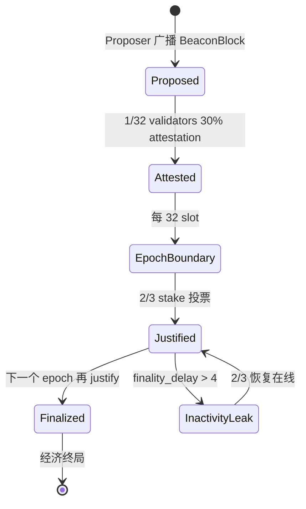

# 权益证明（Proof of Stake, PoS）

> **TL;DR**：PoS 把 Sybil 抵抗从"物理算力"切换到"链上锁定代币"。Ethereum 采用的 **Gasper = LMD-GHOST（活性/短链选择） + Casper FFG（终局性）** 双层结构，提供 **经济终局**——回滚一个已 finalized 的 checkpoint 需要至少 1/3 stake 被 slash。PoS 设计必须解决 "Nothing-at-Stake（无代价分叉）"、"Long-Range Attack（长程攻击）"、"Weak Subjectivity（弱主观性）"三大问题。本文从 Casper 论文出发，剖析 Gasper 状态机、FFG 2/3 投票、RANDAO 领导者选择、Slashing 参数和 2025-Pectra/Fusaka 演进。

## 1. 背景与动机

PoW 有三个根本限制：（1）能耗高——Bitcoin 2024 年能耗约 160 TWh，相当于阿根廷全国；（2）安全预算依赖币价——币价跌则算力跌，反身性脆弱；（3）出块慢、吞吐低。

2012 年 Sunny King 发布 [PPCoin White Paper](https://decred.org/research/king2012.pdf)，首次提出用"币龄 × 哈希"替代纯哈希，但仍保留 PoW 作为启动保险。2013-2014 年出现 **Nothing-at-Stake** 批评：PoS 验证者"在每条分叉上签名"边际成本为零，理论上会永远分叉。

Vitalik 在 2014 年提出的 [Slasher](https://blog.ethereum.org/2014/01/15/slasher-a-punitive-proof-of-stake-algorithm)、[Slasher Ghost](https://blog.ethereum.org/2014/10/03/slasher-ghost-developments-proof-stake-algorithms/) 引入了 **slashing**：若验证者对两条冲突链都签名，其 stake 被销毁。这解决了 Nothing-at-Stake，但引出 Long-Range Attack：退押的旧验证者用旧密钥重写创世后的历史链。对此 Ethereum 采用 **Weak Subjectivity Checkpoint**——新节点必须信任一个近期（< weak subjectivity period ≈ 2-4 个月）的可信 checkpoint。

2017 年 Vitalik & Virgil Griffith 的 [Casper FFG 论文](https://arxiv.org/abs/1710.09437) 与 Buterin & Sompolinsky 的 [Casper TFG 论文](https://arxiv.org/abs/1710.09437) 分别代表"叠加到 PoW/短链的终局小工具"和"纯 PoS"两条路径。最终 Ethereum 选择 Casper FFG + LMD-GHOST 组合，称为 **Gasper**（[Gasper paper 2020](https://arxiv.org/abs/2003.03052)）。

2020-12-01 Beacon Chain 主网启动，2022-09-15 The Merge 完成 Execution ↔ Consensus 合并。2024-03 Dencun（Deneb+Cancun）、2025-05 Pectra（EIP-7251 MaxEB 2048 ETH）、2025-Q4 Fusaka 继续调优。

## 2. 核心原理

### 2.1 形式化定义：Gasper

Gasper 是 **两层协议**：

- **底层（Fork Choice）**：LMD-GHOST — Latest Message Driven Greedy Heaviest Observed Subtree。每个验证者最新一票决定其子树权重。
- **上层（Finality Gadget）**：Casper FFG — 每 32 个 slot 为一个 epoch，epoch 边界 checkpoint 由 2/3 validators 投票完成 **Justification**，连续两个 justified 则前者 **Finalized**。

形式化，记链上 checkpoint `c = (epoch, block_root)`。定义投票为 pair `(s, t)`，source `s` 和 target `t` 都是 checkpoint：

- **Justification 规则**：若 `c` 有 ≥ 2/3 stake 投票 `(c', c)`（其中 `c'` 是 justified 祖先），则 `c` 升级为 justified。
- **Finality 规则**：若 `c_k` 是 justified 且有 ≥ 2/3 投票 `(c_k, c_{k+1})`，则 `c_k` 变 Finalized。

**Slashing 条件**（FFG 定理 1/2）：

- **Double Vote**：同一验证者对同一 target epoch 投两票 `(s₁, t)` 与 `(s₂, t)` 且 `s₁ ≠ s₂`。
- **Surround Vote**：两票 `(s₁, t₁)` 和 `(s₂, t₂)` 满足 `s₁ < s₂ < t₂ < t₁`（一票包围另一票）。

FFG 定理证明：只要 < 1/3 stake 恶意，Safety 不会被破坏；违反者被 slashing 销毁至少 1 ETH（correlation penalty 可高达 32 ETH）。

### 2.2 关键数据结构

```python
# consensus-specs/specs/phase0/beacon-chain.md
class Validator(Container):
    pubkey: BLSPubkey
    withdrawal_credentials: Bytes32
    effective_balance: Gwei
    slashed: bool
    activation_eligibility_epoch: Epoch
    activation_epoch: Epoch
    exit_epoch: Epoch
    withdrawable_epoch: Epoch

class BeaconBlockBody(Container):
    randao_reveal: BLSSignature
    eth1_data: Eth1Data
    graffiti: Bytes32
    proposer_slashings: List[ProposerSlashing, 16]
    attester_slashings: List[AttesterSlashing, 2]
    attestations: List[Attestation, 128]
    deposits: List[Deposit, 16]
    voluntary_exits: List[SignedVoluntaryExit, 16]
    sync_aggregate: SyncAggregate
    execution_payload: ExecutionPayload
    ...

class Attestation(Container):
    aggregation_bits: Bitlist[2048]
    data: AttestationData  # slot, index, beacon_block_root, source, target
    signature: BLSSignature  # BLS 聚合 <=2048 个验证者
```

### 2.3 子机制拆解

**子机制 1：RANDAO 领导者选择**
每个 slot 的 proposer 由 RANDAO 种子决定。当前 proposer 必须对 RANDAO seed 做 BLS 签名（`randao_reveal`），哈希后混入下一轮 RANDAO。因为 BLS 签名具备唯一性（同 sk + msg → 唯一 sig），RANDAO 值对 proposer 不可预测操控——唯一选择是"全部揭示"或"放弃本 slot 收益"。

**子机制 2：Committee 划分**
每 epoch 将所有 ~1M 验证者均匀分成 32 个 slot × 最多 64 committee。每个 slot 由 ~64 个 committee 做 attestation。这保证：（a）即便大量恶意验证者，单 slot 内可作恶比例也被稀释；（b）BLS 签名聚合后 gossip 带宽可控。

**子机制 3：LMD-GHOST Fork Choice**
从 last justified checkpoint 开始，递归下行选权重最大子树：

```python
def get_head(store):
    block = store.justified_checkpoint.root
    while True:
        children = [b for b in store.blocks if b.parent_root == block]
        if not children: return block
        # 权重 = 祖先子树的最新投票 stake 总和
        block = max(children, key=lambda c: get_latest_attesting_balance(store, c))
```

**子机制 4：FFG Finalization**
见 2.1 形式化规则。每 epoch 边界写入 `current_justified_checkpoint` 与 `finalized_checkpoint`。

**子机制 5：Slashing & Inactivity Leak**
Slashing 公式（`consensus-specs/specs/phase0/beacon-chain.md#slash_validator`）：

```
slashing_penalty = effective_balance // MIN_SLASHING_PENALTY_QUOTIENT  (1/32)
withdrawable_epoch = current_epoch + EPOCHS_PER_SLASHINGS_VECTOR  (8192 epoch ≈ 36 天)
correlation_penalty = slashings_in_window / total_balance × effective_balance × 3
```

若同一窗口内 slashing 比例高，correlation penalty 线性上升，达 1/3 stake 时 slash 掉全部 32 ETH。Inactivity Leak：连续 ≥ 4 epoch 未 finalize 时，离线验证者余额每 epoch 流失 ~0.03%，直到 2/3 活跃重新实现 finality。

**子机制 6：Withdrawal Queue**
[EIP-7002](https://eips.ethereum.org/EIPS/eip-7002) 支持执行层触发退出。Dencun 后 withdrawal 自动化，但仍受 churn limit 控制（每 epoch 最多 ~10-12 个验证者退出，保护共识）。

### 2.4 关键参数（截至 Pectra 2025-05）

| 参数 | 值 | 说明 |
| --- | --- | --- |
| SLOT_DURATION | 12 s | 每槽 |
| SLOTS_PER_EPOCH | 32 | 一个 epoch |
| EPOCH_DURATION | 384 s (6.4 min) | |
| MIN_DEPOSIT | 1 ETH | |
| MAX_EFFECTIVE_BALANCE | 2048 ETH（Pectra 后） | 原 32 ETH |
| MIN_ATTESTATION_INCLUSION_DELAY | 1 slot | |
| TARGET_COMMITTEE_SIZE | 128 | |
| MIN_SLASHING_PENALTY_QUOTIENT | 32 | 最少 slash 1/32 |
| WHISTLEBLOWER_REWARD_QUOTIENT | 512 | 告发者奖励 1/512 |
| PROPOSER_REWARD_QUOTIENT | 8 | proposer 拿 1/8 attestation 奖励 |
| INACTIVITY_PENALTY_QUOTIENT | 16,777,216 | 活性惩罚系数 |
| EPOCHS_PER_SLASHINGS_VECTOR | 8192 | 惩罚锁定期 |
| CHURN_LIMIT_QUOTIENT | 65,536 | 退出/激活流量控制 |

Ethereum 总质押 ~34M ETH（截至 2026-01，[beaconcha.in](https://beaconcha.in/)），约 28% 总供应。

### 2.5 边界条件

- **Inactivity Leak** 启动条件：`finality_delay > 4 epochs`。累计 leak 到 2/3 恶意下线后，其 stake 流失至剩余 2/3 活跃验证者可以 finalize 为止。
- **MEV-Boost 垄断**：若 relay 集中，proposer 可能被 censor，虽不破坏共识，但破坏抗审查。[EIP-7732 ePBS](https://eips.ethereum.org/EIPS/eip-7732)（Enshrined PBS）旨在解决。
- **Validator Queue**：2023-2024 入池排队超 6 周，stake 激增带来资产闲置成本。

### 2.6 状态机



## 3. 架构剖析

### 3.1 分层视图

1. **Validator Client**：签名机，持私钥。Prysm/Lighthouse/Teku 拆分为独立进程。
2. **Beacon Node**：共识层，运行 Gasper。
3. **Execution Client**（geth/nethermind/erigon/besu/reth）：EVM + State。
4. **Engine API**：CL↔EL JSON-RPC 桥。
5. **DA/Blob**：EIP-4844 blob sidecar。

### 3.2 核心模块清单

| 模块 | 职责 | 源码 | 可替换性 |
| --- | --- | --- | --- |
| Block Processing | 状态转换 | `prysm/beacon-chain/core/transition/`、`consensus-specs/specs/` | 低 |
| Attestation Service | 聚合 attestations | `prysm/beacon-chain/operations/attestations/`、`lighthouse/beacon_node/operation_pool/` | 中 |
| Fork Choice | LMD-GHOST | `prysm/beacon-chain/forkchoice/protoarray/`、`lighthouse/consensus/proto_array/` | 低 |
| Finality Gadget | FFG justify/finalize | `prysm/beacon-chain/core/epoch/`、`specs/phase0/beacon-chain.md` | 低 |
| Slashing Protection | 双签防护 | `validator/slashing-protection-history/`、`lighthouse/validator_client/slashing_protection/` | 中 |
| P2P Layer | libp2p | `prysm/beacon-chain/p2p/`、`lighthouse/beacon_node/eth2_libp2p/` | 高 |
| Sync (Backfill & Checkpoint) | 同步 | `prysm/beacon-chain/sync/backfill/`、`lighthouse/beacon_node/network/` | 高 |
| Validator Duties | 分配任务 | `prysm/validator/client/`、`lighthouse/validator_client/duties_service/` | 中 |
| Deposit & Withdrawals | 存取款 | `prysm/beacon-chain/core/deposits/`、`consensus-specs/specs/capella/` | 低 |
| Engine API | CL→EL | `prysm/beacon-chain/execution/engine_client.go`、`lighthouse/execution_layer/` | 中 |

### 3.3 端到端数据流（Attestation 生命周期）

1. **Slot start (T+0)**：proposer（由 `get_beacon_proposer_index` 决定）从 mempool 构造 ExecutionPayload，调用 engine_newPayload → engine_forkchoiceUpdated。
2. **T+0–4s**：广播 BeaconBlock → libp2p `/eth2/beacon_block/ssz_snappy`。
3. **T+4s**：各 committee 的 1/32 验证者独立计算 head，生成 Attestation。
4. **T+4–8s**：attestation 经 `/eth2/committee_index{i}_beacon_attestation/ssz_snappy` gossip。
5. **T+8–12s**：aggregator（随机选取的 16 个/committee）聚合为 SignedAggregateAndProof 广播全网。
6. **T+12s**：下一 slot proposer 将聚合 attestation 打包进新 block。
7. **Epoch end**：执行 `process_justification_and_finalization` 更新 checkpoint。

### 3.4 客户端多样性

Ethereum CL 客户端市占（[clientdiversity.org](https://clientdiversity.org/) 截至 2024-Q4）：Prysm ~34%、Lighthouse ~31%、Teku ~20%、Nimbus ~10%、Lodestar ~5%。官方推荐单一客户端占比 < 33%，避免 finality 级 bug 导致 1/3 slash。

### 3.5 接口

- **Beacon Node API**（[Ethereum Beacon API](https://ethereum.github.io/beacon-APIs/)）：REST，`/eth/v2/beacon/blocks/{id}`、`/eth/v1/validator/duties/attester/{epoch}`。
- **Engine API**（[spec](https://github.com/ethereum/execution-apis/tree/main/src/engine)）：CL→EL JSON-RPC，`engine_newPayloadV4`、`engine_forkchoiceUpdatedV3`、`engine_getPayloadV4`。
- **SSZ/GossipSub topic v2**：消息序列化规范。

## 4. 关键代码

```python
# consensus-specs/specs/phase0/beacon-chain.md#process_justification_and_finalization
def process_justification_and_finalization(state: BeaconState) -> None:
    if get_current_epoch(state) <= GENESIS_EPOCH + 1: return
    previous_indices = get_unslashed_participating_indices(state, TIMELY_TARGET_FLAG_INDEX, previous_epoch)
    current_indices = get_unslashed_participating_indices(state, TIMELY_TARGET_FLAG_INDEX, current_epoch)
    total_active_balance = get_total_active_balance(state)
    prev_target_balance = get_total_balance(state, previous_indices)
    curr_target_balance = get_total_balance(state, current_indices)
    weigh_justification_and_finalization(state, total_active_balance, prev_target_balance, curr_target_balance)

def weigh_justification_and_finalization(state, total_active_balance, prev_epoch_target_balance, curr_epoch_target_balance):
    # Justification
    state.previous_justified_checkpoint = state.current_justified_checkpoint
    state.justification_bits[1:] = state.justification_bits[:-1]; state.justification_bits[0] = 0b0
    if prev_epoch_target_balance * 3 >= total_active_balance * 2:
        state.current_justified_checkpoint = Checkpoint(epoch=previous_epoch, root=get_block_root(state, previous_epoch))
        state.justification_bits[1] = 0b1
    if curr_epoch_target_balance * 3 >= total_active_balance * 2:
        state.current_justified_checkpoint = Checkpoint(epoch=current_epoch, root=get_block_root(state, current_epoch))
        state.justification_bits[0] = 0b1
    # Finalization: 连续 2 epoch justified
    bits = state.justification_bits
    if all(bits[1:4]) and state.previous_justified_checkpoint.epoch + 3 == current_epoch:
        state.finalized_checkpoint = state.previous_justified_checkpoint
    if all(bits[1:3]) and state.previous_justified_checkpoint.epoch + 2 == current_epoch:
        state.finalized_checkpoint = state.previous_justified_checkpoint
    if all(bits[0:3]) and state.current_justified_checkpoint.epoch + 2 == current_epoch:
        state.finalized_checkpoint = state.current_justified_checkpoint
    if all(bits[0:2]) and state.current_justified_checkpoint.epoch + 1 == current_epoch:
        state.finalized_checkpoint = state.current_justified_checkpoint
```

## 5. 演进与版本对比

| 阶段 | 时间 | 关键变化 |
| --- | --- | --- |
| PPCoin | 2012 | 首次 PoS + 币龄 |
| Peercoin | 2012-08 | 主网上线 |
| Nxt | 2013-11 | 纯 PoS |
| Vitalik Slasher | 2014 | 引入 slashing 概念 |
| Casper FFG 论文 | 2017-10 | [arxiv 1710.09437](https://arxiv.org/abs/1710.09437) |
| Gasper 论文 | 2020-03 | [arxiv 2003.03052](https://arxiv.org/abs/2003.03052) |
| Beacon Chain | 2020-12-01 | Phase 0 上线 |
| Altair | 2021-10-27 | Sync Committee |
| The Merge | 2022-09-15 | EL↔CL 合并 |
| Shapella | 2023-04-12 | 支持 withdrawal |
| Dencun | 2024-03-13 | EIP-4844 blob |
| Pectra | 2025-05 | MaxEB 2048 ETH、EIP-7702 AA |
| Fusaka | 2025-Q4 | PeerDAS、EIP-7594 |

## 6. 实战示例：本地跑一个 validator

```bash
# 1. 生成 deposit data
deposit new-mnemonic --chain mainnet --num_validators 1
# 2. staking launchpad 发 32 ETH deposit
#    https://launchpad.ethereum.org
# 3. 启动 Execution Client
geth --mainnet --http --authrpc.addr localhost --authrpc.jwtsecret /tmp/jwt.hex
# 4. 启动 Beacon Node
lighthouse bn --network mainnet --execution-endpoint http://localhost:8551 --execution-jwt /tmp/jwt.hex
# 5. 启动 Validator Client
lighthouse vc --network mainnet --beacon-nodes http://localhost:5052 --suggested-fee-recipient 0xYourAddr
# 6. 监控 attestation 效率
curl http://localhost:5062/lighthouse/validators | jq
```

## 7. 安全与已知攻击

- **2023-05-11/12 Ethereum Finality 停摆**：Prysm/Teku 一个边界 epoch 处理 bug 导致 finality_delay 达 63 个 epoch（~6.7 小时）。无 slash，client 热修补（[Prysm postmortem](https://offchain.medium.com/post-mortem-report-ethereum-mainnet-finalisation-25-05-2023-95309dcb4b0d)）。
- **Nothing-at-Stake（理论）**：被 slashing 解决。
- **Long-Range Attack**：退押旧验证者重写创世后历史。防御：Weak Subjectivity Checkpoint（每月人工发布 trusted checkpoint，新节点信任其中之一）。Vitalik [专文讨论](https://blog.ethereum.org/2014/11/25/proof-stake-learned-love-weak-subjectivity)。
- **Validator Key Compromise**：Lido 2023 节点 oracle signer 曾被审查讨论。
- **MEV Relay 审查**：OFAC 合规 relay 如 Flashbots 在 2022 曾占 > 50%，censorship index >> 0。[mevwatch.info](https://www.mevwatch.info/) 持续监控。
- **Terra Luna 对 PoS 隐喻**：2022-05 UST/LUNA 崩盘证明"自参考经济安全"不稳定——代币价格可能因非共识原因骤跌，拖垮共识预算。启示：PoS 链必须有独立使用价值。

## 8. 与同类方案对比

| 维度 | PoS (Gasper) | PoW (Bitcoin) | Tendermint PoS | DPoS (EOS) |
| --- | --- | --- | --- | --- |
| Finality | 经济（12.8 min） | 概率 | 确定（即时） | 近即时 |
| Validator 数 | ~1M | 挖池（<10） | 通常 150 | 21-100 |
| Byz 上限 | 33% | 50% 算力 | 33% | 33% |
| Liveness 中断 | Inactivity Leak 恢复 | 无（AP） | 停摆等 | 停摆 |
| 去中心化 | 极高（stake 门槛 32 ETH） | 高（硬件门槛） | 中 | 低（21 节点） |
| 能耗 | ~0.01 TWh/年 | ~160 TWh/年 | 低 | 低 |

## 9. 延伸阅读

- **Tier 1**：
  - [consensus-specs](https://github.com/ethereum/consensus-specs)
  - [Casper FFG paper](https://arxiv.org/abs/1710.09437)
  - [Gasper paper](https://arxiv.org/abs/2003.03052)
  - [Beacon API spec](https://ethereum.github.io/beacon-APIs/)
- **Tier 2/3**：
  - Ben Edgington [eth2book.info](https://eth2book.info/latest/)
  - Vitalik [Why Proof of Stake](https://vitalik.eth.limo/general/2020/11/06/pos2020.html)
  - Dankrad Feist [PoS attack anatomy](https://dankradfeist.de/)
  - a16z [PoS in practice](https://a16zcrypto.com/)
  - learnblockchain.cn Casper 专栏
- **相关 EIP**：
  - [EIP-2982](https://eips.ethereum.org/EIPS/eip-2982) Phase 0
  - [EIP-7251](https://eips.ethereum.org/EIPS/eip-7251) MaxEB 2048
  - [EIP-7002](https://eips.ethereum.org/EIPS/eip-7002) Execution-triggered exits
  - [EIP-7732](https://eips.ethereum.org/EIPS/eip-7732) Enshrined PBS

## 10. 术语表

| 术语 | 英文 | 释义 |
| --- | --- | --- |
| 权益证明 | Proof of Stake | 用锁仓代币替代算力的共识 |
| Gasper | Gasper | Ethereum 采用的 FFG + LMD-GHOST 复合 |
| Attestation | Attestation | 验证者对 head 和 checkpoint 的投票 |
| Slot / Epoch | Slot / Epoch | 12s / 32 slot |
| Checkpoint | Checkpoint | epoch 边界区块根 |
| Justified | Justified | ≥ 2/3 投票的 checkpoint |
| Finalized | Finalized | 连续两 epoch justified 的前者 |
| Slashing | Slashing | 对作恶验证者的质押惩罚 |
| Inactivity Leak | Inactivity Leak | 长期不 finalize 时离线 validator 流失 stake |
| Weak Subjectivity | Weak Subjectivity | 新节点需信任近期 checkpoint |
| Nothing-at-Stake | Nothing-at-Stake | 无代价分叉签名问题 |
| Long-Range Attack | Long-Range Attack | 旧密钥重写早期历史 |

---

*Last verified: 2026-04-22*
