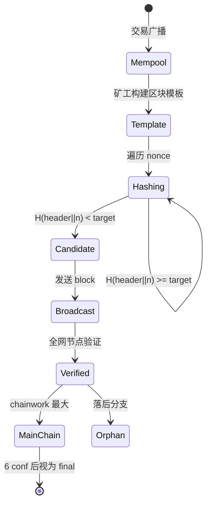

# 工作量证明（Proof of Work, PoW）

> **TL;DR**：PoW 是中本聪 2008 年在 Bitcoin 白皮书中使用的第一代区块链共识机制。其核心是让出块者提交一份"可公开验证、但计算代价昂贵"的哈希谜题解，用 **物理能量** 绑定节点身份、防御 Sybil 攻击。它的理论源头是 1993 年 Dwork-Naor 的反垃圾邮件票据与 1997 年 Adam Back 的 HashCash。PoW 提供 **概率终局**、**开放性极佳**、**安全边界清晰**（51% 算力成本），代价是能耗高、出块慢。本篇从 HashCash 数学到 SHA-256d / Ethash / RandomX 的矿机抗性设计、GHOST 选择规则与 51% 攻击经济学做全景式展开。

## 1. 背景与动机

PoW 并非中本聪发明。1993 年 Cynthia Dwork 与 Moni Naor 在 [《Pricing via Processing, Or, Combatting Junk Mail》](https://www.wisdom.weizmann.ac.il/~naor/PAPERS/pvp.pdf) 中首次提出"要求邮件发送者先算一个函数来提价"。1997 年 Adam Back 的 [HashCash](http://www.hashcash.org/papers/hashcash.pdf) 把它具体化为 SHA-1 哈希前缀 0 位数量证明。2002 年 Dai Wei 的 b-money、2005 年 Nick Szabo 的 Bit Gold 进一步设想"货币 = 计算谜题解"，但都缺一个"公开可验证且抗双花"的账本。

2008 年 10 月 31 日 Satoshi Nakamoto 发布 [Bitcoin White Paper](https://bitcoin.org/bitcoin.pdf)，把 HashCash 嵌入到"区块链 + 最长链规则 + 难度调整"三位一体的框架中，解决了双花问题。2009 年 1 月 3 日 Bitcoin Genesis Block 诞生，区块头 nonce=2083236893 对应 SHA-256d ≤ 2^224 的谜题解，是全世界第一个 PoW 区块。

2011 年 Namecoin 从 Bitcoin 分叉，是第一个 **合并挖矿**（Merged Mining）链。2013 年 Litecoin 用 Scrypt、Monero 用 CryptoNight，试图抵抗 ASIC。2015 年 Ethereum 采用 Ethash（Keccak-256 + DAG 内存硬）用于 CPU/GPU 友好。2018 年 Monero 升级为 RandomX，通过随机指令集让 CPU 变成最优矿机。

PoW 设计哲学的独特价值在于：**把虚拟账本与物理世界能量守恒联系起来**。这是其他机制（PoS 依赖社会共识、弱主观性；PoA 依赖法律合规）无法达到的"无需信任的最终锚定物"。这也是为何 Bitcoin 社区坚持"PoW 是比特币的灵魂"。

## 2. 核心原理

### 2.1 形式化定义

PoW 要求矿工找到一个 nonce `n`，使得：

```
H(blockheader || n) < T
```

其中 `H` 是选定的密码哈希（Bitcoin 取 `SHA-256d = SHA-256(SHA-256(x))`），`T` 是目标（Target）。Target 与"难度 D"的关系：

```
T = T_max / D
T_max = 0x00000000FFFF...0000  (Bitcoin initial target)
```

**二项式概率模型**（见白皮书第 11 节）：设攻击者算力占比 `q = hashrate_attacker / total_hashrate`，诚实算力 `p = 1 - q`（需 `p > q`）。攻击者落后诚实链 z 个块后，追上并超越的概率：

```
P(catchup from z blocks) = (q/p)^z   (若 q < p)
P = 1                                  (若 q ≥ p)
```

具体到 z=6 且 q=0.1：`P ≈ (0.1/0.9)^6 ≈ 0.00000177`，即 **1 在 565,000 分之一**。这是 Bitcoin "6 confirmation = 安全" 经验规则的理论根据。更完整的 Poisson 模型（区块到达服从泊松过程）见 Nakamoto 论文附录。

### 2.2 关键数据结构：区块头

Bitcoin 区块头 80 字节（`bitcoin/src/primitives/block.h`）：

| 字段 | 字节 | 说明 |
| --- | --- | --- |
| nVersion | 4 | 版本号（含 BIP-9 信号位） |
| hashPrevBlock | 32 | 前一个区块头的 SHA-256d |
| hashMerkleRoot | 32 | 本块交易的 Merkle 根 |
| nTime | 4 | Unix 时间戳 |
| nBits | 4 | 压缩难度目标 |
| nNonce | 4 | 挖矿随机数 |

Nonce 空间只有 2^32。当遍历完仍未找到解，矿工会：（1）修改 coinbase tx 的 extraNonce 改变 Merkle 根；（2）修改 nTime（BIP-30 允许 ±2 小时漂移）。因此实际搜索空间是 Merkle × nonce 的笛卡尔积。

### 2.3 子机制拆解

**子机制 1：哈希谜题（Puzzle）**
Bitcoin 用 SHA-256d；SHA-256d 是"反 ASIC 友好"失败的典型——ASIC 在 2013 年由 Canaan 推出，算力提升 10^6 倍。后续设计尝试 ASIC 抵抗：
- **Scrypt**（Litecoin）：内存硬，256KB scratch pad，但 2014 年被 ASIC 攻破。
- **Ethash**（Ethereum 1.0）：1GB DAG + Keccak，GPU 高效，使 ASIC 只能获 2x 优势。
- **RandomX**（Monero 2019-）：随机生成虚拟机指令序列，CPU 特化。
- **Equihash**（Zcash）：Generalized Birthday Problem，200,9 参数下 144MB 内存需求。

**子机制 2：难度调整（Difficulty Retargeting）**
Bitcoin 每 2016 块（约 14 天）按 `new_D = old_D × (14 天 / 实际时间)`，上下限 4×。公式见 `bitcoin/src/pow.cpp` 的 `CalculateNextWorkRequired`：

```cpp
if (nActualTimespan < nTargetTimespan/4) nActualTimespan = nTargetTimespan/4;
if (nActualTimespan > nTargetTimespan*4) nActualTimespan = nTargetTimespan*4;
bnNew *= nActualTimespan;
bnNew /= nTargetTimespan;
```

Ethereum 用每块动态调整（含难度炸弹，Difficulty Bomb，EIP-649/1234/2384/3554/4345/5133 历次推迟）。BCH 2017 引入 EDA（Emergency Difficulty Adjustment），2017-11 换为 ASERT。DigiShield（Dogecoin）、KGW（Verge）属于同类。

**子机制 3：最长链 / 最重链（Fork Choice）**
Bitcoin 选择 **累计 chainwork 最大** 的链，而非块数最多：

```cpp
// bitcoin/src/validation.cpp
bool ChainIsMoreWorkThan(CBlockIndex *a, CBlockIndex *b) {
    return a->nChainWork > b->nChainWork;
}
// nChainWork = sum(2^256 / (target+1)) over all ancestors
```

这避免了"低难度分叉攻击"。Ethereum PoW 时代用 **GHOST** 变体：考虑叔块（uncle blocks）权重，减少短分叉浪费算力；每叔块奖励 7/8 → 2/8（按 generation），见 Yellow Paper 11.1 节。

**子机制 4：奖励与费用市场**
Bitcoin 出块奖励每 21 万块（约 4 年）减半，从 50→25→12.5→6.25→3.125 BTC（2024-04-19 第四次减半）。长期趋于零，矿工将完全依赖交易费。[EIP-1559](https://eips.ethereum.org/EIPS/eip-1559) 在 Ethereum 早期是费用市场改良，但其 baseFee burn 机制直到 The Merge 后仍在 EL 层运作。

**子机制 5：Coinbase 与 Maturity**
Coinbase 交易是区块第一笔，创造新币。Bitcoin 要求 coinbase 输出在后续 100 块内不可花费（COINBASE_MATURITY = 100），防止短链重组后奖励失效。

**子机制 6：Mempool 与交易选择**
矿工按 feerate（sat/vByte）排序选交易填充到 block_size 限制（Bitcoin weight ≤ 4M）。SegWit 后权重公式：`weight = base × 3 + total`。

### 2.4 关键参数表

| 参数 | Bitcoin | Ethereum (pre-Merge) | Litecoin | Monero |
| --- | --- | --- | --- | --- |
| 哈希算法 | SHA-256d | Ethash (Keccak+DAG) | Scrypt | RandomX |
| 目标出块时间 | 600s | 13s | 150s | 120s |
| 难度调整周期 | 2016 块 | 每块 | 2016 块 | 每块（LWMA） |
| 出块奖励（2026） | 3.125 BTC | N/A (已 Merge) | 6.25 LTC | 0.6 XMR 尾发行 |
| 区块大小上限 | 4M weight | gasLimit 30M | 1MB | 动态 |
| Finality 认定 | 6 conf | 15 conf（pre-Merge） | 6 conf | 10 conf |

### 2.5 边界条件与失败模式

- **难度骤降攻击**：攻击者挖 1 小时"时间戳伪造链"，下周期难度降 75%，迅速挖一堆低难度块。BCH 的 EDA 曾因此崩盘。
- **自私挖矿（Selfish Mining）**：[Eyal & Sirer 2013](https://eprint.iacr.org/2013/881.pdf) 证明 25% 以上算力的矿池可通过扣块攻击获得超线性收益，理论下界不再是 51%。
- **扣块/空块攻击**：矿池 fee sniping、withholding attack。
- **算力租用（Hash Rent）**：NiceHash 上租用算力攻击小链（Verge 2018-04 被攻击）。
- **时间戳操纵**：Bitcoin 允许 ±2 小时，可稍微影响难度调整。

### 2.6 状态图



## 3. 架构剖析

### 3.1 分层视图（以 Bitcoin Core 为例）

1. **Network Layer**：`src/net.cpp`、`net_processing.cpp`，TCP 8333 端口，`getheaders`、`getblocks`、`inv`、`tx` 消息。
2. **Mempool**：`src/txmempool.cpp`，feerate 索引与 RBF 支持（BIP-125）。
3. **Validation**：`src/validation.cpp`、`src/pow.cpp`，区块/交易合法性、UTXO 更新。
4. **Mining**：`src/rpc/mining.cpp`、`src/node/miner.cpp`，`getblocktemplate`（BIP-22/23）。
5. **Wallet**：`src/wallet/`，BIP-32/44 HD、BIP-39 助记词（见本仓库 `02-wallet/`）。

### 3.2 核心模块清单

| 模块 | 职责 | 源码目录 | 可替换性 |
| --- | --- | --- | --- |
| Block Validator | 区块/交易验证 | `bitcoin/src/validation.cpp` | 低（共识） |
| PoW Checker | 难度校验 | `bitcoin/src/pow.cpp` | 低 |
| UTXO Set | 未花费输出索引 | `bitcoin/src/coins.cpp`、`src/txdb.cpp` | 中（数据库引擎） |
| Mempool | 未打包交易池 | `bitcoin/src/txmempool.cpp` | 高 |
| Miner Template | `getblocktemplate` | `bitcoin/src/node/miner.cpp` | 高 |
| Wallet | BIP-32/39/44 | `bitcoin/src/wallet/` | 高 |
| P2P Protocol | 消息处理 | `bitcoin/src/net_processing.cpp` | 中 |
| Script Engine | Script/Taproot | `bitcoin/src/script/interpreter.cpp` | 低 |
| Chain Index | 区块元数据 | `bitcoin/src/blockstorage.cpp` | 高 |
| RPC/REST API | JSON-RPC 8332 | `bitcoin/src/rpc/` | 高 |

### 3.3 端到端数据流（Bitcoin）

1. **T+0**：用户钱包用 `sendrawtransaction` 广播。
2. **T+0-2s**：交易经 P2P 传播至 `ATMPoolAcceptToMemoryPoolWorker`（`src/validation.cpp`）验证脚本、feerate、RBF 规则。
3. **T+0-60s**：85%+ 节点 mempool 已包含（见 Blocksci 统计）。
4. **T+0-600s**：矿工构造 template，pool 分发给各 worker 的 ASIC。
5. **T+N·600s**：某矿工 ASIC 找到 `H < T`，向 Stratum Pool 提交 share → Pool 提交到 Bitcoin 网络。
6. **T+N·600s + 传播**：全节点接收、验证、加入 mainchain。
7. **T+(N+6)·600s ≈ 1 小时**：达到 6 confirmation，交易视为 final。

### 3.4 客户端多样性

| 实现 | 语言 | 市占 | 特点 |
| --- | --- | --- | --- |
| Bitcoin Core | C++ | >95% | 参考实现 |
| btcd | Go | <2% | 去掉共识关键路径争议后回归 |
| libbitcoin | C++ | <1% | 独立实现，用于研究 |
| bcoin | JavaScript | <0.5% | 浏览器可跑 |
| Ethereum PoW: go-ethereum Classic | Go | ETC 主力 | Merge 前 1.10.x |
| Ethereum PoW: nethermind | C# | 辅助 | |

Bitcoin 客户端多样性极低是 **已知系统性风险**。Jameson Lopp 在 [《The Problem of Monoculture》](https://blog.lopp.net/) 多次警示。

### 3.5 接口

- JSON-RPC 8332（`getblockcount`、`getrawtransaction`、`sendrawtransaction`）。
- ZMQ `hashblock`、`rawtx`（低延迟通知）。
- REST `/rest/block/`、`/rest/tx/`。
- Stratum v1/v2（矿池协议，v2 为 2022 [BIP-8](https://github.com/stratum-mining/sv2-spec) 新版，端到端加密 + 去信任化）。

## 4. 关键代码

```cpp
// bitcoin/src/pow.cpp  (v26.0)
bool CheckProofOfWork(uint256 hash, unsigned int nBits, const Consensus::Params& params) {
    bool fNegative, fOverflow;
    arith_uint256 bnTarget;
    bnTarget.SetCompact(nBits, &fNegative, &fOverflow);
    if (fNegative || bnTarget == 0 || fOverflow || bnTarget > UintToArith256(params.powLimit))
        return false;
    // 关键：hash 必须小于等于 target
    if (UintToArith256(hash) > bnTarget) return false;
    return true;
}
```

```cpp
// bitcoin/src/pow.cpp - 难度调整
unsigned int CalculateNextWorkRequired(const CBlockIndex* pindexLast, int64_t nFirstBlockTime, const Consensus::Params& params) {
    int64_t nActualTimespan = pindexLast->GetBlockTime() - nFirstBlockTime;
    // 限制 0.25x - 4x 范围
    if (nActualTimespan < params.nPowTargetTimespan/4) nActualTimespan = params.nPowTargetTimespan/4;
    if (nActualTimespan > params.nPowTargetTimespan*4) nActualTimespan = params.nPowTargetTimespan*4;
    arith_uint256 bnNew;
    bnNew.SetCompact(pindexLast->nBits);
    bnNew *= nActualTimespan;
    bnNew /= params.nPowTargetTimespan;
    if (bnNew > UintToArith256(params.powLimit)) bnNew = UintToArith256(params.powLimit);
    return bnNew.GetCompact();
}
```

## 5. 演进与版本对比

| 年份 | 事件 | 影响 |
| --- | --- | --- |
| 1997 | HashCash | 反垃圾邮件工作量函数 |
| 2008 | Bitcoin 白皮书 | PoW + 最长链 |
| 2009 | Bitcoin Genesis（01/03） | 首个 PoW 主网 |
| 2011 | Namecoin | 首次合并挖矿 |
| 2013 | Litecoin Scrypt / ASIC for SHA256 | 反 ASIC 浪潮 |
| 2015 | Ethereum Ethash（07/30） | GPU 友好 DAG PoW |
| 2016 | Zcash Equihash | 内存硬 PoW |
| 2017 | BCH 分叉（08/01） | 8MB 块 + EDA |
| 2019 | Monero RandomX | CPU 友好 |
| 2020 | Ethereum Difficulty Bomb 多次推迟 | 为 Merge 铺路 |
| 2022-09-15 | Ethereum The Merge | 全球最大 PoW 链转 PoS |
| 2024-04-19 | Bitcoin 第四次减半 | 奖励 3.125 BTC |

## 6. 实战示例：CPU 挖一个 testnet 区块

```bash
# 启动 bitcoind regtest 模式
bitcoind -regtest -daemon
# 创建钱包
bitcoin-cli -regtest createwallet "demo"
# 生成 101 块到自己地址（regtest 难度很低）
ADDR=$(bitcoin-cli -regtest -rpcwallet=demo getnewaddress)
bitcoin-cli -regtest generatetoaddress 101 $ADDR
# 查看余额（50 BTC * 1 个成熟块）
bitcoin-cli -regtest -rpcwallet=demo getbalance
# 预期：50.00000000
```

```python
# 纯 Python SHA-256d 难度 1 mining 示例（教学用）
import hashlib, struct
def sha256d(x): return hashlib.sha256(hashlib.sha256(x).digest()).digest()
header = bytes.fromhex('...')  # 80 字节区块头（不含 nonce）
target = 0x00000000FFFF0000000000000000000000000000000000000000000000000000
for nonce in range(0, 2**32):
    h = int.from_bytes(sha256d(header + struct.pack('<I', nonce))[::-1], 'big')
    if h < target:
        print(f'Found nonce={nonce}'); break
```

## 7. 安全与已知攻击

- **51% 双花攻击历史**：Ethereum Classic 2019-01、2020-07/08（三次），每次造成 ~$1.1M 双花（[Coinbase postmortem](https://blog.coinbase.com/ethereum-classic-etc-is-currently-being-51-attacked-33be13ce32de)）。Bitcoin Gold 2018-05、2020-01 被攻击 $72K + $87K（[Crypto51.app](https://www.crypto51.app/) 算力租金持续追踪，截至 2026-04-22）。
- **Verge XVG 2018-04 多次被攻**：难度调整漏洞被利用，攻击者挖出 ~35M XVG。
- **Selfish Mining 理论攻击**：[Eyal & Sirer 2013](https://eprint.iacr.org/2013/881.pdf)；无公开实例，但矿池算力集中（Foundry USA + AntPool 合计 > 50%，截至 2025 Q4 数据来自 [mempool.space/mining](https://mempool.space/mining)）已足以引发担忧。
- **Finney Attack / Race Attack**：零确认双花。
- **时间戳攻击 BCH ASERT 前**：EDA 被利用切换链导致价格波动。

## 8. 与同类方案对比

| 维度 | PoW | PoS | PBFT/BFT |
| --- | --- | --- | --- |
| Sybil 抵抗 | 物理能耗 | 经济质押 | 许可白名单 |
| Finality | 概率（分钟–小时） | 经济（~12 分钟） | 确定性（秒级） |
| 能耗 | 极高（~150 TWh/年 Bitcoin 2024） | 极低 | 极低 |
| Byz 上限 | 50% 算力 | 33% 质押 | 33% 节点 |
| 开放性 | 最强 | 强（stake 门槛） | 弱 |
| 攻击后恢复 | 靠长链重组 | Slashing + Social | view change |
| 去中心化（2024 实测） | Bitcoin 挖矿 4 池 > 70% | Ethereum Lido > 28% | Tendermint 链通常 <100 节点 |

PoW 的核心优势是 **"跟物理定律挂钩，社会攻击面最小"**；核心劣势是能耗与出块慢。Ethereum 选择 Merge 到 PoS 的核心理由，是当 Ethereum 作为全球清算层后，"经济安全 > 能量安全"（Vitalik 2020）。

## 9. 延伸阅读

- **Tier 1**：
  - [Bitcoin White Paper](https://bitcoin.org/bitcoin.pdf)
  - [bitcoin/bitcoin GitHub](https://github.com/bitcoin/bitcoin)
  - [Ethereum Yellow Paper (Ethash)](https://ethereum.github.io/yellowpaper/paper.pdf)
  - [RandomX Spec](https://github.com/tevador/RandomX/blob/master/doc/specs.md)
- **Tier 2**：
  - Messari 年度 Bitcoin mining 报告
  - a16z [What is a 51% attack?](https://a16zcrypto.com/)
- **Tier 3**：
  - Jameson Lopp [bitcoin-resources](https://lopp.net/bitcoin.html)
  - Vitalik [A Proof of Stake Design Philosophy](https://vitalik.eth.limo/)
  - learnblockchain.cn Bitcoin 源码解析专栏
- **论文**：
  - Eyal & Sirer, [Majority is not Enough: Bitcoin Mining is Vulnerable](https://eprint.iacr.org/2013/881.pdf)
  - Garay, Kiayias, Leonardos, [The Bitcoin Backbone Protocol](https://eprint.iacr.org/2014/765)
  - Sompolinsky & Zohar, [Accelerating Bitcoin's Transaction Processing (GHOST)](https://eprint.iacr.org/2013/881.pdf)
- **BIP**：
  - [BIP-22/23](https://github.com/bitcoin/bips/blob/master/bip-0022.mediawiki) getblocktemplate
  - [BIP-141](https://github.com/bitcoin/bips/blob/master/bip-0141.mediawiki) SegWit

## 10. 术语表

| 术语 | 英文 | 释义 |
| --- | --- | --- |
| 工作量证明 | Proof of Work | 通过计算成本证明劳动力 |
| 难度 | Difficulty | 当前目标哈希的倒数比例 |
| 目标 | Target | 哈希必须小于的阈值 |
| 挖矿池 | Mining Pool | 聚合算力分摊风险的组织 |
| 叔块 | Uncle / Ommer Block | 未被主链采纳的旁支块（Ethereum） |
| 双花 | Double Spend | 同一笔钱花两次 |
| 51% 攻击 | 51% Attack | 超过半数算力改写历史 |
| 难度炸弹 | Difficulty Bomb | Ethereum 内置难度指数增长项 |
| 合并挖矿 | Merged Mining | 同一 nonce 对两条链同时有效 |
| 链工作量 | Chainwork | 累积所有祖先区块的 2^256/(target+1) |

---

*Last verified: 2026-04-22*
