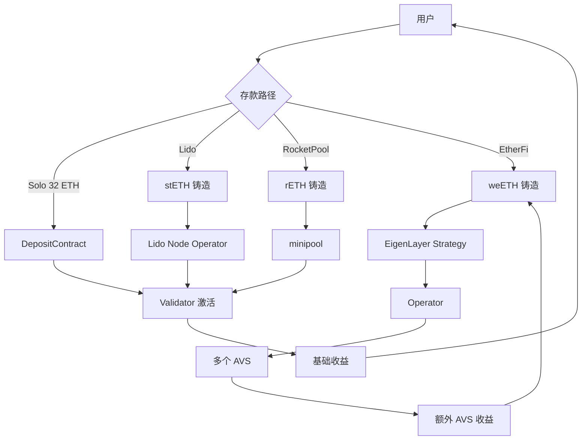

# 质押经济学（Staking Economics）

> **TL;DR**：质押经济学研究 PoS/DPoS 链上"锁定代币 → 获得共识投票权 → 赚取收益"的激励结构。关键参数：通胀曲线（issuance）、验证者门槛（Ethereum 32 ETH / Pectra 后最高 2048 ETH）、slashing 比例、退出/解锁期。生态层面有 **委托质押（Solana）**、**流动性质押 LSD（Lido stETH、RocketPool rETH）**、**再质押 LRT（EigenLayer、Karak、Symbiotic）** 三层抽象。2024-2026 Restaking 的崛起使 ETH "质押→再质押→AVS" 链条化，TVL 曾达 $20B+，但 Vitalik 警告其对 Ethereum 共识的"overload risk"。本文梳理收益率构成（issuance + MEV + tips + AVS）、损失分布（slashing 函数）、主流协议对比。

## 1. 背景与动机

PoW 矿工收益 = 出块奖励 + 交易费，自然形成市场均衡（电价低 → 更多矿工入场）。PoS 复杂得多：

1. **资本成本**：质押 ETH 的机会成本 = 无风险利率 + 流动性溢价 + 波动风险。
2. **运营成本**：运行节点的硬件 + 带宽 + DevOps。
3. **Slashing 风险尾部**：1/32 或更多罚没。
4. **代币锁定**：32 ETH 原生质押退出需排队 + withdrawal queue（2024-Q2 曾 ~45 天）。

为降低门槛、提高资本效率，衍生出：
- **Pool Staking**（Lido）：用户存 ETH 换 stETH，Lido 运营节点。
- **SaaS**（Staked.us、Figment）：机构化托管节点。
- **LST**（Liquid Staking Token）：stETH、rETH、cbETH 可在 DeFi 再用。
- **LRT**（Liquid Restaking Token）：ezETH、weETH、rsETH，再质押到 EigenLayer 的 AVS，获额外收益。

2023-2024 Restaking 爆发背景：EigenLayer 主网 2023-04 上线，允许质押者"重新保证" 某些链下服务（AVS = Actively Validated Services，如预言机、DA、跨链桥）。安全资本可复用，理论收益叠加。但 2024 年 Vitalik 多次警示（[Don't overload Ethereum consensus](https://vitalik.eth.limo/general/2023/05/21/dont_overload.html)）。

## 2. 核心原理（质押经济学建模）

### 2.1 收益率构成

Ethereum validator 年化收益（APR）由四部分组成：

```
APR = Issuance_yield + Tips_yield + MEV_yield + (可选) AVS_yield
```

**Issuance yield**（EIP-2982 + Altair）：

```
base_reward_per_validator = 64 × effective_balance × BASE_REWARD_FACTOR / sqrt(total_staked_ETH)
```

BASE_REWARD_FACTOR = 64，理论公式：`yield = 2.6 / sqrt(total_staked_ETH in millions)`。当总质押 = 34M ETH 时，issuance yield ≈ `2.6 / sqrt(34) ≈ 0.446`，约 **3.2%-3.5% APR**（含惩罚后）。

**Tips & MEV**：EIP-1559 后 priority fee 归 proposer；MEV 通过 MEV-Boost relay 流向 proposer。2024 年实际 MEV+Tips 贡献约 **1-2% APR 均值**（但方差大，尾部 block 可达 100+ ETH 单块）。

**AVS yield**（再质押）：EigenLayer AVS 额外支付，2024 Q2 均值 **0.5-3% APR**，依 AVS 需求波动。

**总 APR（2026-04 估算）**：
- 纯 Solo Stake：~3.5%
- Lido stETH：~3.0%（扣 10% fee）
- EtherFi weETH + EigenLayer：~4-6%

### 2.2 Slashing 函数

Ethereum slashing（`consensus-specs/specs/phase0/beacon-chain.md`）：

```
initial_slash = effective_balance / MIN_SLASHING_PENALTY_QUOTIENT  (= EB/32)
correlation_penalty = 3 × (slashed_balance_in_window / total_balance) × effective_balance
with_window = EPOCHS_PER_SLASHINGS_VECTOR = 8192 epoch (~36 day)
```

若 total slashing 在 8192 epoch 内 ≥ 1/3 total stake，则 correlation_penalty 足以 slash 掉全部 32 ETH。单验证者恶意但无串谋：最多 slash ~1 ETH + 告发者奖励 1/512 EB。**恶意串谋 1/3 stake：所有串谋者全部 slash**。

Solana slashing：**社会执行**（无 on-chain slash 合约），validator 若双签须通过 social coordination 软分叉（罕见发生）。SIMD-0017 in-protocol slashing 2024 讨论中。

Cosmos：double-sign 自动 slash 5%；downtime 超过 500/10000 block 在 8 小时 window 内 slash 0.01%。

### 2.3 子机制拆解

**子机制 1：委托质押（Solana、Cosmos）**
用户无需自己运营节点，可 delegate stake 到 validator，按比例分收益。Solana：`solana delegate-stake`，收益扣 commission（通常 5-10%）。Cosmos：`gaiad tx staking delegate`，同时委托者承担 validator 的 slash。

**子机制 2：LSD（Liquid Staking Derivatives）**
Lido（stETH）机制：
- 用户存入 ETH → Lido 合约铸 stETH（1:1 锚定）。
- Lido 协议控制 Curated Set（~30 个 Node Operator），分配 ETH 到各 operator 的 32 ETH 验证者。
- 收益 rebase 到 stETH 余额（每日自动调整）。
- 10% fee 分给 operator 与 DAO treasury。

stETH vs ETH 脱锚事件：
- 2022-06 Terra 崩盘连带 stETH 跌至 0.94 ETH（Celsius 被迫清算）。
- 2023-04-12 Shapella 启用 withdrawal 后 stETH 恢复稳定，现偏离 < 0.1%。

Rocket Pool（rETH）：
- 模块化 node operator，16 ETH 质押 + 16 ETH 从 rETH pool 借（需额外 RPL 抵押）。
- 更去中心化但 TVL 仅为 Lido 的 1/10。

Coinbase cbETH、Binance wBETH、Frax sfrxETH 为中心化版本。

**子机制 3：LRT（Liquid Restaking）**
EigenLayer 流程：
1. 用户将 stETH 存入 EigenLayer Strategy Manager（`eigenlayer-contracts/src/StrategyManager.sol`）。
2. Delegate 给一个 Operator（节点运营者）。
3. Operator opt-in 到多个 AVS（EigenDA、AltLayer MACH、Hyperlane 等）。
4. 若 Operator 在 AVS 上作恶，EigenLayer 合约触发 slashing（2024 Q4 启用）。
5. 收益从 AVS 支付给 Operator，Operator 分给 Delegator。

LRT Protocol（EtherFi weETH、Renzo ezETH、Kelp rsETH）：封装 EigenLayer 的委托层，让用户持有流动性 token 即可获 restaking 收益。2024-Q2 LRT TVL 达 $10B。

Karak、Symbiotic 为竞品：
- **Karak**：支持多链、多资产抵押。
- **Symbiotic**：无许可 vault 模型，可自定义 slashing 函数。

**子机制 4：退出与解锁**
Ethereum withdrawal（Shapella 2023-04）：
- `process_voluntary_exits` 入队；每 epoch 最多 `churn_limit = validator_count / 65536` 个退出。
- 退出后 `withdrawable_epoch = exit_epoch + 256 epochs (~27 hours)`。
- 2024-Q2 入队峰值 > 1M ETH，~45 天队列；2025 Q2 回落到 < 1 day。

Solana 解质押：`solana deactivate-stake`，一个 epoch（~2 天）后可取。

Cosmos 解绑：21 天 unbonding period。

**子机制 5：Validator Performance Attribution**
研究者通过 [rated.network](https://www.rated.network/) 或 [beaconcha.in](https://beaconcha.in/) 分析：
- Effectiveness：attestation 是否 on-time & correct head（通常 >97% 为优）。
- Proposer success rate：被选中时是否成功出块。
- MEV boost relay 选择：影响 tips 收益。

**子机制 6：EIP-7251 MaxEB（Pectra）**
MAX_EFFECTIVE_BALANCE 从 32 ETH 提升至 2048 ETH（Pectra 2025-05）。优势：单验证者可累积更多质押，降低信号数；允许 auto-compounding；减小 consensus 负担（validator 数从 1.2M 降到 ~300K 潜力）。

### 2.4 关键参数表

| 参数 | Ethereum | Solana | Cosmos | BSC |
| --- | --- | --- | --- | --- |
| 最低 stake | 1 ETH（存款）/ 32 ETH（激活） | 无（delegator） | 无 | 2000 BNB |
| MaxEB | 2048 ETH（Pectra 后） | 无上限 | 无 | 无 |
| Issuance (2026) | 2.6/sqrt(staked) ~3.3% | 4.6% → 1.5% 尾 | 7-20% 动态 | 0% |
| Commission | Lido 10%, RP 5-15%, Solo 0% | 5-10% | 5-10% | 0% |
| Slashing | 1/32 min, 最大 100% | 社会执行 | 5% ds, 0.01% dt | 跳轮 |
| Exit queue | churn limit 可调 | 1 epoch | 21 day | 7 day |
| Total Staked (04/2026) | ~34M ETH (~28% supply) | ~390M SOL (~65%) | ~210M ATOM (~55%) | ~50M BNB |

> 数据来源 [beaconcha.in](https://beaconcha.in)、[stakingrewards.com](https://stakingrewards.com) 2026-04 综合。

### 2.5 边界条件

- **Issuance 过高**：LST 主导（Lido > 30% 总 stake 临界线），引发中心化担忧。2023 社区讨论 "reduce issuance" EIP 提案（如 Anders Elowsson 的 [可持续 issuance](https://ethresear.ch/t/endgame-staking-economics/18751)）。
- **Exit Queue 拥堵**：2024-Q2 有 > 10% validator 等 exit，可能影响共识安全响应（但 churn limit 保护下仍可控）。
- **LRT 去杠杆**：若 AVS 收益下降，LRT 赎回潮可能拖垮 EigenLayer 流动性。2024-06 Renzo ezETH 短暂脱锚 ~10%。
- **Tail risk**：若 1/3 stake 协同作恶，整个 Ethereum 信仰坍塌，ETH 价格可能归零 → slashing 价值也归零。

### 2.6 状态图



## 3. 架构剖析

### 3.1 分层视图

1. **L0 - Chain Consensus**：Ethereum CL Validator Signing。
2. **L1 - Native Staking**：DepositContract + WithdrawalCredential。
3. **L2 - Liquid Staking**：Lido、RocketPool 等 LSD 协议合约。
4. **L3 - Restaking**：EigenLayer、Karak、Symbiotic Strategy/Operator。
5. **L4 - Liquid Restaking**：EtherFi、Renzo、Kelp 等 LRT。
6. **L5 - DeFi Composability**：Pendle YT/PT、Ethena 等二级衍生。

### 3.2 核心模块清单

| 模块 | 职责 | 源码 | 可替换 |
| --- | --- | --- | --- |
| Deposit Contract | 存 32 ETH → validator | `ethereum/consensus-specs/solidity_deposit_contract/` | 极低 |
| Validator Registry | validator 集合 | `consensus-specs/specs/phase0/beacon-chain.md#Validator` | 低 |
| Slashing Detector | 检测双签 | `prysm/beacon-chain/slashings/`、`lighthouse/beacon_node/slasher/` | 中 |
| Withdrawal Queue | 退出排队 | `consensus-specs/specs/capella/` | 低 |
| Lido Protocol | stETH 铸造与质押分配 | `lidofinance/lido-dao`、`core/Lido.sol` | 中（独立协议） |
| RocketPool Minipool | 16 ETH 模块 | `rocket-pool/rocketpool/contracts/contract/minipool/` | 中 |
| EigenLayer StrategyManager | 接受 LST/ETH | `Layr-Labs/eigenlayer-contracts/src/contracts/core/StrategyManager.sol` | 低 |
| EigenLayer DelegationManager | 委托关系 | `Layr-Labs/eigenlayer-contracts/src/contracts/core/DelegationManager.sol` | 低 |
| EigenLayer AVSDirectory | AVS 注册 | `Layr-Labs/eigenlayer-contracts/src/contracts/core/AVSDirectory.sol` | 低 |
| EtherFi Liquidity Pool | weETH | `etherfi-protocol/smart-contracts/` | 中 |
| Karak Core | 多链 restaking | `karak-network/contracts/` | 中 |
| Symbiotic Vault | 无许可 slashing | `symbioticfi/core/src/contracts/vault/` | 中 |

### 3.3 端到端数据流（EtherFi + EigenLayer）

1. **T+0**：用户存 ETH → EtherFi `LiquidityPool` → 铸 eETH（rebase）。
2. **T+0**：eETH 可包装为 weETH（non-rebase，DeFi 兼容）。
3. **T+~1h**：EtherFi 将 ETH 分配到 Node Operator，激活 validator（触发 32 ETH DepositContract）。
4. **T+~1-7d**：validator 激活成功，开始 attestation 挣基础收益。
5. **T+同时**：EtherFi 将已激活的 validator BeaconChain balance 同步到 EigenLayer EigenPod。
6. **T+0（合约层）**：用户在 EtherFi 默认 delegate 给 EtherFi 挑选的 Operator。
7. **Operator opt-in AVS**：该 Operator 的 weight 参与多个 AVS（如 EigenDA）的 quorum。
8. **AVS 奖励**：各 AVS 支付 ETH/自身 token 给 Operator，分给 Delegator（用户）。

### 3.4 客户端多样性

- Lido Node Operator：~30 家（Chorus One、Figment、P2P 等），Curated Set 决定。
- RocketPool：~3500 node operator（2025 Q3 数据）。
- EigenLayer Operators：> 200（截至 2025 Q4，[EigenLayer dashboard](https://app.eigenlayer.xyz/)）。
- Solana validators：~1500 active。

### 3.5 接口

- **Deposit Contract**（[deposit-contract](https://github.com/ethereum/consensus-specs/tree/dev/solidity_deposit_contract)）：`deposit(pubkey, withdrawal_credentials, signature, deposit_data_root)`。
- **Lido Submit**：`Lido.submit(referral)`。
- **EigenLayer Strategy**：`StrategyManager.depositIntoStrategy(strategy, token, amount)`。
- **EigenLayer Delegate**：`DelegationManager.delegateTo(operator, approverSignatureAndExpiry, approverSalt)`。

## 4. 关键代码

```solidity
// Layr-Labs/eigenlayer-contracts/src/contracts/core/StrategyManager.sol
function depositIntoStrategy(
    IStrategy strategy,
    IERC20 token,
    uint256 amount
) external onlyWhenNotPaused(PAUSED_DEPOSITS) onlyNotFrozen(msg.sender) nonReentrant returns (uint256 shares) {
    shares = _depositIntoStrategy(msg.sender, strategy, token, amount);
}

function _depositIntoStrategy(
    address staker,
    IStrategy strategy,
    IERC20 token,
    uint256 amount
) internal returns (uint256 shares) {
    // 1. 把 token 转进 strategy
    token.safeTransferFrom(msg.sender, address(strategy), amount);
    // 2. 调 strategy 计算份额
    shares = strategy.deposit(token, amount);
    // 3. 记录用户份额
    _addShares(staker, token, strategy, shares);
    // 4. delegation 同步：若用户已委托，更新 operator 的 share
    delegation.increaseDelegatedShares(staker, strategy, shares);
    emit Deposit(staker, token, strategy, shares);
}
```

```solidity
// lidofinance/lido-dao/contracts/0.4.24/Lido.sol
function submit(address _referral) public payable returns (uint256) {
    require(msg.value != 0, "ZERO_DEPOSIT");
    uint256 sharesAmount = getSharesByPooledEth(msg.value);
    if (sharesAmount == 0) {
        // 首次铸造 1:1
        sharesAmount = msg.value;
    }
    _mintShares(msg.sender, sharesAmount);
    _setBufferedEther(_getBufferedEther().add(msg.value));
    emit Submitted(msg.sender, msg.value, _referral);
    _emitTransferAfterMintingShares(msg.sender, sharesAmount);
    return sharesAmount;
}
```

## 5. 演进时间线

| 年份 | 事件 |
| --- | --- |
| 2012 | PPCoin PoS |
| 2020-11 | Lido V1 上线（Ethereum Beacon Chain phase 0） |
| 2020-12-01 | Beacon Chain，32 ETH 启动 |
| 2021-10 | RocketPool V1 上线 |
| 2022-09-15 | Ethereum The Merge，质押者获 MEV |
| 2023-04-12 | Shapella，withdrawal 启用 |
| 2023-04 | EigenLayer Stage 1 （LST restaking） |
| 2023-06 | EigenLayer Stage 2 （native restaking） |
| 2024-01 | LRT 爆发，EtherFi TVL > $1B |
| 2024-04 | EigenLayer rewards distribution (AVS → Delegator) |
| 2024-10 | EigenLayer slashing 启用 |
| 2025-05 | Pectra EIP-7251 MaxEB 2048 ETH |

## 6. 实战示例

```bash
# 1. Solo Stake（需要 32 ETH + 节点硬件）
# 生成 keys
./deposit-cli new-mnemonic --chain mainnet --num_validators 1
# 访问 launchpad 提交 deposit data
# https://launchpad.ethereum.org/

# 2. Lido（零门槛）
# 在 https://stake.lido.fi/ 存入任意 ETH → 获 stETH

# 3. EigenLayer + EtherFi Restaking
# 在 https://app.ether.fi/ 存 ETH → 获 eETH → 自动 restake

# 4. 查询我的 validator 效率
curl "https://beaconcha.in/api/v1/validator/YOUR_VALIDATOR_INDEX/performance"

# 5. 查询 AVS 收益
curl "https://app.eigenlayer.xyz/api/avs/rewards/YOUR_OPERATOR_ADDRESS"
```

## 7. 安全与已知攻击 / 风险事件

- **Celsius 被迫 stETH 清算 2022-06**：Celsius 持有大量 stETH 但客户要求 ETH 赎回。stETH 流动性枯竭，价格跌至 0.94。Lido 无 safeguard，迫使 Celsius 进入 Chapter 11。
- **Ronin Bridge 2022-03 $625M**：9 个 Axie 委托 validator 中 5 个 key 被 Lazarus 社工获取，演示 DPoS 型小集合 staking 的 Byz 假设脆弱。
- **Terra LUNA/UST 2022-05**：Tendermint PoS validators stake 价值暴跌 99.9%（UST 锚定 LUNA 恶性循环），剩余链上安全性近零。教训：PoS 安全是代币价格的函数。
- **Lido 市占争议**：2023-2024 Lido stETH 持续 > 25% total stake，接近"公地悲剧"警戒线 33%。Dankrad Feist 等社区领袖倡议"自我 cap"。
- **Renzo ezETH 脱锚 2024-04-24**：LRT 协议突然公布 tokenomics，引发恐慌，ezETH 24h 跌 10%；背景是 Pendle YT 大量清算。教训：LRT 层存在流动性叠加风险。
- **EigenLayer AVS slashing 延期**：原计划 2024 Q2 启用 slashing，因 AVS 代码复杂性推迟到 2024 Q4-2025。期间 restaker 承担"承诺 slashable 但实际未 slash"的声誉风险。
- **Lazarus 针对 exit queue 攻击**：理论上若攻击者控制 > churn limit 的验证者同时作恶，exit queue 延迟会放大 slashing 窗口。尚无实例。

## 8. 主流协议对比

| 维度 | Solo 32 ETH | Lido (stETH) | RocketPool (rETH) | EtherFi (weETH) | Coinbase (cbETH) |
| --- | --- | --- | --- | --- | --- |
| 最低门槛 | 32 ETH | 0.0001 ETH | 0.01 ETH | 0.0001 ETH | 无 |
| 去中心化 | 极高 | 中（30 operator） | 较高（3.5k node） | 中 | 低（CEX） |
| Fee | 0 | 10% | ~14% | ~10% | 25% |
| Restaking 支持 | 手动 | 无原生 | 无原生 | 原生 EigenLayer | 无 |
| 流动性 | 低（自管） | 极高 | 高 | 高 | 中 |
| Slash 风险 | 自担 | 社会化分摊 | Operator 抵押 RPL 覆盖 | 社会化分摊 | Coinbase 兜底 |
| TVL（2026-04） | ~9M ETH | ~9.5M ETH | ~0.8M ETH | ~2.3M ETH | ~0.8M ETH |

AVS / Restaking 维度：

| 协议 | 多资产 | 多链 | Slashing | TVL | 特点 |
| --- | --- | --- | --- | --- | --- |
| EigenLayer | LST + ETH | Ethereum | 2024 Q4 启用 | $15B | 首创、生态最大 |
| Karak | ETH/BTC/stable | 多链 | 启用 | $1B | 多资产 |
| Symbiotic | 任意 ERC20 | Ethereum | 无许可 | $2B | 可定制 vault |
| Babylon | BTC | Cosmos zones | Bitcoin timelock | $5B | BTC 原生 |

## 9. 延伸阅读

- **Tier 1**：
  - [Ethereum consensus-specs](https://github.com/ethereum/consensus-specs)
  - [Lido docs](https://docs.lido.fi/)
  - [RocketPool docs](https://docs.rocketpool.net/)
  - [EigenLayer docs](https://docs.eigenlayer.xyz/)
  - [EtherFi docs](https://etherfi.gitbook.io/)
  - [Solana staking economics](https://solana.com/docs/economics)
- **Tier 2/3**：
  - Vitalik [Don't overload Ethereum consensus](https://vitalik.eth.limo/general/2023/05/21/dont_overload.html)
  - Anders Elowsson [Endgame staking economics](https://ethresear.ch/t/endgame-staking-economics/18751)
  - Messari [Staking Report 2024](https://messari.io/)
  - Galaxy Digital Restaking report
  - [rated.network](https://www.rated.network/) validator 性能
  - [stakingrewards.com](https://www.stakingrewards.com/) APY 比较
- **相关 EIP**：
  - [EIP-2982 Serenity](https://eips.ethereum.org/EIPS/eip-2982)
  - [EIP-7002 EL-triggered withdrawals](https://eips.ethereum.org/EIPS/eip-7002)
  - [EIP-7251 MaxEB 2048](https://eips.ethereum.org/EIPS/eip-7251)
  - [EIP-7514 Churn limit reduction](https://eips.ethereum.org/EIPS/eip-7514)

## 10. 术语表

| 术语 | 英文 | 释义 |
| --- | --- | --- |
| 质押 | Staking | 锁定代币以获取共识权 |
| 流动性质押 | Liquid Staking (LST) | 质押同时获可交易凭证（stETH） |
| 再质押 | Restaking | 将已质押资产再保证其他服务 |
| 流动性再质押 | Liquid Restaking (LRT) | 再质押凭证 token |
| AVS | Actively Validated Services | EigenLayer 服务类别 |
| Slashing | Slashing | 惩罚没收 |
| Issuance | Issuance | 协议通胀 |
| MEV | Maximal Extractable Value | 矿工/proposer 可捕获的价值 |
| Churn Limit | Churn Limit | 退出/激活流量上限 |
| MaxEB | Max Effective Balance | 单验证者最高有效余额 |
| Operator | Operator | EigenLayer 运营者 |
| Delegator | Delegator | 委托人 |
| Weak Subjectivity | Weak Subjectivity | 新节点需信任近期 checkpoint |

---

*Last verified: 2026-04-22*
