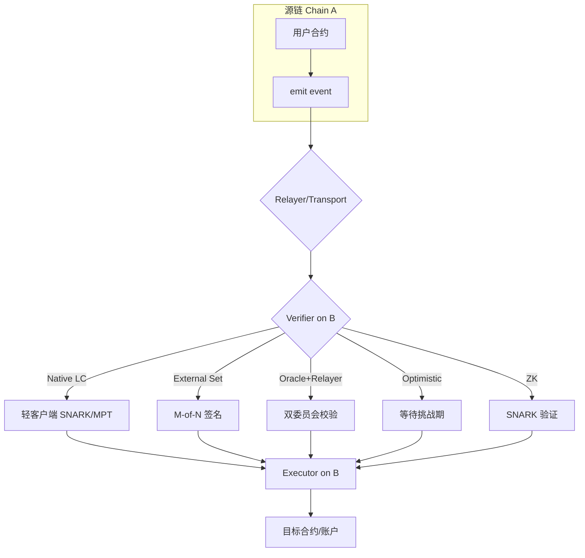

# 跨链总览（Interoperability Landscape）

> **TL;DR**：随着多链格局成型，"跨链"（Cross-chain / Interoperability）从"资产桥"扩展到 **任意消息传递（Generic Message Passing, GMP）** 与 **跨链结算层（shared sequencing / intent）**。本总览以三个坐标刻画方案：**(1) 验证方式**——Native Light Client、外部验证者集合、Oracle+Relayer、ZK Proof、Optimistic；**(2) 信任最小化程度**——从 Trustless 到 Multi-sig；**(3) 功能层级**——Asset Bridge / Message Passing / Shared State / Intent Execution。过去 5 年累计跨链桥损失超 **\$25 亿**（Ronin、Wormhole、Nomad、Poly、Multichain、Orbit），超越任一 DeFi 漏洞子类。理解跨链 = 理解"把一条链的状态可信地告诉另一条链"的代价函数。

---

## 1. 背景与动机

**为什么需要跨链？** 2016–2020 年 Ethereum 单链承载了绝大多数 DeFi；2021 年后 BSC、Avalanche、Solana、Polygon、Fantom 同时崛起；2022–2024 年 L2（Arbitrum、Optimism、zkSync、Base）+ app-chain（Cosmos、Polkadot parachain、Avalanche subnets、Orbit/Superchain）裂变。**异构执行环境 + 独立状态机 → 需要互操作协议**。

需求按场景分层：
1. **资产转移**：USDC 从 Ethereum 到 Base；BTC 包装为 wBTC。
2. **消息传递**：Arbitrum 合约调用 Optimism 合约；跨链治理投票。
3. **共享执行 / Intent**：用户只表达意图（"卖 1 ETH 换 USDC，跨任意链"），Solver 承担跨链执行（CoW、Across、UniswapX）。
4. **共享排序 / 共享 DA**：Espresso、Astria 提供跨 Rollup 统一 Sequencer。

## 2. 核心原理

### 2.1 形式化定义：跨链协议的三个不变式

**跨链协议 P** 由 (Chain A, Chain B, Verifier V, Relayer R) 组成，需满足：

1. **Safety**：若 A 上 `emit(m)` 在 A 终局，则 B 上接受的 `deliver(m)` 必定与 A 的 `m` 相等（或等价）。形式化：
$$ \forall m \in B.\text{delivered}, \exists \tau_A^{final}, m \in \tau_A^{final}.\text{log} $$

2. **Liveness**：A 上 emit 的 m 在有界时间 $T$ 内被 B 接受（假设诚实 relayer 存在）。

3. **Economic Security Bound**：**使 Safety 失败的最低攻击成本** ≥ 受保护资产价值。这是最关键指标——大多数"被黑"事件源于此值被高估。

### 2.2 验证方式分类（核心原理）

跨链的核心问题：**链 B 如何确认链 A 上发生了事件 X？** 方案分 5 类：

**(1) Native Light Client Verification（原生轻客户端）**
- 链 B 运行链 A 的轻客户端智能合约，接受 A 的区块头 + Merkle proof。
- 代表：IBC（Tendermint light client）、Rainbow Bridge（NEAR↔ETH）、zkIBC。
- 特点：**Trustless，继承源链安全**；代价：实现复杂、Gas 昂贵、需源链有轻客户端友好的密码学（终局性、短证明）。

**(2) External Validator Set（外部验证者集合）**
- 独立的 M-of-N 签名委员会观测 A 的事件，对 B 上传消息签名。
- 代表：Wormhole（19 Guardians）、Ronin（9/13 multi-sig 早期）、Axelar（50+ validator PoS）、LayerZero（DVN 多签默认集）。
- 特点：**吞吐高、接入链多**；代价：安全 = min(A, B, Validator set)，远低于 A 或 B。

**(3) Oracle + Relayer 分离（双委员会）**
- 一个委员会观测并传递 `blockHeader`（Oracle），另一个独立方提交 Merkle proof（Relayer）。两方需合谋才能作恶。
- 代表：LayerZero v1（Chainlink DON + LayerZero Labs Relayer）、CCIP（Chainlink RMN + CCIP Committing DON）。
- 特点：安全度介于 (1) 和 (2) 之间；对"合谋难度"做工程化假设。

**(4) Optimistic Verification（乐观验证）**
- 消息带担保金提交到 B，等待 fraud proof 窗口；挑战者可用 A 上证据证明"A 未发生该事件"。
- 代表：Nomad（已被黑）、Hyperlane 默认 ISM（可选乐观模式）、LayerZero DVN 中的 "Polyhedra optimistic"。
- 特点：低成本；代价：资金在窗口内锁定（通常 30 分钟 ~ 数天）。

**(5) ZK Proof Verification（零知识验证）**
- Relayer 向 B 提交 A 的区块 + ZK proof（证明 A 的共识已终局、事件存在）。B 合约用小 gas 验证 SNARK/STARK。
- 代表：Succinct SP1-ZKBridge、Polyhedra zkBridge、zkIBC、Electron Labs zkCosmos↔ETH、Axiom 跨链证明。
- 特点：接近 Native Light Client 安全，但 gas 远低；代价：证明生成慢 + trusted setup（SNARK）或 prover 集中化。

### 2.3 子机制拆解（跨链协议通用组件）

**(A) Source Adapter**：在 A 上捕获事件（`emit`）/ 状态变更，通常是合约 + SDK。

**(B) Message Encoder**：将事件序列化为跨链消息（ABI-packed、CCIP Any2EVMMessage、CosmosMsg）。

**(C) Transport Layer**：链下组件——Guardian、Relayer、Solver、DVN——负责把消息从 A 传到 B。

**(D) Verifier on Destination**：B 上的验证逻辑，决定是否接受消息。核心差异来自上节 5 类。

**(E) Executor**：B 上根据已验证消息调用目标合约，转账或触发业务逻辑。

**(F) Fee & Gas Abstraction**：用户在 A 上支付一次即包含两链 gas（通过 gas refueling 或 Relayer 代付）。

### 2.4 信任假设谱系

```
Trustless ←——————————————————————————————→ Trusted
Native Light Client  |  ZK Proof  |  Optimistic  |  Oracle+Relayer  |  External Validator  |  Multi-sig / Custodian
      IBC, Rainbow      zkBridge     Nomad          LayerZero,CCIP       Wormhole,Axelar        WBTC, Ronin v1
```

实际项目常**混合使用**多个 Verifier 以"向上兼容"：LayerZero v2 允许 app 指定多个 DVN（如 1 个 ZK + 2 个 Validator），任一失败整体失败（AND 语义），提升安全；而不像 (1) 完全依赖源链。

### 2.5 参数与常量对比

| 方案 | 验证方式 | Finality Lag | 跨链费用（典型） | 已接入链 |
| --- | --- | --- | --- | --- |
| IBC | Light Client | < 1 min (BFT) | ~\$0.01 | 100+ Cosmos 链 |
| LayerZero v2 | DVN (多) | 1–15 min | \$0.1 – \$2 | 80+ |
| Wormhole | 19 Guardians (13/19) | 15 min | \$0.5 – \$3 | 30+ |
| Axelar | PoS validator | 10 min | \$0.3 – \$2 | 75+ |
| CCIP | Dual DON + RMN | 20 min | \$0.5 – \$5 | 18（2026-Q1） |
| Hop / Across | Optimistic + Solver | ~2 min | \$0.05 – \$1 | 15+ |
| Polyhedra zkBridge | ZK Proof | 10–30 min | \$0.5 – \$3 | 30+ |
| WBTC (BitGo) | 托管 | 1h (BTC conf) | 0.15% | 1 (BTC→ETH) |

### 2.6 图示



```
分类坐标：
                   安全性
                     ▲
        Native LC ●  │  ● ZK Proof
                     │
        Oracle+Relay ●
                     │
   External Set   ●  │  ● Optimistic
                     │
             Multi-sig ●
        ──────────────┼──────────────► 成本/便捷度
```

## 3. 架构剖析

### 3.1 分层视图

1. **应用适配层**：用户/合约通过 SDK (`@wormhole-foundation/sdk`、`@layerzerolabs/oft-evm`、IBC `MsgTransfer`) 发起跨链调用。
2. **消息层（协议）**：定义消息格式、路径、手续费。
3. **验证层**：对应 5 类 Verifier。
4. **中继层**：链下 Relayer 网络，处理 message queue、gas 代付。
5. **结算层**：在目的链执行最终调用并释放资产。

### 3.2 核心模块清单（通用化）

| 模块 | 代表实现 | 职责 | 可替换性 |
| --- | --- | --- | --- |
| EmitterContract | `OFT.sol`, `WormholeCore.sol` | 源链发消息入口 | 由协议决定 |
| Encoder | `LayerZeroPacket`, `CCIPMessage` | 消息序列化 | 低 |
| Oracle Set | Chainlink DON, Wormhole Guardians | 观测源链 | 高（DVN 架构下） |
| Relayer | LayerZero Labs, Axelar Validator | 传递消息 | 高 |
| Verifier | ULN, Mailbox, IbcChannel | 目的链验证 | 取决于协议 |
| Receiver | `OFT.lzReceive`, `_ccipReceive` | 目标回调 | 由 app 定义 |
| Fee Router | `gasPayer`, `feeToken` | 双链 gas 聚合 | 协议 |
| Governance / RMN | RMN, Wormhole Governance VAA | 升级与暂停 | 低 |
| Security Council | 多签 Circuit Breaker | 紧急停机 | 低 |

### 3.3 数据流 / 生命周期（以 Generic Message 为例）

1. **t=0**：User 在 A 调 `send(dst, payload, fee)`；emitter 写 event，扣 fee。
2. **t=+1 block**：Relayer/Oracle 监听到 event，等待 finality（A 的 BFT 或 K 个 confirmation）。
3. **t=+finality**：Oracle 对 (src, nonce, payload) 签名并提交 block header 摘要到 B。
4. **t=+finality+relay**：Relayer 提交 Merkle proof 到 B。
5. **t=+~verify**：B 的 Verifier 验证头 + proof → 标 message 为 `verified`。
6. **t=+~verify**：Executor 调用 `_receive(payload)`，业务逻辑执行（如 mint token）。
7. **t=+post**：事件 emit，用户钱包/UI 查询完成。

### 3.4 客户端多样性与实现

- 多数协议仅有官方一套 Oracle/Relayer 实现（Wormhole, Axelar）。
- LayerZero v2 的 DVN 架构是第一个在协议层明确支持 **多实现并存**：Chainlink DVN、Google Cloud DVN、Polyhedra ZK DVN 可被 App 任意组合。
- IBC 的 **Cosmos SDK `ibc-go`** 是主实现；Substrate `pallet-ibc`、Polkadot `ibc-rs` 构成多客户端。
- ZK Bridge 领域多家竞争（Succinct, Polyhedra, =nil;, zkLink）。

### 3.5 扩展 / 互操作接口

- **CCIP Any2EVMMessage**：通用消息结构。
- **LayerZero OApp / OFT**：app 标准。
- **Wormhole VAA**（Verified Action Approval）：签名后的消息。
- **IBC ICS-20 / ICS-27 / ICS-721**：标准资产/账户/NFT 跨链。
- **ERC-7683 Cross-Chain Intents**：2024 提出的统一 intent 标准。
- **Universal Chain Abstraction**：NEAR Chain Signatures、Particle Network 提供基于 MPC 的单账户多链。

## 4. 关键代码 / 实现细节

**Wormhole VAA 验证**（[wormhole/contracts/Implementation.sol](https://github.com/wormhole-foundation/wormhole/blob/main/ethereum/contracts/Implementation.sol)）：

```solidity
function verifyVM(IWormhole.VM memory vm) public view returns (bool valid, string memory reason) {
    if (vm.signatures.length < quorum(currentGuardianSetSize)) {
        return (false, "no quorum");
    }
    // 对每个 guardian signature 做 ecrecover，比较 guardian address
    for (uint i = 0; i < vm.signatures.length; i++) {
        address signer = ecrecover(vm.hash, vm.signatures[i].v,
                                    vm.signatures[i].r, vm.signatures[i].s);
        if (signer != guardianSet.keys[vm.signatures[i].guardianIndex]) {
            return (false, "bad signer");
        }
    }
    return (true, "");
}
```

**IBC Packet Receive**（[ibc-go/modules/core/04-channel/keeper/packet.go](https://github.com/cosmos/ibc-go/blob/main/modules/core/04-channel/keeper/packet.go)）：

```go
func (k Keeper) RecvPacket(ctx sdk.Context, packet exported.PacketI, proof []byte, proofHeight exported.Height) error {
    channel, _ := k.GetChannel(ctx, packet.GetDestPort(), packet.GetDestChannel())
    // 1. 检查超时
    if packet.GetTimeoutHeight().LT(proofHeight) { return types.ErrPacketTimeout }
    // 2. 通过 light client 验证 counterparty commitment
    commitment := types.CommitPacket(k.cdc, packet)
    if err := k.connectionKeeper.VerifyPacketCommitment(
        ctx, connection, proofHeight, proof,
        packet.GetSourcePort(), packet.GetSourceChannel(), packet.GetSequence(), commitment,
    ); err != nil { return err }
    // 3. 标记已接收，防重放
    k.SetPacketReceipt(ctx, packet.GetDestPort(), packet.GetDestChannel(), packet.GetSequence())
    return nil
}
```

## 5. 演进与版本对比

| 时期 | 代表事件 | 里程碑 |
| --- | --- | --- |
| 2013 | HTLC 提出（Tier Nolan） | 原子交换原型 |
| 2016 | BTC Relay（BTC→ETH 只读 light client） | 原生轻客户端先例 |
| 2018 | Interledger Protocol (W3C) | 支付跨账本 |
| 2019 | Cosmos 主网；IBC 规范 | 通用 IBC 雏形 |
| 2020 | Wrapped BTC (WBTC) | 托管桥爆发 |
| 2021 | Anyswap→Multichain, PolyNetwork, Ronin | 大规模 TVL 进桥 |
| **2022** | **Ronin \$625M, Wormhole \$325M, Nomad \$190M** | 桥安全危机 |
| 2022-05 | LayerZero 主网 | Oracle+Relayer 模型 |
| 2023 | Axelar GMP, CCIP v1 beta, zkBridge 雏形 | 可编程跨链 |
| 2023-07 | Multichain 崩溃 \$1.5B 冻结 | 中心化桥终结警示 |
| 2024 | LayerZero v2 DVN，CCIP v1.5 主网，ERC-7683 | 模块化信任 |
| 2025 | Succinct SP1-ZKBridge, Polyhedra 主网 | ZK 成主流 |
| 2026 | Shared Sequencer 实用化（Espresso, Astria） | 跨 Rollup 统一结算 |

## 6. 实战示例

**用 LayerZero 发送跨链消息**：

```solidity
// OApp on chain A
function sendCrossChain(uint32 dstEid, bytes calldata payload) external payable {
    MessagingReceipt memory r = _lzSend(
        dstEid, payload,
        _options,
        MessagingFee(msg.value, 0),
        payable(msg.sender)
    );
}
```

```bash
forge create MyOApp --constructor-args 0x1a44076050125825900e736c501f859c50fE728c # LZ endpoint
cast send $OAPP "sendCrossChain(uint32,bytes)" 30110 0xdeadbeef --value 0.01ether
```

## 7. 安全与已知攻击

**经典事后报告**：

| 事件 | 时间 | 损失 | 根因 | 类别 |
| --- | --- | --- | --- | --- |
| Ronin Bridge | 2022-03 | \$625M | 9/9 multi-sig 中 5 私钥被社工 | External Set 合谋 |
| Wormhole | 2022-02 | \$325M | Solana 合约未校验签名 account | Verifier bug |
| Nomad | 2022-08 | \$190M | `acceptableRoot[0]=0x0` 回退导致任意消息通过 | 初始化失误 |
| Poly Network | 2021-08 | \$611M（归还） | keeper 角色可被任意覆盖 | 访问控制 |
| Multichain | 2023-07 | \$1.5B | CEO 私钥独控 | 中心化 |
| Orbit Chain | 2023-12 | \$81M | multi-sig 私钥泄露 | External Set |
| Harmony Horizon | 2022-06 | \$100M | 2/5 multi-sig 私钥被盗 | External Set |

**系统性经验**：
1. **Multi-sig 桥是最危险的 pattern**；行业共识转向 LC/ZK。
2. **验证合约 bug** 比 key 泄露更防不胜防（Wormhole/Nomad）；需形式化验证。
3. **治理紧急暂停（Circuit Breaker）** 是事后止损关键；Chainlink RMN（Risk Management Network）即对此设计。
4. **最大损失 = TVL**，应限额；如 Across 用"瞬时流动性 + 回补"避免大额累积。

## 8. 与同类方案对比

此章在 `bridge-taxonomy.md` 和 `protocols-htlc-relay.md` 中详细展开，本总览列出战略级别对比：

| 派系 | 代表 | 设计哲学 |
| --- | --- | --- |
| Cosmos / IBC | IBC、Polymer、Picasso | Native LC，最追求 Trustless |
| Ethereum-aligned GMP | LayerZero、Wormhole、Axelar、Hyperlane | 模块化 DVN，生态主导 |
| Chainlink / Oracle-centric | CCIP | 风险管理网络 + Oracle 品牌 |
| ZK 跨链 | Polyhedra、Succinct、zkLink | 用 ZK 做 LC，未来方向 |
| Intent / Solver | Across、UniswapX、CoW | 资产转移 UX 导向 |
| Shared Sequencing | Espresso、Astria | 跨 Rollup 原子性 |

## 9. 延伸阅读

- **一手源**
  - Ethereum.org Bridges：<https://ethereum.org/en/developers/docs/bridges/>
  - IBC Protocol：<https://www.ibcprotocol.dev/>
  - L2Beat Bridges：<https://l2beat.com/bridges/summary>
  - Chainlink CCIP：<https://chain.link/cross-chain>
  - LayerZero v2 Whitepaper：<https://layerzero.network/publications/>
  - Wormhole Whitepaper：<https://wormhole.com/docs/learn/architecture/>
- **重要博文**
  - Vitalik《[Why cross-chain is fundamentally limited](https://old.reddit.com/r/ethereum/comments/rwojtk/ama_we_are_the_efs_research_team_pt_7_07_january/hrngyk8/)》
  - 1kx "Blockchain Bridges 101"：<https://medium.com/1kxnetwork/blockchain-bridges-5db6afac44f8>
  - Arjun Bhuptani《Bridge Security Framework》（Connext/Everclear 博客）
  - Dmitriy Berenzon《Blockchain Bridges》
- **视频**：Modular Summit "The Bridge Wars"；EthCC "Cross-chain Best Practices" 系列。
- **相关 EIP / 标准**：ERC-7683（Cross-Chain Intents）、ERC-5164（Cross-Chain Execution）、CAIP-10/19（Chain Agnostic）。

## 10. 术语表

| 术语 | 英文 | 释义 |
| --- | --- | --- |
| 互操作 | Interoperability | 链间通信的总称 |
| 通用消息传递 | Generic Message Passing (GMP) | 任意合约调用的跨链 |
| 轻客户端 | Light Client | 不下载全部数据即可验证某链状态 |
| 验证者集合 | Validator Set | 独立多签/PoS 委员会 |
| DVN | Decentralized Verifier Network | LayerZero v2 的可插拔验证组件 |
| RMN | Risk Management Network | CCIP 的独立异常监测网络 |
| 乐观验证 | Optimistic Verification | 带挑战期的先乐观通过 |
| 原子交换 | Atomic Swap | 基于 HTLC 的无信任换币 |
| 意图 | Intent | 用户目标（"我想要 X"）而非指令 |
| 共享排序器 | Shared Sequencer | 跨 Rollup 公用 sequencer |
| VAA | Verified Action Approval | Wormhole 多签消息格式 |
| 跨链桥 | Bridge | 资产/消息跨链通道（狭义） |

---

*Last verified: 2026-04-22*
