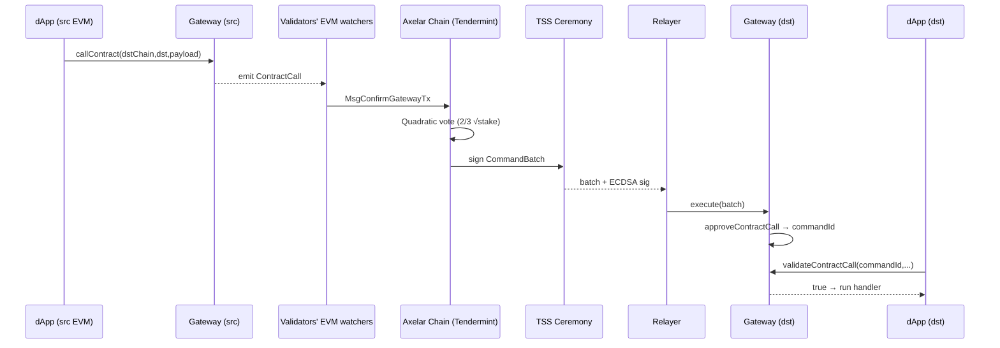

# Axelar 通用消息传递网络

> **TL;DR**：Axelar 与 LayerZero/Wormhole 不同，它本身是一条基于 Cosmos SDK + Tendermint 的独立 PoS 区块链（Axelar Network），以自身共识作为跨链消息的"权威源"。约 75 个验证者质押 $AXL，采用**二次方投票**（quadratic voting）对源链事件达成共识，再通过阈值签名（TSS, Threshold Signature Scheme）在目标链的 Gateway 合约上产生一个标准 ECDSA 签名。这让 Axelar 的信任模型等价于一条 Cosmos PoS 链的共识安全。其上层有 **GMP（General Message Passing）** 通用消息、**ITS（Interchain Token Service）** 代币标准，和 Squid 等应用。

## 1. 背景与动机

Cosmos 生态早期（2019–2020）面临"IBC 只能连接 Cosmos 链"的困境：Light Client 在异构链间难以实现。Axelar 团队（创始人是 Algorand 核心成员 Sergey Gorbunov 与 Georgios Vlachos）2020 提出：**把桥本身做成一条 PoS 链**，让所有跨链动作获得区块链级审计性与可治理性。

核心动机与设计选择：
1. **给异构链装"通用翻译官"**：不需要目标链支持 Light Client，只需部署 Gateway 合约。
2. **用 PoS 替代固定 Guardian 集**：验证者集开放，约 75 家可自由进出，比 Wormhole 19 Guardian 更 permissionless。
3. **可观测、可治理**：所有跨链消息都在 Axelar 链上有 tx hash，可被链上治理暂停、参数调整。
4. **统一资产服务**：ITS 允许任何项目方把已发行 token 一键扩展到 40+ 条链，无需自建桥。

## 2. 核心原理

### 2.1 形式化定义

Axelar 的核心安全假设是 Cosmos Tendermint BFT：设验证者集 $V$，每个 $v_i$ 有 stake $s_i$，网络能容忍 $\sum_{v \in A} s_v < \frac{1}{3} \sum_{v \in V} s_v$ 的拜占庭节点。

跨链消息被建模为 Axelar 链上的一条交易：

$$
\text{CC-Msg} = (\text{srcChain}, \text{srcTx}, \text{srcEvent}, \text{dstChain}, \text{dstContract}, \text{payload})
$$

验证者通过 **二次方投票**（`vote.go` 中 `sqrt(stake)` 归一化）对 `srcEvent` 是否真实发生达成共识。一旦通过，验证者用 **多方计算 TSS**（Gennaro-Goldfeder ECDSA 或 FROST Schnorr）联合签署一个目标链格式的 ECDSA 签名，产生 **Command Batch**，任何 relayer 提交到目标链 Gateway。

**安全不变式**：若恶意 stake $< 1/3$，攻击者既不能伪造 Axelar 区块，也无法拿到 TSS 签名（TSS 门限也设为 2/3 stake-weighted）。

### 2.2 关键数据结构

**Command Batch（目标链侧）**：

```solidity
struct CommandBatch {
    uint256 chainId;      // 目标链 ID
    bytes32[] commandIds; // 每条命令的唯一 ID
    string[] commands;    // "approveContractCall" / "mintToken" / "transferOperatorship"
    bytes[] params;       // 每条命令的 ABI 编码参数
    bytes proof;          // 65-byte ECDSA 签名（TSS 生成）
}
```

**ContractCallApproved 事件**（Axelar 端验证后 Gateway emit）：

```solidity
event ContractCallApproved(
    bytes32 indexed commandId,
    string srcChain,
    string srcAddr,
    address indexed dstContract,
    bytes32 indexed payloadHash,
    bytes32 srcTxHash,
    uint256 srcEventIndex
);
```

不变式：
- **commandId 全局唯一**：由 Axelar 链生成 keccak256(srcTx, eventIdx)，防重放；
- **TSS signature 单一**：目标链合约只需维护一个"current operators set"，验证单 ECDSA 签名即可，gas 成本低；
- **operatorship rotation**：Axelar 链治理每几个月更新目标链 Gateway 上的验证者公钥。

### 2.3 子机制拆解

**(1) Axelar 链（Cosmos SDK + Tendermint）**
验证者运行 `axelard`（Cosmos SDK app），关键自定义模块：`evm`（观察 EVM 事件）、`tss`（门限签名协调）、`vote`（二次方投票）、`nexus`（跨链路由）、`multisig`（多签管理）。约 2 秒出块，即时 finality。

**(2) Gateway 合约（每条连接链一份）**
EVM 上是 `AxelarGateway.sol`（CGP = Cross-chain Gateway Protocol）。核心：
- `callContract(dstChain, dstContract, payload)` 供应用调用，emit `ContractCall` 事件；
- `execute(bytes input)` 接收 Command Batch，验证 TSS 签名，标记消息"approved"；
- `validateContractCall(commandId, srcChain, srcAddr, payloadHash)` 供目标合约在 `_execute` 时调用，检查已被 batch approve。

**(3) TSS（门限签名）**
验证者用 Gennaro-Goldfeder'18 ECDSA TSS（`tofn` Rust 库），2/3 stake 阈值。Key-gen 由链上治理触发，每 key 寿命约 3 个月，过期前启动 rotation。每个目标链一个 key（secp256k1 for EVM，ed25519 for Sui 等）。

**(4) 二次方投票（Quadratic Voting）**
观察 EVM 事件时，每验证者独立 RPC 调用其源链节点确认事件存在，然后 vote。计票时用 $\sqrt{\text{stake}}$ 作为权重，降低巨鲸影响，要求 2/3 sqrt-stake 达成。源码见 `x/evm/keeper/msg_server.go`。

**(5) Relayer 与 Gas Service**
`AxelarGasService.sol` 用户在源链一次性支付 gas，由 Axelar 链下 relayer 代付目标链执行 gas。费用按 Axelar 链上价格馈送实时换算。Relayer 本身不参与验证，可被任意人替换。

**(6) ITS（Interchain Token Service）**
`InterchainTokenService.sol` 提供标准化 token 桥：lock-unlock、mint-burn、canonical bridging。项目方部署 `InterchainToken` 合约（ERC-20 + `transferToChain`）即可把 token 多链化，底层仍走 GMP。

### 2.4 参数与常量

| 参数 | 取值 | 说明 |
| --- | --- | --- |
| 出块时间 | ~2s | Tendermint |
| 最大验证者 | 75 | 治理可调，当前 ~75 active |
| 投票阈值 | 2/3 quadratic stake | 硬编码 |
| TSS 阈值 | 2/3 stake | 同上 |
| Key rotation 周期 | 约 90 天 | 治理触发 |
| Slashing 比例 | 5% downtime / 5% double-sign | 治理可调 |
| Gas 费资产 | 源链原生代币 → 链下换算 | `AxelarGasService` |

### 2.5 边界条件与失败模式

- **超 1/3 stake 作恶**：能伪造跨链消息。历史上单验证者最大 stake 约 6%，总质押率 60%+。
- **Axelar 链停机**：目标链已 approved 的消息仍可 execute，但新消息无法通过。
- **TSS 密钥泄漏**：灾难性；Axelar 采用 MPC 每个 share 单独存储 + HSM，历史无泄漏事件。
- **源链重组**：验证者 vote 需等 `confirmationHeight`（如 Ethereum 64 block），但若重组更深，需链上治理回滚相关 command。
- **目标链合约被盗 operatorship**：需要 2/3 TSS 签名伪造 `transferOperatorship`，等价于 Axelar 共识破坏。

### 2.6 图示



## 3. 架构剖析

### 3.1 分层视图

1. **应用层**：Squid（交易/桥聚合）、Lido wstETH 多链、Microsoft/JPMC PoC
2. **GMP 层**：`AxelarGateway` + `AxelarGasService` + Executable 基类
3. **ITS 层**：`InterchainTokenService` 与 `InterchainToken`
4. **Axelar 链共识层**：Cosmos SDK + Tendermint
5. **TSS / 签名层**：`tofn` Rust 库 + gRPC 协调
6. **观察层**：每验证者本地跑 25+ 条链的 RPC watcher

### 3.2 核心模块清单

| 模块 | 路径（`axelar-core` / `axelar-cgp-solidity`） | 职责 | 可替换性 |
| --- | --- | --- | --- |
| `x/evm` | axelar-core/x/evm | 观察、确认 EVM 事件 | 链内模块 |
| `x/tss` | x/tss | 门限签名协调 | 链内模块 |
| `x/vote` | x/vote | 二次方投票 | 链内模块 |
| `x/nexus` | x/nexus | 跨链路由与注册 | 链内 |
| `AxelarGateway.sol` | axelar-cgp-solidity/contracts | 目标链入口 | UUPS 可升级 |
| `AxelarGasService.sol` | 同上 | gas 代付 | 可替换 |
| `InterchainTokenService.sol` | interchain-token-service | ITS 核心 | 独立合约 |
| `tofn` | github.com/axelarnetwork/tofn | Rust TSS 库 | 可替换 curve |

### 3.3 数据流 / 生命周期

以 **GMP：Polygon dApp 调用 Avalanche dApp** 为例：

1. **源链**：Polygon 上 dApp 先 `gasService.payNativeGasForContractCall{value:0.5 MATIC}(...)` 预付 gas，再 `gateway.callContract("Avalanche", dstAddr, payload)`。Gateway emit `ContractCall`。
2. **验证者 watchers**：每个验证者本地 geth/erigon 确认 event，等待 Polygon finality（~64 块）后，向 Axelar 链提交 `MsgConfirmGatewayTx`。
3. **Axelar 链投票**：`x/evm` 汇总所有 confirm，`x/vote` 按 quadratic stake 计票，2/3 通过后"事件已确认"。
4. **Nexus 路由**：`x/nexus` 根据 dstChain="Avalanche" 把消息塞进待批处理队列。
5. **TSS 签名**：当队列积累足够消息或超时，`x/tss` 启动 ceremony，2/3 stake 在线参与生成 ECDSA 签名，产出 `CommandBatch`。
6. **链下 Relayer**：任何人监听 `ExecuteBatch` 事件，调用 Avalanche `AxelarGateway.execute(batch)`。Gateway 验证 TSS 签名、标记 commandId 为 approved。
7. **目标 dApp 执行**：Relayer 接着调用 dApp 的 `execute(commandId, srcChain, srcAddr, payload)`，dApp 在内部 `validateContractCall` 查询 Gateway，确认 approved 后执行业务逻辑。
8. **可观测性**：https://axelarscan.io 展示每一步，从 Polygon tx → Axelar tx → Avalanche tx 一站式追踪。

典型延迟：Polygon → Avalanche 约 2–4 分钟，费用 $0.3–$2。

### 3.4 客户端多样性 / 参考实现

- `axelar-core`（Go，Cosmos SDK）是唯一共识实现，75 验证者跑同一二进制；多实现在 roadmap 但未交付。
- Gateway 合约：EVM Solidity、Sui Move、Stellar Soroban 等，各自独立实现。
- SDK：`@axelar-network/axelarjs-sdk` (TS)、`axelar-rs`（Rust，社区）。
- Relayer：官方运营 + 任意第三方可跑（代码开源 `relayer-subgraph`）。

### 3.5 扩展 / 互操作接口

- **Executable 基类**：`AxelarExecutable.sol`，应用继承后只需实现 `_execute`
- **ITS**：代币跨链标准，4 种 token 类型（canonical / mint-burn / lock-release / lock-unlock）
- **Cross-chain call with token**：GMP + Token 同消息
- **与 IBC 互联**：Axelar 作为 Cosmos 链原生支持 IBC，充当"IBC ↔ EVM"桥
- **Microsoft Azure + Oracle 合作**：企业私有链接入

## 4. 关键代码 / 实现细节

tag `axelar-core v1.3+`、`axelar-cgp-solidity v6.0+`。

**Gateway.execute 核心**：

```solidity
// axelar-cgp-solidity/contracts/AxelarGateway.sol:L323
function execute(bytes calldata input) external override {
    (bytes memory data, bytes memory proof) = abi.decode(input, (bytes, bytes));
    bytes32 messageHash = ECDSA.toEthSignedMessageHash(keccak256(data));
    // 1. 校验签名来自当前 operators
    address[] memory operators = authModule.validateProof(messageHash, proof);
    require(operators.length >= threshold, "not enough signers");

    (uint256 chainId, bytes32[] memory commandIds, string[] memory commands, bytes[] memory params)
        = abi.decode(data, (uint256, bytes32[], string[], bytes[]));
    require(chainId == block.chainid, "wrong chain");

    for (uint256 i; i < commandIds.length; i++) {
        if (isCommandExecuted[commandIds[i]]) continue;
        bytes4 selector = _commandSelector(commands[i]); // approveContractCall / etc.
        (bool ok,) = address(this).delegatecall(abi.encodeWithSelector(selector, params[i], commandIds[i]));
        if (ok) isCommandExecuted[commandIds[i]] = true;
    }
}
```

**approveContractCall 命令处理**：

```solidity
// AxelarGateway.sol:L411
function approveContractCall(bytes calldata params, bytes32 commandId) external onlySelf {
    (string memory srcChain, string memory srcAddr,
     address dstContract, bytes32 payloadHash,
     bytes32 srcTxHash, uint256 srcEventIdx) = abi.decode(params, (string,string,address,bytes32,bytes32,uint256));
    _setContractCallApproved(commandId, srcChain, srcAddr, dstContract, payloadHash);
    emit ContractCallApproved(commandId, srcChain, srcAddr, dstContract, payloadHash, srcTxHash, srcEventIdx);
}
```

**Axelar 链投票逻辑（Go）**：

```go
// axelar-core/x/evm/keeper/msg_server.go:~L620
func (s msgServer) VoteEvents(ctx sdk.Context, req *types.VoteEventsRequest) (*types.VoteEventsResponse, error) {
    poll := s.voter.GetPoll(ctx, req.PollID)
    // 投票权 = sqrt(stake)
    weight := math.Sqrt(s.staking.Validator(ctx, req.Voter).GetBondedTokens().ToDec().MustFloat64())
    if err := poll.Vote(req.Voter, weight, req.Result); err != nil { return nil, err }
    if poll.Is(types.Completed) {
        for _, ev := range req.Events { s.SetConfirmedEvent(ctx, ev) }
    }
}
```

> 省略：TSS ceremony gRPC、nexus 路由、key rotation、ITS hub routing。

## 5. 演进与版本对比

| 版本 | 时间 | 关键变化 |
| --- | --- | --- |
| Mainnet Alpha | 2021-11 | 初始 GMP，仅 ETH/Avalanche |
| CGP v2 | 2022 | Gateway 架构稳定，Gas Service |
| Virtual Machines | 2023 | 支持 Sui/Aptos/Stellar |
| ITS | 2023 Q4 | 代币标准化 |
| VM Amplifier | 2024 | 允许非 TSS 的验证方式（如 zkProofs） |
| Squid v2 | 2024 | 聚合桥 + DEX 路由 |

## 6. 实战示例

**EVM → EVM GMP 最小示例**：

```solidity
// Sender.sol (on Polygon)
import "@axelar-network/axelar-gmp-sdk-solidity/contracts/interfaces/IAxelarGateway.sol";
import "@axelar-network/axelar-gmp-sdk-solidity/contracts/interfaces/IAxelarGasService.sol";

contract Sender {
    IAxelarGateway public gateway = IAxelarGateway(0x6f015F16De9fC8791b234eF68D486d2bF203FBA8);
    IAxelarGasService public gas  = IAxelarGasService(0x2d5d7d31F671F86C782533cc367F14109a082712);

    function send(string calldata dstChain, string calldata dstAddr, bytes calldata payload) external payable {
        gas.payNativeGasForContractCall{value: msg.value}(msg.sender, dstChain, dstAddr, payload, msg.sender);
        gateway.callContract(dstChain, dstAddr, payload);
    }
}

// Receiver.sol (on Avalanche)
import "@axelar-network/axelar-gmp-sdk-solidity/contracts/executable/AxelarExecutable.sol";

contract Receiver is AxelarExecutable {
    string public lastMsg;
    constructor(address gw) AxelarExecutable(gw) {}
    function _execute(string calldata, string calldata, bytes calldata payload) internal override {
        lastMsg = abi.decode(payload, (string));
    }
}
```

预期：Axelarscan 可看到 "Polygon tx → Axelar tx → Avalanche tx" 三段，~3 分钟到达。

## 7. 安全与已知攻击

- **历史上无主网资金事故**。2022 曾有一次 Gateway 合约参数错误导致少量命令卡死，治理修复。
- **验证者 collusion 面**：2024 年数据显示前 10 验证者 stake 约 44%，未达 1/3，但集中度需持续监控。
- **TSS 单点**：`tofn` 库与 libp2p 通信层曾做过多轮审计（Trail of Bits、NCC、Ottersec）。
- **理论攻击面**：超 1/3 stake 作恶；TSS 离线（rotation 失败，需治理提案手动 rotate）；源链重组深度超 `confirmationHeight`。
- **Amplifier 扩展风险**：非 TSS 验证逻辑 bug 可能被利用，应用需显式选择安全等级。

## 8. 与同类方案对比

| 维度 | Axelar | Wormhole | LayerZero | CCIP | IBC |
| --- | --- | --- | --- | --- | --- |
| 共识 | Cosmos PoS (~75v) | PoA (19 Guardian) | 无协议级共识 | DON + RMN | Light Client |
| 投票 | 二次方 stake | 1-of-19 等权 | 应用自选 | 预定 | stake |
| 消息证据 | TSS ECDSA on dst | 13×ECDSA on dst | DVN attest | DON sig | IBC header proof |
| 可治理性 | 强（链上 prop） | 中（DAO） | 弱 | 弱 | 链级 |
| 非 EVM 覆盖 | Sui/Aptos/Stellar/Sol | 最广 | 广 | EVM+ | Cosmos |
| 代币 | AXL | W | ZRO | LINK | - |

## 9. 延伸阅读

- Docs：https://docs.axelar.dev/
- Whitepaper：https://axelar.network/axelar_whitepaper.pdf
- axelar-core：https://github.com/axelarnetwork/axelar-core
- CGP solidity：https://github.com/axelarnetwork/axelar-cgp-solidity
- ITS：https://github.com/axelarnetwork/interchain-token-service
- Sergey Gorbunov 讲座（YouTube "Axelar: Universal Interoperability"）

## 10. 术语表

| 术语 | 英文 | 释义 |
| --- | --- | --- |
| 通用消息传递 | GMP (General Message Passing) | Axelar 跨链消息协议 |
| 网关 | Gateway | 每条连接链上部署的入口合约 |
| 跨链协议 | CGP (Cross-chain Gateway Protocol) | Axelar 合约族 |
| 门限签名 | TSS | 2/3 stake 联合签名 |
| 命令批 | Command Batch | TSS 签名产出的目标链可执行集合 |
| 互链代币服务 | ITS (Interchain Token Service) | 标准化代币跨链 |
| 二次方投票 | Quadratic Voting | sqrt(stake) 归一化 |
| 操作员 | Operators | Gateway 上受信签名者（映射到 Axelar validators） |

---

*Last verified: 2026-04-22*
