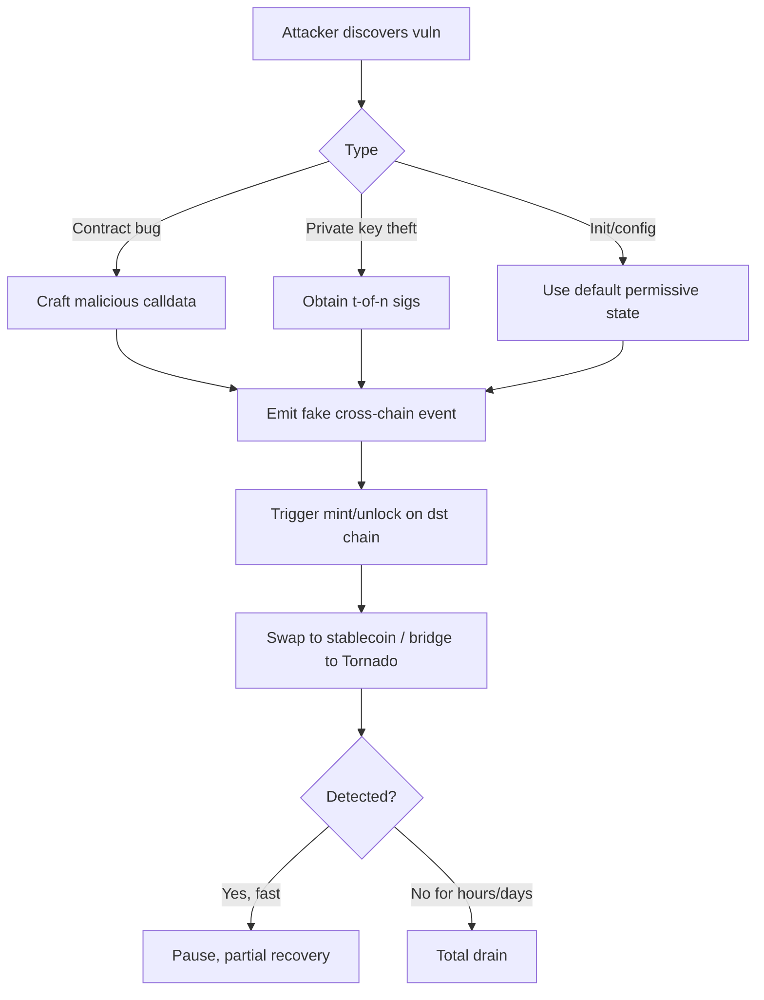

# 跨链桥安全事件复盘

> **TL;DR**：跨链桥是 Web3 历史上"被盗资金密度最高"的领域。2021-08 Poly Network $611M（史上最大之一）、2022-02 Wormhole $325M、2022-03 Ronin $625M（至今最大黑客攻击）、2022-06 Harmony $100M、2022-08 Nomad $190M、2023-07 Multichain $126M，六起事件累计损失近 20 亿美元。它们映射到四种失败模式：**智能合约逻辑 bug、外部验证者私钥/签名失守、初始化配置错误、中心化治理单点**。本文系统复盘这 6 起案例，归纳每种模式的攻击路径与防御启示。

## 1. 背景与动机

2021–2022 是跨链桥 TVL 爆炸式增长的两年（峰值 $28B），也是被盗的暴发期。Vitalik 在 2022-01 的著名帖子 "Cross-chain is fundamentally limited" 警告：**跨链桥是 L1 共识之外的额外信任假设**，在它上面放的资产越多，吸引的攻击力度越大。六个月后 Ronin / Wormhole 事件相继爆发，验证了此论断。

本文的动机是：当你设计或选型一个跨链桥时，**必须能把这六起事件的根因映射到你的架构上**。任何声称"我们不会像 X 桥那样出问题"的说法，只有在说明"我们怎么在设计上规避 X 的失败模式"时才成立。

## 2. 六大事件：攻击原理详解

### 2.1 形式化分类

跨链桥的 TCB（可信计算基）由三部分组成：
$$
\text{TCB} = \text{ContractLogic} \oplus \text{OffChainValidators} \oplus \text{AdminKeys}
$$
任何一部分失守都可能导致全盘沦陷。下表映射事件到失败面：

| 事件 | 时间 | 损失 | 失败面 | 直接原因 |
| --- | --- | --- | --- | --- |
| Poly Network | 2021-08-10 | $611M | ContractLogic | `EthCrossChainManager` 未校验 cross-chain msg 类型，`putCurEpochConPubKeyBytes` 可由任意调用触发，攻击者替换 keeper 公钥 |
| Wormhole | 2022-02-03 | $325M | ContractLogic (Solana) | `solana_bridge::verify_signatures` 允许伪造 sysvar 账户绕过签名校验 |
| Ronin | 2022-03-23 | $625M | OffChainValidators + AdminKeys | 9 Validator 中 5 私钥被窃（社工 + Sky Mavis 授权 Axie Gaslessrpc） |
| Harmony Horizon | 2022-06-24 | $100M | AdminKeys | 5-of-9 multisig 中 2 个私钥在云盘泄露；加密后仍被暴力解 |
| Nomad | 2022-08-01 | $190M | ContractLogic (Init bug) | `Replica.initialize` 将 `_committedRoot = 0x00` 接受为合法根，任意消息通过 |
| Multichain | 2023-07-06 | $126M+ | AdminKeys (单点) | CEO 赵军独控 MPC share，被拘后私钥被"某人"使用掏空跨链池 |

### 2.2 Poly Network（2021-08）

**架构**：Poly Network 是一个跨链协议集线器，通过 Poly chain 做消息中转，目标链部署 `EthCrossChainManager` 合约接收 Poly chain 的 block header + Merkle proof。

**漏洞**：
- `EthCrossChainManager._executeCrossChainTx` 通过反射式 `call` 调用目标合约的任意函数；
- 目标合约中包含 `EthCrossChainData.putCurEpochConPubKeyBytes(bytes)`，用于更新 **keeper 公钥**（验证源链 header 的 threshold key）；
- 没有任何白名单或访问控制阻止 "cross-chain message 调用 `putCurEpochConPubKeyBytes`"。

**攻击步骤**：
1. 构造一个伪造的 Poly chain header，其中包含 msg：`target=EthCrossChainData, selector=putCurEpochConPubKeyBytes(attackerPubkey)`；
2. 由于 EthCrossChainManager 是 EthCrossChainData 的 owner，调用成功，keeper 被替换为攻击者公钥；
3. 接下来攻击者伪造任意跨链 message，由自己的 keeper "签名"，把 Ethereum/Polygon/BSC 三链流动性全提走。

**后续**：白帽黑客（自称 "Mr. White Hat"）与团队谈判，分批归还几乎全部资金。但漏洞严重性使 Poly Network 元气大伤，直到 2023 再度被攻击（CSRF bug 导致 $10M 损失）。

**启示**：跨链消息的 dispatcher 必须**严格白名单可调用的目标函数**，类似"中央路由不能成为管理员"。

### 2.3 Wormhole（2022-02）

**架构**：Solana 端 `wormhole::verify_signatures` 验证 Guardian signatures；通过后进入 `post_vaa` 状态，任何人可调用 `complete_wrapped` mint wETH。

**漏洞**：
- Solana CPI（Cross-Program Invocation）机制要求校验传入账户的真实性；
- `verify_signatures` 通过 `load_instruction_at` 读取"上一条指令"来获取 sysvar instructions 账户，但未校验传入 sysvar 账户实际是 `Sysvar1nstructions1111111111111111111111111`；
- 攻击者传入自己构造的"假 sysvar"账户（里面写入伪造的 `secp256k1_verify` 指令），让 `verify_signatures` 相信所有 Guardian 都签了名。

**攻击步骤**：
1. 构造假 sysvar 账户，内容为一串"已经 verified"的 secp256k1 指令；
2. 调用 `verify_signatures(vaa, fake_sysvar)`，被骗接受；
3. 调用 `post_vaa` → `complete_wrapped(120000 ETH from Ethereum)`；
4. Solana 端 mint 120k wETH，跨回 Ethereum 取走 ETH（其中部分被 Jump 用 120k ETH 补仓）。

**代码修复**（commit `fb8bf64`）：

```rust
// before
let instruction = load_instruction_at(...);  // 未校验账户 key

// after
if *sysvar_instructions.key != solana_program::sysvar::instructions::id() {
    return Err(SolitaireError::InvalidSysvar);
}
```

**启示**：Solana 上任何使用 sysvar 的代码必须显式校验 `AccountInfo.key == sysvar_id`；这是 Solana 特有陷阱，任何桥接 Solana 的设计都要审计类似模式。

### 2.4 Ronin（2022-03）

**架构**：Ronin Bridge 是 Axie Infinity 的侧链桥，9 个 Validator 组成 multisig，跨链提款需 5-of-9 签名。

**失败面**：
- Sky Mavis 为了支持高并发（Axie gas-less transactions）允许"Axie DAO" 代签，实际上让 Axie DAO 节点接收所有用户请求；
- 攻击者通过社工/钓鱼攻破 **Sky Mavis 自身的 4 个 validator**；
- 攻击时点：Axie DAO 早已撤销代签授权但 `allowlist` 未清理，攻击者拿到第 5 个签名；
- 5-of-9 签名伪造两笔提款：173,600 ETH + 25.5M USDC，共 ~$625M。

**时间轴异常**：攻击发生在 2022-03-23，但 Sky Mavis 2022-03-29 才通过用户反馈发现（用户投诉提现失败），**6 天未察觉**，因 Ronin Bridge 无实时监控。

**启示**：
- Multisig 签名者必须**地理/组织独立**，不能集中在一个团队
- 授权撤销后必须有**链上清理**（allowlist 真删），而非仅业务层停用
- 关键合约必须有**余额锚定的监控告警**（"任何一次 > X 的转账须立即提醒"）
- 官方后来引入 circuit breaker（熔断）与更分散 validator 集

### 2.5 Harmony Horizon（2022-06）

**架构**：Harmony Horizon Bridge 多签 5-of-9。

**失败面**：
- 4 个 multisig 私钥由 Harmony 团队自己的云账号（AWS + GCP）管理；
- 私钥加密后存在云盘，解密密码在员工 password manager 中；
- 攻击者（后被 FBI 归因为朝鲜 Lazarus Group）通过 social engineering 入侵员工设备，盗取 password manager 导出的主密码，解密 2 个云端私钥（共 2/5 不够）；
- 再通过类似手段补齐第 3-5 把；获得 5-of-9 后伪造提款。

**启示**：
- 多签不能把大多数签名者的密钥控制在同一团队 / 同一云环境
- 私钥应上硬件（HSM / YubiKey / 冷钱包），不能以任何形式存云
- "即使密钥加密，但若加密密码也被同一团队管理，就等同明文"

### 2.6 Nomad（2022-08）

**架构**：Nomad 是 Optics 演进的 optimistic bridge，`Home` 合约（源链）commit merkle root，`Replica` 合约（目标链）接收 root，30 分钟挑战期后可执行。

**漏洞**（一行 init 代码）：
- 一次合约升级中执行 `Replica.initialize(..., _committedRoot)`；
- 调用时 `_committedRoot = 0x00` 被传入（管理员打算稍后设置真实 root）；
- `acceptableRoot(bytes32 _root) returns (bool)` 判断逻辑：
  ```solidity
  return confirmAt[_root] != 0 && confirmAt[_root] <= block.timestamp;
  ```
- **`confirmAt[0x00]` 默认为 1**（合约构造时设成 1 表示 "zero root is auto-acceptable" 用作初始占位），导致**任意消息 hash 取 merkle root = 0x00 时都被接受**。

**攻击传播**：
1. 第一位攻击者发现 bug，提交 calldata 把某 WBTC 池资金掏走；
2. 交易公开在 mempool，**任何其他人把 calldata 中的 `recipient` 字段改成自己的地址就能照做**；
3. 于是 Nomad 变成"谁动作快谁拿钱"，数百地址参与，被 Rekt 称为"史上第一次 decentralized hack"。

**事后**：约 $190M 被盗，其中约 $37M 被白帽归还。

**启示**：
- Proxy 升级后必须有测试网 dry-run，尤其对 `initialize` 类幂等函数
- 默认值不能有"语义含义"（0x00 root 被当合法是反例）
- 所有 public/external 分支必须显式 require，不要依赖默认返回 true/false

### 2.7 Multichain（2023-07）

**架构**：Multichain（前身 Anyswap）SMPC 网络号称去中心化 MPC，但实际上：
- MPC share 全部托管在 CEO 赵军（Zhaojun）的个人服务器；
- 后端系统、域名、云账号全由其个人控制；
- 2023-05 赵军疑被中国警方带走，此后 Multichain 服务崩溃；
- 2023-07-06 跨链池开始异常：Fantom、Moonriver、Dogechain 等多链用户资金"无缘无故"被转出。

**攻击路径**（推测，官方未披露）：
- 警方/前员工/家属任意一人取得服务器访问权，即可用 MPC share 签名任意跨链 tx；
- Moonriver $126M、Fantom $100M 多批次被掏空；
- 社区谣传私钥已被某机构或团队"合法"接管后清算仓位。

**启示**：
- 名义的"去中心化 MPC" ≠ 实际去中心化；**key share 物理位置**才是根本
- 桥项目应定期发布 attestation（HSM 独立审计、地理分散证明）
- 任何桥都不应让单个自然人在物理上同时持有足够 threshold 的 key material

## 3. 防御架构的启示（四种失败面 × 防御策略）

### 3.1 分层视图

1. **合约层**：logic bug、初始化 bug、升级 bug → 审计 + formal verification + proxy governance
2. **验证层**：外部验证者合谋或私钥泄露 → 验证集多样化、stake-based PoS、HSM 托管
3. **治理层**：admin key 单点 → Multi-org multisig + timelock
4. **运维层**：监控缺失 → 实时 on-chain alert、rate limit、circuit breaker

### 3.2 六起事件诊断矩阵

| 防御层 | Poly | Wormhole | Ronin | Harmony | Nomad | Multichain |
| --- | --- | --- | --- | --- | --- | --- |
| 合约审计 | 有 ✗ 遗漏 | 有 ✗ Solana 特殊 | — | — | 有 ✗ init bug | 有 |
| 验证者分散 | — | — | ✗ 4/9 同团队 | ✗ 4/9 同云 | — | ✗ 全在 CEO 手 |
| HSM/冷 key | — | — | ✗ | ✗ 云盘 | — | ✗ 服务器 |
| Timelock admin | 部分 | ✓ | ✗ | ✗ | 部分 | ✗ |
| 链上熔断 | ✗ | 后期加 Governor | ✗（事后加） | ✗ | ✗ | ✗ |
| 实时监控 | ✗ | 部分 | ✗（6 天未察觉） | ✗ | ✗ | ✗ |

### 3.3 事件驱动的行业最佳实践演进

| 2022-02 后 | Wormhole → Governor 链下限额、Accountant 链上守恒 |
| 2022-03 后 | Ronin → Validator 物理独立、circuit breaker、PoS 自由进入 |
| 2022-08 后 | Nomad → Merkle Tree 根预设值排查、proxy init 标准流程 |
| 2022 全年后 | CCIP 立项（2022-2023），引入独立 RMN 验证集 + 链级 rate limit |
| 2024 后 | LayerZero v2 引入 X-of-Y-of-N DVN，允许应用叠加多独立验证 |

### 3.4 数据流 / 攻击传播典型路径



Ronin 是 I→K 路径的经典（6 天未发现）；Wormhole 是 I→J（24h Jump 补仓）。

### 3.5 可观测性与响应

- **Chainalysis / Nansen / Arkham**：链上资金流追踪
- **DefiLlama Bridge dashboard**：TVL 锐减告警
- **Internal monitoring**：Tenderly / Blocknative 的 mempool watcher + 大额 tx 告警
- **Guardrails 合约模板**：OpenZeppelin `PausableUpgradeable` + `AccessControl`

## 4. 关键代码片段 / 漏洞修复 diff

**Nomad 修复（`Replica.initialize`）**：

```solidity
// Replica.sol 旧
function initialize(..., bytes32 _committedRoot, ...) public initializer {
    confirmAt[_committedRoot] = 1;  // BUG: 若 _committedRoot=0 会把 0x00 当合法
    ...
}

// 修复：require(_committedRoot != bytes32(0), "zero root");
```

**Wormhole 修复（`verify_signatures.rs`）**：

```rust
// before: 未校验 sysvar key
let instructions = sysvar::instructions::id();  // 只给常量
let current_ix = load_instruction_at(idx, &ctx.accounts.sysvar.data.borrow())?;

// after: 校验账户 key
if *ctx.accounts.sysvar.key != sysvar::instructions::id() {
    return Err(SolitaireError::InvalidSysvar.into());
}
```

**Poly Network 教训（应加白名单）**：

```solidity
// EthCrossChainManager._executeCrossChainTx
// BAD: 任意 target.selector 可被调用
(bool ok,) = _target.call(abi.encodeWithSelector(_selector, _args));

// GOOD: 白名单
require(selectorAllowed[_target][_selector], "selector not allowed");
require(_target != address(crossChainData), "cannot call crossChainData directly");
```

## 5. 演进与版本对比

| 代际 | 特征 | 代表 | 失败模式 |
| --- | --- | --- | --- |
| 第 1 代（2020-21） | 原始 multisig / MPC，中心化运营 | Ronin, Harmony, Multichain | AdminKey |
| 第 2 代（2021-22） | 通用消息协议 + 轻节点 / optimistic | Poly, Nomad, Wormhole | ContractLogic |
| 第 3 代（2023+） | 外部验证 + 治理 + 熔断 | Wormhole v2, Axelar, LZ v1 | 残留 validator 合谋 |
| 第 4 代（2024+） | 多独立验证栈 + RMN | CCIP, LayerZero v2 DVN, IBC + ZK | 待观察 |

## 6. 实战示例：快速自检清单

对任何待选跨链桥，至少回答以下 10 个问题（每个映射到一起历史事件）：

```markdown
- [ ] 有无 Poly 式 "cross-chain msg 可以调用任意合约" 问题？→ 白名单 target+selector
- [ ] 有无 Wormhole 式 "跨链验证调用中的 sysvar/账户伪造" 风险？→ 显式校验 sysvar/account
- [ ] Validator/Guardian 是否地理/组织独立？→ 至少 5 个独立实体
- [ ] Admin key 是否上 HSM / 冷钱包 / timelock？→ 无 cloud raw key
- [ ] Proxy 升级是否有测试网 dry-run + 参数审计？→ Nomad 式 init bug 排查
- [ ] 有无链上 rate limit / 全局守恒？→ CCIP RMN / Wormhole Accountant 类
- [ ] 是否实时监控余额变化并自动告警？→ Ronin 6 天未察觉的反面
- [ ] MPC key share 物理分布如何？→ 非 CEO 单人控制
- [ ] 有无独立安全审计 ≥ 2 家？→ Trail of Bits / OpenZeppelin 等
- [ ] Bug bounty 额度 ≥ 单点可盗金额的 10%？→ 经济激励白帽
```

## 7. 安全与已知攻击

本章即主题，见 §2。补充更近期事件：

- **BNB Bridge (2022-10)**：BSC Token Hub IAVL Merkle proof 伪造漏洞，攻击者 mint 200 万 BNB（~$568M），BSC 链协调节点停链后仅流出约 $100M。根因：Cosmos IAVL proof 校验老版实现允许伪造。
- **Orbit Chain (2023-12)**：Orbit Bridge 10 签名中 7 把私钥泄漏，被盗 $81M。与 Ronin 同模式。
- **Socket Gateway (2024-01)**：允许任意 calldata 的 proxy，被盗 $3.3M。近期类 Poly 式 logic bug。

## 8. 与同类方案对比：事件密度分析

| 桥类别 | 事件数 | 累计被盗 ($B) | 主要失败面 |
| --- | --- | --- | --- |
| Multisig / MPC 桥 | 6+ | ~1.0 | Admin key |
| Optimistic / Light-node 桥 | 2 (Nomad, BNB) | ~0.4 | Contract bug |
| 通用消息 + validator 桥 | 2 (Poly, Wormhole) | ~1.0 | Contract bug |
| Liquidity 桥（Hop/Across/Synapse/Stargate） | 0 主网资金事故 | — | — |
| IBC（原生验证） | 0（Dragonberry 未被利用） | — | — |

结论：**完全原生验证（IBC）与纯流动性桥（Hop/Across）历史事故率最低**；但二者都有各自局限（IBC 需双链 fast finality；流动性桥仍依赖底层慢桥）。通用消息桥风险集中在合约 logic + 外部验证者。

## 9. 延伸阅读

- Rekt News 各事件页面（最权威的事后复盘）：https://rekt.news/
- Chainalysis "Crypto Crime Report" 2022/2023/2024 年年度跨链桥章节
- a16z "Cross-chain bridges: Categorizing solutions" (2022)
- Vitalik "Why cross-chain is fundamentally limited" (2022)
- Immunefi 历史 bug bounty 公开报告
- 中文：慢雾 (SlowMist) "跨链桥安全事件全盘点"
- 中文：学习跨链 (learnblockchain.cn) Bridge 专题

## 10. 术语表

| 术语 | 英文 | 释义 |
| --- | --- | --- |
| 可信计算基 | TCB (Trusted Computing Base) | 协议安全依赖的代码 + key 集合 |
| 多签 | Multisig | M-of-N 签名授权 |
| 门限签名 | TSS | 分布式联合签名，无单一 key |
| 合约逻辑漏洞 | Logic Bug | 合约代码缺陷（Poly, Wormhole, Nomad 型） |
| 管理员密钥 | Admin Key | 能暂停/升级/直接操作合约的权限 key |
| 熔断器 | Circuit Breaker | 检测异常时冻结合约/桥 |
| 速率限制 | Rate Limit | 单位时间最大流出量 |
| 社工攻击 | Social Engineering | 通过欺骗获取密钥/访问 |

---

*Last verified: 2026-04-22*
