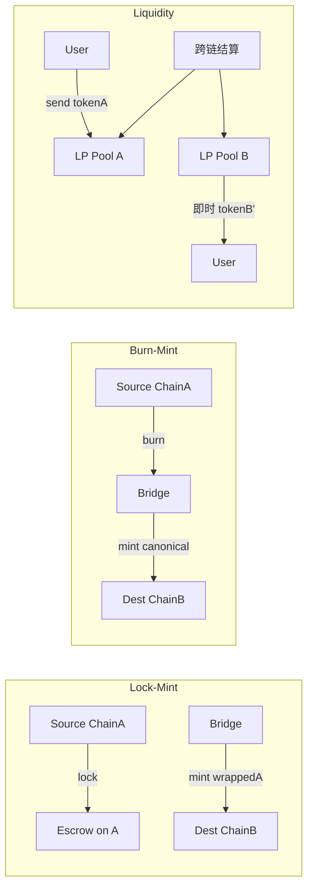

# 跨链桥分类学：Lock-Mint / Burn-Mint / Liquidity / Native + 信任假设谱系

> **TL;DR**：跨链桥按 **资产运动机制** 可分为四类：**(1) Lock-Mint**（源链锁、目的链 mint wrapped，如 wBTC、Arbitrum Canonical Bridge）；**(2) Burn-Mint**（双链皆可 mint/burn 原生资产，由跨链协议同步总量，如 Circle CCTP、xERC-20、USDe）；**(3) Liquidity Network / Atomic Swap**（两端各有资金池，LP 做市即时到账，如 Across、Hop、Stargate、Li.Fi）；**(4) Native Asset Bridge**（源链资产本身可被目的链合约验证，如 BTC via tBTC v2、Babylon、zkBTC）。正交维度是 **信任假设**：从 **Trustless LC** → **ZK** → **Optimistic** → **Oracle+Relayer** → **External Validators** → **Custodial**。理解桥的关键不是单一名字，而是"资产运动机制 × 信任模型"组合——这决定了它的吞吐、延迟、gas 成本与最坏情况损失。

---

## 1. 背景与动机

2020–2022 年 DeFi 多链化催生了数十个桥；各自发明"USDC.e"、"anyUSDC"、"poly-USDC"等大量 wrapped 版本，造成流动性割裂、用户困惑、攻击面膨胀。2023–2024 年业界逐步整合：Circle 发 **CCTP (Cross-Chain Transfer Protocol)** 做 USDC 的 burn-mint 原生跨链；xERC-20 标准让发行方对 wrapped 版本拥有权限；LayerZero、Axelar、CCIP 等 GMP 打通消息。**桥的分类**帮助区分"架构差异 vs 只是 UI 差异"。

**为什么要学分类？**
1. 评估信任假设：同一个"USDC 桥"可能是 Circle CCTP（trust Circle）或 LayerZero OFT（trust DVN）。
2. 估算安全上限：Lock-Mint 桥的最坏损失 = TVL；Liquidity 桥只会损失 LP 当前头寸。
3. 判断延迟：Canonical Rollup Bridge 提款需 7 天；Liquidity 桥秒级到账但仅限支持资产。
4. 合规与会计：Burn-Mint 保持统一资产地址；Lock-Mint 的 wrapped 资产在对手链是独立代币，影响会计与税务。

## 2. 核心原理

### 2.1 资产运动机制的形式化

记源链 $A$ 上资产余额 $b_A$，目的链 $B$ 上 $b_B$，跨链协议作用后的总量不变式：

$$ \forall t: \; b_A(t) + b_B(t) = \text{Const}_{\text{global}} $$

四类机制的实现差异：

**(1) Lock-Mint（也称 "canonical / wrapped"）**
- 源链：`lock(amount)` 送入 escrow。
- 目的链：`mint(amount)` 铸造 wrapped 代币。
- 反向：burn wrapped → unlock escrow。
- 总量守恒：`escrow_on_A == supply_on_B`。
- 信任前提：协议合约或 validator 不会单方面 unlock / mint。

**(2) Burn-Mint**
- 源链：`burn(amount)`；目的链：`mint(amount)`；反向同构。
- 没有 escrow —— 总量守恒由**共识协同**保证。
- 典型：Circle CCTP（`depositForBurn` + Attestation）、LayerZero OFT、xERC-20。
- 要求资产发行方（如 Circle）或协议（OFT）同时拥有两端 mint 权限。

**(3) Liquidity Network / Atomic Swap（LP-based）**
- 源链 LP 池接受 tokenA；目的链 LP 池先行支付 tokenA'（等价物）给收款人。
- 事后 rebalance：协议结算模块把"应付给 LP"的金额从源链池搬到目的链池，方式可以是 canonical bridge / 跨链消息。
- 典型：Hop Protocol（双侧 hToken + AMM）、Across（Relayer 即 LP）、Stargate（Delta 算法）。
- 核心优势：**无需等待源链 finality**，LP 自担 reorg 风险换取费率。

**(4) Native Asset Bridge**
- 目的链合约直接验证源链原生资产的存款证明（无需发行 wrapped 同时保有原子可赎回）。
- 典型：tBTC v2（threshold signatures + BTC SPV）、Bedrock uniBTC、Babylon-enabled BTC staking。
- 在异构签名/脚本下实现，通常需 MPC / ZK / DLC。

### 2.2 关键数据结构

**Canonical Bridge Escrow**（如 Arbitrum Outbox）：
```
mapping(address token => uint256 lockedAmount) escrowBalance;
mapping(bytes32 withdrawalHash => bool claimed) spent;
```

**CCTP MessageBody**：
```
CCTPMessage {
    uint32 srcDomain;
    uint32 dstDomain;
    uint64 nonce;
    bytes32 sender;
    bytes32 recipient;
    uint256 amount;
    bytes32 burnToken;   // 原地址
    bytes32 mintRecipient;
    bytes32 messageBody; // 可带回调
}
attestation = Circle_Attester_signature(message)
```

**xERC-20 限额**：每个 bridge 有 `mintingLimit`、`burningLimit`、24h 恢复，以防单 bridge 被黑导致无限增发。

### 2.3 子机制拆解

**(A) Canonical Rollup Bridge**
- Optimistic Rollup：提款等 7 天 fraud proof 期；ZK Rollup：等证明上链（秒~小时）。
- 存款几乎即时。

**(B) Third-Party Lock-Mint Bridge**
- 例子：Multichain（已崩）、Wormhole Portal、Axelar Satellite。
- Escrow 合约的 upgradeability 是主要风险。

**(C) CCTP / xERC-20 Burn-Mint**
- `TokenMessenger.depositForBurn(amount, dstDomain, recipient, token)` → burn 源链 USDC。
- Attesters（Circle 运营）给消息签名。
- 目的链 `MessageTransmitter.receiveMessage()` + 签名验证 → `TokenMinter.mint(recipient, amount)`。

**(D) LayerZero OFT**
- `OFT.send(dstEid, to, amount)` burn 源链；LZ endpoint + DVN 传消息；`OFT._credit()` mint 目的链。
- 每对 (src, dst) 按 OApp 配置的 DVN 组合校验。

**(E) Liquidity Bridge 与 Intent**
- Relayer / Solver 在目的链 "fill order"，稍后通过 canonical bridge 回收本金。
- Across 使用 UMA Optimistic Oracle 做 slow-path 结算。
- ERC-7683（2024-07 提出）定义统一 Intent 格式 `CrossChainOrder`，Solver 对 Fill 承担跨链结算。

**(F) Native BTC 桥（tBTC v2）**
- 99-of-100 random sampled signers 用 ECDSA-TSS 持 BTC UTXO 私钥份额。
- 用户存 BTC → signers 签 `tbtc.mint()`；赎回反向。
- 安全性由 T-ECDSA + 质押 + fraud proof 提供。

### 2.4 参数与常量（典型）

| 桥 / 模式 | 确认时间 | 费用 | 最大单笔 | 信任模型 |
| --- | --- | --- | --- | --- |
| Arbitrum Canonical (deposit) | ~15 min | L1 gas | 无限 | 继承 L1 |
| Arbitrum Canonical (withdraw) | 7 天 | L1 gas | 无限 | 继承 L1 + fraud proof |
| Optimism (Withdraw via Across) | ~2 min | Fee 0.05% | LP 容量 | Optimistic Oracle |
| Circle CCTP | 15 min | Gas only | 无限 | Circle Attester |
| LayerZero OFT | 1–15 min | DVN fees | 无限 | 所配 DVN 组合 |
| Wormhole Portal | ~15 min | 微 | 无限 | 13/19 Guardians |
| Hop Protocol | 1–5 min | 0.04–0.1% | LP 容量 | hToken bonder |
| Across | 20–120 秒 | 0.05% avg | LP 容量 | Optimistic + relayer 担保 |
| Stargate (LZ-powered) | ~1 min | 0.06% | Δ 池容量 | LZ DVN |
| tBTC v2 | 1 h (BTC confirm) | 0.1% | Signer 数量 | TSS 99-of-100 |
| WBTC (BitGo) | 1 h | 0.15% | 无限 | 托管 |

### 2.5 信任假设谱系（精化）

```
  Trustless ─────────────────────────────────────────── Trusted
   │                                                          │
   ├─ Native Rollup Bridge (ZK/Optimistic)                    │
   │      ├─ zkSync canonical, Scroll, Linea                  │
   │      └─ Arbitrum, Optimism, Base (7d challenge)          │
   ├─ Native BTC / Cosmos IBC                                 │
   ├─ ZK Bridge (Polyhedra, Succinct)                         │
   ├─ Oracle + Relayer (LayerZero v1/v2 w/ 1 DVN)             │
   ├─ Dual Oracle (CCIP w/ RMN)                               │
   ├─ External PoS set (Axelar, Union)                        │
   ├─ Multi-sig + signer committee (Wormhole Guardians)       │
   ├─ Circle CCTP (federated)                                 │
   └─ Custodial (WBTC, fiat on/off ramp)                      │
```

### 2.6 图示



```
三维判决树：
  (1) 资产运动机制 ── Lock-Mint | Burn-Mint | Liquidity | Native
      × (2) 信任假设  ── Native LC | ZK | Optimistic | Oracle | Multi-sig | Custody
          × (3) 功能层级 ── Asset only | GMP | Shared state | Intent
```

## 3. 架构剖析

### 3.1 分层视图

1. **资产层**：escrow、wrapped token、canonical token、LP pool。
2. **协议层**：消息/结算协议（CCTP Message、LZ Packet、IBC Packet、Intent）。
3. **验证层**：Verifier / DVN / Attester / Light Client。
4. **中继层**：Relayer / Solver / Bonder。
5. **UX 层**：Aggregator (Li.Fi, Socket, Bungee)、钱包插件。

### 3.2 核心模块清单

| 模块 | 代表实现 | 职责 |
| --- | --- | --- |
| EscrowVault | `L1ERC20Gateway.sol` (Arbitrum) | 锁资产 |
| CanonicalToken | `L2ERC20` | 目的链 wrapped 或 native |
| BurnMessenger | `TokenMessenger.sol` (CCTP) | `depositForBurn` |
| Attester/Oracle | Circle, DVN | 签消息 |
| LP Pool | `HopAMM`, `AcrossSpokePool` | 即时付款 |
| Bonder / Solver | Across relayer, Hop Bonder | 垫资后回收 |
| Settlement | `UMAOptimisticOracle`, `CCTP MessageTransmitter` | 真结算 |
| xERC-20 Limiter | `XERC20.sol` | 每桥限额 |
| Aggregator Router | `LiFiDiamond.sol` | 选路/路径合并 |
| Intent Order | ERC-7683 `CrossChainOrder` | 统一 intent 载体 |

### 3.3 数据流 / 生命周期（Circle CCTP USDC 示例）

1. **t=0**：用户在 Ethereum 调 `TokenMessenger.depositForBurn(1000, ARB_DOMAIN, recipient, USDC)`；合约 burn 1000 USDC、emit `MessageSent`。
2. **t=+~12 s**：Ethereum 区块包含该 tx，待 12 个确认（Circle V1 阈值）。
3. **t=+~3 min**：Circle Attester 检测 event，返回 attestation 签名。
4. **t=+~3 min**：Relayer（任何人）调 Arbitrum 上 `MessageTransmitter.receiveMessage(message, attestation)`。
5. **t=+~3 min + dst 块**：验证签名 + nonce 未用 → 调 `TokenMinter.mint(recipient, 1000)`。
6. **t=+post**：Arbitrum 上 recipient 收到 1000 USDC，与 Ethereum 上的 USDC 同一个合约出品。

**跨多桥组合 (Hop Protocol 示例)**：
- 用户 L1 → Optimism：Hop Bonder 在 Optimism 秒级付 hETH → Bonder 等 L1 rollup 7 天后 bridged ETH 到达并 swap 还原。
- 对用户几乎即时。

### 3.4 客户端多样性 / 参考实现

- **Arbitrum Nitro**：Offchain Labs 单实现，是官方桥。
- **Optimism OP Stack**：ethereum-optimism 单实现 + 多个 L2 复用。
- **Hop Protocol**：[hop-protocol/contracts-v2](https://github.com/hop-protocol/contracts-v2)。
- **Across**：[across-protocol/contracts-v2](https://github.com/across-protocol/contracts-v2)。
- **CCTP**：[circlefin/evm-cctp-contracts](https://github.com/circlefin/evm-cctp-contracts)。
- **xERC-20 (EIP-7281)**：[defi-wonderland/xERC20](https://github.com/defi-wonderland/xERC20)。

### 3.5 扩展 / 互操作接口

- `xERC20` 标准：限额管理 + 每 bridge 权限。
- ERC-7683 Intent：`CrossChainOrder`, `ResolvedCrossChainOrder`。
- CCIP `onTokenTransfer`：token + data 合并。
- LayerZero OFT `sendAndCall`：burn+mint + 目标合约回调。
- Axelar `callContractWithToken`。

## 4. 关键代码 / 实现细节

**CCTP TokenMessenger.depositForBurn**——[`circlefin/evm-cctp-contracts/src/TokenMessenger.sol`](https://github.com/circlefin/evm-cctp-contracts/blob/master/src/TokenMessenger.sol)：

```solidity
function depositForBurn(
    uint256 amount,
    uint32 destinationDomain,
    bytes32 mintRecipient,
    address burnToken
) external returns (uint64 nonce) {
    require(amount > 0 && mintRecipient != bytes32(0));
    IMintBurnToken token = IMintBurnToken(burnToken);
    token.transferFrom(msg.sender, address(this), amount);
    token.burn(amount);
    bytes memory burnMessage = BurnMessage.formatMessage(
        messageBodyVersion, burnToken, mintRecipient, amount, Message.addressToBytes32(msg.sender)
    );
    nonce = localMessageTransmitter.sendMessage(
        destinationDomain, remoteTokenMessengers[destinationDomain], burnMessage
    );
    emit DepositForBurn(nonce, burnToken, amount, msg.sender, mintRecipient, destinationDomain, bytes32(0), bytes32(0));
}
```

**xERC-20 限额逻辑**——[`defi-wonderland/xERC20/solidity/contracts/XERC20.sol`](https://github.com/defi-wonderland/xERC20/blob/main/solidity/contracts/XERC20.sol)：

```solidity
function mint(address _user, uint256 _amount) public {
    _mintWithCaller(msg.sender, _user, _amount);
}

function _mintWithCaller(address _caller, address _user, uint256 _amount) internal {
    uint256 _currentLimit = mintingCurrentLimitOf(_caller);
    require(_currentLimit >= _amount, "IXERC20_NotHighEnoughLimits");
    _useMinterLimits(_caller, _amount);
    _mint(_user, _amount);
}
```

**Across SpokePool 深度**（[`across-protocol/contracts-v2/contracts/SpokePool.sol`](https://github.com/across-protocol/contracts-v2/blob/master/contracts/SpokePool.sol)）：

```solidity
function fillRelay(
    address depositor, address recipient,
    address destinationToken, uint256 amount,
    uint256 totalRelayerFeePct, uint256 realizedLpFeePct,
    uint32 depositId, uint32 originChainId
) external {
    // Relayer 即时付款给 recipient；稍后通过 UMA Optimistic Oracle 证明 deposit 存在而得偿
    ...
}
```

## 5. 演进与版本对比

| 阶段 | 时间 | 代表 | 变化 |
| --- | --- | --- | --- |
| Lock-Mint 1.0 | 2019 WBTC | BitGo 托管 | Custodial |
| Lock-Mint 2.0 | 2020 Ren Protocol | MPC 去中心化托管 | RenVM 崩后停服 |
| Rollup Canonical | 2021 Arbitrum, Optimism | 继承 L1 | 首个 trustless 大规模桥 |
| Liquidity Bridge | 2021 Hop, cBridge | AMM + Bonder | 秒级到账 |
| External Validator GMP | 2022 Wormhole, LayerZero, Axelar | 多签/DPoS | 牺牲 trust 换吞吐 |
| Burn-Mint 标准化 | 2023 Circle CCTP | Circle 发行 USDC 原生 | 统一 USDC |
| xERC-20 | 2023 EIP-7281 | Issuer-sovereign | 多桥并存+限额 |
| Intent / Solver | 2023–2024 Across, UniswapX | 目标导向 | UX 巨变 |
| ERC-7683 | 2024-07 | 统一 intent | 标准化 |
| ZK Bridge | 2024–2025 Polyhedra, Succinct | ZK LC | 安全+成本兼顾 |
| Shared Sequencer | 2025 Espresso, Astria | 跨 rollup 原子性 | 开始实用 |

## 6. 实战示例

**CCTP USDC：ETH Mainnet → Base**：

```bash
# 1. approve
cast send $USDC "approve(address,uint256)" 0xBd3fa81B58Ba92a82136038B25aDec7066af3155 1000000000
# 2. depositForBurn（Base domain = 6）
cast send 0xBd3fa81B58Ba92a82136038B25aDec7066af3155 \
  "depositForBurn(uint256,uint32,bytes32,address)" \
  1000000000 6 0x000...RECIPIENT_BYTES32 $USDC
# 3. 轮询 Circle Attestation
curl https://iris-api.circle.com/v1/attestations/$MESSAGE_HASH
# 4. 在 Base 上 receiveMessage
cast send 0xAD09780d193884d503182aD4588450C416D6F9D4 \
  "receiveMessage(bytes,bytes)" $MESSAGE $ATTESTATION --chain base
```

**Across Intent（一键任意链）**：

```js
import { AcrossClient } from "@across-protocol/app-sdk";
const across = new AcrossClient({ integratorId: "0xdead" });
const quote = await across.getQuote({
  route: { originChainId: 1, destinationChainId: 8453, inputToken: USDC_ETH, outputToken: USDC_BASE },
  inputAmount: 1000_000000n,
});
await across.executeQuote({ quote, signer });
```

## 7. 安全与已知攻击

**按机制归类的攻击面**：

| 机制 | 攻击面 | 历史事件 |
| --- | --- | --- |
| Lock-Mint (third-party) | Escrow 合约漏洞 / 验证者合谋 | Ronin（multi-sig），Wormhole（验证 bug） |
| Lock-Mint (canonical) | Rollup 回滚 / 升级密钥 | Optimistic 2022 bug Fix (无损) |
| Burn-Mint | 单侧 mint 过量 / 验证者合谋 | Nomad（`acceptableRoot=0x0`），Orbit Chain |
| Liquidity | LP 欺诈 / relayer pull | thorchain 2021（RUNE 通胀） |
| Custodial (wBTC) | Custodian 风险 | BitGo 未出过事；但有 Key Ceremony 信任 |
| Native BTC (tBTC v1) | Signer 坍缩 | tBTC v1 2020 需 150% 超额抵押效率低，v2 重构 |
| xERC-20 | 某桥被黑导致增发 | xERC-20 的限额正是为了限定最坏损失 |

**教训**：
1. **限额**：xERC-20 为每个 bridge 设定 24h mint 上限，即使被黑也不至无限增发。
2. **Risk Management Network**：CCIP 引入独立 RMN 监测异常，阻止超常规大额。
3. **Upgrade Timelock**：桥的管理员合约需要 >48h timelock + 社区监督，避免 Orbit Chain 式的升级劫持。
4. **Bug Bounty 与 Formal Verification**：Certora、Runtime Verification 在 CCTP、xERC-20 上做 formal proof。

详细事后复盘见 `bridge-security-incidents.md`。

## 8. 与同类方案对比

| 功能需求 | 推荐方案 | 原因 |
| --- | --- | --- |
| USDC 主流链→L2 | Circle CCTP | 原生 + 等价 + 无限额 |
| 长尾 ERC-20 → L2 | LayerZero OFT / Hyperlane Warp | 任意 token |
| BTC → EVM | tBTC v2 / Babylon / Bedrock | Native BTC 派生 |
| 秒级资产桥 | Across, Stargate, Li.Fi | LP + Bonder |
| 任意合约调用 GMP | Wormhole / Axelar / LayerZero / CCIP | 消息层 |
| 最高安全（Rollup↔L1） | Canonical Bridge | 继承 L1 安全 |
| Intent/UX 无感 | UniswapX, CoW, Across Intent | 用户只表达目标 |
| 跨 Rollup 原子 | Espresso / Astria (发展中) | shared sequencer |

## 9. 延伸阅读

- **一手源**
  - L2Beat Bridges：<https://l2beat.com/bridges/summary>
  - Ethereum.org Bridges：<https://ethereum.org/en/developers/docs/bridges/>
  - Circle CCTP 文档：<https://developers.circle.com/stablecoins/cctp-getting-started>
  - xERC-20 (EIP-7281)：<https://eips.ethereum.org/EIPS/eip-7281>
  - ERC-7683：<https://eips.ethereum.org/EIPS/eip-7683>
  - Across Docs：<https://docs.across.to>
  - Hop Protocol whitepaper：<https://hop.exchange/whitepaper.pdf>
- **研究**
  - 1kx Bridge Framework：<https://medium.com/1kxnetwork/blockchain-bridges-5db6afac44f8>
  - Arjun Bhuptani "Modular Interop"：<https://blog.connext.network>
  - Chainlink Research "Bridging Classification"：<https://research.chainlink.com>
- **视频**：Messari Mainnet "Bridge Wars"、ETHDenver "Interop Day"。

## 10. 术语表

| 术语 | 英文 | 释义 |
| --- | --- | --- |
| 锁铸 | Lock-Mint | 源链锁 + 目的链铸 wrapped |
| 销铸 | Burn-Mint | 源链 burn + 目的链 mint 原生 |
| 流动性桥 | Liquidity Bridge | LP 池即时付款，事后 rebalance |
| 原生桥 | Canonical Bridge | 由 L1/L2 协议原生提供的桥 |
| 原子交换 | Atomic Swap | 基于 HTLC 的无信任换币 |
| 跨链消息传递 | GMP (Generic Message Passing) | 任意合约调用 |
| xERC-20 | EIP-7281 | 可赋权多桥且限额的 ERC-20 扩展 |
| CCTP | Cross-Chain Transfer Protocol | Circle 的 USDC burn-mint 协议 |
| Bonder | Bonder | Hop 协议中为用户垫资的做市者 |
| 意图 | Intent | 用户目标，由 solver 实现 |
| 聚合器 | Aggregator | 汇聚多桥路径的工具（Li.Fi, Socket） |
| RMN | Risk Management Network | CCIP 风险监测子网 |

---

*Last verified: 2026-04-22*
