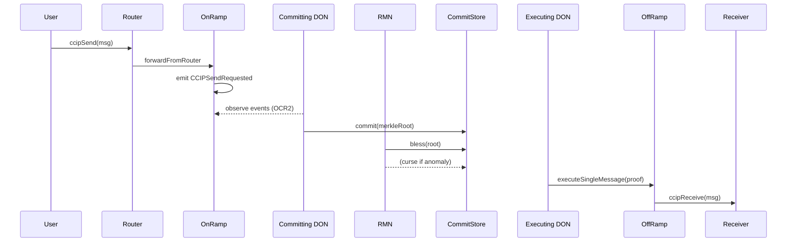

# Chainlink CCIP

> **TL;DR**：CCIP 是 Chainlink 在预言机网络之上构建的通用跨链消息协议，目标客户是银行、SWIFT、资管等受监管机构（2023 SWIFT 合作 PoC、2024 Fidelity/ANZ 实验）。它的差异化设计是 **"双独立委员会 + 链级白名单"**：主 Committing/Executing DON 负责产出消息承诺与在目标链执行；独立的 **RMN（Risk Management Network）** 跑着不同代码库（Rust 实现 vs 主 DON 的 Go 实现），只做"祝福"（bless）或"诅咒"（curse）——在检测到异常时可一键暂停任何 lane。这种"多客户端 + 熔断"模式在当前所有跨链协议中独特，延迟可接受，但覆盖链与应用开放度不及 LayerZero/Wormhole。

## 1. 背景与动机

2022 年 Chainlink 提出 CCIP 时，面临市场格局：Wormhole 2 月刚出事故，Nomad 8 月被盗 $190M，Multichain 有治理隐患。Chainlink 的判断：**传统金融机构对跨链资产移动的容错度 = 0**，现有方案无法服务万亿美元规模的传统金融。

CCIP 的设计目标与众不同：
1. **为 TradFi 优化**：慢但稳——接受分钟级到达，换取更高安全性；
2. **Defense-in-depth**：协议本身可熔断，不依赖下游应用的防御；
3. **客户端多样性**：主 DON 和 RMN 代码独立（Go vs Rust），杜绝单 bug 全盘失守；
4. **代币传输标准化**：Token Pools 模式，发行方可精细控制流向（rate limit、allowlist）。

这些选择使 CCIP 在银行/保险试点中有先发优势，但也让它在早期仅支持 15 条左右链、消息吞吐量较低。

## 2. 核心原理

### 2.1 形式化定义

CCIP 的消息模型：源链 `Router` 接受 `EVM2AnyMessage`，经 `OnRamp` 生成 `Any2EVMRampMessage`，由链下 Committing DON 写成 Merkle root 提交到目标链 `CommitStore`，经 RMN 祝福后，Executing DON 调用目标链 `OffRamp.execute` 触发应用回调。

形式化：设 DON 验证者集 $D = \{d_1, ..., d_n\}$，RMN 验证者集 $R = \{r_1, ..., r_m\}$（二者**不相交**）。

消息交付需要：

$$
\text{deliver} \iff \underbrace{\text{CommitDON}.\text{sign}(\text{root}) \ge f+1}_{\text{OCR2 threshold}} \land \underbrace{|\{r : r.\text{bless}(\text{root})\}| \ge \text{blessThreshold}}_{\text{RMN}} \land \neg \text{curse}
$$

其中 `curse` 是一个或多个 RMN 节点观察到异常（如超限额 mint、double-spend）后广播的"诅咒"标记；任一 curse 即停所有相关 lane。

### 2.2 关键数据结构

**EVM2AnyMessage（用户输入）**：

```solidity
struct EVM2AnyMessage {
    bytes receiver;                 // 目标链接收者（ABI encoded）
    bytes data;                     // 任意 payload
    EVMTokenAmount[] tokenAmounts;  // 最多 N 种 token
    address feeToken;               // 支付 gas 的币（LINK 或原生）
    bytes extraArgs;                // gasLimit / allowOutOfOrderExec
}
```

**Any2EVMRampMessage（OnRamp 输出，哈希入 merkle）**：

```solidity
struct Any2EVMRampMessage {
    RampMessageHeader header;      // sourceChainSelector, seqNum, nonce
    bytes sender;
    bytes data;
    uint256 gasLimit;
    RampTokenAmount[] tokenAmounts;
}
```

**CommitReport（DON → 目标链 CommitStore）**：

```solidity
struct CommitReport {
    PriceUpdates priceUpdates;     // 复用 OCR 进行 gas token 价格更新
    Interval[] interval;           // [minSeqNum, maxSeqNum]
    bytes32[] merkleRoots;         // 每 lane 一个 root
    RMNSignature[] rmnSignatures;  // RMN blessing
}
```

### 2.3 子机制拆解

**(1) OCR2（Off-Chain Reporting v2）**
Chainlink 标志性的轻量共识：F+1 个节点签名一份报告即可上链。CCIP 复用 OCR2 作为 DON 内部共识，典型 N=16 节点，F=4，F+1=5 签名门槛。`libocr` 是 Go 实现的参考库。

**(2) Committing DON vs Executing DON**
同一 DON 扮演两角色但使用不同 OCR 进程：
- **Committing**：每个提交窗口（约 1–5 分钟）扫描源链 `CCIPSendRequested` 事件，打包成 Merkle root，OCR 共识后调用目标链 `CommitStore.report`；
- **Executing**：监听 `CommitStore.ReportAccepted` 事件，对单笔消息生成 merkle proof，调用 `OffRamp.executeSingleMessage`。

**(3) RMN（Risk Management Network）**
独立验证者集，独立代码（Rust），独立治理。职责：
- **Bless**：对 Committing DON 提交的 root 签名确认；
- **Curse**：观察链上异常（如 token 超发、重放尝试）时，任一 RMN 节点可上链 `curse`，冻结整条 lane。
RMN 的存在把 CCIP 从"单 DON 信任"升级为"两层独立验证"。

**(4) Token Pools**
每种支持的 token 在每条链有一个 TokenPool 合约。四种标准：
- `BurnMintTokenPool`：源链 burn，目标链 mint（需持有 mint role）；
- `LockReleaseTokenPool`：源链 lock，目标链 release（需预先流动性）；
- `UsdcTokenPool`：集成 Circle CCTP；
- `CustomTokenPool`：发行方自定义逻辑。
发行方拥有 pool 的 owner 权限，可设置 **rate limit**（每块最大流出量 + 每日配额）。

**(5) 费用模型**
`PriceRegistry` 合约存 gas 价格与 token/USD 汇率，DON 定期更新。用户费用 = network fee（覆盖 DON 运行）+ premium fee（按消息大小）+ 目标链 gas 费。可用 LINK 或源链原生 token 支付。

**(6) Rate Limits（多层）**
CCIP 内置三层限额：
- **Token pool rate limit**：单 token、单 lane 每秒速率 + 容量桶；
- **Aggregate rate limit**：整条 lane 所有 token 美元总值；
- **Admin pause**：应用 owner 可暂停。
所有限额可由 `RiskManagement` 合约调整。

### 2.4 参数与常量

| 参数 | 取值 | 说明 |
| --- | --- | --- |
| DON 大小 | ~16 节点 | 每 lane 可不同 |
| OCR F 参数 | 4 | F+1=5 签名门槛 |
| RMN 节点数 | ~5–9 | 独立于 DON |
| Commit interval | 60–300s | 链对配置 |
| DEFAULT_GAS_LIMIT | 200,000 | 应用可覆盖 |
| Token pool capacity | per-token | 发行方配置 |
| Max tokens per msg | 5 | 硬编码 |

### 2.5 边界条件与失败模式

- **DON 超 F 节点被攻破**：无法 OCR 共识，消息不会 commit。
- **RMN 全部被攻破**：理论可通过恶意 blessing 放行，但 curse 单节点即可触发；需要全员合谋沉默。
- **RMN 误触 curse**：lane 被冻结，治理手动解除；代价是可用性但资金安全。
- **Token pool 流动性不足**（lock-release 模式）：execute 会 revert，消息 queued，需人工补流动性。
- **目标链卡死**：消息持续 pending，无超时机制。
- **极端：DON 与 RMN 均被攻破** → 与任何外部验证桥相同；但工程上代码库 + 治理 + key 三重独立。

### 2.6 图示



## 3. 架构剖析

### 3.1 分层视图

1. **应用层**：Synthetix（跨链 SNX 流动性）、Aave GHO、SWIFT PoC、Fidelity
2. **Router 层**：用户唯一入口，路由到对应 lane 的 OnRamp
3. **Ramp 层**：OnRamp/OffRamp 每 lane 一对
4. **CommitStore + PriceRegistry**：链上状态中心
5. **DON + RMN 共识层**：链下 OCR2（Go）+ RMN（Rust）
6. **Token Pools**：每 token × 每链

### 3.2 核心模块清单

| 模块 | 路径（`smartcontractkit/ccip`，tag v1.5+） | 职责 | 可替换性 |
| --- | --- | --- | --- |
| Router | `contracts/src/v0.8/ccip/Router.sol` | 用户入口、lane 路由 | Chainlink owner 可升级 |
| OnRamp | `contracts/src/.../onRamp/EVM2EVMOnRamp.sol` | 源链打包消息 | per-lane |
| OffRamp | `.../offRamp/EVM2EVMOffRamp.sol` | 目标链执行 | per-lane |
| CommitStore | `.../CommitStore.sol` | 存 merkle root + RMN blessing | per-dest-chain |
| PriceRegistry | `.../PriceRegistry.sol` | gas/token 价格 | 全链一份 |
| RMN contract | `.../rmn/RMN.sol` | curse/bless | 治理 |
| TokenPool 基类 | `.../pools/TokenPool.sol` | rate limit 共享逻辑 | 发行方继承 |
| OCR2 DON | `core/services/ocr2/plugins/ccip` | Go 实现 | Chainlink 运行 |
| RMN node | 独立 Rust 仓库（未完全开源） | 独立验证 | Chainlink + 合作方 |

### 3.3 数据流 / 生命周期

以 **CCIP：Ethereum → Arbitrum，转 100 LINK + 消息** 为例：

1. **源链**：用户 `Router.ccipSend(destChainSelector, evm2AnyMsg)`，Router 校验目标链启用、lane 存在，转发 `OnRamp.forwardFromRouter`。
2. **OnRamp**：扣 fee（LINK 或 ETH），调用 TokenPool `lockOrBurn`，emit `CCIPSendRequested(msg, seqNum, nonce)`。
3. **Committing DON**：所有 oracle 节点 rpc 监听事件，每 60s 内汇总新增 seqNums，OCR2 共识生成 merkle root，F+1 签名发给 leader。
4. **RMN bless**：RMN 节点独立监听同事件，重新构造 merkle root 对比，一致则签名"bless"。
5. **Commit tx**：Leader 调用 Arbitrum `CommitStore.report(commitReport)`，附 DON 签名 + RMN blessings。`CommitStore` 验证双签名，存储 root。
6. **Executing DON**：监听 `ReportAccepted`，对单笔 `seqNum` 计算 merkle proof，调用 `OffRamp.executeSingleMessage`。
7. **OffRamp**：验证 proof ∈ root；检查 curse 状态；调用 TokenPool `releaseOrMint` 给 receiver 100 LINK；调用 receiver 的 `ccipReceive(Any2EVMMessage)`（若设置）。
8. **可观测性**：https://ccip.chain.link/ 显示 seqNum、commit tx、execute tx、token pool usage。

典型延迟：Ethereum → Arbitrum 约 10–20 分钟（commit interval + RMN bless）。费用 $3–$10，明显高于 LayerZero/Axelar。

### 3.4 客户端多样性 / 参考实现

- **Committing/Executing DON**：Chainlink 官方 Go 实现（`core/services/ocr2/plugins/ccip`）是唯一主线。
- **RMN**：Rust 独立代码库，部分开源，节点运营方包括 Chainlink Labs 与合作方。
- **合约**：Solidity 唯一。非 EVM 支持截至 2026-Q1 仍很有限（SVM 端 2024 年发布 alpha）。
- SDK：`@chainlink/ccip-js`、Foundry/Hardhat 插件。

### 3.5 扩展 / 互操作接口

- **Programmable Token Transfer (PTT)**：一次调用同时转 token + 传消息
- **Self-Serve Token Onboarding**：2024 年后发行方可免审批上 CCIP（自建 pool）
- **USDC via CCTP**：`UsdcTokenPool` 封装 Circle CCTP，CCIP 作为消息层
- **接收回调**：`CCIPReceiver` 基类，应用覆写 `_ccipReceive`
- **消息等级**：`extraArgs` 可声明 gasLimit、`strict` 严格顺序

## 4. 关键代码 / 实现细节

tag `ccip v1.5.0`（合约）。

**Router 入口**：

```solidity
// contracts/src/v0.8/ccip/Router.sol:L118
function ccipSend(
    uint64 destinationChainSelector,
    Client.EVM2AnyMessage memory message
) external payable returns (bytes32) {
    // 1. 查 lane 是否启用
    IEVM2AnyOnRamp onRamp = IEVM2AnyOnRamp(s_onRamps[destinationChainSelector]);
    if (address(onRamp) == address(0)) revert UnsupportedDestinationChain(destinationChainSelector);
    // 2. 处理 fee
    uint256 feeTokenAmount = _collectFee(message, address(onRamp));
    // 3. 转发
    return onRamp.forwardFromRouter(destinationChainSelector, message, feeTokenAmount, msg.sender);
}
```

**OffRamp 执行**：

```solidity
// .../offRamp/EVM2EVMOffRamp.sol:L185
function _execute(
    Internal.ExecutionReport memory report,
    uint256[] memory manualExecGasLimits
) internal whenNotPaused whenHealthy {
    // 1. 校验 curse
    if (i_rmnProxy.isCursed()) revert CursedByRMN();
    // 2. 校验 merkle proof ∈ commitStore.root
    uint256 timestampCommitted = s_commitStore.verify(report.proofs, report.proofFlagBits, hashedLeaves);
    require(timestampCommitted > 0, "Root not committed or cursed");
    // 3. 逐笔执行
    for (uint256 i = 0; i < report.messages.length; i++) {
        _trialExecute(report.messages[i], offchainTokenData[i]);
    }
}
```

**Token pool burn（BurnMintTokenPool）**：

```solidity
// .../pools/BurnMintTokenPool.sol:L32
function lockOrBurn(
    address originalSender, bytes calldata, uint256 amount, uint64 remoteChainSelector, bytes calldata
) external override returns (bytes memory) {
    _onlyOnRamp(remoteChainSelector);
    _consumeOutboundRateLimit(remoteChainSelector, amount); // 速率限制
    IBurnMintERC20(address(i_token)).burn(amount);
    emit Burned(msg.sender, amount);
    return "";
}
```

**RMN 验证（合约）**：

```solidity
// .../rmn/RMNRemote.sol:L130
function verify(address offRampAddress, Internal.MerkleRoot[] calldata merkleRoots, Signature[] calldata signatures) external view {
    // 1. 检查未被 curse
    if (s_config.cursedSubjects[GLOBAL_CURSE_SUBJECT]) revert Cursed();
    // 2. 检查 signers ⊆ blessers 且 ≥ blessThreshold
    _verifySignatures(merkleRoots, signatures);
}
```

> 省略：OCR2 报告流程、PriceRegistry 更新、self-serve onboarding 流程。

## 5. 演进与版本对比

| 版本 | 时间 | 关键变化 |
| --- | --- | --- |
| Early Access | 2023-07 | Sepolia / 少量主网 lane |
| GA v1.0 | 2023-12 | Mainnet，Avalanche/Optimism/Arbitrum |
| v1.2 | 2024 Q2 | 多 lane 并行、USDC CCTP |
| v1.5 | 2024 Q4 | Self-serve token onboarding、Out-of-order |
| v1.6 | 2025 Q2 | Solana beta、非 EVM 链 |

## 6. 实战示例

**最小跨链消息**：

```solidity
import {IRouterClient} from "@chainlink/contracts-ccip/src/v0.8/ccip/interfaces/IRouterClient.sol";
import {Client} from "@chainlink/contracts-ccip/src/v0.8/ccip/libraries/Client.sol";
import {LinkTokenInterface} from "@chainlink/contracts/src/v0.8/interfaces/LinkTokenInterface.sol";

contract Sender {
    IRouterClient router = IRouterClient(0x80226fc0Ee2b096224EeAc085Bb9a8cba1146f7D); // ETH mainnet
    LinkTokenInterface link = LinkTokenInterface(0x514910771AF9Ca656af840dff83E8264EcF986CA);

    function send(uint64 dstChainSelector, address receiver, string calldata text) external returns (bytes32) {
        Client.EVM2AnyMessage memory msg_ = Client.EVM2AnyMessage({
            receiver: abi.encode(receiver),
            data: abi.encode(text),
            tokenAmounts: new Client.EVMTokenAmount[](0),
            extraArgs: Client._argsToBytes(Client.EVMExtraArgsV1({gasLimit: 200_000})),
            feeToken: address(link)
        });
        uint256 fee = router.getFee(dstChainSelector, msg_);
        link.approve(address(router), fee);
        return router.ccipSend(dstChainSelector, msg_);
    }
}
```

预期：~15 分钟到达目标链；CCIP Explorer 可查 seqNum、commit tx、execute tx 三段链接。

## 7. 安全与已知攻击

- **无主网事故**（截至 2026-Q1）。多次内部测试网 drill。
- **Synthetix Teleporter 上线**：~$20M 日均流量稳定，无异常。
- **理论攻击面**：DON + RMN 双重合谋；token pool 配置错误（发行方 bug）；目标链 op 升级漏洞。
- **审计**：Trail of Bits、NCC、OpenZeppelin、Sigma Prime 多轮。
- **Bug Bounty**：Immunefi $5M（最高档之一）。
- **RMN 可用性风险**：若 RMN 集群过于集中，可能被 DDoS 或监管压力停摆，lane 随之冻结。

## 8. 与同类方案对比

| 维度 | CCIP | LayerZero | Wormhole | Axelar | IBC |
| --- | --- | --- | --- | --- | --- |
| 双独立验证 | 是（DON + RMN） | 否（同一 DVN 集） | 否 | 否 | 无需 |
| 客户端多实现 | DON Go + RMN Rust | 无 | 无 | 无 | Cosmos/IBC-go 等 |
| 协议级 rate limit | 是 | 否 | Governor（链下） | 否 | 否 |
| 协议级熔断 | RMN curse | 无 | Accountant/Gov | 治理提案 | 无 |
| 目标市场 | TradFi / 监管 | DeFi 广覆盖 | 多链 dApps | Cosmos + EVM | Cosmos |
| 典型延迟 | 10–20 min | 2–5 min | 15–30 min | 3 min | 秒级 |
| 费用 | 高（$3–$10） | 中 | 中 | 中 | 低 |

## 9. 延伸阅读

- Docs：https://docs.chain.link/ccip
- RMN 设计白皮书：https://blog.chain.link/ccip-and-the-risk-management-network/
- CCIP monorepo：https://github.com/smartcontractkit/ccip
- SWIFT + Chainlink 联合报告 (2023)
- a16z "The state of cross-chain" (2024)
- 中文：登链"Chainlink CCIP 深度解读"

## 10. 术语表

| 术语 | 英文 | 释义 |
| --- | --- | --- |
| 去中心化预言机网络 | DON (Decentralized Oracle Network) | Chainlink 执行 OCR2 的节点集 |
| 风险管理网络 | RMN (Risk Management Network) | 独立验证 + 熔断层 |
| 祝福/诅咒 | Bless / Curse | RMN 对 root 的两种操作 |
| 链路 | Lane | 一对源-目标链的配置 |
| 链选择器 | Chain Selector | CCIP 自定义 64-bit chain ID |
| 代币池 | Token Pool | 每 token × 每链的桥适配合约 |
| 承诺仓 | CommitStore | 目标链存 merkle root 的合约 |
| Ramp | OnRamp/OffRamp | 消息进出 lane 的端点 |

---

*Last verified: 2026-04-22*
