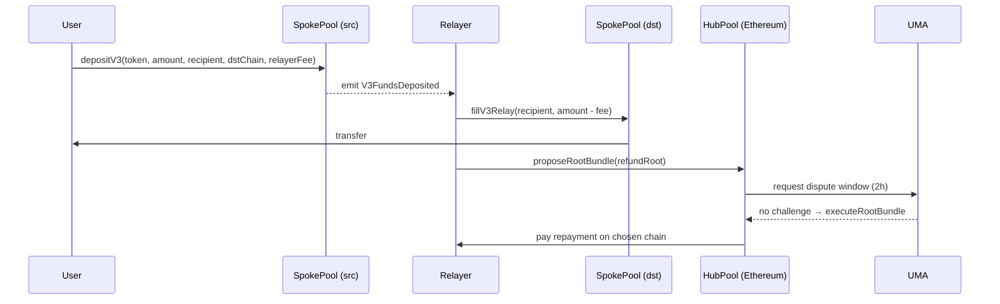

# 流动性跨链桥对比：Hop / Across / Synapse / Stargate

> **TL;DR**：本文聚焦"**资金流动性桥**"——与 LayerZero/Wormhole 这种"通用消息协议"不同，它们的核心价值在于**让用户从 A 链几分钟内拿到 B 链资产**。四者共享一个基本思路："**链下 bonder / LP 在目标链瞬时垫付资金，稍后通过底层慢桥（canonical bridge / 消息协议）结算**"，但在信任模型、LP 抽象、结算层上各有取舍。Hop 创新 AMM-based hToken；Across 最纯粹的 intent + UMA 乐观验证；Synapse 走通用消息 + AMM 池；Stargate 是 LayerZero 官方出品的"统一流动性" token bridge。截至 2026-Q1，Across 在 L2→L1 细分领跑，Stargate 在 stablecoin 多链流动性领跑。

## 1. 背景与动机

Rollup 爆发（2021 Arbitrum/Optimism 上线）后，用户需要快速往返 L1/L2。官方 canonical bridge 的问题：
- **L2 → L1 withdraw 周期极长**：Optimistic Rollup 7 天挑战期；zkRollup 也要 1–4 小时 prove + finality。
- **canonical bridge 只支持"原生资产"**：跨链到其他 L2 需要先回 L1 中转。

用户愿意为"几分钟到账"支付小额溢价。这催生了流动性桥：

> **LP 先用自己的目标链资产垫付给用户，待慢桥消息到达后从源链拿回本金 + 费用。**

本文选取 Hop（AMM 路径）、Across（intent + optimistic）、Synapse（多链 stable 池）、Stargate（LayerZero unified pool）做横向分析，揭示"如何最小化 LP 风险 + 最大化资金效率"的设计张力。

## 2. 核心原理

### 2.1 形式化定义

令跨链转账为 $T = (\text{srcChain}, \text{dstChain}, \text{asset}, \text{amount}, \text{recipient}, \text{deadline})$。流动性桥的目标：

$$
\text{dst}.\text{balanceOf}(\text{recipient}) \mathrel{+}= \text{amount} - \text{fee}, \quad \text{with latency} \ll \text{canonical-bridge-latency}
$$

并保证 LP 最终被**无信任地结算**：

$$
\exists t': \text{src}.\text{bonder}.\text{balance}(t') \mathrel{+}= \text{amount} + \text{fee}_\text{bonder}
$$

安全关键是：*如果 bonder 在目标链作恶（转错人、提前支付），是否有机制让其无法在源链拿钱？*四种协议给出四种答案。

### 2.2 关键机制拆解

四种协议解决同一个三方博弈：**用户**要秒级到账，**LP/Bonder** 要本金安全，**协议** 要在不依赖信任的前提下完成源链→目标链的结算。区分它们的关键在于三个问题：

1. *中间资产如何承载流动性* —— 是发行一种专用 token（hToken、nUSD），还是直接用原生资产？
2. *慢桥用什么做终局性* —— canonical rollup bridge、外部消息层、还是乐观挑战？
3. *谁能成为 Bonder/Relayer* —— 许可白名单还是完全无许可？

---

#### (1) Hop：hToken + AMM 的三段式垫付

**设计起点**：Hop 诞生于 2021 年，彼时 Optimism / Arbitrum 刚上线，L2↔L2 之间没有任何直连通道——必须经过 L1 canonical bridge，单次提取要排队 7 天。Hop 的核心洞察是：**不要直接搬原生 ETH，而是先搬一个"债权凭证"**，债权凭证可以被 Bonder 无风险地提前释放，再由 AMM 换回原生资产。

**三类资产抽象**：

- *Canonical token*：每条链上的真实 ETH / USDC 等（来自 rollup 官方 bridge）。
- *hToken*：Hop 在每条 L2 发行的 ERC20，代表"L1 Hop Bridge 合约里锁的一份 canonical 资产的债权"，1:1 可赎回。hETH-on-Arbitrum 与 hETH-on-Optimism 是**不同的合约**，但共享同一 L1 总账。
- *h-AMM 池*：每条链上一个 `hToken ↔ canonical` 的 StableSwap 池（Saddle fork），让用户进出时一步兑换。

**完整生命周期**（以 Optimism → Arbitrum 转 1 ETH 为例）：

**① 源链进入（Optimism）**：用户调 `L2AmmWrapper.swapAndSend(destinationChainId=42161, recipient, amount=1 ETH, ...)`。合约先用 Optimism 的 h-AMM 把 1 ETH → ~1 hETH（付少量 AMM 滑点），再调 `L2_Bridge.send(...)` 销毁这 1 hETH，emit `TransferSent` 事件携带 `transferId = keccak256(chainId, recipient, amount, bonderFee, amountOutMin, deadline)`。

> 关键点：hToken 在源链 **被销毁**（burn），在目标链 **被 Bonder 铸造/释放**（mint）。总供应的 1:1 平衡由 L1 Bridge 托管的 canonical 资产担保。

**② Bonder 垫付（Arbitrum）**：Bonder 监听到 `TransferSent`，在 Arbitrum `L2_Bridge.bondWithdrawal(recipient, amount, transferNonce, bonderFee)` 调用。这个函数从 Bonder 预先在 L1 押注的 `creditBalance` 里扣减 `amount`，在 Arbitrum mint 等量 hETH 给 recipient（或直接通过 `bondWithdrawalAndDistribute` 经 h-AMM 换成原生 ETH 一步到位）。用户在 10–30 秒内到账。

**③ 结算（Slow path，~7 天）**：源链 Bonder（或任何人）调 `L2_Bridge.commitTransfers(destinationChainId)`。合约把上一个周期内所有 pending 的 `transferId` 聚合成 Merkle root（`TransferRoot`），通过 **Optimism / Arbitrum 的 canonical messenger**（非 Hop 自己的桥）发送到 L1 `L1_Bridge`。在 L1，`L1_Bridge.confirmTransferRoot` 走 rollup 原生的 7 天挑战期（这是 Hop **复用** 的慢桥，不是自建）。挑战期过后，L1 解锁相应 canonical 资产，再通过 canonical bridge 下行到目标链的 `L2_Bridge`，**把 Bonder 在②阶段花掉的 credit 补回来**。

**安全论证**——为什么 Bonder 作恶无利可图：
- `bondWithdrawal` 的参数会现场计算 `transferId`，必须与源链 emit 的事件完全一致；Bonder 给错 recipient / 错金额，L1 在③阶段只认源链的真 transferId，Bonder 的 credit 永远补不回来，等同自掏腰包给别人。
- 任何人都能在挑战期内 `L1_Bridge.challengeTransferBond(transferId, ...)` 举报 Bonder 对伪造的 transferId 做了 bondWithdrawal，Bonder 的 L1 bond 被 slash。
- 用户承担的是 **h-AMM 滑点**（池子越偏，出来的 canonical 越少），不是本金风险——极端情况下最差拿到 hToken，hToken 最终 1:1 可兑。

**关键参数与经济**：
- Bonder credit / stake 比例：L1 允许的 outstanding `creditBalance` 有硬上限（基于 TVL），防止 Bonder 对一条链"超发"。
- `bonderFee` 覆盖三类成本：目标链 gas、7 天资金占用的机会成本（约等于 APY × 7/365）、L2 reorg 风险保险（源链若被深度回滚，Bonder 的 credit 无法补回）。

---

#### (2) Across：Intent 驱动 + UMA 乐观结算 + Hub/Spoke 单池

**设计起点**：Hop/Synapse 模型的痛点是 *per-lane liquidity* ——每对链需要独立 LP。Across 的反设计是：**把 LP 全部集中到 Ethereum 一个 HubPool，每条链上只放 SpokePool（壳合约），靠 Relayer 自己的库存做瞬时垫付，之后用乐观挑战把钱从 Hub 转给 Relayer。** 这样 LP 无需知道用户要去哪条链，TVL 利用率最大化。

**三层架构**：

- *SpokePool*（每条链一个）：用户在源链 `depositV3` 存入，在目标链 `fillV3Relay` 由 Relayer 用自己的库存直接转给用户。SpokePool 不持有流动性——它只是 *事件发射器 + 资金临时存放处*。
- *HubPool*（Ethereum 唯一）：持有所有 LP 的真实资产；是事实上的结算仲裁方。`LPToken` 的持有人（任何人）把 USDC 存进来赚 fee。
- *UMA Optimistic Oracle v3*：判定"Relayer 是否真的按用户意图 fill 了"。

**Intent 的结构**——`V3RelayData` 是 Across 的核心数据结构，一个 deposit 就是一个 intent：

```
{
  depositor, recipient,
  inputToken, outputToken,        // 源链投入的 token，目标链收到的 token
  inputAmount, outputAmount,       // 用户愿意损失多少（差价 = Relayer fee + LP fee）
  originChainId, destinationChainId,
  depositId,                       // 源链自增
  fillDeadline,                    // 过期则退款
  exclusiveRelayer, exclusivityDeadline,  // 独占窗口
  message                          // 跨链 calldata（可触发目标合约）
}
```

关键抽象：用户 **不指定谁来执行、不指定路径**，只声明"我存进 inputAmount，必须在目标链收到至少 outputAmount，在 fillDeadline 之前"。市场化竞争由此展开。

**完整生命周期**：

**① 源链 deposit**：`depositV3` 锁 `inputAmount` 到 SpokePool，emit `V3FundsDeposited(relayHash, ...relayData)`。SpokePool 不立即把钱送去 Hub——它就在源链 SpokePool 里躺着，等 rebalance。

**② 目标链 fill**：任意 Relayer 监听事件，调 `SpokePool.fillV3Relay(relayData, repaymentChainId)`。合约验证 relayHash 没被填过，从 Relayer 本地余额扣 `outputAmount` 给 recipient。**此时 Relayer 赔本垫付**，且同时声明"请把钱还给我的 `repaymentChainId` 链上的我"。

**③ Bundle 提案**：Across 有个链下角色叫 **Dataworker**（任何人可运行，目前主要由 Risk Labs 运行）。每隔几小时它扫描所有链的 SpokePool 事件，构造一个 `RootBundle`：
- `relayerRefundRoot`：Merkle root，叶子是 `(chainId, relayer, token, refundAmount)`；
- `poolRebalanceRoot`：给每个 SpokePool 的净流入/净流出指令（"把 50万 USDC 从 Arb SpokePool 移回 Hub"）；
- `slowRelayFulfillmentRoot`：未在 fillDeadline 前被 fill 的 deposit 的退款指令。

Dataworker 调 HubPool `proposeRootBundle(bundleEvaluationBlockNumbers, poolRebalanceRoot, relayerRefundRoot, slowRelayLeafRoot)`，附带 UMA OO bond（USDC，约 $5000 级别）。

**④ UMA 挑战窗口（默认 2 小时）**：任何人可比对链上事件与提案的 Merkle root；发现不一致则 `disputeRootBundle`，同等 bond。争议交由 UMA DVM（UMA 自己的 governance 投票 48h）裁决，输方 bond 全额罚没。经济上：Dataworker 作弊至少损失 $5000，而每个 bundle 结算金额 $1M+，被挑战概率接近 1，故不值得作弊。

**⑤ 执行**：窗口过无挑战，任何人调 `executeRootBundle`。合约执行三件事：
- 对每条链通过 canonical bridge 执行 `poolRebalance`（Hub ↔ SpokePool 物理搬运）；
- 在 `repaymentChainId` 链上，Relayer 凭 Merkle proof 调 `executeRelayerRefundLeaf` 领回 `outputAmount + LP fee + relayer fee`；
- slow relay 退款按 Merkle proof 发给 depositor。

**安全论证**：
- Relayer **不能**用假 fill 骗钱：refund 叶子由 Dataworker 依据链上 `FilledV3Relay` 事件生成，Relayer 没填就进不了叶子。Relayer 填了错金额给错人——链上事件会体现，Dataworker 要么不收（Relayer 亏本白垫）要么被 disputer 发现。
- Dataworker **不能**乱编 root：任何 watcher 可在 2h 内 dispute，DVM 是最终裁决。
- 最坏情况——Dataworker 和所有 disputer 合谋——UMA 整个系统失守，Across LP 会亏相应 bundle 资金。这是 Across 的信任底线（UMA 经济安全，约 $100M 量级）。

**Relayer 的经济优化**：
- `exclusiveRelayer + exclusivityDeadline`：给知名 Relayer 几秒独占窗口，让他们用更激进报价，同时保留后备 Relayer。
- `repaymentChainId` 自选：Relayer 本地 USDC 库存在哪条链缺，就让 Hub 在那条链补，避免自己跨链搬 gas。
- 库存建模：Relayer 本质在运行一个 *多链库存管理算法*，把 7 天 capital cycle 内的 fill 决策视为多臂赌博（哪条 lane 报价、哪条 lane 不接）。

---

#### (3) Synapse：Guardian 共识 + nToken Metapool

**设计起点**：Synapse 想同时做"资金桥"与"通用消息桥"，且不依赖 rollup 官方 bridge（那样会被 EVM 绑死）。方案是：**自建一个外部验证网络（Guardian 多签 → Synapse Chain Tendermint → OP Stack L2），所有跨链事件都由它背书；资产层发行 nUSD / nETH 作为统一记账单位，每条链配一个 metapool 做"nToken ↔ 当地稳定币"的即时兑换。**

**资产层：nToken 的双轨铸销**

Synapse 对资产类型有两种处理：

- **Liquidity Pool 模式（用于 *非原生* 资产）**：用户把 USDC 存入源链的 metapool，换出 nUSD（在 StableSwap 池里）；nUSD 在源链被 burn（`SynapseBridge.deposit`）；Guardian 背书后在目标链 mint 新 nUSD，用户在目标链 metapool 里把 nUSD 换回当地 USDT/DAI。**跨链本质是 nUSD 总供应在不同链之间转移，底层 USDC 一直锁在源链**。
- **Burn-Mint 模式（用于 *Synapse 原生资产* 如 SYN、nETH）**：`redeem` 直接销毁，目标链 `mint` 新发行，没有中间池子。这是因为 nETH / SYN 本来就是 Synapse 自己发的资产，可以在每条链任意增发/销毁。

**metapool 的套利均衡**：nUSD-on-Arbitrum 与 nUSD-on-Optimism 是**独立 ERC20**，靠各自 metapool 维持 peg。若 Arbitrum 上太多人桥出（nUSD 大量铸造），metapool 里 nUSD/USDC 比例失衡，nUSD 价格 < $1，套利者将 nUSD 桥回到 Optimism（那边 nUSD 稀缺，价格 > $1），赚取差价。**跨链池子的流动性再平衡不需要协议主动干预，由 arb 市场自动完成。**

**验证层：从 Guardian 多签到 Synapse Chain**

- **初代（2021–2023）**：5–10 个 Guardian 节点运行 Synapse 的 Go 客户端，监听所有链事件；达到阈值签名后，任意 relayer 可提交签名到目标链触发 mint。合约里存储 Guardian 公钥 + `threshold`，标准 multi-sig verification。
- **Synapse Chain（2023）**：把 Guardian 升级为 Tendermint 共识的 L1（原计划 Cosmos SDK），再后来重构为 **OP Stack L2**（2024 上线 testnet）。动机是让 Guardian 的"听事件 → 签名 → 广播"流程改成**"在 Synapse Chain 上实际执行一遍跨链消息，产出 state root，用这个 root 在目标链做证明"**——即把 multi-sig 升级为类 rollup 的 state machine replication。迁移过程中多链 bridge 合约升级为"订阅 Synapse Chain 的消息"。

**SynapseBridge 的核心函数**：
- `deposit` / `withdraw`：LP 模式的主动存取；
- `redeem` / `mint`：burn-mint 模式，目标链 `mint` 需要 Guardian 签名（`NODEGROUP_ROLE`）；
- `redeemAndSwap` / `redeemAndRemove`：原子组合 bridge + 目标链 metapool swap，减少一笔用户操作。

**安全论证与已知弱点**：
- Guardian 阈值被攻破即全池失守（无 RMN 式二级熔断）。2022 年 Nomad 事件后，Synapse 对 Guardian 集合做了去中心化扩容，但仍是外部验证。
- Metapool 自身的 depeg 风险：若 nUSD 背后的抵押稳定币（USDC 等）本身脱锚，nUSD 跟着脱锚，所有链的 nUSD 持有人同时受损。
- Synapse Chain 迁移期间存在"双套验证并行"窗口，合约升级复杂度是工程性风险。

---

#### (4) Stargate：Delta 算法 + 真·统一流动性

**设计起点**：前三者都有一个隐性假设——每对链之间需要独立的流动性"车道"（Hop h-AMM 每链一个、Across HubPool 里按 token 分账、Synapse 每链一个 metapool）。Stargate 的突破是：**一个 token 在所有链上的 LP 是同一份逻辑池，协议实时维护每对"源-目"车道上可兑付的配额，保证 *任何一笔 swap 永不失败*（Instant Guaranteed Finality, IGF）。**

**核心数据结构：ChainPath**

Stargate 在每条链的 `Pool` 合约里，为每个**"目标链 × 目标池"**维护一个 `ChainPath`（车道）对象：

```
struct ChainPath {
  bool ready;
  uint16 dstChainId;
  uint256 dstPoolId;
  uint256 weight;            // 本车道分配权重
  uint256 balance;           // 本车道本侧余额（可用于发送 credit）
  uint256 lkb;               // "last known balance" —— 对端池的本地视图
  uint256 credits;           // 本侧已发送但未被对端确认的 credit
  uint256 idealBalance;      // 根据 weight 计算的期望 balance
}
```

`balance` 之和 ≠ 池总流动性——**总流动性是所有 ChainPath 的 balance 合计**。这意味着池子里没有"任意可用资金"，只有"对具体车道可用的资金"。

**Delta 算法：动态再平衡 credit**

每当一笔 swap 在源链发生（`swap(dstChain, dstPool, amount)`）：
1. 源链 Pool 扣减本地 `chainPaths[dstChain, dstPool].balance` 的 `amount`，全局 `totalLiquidity -= amount`；
2. 调用 `sendCredits`：根据 Delta 参数（`lpDeltaBP` / `protocolDeltaBP`）计算 *本次可以"借走"多少对端 credit 用于未来 rebalance*，把这些 credit 打包进 LayerZero 消息一起发出；
3. 目标链接收消息后，调 `creditChainPath` 把这批 credit 记入对端 ChainPath 的 `balance`——**实际相当于"目标链赠予源链一些 balance，让源链下次还能往其他车道发送"**。
4. 然后目标链从自己 `chainPaths[srcChain, srcPool]` 的 `balance` 中释放 `amount` 给用户。

换句话说：**credit 是对端池子承诺"我未来某时刻会把这些资金腾给你"的 IOU**。Delta 算法把单点流动性（某车道 balance 用光了）的失败风险，通过 credit 的前后互借转化为全局流动性的平滑再分配。

**IGF（Instant Guaranteed Finality）的前提**：源链 swap 发起前，合约检查 `dstChainPath.balance >= amount`（即对端对源链这条车道的预留足够）。**如果不够，源链拒绝这笔交易**——用户不会遇到"目标链钱不够，资金卡住"的情况，这是 Stargate 与 Multichain/AnySwap 式桥的本质区别。

**v2 Taxi / Bus 模式（2024）**：
- **Taxi**：每笔 swap 独立 LayerZero 消息，延迟最低（~30 秒），费用最高。适合大额、时效敏感。
- **Bus**：协议把同一 source→destination 方向的多笔 swap 聚合进一个 LZ 消息（一次打包发车），单笔 LZ 成本分摊。代价是等下一班"公交"发车（典型 1–3 分钟）。默认路径。
- **lzCompose**：v2 支持 bridge 完成后触发目标链上的 composer 合约（接收参数），实现"bridge + 自动 swap / stake"原子流程。

**安全论证**：
- 消息层信任继承自 LayerZero v2 DVN 配置（Stargate 通常要求 Google Cloud + LayerZero Labs DVN + Stargate 自己的 DVN，3/3 或 m/n 门限）。DVN 失守 = Stargate 失守，这是无法回避的上游依赖。
- 经济不变式：`Σ_chains totalLiquidity == Σ user LP shares × share price`。这里说的是**跨所有链汇总后的总价值/总流动性**只会因 LP mint/burn 改变；前文 swap / credit 里对 `totalLiquidity` 的加减，指的是**单链 / 单池 / 单车道的记账量**随资金迁移而变化，而不是全局总额被凭空增减。Delta 再平衡本质上只是在车道之间搬 balance，因此不会破坏 LP 份额的整体可赎回性。
- 失败模式：某条车道长期单向流出（A→B 大量用户、B→A 几乎没有）会耗尽该车道 balance，**新请求被拒绝**而非让 LP 亏本。表现为"暂时路径不可用"，用户体验不佳但资金安全。

### 2.3 子机制详解

**Bonder 经济模型**（以 Hop 为例）：
$$
\text{profit} = \text{bonderFee} - \text{opportunity cost}(\text{locked} \times \text{Δt}) - \text{slippage(hToken AMM)} - \text{reorg risk insurance}
$$

**Across repayment chain 选择**：Relayer 可选任一支持链接受 repayment，节省跨链 gas。

**Synapse nUSD 套利**：nUSD 在不同链池子因为利用率不同会偏离 $1，套利者把 nUSD 从高价链搬到低价链做 arb，自动平衡池子。

**Stargate Delta**：维护 `chainPathCredit` 与 `pendingCredit`，Delta 算法每笔交易实时调整 credit 分配，防止某条链过度借贷。

### 2.4 参数与常量

| 协议 | 关键参数 | 取值 |
| --- | --- | --- |
| Hop | Bonder fee | 0.04–0.2% |
| Hop | 挑战期 | 7 天（Optimistic L2-native） |
| Across | UMA 挑战期 | 2 小时 |
| Across | Relayer fee | 动态（LP utilization + gas） |
| Synapse | Guardian 数 | 可变（约 5–10） |
| Stargate | Slippage 阈值 | 可配 |
| Stargate | 支持池 | USDC/USDT/ETH/等 |

### 2.5 边界条件与失败模式

- **Hop**：Bonder 离线 → 用户 fallback 到 canonical 7 天；Bonder 作恶释放 hToken 给非 recipient → Bonder 在源链无法 redeem（合约校验 `transferId`）。
- **Across**：Relayer 作恶 → 需要 UMA bondholder 在挑战期反驳，否则 slash；Relayer 资金不足 → 用户等 intent 被其他 relayer 接。
- **Synapse**：Guardian 作恶 → 无 RMN 类熔断，依赖链上治理发现；稳定池 depeg → 滑点暴涨。
- **Stargate**：目标池流动性枯竭 → 源链不让发送（Delta 保护）；LayerZero DVN 被攻破 → 全池风险。

### 2.6 图示

Across Intent 流程：



Hop 结构：

```
+--- L2-A ---+                       +--- L2-B ---+
| Hop Bridge | <--canonical (slow)-->| Hop Bridge |
| user→hETH  |                       | hETH→ETH   |
+-----+------+                       +-----+------+
      |  Bonder moves hETH                 |
      +---------(fast path)----------------+
                   ↓
           +-------+-------+
           | h-AMM  pool   |  (SaddleSwap style)
           +---------------+
```

## 3. 架构剖析

四种协议在"用户端合约 — 链下角色 — 结算层 — 流动性层"的堆叠方式差异巨大，下文按协议逐一展开。每节遵循相同的四层视角：**① 分层与核心合约 ② 链下角色 ③ 端到端数据流（含具体数字示例） ④ 扩展接口**。

### 3.1 Hop 架构

**① 分层与核心合约**

Hop 的部署拓扑是"**1 个 L1 Bridge + N 个 L2 Bridge（每条支持的 L2 一个）**"，所有 L2 共享同一个 L1 Hop Bridge：

| 层级 | 合约 | 部署位置 | 职责 |
| --- | --- | --- | --- |
| 入口层 | `L2_AmmWrapper.sol` | 每条 L2 | 组合 AMM swap + bridge send，用户单调用完成 canonical→hToken→send |
| 核心桥 | `L2_Bridge.sol`（`L2_OptimismBridge` / `L2_ArbitrumBridge` 派生） | 每条 L2 | `send` / `bondWithdrawal` / `commitTransfers`，hToken 的 mint/burn 入口 |
| 结算锚 | `L1_Bridge.sol` | Ethereum | 持有所有 canonical token 抵押；`confirmTransferRoot` 验证慢桥消息；管理 Bonder credit |
| 流动性 | `SaddleSwap` metapool（`h<Token> ↔ canonical`） | 每条 L2 | 用户在源链进入、在目标链退出时的即时兑换 |
| 慢桥 | Rollup 官方 messenger（`L1CrossDomainMessenger` / Arbitrum Inbox 等） | L1/L2 | **Hop 不自建消息层**，直接复用 rollup 原生 7 天挑战 bridge 传 `TransferRoot` |

Key repo：`hop-protocol/contracts-v2`，按 L2 派生的 Bridge 合约在 `contracts/bridges/L2_*Bridge.sol`。

**② 链下角色**

- **Bonder**（约 10 个许可节点，主要是 Hop Labs + 合作机构）：监听所有 L2 的 `TransferSent` 事件，在目标链调 `bondWithdrawal`。Bonder 要先在 L1 `L1_Bridge` 押入 stake，`creditBalance` 随 bond 消耗/补回浮动。代码 `hop-node`（TypeScript），开源但运行需白名单。
- **Challenger**（无许可）：任何人扫描 L1 `TransferBond` 事件，若发现 Bonder 绑定了源链并不存在的 transferId，调 `challengeTransferBond` 触发 slash。

**③ 端到端数据流：Optimism → Arbitrum 转 1 ETH**

1. 用户在 Optimism 调 `L2AmmWrapper.swapAndSend(destChainId=42161, recipient, amount=1e18, bonderFee=5e14, ...)`。Wrapper 先走 Saddle `hETH/ETH` 池把 1 ETH 换成 ~0.999 hETH，再调 `L2_Bridge.send(42161, recipient, 0.999e18, 5e14, amountOutMin, deadline)`。
2. `L2_Bridge` 销毁 Wrapper 交来的 hETH，计算 `transferId`，emit `TransferSent(transferId, ...)` 并 `_addToPendingAmount(42161, 0.999e18)`。
3. Bonder 在 Arbitrum 调 `L2_Bridge.bondWithdrawalAndDistribute(recipient, 0.999e18 - 5e14, transferNonce, bonderFee, amountOutMin, deadline)`，先在 Arbitrum mint `0.999 - fee` hETH，经 Arbitrum 的 Saddle 池换回 ~0.998 ETH 打给 recipient。全程 15–30 秒。
4. 累计约 2–4 小时（或到达 pending 阈值）后，任何人（通常 Bonder 自己）在 Optimism 调 `commitTransfers(42161)`，把该批 `transferIds` 打包成 `TransferRoot`，通过 Optimism L2→L1 messenger 提交到 L1 `L1_Bridge.confirmTransferRoot`。
5. **这里会卡 7 天**：Optimism 的 L2→L1 withdrawal 本身就有 7 天挑战期。挑战期过后，L1 确认 root，将 0.999 ETH canonical 资产从 L1 escrow 通过 Arbitrum canonical bridge 打到 Arbitrum `L2_Bridge`，后者把这笔钱"补给" Bonder 的 `creditBalance`。
6. 此时 Bonder 的 capital cycle 才闭环，但用户早在步骤 3 就已到账。

Bonder 资金占用 ≈ 7 天，其 `bonderFee`（通常 0.04–0.2%）需覆盖 7 天机会成本 + 源链 reorg 保险 + 两侧 gas。

**④ 扩展接口**

- `swapAndSend` / `distribute`：内置 AMM 组合，用户只需一签。
- `SendMessage` 模式（v2 新增，2024）：Hop Messenger 接口在发送 `TransferSent` 的同时可携带 `bytes message`，目标链 `L2_Bridge` 在 `bondWithdrawalAndDistribute` 内把 `message` 转给 recipient 合约的 hook，支持 "bridge + call"。
- `AmmWrapper` 可替换——第三方 DEX aggregator 集成时通常绕过 Saddle 直接走 Uni/Curve 再调 `L2_Bridge.send`。

---

### 3.2 Across 架构

**① 分层与核心合约**

Across 是典型的 **Hub-Spoke** 拓扑——Ethereum 上唯一的 `HubPool` 持有全部 LP 流动性，每条支持链一个 `SpokePool` 负责事件发射与 refund 执行：

| 层级 | 合约 | 部署位置 | 职责 |
| --- | --- | --- | --- |
| 入口/出口 | `SpokePool.sol`（`Ethereum_SpokePool`、`Arbitrum_SpokePool` 等派生） | 每条链 | `depositV3` 锁资金、`fillV3Relay` Relayer 垫付、`executeRelayerRefundLeaf` 领 refund |
| 结算仲裁 | `HubPool.sol` | Ethereum | 持 LP 资产、`proposeRootBundle` / `executeRootBundle`、派发 repayment 到 SpokePool |
| LP 记账 | `HubPool` 内建 LP accounting + `LpTokenFactory` | Ethereum | 每种 token 一个 `LpToken`；LP `addLiquidity` 铸份额 |
| 挑战层 | UMA `OptimisticOracleV3` | Ethereum | 托管 bundle bond、开启/裁决 dispute |
| Rebalance 通道 | 各 rollup 的 canonical bridge adapter（`Arbitrum_Adapter` 等） | Ethereum | `poolRebalance` 实际把 USDC 从 HubPool 搬到 SpokePool（或反向） |

Repo：`across-protocol/contracts`（Solidity），`across-protocol/relayer-v2`（链下）。

**② 链下角色**

- **Relayer**（完全无许可）：监听所有链 `V3FundsDeposited` 事件，本地库存充足就立即在目标链 fill。开源客户端 `across-protocol/relayer-v2`（TypeScript），知名运营方 Bastion Trading、Wintermute、Flashbots 及大量独立运营者。
- **Dataworker**（无许可，但实际门槛高）：运行一个庞大的索引 + Merkle tree 构建进程，周期性 `proposeRootBundle`。需要准备 UMA bond（USDC，当前约 $5000 量级）。代码在 `relayer-v2/src/dataworker`。
- **Disputer**（无许可）：并行运行 Dataworker 的"验证版"，若发现提案的 root 与链上事件不一致则提交 dispute。目前 Risk Labs 及少数第三方运行。
- **LP**（任何地址）：在 HubPool 某 token 池 `addLiquidity` 获取份额，被动赚 `lpFee`。

**③ 端到端数据流：Ethereum → Arbitrum 转 10,000 USDC**

1. 用户在 Ethereum 调 `SpokePool.depositV3({ inputToken=USDC, outputToken=USDC_ARB, inputAmount=10_000e6, outputAmount=9_995e6, destinationChainId=42161, recipient, quoteTimestamp, fillDeadline=now+4h, exclusiveRelayer=0x0, exclusivityDeadline=0, message=0x })`。合约把 10,000 USDC 从用户扣到 SpokePool，emit `V3FundsDeposited(depositId=N, ...)`。
2. 10 秒内，Relayer A 在 Arbitrum 调 `SpokePool.fillV3Relay(relayData, repaymentChainId=10)`——消耗自己的 9,995 USDC 库存打给 recipient，`relayFills[relayHash] = Filled`，emit `FilledV3Relay(..., relayer=A, repaymentChainId=10)`。用户到账。
3. 接下来约 1–6 小时，Dataworker 收集"上一个 bundle 以来"所有链的 deposit/fill 事件，计算：
   - `relayerRefundRoot`：包含 `(chainId=10, relayer=A, token=USDC, amount=9_995e6 + lpFee + relayerFee)` 叶子；
   - `poolRebalanceRoot`：HubPool → Ethereum SpokePool 净流入 10,000、HubPool → Optimism SpokePool 净流出 ~10,000（因 Relayer 要在 Optimism 领 refund）；
   - `slowRelayFulfillmentRoot`：本轮无需（因已被 fill）。
4. Dataworker 调 HubPool `proposeRootBundle(...)`，在 UMA OO 附 bond。
5. **UMA 2 小时挑战窗口**。任何 disputer 可 `disputeRootBundle` + 同等 bond，争议走 UMA DVM 48h 投票（真正被 dispute 的历史案例接近零）。
6. 窗口过，任何人调 `HubPool.executeRootBundle`：
   - HubPool 根据 `poolRebalanceRoot` 往 Ethereum SpokePool 拨 10,000 USDC（直接 ERC20 transfer），通过 Arbitrum canonical bridge 把 ~10,000 USDC 存入 Arbitrum SpokePool 的未来余额（L1→L2 约 15 分钟到 Arb）；通过 Optimism canonical bridge 给 Optimism SpokePool 拨 ~10,000（L1→L2 约 1–3 分钟）。
   - 之后 Relayer A 在 Optimism 调 `SpokePool.executeRelayerRefundLeaf(proof, leaf)`，凭 Merkle proof 从 Optimism SpokePool 领走 9,995 + fees。
7. Relayer capital cycle：垫付（步骤 2）→ 领回（步骤 6 末），中位 1–3 天，上限接近下个 bundle 周期。

端到端用户可见延迟：10 秒–2 分钟；Relayer 资金占用 1–7 天。

**④ 扩展接口**

- `depositV3.message`：可携带任意 calldata，fillV3Relay 执行时在目标链调用 `AcrossMessageHandler(recipient).handleV3AcrossMessage(tokenSent, amountSent, relayer, message)`，实现"bridge + 自动 swap / LP / 开仓"原子流程。
- **Universal Intents（2024）**：在 SpokePool 之上新增 intent router，支持 `inputToken ≠ outputToken` 的不同资产（如用户存 ETH，目标链收 USDC），由 Relayer 负责兑换。
- `exclusiveRelayer` + `exclusivityDeadline`：SDK 做 RFQ 时，先向白名单 Relayer 询价获得签名，把该 Relayer 写入 deposit 的独占字段，短窗口内锁定最优报价。

---

### 3.3 Synapse 架构

**① 分层与核心合约**

Synapse 横跨"资产桥 + 消息桥"，合约与链下共识双层抽象：

| 层级 | 合约 / 服务 | 部署位置 | 职责 |
| --- | --- | --- | --- |
| 入口 | `SynapseRouter.sol` / `SynapseRouterV2.sol` | 每条链 | 给前端统一入口；组合 metapool swap + bridge |
| 桥核心 | `SynapseBridge.sol` | 每条链 | `deposit` / `withdraw`（LP 模式） + `redeem` / `mint`（burn-mint 模式）|
| Stable AMM | `SwapFlashLoan.sol`（Saddle fork）+ metapool | 每条链 | `nUSD / [当地 USDC/USDT/DAI]` 池 |
| 消息桥 | `MessageBusUpgradeable.sol` | 每条链 | 通用跨链消息，`executeMessage` 由 Guardian 签名触发 |
| 共识层 | Synapse Chain（OP Stack L2，迁移中） | Ethereum settlement | 所有跨链事件由 Synapse Chain 重新执行一遍，产出 state root，作为目标链 mint 的授权依据 |
| 验证层 | `NODEGROUP_ROLE` + Guardian 多签 | 各链 Bridge 合约 | 初代方案，仍在非 Synapse Chain 路径上使用 |

Repo：`synapsecns/synapse-contracts`（合约）、`synapsecns/sanguine`（包括 agents、executor、Synapse Chain client，Go）。

**② 链下角色**

- **Guardian / Validator**（许可，约 5–10 节点）：运行 Go 客户端 `sanguine`，监听所有链事件，对合法 bridge 请求产生 ECDSA 签名聚合；阈值达成后广播到目标链触发 `mint` 或 `executeMessage`。Synapse Chain 上线后，这些节点成为 Synapse Chain 的 OP Stack sequencer / verifier。
- **Executor**（可无许可，实际多为 Synapse Labs 运行）：把 Guardian 签名打包提交到目标链合约，付 gas 赚 execution tip。
- **套利者 / LP**：在各链 metapool 做 market making，自动把偏离 peg 的 nUSD/nETH 搬回锚点。

**③ 端到端数据流：Arbitrum → Optimism 转 10,000 USDC（LP 模式）**

1. 用户在 Arbitrum 调 `SynapseRouterV2.bridge(to, destChainId=10, token=USDC, amount=10_000e6, originQuery, destQuery)`。`originQuery` 指示把 USDC 先经 Arbitrum metapool 换成 `nUSD`；`destQuery` 指示到 Optimism 后把 `nUSD` 再换成当地 USDC。
2. Router 调 metapool `swap(USDC → nUSD)`，得到 ~10,000 nUSD（StableSwap 滑点极小）。
3. Router 调 `SynapseBridge.redeem(to, 10, nUSD, 10_000e18)`。`redeem` 把 nUSD 从 Router 烧掉，emit `TokenRedeem(to, 10, nUSD, 10000e18, ...)`。
4. Guardian 集群监听到事件，验证后各自产生 ECDSA 签名。阈值（如 3/5）达成，Executor 在 Optimism 调 `SynapseBridge.mint(to, nUSD_opt, 10_000e18, fee, kappa, signatures)`。
   - 合约 `_checkSigs` 验证多签，标记 `kappa`（唯一性标识，防重放）为已用。
   - 合约在 Optimism mint 10,000 nUSD（仅扣 bridge fee），调用目标端 metapool `swap(nUSD → USDC)`，把 ~9,998 USDC 送到 `to`。
5. Synapse Chain 路径下：步骤 4 的"Guardian 签名"被替换为"Synapse Chain 上跨链消息执行产出的 state proof"——Optimism SynapseBridge 合约验证 proof 与 Synapse Chain state root，确认合法后执行 mint/swap。

端到端延迟：5–15 分钟（Guardian 聚合签名 + 目标链执行）。Synapse Chain 模式下延迟取决于 L2 共识出块节奏。

**④ 扩展接口**

- `MessageBus.sendMessage(dstChainId, to, message, options)`：通用消息，目标链 Receiver 合约实现 `handleMessage(srcChainId, srcAddress, message)`，用于跨链合约调用。
- `SynapseRouterV2` 的 `originQuery` / `destQuery` 接入任意当地 DEX（不仅限 metapool）——第三方可把 Uniswap、Curve 路径作为源链/目标链的 swap 层，Synapse 只管 nUSD/nETH 的跨链流动。
- **RFQ 模式**（2024 新增）：类似 Across intent，用户挂单（源链希望送出、目标链希望收到），白名单 market maker 主动 fill，绕开 metapool 的滑点与 Guardian 延迟，主要用于大额稳定币。

---

### 3.4 Stargate 架构

**① 分层与核心合约**

Stargate 构建在 LayerZero 消息层之上，合约被刻意做成"无共识、只做资金记账 + 调用 LZ"：

| 层级 | 合约 | 部署位置 | 职责 |
| --- | --- | --- | --- |
| 入口 | `Router.sol` | 每条链 | 用户调 `swap(...)`；持有 Factory、Bridge 等模块引用 |
| 流动性 | `Pool.sol`（每 token × 每 chain 一个 Pool 实例） | 每条链 | 管理 ChainPath、balance、idealBalance、LP 份额（LP token 是 ERC20）|
| 结算 | `Bridge.sol` | 每条链 | 把 Router 的 swap 请求打包进 LayerZero message；接收对端消息并更新本地 Pool |
| 消息层 | LayerZero `EndpointV2` + 配置 DVN / Executor | 每条链 | 传递 `Packet`；Stargate 典型配置 3 个 DVN（Stargate / LZ Labs / Google Cloud） |
| Compose 层（v2） | `StargateComposer.sol` / 用户 Composer | 目标链 | `lzCompose` 完成后触发用户指定的后置调用 |

Pool 之间通过 `ChainPath` 对象双向连接，构成一张**完全图**（支持链数 n，每个 Pool 持有 n-1 个 ChainPath）。Repo：`stargate-protocol/stargate-v2`。

**② 链下角色**

- **Stargate 本身无独立 Relayer**。所有跨链消息推送由 **LayerZero Executor**（链下服务商）完成，验证由配置的 DVN（Decentralized Verifier Network）完成。Stargate 作为 LayerZero 的 OApp，只消费其 endpoint。
- **LP**：在任何链的 `Pool` 调 `addLiquidity(poolId, amount)`，合约按当前每份 LP 对应资产价格铸 LP token。LP 份额对应的是 *全局 totalLiquidity*——跨链 IOU 也在这份全局总账中。
- **Rebalance 机器人**（可选）：部分 LP / 运营方主动制造反方向交易以修复单向耗尽的 ChainPath（如 Arb→Opt 流量远大于反向时，在 Opt→Arb 开激励）。

**③ 端到端数据流：Arbitrum → Optimism 转 10,000 USDC（v2 Taxi 模式）**

1. 用户在 Arbitrum 调 `Router.swap(dstEid=Optimism_EID, srcPoolId=USDC_POOL, dstPoolId=USDC_POOL, refundAddr, amountLD=10_000e6, minAmountLD=9_995e6, lzTxParams, to, payload=0x)`，附 LZ message fee（ETH）。
2. Router 调 `Pool.swap(...)`：
   - `cp = chainPaths[Optimism_EID][USDC_POOL]`。合约检查 `cp.balance >= 10_000e6`——若不够，**交易直接 revert**（IGF 保护）。
   - 扣 `cp.balance -= 10_000e6`。这里减少的是该目的地方向 ChainPath 的可用 `balance`，**不是**协议全局 `totalLiquidity`；后者只会在 LP mint/burn 时变化。
   - 调 `sendCredits`：基于 `cp.idealBalance` 与当前 `cp.balance` 差值，计算需要"借给 / 还给"对端的 credit 数量（Delta 参数控制），构造 `CreditObj { credits, idealBalance }`。
3. Router 调 `Bridge.swap(...)`：把 `{ type=SWAP, creditObj, swapObj { amountSD, ..., to, payload } }` 打包成 LayerZero message，通过 Endpoint 发送。
4. LayerZero Executor + DVN 把 message 送达 Optimism Endpoint（典型 30–90 秒）。
5. Optimism `Bridge.lzReceive(...)`：
   - 先处理 `creditObj`：调本地 `Pool.creditChainPath(Arbitrum_EID, USDC_POOL, credits, idealBalance)`，把 credit 累加进**反方向** ChainPath 的 `balance`。这一步是 Delta 再平衡的核心——**Arbitrum 的流出在 Optimism 的 Arbitrum-方向车道上转化为可用 balance**；它调整的是局部 credit / balance 记账，而不是让全局 `totalLiquidity` 增加。
   - 再处理 `swapObj`：从本地 Pool 划走 10,000 USDC 给 `to`；若 `payload ≠ 0x`，通过 `StargateComposer.lzCompose` 回调用户 Composer 合约。
6. **如果步骤 5 的 swap 执行失败**（例如 gas 不足、Composer revert）：Stargate 协议定义了 `revertLookup` / `cachedSwap` 机制，Executor 可稍后重试；本金不会丢失。

**Bus 模式的差异**：步骤 3 中 Router 不立即发起 LZ message，而是把 `(user, dstEid, amount, to, payload)` 追加到 `BusPool` 待发车队列。当累积触达阈值（tickets 数或时间）或某用户付额外 fee 催发，Bridge 把整个 bus 批量发往目标链，目标端逐 ticket 解包执行。

**④ 扩展接口**

- **`lzCompose`（v2 核心）**：bridge 完成后原子触发目标链上的任意 Composer 合约，参数由 `swap` 的 `payload` 携带。常见用例：跨链 Aave 存款、跨链 Uniswap 交易、跨链 NFT 铸造。
- **Hydra 架构（v2）**：把 v1 单一 pool 拆成 `Pool` + `TokenMessaging` + `CreditMessaging` 多合约，`Credit` 消息与 `Swap` 消息可独立传播——空 credit 消息轻量广播使 Delta 再平衡更及时。
- **OFT 互通**：Stargate v2 的 Pool 同时实现了 LayerZero OFT（Omnichain Fungible Token）标准，其他 OApp 可直接与 Stargate pool 交互而无需走 Router。
- **DVN 可选配**：接入 Stargate 的 dApp 可为自己的 OApp 指定不同 DVN 组合（放松或加强信任），但 Stargate 官方池子的 DVN 固定。

## 4. 关键代码 / 实现细节

### Across SpokePool.fillV3Relay

```solidity
// across-protocol/contracts/contracts/SpokePool.sol:L480 (v3.5)
function fillV3Relay(V3RelayData calldata relayData, uint256 repaymentChainId) external {
    bytes32 relayHash = _getV3RelayHash(relayData);
    require(relayFills[relayHash] == FillStatus.Unfilled, "already filled");
    // 1. 检查 exclusiveRelayer 或 exclusivityDeadline 已过
    _requireNotExclusive(relayData.exclusiveRelayer, relayData.exclusivityDeadline);
    // 2. 从 relayer 转账到 recipient（如带 message 则调用）
    _fillRelayV3(relayData, msg.sender, repaymentChainId);
    relayFills[relayHash] = FillStatus.Filled;
    emit FilledV3Relay(relayData, msg.sender, repaymentChainId, relayHash);
}
```

### Hop L2_Bridge.sendToL1

```solidity
// hop-protocol/contracts-v2/L2_Bridge.sol:L150
function send(uint256 chainId, address recipient, uint256 amount, uint256 bonderFee, ...) external {
    bytes32 transferId = getTransferId(chainId, recipient, amount, bonderFee, nonce, ...);
    _addToPendingAmount(chainId, amount);
    _transfer(msg.sender, address(this), amount);
    emit TransferSent(transferId, chainId, recipient, amount, ...);
    // Bonder 下一步在目标链 bondWithdrawal 释放资金
}

function commitTransfers(uint256 destinationChainId) external {
    // 打包 pending transferIds 成 Merkle root，通过慢桥提交到 L1
    ...
}
```

### Stargate Pool.delta

```solidity
// stargate-protocol/Pool.sol:L260
function sendCredits(uint16 _dstChainId, uint256 _dstPoolId) external returns (CreditObj memory c) {
    ChainPath storage cp = getAndCheckCP(_dstChainId, _dstPoolId);
    c = CreditObj(cp.balance - cp.idealBalance, cp.lkb);
    cp.lkb += c.credits; // lock known balance
    cp.balance = cp.idealBalance;
    totalLiquidity -= c.credits;
    emit SendCredits(_dstChainId, _dstPoolId, c.credits, c.idealBalance);
}
```

### Synapse SynapseBridge.redeem

```solidity
// synapsecns/synapse-contracts/SynapseBridge.sol:L95
function redeem(address to, uint256 chainId, IERC20 token, uint256 amount) external {
    token.burnFrom(msg.sender, amount);
    emit TokenRedeem(to, chainId, token, amount);
    // Synapse validators 听事件，经链上共识后在 dst 链 mint
}
```

## 5. 演进与版本对比

| 协议 | 关键里程碑 |
| --- | --- |
| Hop v1 (2021) → v2 (2024，引入 messenger 模式) |
| Across v1 (2021) → v2 (Canonical Bridger) → v3 (2023 Intent) → Atomic Intents (2024) |
| Synapse v1 AMM (2021) → Messaging (2022) → Synapse Chain (2023) → OP Stack L2 (2024) |
| Stargate v1 (2022) → v2 (2024，Hydra 架构 + Taxi/Bus 模式) |

## 6. 实战示例

**Across Intent：Mainnet → Arbitrum USDC，SDK 调用**：

```typescript
import { AcrossClient } from "@across-protocol/app-sdk";
import { createWalletClient, http } from "viem";

const client = AcrossClient.create({ integratorId: "0xMyApp", chains: [mainnet, arbitrum] });
const route = { originChainId: 1, destinationChainId: 42161, inputToken: USDC_ETH, outputToken: USDC_ARB };
const quote = await client.getQuote({ route, inputAmount: 10000_000000n });
const { deposit } = await client.executeQuote({
  walletClient, deposit: quote.deposit,
  onProgress: (p) => console.log("stage", p.step, p.status),
});
```

预期：用户钱包签 2 笔（approve + deposit），~30 秒后 Arbitrum 收到 USDC。

## 7. 安全与已知攻击

- **Hop 2022 治理 bug**：合约 admin 密钥管理改进，无资金损失。
- **Across 2021 early relayer bond**：小额测试漏洞，修复。
- **Synapse 2023 Metis 桥事件**：Metis 原生 bridge 合约漏洞（非 Synapse 直接），Synapse 用户因使用 Metis 桥受影响。
- **Stargate 2022 审计发现的 slippage 路径问题**：及时修复。
- **共性风险**：
  - Bonder/Relayer 的私钥是热钱包，是潜在攻击面
  - 慢桥（canonical / LZ / UMA）失守则流动性无法 replenish
  - LP 承担 "源链锁资产 → 长时间不 release" 的流动性风险
  - 精明 MEV：Relayer race、Bundle reorder

## 8. 与同类方案对比

| 维度 | Hop | Across | Synapse | Stargate |
| --- | --- | --- | --- | --- |
| 结算验证 | 慢 optimistic（7d） | UMA OO (2h) | Synapse Chain Guardians | LayerZero DVN |
| Bonder/Relayer 许可 | 限额白名单 | Permissionless | 限额 | 限额 |
| 中间 token | hToken | 无 | nUSD/nETH | 无（原生） |
| 支持资产 | ETH/USDC/USDT/DAI | 多（20+） | 多 | USDC/USDT/ETH/主 |
| 典型延迟 | 3–15 min | 10s–2 min | 5–15 min | 1–3 min |
| 链覆盖 | 主要 L2 + ETH | L1 + 主要 L2 | EVM 15+ | 80+ LZ 生态 |
| 费用典型 | 0.04–0.2% | 0.05–0.3% | 0.05–0.5% | 0.06% + gas |
| 适合场景 | L2↔L2 ETH | L2→L1 大额 | 稳定币多链 | USDC 多链官方 |

## 9. 延伸阅读

- Hop Docs：https://docs.hop.exchange/
- Across Docs：https://docs.across.to/
- Across v3 Intent 论文：https://github.com/across-protocol/across-docs
- Synapse Docs：https://docs.synapseprotocol.com/
- Stargate GitBook：https://stargateprotocol.gitbook.io/stargate/
- LiFi / Socket 聚合器：对比各桥路由
- 中文：登链 "Across 协议深度解读" 系列

## 10. 术语表

| 术语 | 英文 | 释义 |
| --- | --- | --- |
| 保证人 | Bonder | Hop 中垫付资金的角色 |
| 中继者 | Relayer | Across 中 permissionless 垫付者 |
| 意图 | Intent | 用户只声明目标，不指定执行路径 |
| 官方桥 | Canonical Bridge | L2 原生 rollup bridge |
| 乐观预言机 | Optimistic Oracle (UMA) | 经济挑战机制验证断言 |
| 流动性池 | LP Pool | 跨链池承载中间资产 |
| Hub-Spoke | - | Across 架构（Ethereum Hub + 各链 Spoke） |
| 统一流动性 | Unified Liquidity | Stargate 全局一份池 |

---

*Last verified: 2026-04-27*
