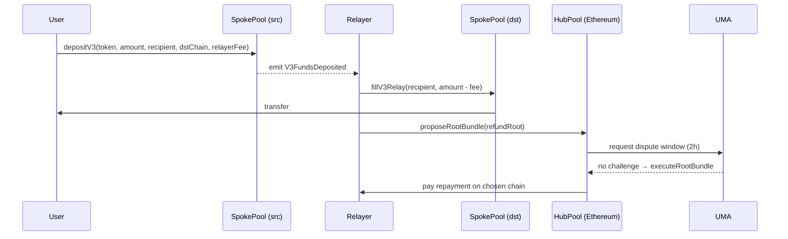

# 流动性跨链桥对比：Hop / Across / Synapse / Stargate

> **TL;DR**：本文聚焦"**资金流动性桥**"——与 LayerZero/Wormhole 这种"通用消息协议"不同，它们的核心价值在于**让用户从 A 链几分钟内拿到 B 链资产**。四者共享一个基本思路："**链下 bonder / LP 在目标链瞬时垫付资金，稍后通过底层慢桥（canonical bridge / 消息协议）结算**"，但在信任模型、LP 抽象、结算层上各有取舍。Hop 创新 AMM-based hToken；Across 最纯粹的 intent + UMA 乐观验证；Synapse 走通用消息 + AMM 池；Stargate 是 LayerZero 官方出品的"统一流动性" token bridge。截至 2026-Q1，Across 在 L2→L1 细分领跑，Stargate 在 stablecoin 多链流动性领跑。

## 1. 背景与动机

Rollup 爆发（2021 Arbitrum/Optimism 上线）后，用户需要快速往返 L1/L2。官方 canonical bridge 的问题：
- **L2 → L1 withdraw 周期极长**：Optimistic Rollup 7 天挑战期；zkRollup 也要 1–4 小时 prove + finality。
- **canonical bridge 只支持"原生资产"**：跨链到其他 L2 需要先回 L1 中转。

用户愿意为"几分钟到账"支付小额溢价。这催生了流动性桥：

> **LP 先用自己的目标链资产垫付给用户，待慢桥消息到达后从源链拿回本金 + 费用。**

本文选取 Hop（AMM 路径）、Across（intent + optimistic）、Synapse（多链 stable 池）、Stargate（LayerZero unified pool）做横向分析，揭示"如何最小化 LP 风险 + 最大化资金效率"的设计张力。

## 2. 核心原理

### 2.1 形式化定义

令跨链转账为 $T = (\text{srcChain}, \text{dstChain}, \text{asset}, \text{amount}, \text{recipient}, \text{deadline})$。流动性桥的目标：

$$
\text{dst}.\text{balanceOf}(\text{recipient}) \mathrel{+}= \text{amount} - \text{fee}, \quad \text{with latency} \ll \text{canonical-bridge-latency}
$$

并保证 LP 最终被**无信任地结算**：

$$
\exists t': \text{src}.\text{bonder}.\text{balance}(t') \mathrel{+}= \text{amount} + \text{fee}_\text{bonder}
$$

安全关键是：*如果 bonder 在目标链作恶（转错人、提前支付），是否有机制让其无法在源链拿钱？*四种协议给出四种答案。

### 2.2 关键机制拆解

**(1) Hop：hToken + AMM**

Hop 在每条 L2 发行 `h<Token>`（如 hETH），专属 Hop 生态。流程：
- 用户在 L2-A 把 ETH 存入 Hop，Bonder 在 L2-B 立刻释放 hETH；
- L2-B 的 `h<Token>/Canonical<Token>` AMM 池（SaddleSwap）将 hETH 换成目标链原生 ETH；
- 慢桥（Hop's own bridge，内部用 optimistic 7 天）最终把 ETH 从 L2-A 送到 L2-B 偿还 Bonder 借 hETH 的债务。

不变式：Bonder 承担"7 天挑战期内 L2-A 被重组"的风险，以 `bonderFee` 补偿；用户承担 "h<Token> 与原生 Token 暂时脱锚"的滑点。

**(2) Across：Intent + UMA Optimistic Oracle**

Across 是"relayer-first"架构：
- 用户在源链 SpokePool 存款，emit `V3FundsDeposited` intent；
- **任意 Relayer** 在目标链立即把资金转给 recipient（仅赚 LP fee）；
- Relayer 自掏腰包，随后 batch 提交 repayment 请求到 HubPool（Ethereum）；
- HubPool 通过 UMA Optimistic Oracle 验证：提出 `proposeRootBundle`，2h 挑战期无人质疑即通过；
- 通过后从 Ethereum 主池给 Relayer 转账（在其选定的 repayment 链）。

不变式：Relayer 无需许可；安全依赖 UMA OO 的经济激励（提错会丢 bond）。

**(3) Synapse：通用消息 + nToken 池**

Synapse 有两条产品线：
- **Synapse Bridge（资产）**：nUSD / nETH 作为中间 LP token，在每链一个稳定币池（3pool 式）；跨链靠 Synapse Chain（自建 Cosmos SDK 链）Guardian/Tendermint 共识；
- **Synapse Messaging**：通用跨链消息，Guardian 签名 + 目标链执行。

Synapse 把资金桥与消息桥统一在自建链上，Guardian 验证。近年 Synapse Chain 转向 OP Stack L2。

**(4) Stargate：LayerZero + Unified Liquidity**

由 LayerZero Labs 出品：
- 每条链一个 USDC/USDT/ETH 池（非 Wrapped，**就是原生资产**）；
- 所有链池子共享同一"全局流动性"账本（`Credit` 与 `Debit` via LZ messages）；
- 独创 Delta 算法：保证"承诺可兑付"（若目标池不足则 srcChain 端不放行发送）。

Stargate 解决了传统多池流动性桥的"单向消耗"问题——它的 LP 是"LP 到全局流动性"，非 per-lane。

### 2.3 子机制详解

**Bonder 经济模型**（以 Hop 为例）：
$$
\text{profit} = \text{bonderFee} - \text{opportunity cost}(\text{locked} \times \text{Δt}) - \text{slippage(hToken AMM)} - \text{reorg risk insurance}
$$

**Across repayment chain 选择**：Relayer 可选任一支持链接受 repayment，节省跨链 gas。

**Synapse nUSD 套利**：nUSD 在不同链池子因为利用率不同会偏离 $1，套利者把 nUSD 从高价链搬到低价链做 arb，自动平衡池子。

**Stargate Delta**：维护 `chainPathCredit` 与 `pendingCredit`，Delta 算法每笔交易实时调整 credit 分配，防止某条链过度借贷。

### 2.4 参数与常量

| 协议 | 关键参数 | 取值 |
| --- | --- | --- |
| Hop | Bonder fee | 0.04–0.2% |
| Hop | 挑战期 | 7 天（Optimistic L2-native） |
| Across | UMA 挑战期 | 2 小时 |
| Across | Relayer fee | 动态（LP utilization + gas） |
| Synapse | Guardian 数 | 可变（约 5–10） |
| Stargate | Slippage 阈值 | 可配 |
| Stargate | 支持池 | USDC/USDT/ETH/等 |

### 2.5 边界条件与失败模式

- **Hop**：Bonder 离线 → 用户 fallback 到 canonical 7 天；Bonder 作恶释放 hToken 给非 recipient → Bonder 在源链无法 redeem（合约校验 `transferId`）。
- **Across**：Relayer 作恶 → 需要 UMA bondholder 在挑战期反驳，否则 slash；Relayer 资金不足 → 用户等 intent 被其他 relayer 接。
- **Synapse**：Guardian 作恶 → 无 RMN 类熔断，依赖链上治理发现；稳定池 depeg → 滑点暴涨。
- **Stargate**：目标池流动性枯竭 → 源链不让发送（Delta 保护）；LayerZero DVN 被攻破 → 全池风险。

### 2.6 图示

Across Intent 流程：



Hop 结构：

```
+--- L2-A ---+                       +--- L2-B ---+
| Hop Bridge | <--canonical (slow)-->| Hop Bridge |
| user→hETH  |                       | hETH→ETH   |
+-----+------+                       +-----+------+
      |  Bonder moves hETH                 |
      +---------(fast path)----------------+
                   ↓
           +-------+-------+
           | h-AMM  pool   |  (SaddleSwap style)
           +---------------+
```

## 3. 架构剖析

### 3.1 分层视图（四协议统一视角）

1. **入口层**：SpokePool（Across）/ L2AmmWrapper（Hop）/ SynapseRouter / Stargate Router
2. **Bonder/Relayer 层**：链下进程池（Hop 约 10 个 Bonder；Across permissionless）
3. **慢桥结算层**：Hop 自建消息（内部 7 天）/ Across UMA OO / Synapse Chain / LayerZero
4. **流动性层**：Hop h-AMM / Across HubPool + LP / Synapse nUSD pool / Stargate unified pool

### 3.2 核心模块清单

| 协议 | 核心合约 | 关键逻辑 | 仓库 |
| --- | --- | --- | --- |
| Hop | `L2_Bridge.sol`、`L2_AmmWrapper.sol`、`L1_Bridge.sol` | Transfer root commit | `hop-protocol/contracts-v2` |
| Hop | `SaddleSwap` | h-AMM | fork of Saddle |
| Across | `SpokePool.sol`、`HubPool.sol` | deposit / fill / propose | `across-protocol/contracts` |
| Across | `UMA OOv3` | dispute 机制 | UMAprotocol/protocol |
| Synapse | `SynapseBridge.sol`、`SwapFlashLoan.sol` | Bridge + stable AMM | `synapsecns/synapse-contracts` |
| Synapse | Synapse Chain | Guardian consensus | Cosmos SDK |
| Stargate | `StargateRouter.sol`、`Pool.sol`、`Bridge.sol` | Delta 算法 | `stargate-protocol/stargate` |
| Stargate | LayerZero Endpoint | 消息传递 | `LayerZero-v2` |

### 3.3 数据流 / 生命周期

**Across 的 L1 → Arbitrum USDC $10,000 transfer**：

1. 用户在 Ethereum SpokePool 调 `depositV3(token=USDC, inputAmount=10000e6, outputAmount=9995e6, dstChain=42161, recipient, quoteTimestamp, fillDeadline, exclusiveRelayer=0x0)`。
2. SpokePool 锁 USDC，emit `V3FundsDeposited`。
3. 多个 Relayer 竞争 fill：第一个 Relayer 调 Arbitrum `SpokePool.fillV3Relay(relayData, repaymentChainId=10)`，向 recipient 转 9995 USDC。
4. Relayer 等到下个 bundle 提交：Dataworker 收集 7 天窗口内所有 fill，生成 Merkle tree，在 HubPool `proposeRootBundle(bundle)`。
5. UMA 2h 挑战期。若无人质疑（需要 bond + 经济不合理才质疑）：任何人可 `executeRootBundle`，HubPool 在 Optimism 通过 canonical bridge 将 USDC repayment 发给 Relayer。
6. Relayer 拿到 repayment = 原垫付 + LP fee + relayer fee。

端到端：用户可见延迟 10 秒–2 分钟；Relayer 的 capital cycle 约 1–7 天。

### 3.4 客户端多样性

- Hop Bonder：TypeScript，Hop Labs 运营为主；代码 `hop-node` 开源
- Across Relayer：TypeScript（`across-relayer`），多个第三方（Bastion、Wintermute）运营
- Synapse Guardian：Synapse Chain 共识节点，Go
- Stargate 无独立 relayer（依赖 LayerZero Executor）

### 3.5 扩展接口

- **Hop**：`swapAndSend` 组合 swap + bridge
- **Across**：`depositV3` 的 `message` 字段，Cross-chain intent（2024）支持任意 calldata
- **Synapse**：RFQ 模式（新增），仿 Across intent
- **Stargate**：`lzCompose` 支持接收端二次调用（配合 LayerZero v2）

## 4. 关键代码 / 实现细节

### Across SpokePool.fillV3Relay

```solidity
// across-protocol/contracts/contracts/SpokePool.sol:L480 (v3.5)
function fillV3Relay(V3RelayData calldata relayData, uint256 repaymentChainId) external {
    bytes32 relayHash = _getV3RelayHash(relayData);
    require(relayFills[relayHash] == FillStatus.Unfilled, "already filled");
    // 1. 检查 exclusiveRelayer 或 exclusivityDeadline 已过
    _requireNotExclusive(relayData.exclusiveRelayer, relayData.exclusivityDeadline);
    // 2. 从 relayer 转账到 recipient（如带 message 则调用）
    _fillRelayV3(relayData, msg.sender, repaymentChainId);
    relayFills[relayHash] = FillStatus.Filled;
    emit FilledV3Relay(relayData, msg.sender, repaymentChainId, relayHash);
}
```

### Hop L2_Bridge.sendToL1

```solidity
// hop-protocol/contracts-v2/L2_Bridge.sol:L150
function send(uint256 chainId, address recipient, uint256 amount, uint256 bonderFee, ...) external {
    bytes32 transferId = getTransferId(chainId, recipient, amount, bonderFee, nonce, ...);
    _addToPendingAmount(chainId, amount);
    _transfer(msg.sender, address(this), amount);
    emit TransferSent(transferId, chainId, recipient, amount, ...);
    // Bonder 下一步在目标链 bondWithdrawal 释放资金
}

function commitTransfers(uint256 destinationChainId) external {
    // 打包 pending transferIds 成 Merkle root，通过慢桥提交到 L1
    ...
}
```

### Stargate Pool.delta

```solidity
// stargate-protocol/Pool.sol:L260
function sendCredits(uint16 _dstChainId, uint256 _dstPoolId) external returns (CreditObj memory c) {
    ChainPath storage cp = getAndCheckCP(_dstChainId, _dstPoolId);
    c = CreditObj(cp.balance - cp.idealBalance, cp.lkb);
    cp.lkb += c.credits; // lock known balance
    cp.balance = cp.idealBalance;
    totalLiquidity -= c.credits;
    emit SendCredits(_dstChainId, _dstPoolId, c.credits, c.idealBalance);
}
```

### Synapse SynapseBridge.redeem

```solidity
// synapsecns/synapse-contracts/SynapseBridge.sol:L95
function redeem(address to, uint256 chainId, IERC20 token, uint256 amount) external {
    token.burnFrom(msg.sender, amount);
    emit TokenRedeem(to, chainId, token, amount);
    // Synapse validators 听事件，经链上共识后在 dst 链 mint
}
```

## 5. 演进与版本对比

| 协议 | 关键里程碑 |
| --- | --- |
| Hop v1 (2021) → v2 (2024，引入 messenger 模式) |
| Across v1 (2021) → v2 (Canonical Bridger) → v3 (2023 Intent) → Atomic Intents (2024) |
| Synapse v1 AMM (2021) → Messaging (2022) → Synapse Chain (2023) → OP Stack L2 (2024) |
| Stargate v1 (2022) → v2 (2024，Hydra 架构 + Taxi/Bus 模式) |

## 6. 实战示例

**Across Intent：Mainnet → Arbitrum USDC，SDK 调用**：

```typescript
import { AcrossClient } from "@across-protocol/app-sdk";
import { createWalletClient, http } from "viem";

const client = AcrossClient.create({ integratorId: "0xMyApp", chains: [mainnet, arbitrum] });
const route = { originChainId: 1, destinationChainId: 42161, inputToken: USDC_ETH, outputToken: USDC_ARB };
const quote = await client.getQuote({ route, inputAmount: 10000_000000n });
const { deposit } = await client.executeQuote({
  walletClient, deposit: quote.deposit,
  onProgress: (p) => console.log("stage", p.step, p.status),
});
```

预期：用户钱包签 2 笔（approve + deposit），~30 秒后 Arbitrum 收到 USDC。

## 7. 安全与已知攻击

- **Hop 2022 治理 bug**：合约 admin 密钥管理改进，无资金损失。
- **Across 2021 early relayer bond**：小额测试漏洞，修复。
- **Synapse 2023 Metis 桥事件**：Metis 原生 bridge 合约漏洞（非 Synapse 直接），Synapse 用户因使用 Metis 桥受影响。
- **Stargate 2022 审计发现的 slippage 路径问题**：及时修复。
- **共性风险**：
  - Bonder/Relayer 的私钥是热钱包，是潜在攻击面
  - 慢桥（canonical / LZ / UMA）失守则流动性无法 replenish
  - LP 承担 "源链锁资产 → 长时间不 release" 的流动性风险
  - 精明 MEV：Relayer race、Bundle reorder

## 8. 与同类方案对比

| 维度 | Hop | Across | Synapse | Stargate |
| --- | --- | --- | --- | --- |
| 结算验证 | 慢 optimistic（7d） | UMA OO (2h) | Synapse Chain Guardians | LayerZero DVN |
| Bonder/Relayer 许可 | 限额白名单 | Permissionless | 限额 | 限额 |
| 中间 token | hToken | 无 | nUSD/nETH | 无（原生） |
| 支持资产 | ETH/USDC/USDT/DAI | 多（20+） | 多 | USDC/USDT/ETH/主 |
| 典型延迟 | 3–15 min | 10s–2 min | 5–15 min | 1–3 min |
| 链覆盖 | 主要 L2 + ETH | L1 + 主要 L2 | EVM 15+ | 80+ LZ 生态 |
| 费用典型 | 0.04–0.2% | 0.05–0.3% | 0.05–0.5% | 0.06% + gas |
| 适合场景 | L2↔L2 ETH | L2→L1 大额 | 稳定币多链 | USDC 多链官方 |

## 9. 延伸阅读

- Hop Docs：https://docs.hop.exchange/
- Across Docs：https://docs.across.to/
- Across v3 Intent 论文：https://github.com/across-protocol/across-docs
- Synapse Docs：https://docs.synapseprotocol.com/
- Stargate GitBook：https://stargateprotocol.gitbook.io/stargate/
- LiFi / Socket 聚合器：对比各桥路由
- 中文：登链 "Across 协议深度解读" 系列

## 10. 术语表

| 术语 | 英文 | 释义 |
| --- | --- | --- |
| 保证人 | Bonder | Hop 中垫付资金的角色 |
| 中继者 | Relayer | Across 中 permissionless 垫付者 |
| 意图 | Intent | 用户只声明目标，不指定执行路径 |
| 官方桥 | Canonical Bridge | L2 原生 rollup bridge |
| 乐观预言机 | Optimistic Oracle (UMA) | 经济挑战机制验证断言 |
| 流动性池 | LP Pool | 跨链池承载中间资产 |
| Hub-Spoke | - | Across 架构（Ethereum Hub + 各链 Spoke） |
| 统一流动性 | Unified Liquidity | Stargate 全局一份池 |

---

*Last verified: 2026-04-22*
