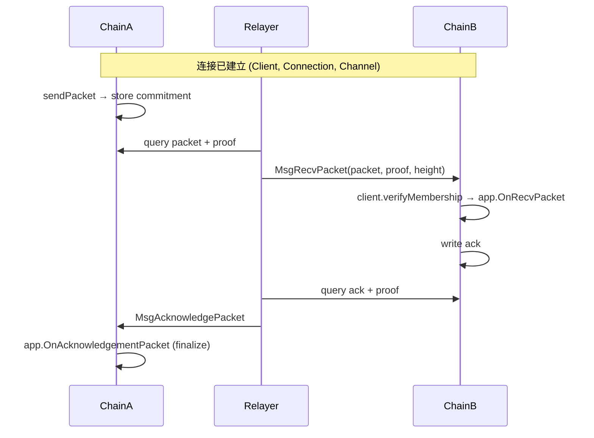

# IBC 跨链通信协议

> **TL;DR**：IBC 是 Cosmos 生态原生的跨链协议，**不依赖任何外部验证者**，完全基于目标链在自身状态中运行的"源链轻客户端"（Light Client）与 Merkle 存储证明。它被形式化为 ICS（Interchain Standards）系列规范，核心 primitives 是 **Client / Connection / Channel / Packet** 四层。IBC v2（"Eureka"）2024 年引入，简化为单通道 + 更灵活的 App 路由，并推动 IBC 扩展到 EVM（Union、Composable、Polymer）。截至 2026-Q1，IBC 连接 100+ Cosmos 链，日消息量 1M+。

## 1. 背景与动机

2016 年 Buchman & Kwon 的 Cosmos 白皮书提出"Internet of Blockchains"愿景，需要一个能在异构链间传递任意消息的协议。关键难题：**一条链怎么无信任地知道另一条链发生了什么？**

IBC 的回答：**让目标链验证源链的共识，就像以太坊轻节点验证以太坊那样**。其前置条件是源链必须：
1. 提供可被低成本验证的 finality（Tendermint BFT：2/3+1 签名一出即终局）；
2. 具备结构化状态承诺（Merkle proof of state inclusion）。

这两个前置让 IBC 天然适合 Cosmos SDK + Tendermint 家族，难以直接扩展到 PoW / PoS-finality-gadget 异构链。近年 ZK Light Client（Polymer、Union、Succinct）技术使"以太坊 → Cosmos"方向的 IBC 成为可能。

IBC 的哲学与本文其他协议形成鲜明对比：
- LayerZero/Wormhole/CCIP 都引入**外部验证者**；
- IBC 的信任域 = 源链共识 + 目标链共识，**无新增信任假设**。

## 2. 核心原理

### 2.1 形式化定义

IBC 的论文定义（ICS-2 Client Semantics）：

$$
\text{LightClient}_A^B = (\text{ClientState}, \text{ConsensusState}_h, \text{UpdateFunction}, \text{MisbehaviourFunction})
$$

即链 $B$ 上维护链 $A$ 的轻客户端：`ClientState`（chainID、trust level、unbonding period）、每个更新高度 $h$ 的 `ConsensusState`（commitment root, validator set hash）、`UpdateFunction`（验证新 header）、`MisbehaviourFunction`（处理 double-sign 欺诈证明）。

Packet commitment 验证（ICS-4）：

$$
\text{verify}(\text{ConsensusState}_h, \text{proof}, \text{path}, \text{value}) \to \{0,1\}
$$

发送方 $A$ 把 packet commitment $c = H(\text{timeoutHeight}, \text{timeoutTimestamp}, \text{data})$ 存入 $A$ 的 IBC store key `packetCommitment/{channel}/{seq}`。接收方 $B$ 通过 relayer 拿到 $A.\text{ConsensusState}_h$ 与 Merkle proof，本地验证 commitment 存在，即可 `recvPacket`。

**安全不变式**：只要 $A$ 的 2/3+1 验证者诚实，$B$ 上的 LightClient 就能拒绝所有伪造 header；即跨链消息安全性 = min(A 共识安全, B 共识安全)。

### 2.2 关键数据结构

**Packet（ICS-4）**：

```go
type Packet struct {
    Sequence           uint64
    SourcePort         string   // "transfer"
    SourceChannel      string   // "channel-0"
    DestinationPort    string
    DestinationChannel string
    Data               []byte   // application payload
    TimeoutHeight      Height   // destination chain height
    TimeoutTimestamp   uint64   // destination chain time
}
```

**ConsensusState（Tendermint client, ICS-7）**：

```go
type ConsensusState struct {
    Timestamp          time.Time
    Root               []byte   // ICS-23 commitment root (AppHash)
    NextValidatorsHash []byte
}
```

不变式：
- **Sequence per channel 单调**：防重放；
- **Timeout 双维**：区块高度 + 时间戳，避免链停机时无法 timeout；
- **ConsensusState 按 height 追加**：支持历史证明；老 state 在 `unbonding_period` 外可 pruning。

### 2.3 子机制拆解

**(1) Client 层（ICS-2 / ICS-7 / ICS-8）**
每条要互通的链在对方链上部署一个 Light Client。Tendermint Client（ICS-7）实现 `updateHeader`（验证 2/3+1 签名 + trusting period 内）、`verifyMembership`（Merkle proof）、`misbehaviour`（双签提交可 freeze client）。Solo Machine Client（ICS-6）用于单签名钱包"假装"是一条链。WASM Client（ICS-8）允许把任意 LightClient 逻辑以 WASM 字节码部署。

**(2) Connection 层（ICS-3）**
两个 Client 之间建立 Connection，四步握手：`ConnOpenInit → ConnOpenTry → ConnOpenAck → ConnOpenConfirm`，每步都需要对方的 consensus proof。一个 (ChainA, ChainB) 对可以有多条 Connection，但通常一条。

**(3) Channel 层（ICS-4）**
Channel 在 Connection 之上按"Port"划分应用通道。每 Channel 有 ordering: `ORDERED`（严格按 sequence）或 `UNORDERED`（任意顺序，只防重放）。握手同样四步。

**(4) Relayer 层（ICS-18）**
Permissionless 链下进程，监听两端 IBC 事件，拉取 packet + commitment proof 提交到对方。无信任：relayer 不能伪造（有 LightClient 验证），但可选择不 relay（审查或经济利益）。主流实现：`hermes`（Rust）、`go-relayer`（Go）、`rly`。

**(5) 应用层（ICS-20 ICS-27 ICS-29 ICS-721 等）**
- **ICS-20 Token Transfer**：带"trace path"的 IBC token，防止重复铸造同一资产；
- **ICS-27 Interchain Accounts (ICA)**：一条链在另一条链上"拥有"账户，可远程调用；
- **ICS-29 Fee Middleware**：对 relayer 付费激励；
- **ICS-721 NFT Transfer**。

**(6) 超时与原子性**
Packet 生命周期：`sendPacket → recvPacket → acknowledgePacket`，或 `sendPacket → timeoutPacket`。源链状态变化（如 token 锁定）在 `ack` / `timeout` 时才 finalize。保证要么双向成功，要么源链回滚。

### 2.4 参数与常量

| 参数 | 取值 | 说明 |
| --- | --- | --- |
| Tendermint trust level | 1/3 | ICS-7 默认（可配） |
| Trusting period | unbonding_period × 2/3 | ≤ source 链 unbonding |
| Max expected block time | 30s（典型） | timeout 容忍 |
| Packet timeout | 应用配置 | `MsgTransfer` 默认 10 min |
| Channel ordering | ORDERED/UNORDERED | 创建时定 |
| Proof spec | ICS-23 IAVL + Tendermint | 可替换 |

### 2.5 边界条件与失败模式

- **源链 2/3+ 作恶（safety break）**：可 fork 或双签；目标 client 通过 misbehaviour evidence 会 freeze，需要治理 recover。IBC 是目前极少数能在"对方链被攻击"后自动暂停的桥。
- **源链停机**：超 trusting period 后 client 过期，需治理重置。
- **Relayer 离线**：packet 停在源链直到 timeout；无资金损失。
- **Channel ordering 断流**：ORDERED channel 一旦有 packet timeout 会 close；UNORDERED 可容忍乱序。
- **应用层漏洞**：ICS-20 trace path 误解析曾导致 Gaia 短暂暂停（非资金损失）。

### 2.6 图示



ASCII 分层：

```
 ┌───────── Application (ICS-20/27/721) ─────────┐
 ├───────── Channel (ICS-4)                      │
 ├───────── Connection (ICS-3)                   │
 ├───────── Client (ICS-2/7/8)                   │
 └───────── Host (ICS-24: store, routing)        ┘
```

## 3. 架构剖析

### 3.1 分层视图

1. **应用层**：ICS-20 transfer、ICS-27 ICA、ICS-721 NFT、自定义 IBC App
2. **IBC Core**：Client / Connection / Channel / Host 模块
3. **共识 & 存储接口（ICS-23/24）**：要求 host chain 提供 provable store
4. **Relayer 层**：Hermes / go-relayer 等链下进程
5. **Cosmos SDK / Tendermint 层**：默认宿主，提供 AppHash Merkle proof

### 3.2 核心模块清单

| 模块 | 路径（`ibc-go` v8+） | 职责 | 可替换性 |
| --- | --- | --- | --- |
| `02-client` | `modules/core/02-client` | Client 生命周期 | 新增 client type 需 WASM 或源码 |
| `03-connection` | `modules/core/03-connection` | 连接握手 | 固定 |
| `04-channel` | `modules/core/04-channel` | 通道 / packet | 固定 |
| `07-tendermint` | `modules/light-clients/07-tendermint` | Tendermint Light Client | 可新增其他 |
| `08-wasm` | `modules/light-clients/08-wasm` | 可插拔 WASM client | WASM 字节码 |
| `apps/transfer` | `modules/apps/transfer` | ICS-20 | 应用可替换 |
| `apps/27-interchain-accounts` | `.../27-ica` | ICA | 应用可替换 |
| Hermes | `informalsystems/hermes` | Rust relayer | 开源，可换 |

### 3.3 数据流 / 生命周期

以 **ICS-20：ATOM 从 Cosmos Hub → Osmosis** 为例：

1. **用户（Hub）**：`MsgTransfer(source_port=transfer, source_channel=channel-141, token=100 ATOM, receiver=osmo1..., timeout_timestamp)`。
2. **Hub IBC 模块**：`transfer.OnSendPacket` 把 100 ATOM 锁入 `transfer` 模块账户，构造 `FungibleTokenPacketData{denom:"uatom", amount:"100000000", sender, receiver, memo}`，调用 core `sendPacket`，在 store key `packetCommitment/transfer/channel-141/{seq}` 写入 commit hash。
3. **Relayer（Hermes）**：监听 `SendPacket` 事件，从 Hub 取 Merkle proof（证明 commitment 存在于 AppHash），同时取 Hub 当前 header；调用 Osmosis `UpdateClient(hub_header)` 与 `RecvPacket(packet, proof, height)`。
4. **Osmosis IBC core**：client.verifyMembership 用存储的 Hub `ConsensusState.Root` + proof + commitment 比对，通过则调用 app `OnRecvPacket`。
5. **Osmosis transfer 应用**：按 trace path `transfer/channel-0/uatom` 铸造 `ibc/27394F...`（denom hash），发给 receiver；写 ack。
6. **反向 ack**：Relayer 把 ack + proof 送回 Hub，调用 `acknowledgePacket`，若 success 则 Hub 侧清除 commitment；若 ack=error 或 timeout，Hub 侧退款。
7. **可观测**：`mintscan.io/cosmos/relayers` 显示每通道 relayer 实时状态；IBC events 在 Tendermint RPC 可订阅。

典型延迟：Hub ↔ Osmosis 5–15 秒（取决于 relayer 批处理）；成本 = 双端 gas，通常 < $0.05。

### 3.4 客户端多样性 / 参考实现

- **ibc-go（Go）**：Cosmos SDK 主实现，绝大多数 Cosmos 链使用
- **ibc-rs / hermes（Rust）**：主流 relayer
- **ibc-proto** 语言独立
- **Polymer、Union**：把 IBC 扩展到 EVM 的 ZK Light Client 实现
- **Composable**：IBC on Polkadot (Substrate pallet)
- **Nomic / Sifchain**：把 Bitcoin 作为 peg-zone 接入 IBC

### 3.5 扩展 / 互操作接口

- **ICS-30 Middleware**：packet pipeline 中间件（如 ICS-29 fee）
- **Packet Forward Middleware**：A → B → C 自动路由
- **Router Module**：多 App 共享同 port
- **IBC v2 / Eureka**：2024 推出，简化握手、引入 IBC Apps v2 统一 packet handler、跨 VM Light Client 支持（ZK + WASM）
- **EVM 接入**：Polymer 作为 L2 把 IBC 带到 EVM；Union 提供 ZK client

## 4. 关键代码 / 实现细节

`ibc-go` tag `v8.3.0`。

**sendPacket 核心**：

```go
// modules/core/04-channel/keeper/packet.go:~L45
func (k Keeper) SendPacket(
    ctx sdk.Context,
    chanCap *capabilitytypes.Capability,
    sourcePort, sourceChannel string,
    timeoutHeight clienttypes.Height, timeoutTimestamp uint64,
    data []byte,
) (uint64, error) {
    channel, _ := k.GetChannel(ctx, sourcePort, sourceChannel)
    sequence, _ := k.GetNextSequenceSend(ctx, sourcePort, sourceChannel)
    packet := types.NewPacket(data, sequence, sourcePort, sourceChannel,
        channel.Counterparty.PortId, channel.Counterparty.ChannelId,
        timeoutHeight, timeoutTimestamp)
    commitment := types.CommitPacket(k.cdc, packet)
    k.SetPacketCommitment(ctx, sourcePort, sourceChannel, sequence, commitment)
    k.SetNextSequenceSend(ctx, sourcePort, sourceChannel, sequence+1)
    emitSendPacketEvent(ctx, packet, channel, timeoutHeight)
    return sequence, nil
}
```

**recvPacket 核心**：

```go
// .../packet.go:~L180
func (k Keeper) RecvPacket(
    ctx sdk.Context, chanCap *capabilitytypes.Capability,
    packet exported.PacketI, proof []byte, proofHeight exported.Height,
) error {
    // 1. 校验 channel 状态
    channel, _ := k.GetChannel(ctx, packet.GetDestPort(), packet.GetDestChannel())
    // 2. 校验 timeout
    if packet.GetTimeoutHeight().LT(ctx.BlockHeight()) { return types.ErrPacketTimeout }
    // 3. 通过 light client 验证 commitment proof
    commitment := types.CommitPacket(k.cdc, packet)
    if err := k.connectionKeeper.VerifyPacketCommitment(
        ctx, connection, proofHeight, proof,
        packet.GetSourcePort(), packet.GetSourceChannel(), packet.GetSequence(),
        commitment,
    ); err != nil { return err }
    // 4. 防重放 (UNORDERED: receipts; ORDERED: nextSequenceRecv)
    _ = k.SetPacketReceipt(ctx, packet.GetDestPort(), packet.GetDestChannel(), packet.GetSequence())
    return nil
}
```

**Tendermint Light Client 更新（ICS-7）**：

```go
// modules/light-clients/07-tendermint/update.go:~L40
func (cs ClientState) CheckForMisbehaviour(ctx sdk.Context, cdc codec.BinaryCodec, clientStore sdk.KVStore, msg exported.ClientMessage) bool {
    // double-sign / conflicting headers → freeze
    switch msg := msg.(type) {
    case *Header:
        conflicting, _ := GetConsensusState(clientStore, cdc, msg.GetHeight())
        if conflicting != nil && !bytes.Equal(conflicting.Root, msg.Header.AppHash) { return true }
    case *Misbehaviour:
        return true
    }
    return false
}
```

> 省略：Connection handshake、Capability 隔离、ICS-23 IAVL proof 细节。

## 5. 演进与版本对比

| 版本 | 时间 | 关键变化 |
| --- | --- | --- |
| IBC spec 1.0 | 2019 | ICS 定稿 |
| ibc-go v1 | 2021-03 | Stargate upgrade 后激活主网 |
| ICS-27 ICA | 2022 | 跨链账户 |
| v7 | 2023 | Capability 简化、Light Client Wasm |
| v8 | 2024 | 多 recv callback、PFM merged |
| IBC v2 "Eureka" | 2024 Q4 | 简化握手 / cross-VM / EVM 扩展 |

## 6. 实战示例

**用 hermes 在本地 testnet 跑一对 IBC**：

```bash
# 启动两条 gaia chain
gaiad init hub1 --chain-id hub1
gaiad init osmo1 --chain-id osmo1
gaiad start --home ./hub1 &
gaiad start --home ./osmo1 --p2p.laddr tcp://0.0.0.0:26756 &

# 配置 hermes
cat > ~/.hermes/config.toml <<EOF
[[chains]]
id = "hub1"
rpc_addr = "http://127.0.0.1:26657"
...
[[chains]]
id = "osmo1"
rpc_addr = "http://127.0.0.1:26756"
...
EOF

# 创建 client / connection / channel
hermes create client --host-chain hub1 --reference-chain osmo1
hermes create connection --a-chain hub1 --b-chain osmo1
hermes create channel --a-chain hub1 --a-connection connection-0 \
  --a-port transfer --b-port transfer

# 启动 relay
hermes start

# 发送 token
gaiad tx ibc-transfer transfer transfer channel-0 \
  osmo1xxx 100uatom --from alice --chain-id hub1
```

预期：Osmosis 端 5s 内出现 `ibc/<hash>` 代币；`gaiad q ibc channel packet-commitments` 无残留。

## 7. 安全与已知攻击

- **Dragonberry 漏洞 (2022-10)**：`ibc-go` ICS-23 proof 校验逻辑 bug，理论可伪造 packet；在被利用前由 Jump 白帽披露，所有 Cosmos 链协调升级（"Dragonberry 升级"），**无资金损失**。
- **Dragonfruit / Huckleberry**：后续小型 bug 均在未利用前修复。
- **ICS-20 同源 denom collision**：早期版本 trace path 误解析，Gaia 曾短暂暂停 transfer 模块。
- **Relayer 审查**：虽不影响资金安全，但可拖慢消息；ICS-29 fee middleware 部分缓解。
- **Light Client 过期攻击**：若源链 down > trusting_period，client 需治理 recover；这不是"攻击"但是可用性风险。
- **合作链低质量验证者**：IBC 安全性 = min(双链共识)，连接一条低 stake 链等于引入其共识风险。

## 8. 与同类方案对比

| 维度 | IBC | LayerZero | Wormhole | Axelar | CCIP |
| --- | --- | --- | --- | --- | --- |
| 信任假设 | 无外部 | DVN 可配 | Guardian | PoS validators | DON + RMN |
| 对源链要求 | 必须有快速 finality + Merkle store | 无 | 无 | 无 | 无 |
| 链覆盖 | Cosmos 100+，扩展 EVM | 80+ | 35+ | 65+ | 15+ |
| 延迟 | 秒级 | 分钟 | 15–30 min | 分钟 | 10–20 min |
| Relayer 模型 | permissionless + ICS-29 fee | Executor 私有 | 第三方 | Axelar 签约 | Chainlink 运营 |
| 消息回滚 | 自动 timeout | 无 | 无 | 无 | 无 |
| 代币激励 | ATOM 无必要 | ZRO | W | AXL | LINK |

## 9. 延伸阅读

- ICS 规范：https://github.com/cosmos/ibc
- ibc-go：https://github.com/cosmos/ibc-go
- Hermes：https://hermes.informal.systems/
- 论文："IBC: Secure, Minimal, and Permissionless" (2022)
- Polymer 白皮书
- 中文：Cosmos 中文社区 "IBC 协议详解"
- 视频：Interchain Foundation "Deep Dive on IBC"

## 10. 术语表

| 术语 | 英文 | 释义 |
| --- | --- | --- |
| 轻客户端 | Light Client | 目标链上验证源链共识的模块 |
| 连接 | Connection | 两个 client 间握手建立的通道集合 |
| 通道 | Channel | 应用级消息通道（ORDERED/UNORDERED） |
| 包 | Packet | 跨链消息单元 |
| 端口 | Port | 应用标识符（"transfer" 等） |
| 承诺 | Commitment | Merkle 证明所需的 hash |
| 跨链账户 | ICA (ICS-27) | 一链在另一链的远程账户 |
| 代币追踪路径 | Trace Path | ICS-20 denom 防重复铸造 |

---

*Last verified: 2026-04-22*
