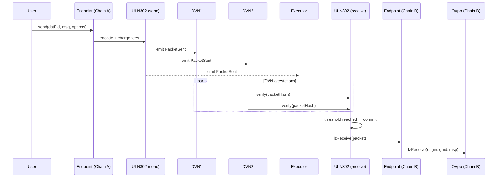

# LayerZero 全链互操作协议

> **TL;DR**：LayerZero 是一个轻量级的"消息透传（omnichain messaging）"协议，核心思想是把"**验证（Verification）**"与"**执行（Execution）**"解耦，并把验证委托给一组可配置的 **DVN（Decentralized Verifier Network）**，应用层（OApp/OFT）以合约方式"按需组装"自己的安全栈。v1 采用"Oracle + Relayer"双独立实体假设（ULN v1），v2 统一为 DVN 抽象并引入 X-of-Y-of-N 阈值、Executor 分离、Message Library 可升级等特性。截至 2026 Q1，LayerZero 已部署到 80+ 条链，是 EVM 生态最常用的跨链消息协议之一。

## 1. 背景与动机

跨链协议可按"谁来证明源链已经发生了一笔事件"划分为四类：
1. **原生验证（Native Verification）**：目标链运行源链的轻客户端，典型是 Cosmos IBC。安全性最高，但每对链都要写、部署并维护 Light Client，工程成本极高，尤其在共识不同（PoW vs PoS vs BFT）的链之间几乎不可行。
2. **外部验证（External Verification）**：引入一组独立验证人（Guardians、Orchestrators、MPC 组）对消息签名，典型是 Wormhole、Axelar、Multichain。可在异构链间复用，但把信任集中到一组外部实体，历史上发生过 Wormhole $325M、Multichain $125M 等事件。
3. **乐观验证（Optimistic）**：消息先执行后挑战，典型是 Nomad、早期 Across。延迟高（挑战期通常 30 分钟–7 天）。
4. **混合（Hybrid / Modular）**：把"谁验证"做成可插拔模块，让应用方按自身风险偏好组装验证集。

LayerZero（2022）属于第 4 类，但走得更远：它不强制应用方使用官方默认验证器，而是把"验证策略"作为 OApp 合约的配置项暴露，让 Stargate、PancakeSwap、Ethena 等可选择"Google Cloud + Polyhedra + LayerZero Labs"等任意 DVN 组合。这种"把信任最小化决策交给应用"的设计，是对"跨链桥作为单一共享 TCB（可信计算基）"范式的直接反抗，也是理解 v2 DVN 机制的出发点。

## 2. 核心原理

### 2.1 形式化定义

设源链 $A$、目标链 $B$。应用在 $A$ 上调用 `endpoint.send(dstEid, message, options)`，其中 $\text{dstEid}$ 为目标链 Endpoint ID。协议需要在 $B$ 上保证：

$$
\text{deliver}_B(\text{sender}_A, \text{nonce}, \text{message}) \iff \text{committed}_A(\text{sender}_A, \text{nonce}, \text{message}) \land \text{verified}(\text{DVNSet})
$$

其中 $\text{verified}(\text{DVNSet})$ 定义为：

$$
\left| \{ d \in \text{RequiredDVNs} : d.\text{attested}(\text{packet}) \} \right| = |\text{RequiredDVNs}| \land \left| \{ d \in \text{OptionalDVNs} : d.\text{attested}(\text{packet}) \} \right| \ge k
$$

这就是 **X-of-Y-of-N** 阈值模型：必选 DVN 必须全部签名，可选 DVN 至少 $k$ 个签名。应用通过 `setConfig` 选定 $(\text{RequiredDVNs}, \text{OptionalDVNs}, k)$。

**安全不变式**：若 RequiredDVNs 中任一诚实且 OptionalDVNs 中诚实成员 $> |\text{Optional}| - k$，则攻击者无法在 $B$ 上伪造已 commit 的消息。最差情况下，应用可配置"1 of 1"（只信任一个 DVN），此时退化为中心化桥；最严苛可配置"3 of 3 + 5 of 10"，把合谋门槛推到近乎 IBC 级别。

### 2.2 关键数据结构：Packet 与 GUID

LayerZero v2 的跨链消息单位是 **Packet**：

```solidity
struct Packet {
    uint64  nonce;       // 源→目标的单调递增序号（per sender-receiver pair）
    uint32  srcEid;      // 源 Endpoint ID
    address sender;      // 源链发送合约
    uint32  dstEid;      // 目标 Endpoint ID
    bytes32 receiver;    // 目标链接收合约（bytes32 以兼容非 EVM）
    bytes32 guid;        // 全局唯一 ID = keccak256(nonce, srcEid, sender, dstEid, receiver)
    bytes   message;     // 应用层 payload
}
```

不变式：
- **GUID 全局唯一**：防止重放，$B$ 的 Endpoint 维护已消费 GUID 集合。
- **Nonce 严格递增**：默认"有序通道"语义；v2 引入 **lzCompose** 与 **lazy nonce** 允许无序执行。
- **sender/receiver 使用 bytes32**：为 Solana / Aptos / Move 系统预留地址宽度。

### 2.3 子机制拆解

**(1) Endpoint（永不升级的入口）**
每条链上只部署一份 Endpoint 合约（例如 Ethereum 主网 v2 Endpoint 为 `0x1a44076050125825900e736c501f859c50fE728c`）。它暴露 `send/lzReceive/quote` 等接口，是唯一的"信任根"。**Endpoint 合约刻意设计为不可升级**，所有逻辑变更通过替换下游 Message Library 完成。

**(2) Message Library（可插拔 ULN）**
Endpoint 把"打包/解包"委托给 Message Library。v2 默认 ULN302（Ultra Light Node v3）负责 **发送侧的付费、排队** 与 **接收侧的 DVN 阈值校验**。应用可通过 `endpoint.setSendLibrary / setReceiveLibrary` 指定自己的 Library，甚至编写私有 Library。

**(3) DVN（去中心化验证网络）**
DVN 在 v1"Oracle + Relayer"模型基础上统一抽象：任何能"读取源链状态、在目标链签名 attest"的实体都可注册为 DVN。DVN 不移动资金，只 attest `hash(Packet)`。常见 DVN：LayerZero Labs、Google Cloud、Polyhedra（zkBridge）、Nethermind、Animoca、P2P.org。每个 DVN 独立部署自己的链下 worker + 目标链 Verifier 合约。

**(4) Executor（执行者）**
DVN 只负责"签名说消息合法"，但不触发合约调用。Executor 监听已达成阈值的 Packet，在目标链调用 `endpoint.lzReceive`。Executor 把 gas 费用报价嵌在源链 `quote` 返回值中，用户在源链一次性预付。这种"验证 vs 执行"解耦防止了 v1 中 Relayer 兼任两角导致的审查攻击。

**(5) Options（执行参数）**
源链调用 `send` 时传入 `options` bytes，编码 `lzReceiveGas`、`nativeDrop`（向目标地址空投 gas token）、`compose`（链式调用）等。Executor 必须按 Options 中声明的 gas 执行，否则事务可被任何人"replayable revert"。

**(6) 费用市场**
总费用 = $\sum \text{DVN.fee}(\text{Packet}) + \text{Executor.fee}(\text{Options}) + \text{protocolFee}$（v2 目前 `protocolFee = 0`）。源链一次性收取原生代币，Endpoint 负责结算。

### 2.4 关键参数与常量

| 参数 | 取值 | 出处 / 可治理 |
| --- | --- | --- |
| Endpoint 地址 | 每链 1 个 | 不可升级 |
| 默认 ULN | ULN302 | 可替换（应用级） |
| DVN 阈值 (X, N) | 应用配置 | 通过 `setConfig` |
| Nonce 类型 | uint64 | 硬编码 |
| Confirmations | 源链配置 | 应用级，默认 15（Ethereum） |
| Executor 超时 | 无硬性；超时后任何地址可 `lzReceive` | ULN 允许 |
| Packet size 上限 | 10000 bytes 建议 | Executor gas 决定 |

### 2.5 边界条件与失败模式

- **DVN 全部离线 / 拒绝签名**：消息无法完成 verification，Packet 永久 pending，应用层可配置"fallback DVN set"。
- **Executor 离线但 DVN 已 attest**：任何第三方可在目标链手动调用 `endpoint.lzReceive` 推进（称为 "commit + deliver" 分离）。
- **源链重组**：DVN 在 `Confirmations` 个区块后才 attest，若重组深度超过 Confirmations，可能产生"幽灵消息"。应用应结合目标链的幂等逻辑处理。
- **目标链卡死（如 Solana 停机）**：消息在 Ethereum 侧已 commit，但目标不可达；待链恢复后 Executor 会自动重试。
- **合谋攻击**：若所有 Required DVN 被攻破，协议无额外防护；这是 LayerZero"可配置信任"的代价。

### 2.6 图示



ASCII 结构图：

```
+---------------------+         +----------------------+
|    Chain A (源)     |         |    Chain B (目标)    |
|  +---------------+  |  DVNs   |  +----------------+  |
|  |  OApp.send()  |  | -----→  |  | Verifier (DVN) |  |
|  +-------+-------+  |  Exec   |  +--------+-------+  |
|          ↓          | ------→ |           ↓          |
|  +---------------+  |         |  +----------------+  |
|  |  Endpoint (A) |  |         |  |  Endpoint (B)  |  |
|  |   + ULN302    |  |         |  |   + ULN302     |  |
|  +---------------+  |         |  +--------+-------+  |
+---------------------+         |           ↓          |
                                |  +----------------+  |
                                |  |   OApp.lzRecv  |  |
                                |  +----------------+  |
                                +----------------------+
```

## 3. 架构剖析

### 3.1 分层视图

LayerZero v2 协议栈自顶向下：

1. **应用层（OApp / OFT / ONFT）**：业务合约继承 `OApp`/`OFT` 基类，调用 `_lzSend` 发送、覆写 `_lzReceive` 处理消息。
2. **Endpoint 层**：每链唯一、不可升级的"信任入口"。
3. **Message Library 层（ULN）**：Packet 编码、费用收取、DVN 阈值管理。可按 OApp 粒度替换。
4. **DVN / Executor 层**：链下 workers + 目标链 Verifier/Executor 合约。
5. **P2P / 链下层**：DVN 各自维护的监听节点，通过各自选定的方式读源链（RPC / Light Client / ZK Prover）。

### 3.2 核心模块清单

| 模块 | 路径（LayerZero-v2 monorepo） | 职责 | 可替换性 |
| --- | --- | --- | --- |
| EndpointV2 | `packages/layerzero-v2/evm/protocol/contracts/EndpointV2.sol` | 入口合约、nonce 管理、library 路由 | 不可升级 |
| MessageLibManager | 同上 `/MessageLibManager.sol` | per-OApp 指定 send/recv library | 固定逻辑 |
| SendUln302 | `/messagelib/uln/uln302/SendUln302.sol` | 发送侧打包、DVN 费用汇总 | 可替换 |
| ReceiveUln302 | `/messagelib/uln/uln302/ReceiveUln302.sol` | 接收侧 DVN 阈值校验 | 可替换 |
| DVN | `/messagelib/uln/dvn/DVN.sol` | DVN attest 合约模板 | 应用可自选 |
| Executor | `/messagelib/worker/Executor.sol` | 接收侧调用 lzReceive | 应用可自选 |
| OApp | `packages/layerzero-v2/evm/oapp/contracts/oapp/OApp.sol` | 应用基类 | 用户继承 |
| OFT | `/oapp/contracts/oft/OFT.sol` | 全链原生代币标准 | 用户继承 |
| PriceFeed | `/messagelib/worker/PriceFeed.sol` | 目标链 gas 报价 | 可替换 |

### 3.3 数据流 / 生命周期

以 **OFT 从 Ethereum → Arbitrum** 为例，逐跳追踪：

1. **用户侧**：调用 `OFT.send(sendParam, fee, refund)`。OFT 合约先 `_debit`（销毁或锁定），再调用 `_lzSend`。
2. **Endpoint.send**：写入 `outboundNonce`，emit `PacketSent`，把费用转给 SendLibrary。
3. **SendUln302**：按 OApp 配置读取 DVN 列表，向 `PriceFeed` 查询 Executor 报价，结算费用给各 Worker。
4. **DVN workers（链下）**：监听 `PacketSent` 事件，等待 `Confirmations`（如 15 块）后，读取事件数据计算 `packetHash`，调用目标链 `ReceiveUln302.commitVerification(packetHeader, payloadHash)`。
5. **ReceiveUln302**：维护 `hashLookup[packetHash][dvn]`，当 Required 全部满足且 Optional 达 X-of-N 时，标记为"可 commit"。
6. **Executor（链下）**：监听阈值达成事件，调用 `EndpointB.lzReceive(origin, receiver, guid, msg, extraData)`。
7. **EndpointB**：校验 nonce、GUID 未消费，调用 OApp 的 `lzReceive`，OApp 执行 `_credit`（铸造或解锁）。
8. **可观测性**：每步均 emit 事件，LayerZero Scan 作为前端聚合；DVN 配置可通过 `endpoint.getConfig()` 查询。

端到端延迟典型值：Ethereum → Arbitrum 约 2–4 分钟（主要是 15 块 finality + DVN 签名 + Executor 上链），成本约 $0.5–$3 取决于 DVN 数量。

### 3.4 实现多样性

- **EVM 实现**：`LayerZero-v2/packages/layerzero-v2/evm`（Solidity，官方）
- **Solana 实现**：`LayerZero-v2/packages/layerzero-v2/solana`（Anchor framework）
- **Aptos / Sui / TON 实现**：各自 Move / FunC 原生实现，语义对齐
- **DVN 参考实现**：LayerZero Labs Go workers 未开源；Polyhedra 提供基于 zkBridge 的 DVN 实现（开源）；Nethermind DVN 用 Rust

### 3.5 扩展 / 互操作接口

- **OApp 标准**：应用合约继承接口（send/lzReceive/setPeer/setConfig）
- **OFT 标准**：全链 ERC-20，兼容 `IERC20` 接口
- **DVN 适配器**：任何外部验证网络（Wormhole、Axelar、CCIP、Hyperlane）都可被封装成 DVN；LayerZero Labs 官方提供 Wormhole DVN
- **Hyperlane ISM 类比**：LayerZero 的 DVN 抽象与 Hyperlane 的 ISM 在理念上等价
- **版本兼容**：v1 与 v2 endpoint 分别独立部署，不互通；迁移需应用重新部署为 OApp（而非 v1 的 UserApplication）

## 4. 关键代码 / 实现细节

参考 `LayerZero-Labs/LayerZero-v2`，tag `v2.3.x`，commit 见各文件。

发送核心（精简版，省略 fee 处理）：

```solidity
// EndpointV2.sol:L189 (approx, v2.3)
function send(
    MessagingParams calldata _params,
    address _refundAddress
) external payable returns (MessagingReceipt memory) {
    // 1. 取出该 OApp 的 sendLibrary（未配置则用默认）
    address lib = getSendLibrary(msg.sender, _params.dstEid);
    // 2. 生成全局 nonce
    uint64 nonce = ++outboundNonce[msg.sender][_params.dstEid][_params.receiver];
    // 3. 构造 Packet
    Packet memory packet = Packet({
        nonce: nonce,
        srcEid: eid,
        sender: msg.sender,
        dstEid: _params.dstEid,
        receiver: _params.receiver,
        guid: GUID.generate(nonce, eid, msg.sender, _params.dstEid, _params.receiver),
        message: _params.message
    });
    // 4. 委托 Library 完成付费 + 事件
    (MessagingFee memory fee, bytes memory encoded, bytes memory options)
        = ISendLib(lib).send(packet, _params.options, _params.payInLzToken);
    emit PacketSent(encoded, options, lib);
    // 5. refund 多付的 native
    _handleFee(fee, msg.value, _refundAddress, _params.payInLzToken);
    return MessagingReceipt(packet.guid, nonce, fee);
}
```

接收核心：

```solidity
// EndpointV2.sol:L245 (approx)
function lzReceive(
    Origin calldata _origin,
    address _receiver,
    bytes32 _guid,
    bytes calldata _message,
    bytes calldata _extraData
) external payable {
    // 1. 校验 nonce 严格递增（默认通道语义）
    _clearPayload(_receiver, _origin.srcEid, _origin.sender, _origin.nonce, _guid);
    // 2. 调用应用实现
    ILayerZeroReceiver(_receiver).lzReceive{ value: msg.value }(
        _origin, _guid, _message, msg.sender, _extraData
    );
    emit PacketDelivered(_origin, _receiver);
}
```

DVN 验证（ReceiveUln302 关键逻辑）：

```solidity
// ReceiveUln302.sol:L118 (approx)
function commitVerification(bytes calldata _packetHeader, bytes32 _payloadHash)
    external
{
    // 1. 解 header 取得 OApp 配置
    UlnConfig memory cfg = getUlnConfig(receiver, _packetHeader.srcEid());
    // 2. 写入当前 DVN 的 attestation
    hashLookup[headerHash][_payloadHash][msg.sender] = Verification({ submitted: true, confirmations: block.number });
    // 3. 检查 required + optional 阈值
    require(_checkVerifiable(cfg, headerHash, _payloadHash), "DVN: threshold not met");
    // 4. commit 到 Endpoint（把 payloadHash 写入 Endpoint，允许后续 lzReceive）
    EndpointV2(endpoint).verify(_origin, receiver, _payloadHash);
}
```

> 省略：fee splitting、DVN fee 分发、execute 端重试、Compose 链式调用。完整逻辑见 `packages/layerzero-v2/evm/messagelib/uln/uln302/ReceiveUln302.sol`。

## 5. 演进与版本对比

| 版本 | 发布时间 | 关键变化 | 对外部影响 |
| --- | --- | --- | --- |
| v1 (ULN v1) | 2022-03 | Oracle + Relayer 双方独立实体（二者合谋即破防） | 应用使用 `lzReceive`，2-party 假设 |
| v1.1 | 2022 Q4 | Pre-Crime 事前模拟 | 防止恶意 payload 被执行 |
| v2 (ULN v2/v3) | 2024-01 | 统一为 DVN，X-of-Y-of-N 阈值；Executor 分离；Endpoint 不可升级 | 应用迁移为 OApp；必须显式配置 DVN 集 |
| v2 + zkDVN | 2024 Q2 | Polyhedra、Succinct 等提供 zk-based DVN | 无需信任假设的 attestation |
| v2 + ABA | 2024 Q3 | A→B→A 链式调用（compose） | 支持复杂跨链交互 |

## 6. 实战示例

**最小 OApp：Ethereum Sepolia → Arbitrum Sepolia 发送字符串**

合约：

```solidity
// contracts/MyOApp.sol
pragma solidity ^0.8.22;
import { OApp, Origin, MessagingFee } from "@layerzerolabs/oapp-evm/contracts/oapp/OApp.sol";

contract MyOApp is OApp {
    string public lastMessage;

    constructor(address _endpoint, address _owner) OApp(_endpoint, _owner) {}

    function send(uint32 _dstEid, string calldata _message, bytes calldata _options) external payable {
        bytes memory payload = abi.encode(_message);
        _lzSend(_dstEid, payload, _options, MessagingFee(msg.value, 0), payable(msg.sender));
    }

    function _lzReceive(Origin calldata, bytes32, bytes calldata _message, address, bytes calldata) internal override {
        lastMessage = abi.decode(_message, (string));
    }
}
```

部署与配置（hardhat + `@layerzerolabs/toolbox-hardhat`）：

```bash
# 1. 部署两端
npx hardhat lz:deploy --tags MyOApp --networks ethereum-sepolia,arbitrum-sepolia

# 2. 通过 peers 互相授权
npx hardhat lz:oapp:wire --oapp-config layerzero.config.ts

# 3. 发送消息（使用 sdk）
npx hardhat lz:oapp:send \
  --src ethereum-sepolia --dst arbitrum-sepolia \
  --message "hello"
```

预期：约 2–3 分钟后，可在 LayerZero Scan 上看到 GUID，目标合约 `lastMessage() == "hello"`。

## 7. 安全与已知攻击

- **Sonne Finance 事件（2024-05）**：非 LayerZero 协议漏洞，而是其上构建的借贷协议合约漏洞；说明"LayerZero 安全≠应用安全"。
- **配置错配风险**：若应用部署时未显式 `setConfig`，使用默认 1-of-1（LayerZero Labs DVN），属于单点信任。**Stargate、PancakeSwap 等主流 OApp 均已迁移至 2-of-3 DVN**。
- **Pre-Crime（主动防御）**：LayerZero Labs DVN 会模拟执行 `lzReceive`，若目标合约 revert 或触发黑名单则拒绝 attest。但 Pre-Crime 只能由特定 DVN 实现，不是协议强制。
- **理论攻击面**：Required DVN 全部被攻破；Executor 拒绝执行（用户自救：任何地址可调用 `lzReceive`）；目标链共识被攻击（不属于 LayerZero 范畴）。
- **审计**：Zellic、OpenZeppelin、Trail of Bits 均审计过 v2；报告见 `LayerZero-v2/audit` 目录。

## 8. 与同类方案对比

| 维度 | LayerZero v2 | Wormhole | Axelar | Chainlink CCIP | IBC |
| --- | --- | --- | --- | --- | --- |
| 验证模型 | 应用可配 DVN (X-of-Y-of-N) | 19 Guardian 13/19 | Tendermint 验证者集 | DON + RMN 双委员会 | Light Client |
| 信任假设 | 应用自选 | 外部 PoA | 外部 PoS | 外部 PoS + 风控 | 无需外部信任 |
| 覆盖链 | 80+ | 35+ | 65+ | 15+ | Cosmos 系 100+ |
| 费用模型 | DVN + Executor 拆分 | Guardian 打包 | 原生 gas 代付 | 链下执行固定费 | Relayer 市场 |
| 非 EVM 支持 | Solana/Sui/Aptos/TON | Solana/Sui/Aptos/Algorand | Sui/Stellar | 主要 EVM | 100+ Cosmos 链 |
| 治理 | LayerZero DAO (ZRO) | Wormhole DAO (W) | AXL 治理 | Chainlink 治理 | 链级治理 |

## 9. 延伸阅读

- **官方 Docs**：https://docs.layerzero.network/v2
- **白皮书 v2.0.1**：https://layerzero.network/publications/LayerZero_Whitepaper_V2.0.1.pdf
- **V2 monorepo**：https://github.com/LayerZero-Labs/LayerZero-v2
- **DevTools**：https://github.com/LayerZero-Labs/devtools
- **Connext 创始人 Arjun 对比分析**：a16z Crypto 博客"Cross-chain messaging in 2024"
- **研究论文**：Zellic / Trail of Bits Audit Report (2024)
- **中文**：登链社区"LayerZero v2 DVN 工作原理详解"

## 10. 术语表

| 术语 | 英文 | 释义 |
| --- | --- | --- |
| 端点 | Endpoint | 每条链唯一不可升级的消息入口合约 |
| 超轻节点 | ULN (Ultra Light Node) | 默认 Message Library 实现 |
| 去中心化验证网络 | DVN (Decentralized Verifier Network) | attest Packet hash 的外部实体 |
| 执行者 | Executor | 把已验证消息在目标链上链的链下服务 |
| 应用 | OApp / OFT / ONFT | LayerZero 原生应用基类 |
| 包 | Packet | 跨链消息单元，含 nonce/guid/payload |
| 全局唯一 ID | GUID | keccak256(nonce, eids, sender, receiver) |
| 端点 ID | EID (Endpoint ID) | LayerZero 自定义链标识（≠chainId） |

---

*Last verified: 2026-04-22*
