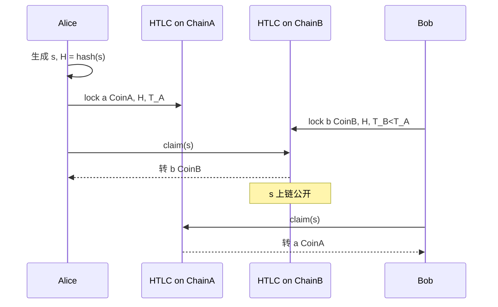

# 跨链协议原理：HTLC、Relay、Light Client、原子交换

> **TL;DR**：本篇覆盖**历史上最早也最基础的三类 trustless 跨链原语**：**HTLC (Hash Time-Locked Contract)** 用哈希锁 + 时间锁实现无信任原子交换，是 Lightning Network 与早期 "atomic swap" 的核心；**Relay** 是"把源链区块头连同 Merkle proof 搬到目的链合约里重新校验"的模式，BTC Relay (2016) 是始祖；**Light Client**（又称 On-chain Light Client）是 Relay 的泛化形式——在目的链内保存源链的共识状态机并逐块推进，IBC 的 Tendermint client 即典范。这三类原语奠定了"**数学/密码学信任 > 多签信任**"的路线，是当今 zkBridge、IBC、Rainbow Bridge 的理论基石。

---

## 1. 背景与动机

2012–2013 年，Bitcoin 社区讨论"不同链之间如何做无信任换币"。Tier Nolan 2013-05-02 在 [bitcointalk](https://bitcointalk.org/index.php?topic=193281.0) 发帖定义了**原子交换 (Atomic Swap)** 协议——两方在两条不同链上互换币种，要么同时成功，要么同时作废，无需第三方。2015 年 Decred 团队首次做了 DCR↔BTC 主网原子交换。HTLC 成为标准原语，并在 **Lightning Network 白皮书（Poon & Dryja 2015）** 成为路由核心。

2016 年 Joseph Chow、Vitalik 等人在 Ethereum 上部署 [BTC Relay](https://github.com/ethereum/btcrelay)：把 Bitcoin 区块头实时中继到 Ethereum，Ethereum 合约内可验证 BTC 交易 Merkle proof——**第一个 on-chain light client**。2019 年 Cosmos 团队发布 **IBC (Inter-Blockchain Communication)** 规范，将"两条链各自维护对方 light client"的模式工程化、通用化。

**动机**：多签桥虽易部署但安全上限低；Light Client + HTLC 的组合给出"安全性 = 源链共识安全"的理论上界。代价是 Gas 与实现复杂度。2022 年桥集体被黑后，行业重新重视这些"更慢但更安全"的原语；ZK 的引入使"高 gas"问题逐步消解。

## 2. 核心原理

### 2.1 形式化定义

**HTLC 形式化**：两个参与方 Alice、Bob，在链 A、B 上各自创建合约 $C_A$、$C_B$，满足：

$$
C_A : \text{Alice 托付 a 枚 CoinA} \to
\begin{cases}
\text{Bob 领取} & \text{if } \text{hash}^{-1}(H) \text{（即 secret s}) + \text{Bob 签名} \\
\text{Alice 退款} & \text{if 超时 } T_A
\end{cases}
$$

$$
C_B : \text{Bob 托付 b 枚 CoinB} \to
\begin{cases}
\text{Alice 领取} & \text{if 揭示 s + Alice 签名} \\
\text{Bob 退款} & \text{if 超时 } T_B
\end{cases}
$$

**时间锁关键约束**：$T_B < T_A$。这保证 Alice 先在 $C_B$ 揭示 $s$ 领币（此时 $s$ 公开），Bob 才有时间在 $C_A$ 用 $s$ 领币。若 $T_B \ge T_A$，Bob 可能被"Alice 只领 B、不放 A"的攻击套利。

**Relay / Light Client 形式化**：B 上的合约 $L$ 维护一个"已验证的 A 区块头集合" $\mathcal{H}_A$。接受新头 $h$ 的条件：

1. $h.\text{parent} \in \mathcal{H}_A$
2. $h$ 满足 A 的共识规则（例如：PoW 的 $\text{hash}(h) < \text{target}$；BFT 的 $> 2/3$ 签名）

事件证明：用户提交 `(h, tx, merkleProof)`，合约验证 `h ∈ H_A` 且 `merkleVerify(h.txRoot, tx, merkleProof)`。通过即认定 `tx` 发生过。

### 2.2 HTLC 关键算法

**步骤**（BTC↔ETH 原子交换示例）：

1. Alice 生成随机 `s`，计算 `H = sha256(s)`。
2. Alice 在 **链 A**（BTC）广播 `HTLC_A(H, Bob_pubkey, T_A)`：锁 a 枚 BTC。
3. Bob 看到后，在 **链 B**（ETH）部署 `HTLC_B(H, Alice_addr, T_B)` 合约，锁 b 枚 ETH。$T_B < T_A$。
4. Alice 在 $T_B$ 内调 `HTLC_B.claim(s)` 揭示 `s` → 领 ETH；`s` 上链公开。
5. Bob 在 $T_A$ 内用相同 `s` 调 `HTLC_A.claim(s)` → 领 BTC。
6. 若任一方超时未动作，原资金按 refund 分支返还。

**安全性**：任何人都无法在未知 `s` 的情况下领币（哈希抗像）；超时确保不会卡死。

### 2.3 子机制拆解

**(1) Hash Lock**。常用 `SHA-256`（Bitcoin-native）、`Keccak-256`（EVM-friendly）。需与两端脚本/VM 兼容。Bitcoin Script 提供 `OP_SHA256 <H> OP_EQUALVERIFY`。Ethereum 用 `require(sha256(preimage) == hash)`。

**(2) Time Lock**。Bitcoin 有 `OP_CHECKLOCKTIMEVERIFY (CLTV)` 和 `OP_CHECKSEQUENCEVERIFY (CSV)`，后者是相对时间。Ethereum 用 `block.timestamp` 或 `block.number`。注意 Bitcoin/EVM 时间精度差：BTC ~10 min/block，ETH ~12s/block；$T_A, T_B$ 需留足缓冲。

**(3) Secret Reveal Propagation**。揭示的 `s` 必须在对端链上可观测。Lightning Network 中通过下个 hop 继续接力 s，构成多跳支付；CoinSwap 则用 **Adaptor Signatures** 隐藏 s 提升隐私。

**(4) Block Header Relay（BTC Relay 模式）**。Relayer 把 A 链区块头按顺序提交到 B 合约；合约验证 PoW 难度与链接关系。存储开销 = O(区块数 × 80 bytes for BTC)。优化：Merkle Mountain Range、NIPoPoW（Non-Interactive Proofs of Proof-of-Work）压缩。

**(5) On-chain Light Client**。相较 Relay 模式更泛化：支持 PoS/BFT（如 Tendermint LC、Ethereum Altair sync committee LC）。IBC 的 `ICS-02 Client` 规范统一接口 `(ClientState, ConsensusState, update, verifyMembership)`。

**(6) Membership Proof**。给定区块头 `h`，证明某 `(key, value)` 属于 `h.stateRoot`。Bitcoin 用 Merkle proof；Ethereum 用 MPT proof；Cosmos 用 IAVL proof；ZK bridge 用 SNARK proof 替代 Merkle path 压缩。

### 2.4 参数与常量（典型）

| 参数 | 建议值 | 说明 |
| --- | --- | --- |
| HTLC Hash | SHA-256 / Keccak | 两端都支持 |
| Secret 长度 | 32 bytes | 抗穷举 |
| $T_A$ (发起方) | 48 小时 | BTC refund |
| $T_B$ (响应方) | 24 小时 | ETH refund |
| $T_A - T_B$ | ≥ 若干区块 × 2 | 应对链重组 |
| BTC Relay 最小确认 | 6 | ~1 小时 |
| Tendermint LC trusting period | 21 天（同 unbonding） | 保证 validator set 切换安全 |
| Ethereum Sync Committee LC | 256 epochs (~27h) | Altair 引入 |

### 2.5 边界条件与失败模式

1. **"Free Option" 攻击**（HTLC 原生问题）：Alice 可以选择在 `s` 公开前不揭示，根据市场变动决定是否完成 swap。相当于免费看涨/看跌期权。缓解：Discreet Log Contract、penalty HTLC、执行 atomic swaps 前对双方抵押。
2. **时间锁边界反转**：若 $T_B \ge T_A$，Bob 可被 double-spend。
3. **链重组**：BTC Relay 需考虑 A 链 re-org；若 A 重组超过 Merkle proof 所在块，需撤销 B 链后续动作。标准做法：延迟 confirmations 再接受。
4. **Light Client 被卡住**：若没有持续 relayer 提交头，B 上 `H_A` 不更新。方案：激励机制、pull 型 relayer（按需）、ZK client 增大最大 gap。
5. **长程攻击**：PoS light client 在 >unbonding 期的分叉无法判断；Tendermint 通过 trusting period 要求 ≤ 21 天。
6. **Gas 爆炸**：朴素 Ethereum→Bitcoin Merkle proof 可达 kB 级；BTC→ETH header relay 单头 >60k gas，BTC Relay 曾需年度 \$百万 gas 补贴。ZK 压缩是今天的标准答案。

### 2.6 图示



```
Light Client on ChainB 对 ChainA 的块头链：
  h_0 (genesis, 由 B 链 bootstrap 信任)
   │
   │ updateClient(h_1)  // 验证 parent + 共识规则
   ▼
  h_1
   │ verifyMembership(h_1, key, value, proof)
   ▼
  h_2 → ... → h_n
```

## 3. 架构剖析

### 3.1 分层视图

1. **Application**：HTLC 脚本/合约、跨链 app 逻辑。
2. **Protocol**：原子交换协议、IBC packet relay、BTC Relay header submit。
3. **Light Client / Relay**：在目的链内存储源链状态。
4. **Relayer（off-chain）**：提交 header 与 packet。
5. **Source Chain Consensus**：共识层原生安全来源。

### 3.2 核心模块清单

| 模块 | 代表实现 | 职责 | 依赖 |
| --- | --- | --- | --- |
| HTLC Script | Bitcoin Script `OP_HASH256 + OP_CLTV` | 原子交换基础原语 | Bitcoin Script |
| HTLC Contract | EVM `HashedTimelock.sol` | 以太坊版 HTLC | Solidity |
| btcrelay | `ethereum/btcrelay` | BTC header → ETH | web3, PoW 验证 |
| ibc-go `02-client` | Cosmos SDK client module | 通用 LC 接口 | Tendermint proto |
| ibc-go `tendermint-client` | Tendermint LC 实现 | 验证 ≥2/3 signing | ed25519 |
| Rainbow Bridge LC | NEAR Ed25519 → ETH | NEAR block header on ETH | NEAR crypto |
| `zkBridge` Verifier | Solidity `verifier.sol` | 验证 SNARK proof of LC update | BN254 pairing |
| Lightning HTLC routing | `lnd`, `c-lightning` | 多跳原子支付 | Bitcoin HTLC |

### 3.3 数据流 / 生命周期（以 IBC Token Transfer ICS-20 为例）

1. **t=0**：Chain A 用户发 `MsgTransfer(channel, amount, receiver)`；A 的 `transfer` 模块锁 token、emit packet。
2. **t=+A-finality**：Relayer 监听，构造 `MsgUpdateClient(A-header)` 提交 Chain B。B 的 tendermint LC 验证 header signatures。
3. **t=+next B block**：Relayer 提交 `MsgRecvPacket(packet, proof)`；B 的 channel keeper 验证 proof 针对 A 的 `commitment/packet/...`。
4. **t=+B-apply**：B 的 `transfer` 模块 mint `ibc/HASH` token 发给 receiver，写 ack commitment。
5. **t=+B-finality**：Relayer 把 ack proof 回 A；A 释放锁定的 escrow 或标记失败。

数据流路径可用 `tendermint-rpc` `channel.PacketSequence` 与 `ibc.query` API 观测。

### 3.4 客户端多样性 / 参考实现

- **Bitcoin 侧 HTLC**：bitcoin-core 原生支持；lnd / c-lightning / eclair 三家 Lightning 实现。
- **EVM HTLC**：开源多个参考（Connext v1 早期基于 HTLC；1inch Fusion 继承思想）。
- **BTC Relay**：已停止维护；继任者 [btcrelay-solana](https://github.com/LightProtocol/btcrelay)、[Summa BTC Relay](https://github.com/summa-tx)、[Blockstream's bitcoin-SPV on tezos]。
- **IBC LC**：`ibc-go`、`ibc-rs`、`hermes`（relayer, Rust）、Go `rly`、TypeScript `@confio/ics23`。
- **ZK LC**：Succinct Telepathy（Eth sync-committee → EVM）、Polyhedra zkBridge、=nil; Foundation。

### 3.5 扩展 / 互操作接口

- **Bitcoin**：`OP_SHA256`, `OP_CHECKLOCKTIMEVERIFY`, Taproot HTLC 优化（MuSig2 + Schnorr）。
- **EVM**：`HashedTimelock.lock/claim/refund` 事件；与 ERC-20 兼容的 `IHTLC.sol`。
- **IBC**：`ICS-02 Client`, `ICS-03 Connection`, `ICS-04 Channel`, `ICS-20 Transfer`, `ICS-27 Interchain Accounts`, `ICS-721 NFT`。
- **EVM ↔ Cosmos**：`ibc-solidity`（Polymer, Union）、`ICS-08 Wasm Client`（通过 wasm 子客户端支持任意 VM 的轻客户端）。

## 4. 关键代码 / 实现细节

**HTLC.sol（EVM 简化版）**——参考 [`hackers-atelier/HTLC`](https://github.com/chatch/hashed-timelock-contract-ethereum/blob/master/contracts/HashedTimelock.sol)：

```solidity
contract HashedTimelock {
    struct LockContract {
        address payable sender;
        address payable receiver;
        uint amount;
        bytes32 hashlock; // sha256(preimage)
        uint timelock;    // UNIX timestamp
        bool withdrawn;
        bool refunded;
        bytes32 preimage;
    }
    mapping(bytes32 => LockContract) contracts;

    function newContract(address payable _receiver, bytes32 _hashlock, uint _timelock)
        external payable returns (bytes32 contractId)
    {
        require(msg.value > 0);
        require(_timelock > block.timestamp);
        contractId = keccak256(abi.encodePacked(
            msg.sender, _receiver, msg.value, _hashlock, _timelock
        ));
        contracts[contractId] = LockContract(
            payable(msg.sender), _receiver, msg.value, _hashlock, _timelock,
            false, false, 0
        );
    }

    function withdraw(bytes32 _contractId, bytes32 _preimage) external {
        LockContract storage c = contracts[_contractId];
        require(c.receiver == msg.sender && !c.withdrawn && !c.refunded);
        require(c.hashlock == sha256(abi.encodePacked(_preimage)));
        require(c.timelock > block.timestamp);
        c.preimage = _preimage;
        c.withdrawn = true;
        c.receiver.transfer(c.amount);
    }

    function refund(bytes32 _contractId) external {
        LockContract storage c = contracts[_contractId];
        require(c.sender == msg.sender && !c.withdrawn && !c.refunded);
        require(c.timelock <= block.timestamp);
        c.refunded = true;
        c.sender.transfer(c.amount);
    }
}
```

**IBC Tendermint Client 更新**——[`ibc-go/modules/light-clients/07-tendermint/update.go`](https://github.com/cosmos/ibc-go/blob/main/modules/light-clients/07-tendermint/update.go)：

```go
// 简化
func (cs ClientState) VerifyClientMessage(ctx sdk.Context, cdc codec.BinaryCodec,
    clientStore storetypes.KVStore, clientMsg exported.ClientMessage) error {

    switch msg := clientMsg.(type) {
    case *Header:
        // 1. 获取 trusted consensus state
        consState, _ := GetConsensusState(clientStore, cdc, msg.TrustedHeight)
        // 2. 构造 trusted validators, signed header, untrusted vals
        if err := light.Verify(
            &types.SignedHeader{Header: consState.Root, Commit: ...},
            &msg.SignedHeader,
            msg.ValidatorSet.ToProto(),
            msg.TrustedValidators.ToProto(),
            cs.TrustingPeriod,
            ctx.BlockTime(),
            cs.MaxClockDrift,
            cs.TrustLevel,
        ); err != nil { return err }
    case *Misbehaviour:
        // 双签检测，冻结 client
    }
    return nil
}
```

## 5. 演进与版本对比

| 阶段 | 时间 | 代表工作 | 关键变化 |
| --- | --- | --- | --- |
| Atomic Swap 概念 | 2013-05 | Tier Nolan 帖子 | HTLC 雏形 |
| 首个主网 atomic swap | 2017-09 | Decred↔Litecoin | 实战验证 |
| Lightning Network | 2015 paper, 2018 mainnet | Poon & Dryja | 多跳 HTLC |
| BTC Relay | 2016-04 | Chow/Mazière/Vitalik | 首个链上 LC |
| NIPoPoW | 2018 | Kiayias et al. | 压缩 PoW LC |
| Cosmos IBC | 2019 spec / 2021 主网 | Cosmos Labs | 通用 LC 标准 |
| NEAR Rainbow Bridge | 2020 | NEAR | Ed25519 LC 进 EVM |
| zkBridge / Succinct | 2022–2024 | Berkeley, Succinct | ZK-SNARK 压缩 LC |
| ICS-08 Wasm Client | 2023 | Composable/Union | 任意 VM 子 LC |
| Taproot-based HTLC | 2022 活动 | Bitcoin BIP-341 | PtoH+PTLC 隐私化 |

**趋势**：HTLC 在 DEX 聚合器（1inch Fusion, CoW）中以"竞拍 + 担保"新形态复活；Light Client 借 ZK 低 gas 化后重归主流。

## 6. 实战示例

**BTC↔ETH 原子交换（手工）**：

```bash
# 1. Alice 生成 secret
python3 -c "import secrets, hashlib; s=secrets.token_bytes(32); print('s=', s.hex()); print('H=', hashlib.sha256(s).hexdigest())"

# 2. Alice 在 BTC regtest 用 HTLC 脚本锁 1 BTC（略）
#    使用 CLTV + CHECKMULTISIG 模板

# 3. Bob 在 Ethereum sepolia 部署 HTLC.sol 并 lock 20 ETH
cast send $HTLC "newContract(address,bytes32,uint256)" $ALICE 0x$H $(($(date +%s)+86400)) --value 20ether

# 4. Alice 揭示 s, 领取 ETH
cast send $HTLC "withdraw(bytes32,bytes32)" $CONTRACT_ID 0x$S

# 5. Bob 从链上读取 s, 在 BTC 上领取 1 BTC
bitcoin-cli sendrawtransaction $(构造用 s 解锁的 tx)
```

**IBC 跨链转账（Cosmos SDK）**：

```bash
gaiad tx ibc-transfer transfer \
    transfer channel-0 \
    cosmos1recv... 1000000uatom \
    --from alice --chain-id cosmoshub-4 \
    --packet-timeout-timestamp $(($(date +%s%N) + 600*10**9))
# 观察到另一条链 osmosis 收到 "ibc/27394FB092D2ECCD56123C74F36E4C1F926001CEADA9CA97EA622B25F41E5EB2" token
```

## 7. 安全与已知攻击

1. **Free Option Attack (HTLC)**：攻击者作为对方等待价格变动；正当对策是引入担保/保证金（CoinSwap 的 fidelity bond）。
2. **Time Lock Manipulation**：矿工可轻微延迟区块时间（±几分钟）。HTLC 时间锁应留足安全边距。
3. **Wormhole Attack on LN**：中间节点可能 hold HTLC 过久造成资金"短暂消失"；BOLT-11 Hold Invoice 是合法用法，恶意使用需节点声誉惩罚。
4. **Relay Replay**：若 B 不跟踪 Merkle proof 的 nonce/sequence，同一个证明可多次验证。IBC 用 `PacketReceipt` 防重放。
5. **Tendermint LC Trusting Period 超期**：超 21 天未更新 client 需社会协调 reset。IBC 提供 `RecoverClient` 治理路径。
6. **PoS Long-Range Attack**：Cosmos/Ethereum 的 LC 对 >unbonding 期旧分叉无免疫力；方案是 weak subjectivity checkpoint。
7. **BTC Relay Gas Economic Failure**：2017 年 ETH gas 涨价使 BTC Relay 经济不可持续；当下 ZK Relay 将 gas 成本降低 100x。

## 8. 与同类方案对比

| 原语 | Trust | 最大吞吐 | 典型延迟 | 常见实现 |
| --- | --- | --- | --- | --- |
| HTLC / Atomic Swap | Trustless（密码学） | 低（P2P） | 分钟 ~ 小时 | Lightning, Decred |
| On-chain LC / Relay | Trustless（继承源链） | 中 | 秒 ~ 分钟 | IBC, BTC Relay |
| ZK LC | Trustless+低 gas | 中 | 分钟 | Polyhedra, Succinct |
| Multi-sig Bridge | Trusted（M-of-N） | 高 | 分钟 | Ronin, Multichain |
| External Validator Set | 半 Trusted | 高 | 分钟 | Wormhole, Axelar |
| Oracle + Relayer | 半 Trusted | 高 | 分钟 | LayerZero v1, CCIP |

详见 `bridge-taxonomy.md` §2–3 对桥的细分。

## 9. 延伸阅读

- **一手源**
  - Atomic Swap 帖子（Tier Nolan 2013）：<https://bitcointalk.org/index.php?topic=193281.0>
  - Lightning Network 白皮书：<https://lightning.network/lightning-network-paper.pdf>
  - BTC Relay 仓库：<https://github.com/ethereum/btcrelay>
  - IBC 规范：<https://github.com/cosmos/ibc>
  - NIPoPoW 论文：<https://eprint.iacr.org/2017/963>
  - Cosmos Light Client 论文：<https://arxiv.org/abs/1805.04548>
- **权威博客**
  - Christopher Allen "atomic swap"
  - Sunny Aggarwal "IBC Explained"
  - Vitalik "Cross-chain bridges"
  - Succinct Labs blog（SP1 zkLC）
- **视频**：Messari "IBC Deep Dive"、Chainlink "ZK Bridges 2024"。
- **相关 BIP/EIP**：BIP-65（CLTV）、BIP-112（CSV）、BIP-199（HTLC 标准化）、EIP-2930（Access Lists 辅助跨链 Merkle proof gas）。

## 10. 术语表

| 术语 | 英文 | 释义 |
| --- | --- | --- |
| 哈希时间锁合约 | HTLC | 基于哈希+时间锁的无信任支付原语 |
| 原子交换 | Atomic Swap | 基于 HTLC 的链间原子换币 |
| 中继 | Relay | 把源链区块头搬到目的链 |
| 链上轻客户端 | On-chain Light Client | 在目的链合约里验证源链共识的逻辑 |
| 时间锁 | Timelock (CLTV/CSV) | 指定时间前/后才可花费的脚本 |
| 原像 | Preimage | hash 的输入 `s`，揭示后完成交换 |
| 信任期 | Trusting Period | Tendermint LC 可安全信赖的时长 |
| 长程攻击 | Long-Range Attack | PoS 链在旧区块重新做分叉的攻击 |
| 包膜 | Envelope / Packet | IBC 通用消息格式 |
| 弱主观性 | Weak Subjectivity | PoS 新加入节点需外部 checkpoint |
| NIPoPoW | NIPoPoW | PoW 工作量的简洁证明 |

---

*Last verified: 2026-04-22*
