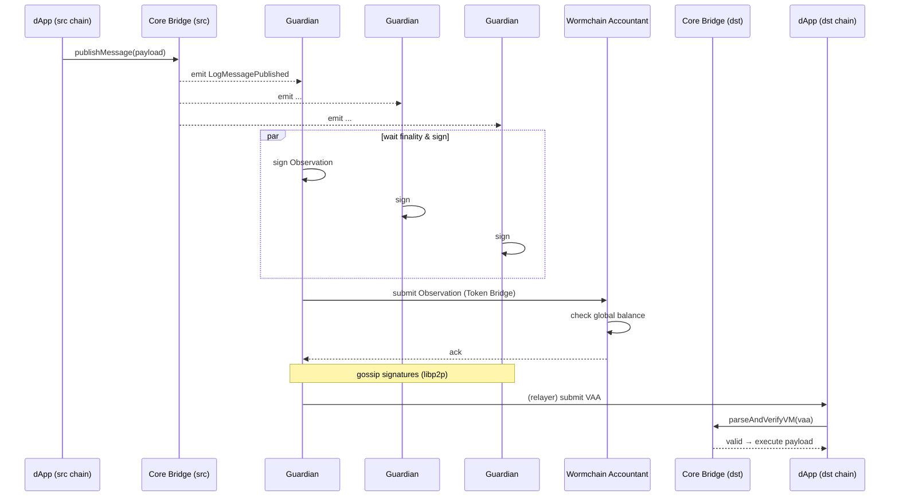

# Wormhole 跨链消息协议

> **TL;DR**：Wormhole 是目前支持链最广的通用消息协议之一（35+ 条链，包括 Solana、SUI、Aptos、Algorand、Near 等非 EVM 原生链）。核心安全模型是一个由 19 个 **Guardian** 组成的外部 PoA 验证者集，对源链事件以 13/19 阈值签名生成 **VAA（Verified Action Approval）**，任何人可在目标链上提交 VAA 触发执行。在 2022 年 $325M Solana 事件后，Wormhole 新增了 Governor（限额保险熔断）、Accountant（全局余额守恒）、以及 NTT（Native Token Transfers，无 Wrapped 设计）等纵深防御机制。

## 1. 背景与动机

2020 年 Solana 生态崛起时，EVM 上的资金难以跨入，社区需要一个"通用消息总线"而非只做资产桥。Certus One 团队 2020 Q4 推出 Wormhole v1，初期只支持 Ethereum↔Solana 的资产桥；2021 年改为通用消息协议，Jump Crypto 接手后开发 v2。Wormhole 的设计哲学与 LayerZero 有显著分歧：

- **LayerZero**：最小化协议本身，把信任决策交给应用。
- **Wormhole**：协议自带一组共享 Guardian，所有应用共享同一 TCB（可信计算基）。这带来**部署成本几乎为零**（应用调用 Core Bridge 即可），但把全生态安全绑在 Guardian 上。

这种"共享信任"范式的代价在 2022-02-03 暴露：Solana 端 `verify_signatures` 签名验证绕过漏洞（attacker 提交伪造的 sysvar 账户），Wormhole Portal 被盗 120,000 wETH（约 $325M），Jump 于 24 小时内自掏资金补齐。事件后 Wormhole 的防御体系发生根本性重构。

## 2. 核心原理

### 2.1 形式化定义

Wormhole 的核心对象是 **Observation**：Guardian 看到源链上一个"带白名单 emitter"合约 emit 的事件。Guardian 集合 $G = \{g_1, \dots, g_{19}\}$ 按 superminority 阈值 $t = \lfloor 2/3 \cdot |G| \rfloor + 1 = 13$ 对 Observation 签名。

设 Observation = $(\text{emitterChain}, \text{emitter}, \text{sequence}, \text{payload}, \text{consistencyLevel}, \text{timestamp}, \text{nonce})$，签名后聚合为：

$$
\text{VAA} = \text{Observation} \,\|\, \{ (i, \sigma_i) : g_i \in S \}, \quad |S| \ge 13
$$

目标链上的 Core Bridge 合约 `parseAndVerifyVM(vaa)` 验证：
1. 13/19 签名有效；
2. Guardian 集合编号 `guardianSetIndex` 与目标链记录一致；
3. payload 由接收合约自行解释。

**安全不变式**：若 $\le 6$ 个 Guardian 被攻破，攻击者无法生成合法 VAA。

### 2.2 关键数据结构：VAA

```
version          uint8    // 目前 1
guardianSetIndex uint32   // Guardian 集合编号（每次 rotation +1）
len(signatures)  uint8    // 签名条数
signatures       []{
    guardianIndex uint8
    r, s          bytes32
    v             uint8
}
// ─── hash-covered body 开始 ───
timestamp        uint32
nonce            uint32
emitterChain     uint16   // Wormhole chain ID
emitterAddress   bytes32  // 源链 emitter（字节对齐）
sequence         uint64   // emitter 单调递增
consistencyLevel uint8    // 源链 finality 等级
payload          bytes    // 应用 payload
```

关键不变式：
- **sequence per-emitter 单调**：目标链维护已消费 `(emitterChain, emitter, sequence)` 集合防止重放。
- **guardianSetIndex 支持轮换**：Core Bridge 保存 N 个历史 Guardian 集合，允许提交旧集合签名的 VAA（通常有过期期）。
- **consistencyLevel**：Solana 的 `confirmed`/`finalized`、Ethereum 的 `latest`/`safe`/`finalized`，决定 Guardian 等多少块才 attest。

### 2.3 子机制拆解

**(1) Core Bridge（每链一份）**
每条支持链上部署一份 Core Bridge，EVM 实现为 `Implementation.sol`（UUPS 可升级）。它只做两件事：
- 源侧：`publishMessage(nonce, payload, consistencyLevel)` emit event；
- 目标侧：`parseAndVerifyVM(encodedVM)` 返回 `(VM, valid, reason)`。

**(2) Guardian 节点（链下）**
19 个机构分别运行 `wormhole/node`（Go）。每个节点连接所有 35+ 条链的 RPC，订阅 Core Bridge 事件，按 `consistencyLevel` 等待 finality，对 Observation 签名并通过 **Gossip 网络**（libp2p）广播；收到 13+ 签名后组装 VAA 并通过公共 API 公开。

**(3) Governor（限额熔断）**
2022 事件后新增的链下模块（`node/pkg/governor`）。按 `(chain, token)` 设置每日美元限额（例如 Ethereum WETH 每日 $1M）。超出限额的 VAA 被 Guardian 延迟签名 24 小时，期间治理可介入。这是**速率限制型熔断**。

**(4) Accountant（账本守恒）**
基于 Cosmos SDK 的独立区块链（Wormchain），由 Guardian 共同运行。所有 Token Bridge VAA 必须先提交到 Wormchain，Wormchain 维护每个 token 在每条链的 mint/burn 账本，任何"凭空铸造"（burn 不足却要 mint）的 VAA 被 reject。Accountant 是**全局守恒型熔断**。

**(5) Token Bridge / NTT**
- **Token Bridge（Portal）**：lock-and-mint 模式，源链锁原始 token，目标链铸造 Wrapped。
- **NTT（Native Token Transfers, 2024）**：无 Wrapped，项目方在每条链部署原生 token 合约，Wormhole 只做消息传递，`burn` on src / `mint` on dst。适合已经多链部署的协议（如 Lido wstETH、Ondo USDY）。

**(6) Guardian 治理**
Guardian 集合通过 "Governance VAA" 轮换：超过 13 个现任 Guardian 签署一条特殊 payload 即切换 `guardianSetIndex`。2023 年引入 Wormhole DAO（$W token）后，Guardian 变更也须通过链上治理提案。

### 2.4 参数与常量

| 参数 | 取值 | 说明 |
| --- | --- | --- |
| Guardian 总数 | 19 | 可通过治理 VAA 调整（历史上曾 n=19 固定） |
| 签名阈值 | 13（2/3 + 1）| 硬编码 |
| consistencyLevel | enum | Ethereum: `finalized` 建议；Solana: `finalized` |
| Governor 每日限额 | per-token | 链下配置，热更新 |
| 最大 payload | 目标链实现决定 | EVM 受 calldata limit |

### 2.5 边界条件与失败模式

- **≥7 Guardian 被攻破**：协议共识失效，可伪造任意 VAA；Governor 可延缓但非阻止。
- **Gossip 网络分区**：VAA 可能延迟或无法组装；不影响资金安全。
- **源链重组深度 > consistencyLevel**：可能 attest 了被回滚的事件；这是 Wormhole 2022 Solana 事件之外另一类潜在问题。
- **目标链合约漏洞**：2022 事件本质；现有 Core Bridge 已修复 `verify_signatures`，但应用层仍可出错。
- **Accountant 的 BFT 假设**：Wormchain 本身是 PoS 链，若 Guardian 超过 1/3 离线会停链，VAA 无法被 Account。

### 2.6 图示



## 3. 架构剖析

### 3.1 分层视图

1. **应用层**：Token Bridge、NTT、CCTP integration、xAsset（Worm, W token）、第三方（Mayan、deBridge）
2. **Core Bridge 层**：每链 Implementation 合约
3. **Guardian 共识层**：19 节点 + Gossip + Wormchain Accountant
4. **观察层**：每 Guardian 独立运行的 watcher（每条链一个，如 `solana_watcher.go`、`evm_watcher.go`）
5. **Relayer 层**：Specialized Relayer / Standard Relayer（Wormhole 提供官方通用 relayer）
6. **客户端 SDK 层**：`@wormhole-foundation/sdk`（TS）、`wormhole-sdk-rs`（Rust）

### 3.2 核心模块清单

| 模块 | 路径（`wormhole-foundation/wormhole`，tag v2.23+） | 职责 | 可替换性 |
| --- | --- | --- | --- |
| Core Bridge (EVM) | `ethereum/contracts/Implementation.sol` | publishMessage / parseAndVerifyVM | UUPS 可升级 |
| Core Bridge (Solana) | `solana/bridge/program/src/lib.rs` | 同上 Solana 版 | program upgrade authority |
| Token Bridge | `ethereum/contracts/bridge/Bridge.sol` | lock-mint 资产桥 | 应用层，可替换 |
| NTT Manager | `native-token-transfers/evm/src/NttManager` | burn-mint 原生代币 | 项目独立部署 |
| Guardian node | `node/cmd/guardiand` | Observation / 签名 / Gossip | 19 机构独立运行 |
| Accountant | `wormchain/x/accountant` | 全局账本守恒 | Wormchain 模块 |
| Governor | `node/pkg/governor` | 每日限额熔断 | Guardian 链下 |
| Relayer (generic) | `relayer/generic_relayer` | 官方通用 relayer | 应用可自建 |

### 3.3 数据流 / 生命周期

以 **Token Bridge：Ethereum USDC → Solana** 为例：

1. **用户**：调用 `TokenBridge.transferTokens(token, amount, recipientChain, recipient, arbiterFee, nonce)`。合约把 USDC 转入 bridge 持有，调用 `Core.publishMessage(payload)` emit `LogMessagePublished(sender, sequence, payload, ...)`。
2. **Guardian watchers**：每个 Guardian 的 EVM watcher 订阅 `LogMessagePublished`，等待 `consistencyLevel=finalized`（Ethereum ≈13 min）。
3. **Observation 签名**：Guardian 对 `keccak256(body)` 用自己的 ECDSA key 签名，广播到 Gossip。
4. **Accountant**：因为是 Token Bridge VAA，必须先提交到 Wormchain，校验 `solana.wUSDC.mintedSupply + amount ≤ ethereum.USDC.lockedSupply`，通过后 Guardian 才完成签名。
5. **VAA 组装**：13 签名齐后，任一 Guardian 公开 VAA；第三方 Relayer（如官方 Generic Relayer）拉取。
6. **目标链**：Relayer 调用 Solana `token_bridge::complete_transfer(vaa)`，Solana program 校验签名、nonce、emitter；mint wUSDC 到 recipient。
7. **可观测性**：https://wormholescan.io 按 sequence 展示每条 VAA；Guardian 状态页展示每节点健康度。

### 3.4 客户端多样性 / 参考实现

- Guardian 节点：Go 实现唯一（`node/`），19 Guardian 运行同一代码库，**这是 Wormhole 的单点**。Jump Crypto 表示正在推动多实现，但截至 2026-Q1 尚未落地。
- 智能合约：EVM (Solidity)、Solana (Rust/Anchor)、Sui (Move)、Aptos (Move)、Algorand (TEAL)、Near (Rust)、CosmWasm 等，各自独立实现。
- SDK：`@wormhole-foundation/sdk`（TS，官方主推）、`wormhole-sdk-rs`、`@wormhole-foundation/sdk-solana` 等。

### 3.5 扩展 / 互操作接口

- **Specialized Relayer**：应用自运营的 relayer，针对性 gas 策略
- **Generic Relayer**：官方 `WormholeRelayer.sol`，支持 `sendPayloadToEvm`、gas 代付
- **Queries**：链下"预言机式"查询（从 Guardian 拉取任意 EVM slot），2024 新增
- **CCTP 集成**：Wormhole 包 Circle CCTP 做 USDC，以 VAA 作 attestation 包装
- **MultiGov / Hubble**：跨链治理框架

## 4. 关键代码 / 实现细节

参考 tag `v2.23.0`。

**Core Bridge（EVM）发送侧**：

```solidity
// ethereum/contracts/Implementation.sol:L35
function publishMessage(
    uint32 nonce,
    bytes memory payload,
    uint8 consistencyLevel
) public payable returns (uint64 sequence) {
    // 1. 读取 emitter 的 sequence 并自增
    sequence = useSequence(msg.sender);
    // 2. 收取 messageFee（可配置，目前 0 ETH）
    require(msg.value == messageFee(), "invalid fee");
    // 3. emit 事件供 Guardian 捕获
    emit LogMessagePublished(
        msg.sender, sequence, nonce, payload, consistencyLevel
    );
}
```

**VAA 验证（关键路径）**：

```solidity
// ethereum/contracts/Messages.sol:L35
function parseAndVerifyVM(bytes calldata encodedVM)
    public view returns (Structs.VM memory vm, bool valid, string memory reason)
{
    vm = parseVM(encodedVM);
    Structs.GuardianSet memory gs = getGuardianSet(vm.guardianSetIndex);
    require(gs.expirationTime == 0 || gs.expirationTime > block.timestamp, "gs expired");
    if (vm.signatures.length < (gs.keys.length * 2) / 3 + 1) {
        return (vm, false, "quorum not met");
    }
    (bool signaturesValid, string memory r) = verifySignatures(vm.hash, vm.signatures, gs);
    if (!signaturesValid) return (vm, false, r);
    return (vm, true, "");
}
```

**Guardian watcher（Go，EVM）**：

```go
// node/pkg/watchers/evm/watcher.go:~L450
func (w *Watcher) fetchAndProcessBlock(ctx context.Context, block *ethTypes.Header) {
    logs, err := w.ethConn.FilterLogs(ctx, ethereum.FilterQuery{
        BlockHash: &block.Hash,
        Addresses: []common.Address{w.contract},
        Topics:    [][]common.Hash{{LogMessagePublishedTopic}},
    })
    for _, log := range logs {
        msg := parseLogMessagePublished(log)
        if !w.hasReachedFinality(msg.ConsistencyLevel, block.Number) {
            w.pending[msg.TxHash] = msg
            continue
        }
        w.msgC <- msg
    }
}
```

> 省略：Accountant gRPC 交互、Gossip 拓扑、reobservation 协议。完整见 `node/` 目录。

## 5. 演进与版本对比

| 版本 | 时间 | 关键变化 |
| --- | --- | --- |
| v1 | 2020-10 | Certus One 发布，仅 ETH↔Solana |
| v2 | 2021 | 通用消息协议，引入 Core Bridge |
| 2022-02 事件后 | 2022 Q2 | Solana 合约漏洞修复；引入 Governor 链下限额 |
| Accountant 上线 | 2023 Q1 | Wormchain 全局账本守恒 |
| Generic Relayer | 2023 Q3 | 官方 `WormholeRelayer.sol` |
| NTT | 2024 Q1 | 原生代币跨链，无 Wrapped |
| Queries | 2024 Q3 | Guardian 作为通用读预言机 |
| $W token + DAO | 2024 Q2 | Guardian 治理权逐步上链 |

## 6. 实战示例

**发送一条简单消息（EVM → Solana）**

```solidity
interface IWormhole { function publishMessage(uint32, bytes calldata, uint8) external payable returns (uint64); }
contract Sender {
    IWormhole public wh = IWormhole(0x98f3c9e6E3fAce36bAAd05FE09d375Ef1464288B);
    function send(bytes calldata payload) external payable returns (uint64) {
        return wh.publishMessage{value: msg.value}(uint32(block.timestamp), payload, 1);
    }
}
```

拉取并提交 VAA（TS）：

```typescript
import { wormhole } from "@wormhole-foundation/sdk";
const wh = await wormhole("Mainnet", ["evm", "solana"]);
const eth = wh.getChain("Ethereum");
const [whm] = await eth.parseTransaction(txHash);
const vaa = await wh.getVaa(whm, "Uint8Array", 60_000);
```

预期：约 15–30 分钟（Ethereum finalized）后 `getVaa` 返回，Solana 端合约可消费。

## 7. 安全与已知攻击

- **2022-02-03 Solana 事件（$325M）**：`solana_bridge::verify_signatures` 允许 attacker 传入伪造 sysvar 账户绕过签名校验；Jump Crypto 24h 内补仓。根因：Solana CPI sysvar 验证逻辑误用。修复 commit：`wormhole@fb8bf64`。见 Certik 事后分析。
- **$W 合约风波（2024）**：$W token 启动初期被质疑 Guardian 中心化；DAO 治理逐步将 Guardian 轮换权上链。
- **供应链攻击面**：19 Guardian 均运行同一 Go 代码 → 单一 bug 可影响全集。2023-Q4 起推动形式化验证与 differential testing。
- **Rug-pull 风险**：Token Bridge 的 Wrapped tokens 若源链原始合约被升级/铸造，Wrapped 资产无法感知（Accountant 只管 bridge 内守恒）。
- **审计**：OtterSec、Certik、Coinspect、Neodyme 多轮。

## 8. 与同类方案对比

| 维度 | Wormhole | LayerZero | Axelar | CCIP | IBC |
| --- | --- | --- | --- | --- | --- |
| 信任模型 | 19 Guardian 13/19 | 应用配置 DVN | Tendermint PoS (~75 validators) | DON + RMN | Light Client |
| 非 EVM 深度 | 最强（Solana/Sui/Aptos/Algorand/TON） | 强 | 中 | 弱 | Cosmos 限定 |
| 熔断机制 | Governor + Accountant | 无协议级 | 无协议级 | RMN 可暂停 | 无 |
| 单点风险 | Guardian 共享 TCB | 可配置 | 验证者集 | DON 集中 | 无 |
| 费用 | 链上 gas（messageFee≈0） | DVN+Executor | 目标链 gas 代付 | 固定费 | Relayer 市场 |
| 代币 | W | ZRO | AXL | LINK | ATOM 无必要 |

## 9. 延伸阅读

- Docs：https://docs.wormhole.com/
- Whitepaper v2：https://github.com/wormhole-foundation/wormhole/blob/main/whitepapers
- 2022 事件事后：https://wormholecrypto.medium.com/wormhole-incident-report-02-02-22-ad9b8f21eec6
- a16z "Cross-chain bridges design space"
- NTT docs：https://wormhole.com/products/native-token-transfers
- 中文：登链"Wormhole 被盗 3 亿美元事件分析"

## 10. 术语表

| 术语 | 英文 | 释义 |
| --- | --- | --- |
| 守护者 | Guardian | 19 个外部验证节点之一 |
| 可验证动作批准 | VAA (Verified Action Approval) | Guardian 签名后的跨链消息凭证 |
| 发射器 | Emitter | 源链上调用 publishMessage 的合约地址 |
| 一致性等级 | consistencyLevel | Guardian 等待的 finality 级别 |
| 守恒器 | Accountant | Wormchain 上维护全局 token 守恒的模块 |
| 节流器 | Governor | 按 token-chain 设每日限额的熔断 |
| 原生代币跨链 | NTT | 无 Wrapped 的 burn-mint 标准 |
| 中继器 | Relayer | 把 VAA 提交到目标链的链下服务 |

---

*Last verified: 2026-04-22*
