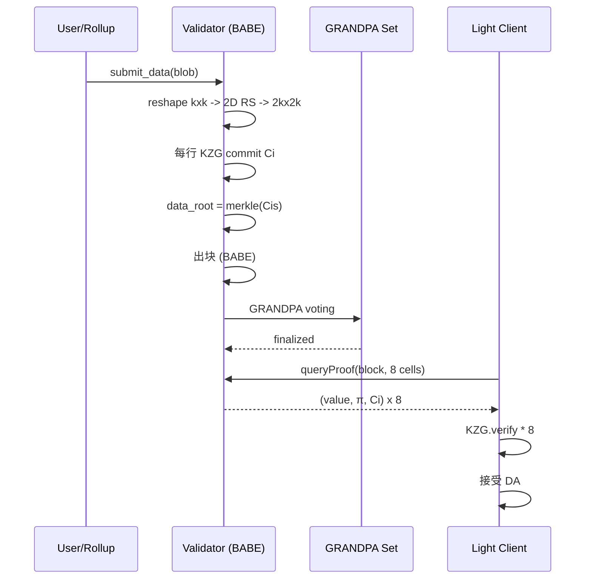

# Avail（KZG + 2-D DAS 的 Substrate 系 DA 层）

> **TL;DR**：Avail（前身 Polygon Avail，2023 年独立运营）是一条基于 **Polkadot/Substrate** 框架的专用数据可用性链，主网 `Mainnet Goldberg` 2024-07 上线。与 Celestia 最大的不同是：Avail 采用 **KZG 多项式承诺 + 2-D 纠删码**（而非 Celestia 的 2-D RS+NMT+Merkle），从而**轻客户端不仅能做 DAS，还能用 $O(1)$ 大小的 KZG proof 校验"某单元格内容正确"**——免除了 Celestia 对 "BadEncodingFraudProof" 的依赖，且允许更小的证明大小。Avail 的共识使用 **BABE（出块）+ GRANDPA（终局性）**，与 Polkadot Relay Chain 同源。生态定位：为 Rollup、Validium、Sovereign Rollup 提供独立 DA；与 Avail Nexus（跨 Rollup 消息层）和 Avail Fusion（借 ETH 做经济安全）组合，构成 "Avail DA + Fusion + Nexus" 三件套。

---

## 1. 背景与动机

2020 年 Mustafa Al-Bassam、Alberto Sonnino、Vitalik Buterin 联合发表《[Fraud and Data Availability Proofs: Detecting Invalid Blocks in Light Clients](https://arxiv.org/abs/1809.09044)》，为 Celestia/Avail 奠基。Avail 的早期原型由 Polygon 团队 Anurag Arjun 等 2020 年开工（时称 "Polygon Avail"），主攻 **KZG-commitment 化的 DAS**：Celestia 选择了更工程化的 Merkle + RS，而 Avail 走更密码学高级的 KZG 路径。

**动机区分**：
- Celestia 需要 "BadEncodingFraudProof" 来防 RS 错编码，即轻客户端安全依赖至少一个诚实全节点。
- Avail 用 KZG 承诺天然具备 **编码正确性可单点验证**（因为 KZG 承诺对多项式唯一，任一坐标值的 proof 必与根对应），无需欺诈证明。

**独立动机**：2023-03 Polygon 重组后，Avail 分拆为 Avail Project 独立实体，筹款 \$75M（Founders Fund、Dragonfly 领投）。定位从"Polygon 内部 DA"转向"链中立 DA 基础设施"。

## 2. 核心原理

### 2.1 形式化定义：基于 KZG 的 2-D DAS

给定 blob 字节序列，先 reshape 为 $k \times k$ 字段元素矩阵 $M \in \mathbb{F}_p^{k \times k}$。对每一行 $M_i$ 做多项式插值得到 $f_i(x)$，并用 RS 在 $2k$ 个求值点扩展 → 产生 $k \times 2k$ 矩阵 $M'$。再对每一列做同样操作 → 得到 $2k \times 2k$ 矩阵 $M''$。

对每行的多项式 $f_i$ 计算 KZG commitment $C_i = [f_i(\tau)]_1$。区块头包含 **commitment 向量** $\{C_0, \dots, C_{2k-1}\}$。

**DA 轻客户端协议**：
1. 随机选择 $s$ 个 `(row, col)` 坐标。
2. 请求 $M''[row][col]$ 的值 $v$ + KZG proof $\pi$。
3. 验证 `verifyKZG(C_row, col, v, π) == true`。
4. 若 $s$ 个全部通过 → blob 可用置信度 $\ge 1 - 2^{-s}$。

**优势**：proof 大小 48 字节（G1 点），与 Celestia 的 Merkle path（$\log n \times 32$ 字节）相比更紧凑；且无需欺诈证明。**代价**：KZG 计算更昂贵，需 trusted setup。

### 2.2 关键算法

**多项式插值到系数形式**：用 FFT 将 $f(\omega^i)$ 转为系数 $[a_0, \dots, a_{k-1}]$，$\omega$ 为 $2k$ 次单位根。

**KZG commitment 计算**：$C = \sum_{i} a_i \cdot [\tau^i]_1$。EigenDA 与 Avail 都使用 BN254 曲线 + Ethereum KZG Ceremony setup（$2^{24}$ powers of $\tau$）。

**Column commitments**：除 row commitments 外，Avail 还计算 column commitments 以支持列方向采样。区块头最终只存 `extrinsics_root` + `data_root`，后者是 `Merkle(commitments)`。

**Light Client Cell 请求协议**：轻客户端调用 `kate_queryProof(block, [{row, col}])`，返回 `{value, proof, commitment}`。

### 2.3 子机制拆解

**(1) 共识：BABE + GRANDPA**。Substrate 标准共识栈。BABE 每 20 秒一个 slot 产生块（Avail 出块 20 s）；GRANDPA 每 ~1 分钟给出 finalized round。Validator 集约 100+。

**(2) 数据提交：`submit_data` 交易**。类似 Celestia 的 PayForBlobs。用户调用 `DataAvailability.submitData(data)`，data 被编码进区块 `extrinsics`。

**(3) 擦除码 + KZG 承诺**。由 block author 在 `on_initialize` 阶段批量完成：reshape → FFT → RS → commit。

**(4) Light Client**（[avail-light](https://github.com/availproject/avail-light)）。Rust 实现，浏览器 WASM 可运行。节点内存 ~50 MB，带宽 ~10 KB/块。

**(5) Avail Nexus**。跨 Rollup 消息层，用 ZK proof 从 Avail DA 推导出"某 Rollup 的某 state root 来自已被 Avail 发布的数据"。

**(6) Avail Fusion**。混合经济安全：允许 ETH restakers 或 BTC holder 参与 Avail validator，拓展安全预算。2025-Q1 上线。

### 2.4 参数与常量

| 参数 | 值 |
| --- | --- |
| 出块时间 | 20 秒（BABE slot）|
| 终局确认 | ~60 秒（GRANDPA）|
| 最大区块 | 2 MiB（Mainnet 当前）/ 128 MiB 目标 |
| 目标矩阵 | $256 \times 256$（扩展后 $512 \times 512$）|
| Cell 大小 | 32 字节（一个字段元素）|
| KZG curve | BN254 |
| Field | $\mathbb{F}_r$ of BN254, $r \approx 2^{254}$ |
| 采样次数 | 8（默认 avail-light）|
| Validator | ~100（Goldberg 主网）|
| Token | AVAIL |

### 2.5 边界条件与失败模式

1. **Trusted Setup 泄露**：与 EigenDA 同担此风险，由 Ethereum KZG Ceremony 的分布式 setup 缓解。
2. **< 诚实采样阈值**：若诚实轻节点过少，攻击者可做选择性响应。Avail 推荐每 rollup 独立运行 light client 集群。
3. **GRANDPA 分叉**：在网络分区时 GRANDPA 可能无法 finalize，BABE 继续出块但 DA 承诺未终局。Rollup 应等待 finalized head。
4. **大区块编码瓶颈**：2 MiB 以上的区块做 2-D KZG 编码需 GPU，否则 block author 无法按时出块。Mainnet 逐步放量。

### 2.6 图示



```
Avail 区块扩展后的 2D 矩阵（k = 4 示意）：
                     列方向 RS ↓
             ┌──────────────┬──────────────┐
             │ 原始 4x4      │ 行方向 RS     │
   行方向 RS ├──────────────┼──────────────┤
             │ 列方向 RS     │ 双向 RS       │
             └──────────────┴──────────────┘
每行对应一个 KZG commitment，最终 data_root = Merkle(commits)
```

## 3. 架构剖析

### 3.1 分层视图

1. **网络层**：Substrate libp2p，含 DHT、gossip、block sync。
2. **共识层**：BABE + GRANDPA。
3. **运行时层（Pallets）**：`pallet_da_control`、`pallet_system`、`pallet_staking`、`pallet_nomination_pools`，使用 Substrate FRAME。
4. **DA 编码层**：`kate` crate，封装 reshape、RS、KZG。
5. **Light Client 层**：独立 `avail-light`，通过 RPC+libp2p 采样。

### 3.2 核心模块清单

| 模块 | 路径 | 职责 |
| --- | --- | --- |
| `pallet-da-control` | `avail/pallets/da-control` | submit_data / 参数治理 |
| `kate` | `avail/crates/kate` | 2-D KZG 编码、proof 生成 |
| `avail-base` | `avail/crates/avail-base` | 类型：Header、DataRoot |
| `avail-core` | 共享库 | AppId、AppUncheckedExtrinsic |
| `avail-node` | `avail/node` | 集成 Substrate + 上述 pallets |
| `avail-light` | `availproject/avail-light` | 轻客户端（Rust） |
| `avail-js-sdk` | `availproject/avail-js-sdk` | JS 客户端封装 |
| `vector` 合约 | `availproject/vector` | Avail → Ethereum 证明桥（类似 Blobstream） |
| `nexus` | `availproject/nexus` | 跨 Rollup 消息层（ZK proof） |
| `fusion-staking` | `availproject/fusion-staking` | 多资产 restaking |

### 3.3 数据流 / 生命周期

1. **t=0**：Rollup/App 通过 avail-js-sdk 调用 `submitData(appId, bytes)`。
2. **t=~5s**：交易进入 Avail mempool；下一个 BABE slot 的 author 纳入区块。
3. **t=+20s**：Block author 执行 `on_initialize`：reshape + RS + KZG → `data_root` 写入区块头。
4. **t=+80s**：GRANDPA round 完成 → finalized。
5. **t=+80s ~ 5min**：avail-light 节点采样 8 cells 并验证。
6. **t=+15min**：Vector / Blobstream-for-Avail 桥把 `data_root` 签名事件中继到 Ethereum 合约。
7. **t=+15min~**：L1 上的 Rollup 合约可按 `data_root` 验证 `AppId` 下的具体 blob 内容（通过 Merkle proof）。

### 3.4 客户端多样性 / 参考实现

- **avail-node** (Rust, Substrate 派生) — 主客户端，[availproject/avail](https://github.com/availproject/avail)。
- **avail-light** (Rust) — 轻客户端，支持 native + WASM。
- **avail-js-sdk** (TS) — 应用层 SDK。
- 官方仅一套全节点实现；Substrate 框架本身跨客户端兼容性较低，多样性不足是已知短板。

### 3.5 扩展 / 互操作接口

- **Substrate JSON-RPC**：`chain_getBlock`、`kate_queryProof`、`kate_queryDataProof`。
- **`submitData` extrinsic**：用户主要接口。
- **Vector Bridge**：Avail → Ethereum 的数据根桥。
- **Avail Nexus**：跨 rollup 消息 API。
- **IBC-like**：计划与 Polkadot XCM/Hyperlane 集成。

## 4. 关键代码 / 实现细节

**KZG commitment 生成**——[`avail/crates/kate/src/com.rs`](https://github.com/availproject/avail/blob/main/crates/kate/src/com.rs)：

```rust
// 简化
pub fn build_commitments(
    rows: usize, cols: usize,
    chunk_size: usize,
    extrinsics: &[AppExtrinsic],
    rng_seed: Seed,
) -> Result<(Vec<u8>, BlockDimensions, Matrix, Vec<u8>), Error> {
    // 1. 填充 extrinsics -> k x k 矩阵
    let block = flatten_and_pad_block(rows, cols, chunk_size, extrinsics, rng_seed)?;
    // 2. 对每行做 RS 扩展到 2*cols 长度
    let ext = par_extend_data_matrix(block.dims, &block.data)?;
    // 3. 对每行多项式做 KZG commit
    let mut commitments = Vec::with_capacity(ext.rows() * 48);
    for row in ext.row_iter() {
        let c = kzg::commit_row(&PP, row); // G1 compressed 48 bytes
        commitments.extend_from_slice(&c);
    }
    Ok((commitments, ext.dims, ext, block.data))
}
```

**Light Client 采样循环**——[`avail-light/src/light_client.rs`](https://github.com/availproject/avail-light/blob/main/client/src/light_client.rs)：

```rust
pub async fn sample_block(&self, header: &AvailHeader) -> Result<()> {
    let dims = header.extension.dims();
    let cells = generate_random_cells(dims, self.cfg.confidence)?; // e.g. 8 cells
    let proofs = self.rpc.request_proofs(header.number, &cells).await?;
    for (cell, proof) in cells.iter().zip(proofs) {
        let commitment = header.extension.commitment(cell.row)?;
        if !kzg::verify(&PP, commitment, cell.col, &proof.value, &proof.pi)? {
            return Err(anyhow!("invalid proof at {:?}", cell));
        }
    }
    self.db.mark_available(header.number);
    Ok(())
}
```

## 5. 演进与版本对比

| 版本 | 时间 | 关键变化 |
| --- | --- | --- |
| Kate testnet | 2022 | 初版 KZG + 2-D RS |
| Kate v2 "Clash" | 2023-Q3 | App ID、多租户 |
| Goldberg testnet | 2023-Q4 | 稳定版主网候选 |
| **Mainnet Goldberg** | **2024-07-23** | 主网启动；2 MiB blocks |
| Enigma | 2024-Q4 | Vector bridge 主网；KZG proof size 优化 |
| Fusion | 2025-Q1 | 多资产 restaking（ETH/BTC） |
| Turbo | 2025-Q4 | 目标 128 MiB 区块 + GPU 编码 |

## 6. 实战示例

**用 `avail-js` 提交 blob 并等 finality**：

```js
import { SDK, Pallets } from "avail-js-sdk";

const sdk = await SDK.New("wss://mainnet.avail.so/ws");
const account = SDK.alice(); // 开发用
const tx = sdk.tx.dataAvailability.submitData("0xdeadbeef");
const result = await tx.executeWaitForInclusion(account);
console.log("block:", result.blockHash, "tx index:", result.txIndex);

// 读取 kate 证明
const proof = await sdk.rpc.kate.queryProof(result.blockHash, [{ row: 0, col: 0 }]);
console.log(proof);
```

**运行 avail-light 轻客户端**：

```bash
git clone https://github.com/availproject/avail-light && cd avail-light
cargo run --release -- --network mainnet --app-id 0
# 日志：Sampled 8 cells, confidence 99.2%
```

## 7. 安全与已知攻击

1. **KZG Trusted Setup 风险**：与 EigenDA 相同，复用 Ethereum 140k+ 参与者的 KCM；单人诚实即可保证安全。
2. **GRANDPA 分叉**：Substrate 生态历史上有过 Polkadot Relay Chain GRANDPA stall（2024-05）长时间无 finality 的事件，类似问题可能影响 Avail DA 终局。Rollup 应使用 finalized head。
3. **Vector Bridge**：与 Blobstream 类似，依赖 validator 多签；2024-10 Succinct Labs 为其引入 ZK light client proof（SP1）减少 trust。
4. **Single Client Risk**：仅 avail-node 一个实现，多样性不足。
5. **Cell withhold + partial sampling**：攻击者可能"部分响应"samples，此时 KZG proof 仍然有效但数据实际不可重建。解决需要足够多轻客户端分布式覆盖。
6. **审计**：Least Authority 2023 审计、Sigma Prime 2024 审计，未发现 critical issue。

## 8. 与同类方案对比

| 维度 | Avail | Celestia | EigenDA | Ethereum 4844 |
| --- | --- | --- | --- | --- |
| 承诺方案 | KZG | Merkle (NMT) | KZG | KZG |
| 编码 | 2-D RS | 2-D RS | 1-D RS + chunk | 1-D RS（blob 内） |
| 编码正确性 | 密码学（免证） | 欺诈证明 | Operator 签名 | 协议内原生 |
| Proof size | 48 字节 (G1) | ~log n × 32 字节 | 48 字节 | 48 字节 |
| 轻节点 DAS | 是 | 是 | 否 | 否（PeerDAS 后是） |
| 独立代币 | AVAIL | TIA | 无 | ETH |
| 主网大小 | 2 MiB / 20s | 8 MiB / 12s | 16 MiB / batch | 0.75 MiB / 12s |
| 客户端多样性 | 低 | 低 | 低 | 高（5+ EL） |

## 9. 延伸阅读

- **一手源**
  - Avail 官网：<https://www.availproject.org>
  - 文档：<https://docs.availproject.org>
  - 仓库：<https://github.com/availproject/avail>
  - Light Client：<https://github.com/availproject/avail-light>
  - White Paper：<https://github.com/availproject/data-availability/blob/master/reference-document/Data%20Availability-%20The%20Key%20to%20Scaling%20Rollups%20on%20Ethereum.pdf>
  - 核心 DA Proof 论文：<https://arxiv.org/abs/1809.09044>
- **权威博客**
  - Avail blog：<https://blog.availproject.org>
  - Anurag Arjun on modular：<https://twitter.com/anuragarjun>
  - Mustafa Al-Bassam on DAS：<https://musalbas.com>
- **视频**：Modular Summit 2024 Avail track。

## 10. 术语表

| 术语 | 英文 | 释义 |
| --- | --- | --- |
| 数据可用性采样 | DAS | 轻节点随机采样以概率性验证 DA |
| KZG 承诺 | KZG commitment | 基于双线性配对的多项式承诺 |
| 纠删码 | Erasure Code (RS) | 从 k 份生成 n>k 份，任意 k 份可恢复 |
| 应用 ID | App ID | Avail 中的 namespace，区分租户 |
| Goldberg | Goldberg | Avail 主网代号 |
| Vector | Vector | Avail → Ethereum 的 DA 桥 |
| Nexus | Nexus | Avail 的跨 Rollup 消息层 |
| Fusion | Fusion | 多资产 restaking（ETH/BTC 等） |
| BABE | BABE | Substrate 出块共识 |
| GRANDPA | GRANDPA | Substrate 终局共识 |

---

*Last verified: 2026-04-22*
