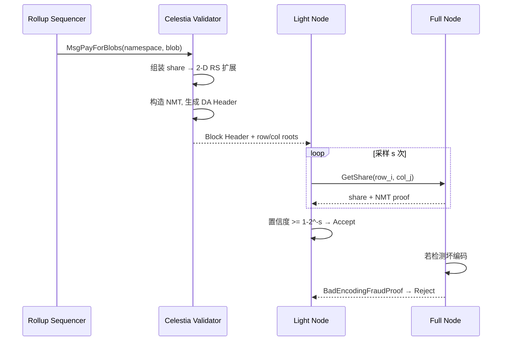

# Celestia（模块化 DA 先驱）

> **TL;DR**：Celestia 是首个**专用数据可用性（Data Availability, DA）**区块链，2023-10-31 主网上线。它剥离了传统单体链中的"执行"与"结算"功能，只做两件事：**对数据排序 + 保证数据可用**。核心创新是 **Data Availability Sampling (DAS)** + **2-D Reed-Solomon 擦除码** + **Namespaced Merkle Tree (NMT)**——这让**轻节点只下载几十 KB 随机样本即可以高置信度验证整个大区块（例如 8 MB/32 MB 级）已被完整发布**。Rollup 将压缩后的交易数据发布到 Celestia，费用比 Ethereum blob 低 1–2 个数量级。截至 2026-04，Celestia 上已承载 60+ Rollup（Manta、Dymension、Orderly、Hyperlane、多个 Polygon CDK/Arbitrum Orbit 链），是"模块化区块链"叙事的代表作品。

---

## 1. 背景与动机

单体链（Monolithic Blockchain）的每个全节点必须 **执行 + 共识 + 存储 + 保证数据可用**。随着 TPS 上升，全节点硬件要求呈线性甚至超线性增长，最终只有中心化实体能跑，链的去中心化退化。

**Mustafa Al-Bassam 等 2019 年论文《Fraud and Data Availability Proofs: Detecting Invalid Blocks in Light Clients》([arXiv:1809.09044](https://arxiv.org/abs/1809.09044))** 提出：轻节点可以用 **DAS** 以极小带宽确认"区块数据已完整发布"，从而安全地依赖全节点的欺诈证明。2019 年延续论文《[LazyLedger](https://arxiv.org/abs/1905.09274)》——"一条只负责排序 + 保证 DA、不执行"的链——这就是 Celestia 的前身。

**动机**：Rollup 本身就把执行搬到链下、只把数据回发 L1；但 L1 的数据存储极其昂贵（EIP-4844 之前，Ethereum calldata 每字节 16 gas）。如果有一条专用 DA 链，**价格可降至 L1 的 1/100 ~ 1/1000**，同时仍保持"任何人可重建"的属性。Celestia 的出现让"Execution Layer（Rollup）+ Settlement Layer（Ethereum）+ Data Availability Layer（Celestia/EigenDA/Avail）"三分天下的 **Modular Stack** 成为现实。

## 2. 核心原理

### 2.1 形式化定义：数据可用性问题

设区块 $B$ 包含 $n$ 个数据片段 $\{d_1, \dots, d_n\}$。**DA 问题**定义为：在区块生产者可能恶意的前提下，**轻节点需要以概率 $\ge 1 - \epsilon$ 确认：网络中至少存在一组诚实节点能够完整重建 $B$**。

朴素方案是轻节点下载整个区块——与"跑全节点"等价，失去轻节点意义。Celestia 采用以下结构化方案：

$$ B' = \text{RS}_{2k \times 2k}(B) \quad \text{其中 } |B'| = 4|B|$$

用 **二维 Reed-Solomon 编码** 把 $k \times k$ 的原始矩阵扩展为 $2k \times 2k$。**不变式**：任意 $k \times k$ 的子矩阵都足以恢复原始数据。因此，只要有 $25\%$ 以上的样本可用，数据就可恢复；攻击者要"隐藏" $\ge 75\%$ 样本才能阻止重建，而这等价于彻底不发布。

**轻客户端采样策略**：每个轻节点独立向网络请求 $s$ 个随机坐标 $(i, j)$ 的样本 + Merkle 证明。若攻击者隐藏了一半以上数据（使重建失败），则每次采样请求失败的概率 $\ge 1/2$，采 $s$ 次的总失败概率 $\ge 1 - 2^{-s}$。取 $s = 30$ 即可达到 $1 - 10^{-9}$ 置信度。

### 2.2 关键算法：Namespaced Merkle Tree (NMT)

Celestia 的**多租户**特性要求某 Rollup 只需下载"属于自己的那部分数据"而无需解析其他 Rollup。为此 Celestia 不用普通 Merkle Tree，而采用 NMT（[celestiaorg/nmt](https://github.com/celestiaorg/nmt)）。

NMT 节点在 `hash` 的基础上附带 **`[minNS, maxNS]`** 字段表示该子树所覆盖的 namespace 区间。叶子按 namespace 排序。根哈希 = `hash(left || right || minNS || maxNS)`。

**性质**：
1. 同一 namespace 的所有叶子连续出现，可用单个 Merkle range proof 提取。
2. **Namespace 完整性证明**：可以证明"namespace X 的所有数据仅有这 k 片，无遗漏"——因为 NMT 叶子按 namespace 单调排序，若攻击者漏掉一片，兄弟节点的 namespace 区间对不上。

NMT 是 Cosmos SDK `store/types/tree` 的扩展。Rollup 提交数据时在 `PayForBlobs` 交易里声明自己的 `namespace_id`（8 字节），Celestia 共识层保证该数据连续嵌入 NMT。

### 2.3 子机制拆解

**(1) 2-D Reed-Solomon 擦除码**。矩阵按行、按列分别做 RS 编码。每行、每列的 Merkle 根（`row_roots[i]`、`col_roots[j]`）组成区块头的 `DataAvailabilityHeader`。选用 GF(2⁸) 域、`k = 128`（动态）。编码在 [celestia-app/pkg/da](https://github.com/celestiaorg/celestia-app/tree/main/pkg/da)。

**(2) Data Availability Sampling (DAS)**。轻节点每块随机挑 $s$ 个 `(row, col)`，向 P2P 网络请求样本 + Merkle 证明（针对 `row_roots[row]` 或 `col_roots[col]`）。若所有样本在超时内返回，则接受该块。详见 [celestia-node/share/availability](https://github.com/celestiaorg/celestia-node/tree/main/share/availability)。

**(3) Fraud Proof of Incorrect Encoding**。恶意生产者可能提交"2-D RS 结构错误"的区块（比如某行 RS 系数被篡改），使轻节点即便采样成功也无法重建。Celestia 引入 `BadEncodingFraudProof`——任何全节点检测到某行/列不一致时，可提交一行数据 + Merkle 证明，轻节点在 O(k) 验证后拒绝该块。

**(4) 共识：Tendermint / CometBFT**。100 个 top validators（按 stake 排序）使用 CometBFT 的 BFT PoS 共识，块时间 ~12 秒，**即时终局**。与 Cosmos 其他链同族。

**(5) Rollup 集成与 PayForBlobs**。Rollup sequencer 构造一笔特殊的 `MsgPayForBlobs` 交易，附带 `namespace_id`、`share_commitment`（对 blob 的承诺），以 TIA 支付 gas。共识层完成区块打包后，数据自动进入对应 namespace 的子树。

**(6) Quantum Gravity Bridge (QGB) / Blobstream**。Celestia 把最新 DA 头的 **validator-signed attestation** 中继到 Ethereum 合约，Ethereum 上的 Rollup 可读取它作为 DA 证明，实现"Celestia DA + Ethereum 结算"。

### 2.4 参数与常量（主网，Lemongrass 升级后）

| 参数 | 值 | 说明 |
| --- | --- | --- |
| 块时间 | ~12 秒 | CometBFT |
| 最大块大小 | 8 MiB (Lemongrass 前 2 MiB) | 治理可调 |
| 目标 square size | 128 × 128（上限 256×256） | 2-D RS 边长 |
| Share 大小 | 512 字节 | 每个 Merkle 叶子 |
| Validator 数 | 100 | active set |
| Unbonding 期 | 21 天 | 标准 Cosmos |
| 最小 gas price | 0.002 `utia` | v1.3 起动态定价 |
| 采样次数 $s$ | 16（默认 `celestia-node`） | 可调，越高越安全 |

### 2.5 边界条件与失败模式

1. **少数诚实轻节点 + 网络分区**：若诚实轻节点数 $< \log n$，攻击者可选择性响应样本以通过采样却实际仅发布 < 25% 数据。Celestia 依赖足够多的轻节点随机采样构成 "coverage"。
2. **恶意 RS 编码**：见 (3)，需至少一个诚实全节点检测并广播 BadEncodingFraudProof。
3. **Validator 合谋隐藏数据**：若 > 2/3 validator 合谋，可签署空 block 但声称有 data；此类行为等同于普通 PoS 恶意出块，将被 slash 且社会层分叉。
4. **Blobstream 中继延迟**：桥到 Ethereum 有 ~1 小时延迟，Rollup 在此期间的 withdraw 需等待。

### 2.6 图示



```
区块结构（square size = 4，RS 扩展后 8×8）
            col_roots[0..7]
          ┌──────────────────────────┐
row_roots │  原始 shares  │  列方向 RS │
 [0..3]   ├──────────────┼────────────┤
          │  行方向 RS   │  双向 RS    │
 [4..7]   └──────────────────────────┘
DataHash = Merkle(row_roots || col_roots)
```

## 3. 架构剖析

Celestia 的架构以 **celestia-app**（共识+状态机，基于 Cosmos SDK + CometBFT）与 **celestia-node**（DA 采样/发布层，libp2p）两部分为核心。

### 3.1 分层视图

1. **P2P 层**：celestia-node 使用 libp2p，内建 DHT + bitswap 用于 share 分发；celestia-app 使用 CometBFT 的 P2P 栈交换共识消息。
2. **共识层**：CometBFT（Tendermint v0.38 派生），PoS + BFT，即时终局。
3. **状态机层**：基于 Cosmos SDK 的 `app` 模块，包含 `blob`（PayForBlobs）、`staking`、`qgb/blobstream` 等。
4. **数据可用层**：celestia-node 负责把 block 数据分片为 share、构建 NMT、对外提供 `ShareAvailability` API。
5. **桥/结算接口**：Blobstream（Tendermint → Ethereum light client）和 Hyperlane、IBC。

### 3.2 核心模块清单

| 模块（路径） | 职责 | 依赖 | 可替换性 |
| --- | --- | --- | --- |
| `celestia-app/x/blob` | PayForBlobs 交易处理 | Cosmos SDK | 低（协议定义） |
| `celestia-app/pkg/shares` | blob ↔ share 序列化 | - | 低 |
| `celestia-app/pkg/da` | 2-D RS 编码 + NMT 构建 | `nmt`, `rsmt2d` | 中（可换 RS 库） |
| `celestia-node/share` | DAS 采样、share 获取 | libp2p, bitswap | 高（可换 P2P） |
| `celestia-node/header` | ExtendedHeader 同步 | - | 高 |
| `celestia-node/das` | Sampler 状态机 | share | 高 |
| `celestia-node/nodebuilder` | Bridge/Full/Light 节点类型 | - | - |
| `celestia-app/x/qgb` | Blobstream attestation | CometBFT evidence | 中（可换签名聚合） |
| `rsmt2d` | 独立库：2-D RS Merkle Tree | - | 低 |
| `nmt` | 独立库：Namespaced Merkle Tree | - | 低 |

### 3.3 数据流 / 生命周期

一条 Rollup 交易从提交到"被 L1 视为 DA 完成"的完整路径：

1. **t=0**：Rollup Sequencer 压缩 L2 批次 → 构造 `MsgPayForBlobs`（含 `namespace`、`blob`、`share_commitment`）。
2. **t=+3s**：提交至 Celestia mempool；validator 包含进 block proposal。
3. **t=+6s**：CometBFT prevote。
4. **t=+12s**：CometBFT precommit → 区块 Finalized，DataHash 写入头。
5. **t=+12s ~ +24s**：Bridge Node 将 block 分片为 `128×128` shares，执行 2-D RS 扩展 → 通过 bitswap 推入 share 网络。
6. **t=+24s ~ +40s**：Light Node 看到新头，发起 16 次并行采样；全部命中 → 本地标记 available。
7. **t=~+60min**：Blobstream 收集 > 2/3 validator 签名的 DataRootTuple，提交到 Ethereum `Blobstream.sol` 合约 → L1 Rollup 合约可查询 `verifyAttestation()`。

可观测性点：`celestia-node`/`das_sampler_head` metric、Blobstream 事件 `DataRootTupleRootEvent`。

### 3.4 客户端多样性 / 参考实现

- **celestia-app** (Go) — 官方主客户端，[celestiaorg/celestia-app](https://github.com/celestiaorg/celestia-app)。
- **celestia-node** (Go) — DA 采样，三类节点角色：Bridge / Full / Light。
- **Rust 生态**：[eigerco/lumina](https://github.com/eigerco/lumina) —— Rust 实现的 Celestia 轻节点，支持浏览器 WASM。
- **Mobile**：Lumina 可嵌入移动端，2025 年 Celestia Foundation 已将其纳入官方工具链。

与 Ethereum 不同，Celestia 目前共识客户端仍以 celestia-app 单一 Go 实现为主（2/3 风险），但社区有 `rollkit` + `lumina` 的 DA 抽象层，降低上层对单实现的耦合。

### 3.5 扩展 / 互操作接口

- **RPC**：CometBFT RPC（26657 端口），用于查询 block/header。
- **gRPC / REST**：Cosmos SDK 标准接口，包括 `blob.Query.Params`、`blob.Query.BlobAt`。
- **celestia-node JSON-RPC**（`rpc/v0/celestia`）：`Share.GetSharesByNamespace`、`Blob.Submit`、`DAS.WaitCatchUp` 等。
- **IBC**：支持向 Cosmos 生态转移 TIA。
- **Blobstream 桥**：向 Ethereum / Arbitrum / Base 同步 DataRoot。
- **Hyperlane**：一般消息传递。

## 4. 关键代码 / 实现细节

**PayForBlobs handler**——[`celestia-app/x/blob/keeper/keeper.go`](https://github.com/celestiaorg/celestia-app/blob/main/x/blob/keeper/keeper.go)：

```go
// 简化版 – 以 v1.x 源码为准
func (k Keeper) PayForBlobs(ctx sdk.Context, msg *types.MsgPayForBlobs) error {
    // 1. 校验 namespace：非保留段 + 长度 = 29 bytes (version + id)
    for _, ns := range msg.Namespaces {
        if err := appns.ValidateBlobNamespace(ns); err != nil {
            return err
        }
    }
    // 2. 校验 share_commitment：对 blob 做 merkle(padded_shares)
    for i, blob := range msg.Blobs {
        expectedCommit, err := shares.CreateCommitment(blob, msg.Namespaces[i])
        if err != nil { return err }
        if !bytes.Equal(expectedCommit, msg.ShareCommitments[i]) {
            return ErrInvalidShareCommitment
        }
    }
    // 3. 扣费：blob 字节数 × gasPerByte
    gas := k.GasToConsume(msg.BlobSizes)
    ctx.GasMeter().ConsumeGas(gas, "PayForBlobs")
    return nil
}
```

**DAS 采样主循环**——[`celestia-node/das/sampler.go`](https://github.com/celestiaorg/celestia-node/blob/main/das/sampler.go)：

```go
// 简化：轻节点拉取头后并行采样 s 个坐标
func (s *Sampler) Sample(ctx context.Context, h *header.ExtendedHeader) error {
    square := h.DAH.SquareSize()
    coords := randomCoordinates(s.samples, square*2) // 扩展后 2k × 2k
    g, gctx := errgroup.WithContext(ctx)
    for _, c := range coords {
        c := c
        g.Go(func() error {
            _, err := s.shareGetter.GetShare(gctx, h, c.row, c.col) // bitswap
            return err                                             // 任一失败 → 整块不可用
        })
    }
    return g.Wait()
}
```

> 真实代码含重试、并发窗口、本地 pin、metric；此处省略。

## 5. 演进与版本对比

| 版本 | 时间 | 关键变化 |
| --- | --- | --- |
| Mocha testnet | 2022-Q4 | 初版 DA + NMT |
| Mainnet Beta | 2023-10-31 | 主网启动；square 上限 128 |
| Lemongrass (v1.6) | 2024-06 | 引入 ICS-29 fee relayer、IBC v8 |
| Ginger (v2.0) | 2024-09 | Blobstream X 升级；动态 gas pricing |
| Niwa (v3.0) | 2025-02 | square 上限 → 256；引入 MultiSig Blobstream |
| Shwap (v3.5) | 2025-Q4 | 新 share 获取协议，替代 bitswap，吞吐 ×3 |
| Crytic (v4.0, 规划) | 2026-Q3 | 64 MiB 区块；DAS subnets |

## 6. 实战示例

**本地起轻节点 + 发布 blob**：

```bash
# 1. 安装 celestia-node
curl -sL https://docs.celestia.org/nodes/light-node | bash

# 2. 启动 light node 连接 mainnet
celestia light init
celestia light start --core.ip rpc.celestia.pops.one

# 3. 向 dev namespace 提交 blob（需 auth token）
AUTH=$(celestia light auth admin)
curl -X POST http://localhost:26658 \
  -H "Authorization: Bearer $AUTH" \
  -d '{
    "jsonrpc": "2.0",
    "method": "blob.Submit",
    "params": [[{
      "namespace": "AAAAAAAAAAAAAAAAAAAAAAAAAAECAwQFBgcI",
      "data": "aGVsbG8gY2VsZXN0aWE=",
      "share_version": 0
    }], 0.002],
    "id": 1
  }'
# 预期：返回 block_height，可在 Celenium 浏览器查询到
```

## 7. 安全与已知攻击

1. **Lazy Validator Attack**（论文分析）：Validator 只签头不下载完整数据。Celestia 通过要求 **每个 validator 必须在 propose 时验证完整 RS 编码**，并附带 signed header 中的 DataRoot；若与实际数据不符，`BadEncodingFraudProof` 可触发 slash。
2. **Eclipse / Sybil on Light Node**：攻击者包围某轻节点的 P2P 连接，只回答伪造 share。`celestia-node` 通过 libp2p connection gater + peer scoring + 多 provider 拉取缓解。
3. **Blobstream 桥攻击**：历史上尚未被利用；主要风险在 validator set 变更期的 signature 验证时序。2025-01 Blobstream X 升级引入 ZK proof 替代 multi-sig。
4. **Data Withholding on Fork**：在 unsafe head 被重组时，短期内已发布的 share 可能丢失。Celestia 推荐 Rollup 等待 1 epoch 再引用 DataRoot。
5. **参考报告**：[Celestia 安全审计 — Informal Systems 2023](https://celestia.org/resources/audits/)、[Trail of Bits 2024 celestia-node audit](https://github.com/trailofbits/publications)。

## 8. 与同类方案对比

| 维度 | Celestia | EigenDA | Avail | Ethereum (4844 Blob) |
| --- | --- | --- | --- | --- |
| 信任模型 | PoS 独立链（100 val） | Restaking AVS（ETH sec） | PoS 独立链（Substrate） | Ethereum L1（完全继承） |
| DA 证明 | DAS + 2-D RS + NMT | KZG + Restaking custody | KZG + DAS（1-D RS） | KZG commitments, 无 L1 DAS（PeerDAS 规划） |
| 轻节点可验证 | 是（核心设计） | 否（依赖 AVS operators 诚实） | 是 | 目前否，PeerDAS 后是 |
| 吞吐（主网 2026-Q1） | 8 MiB / 12s ≈ 5.3 Mbps | 10+ MiB/s（扩展目标） | 2 MiB / 20s | 0.75 MiB / 12s |
| 每 MiB 费用 | ≈ \$0.002 | ≈ \$0.0005 | ≈ \$0.001 | ≈ \$0.10（Blob 拥挤时） |
| 主要客户 | Manta, Dymension, Orbit 链 | EigenLayer 系 Rollup | Polygon CDK, Optimium | 所有主流 L2 |

Trade-off：Celestia 去中心化程度最高（独立 DAS），但安全独立于 Ethereum；EigenDA 安全继承 Ethereum 但牺牲了轻节点可验证性；Ethereum 原生 Blob 安全最强但容量与价格最贵。

## 9. 延伸阅读

- **一手源**
  - Celestia 官网：<https://celestia.org>
  - LazyLedger 论文：<https://arxiv.org/abs/1905.09274>
  - Fraud/DA Proofs 论文：<https://arxiv.org/abs/1809.09044>
  - 文档：<https://docs.celestia.org>
  - celestia-app：<https://github.com/celestiaorg/celestia-app>
  - celestia-node：<https://github.com/celestiaorg/celestia-node>
  - nmt / rsmt2d 库：<https://github.com/celestiaorg/nmt>
- **权威博客**
  - Mustafa Al-Bassam（创始人）博客：<https://musalbas.com>
  - Celestia 博客：<https://blog.celestia.org>
  - Paradigm on Modular：<https://www.paradigm.xyz/writing>
- **视频 / 播客**
  - Modular Summit 录播
  - Bankless "Modular vs Monolithic" 系列
- **相关提案**：Celestia Improvement Proposals (CIPs) <https://github.com/celestiaorg/CIPs>

## 10. 术语表

| 术语 | 英文 | 释义 |
| --- | --- | --- |
| 数据可用性 | Data Availability, DA | 区块数据被完整发布、任何人可获取的属性 |
| 数据可用性采样 | Data Availability Sampling, DAS | 轻节点通过随机采样以概率性确认 DA |
| 命名空间 Merkle 树 | Namespaced Merkle Tree, NMT | 每节点携带 namespace 区间的 Merkle 树 |
| Reed-Solomon 编码 | Reed-Solomon Code | 基于多项式插值的擦除码 |
| Blob | Blob | Celestia 上的不透明字节数据 |
| PayForBlobs | PFB | 为发布 blob 支付手续费的交易类型 |
| Blobstream | Blobstream | Celestia → Ethereum 的 DA 证明桥 |
| 模块化区块链 | Modular Blockchain | 执行/结算/DA/共识分层的架构 |
| TIA | TIA | Celestia 原生代币 |
| Share | Share | 512 字节的 Celestia 数据单元 |

---

*Last verified: 2026-04-22*
