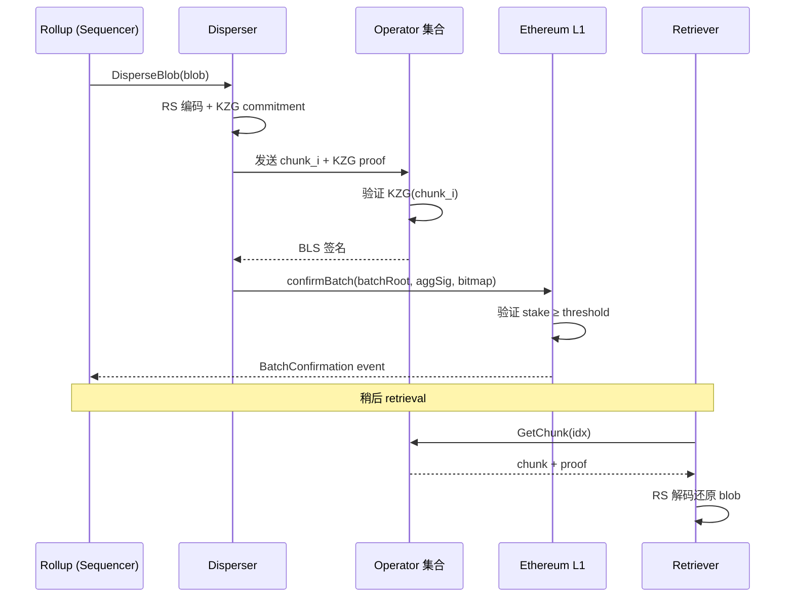

# EigenDA（基于 Restaking 的高吞吐 DA）

> **TL;DR**：EigenDA 是 EigenLabs 于 2024-04 主网上线的 **AVS（Actively Validated Service）**，利用 **EigenLayer Restaking** 将 Ethereum 验证者已质押的 ETH "二次质押"作为 DA 的安全来源，不引入独立代币。它采用 **KZG 多项式承诺 + Reed-Solomon 擦除码 + Custody Proof**，由 Operator 集合分片托管数据；Rollup（disperser）只需把 KZG commitment 上 Ethereum，数据本体在 EigenDA Operator 网络中分布式保留。主网 V1 吞吐 15 MB/s，V2（2025-Q3）升级后目标 100 MB/s，单位字节费用比 Ethereum Blob 低 1–2 个量级。典型用户：Mantle、Celo、Hyperliquid Bridge、Offchain Labs/Arbitrum Orbit 链。EigenDA 的核心争议是 **"Restaking 安全是否真能等同于原生 PoS 安全"** 以及 **轻客户端不可验证 DA**，Vitalik 多次撰文警示其系统性风险。

---

## 1. 背景与动机

Ethereum Blob（EIP-4844）虽把 L2 成本降了 95%+，但受制于 0.75 MB/block（~0.0625 MB/s 持续）的硬上限：一旦多个热门 Rollup 同时提交，blob base fee 会飙升，用户费用回到美元级别。Danksharding 全量上线需 2–3 年。EigenDA 的定位是：**桥接期**提供 1–2 个数量级更大带宽、更低单价的 DA，并且不脱离以太坊的经济安全模型。

EigenLayer 的 **Restaking** 允许 Validator 通过 `EigenPod` 或 LSD LST 将已质押 ETH 再"委托"给 AVS。AVS 承诺：若 Operator 未履行某个约定（例如存储 DA share），将被 slash。EigenDA 就是 EigenLayer 最早、也是旗舰的 AVS。Sreeram Kannan（EigenLayer 创始人）2023 年论文《[Restaking: Cryptoeconomic Extensibility of Trust](https://www.eigenlayer.xyz/whitepaper)》正式定义了此模型。

相较于 Celestia 的独立 PoS 链，EigenDA 的架构更简单：**不需要自己的共识、自己的 token**。但代价是：信任模型深度绑定 EigenLayer 合约 + Operator 诚实假设（缺少 DAS 下的轻节点可验证性）。

## 2. 核心原理

### 2.1 形式化定义：DA 承诺与 Custody 模型

设 blob 为字节串 $b \in \mathbb{F}_p^n$，先以 **Lagrange 插值**得到多项式 $f(x)$ 使 $f(\omega^i) = b_i$。

**KZG 承诺**：$C = [f(\tau)]_1 \in \mathbb{G}_1$，其中 $\tau$ 是 trusted-setup 秘密。**性质**：对任意点 $z$，可给出 $O(1)$ 大小的证明 $\pi$ 使验证者检查 $f(z) = y$。

**Operator 分片**：EigenDA 将 blob 用 RS 编码从 $n$ 扩展到 $m > n$ 系数（rate = $n/m$），并切成 $N$ 份 `chunk`，每份分配给一组 operator。每个 operator 签署 **Attestation**——"我已保存并能按需回放 chunk $i$ 的数据 + KZG proof"。这些签名聚合为 **BLS 多签**，最终由 Disperser 打包上 L1。

**DA 不变式**：只要掌握 $\ge$ 阈值 $T$（当前 2/3）stake 的 operator 都持有并愿意披露 chunk，任何有支付能力的节点都能通过 `Retriever` 下载足够数据重建 blob。

### 2.2 关键算法与数据结构

**(a) KZG setup**：EigenDA 复用 Ethereum KZG Ceremony 的 trusted setup（同一 $\tau$），与 EIP-4844 使用的参数一致，从而同一 commitment 在 Ethereum Blob 与 EigenDA 之间可互操作。

**(b) Blob Header**：
```
BlobHeader {
    commitment: G1Point,         // KZG 承诺
    data_length: uint32,         // 原始字节数
    quorum_params: [QuorumParam] // 每 quorum 的信任阈值
}
QuorumParam {
    quorum_id: uint8,            // 0 = ETH restakers, 1+ = LST restakers
    adversary_threshold: uint8,  // 最多多少 stake 作恶，默认 33
    confirmation_threshold: uint8// 需要多少签名，默认 55
}
```

**(c) BLS 多签聚合**：使用 `BN254` 曲线。每 operator 持 BLS 密钥，对 `(blob_header_hash, batch_header_hash)` 签名；Disperser 聚合成一个 `(σ, pubkey_bitmap)` 上链。链上合约用 `apk` 验证。

**(d) Custody Proof（Proof of Custody）**：EigenDA V2 引入。为防 operator "只存 commitment 不存数据"，随机挑战 operator 提供某点 $z$ 的 $f(z)$ 值 + KZG proof，错误答案导致 slash。此机制替代了"被动信任"。

### 2.3 子机制拆解

**(1) Disperser（数据分发器）**：Rollup → Disperser 上传 blob；Disperser 做 RS 编码、切 chunk、分发给 operator、收集签名、把 `BatchConfirmation` 上链。Disperser 目前由 EigenLabs 托管（被批评为单点，V2 走向去中心化）。

**(2) Operator 集合**：已在 EigenLayer restake ≥ 阈值的节点，运行 [`eigenda/operator`](https://github.com/Layr-Labs/eigenda/tree/master/node) 软件。接收 chunk + proof，验证 KZG、签署、长期存储。

**(3) On-chain 合约（Ethereum L1）**：`EigenDAServiceManager.confirmBatch()` 验证 BLS 多签 + 总 stake ≥ 阈值，将 `batchRoot` 写入状态。Rollup 合约据此接受 DA。

**(4) Retriever**：任何人可通过 Retriever API 下载 chunk 并重建 blob；为 Rollup 欺诈证明/用户提款保底。

**(5) Quorum 机制**：EigenDA 支持多 quorum 并行验证（例如 ETH restakers 和 EIGEN token restakers），每个 quorum 独立达到阈值才算确认。这是"dual-token security"。

**(6) Payment Vault（V2）**：按 `on-demand` 或 `reservation` 计费，用户质押 ETH 提前预订带宽。

### 2.4 参数与常量

| 参数 | V1 | V2 (2025-Q3) |
| --- | --- | --- |
| 最大 blob 大小 | 16 MiB | 16 MiB |
| 吞吐目标 | 15 MB/s | 100 MB/s |
| 最小 operator stake | 32 ETH | 32 ETH |
| Operator 数上限 | ~200 | ~1000 |
| RS encoding rate | 1/8 | 1/8（可调） |
| Confirmation threshold | 55%（quorum） | 可配置 |
| KZG curve | BN254 | BN254 |
| Attestation 区块延迟 | ~3 分钟 | ~30 秒 |

### 2.5 边界条件与失败模式

1. **> 2/3 Operator 合谋隐藏数据**：超过阈值的 operator 可共谋不响应 retrieval 请求，导致 DA 失败。EigenLayer slash 将启用，但在 slash 执行前 Rollup 可能已 finalized 错误状态。
2. **Disperser 审查**：V1 单 disperser 可拒绝服务。V2 引入多 disperser 竞争与付费市场。
3. **KZG Trusted Setup 破坏**：若 $\tau$ 被已知，攻击者可伪造 KZG proof 对应任意 $f(z)$。EigenDA 复用 Ethereum 的 powers-of-tau（140k+ 参与者），安全性继承。
4. **Rollup 无法验证 DA**：L1 只能确认"operator 签名了 commitment"，无法确认 operator 真的持有数据——这是与 Celestia DAS 的核心区别。只有在 retrieval 失败触发欺诈证明流程时才发现。
5. **Restaking 级联风险**：Operator 在多 AVS 上复用 stake，某个 AVS 的 slash 可能影响其他 AVS 的安全裕度。

### 2.6 图示



## 3. 架构剖析

### 3.1 分层视图

1. **合约层（Ethereum L1）**：`EigenDAServiceManager`、`BLSRegistry`、`StakeRegistry`、`PaymentCoordinator`。
2. **Disperser 层**：面向 Rollup 的 gRPC API，管理 blob 生命周期。
3. **Operator 节点层**：Go 进程，接入 libp2p，处理 chunk 存储与 retrieval。
4. **Retriever / Light Client 层**：为外部提供数据读出能力；V2 支持 DA sampling-lite。
5. **EigenLayer 核心**：`DelegationManager`、`StrategyManager`、`Slasher`，提供 restaking 基础设施。

### 3.2 核心模块清单

| 模块 | 路径 | 职责 | 依赖 |
| --- | --- | --- | --- |
| Disperser | `disperser/` | blob 入口 / 分发协调 | go-ethereum, grpc |
| Operator Node | `node/` | chunk 存储 / 签名 | libp2p, badger |
| Encoder | `encoding/` | KZG + RS 编码 | `kzg/` 库 |
| Retriever | `retriever/` | 数据读出 | operator API |
| Contracts | `contracts/src/core/` | 链上验证 BLS / stake | OpenZeppelin |
| Churner | `churner/` | Operator 注册/退出管理 | - |
| Batcher | `disperser/batcher/` | 聚合 blob 成 batch | - |
| `eigenda-proxy` | 独立仓库 | 兼容 Ethereum Blob API（op-stack plug-in） | geth |
| `rs-encoder-gpu` | V2 新增 | GPU 加速 RS 编码 | cuda |

### 3.3 数据流 / 生命周期

1. **t=0**：Rollup 调用 Disperser `DisperseBlob` gRPC，附 blob 字节流（最大 16 MiB）。
2. **t=+1s**：Disperser 计算 KZG commitment（GPU 约 50 ms / MiB）、RS 扩展到 `1/rate × N` chunks。
3. **t=+2s**：Disperser 将 chunks 按 StakeWeight 分发给 operator；operator 本地验证 KZG proof → 签名。
4. **t=+15s**：Disperser 聚合 >阈值签名；构造 `BatchConfirmation` tx。
5. **t=+30s**：Tx 上 Ethereum L1，`EigenDAServiceManager.confirmBatch` 执行；emit `BatchConfirmedEvent(batchHeaderHash, referenceBlockNumber)`。
6. **t=+30s ~ 14 天**：Operator 持续存储 chunk；随机抽查 Proof of Custody。
7. **t=~14 天**：过期后 operator 可删除（类似 Ethereum Blob 18 天窗口）。

可观测性：Dune `eigenda_batch` 表、operator 自举 metrics、EigenLayer Dashboard。

### 3.4 客户端多样性 / 参考实现

- **eigenda**（Go）：官方唯一实现，[Layr-Labs/eigenda](https://github.com/Layr-Labs/eigenda)。
- **eigenda-proxy**（Go）：面向 op-stack 的兼容层，暴露 Blob-like HTTP API。
- **rs-kzg**（Rust, GPU）：V2 新编码器，加速端。
- 缺少多实现是 EigenDA 的显著风险，社区呼吁推出 Rust 版本 operator。

### 3.5 扩展 / 互操作接口

- **Disperser gRPC**：`DisperseBlob`、`GetBlobStatus`、`RetrieveBlob`（V2）。
- **Retriever HTTP**：`/blob/{commitment}`。
- **On-chain**：`IEigenDAServiceManager.confirmBatch`、`verifyBlob`。
- **op-stack 集成**：`eigenda-proxy` 兼容 `op-batcher` 的 blob 接口。
- **Arbitrum Orbit / Nitro**：通过 `eigenda-hokulea` SDK。
- **AltDA interface**：以 OP Stack 定义的 `AltDA` trait 做插拔。

## 4. 关键代码 / 实现细节

**confirmBatch 合约入口**——[`contracts/src/core/EigenDAServiceManager.sol`](https://github.com/Layr-Labs/eigenda/blob/master/contracts/src/core/EigenDAServiceManager.sol)：

```solidity
// 简化
function confirmBatch(
    BatchHeader calldata batchHeader,
    NonSignerStakesAndSignature calldata nss
) external onlyBatchConfirmer {
    bytes32 batchHeaderHash = batchHeader.hashBatchHeader();
    // 1. 聚合 BLS 签名校验（pairing check）
    (uint96[] memory quorumStakeTotals, bytes32 sigHash) =
        checkSignatures(
            batchHeaderHash,
            batchHeader.quorumNumbers,
            batchHeader.referenceBlockNumber,
            nss
        );
    // 2. 校验每个 quorum 达到 confirmation_threshold
    for (uint i = 0; i < batchHeader.quorumNumbers.length; i++) {
        require(
            quorumStakeTotals[i] * 100 >=
            quorumStakeTotals[i].total * batchHeader.quorumThresholdPercentages[i],
            "insufficient stake"
        );
    }
    batchIdToBatchMetadataHash[batchId] = hash(batchHeader, sigHash);
    emit BatchConfirmed(batchHeaderHash, batchId);
    batchId++;
}
```

**Operator 节点的 chunk 验证**——[`node/grpc/server.go`](https://github.com/Layr-Labs/eigenda/blob/master/node/grpc/server.go)（简化）：

```go
func (s *Server) StoreChunks(ctx context.Context, in *pb.StoreChunksRequest) (*pb.StoreChunksReply, error) {
    // 1. 反序列化 batch header 和 blob headers
    batchHeader, err := parseBatchHeader(in.BatchHeader)
    // 2. 对每个 blob：验证 KZG commitment 与 chunk proof
    for _, blob := range in.Blobs {
        if err := kzgVerifier.VerifyBlob(blob.Commitment, blob.Chunks, blob.Proofs); err != nil {
            return nil, err
        }
        s.store.Put(blob.Commitment, blob.Chunks)
    }
    // 3. BLS 签名 batchHeaderHash 返回给 disperser
    sig := s.blsKey.Sign(batchHeaderHash(batchHeader))
    return &pb.StoreChunksReply{Signature: sig.Bytes()}, nil
}
```

## 5. 演进与版本对比

| 版本 | 时间 | 关键变化 |
| --- | --- | --- |
| Testnet Stage 0 | 2023-04 | EigenLayer 主网前期 AVS 原型 |
| **Mainnet V1** | **2024-04-09** | 与 EigenLayer 同步主网上线；单 disperser |
| V1.5 | 2024-Q4 | 多 quorum、LST restaking 支持、operator > 200 |
| **V2** | **2025-Q3** | 去中心化 Disperser、Proof of Custody、GPU 编码、100 MB/s 目标 |
| V3（规划） | 2026-H2 | 引入 DA Sampling（参照 Celestia），轻客户端可验证 |

## 6. 实战示例

**Rust 客户端发布 blob**（[eigenda-client-rs](https://github.com/Layr-Labs/eigenda-client-rs)）：

```rust
use eigen_client::{EigenClient, BlobStatus};

#[tokio::main]
async fn main() -> anyhow::Result<()> {
    let client = EigenClient::new("disperser.eigenda.xyz:443").await?;
    let data = b"hello eigenda".to_vec();
    let req = client.disperse_blob(data, 0 /* quorum */).await?;
    loop {
        let status = client.get_blob_status(&req.request_id).await?;
        if matches!(status.status, BlobStatus::Confirmed) {
            println!("confirmed! commitment = {:?}", status.info.commitment);
            break;
        }
        tokio::time::sleep(std::time::Duration::from_secs(5)).await;
    }
    Ok(())
}
```

**在 op-stack 使用 eigenda-proxy**：

```bash
docker run -p 3100:3100 ghcr.io/layr-labs/eigenda-proxy:latest \
  --addr 0.0.0.0:3100 \
  --eigenda.disperser-rpc disperser.eigenda.xyz:443 \
  --eigenda.signer-private-key $KEY
# op-batcher --l1-eth-rpc ... --da-type generic --da-endpoint http://localhost:3100
```

## 7. 安全与已知攻击

1. **Operator Collusion（> 2/3）**：如第 2.5 节，可在 slash 之前使 rollup finalize 无法重建的数据。缓解：Proof of Custody + Rollup 等待重建窗口再 finalize。
2. **Disperser DoS / Censorship（V1）**：单点 disperser 可选择性延迟服务。缓解：V2 多 disperser + payment vault 竞价。
3. **Restaking 系统性风险**：Vitalik 2023-05《[Don't overload Ethereum's consensus](https://vitalik.eth.limo/general/2023/05/21/dont_overload.html)》警告，若 AVS slash 条件复杂，Ethereum 共识需仲裁争议；可能削弱主链中立性。
4. **BLS signature forgery via rogue-key attack**：EigenDA BLS 签名使用 `pubkey registration` 附带 proof of possession（`blsapk.proveOwnership`），缓解 rogue-key。
5. **KZG proof 中途篡改**：Disperser 下发错误 chunk → Operator 拒签，不会上链。
6. **已公开事件**：截至 2026-04，EigenDA 主网 V1 无重大事故；EigenLayer 在 2024-07 发生一次 Slasher 合约升级延迟导致 stake 锁定 48h 的运营事件。

## 8. 与同类方案对比

| 维度 | EigenDA | Celestia | Avail | Ethereum 4844 |
| --- | --- | --- | --- | --- |
| 信任来源 | Ethereum Restaked ETH | 独立 PoS（TIA） | 独立 PoS（AVAIL） | Ethereum PoS |
| 原生代币 | 无（EIGEN 治理用） | TIA | AVAIL | ETH |
| 轻节点 DA 验证 | 否（V3 规划） | 是 | 是 | 否（PeerDAS 后是） |
| 单节点带宽要求 | 高（每 operator 存全套 chunk） | 中（Bridge Node） | 中 | 高 |
| 最大 blob | 16 MiB | 8 MiB | 2 MiB | 128 KiB |
| 成熟度 | 主网 ~2 年 | 主网 ~2.5 年 | 主网 ~1.5 年 | 2024-03 起 |
| 与 Rollup 集成难度 | 低（eigenda-proxy） | 中（Blobstream） | 中 | 零（原生） |

## 9. 延伸阅读

- **一手源**
  - EigenDA 文档：<https://docs.eigenlayer.xyz/eigenda/overview>
  - EigenLayer 白皮书：<https://www.eigenlayer.xyz/whitepaper>
  - EigenDA V2 架构博文：<https://www.blog.eigenlayer.xyz/eigenda-v2-architecture-introducing-the-most-scalable-da-layer/>
  - 仓库：<https://github.com/Layr-Labs/eigenda>
  - 合约：<https://github.com/Layr-Labs/eigenlayer-contracts>
- **关键评论**
  - Vitalik：<https://vitalik.eth.limo/general/2023/05/21/dont_overload.html>
  - Paradigm "Restaking Risks"：<https://www.paradigm.xyz/2023/11/restaking>
- **视频**：EigenLayer Summit, SBC 2024 "EigenDA Deep Dive"
- **相关 EIP / 标准**：EIP-4844（共享 KZG setup）、EIP-7549（BLS pubkey 聚合的上下文）。

## 10. 术语表

| 术语 | 英文 | 释义 |
| --- | --- | --- |
| 再质押 | Restaking | 在 EigenLayer 上把已质押 ETH 二次分配给 AVS |
| 主动验证服务 | AVS (Actively Validated Service) | 由 restaker 提供安全的外部协议 |
| 分发器 | Disperser | EigenDA 中分发 blob 到 operator 的组件 |
| 保管证明 | Proof of Custody | 证明 operator 确实持有数据的挑战-响应机制 |
| KZG 承诺 | Kate-Zaverucha-Goldberg commitment | 基于双线性配对的多项式承诺 |
| 法定人数 | Quorum | 一组 restakers 构成的独立安全组 |
| BLS 多签 | BLS Multi-sig | 基于 Boneh-Lynn-Shacham 的可聚合签名 |
| 批次 | Batch | 多个 blob 的聚合，用于一次 L1 提交 |
| Churner | Churner | 管理 operator 加入/退出的组件 |
| Restaker | Restaker | 把 ETH 委托给 AVS 的 Validator 或 LST 持有者 |

---

*Last verified: 2026-04-22*
