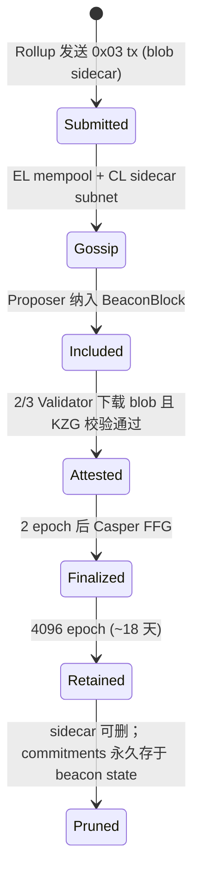

# 以太坊 Danksharding / EIP-4844

> **TL;DR**：Danksharding 是以太坊的数据可用性扩展蓝图，由 Dankrad Feist 2021 年提出。第一阶段 **Proto-Danksharding（EIP-4844）** 于 **2024-03-13 Dencun 硬分叉**激活——引入新的交易类型 `BLOB_TX_TYPE(0x03)`，每个区块最多附带 6 个 blob（每 blob 128 KB = ~0.75 MiB/block），blob 不进入 EVM 状态、数据由共识层保留 **18 天**，并用 **KZG 承诺**绑定到区块头。效果：L2 发布成本下降 95%+。第二阶段 **PeerDAS（EIP-7594）** 将在 **Fusaka 硬分叉**（2026 规划）引入"列采样"DAS，让轻客户端和 validator 都无需下载全部 blob。终局是 **Full Danksharding**：~16 MiB/block（128 blob / block）的数据可用性带宽，预计 2027–2028。

---

## 1. 背景与动机

"Rollup-centric Roadmap"（Vitalik, 2020-10）确立了 Ethereum 的新定位：**L1 只做结算 + DA，执行交给 L2**。但早期 Rollup 将 batch 放入 calldata，每字节 16 gas → 一条 Arbitrum tx 在 L1 数据成本 ~\$0.5。若 TPS 扩张，L1 数据费会把 L2 费用吞没。

**Sharding 的历史曲折**：2017–2020 年间，Ethereum 规划过多种 Sharding（Phase 1 data shards、Phase 2 execution shards），复杂度极高。2021 年 Dankrad Feist 提出 [Proto-Danksharding](https://notes.ethereum.org/@vbuterin/proto_danksharding_faq) + **Danksharding**，核心思想：
- 先引入 **blob 类型交易**（不在 EVM 里暴露 blob 内容，只暴露其 KZG commitment）——"proto"意为前置；
- 再用 **二维 KZG + DAS + PBS** 把 DA 吞吐扩到 ~16 MiB/block；
- 无需再单独的"data shard"链，所有 blob 嵌入 beacon block。

2022-02 EIP-4844 draft；2023 年 Devnet 多轮测试；2024-03 Dencun 主网激活。

**动机**：以"渐进式"而非"分片巨变"迭代 DA 能力；兼容现有 L2 代码，只需把 batch 从 calldata 改为 blob；与 EigenDA / Celestia 等替代方案**在安全与吞吐上形成差异化**（最强安全、最低吞吐、未来 DAS 补齐）。

## 2. 核心原理

### 2.1 形式化定义：Blob、KZG、Versioned Hash

**Blob**：固定 $4096$ 个 BLS12-381 field element，每 field element 编码 32 字节，共 $4096 \times 32 = 131072$ B = **128 KiB**。

Blob 被视为多项式 $f(x) \in \mathbb{F}_r[x]$ 的 evaluation form：$f(\omega^i) = b_i$，$\omega$ 是 4096 次单位根。

**KZG commitment**：$C = [f(\tau)]_1 \in \mathbb{G}_1$，来自 **Ethereum KZG Ceremony**（"Powers of Tau"，14 万+ 参与者，2023 年完成）。

**Versioned Hash**：EVM 侧不直接处理 BLS G1 点；用 `VERSIONED_HASH_VERSION_KZG (0x01) || SHA256(C)[1:]` 把 32 字节哈希存入交易的 `blob_versioned_hashes` 字段。EVM 通过新指令 `BLOBHASH(idx)` 访问。

### 2.2 Blob Transaction 格式（EIP-4844）

```
tx_type = 0x03
payload = rlp([chain_id, nonce, max_priority_fee, max_fee,
               gas_limit, to, value, data, access_list,
               max_fee_per_blob_gas, blob_versioned_hashes, y_parity, r, s])
sidecar = (blobs[], commitments[], proofs[])
```

`sidecar` 只在网络 P2P 层传输，**不进入执行层状态**。共识层在 `BeaconBlockBody.blob_kzg_commitments` 中保留 commitments，数据 sidecar 单独通过 `blob_sidecar_*` gossip topic 传播。**保留期 MIN_EPOCHS_FOR_BLOB_SIDECARS_REQUESTS = 4096 epochs ≈ 18 天**；之后节点可删除。

### 2.3 子机制拆解

**(1) Blob Gas 市场（独立费用市场）**
- 独立于普通 gas 的第二维费用市场（EIP-1559 风格）。
- 每个 blob 固定消耗 `GAS_PER_BLOB = 2^17 = 131072` blob gas。
- `target_blob_gas_per_block = 3 * GAS_PER_BLOB`（目标 3 blob），`max = 6 * GAS_PER_BLOB`。
- `excess_blob_gas` 在每块后更新；`blob_base_fee = fake_exponential(MIN_BASE_FEE_PER_BLOB_GAS, excess_blob_gas, BLOB_BASE_FEE_UPDATE_FRACTION)`。
- `blob_base_fee` **全部销毁**（与 EIP-1559 base fee 同）。

**(2) KZG Point Evaluation Precompile (0x0A)**
新预编译 `0x0A`，ZK Rollup 的欺诈/有效性证明在验证时需要：
```
input: versioned_hash (32) || z (32) || y (32) || commitment (48) || proof (48)
output: 若验证成功，返回 FIELD_ELEMENTS_PER_BLOB || BLS_MODULUS，Gas 50000
```
验证 `f(z) = y`，其中 $f$ 是承诺 `commitment` 所对应的多项式。Optimistic Rollup 的 dispute game 可用它证明某个 blob 某个点的值。

**(3) P2P 层：Blob Sidecar Gossip**
新 topic `blob_sidecar_{subnet_id}`；attester 在验证区块时需下载该区块的所有 blob sidecar 以确认 KZG proof 校验通过。**目前（4844）validator 下载全部 blob**——这是 Proto-Danksharding 的限制，也是 PeerDAS 要解决的瓶颈。

**(4) PeerDAS（EIP-7594）**
将 blob 做 1-D RS 扩展为 `2 × FIELD_ELEMENTS_PER_BLOB` 的多项式，然后分成 `NUMBER_OF_COLUMNS = 128` 列。每个 validator **只订阅一部分列**（`CUSTODY_REQUIREMENT = 4` 列），通过 gossip subnets 同步。**轻客户端采样 $k$ 个随机列** 即可高置信度确认 DA。
- 单 validator 带宽从 ~0.75 MiB/block → ~24 KiB/block（128 列中 4 列）。
- 可扩容 blob 上限到 48 甚至 128。

**(5) Full Danksharding 的 2-D KZG**
将 blob 排成 $256 \times 128$ 矩阵，行列各自 RS 编码 + KZG commitments；由 **Proposer-Builder Separation** 承担大数据的编码工作；validator/轻客户端只采样少量 cells。目标：`TARGET_BLOBS_PER_BLOCK = 64`、`MAX = 128`，吞吐 ~16 MiB/block。

**(6) PBS（Proposer-Builder Separation）**
为了不让 validator 承担构造大 blob 的工作，Builder 竞价提交包含 blob 的 payload；Proposer 签发承诺，Validator 仅需 DAS 验证可用性。目前 mev-boost 生态是 PBS 的雏形，未来 ePBS / EIP-7732 将入协议。

### 2.4 参数与常量

| 参数 | Proto-Danksharding (Dencun) | PeerDAS (Fusaka 预期) | Full Danksharding |
| --- | --- | --- | --- |
| Field elements / blob | 4096 | 4096 | 4096 |
| Blob 大小 | 128 KiB | 128 KiB | 128 KiB |
| Target blobs / block | 3 | 6–9 | 64 |
| Max blobs / block | 6 | 12–18 | 128 |
| Validator 下载量 | 全部 blob (~0.75 MiB) | 部分列 (~24 KiB) | 部分 cell (~64 KiB) |
| KZG Curve | BLS12-381 | BLS12-381 | BLS12-381 |
| 保留期 | 4096 epochs (18 天) | 不变 | 不变 |
| Versioned Hash version | 0x01 | 0x01 | 0x01 |

### 2.5 边界条件与失败模式

1. **Blob Fee Spike**：L2 集中提交时，`blob_base_fee` 指数上涨，可能在几分钟内从 1 wei 涨至 100 gwei（历史高峰 2024-Q2 曾达 \$5/blob）。解决：PeerDAS 提升容量。
2. **Validator 带宽不足**：home staker 在 3 blob 常态下已接近上限；若不实施 PeerDAS，target 提到 6 会使部分节点掉队。
3. **Blob 过期丢失**：18 天后 blob 可删；Rollup 欺诈证明期若长于 18 天需自己持久化数据（许多 L2 存 Arweave/IPFS 备份）。
4. **KZG Trusted Setup 攻击**：理论上 $\tau$ 泄露可伪造 point evaluation proof；Ethereum Ceremony 要求单人诚实。
5. **Builder 垄断**：PBS 依赖少数 builder，若合谋可审查 blob 交易。
6. **Proto-Danksharding 下 DAS 不可用**：当前 Dencun 下 validator 必须下载全量 blob；轻客户端无法 DAS 验证。

### 2.6 图示



```
区块头视角：
BeaconBlockBody {
  ...
  execution_payload { blob_versioned_hashes: [H...] },
  blob_kzg_commitments: [C1, C2, ..., Cn]  // n ≤ MAX_BLOBS_PER_BLOCK
}
BlobSidecar { index, blob, kzg_commitment, kzg_proof,
              signed_block_header, kzg_commitment_inclusion_proof }
```

## 3. 架构剖析

### 3.1 分层视图

1. **执行层（EL）**：识别 `tx_type = 0x03`、校验 `blob_versioned_hashes`、收取 blob gas、提供 `BLOBHASH` opcode 和 `point_evaluation` 预编译。
2. **共识层（CL）**：承载 `blob_kzg_commitments`、在 block validation 时校验 `kzg_commitments_merkle_root` 与 `execution_payload` 的 versioned hash 匹配。
3. **P2P 层**：EL 处理 blob tx 广播；CL 处理 blob sidecar 的 gossip 与 req/resp。
4. **Beacon API**：`/eth/v1/beacon/blob_sidecars/{block_id}` 供 rollup、分析者读取。
5. **Rollup Integration**：`eth_sendRawTransaction` 接收 0x03 tx；`eth_getBlobsByVersionedHash`（EIP-7742 规划中）。

### 3.2 核心模块清单（go-ethereum + Prysm/Lighthouse 示例）

| 层 | 模块 | 职责 |
| --- | --- | --- |
| EL (geth) | `core/types/tx_blob.go` | Blob tx 结构体、编码解码 |
| EL | `core/txpool/blobpool/` | 独立 blob mempool |
| EL | `crypto/kzg4844/` | KZG 验证、c-kzg-4844 绑定 |
| EL | `core/vm/contracts.go` | `0x0A` point evaluation precompile |
| EL | `core/evm.go` | `BLOBHASH` opcode |
| CL (prysm) | `consensus-types/blocks/block.go` | `BlobKZGCommitments` 字段 |
| CL (prysm) | `beacon-chain/p2p/pubsub/subnets/blob.go` | Sidecar gossip |
| CL | `beacon-chain/sync/validate_blob.go` | KZG 校验 + inclusion proof |
| 共享 | [c-kzg-4844](https://github.com/ethereum/c-kzg-4844) | 官方 C 库，Go/Rust/Python 绑定 |
| Rollup | `op-batcher`, `nitro/batchposter` | 构造 blob tx 提交 |

### 3.3 数据流 / 生命周期

一个 Arbitrum 批次 blob 的完整路径：

1. **t=0**：`batch-poster` 序列化 L2 batch → 调用 `web3.sendBlob(blobs, commitments, proofs)`。SDK 调 `c-kzg-4844 blob_to_kzg_commitment` + `compute_blob_kzg_proof`。
2. **t=+1s**：EL 节点接收 0x03 tx；校验 `blob_versioned_hashes[i] == versioned_hash(commitments[i])` 与 KZG proof → 进 blob mempool。
3. **t=+6–12s**：下一个 Proposer 从 mempool 选取 blob tx（受 blob gas 市场约束），塞入区块；CL 的 block 生成 `BlobSidecar` 通过 subnet 广播。
4. **t=+6–12s**：Attester 收到 sidecar → 验证 KZG → 投票。2/3 commit → `head` 更新。
5. **t=+12–24s**：下一 slot 开始。
6. **t=+12min (2 epoch)**：Casper FFG finalize 包含该 blob 的 block。
7. **t=+18 天**：sidecar 过期，节点可 prune。
8. **Optimistic Rollup** 在 challenge 期间可随时调 `0x0A` 预编译证明"blob 中 point z 的 y 值"；ZK Rollup 可在 L1 verifier 合约里做同样的 point eval（已用于 EigenDA-proxy 等）。

### 3.4 客户端多样性 / 参考实现

- **EL**：geth、nethermind、besu、erigon、reth — 均已完整支持 EIP-4844。
- **CL**：prysm、lighthouse、teku、nimbus、lodestar — 均已支持。
- **c-kzg-4844**：核心 KZG 库，Ethereum Foundation 维护，已审计（Veridise）。
- **constantine**：Status 的 Nim 实现，Nimbus 使用。
- 客户端多样性在 DA 领域最好。

### 3.5 扩展 / 互操作接口

- `eth_sendRawTransaction`：接收 0x03 tx（需附 sidecar）。
- `eth_getBlobBaseFee`（RPC）。
- `/eth/v1/beacon/blob_sidecars/{block_id}?indices=0,1,2`：Beacon API 读取 blob。
- `BLOBHASH(i)`（opcode 0x49）：访问当前 tx 的 versioned hash。
- `0x0A` 预编译：point evaluation。
- `engine_getBlobsV1`（EIP-7685 衍生）：CL → EL 查询 blob，减少 P2P 冗余。

## 4. 关键代码 / 实现细节

**Blob transaction 结构体**——[`core/types/tx_blob.go`](https://github.com/ethereum/go-ethereum/blob/master/core/types/tx_blob.go)：

```go
type BlobTx struct {
    ChainID    *uint256.Int
    Nonce      uint64
    GasTipCap  *uint256.Int
    GasFeeCap  *uint256.Int
    Gas        uint64
    To         common.Address
    Value      *uint256.Int
    Data       []byte
    AccessList AccessList
    BlobFeeCap *uint256.Int
    BlobHashes []common.Hash // versioned hashes
    Sidecar    *BlobTxSidecar `rlp:"-"` // 网络层字段
    V, R, S    *uint256.Int
}

type BlobTxSidecar struct {
    Blobs       []kzg4844.Blob       // 4096 * 32 字节
    Commitments []kzg4844.Commitment // 48 字节 G1
    Proofs      []kzg4844.Proof      // 48 字节
}
```

**Point Evaluation Precompile 实现**——[`core/vm/contracts.go`](https://github.com/ethereum/go-ethereum/blob/master/core/vm/contracts.go)（简化）：

```go
type kzgPointEvaluation struct{}

func (b *kzgPointEvaluation) Run(input []byte) ([]byte, error) {
    if len(input) != 192 { return nil, errBlobVerifyInvalidInputLength }
    var (
        versionedHash = common.Hash(input[:32])
        z, y          = kzg4844.Point(input[32:64]), kzg4844.Claim(input[64:96])
        commitment    = kzg4844.Commitment(input[96:144])
        proof         = kzg4844.Proof(input[144:192])
    )
    // 1. 校验 commitment 对应 versionedHash
    if kZGToVersionedHash(commitment) != versionedHash {
        return nil, errBlobVerifyMismatchedVersion
    }
    // 2. 验证 e(commitment - [y]_1, [1]_2) == e(proof, [τ - z]_2)
    if err := kzg4844.VerifyProof(commitment, z, y, proof); err != nil {
        return nil, err
    }
    // 3. 成功返回 FIELD_ELEMENTS_PER_BLOB || BLS_MODULUS
    return append(blobPrecompileReturnValue[:32:32], blobPrecompileReturnValue[32:]...), nil
}
```

**blob_base_fee 更新规则**——[`consensus/misc/eip4844/eip4844.go`](https://github.com/ethereum/go-ethereum/blob/master/consensus/misc/eip4844/eip4844.go)：

```go
func CalcExcessBlobGas(parentExcess, parentBlobUsed uint64) uint64 {
    excess := parentExcess + parentBlobUsed
    if excess < params.BlobTxTargetBlobGasPerBlock { return 0 }
    return excess - params.BlobTxTargetBlobGasPerBlock
}
// blob_base_fee = fake_exponential(MIN_BASE_FEE_PER_BLOB_GAS, excessBlobGas, BLOB_BASE_FEE_UPDATE_FRACTION)
```

## 5. 演进与版本对比

| 阶段 | 时间 | 核心 EIP | 关键特征 |
| --- | --- | --- | --- |
| Proto-Danksharding 提案 | 2021-02 Dankrad 博文 | — | 概念提出 |
| EIP-4844 draft | 2022-02 | EIP-4844 | Blob tx 雏形 |
| Devnet 1–10 | 2022–2023 | — | 多轮跨客户端测试 |
| **Dencun（Cancun+Deneb）** | **2024-03-13** | EIP-4844, EIP-4788, EIP-1153, EIP-5656, EIP-6780 | 主网 Proto-Danksharding 上线 |
| Pectra（Prague+Electra） | 2025-05 | EIP-7691 | Blob target 3→6, max 6→9 |
| **Fusaka**（计划） | 2026 | EIP-7594 PeerDAS, EOF 套件 | 列采样 DAS，单 validator 带宽解耦 |
| Osaka+（长期） | 2027–2028 | Full Danksharding | 2-D KZG、~16 MiB/block |

**历史实测（2024-Q2 ~ 2026-Q1）**：主流 L2 平均每笔交易 DA 成本从 \$0.05–\$0.2 降至 \$0.001–\$0.01，极端峰值（2024-06 Blob 拥堵）\$0.15。

## 6. 实战示例

**用 `web3.js` 发送 blob tx**：

```js
import { Web3 } from "web3";
import { loadKZG } from "kzg-wasm";

const kzg = await loadKZG();
const web3 = new Web3("https://rpc.mevblocker.io");
const blob = "0x" + "00".repeat(131072 - 4) + "deadbeef"; // 128 KiB
const commitment = kzg.blobToKZGCommitment(blob);
const proof = kzg.computeBlobKZGProof(blob, commitment);
const versionedHash = "0x01" + web3.utils.sha256(commitment).slice(4);

const signed = await web3.eth.accounts.signTransaction({
  type: "0x3",
  chainId: 1,
  to: "0x0000000000000000000000000000000000000000",
  maxFeePerGas: "30000000000",
  maxPriorityFeePerGas: "1000000000",
  maxFeePerBlobGas: "100000000",
  gasLimit: "21000",
  blobVersionedHashes: [versionedHash],
  blobs: [blob],
  kzgCommitments: [commitment],
  kzgProofs: [proof],
}, PRIVATE_KEY);
await web3.eth.sendSignedTransaction(signed.rawTransaction);
```

**通过 Beacon API 读取 blob**：

```bash
curl https://beacon.lighthouse.sigp.io/eth/v1/beacon/blob_sidecars/head | jq '.data[0].kzg_commitment'
```

## 7. 安全与已知攻击

1. **KZG Trusted Setup**：$\tau$ 若泄露可伪造任意 proof；Ethereum Ceremony 2022-11 → 2023-04 完成，14 万+ 参与者，单人诚实即可。
2. **Blob Fee Griefing**：攻击者通过大量 blob tx 推高 blob base fee 迫使 L2 付费。由于 blob base fee 独立于 gas，缓解有限；解决依赖扩容。
3. **Reconstruction Failure Under Net Partition**：PeerDAS 阶段，若网络分区使某几列对所有订阅节点都不可达，则 DA 失败。方案：冗余订阅 + 多路径请求。
4. **c-kzg-4844 0-day**：2024-02 审计发现一处非关键边界 bug（已修）；2025-Q2 社区完成 formal spec。
5. **Blob Censorship by Builders**：OFAC 制裁地址 blob tx 在部分 relay 被审查；社区推广抗审查 relay（Agnostic, Ultrasound）。
6. **已公开事件**：Dencun 主网 2024-03-13 上线后首周 Blob base fee 稳定在 1 wei；2024-06 Ethena、Blob-inscription 热潮使 Blob fee 数小时飙至 >100 gwei；无协议事故。

## 8. 与同类方案对比

| 维度 | Ethereum Danksharding | Celestia | EigenDA | Avail |
| --- | --- | --- | --- | --- |
| 安全 | Ethereum L1 PoS | 独立 PoS + DAS | Ethereum Restake | 独立 PoS + DAS |
| 承诺 | KZG | Merkle NMT | KZG | KZG |
| 当前带宽 | ~0.75 MiB/12s | ~8 MiB/12s | ~15 MB/s | ~2 MiB/20s |
| 未来带宽 (2027+) | ~16 MiB/12s | ~64 MiB/12s | ~100 MB/s | ~128 MiB/20s |
| 轻客户端可 DAS | PeerDAS 后是 | 是 | 否 | 是 |
| 费用（2026-Q1） | \$0.01–\$0.15 / Blob | \$0.002 / MiB | \$0.0005 / MiB | \$0.001 / MiB |
| 与 L2 契合度 | 原生 | 需 Blobstream | 需 eigenda-proxy | 需 Vector |
| 已集成 Rollup | 全部主流 L2 | 60+ | 20+ | 10+ |

**trade-off 评价**：Ethereum DA 的安全最强但容量最小；使用 alt-DA 可降本但牺牲经济安全或引入复杂度。多数 L2 采取 hybrid：default Ethereum blob，压力期切换到 alt-DA。

## 9. 延伸阅读

- **一手源**
  - EIP-4844：<https://eips.ethereum.org/EIPS/eip-4844>
  - EIP-7594 (PeerDAS)：<https://eips.ethereum.org/EIPS/eip-7594>
  - EIP-7691 (Pectra Blob bump)：<https://eips.ethereum.org/EIPS/eip-7691>
  - Proto-Danksharding FAQ：<https://notes.ethereum.org/@vbuterin/proto_danksharding_faq>
  - Roadmap：<https://ethereum.org/en/roadmap/danksharding/>
  - consensus-specs blob 部分：<https://github.com/ethereum/consensus-specs/blob/dev/specs/deneb>
  - c-kzg-4844：<https://github.com/ethereum/c-kzg-4844>
- **权威博客**
  - Dankrad Feist 专栏：<https://dankradfeist.de/ethereum/>
  - Vitalik on DAS & danksharding：<https://vitalik.eth.limo>
  - a16z "On 4844"：<https://a16zcrypto.com/posts/article/eip-4844-explained/>
- **视频**：Devcon Bogotá/Bangkok "Danksharding" 演讲；EthStaker blob 节点调优系列。
- **相关标准**：EIP-4788（beacon root in EVM）、EIP-7685（system ops, 与 PeerDAS 的 precompile 预留）。

## 10. 术语表

| 术语 | 英文 | 释义 |
| --- | --- | --- |
| Blob | Blob | 128 KiB 的数据块，EIP-4844 引入 |
| KZG 承诺 | KZG Commitment | BLS12-381 上的多项式承诺 |
| 受版本哈希 | Versioned Hash | `0x01 \|\| sha256(commitment)[1:]` |
| 数据可用性采样 | DAS | 轻节点随机采样以概率性确认 DA |
| Proto-Danksharding | EIP-4844 | Danksharding 的第一步 |
| PeerDAS | EIP-7594 | Validator 列采样 DA |
| Full Danksharding | — | 2-D KZG 最终形态 |
| 提议者-构造者分离 | PBS | Proposer 与 Builder 职责分离 |
| Blob Gas | Blob Gas | 独立费用市场维度 |
| 点求值预编译 | Point Evaluation Precompile | 地址 0x0A，验证 KZG proof |

---

*Last verified: 2026-04-22*
