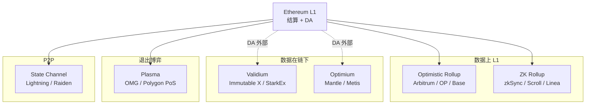
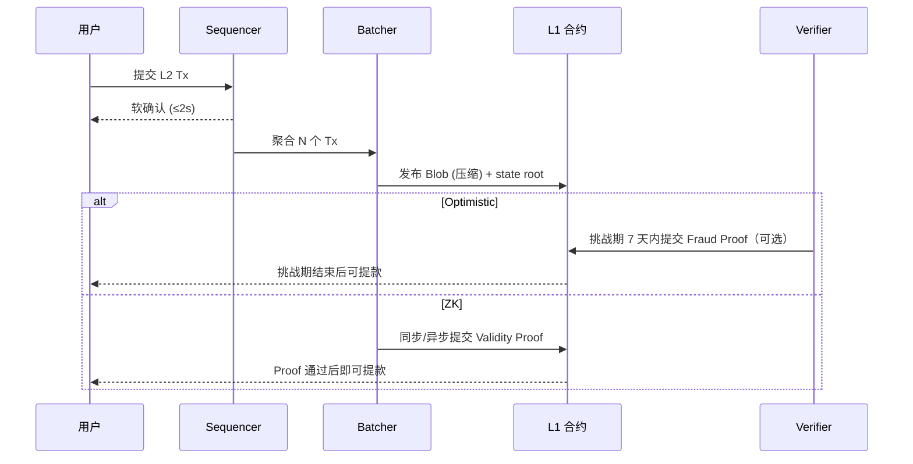

# Layer 2 总览（Layer 2 Scaling Overview）

> **TL;DR**：Layer 2（L2）是构建在 Ethereum（L1）之上、继承其安全性与数据可用性、同时把执行放到链下的扩容协议族。核心价值公式是 **"把执行搬出去，把状态承诺留下来"**。2024 年 3 月 EIP-4844 Blob 上线后，L1 数据发布费用骤降 90–99%，直接把 L2 用户交易费从美元级拉到几美分级。L2BEAT 截至 2026-04 追踪 60+ 条主流 Rollup，聚合 TVL 长期稳定在 $400–500 亿 区间，已系统性超越多数 Alt-L1。L2 按安全模型分 **Optimistic Rollup / ZK Rollup / Validium / Optimium / Plasma / State Channel**；按成熟度则按 L2BEAT 提出的 **Stage 0 / 1 / 2** 三级评级演进。本文给出全景地图、路线对比、Stage 演进方法论、数据现状与关键风险。

---

## 1. 背景与动机

Ethereum L1 的设计基线是 **"单一全球复制状态机 + 图灵完备 EVM"**，所有全节点都要重放每一笔交易才能独立验证状态根。这带来两个硬性瓶颈：

1. **吞吐天花板**：EIP-1559 目标 gas 15M / 上限 30M，折合稳定 ~15 TPS（ERC-20 转账）；历史上最高 ~45 TPS。
2. **Gas 定价机制放大**：当需求 > 目标 15M gas 时，base fee 每块 +12.5% 指数上涨，在 NFT Mint 和 MEME 高峰能把单笔转账打到 $50–$200。

Vitalik 在 2020-10 的 [Rollup-centric roadmap](https://ethereum-magicians.org/t/a-rollup-centric-ethereum-roadmap/4698) 中将扩容哲学锁定为 **"L1 只做结算与数据可用性（DA），吞吐由 L2 承担"**。这是一次架构取舍：放弃在 L1 做分片执行（Execution Sharding，2017–2020 的 Eth2.0 原方案），改为 **只分片数据（Data Sharding / Danksharding）**、把执行完全外移。

其动机可从"不可能三角"视角理解：

| 维度 | L1 本身 | L2 扩容 |
| --- | --- | --- |
| 去中心化 | 节点门槛（Geth + 32 ETH）可普及 | 继承 L1 DA，但 Sequencer 多为单点 |
| 安全 | Gasper + 数十万 Validator | 继承 L1 结算终局；Fraud / Validity Proof 保证正确性 |
| 可扩展性 | ~15 TPS 硬顶 | 理论上 10,000+ TPS，DA 是当前瓶颈 |

L2 方案谱系（按上链数据量 + 证明方式）：

- **Rollup**：全部 Tx 数据发布到 L1（calldata 或 blob）；用 Fraud Proof（Optimistic）或 Validity Proof（ZK）证明状态转换。
- **Validium**：ZK 证明 + 数据在链下（DAC / Celestia / EigenDA）。
- **Optimium**：Fraud Proof + 数据在链下。
- **Plasma**：靠 Exit Game 退出到 L1，不把全部数据上链（已过时，2024 有 Plasma Next 复兴尝试）。
- **State Channel / Lightning**：点对点 off-chain，需双方在线签名。

## 2. 核心原理

### 2.1 形式化定义：Rollup 的状态承诺函数

一个 Rollup 可形式化为四元组 $(S, \delta, \pi, C)$：

- $S$：L2 状态集合；$S_0$ 为创世状态。
- $\delta: S \times \text{Tx}^* \rightarrow S$：状态转换函数（通常等价于 EVM）。
- $\pi$：证明系统；给定 $(S_i, S_{i+1}, B_i)$，其中 $B_i$ 是该 Batch 的交易列表，证明 $\delta(S_i, B_i) = S_{i+1}$。
- $C$：L1 合约，存储 `stateRoot`、验证 $\pi$、处理充提。

**核心不变式**：对每个 L2 Batch $B_i$，必须满足：

$$\text{DA}(B_i) = \text{true} \wedge \pi(S_i, S_{i+1}, B_i) = \text{true}$$

即 **数据可用 + 转换正确**。Rollup 两大流派即 $\pi$ 的两种实现：

- **Optimistic**：$\pi$ 是交互式欺诈证明；默认接受，挑战期 $\Delta$（Arbitrum / Optimism 均为 7 天）内任何人可提交反例。
- **ZK（Validity）**：$\pi$ 是简洁非交互零知识证明（SNARK / STARK）；区块提交时一次性验证，无挑战期。

### 2.2 关键数据结构与算法

**Batch 结构**（以 Optimism Bedrock 为例）：

```text
Batch = (
  parentHash,                  // L2 上一个 Batch 的 hash
  epochNumber,                 // 对应的 L1 block number
  epochHash,
  timestamp,
  transactions[] (RLP),        // 压缩后的 L2 tx 列表
)
```

Batch 被打包成 **Channel Frame**，经 zlib 压缩，切成 ≤ 128KB 的 Frame 放入 L1 Blob。

**状态承诺**：多数 L2 使用 Ethereum 风格的 **Merkle-Patricia Trie**（MPT）；zkSync Era 则用 **Sparse Merkle Tree（SMT）** 以便电路友好。

**Fraud Proof 的二分交互算法**（Arbitrum BoLD / OP Cannon）：

```text
1. Asserter 宣称 S_i → S_{i+1} 经 N 步 VM 执行
2. Challenger 不同意，选择中点 m = N/2
3. Asserter 公布 S_m 的 hash
4. 双方对 (0, m) 或 (m, N) 区间继续二分
5. 直到 N=1，即一条 VM 指令的结果分歧
6. 在 L1 合约上重放这一条指令（One-Step Proof）
```

时间复杂度 $O(\log N)$，N 可达 $10^{10}$ 量级。

### 2.3 六大子机制拆解

1. **Sequencer（排序器）**：接收用户交易、排序、生成 L2 块，提供软确认（通常 < 2 秒）。多数 L2 目前是单 Sequencer，是去中心化最弱环节。
2. **Batcher（批处理器）**：周期性地把 L2 Tx 列表压缩并发到 L1（calldata 或 Blob）。Batcher 失败 = L2 数据不可用。
3. **Proposer / State Submitter**：向 L1 提交 state root，触发挑战期（OP）或提交 Validity Proof（ZK）。
4. **证明系统**：Fraud Proof（OP Cannon / Nitro WASM）或 SNARK / STARK Prover（ZK）。
5. **L1 Contract Suite**：`Rollup.sol`（或 `L1CrossDomainMessenger`）+ `Inbox` + `Outbox` + `L1StandardBridge`，负责充值、提款、state root 存储、证明验证。
6. **Verifier Nodes**：任何人运行 L2 全节点即可独立校验（OP）或信任 SNARK（ZK）。抗审查的关键。

### 2.4 关键参数

| 参数 | Optimistic Rollup | ZK Rollup |
| --- | --- | --- |
| 挑战期 | 7 天（Arbitrum / OP） | 0（证明即终局） |
| L1 结算延迟 | 7 天（Fast Withdrawal 借桥可 < 1h） | 1–12 小时（取决于 Prover 频率） |
| Sequencer 出块 | 250ms–2s 软确认 | 同 OP |
| L1 提交频率 | 每 1–10 分钟一批 | 每 1–12 小时一批 |
| 单证明成本 | 低（Fraud 仅失败时执行） | 高（$0.1–$5 Gas / block，GPU 硬件需求高） |
| 客户端状态膨胀 | 与 L1 同级 | SMT，更适合 ZK |

### 2.5 边界条件与失败模式

- **Sequencer 宕机**：软确认停止。设计良好的 L2 提供 **Force Inclusion**——用户直接向 L1 Inbox 提交交易，绕开 Sequencer 数小时内强制上链。
- **Batcher 审查**：不提交数据到 L1。用户可通过 L1 Bridge 直接触发 Withdrawal / Exit。
- **Prover 故障（ZK）**：证明长时间不产生 → 状态不前进。用户资金仍安全（Sequencer 无法伪造无证明的状态），但流动性冻结。
- **Fraud Proof 不可用期（OP）**：多数 OP Rollup 在 2024 之前是 "name only"，没有激活的 Permissionless Fraud Proof。这是 L2BEAT Stage 0 的典型特征。
- **DA 不可用（Validium）**：若链下 DAC / Celestia 崩溃，Validity Proof 仍成立但状态无法恢复，资金被锁——这是 Validium 的主要风险。

### 2.6 路线分布图





## 3. 架构剖析

### 3.1 分层视图

自顶向下 5 层：

1. **Wallet / RPC 层**：MetaMask / Rabby 配置 chainId，通过 L2 RPC（如 `https://arb1.arbitrum.io/rpc`）签名交易。
2. **Sequencer 层**：接收、排序、执行 L2 Tx；输出软确认。架构上通常是一个魔改的 Geth / Reth / Erigon。
3. **Batcher & Proposer 层**：异步从 Sequencer 拉取已执行的 Block，生成 Batch + 压缩 + 上 L1。
4. **Prover / Challenger 层**：ZK 系生成证明（GPU 集群）；OP 系运行 Verifier 节点监控。
5. **L1 Contract 层**：承载最终结算、桥、proof 验证。

### 3.2 核心模块清单

以通用 L2 架构抽象，映射到 OP Stack / Nitro / zkSync Era 的实际目录：

| 模块 | 职责 | OP Stack | Nitro | zkSync Era | 可替换性 |
| --- | --- | --- | --- | --- | --- |
| Execution Engine | 执行 EVM | `op-geth` | `nitro/go-ethereum` | `zksync-era/core`（EraVM） | 低 |
| Rollup Node | 驱动 Sequencer | `op-node` | Nitro Node | `zksync-era/state-keeper` | 低 |
| Batcher | L2→L1 数据提交 | `op-batcher` | `batchposter` | `eth-sender` | 中（可接 Alt-DA） |
| Proposer | 提交 state root | `op-proposer` | `validator` | `commitment-generator` | 低 |
| Prover | 生成证明 | `cannon`（Fraud） | `nitro/validator`（Fraud） | `zksync-prover`（ZK） | 证明系统可换（SNARK↔STARK） |
| Bridge Contract | L1↔L2 资产跨桥 | `L1StandardBridge` | `L1ERC20Gateway` | `L1SharedBridge` | 中 |
| Verifier | 校验证明 | `L2OutputOracle` + `FaultDisputeGame` | `Rollup.sol` | `Executor.sol` | 低 |
| Data Availability | DA 后端 | L1 Blob / Alt-DA | L1 Blob / AnyTrust | L1 Blob / Validium | 高（可插拔） |

### 3.3 端到端数据流

一笔 Arbitrum One 转账从用户按下 "Send" 到 L1 Finalized 的全程：

```text
T+0ms    MetaMask → Sequencer RPC：eth_sendRawTransaction
T+50ms   Sequencer 做 mempool + fee check，执行 EVM，产出 block N
T+250ms  Sequencer 广播软确认给用户（wallet 显示 Confirmed ×1）
T+1–2m   Batcher 从 Sequencer 拉 block N，与前后块聚合为 Batch，压缩，发布到 L1 Blob
T+15m    L1 区块被 Finalized（两 epoch = 12.8 分钟）→ Rollup "Safe"
T+1–24h  Proposer 将 state root 上链（OP：立即；Validity：等 Prover）
T+7d     (OP 专属) 挑战期结束 → Withdrawal 可在 L1 提现
```

可观测性点：Etherscan L1 看 Batcher 地址；Arbiscan / Optimistic Etherscan 看 L2；L2BEAT 看 DA + Stage。

### 3.4 客户端多样性

- **OP Stack**：op-geth（fork），op-node；Conduit、Kroma、Blast、Base 均同源实现。**风险**：整条 Superchain 共用漏洞面。
- **Arbitrum Nitro**：nitro（go-ethereum fork）+ AnyTrust；单客户端。
- **zkSync Era**：Rust + Go 为主，`era-boojum` Prover。
- **Scroll**：基于 go-ethereum fork + Halo2 Prover。
- **Linea**：ConsenSys 客户端 + gnark Prover。

截至 2026-04，多数 L2 仍是 **单客户端**，客户端多样性远不如 L1。

### 3.5 扩展与互操作接口

- **JSON-RPC**：兼容 Ethereum，新增 `rollup_*`、`zks_*` 等前缀方法。
- **Messenger 合约**：`sendMessage(target, data)` 跨层调用。
- **Bridge Standard**：ERC-20 双向桥通常用 `finalizeDeposit` / `initiateWithdrawal` 规范。
- **Shared Sequencer / Aggregation**：Espresso、Astria（OP 生态）、AggLayer（Polygon）试图跨 Rollup 同步。
- **Superchain Interop**：OP Stack 2025 推出的原子消息协议，延迟 < 1 块。

## 4. 关键代码 / 实现细节

**OP Stack 中 Batcher 打包的核心逻辑** — [`op-batcher/batcher/driver.go`](https://github.com/ethereum-optimism/optimism/blob/develop/op-batcher/batcher/driver.go)（commit `~2025-Q1`）：

```go
// 简化版：将 L2 block 聚合成 channel，切 frame，打包进 blob tx
func (l *BatchSubmitter) publishTxToL1(ctx context.Context) error {
    // 1. 从 channelManager 拉取下一帧
    txdata, err := l.state.TxData(l1tip.ID())
    if err == io.EOF {
        return nil // 无数据可发
    }
    // 2. 构造 Blob Tx（EIP-4844）
    candidate := l.calldataTxCandidate(txdata)
    if l.Config.UseBlobs {
        candidate, err = l.blobTxCandidate(txdata) // 最多 6 blob / tx
    }
    // 3. 通过 TxManager 上链（自动管理 nonce 与 gas bump）
    receipt, err := l.txMgr.Send(ctx, *candidate)
    return err
}
```

**L2BEAT Stage 评级**（官方 [l2beat/config/layer2s/](https://github.com/l2beat/l2beat/tree/main/packages/config/src/projects/layer2s)）核心定义：

```ts
// 简化版
export const stages = {
    'Stage 0': {
        // 存在可运行的 Rollup，但证明可能由多签 paused
        fraudProof: 'None or centralized',
        exitWindow: '<7d or controllable by council',
    },
    'Stage 1': {
        // 无需许可的证明、8/15 Security Council 可暂停
        fraudProof: 'Permissionless with >=5 external provers',
        exitWindow: '>=7d',
        councilSize: '>=8',
    },
    'Stage 2': {
        // 证明完全自主运行；Council 只能在 Bug 证据下暂停
        fraudProof: 'Fully permissionless, active for >=6mo',
        exitWindow: '>=30d',
        councilPower: 'Only emergency, with onchain proof of bug',
    },
} as const
```

## 5. 演进与版本对比

| 阶段 | 时间 | 里程碑 |
| --- | --- | --- |
| Plasma 时代 | 2017–2019 | OmiseGO、Loom；退出博弈复杂，逐步淘汰 |
| Optimistic PoC | 2020 | Optimism 测试网；首个 EVM 兼容 Rollup |
| 正式启动 | 2021 | Arbitrum One、Optimism 主网 |
| ZK 爆发 | 2022 | zkSync Era、StarkNet、Polygon zkEVM 主网 |
| **EIP-4844（Blob）** | **2024-03** | Rollup 费用下降 90–99%，Dune 日均 blob 使用从 < 100 升至 20,000+ |
| Fraud Proof 去中心化 | 2024–2025 | Arbitrum BoLD、OP Permissionless Fault Proofs 上线 |
| Shared Sequencer | 2025 | Espresso、Astria 主网；Superchain Interop |
| Pectra + BLS | 2025-05 | EIP-7002 / 7251 提高 L1 DA 容量 |
| Fusaka（规划） | 2026 | PeerDAS，Blob 容量翻倍，逼近 Full Danksharding |

## 6. 实战示例

**从 L1 充值 0.01 ETH 到 Arbitrum One**：

```ts
import { ethers } from "ethers"
// 1. 连接 L1
const l1 = new ethers.JsonRpcProvider(process.env.L1_RPC)
const wallet = new ethers.Wallet(process.env.PK, l1)
// 2. Arbitrum Inbox 合约（mainnet）
const inbox = new ethers.Contract(
    "0x4Dbd4fc535Ac27206064B68FfCf827b0A60BAB3f",
    ["function depositEth() payable returns (uint256)"],
    wallet,
)
// 3. 发起充值（Sequencer 一般 10 分钟内到账）
const tx = await inbox.depositEth({ value: ethers.parseEther("0.01") })
console.log("L1 tx:", tx.hash)
await tx.wait()
```

**用 L2BEAT Public API 查询 Stage**：

```bash
curl -s https://l2beat.com/api/data-availability.json | \
  jq '.[] | select(.name=="Arbitrum One") | {stage, da: .dataAvailability.mode}'
```

## 7. 安全与已知攻击

1. **2022-09 Optimism Wintermute**：白帽发现签名可重放，20M OP 被错发；协作返还。
2. **2022-02 Wormhole（Solana→Ether 桥）**：非 L2 桥，但提醒跨链桥是 L2 生态最大资金风险点（$325M 被黑）。
3. **2024-06 Linea Sequencer 暂停**：攻击事件中团队暂停 Sequencer 数小时，引发去中心化质疑。
4. **2024-03 Munchables on Blast**：L2 上层 dApp 私钥泄漏，$62M 被抽；Blast Sequencer 被部分社区要求回滚（最终未动）。
5. **ZK Circuit Bug 风险**：Polygon zkEVM 2023 年发现审计阶段电路漏洞（Proof of Exponentiation），未入主网；警示 **证明系统本身是 TCB（Trusted Computing Base）**。
6. **Bridge Front-End 仿冒**：Scroll / zkSync 启动期多次 DNS 劫持，用户资产被钓鱼。
7. **Council Multisig 系统性风险**：几乎所有 L2 都保留 Security Council（4–15 多签），理论上可升级合约抽走资金；Stage 0→2 演进的核心就是削弱此权限。

## 8. 与同类方案对比

| 维度 | Optimistic Rollup | ZK Rollup | Validium | Plasma | State Channel |
| --- | --- | --- | --- | --- | --- |
| DA 位置 | L1 Blob | L1 Blob | 链下 | 链下 | 点对点 |
| 证明 | Fraud Proof（7d） | Validity Proof（即时） | Validity Proof | Exit Game | 签名 + 挑战 |
| 提款延迟 | 7 天 | 1–12h | 1–12h | 1–2 周 | 挑战期 |
| EVM 等价性 | 高（Nitro / Bedrock） | 逐步（Type 1→4） | 同 ZK | 受限 | 无通用状态 |
| 成本 | 低（仅 Fraud 时执行） | 高（每 Batch 生成 SNARK） | 极低 | 极低 | 几乎零 |
| 成熟度 | 最成熟（L2BEAT Stage 1 最多） | 追赶中 | 边缘 | 退出主流 | 仅支付场景 |

## 9. 延伸阅读

- **官方**
  - Ethereum L2 索引：<https://ethereum.org/en/layer-2/>
  - L2BEAT：<https://l2beat.com>
  - EIP-4844：<https://eips.ethereum.org/EIPS/eip-4844>
  - Dune L2 Dashboard：<https://dune.com/hildobby/ethereum-l2s>
- **核心论文 / 博客**
  - Vitalik, *An Incomplete Guide to Rollups*：<https://vitalik.eth.limo/general/2021/01/05/rollup.html>
  - Vitalik, *Endgame*：<https://vitalik.eth.limo/general/2021/12/06/endgame.html>
  - Vitalik, *Possible futures of the Ethereum protocol*（2024）：<https://vitalik.eth.limo/general/2024/10/14/futures2.html>
  - Dankrad Feist on DA：<https://dankradfeist.de/ethereum/2021/02/14/why-stateless-ethereum.html>
- **研究机构**
  - Paradigm：<https://www.paradigm.xyz/writing>
  - a16z crypto：<https://a16zcrypto.com>
  - Messari Layer 2 季度报告
- **中文资料**
  - 登链社区 L2 专题：<https://learnblockchain.cn/tags/Layer2>
  - 慢雾 L2 安全：<https://www.slowmist.com>

## 10. 术语表

| 术语 | 英文 | 释义 |
| --- | --- | --- |
| 二层 | Layer 2, L2 | 继承 L1 安全性的扩容链 |
| 汇总 | Rollup | 把 Tx 数据发回 L1 的 L2 |
| 欺诈证明 | Fraud Proof | 事后挑战式的错误状态证明 |
| 有效性证明 | Validity Proof | 事前生成的 ZK 证明 |
| 数据可用性 | Data Availability, DA | 数据可被第三方下载重建 |
| 挑战期 | Challenge Window | OP Rollup 等待欺诈证明的时间 |
| 排序器 | Sequencer | 接单 + 出块的 L2 节点 |
| 证明器 | Prover | 生成 ZK 证明的（通常是 GPU）节点 |
| 阶段 | Stage | L2BEAT 定义的去中心化成熟度等级 |
| 强制包含 | Force Inclusion | 绕过 Sequencer 通过 L1 提交 Tx |

---

*Last verified: 2026-04-22*
