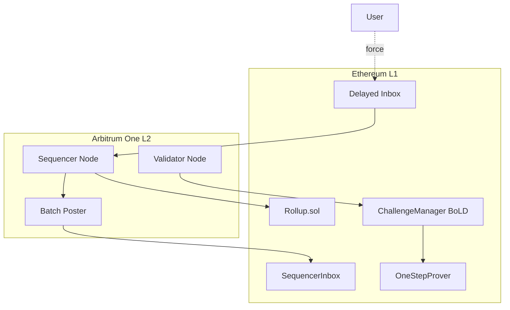
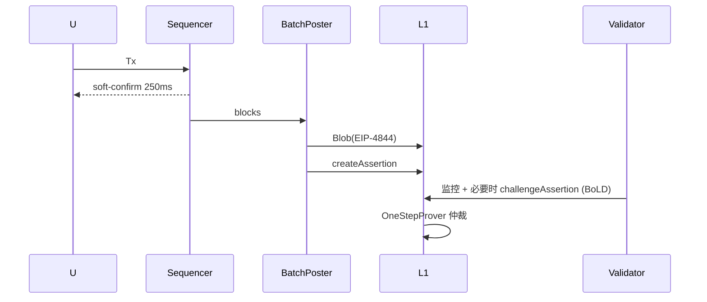

# Arbitrum（Nitro / Orbit / Stylus / BoLD）

> **TL;DR**：Arbitrum 由 Offchain Labs（普林斯顿团队，2018 创立）主导，是当前 L2 世界 TVL 与 DeFi 活跃度最高的 Optimistic Rollup。主力产品 **Arbitrum One**（通用 Rollup，2021-08 主网）+ **Arbitrum Nova**（AnyTrust DAC 链，面向游戏 / 社交）。核心引擎 **Nitro（2022-08）** 把 L2 执行层改造为 geth 的 fork，把欺诈证明的执行环境抽象为 **WAVM（WebAssembly VM）**。2024 年 Q4 上线 **BoLD**（Bounded Liquidity Delay），把 1v1 交互式欺诈证明升级为全球无许可的"All-vs-All"模型，让 Arbitrum 成为首个通过 L2BEAT Stage 1 的主流 Rollup。另有 **Stylus**（2024-08 主网）允许 WASM 合约（Rust / C / C++）与 EVM 同链共存；**Orbit** 让任何项目一键授权部署自定义 Arbitrum 链（Xai、DeGen、ApeChain 等数十条）。

---

## 1. 背景与动机

Offchain Labs 的学术血统来自 Ed Felten（前奥巴马白宫副首席技术官）等普林斯顿团队，长期研究计算证明。2018 年发布 Arbitrum 第一版论文《[Arbitrum: Scalable, private smart contracts](https://www.usenix.org/system/files/conference/usenixsecurity18/sec18-kalodner.pdf)》，提出"多方联合签名的乐观计算"思路。2020-10 主网 **Arbitrum Classic** 首次以 AVM 为核心运行；2022-08 完成 **Nitro 升级**，放弃 AVM，转用 geth fork + WASM 欺诈证明，兼容性、性能全面跃升。

Arbitrum 的关键立足点：

- **EVM 等价**（Nitro 之后）：合约无需重编译即可部署，Dev UX 接近 L1。
- **高性能**：约 40–250 ms 软确认，实测 TPS 可达 250+（实际活跃 ~20–40）。
- **去中心化路线最激进**：BoLD + Security Council 硬性 14/26 多签，是 L2BEAT Stage 1 评级最严格实现者之一。

## 2. 核心原理

### 2.1 形式化定义

Arbitrum 状态机记作 $(S, \delta_\text{WAVM})$，其中 $\delta_\text{WAVM}$ 是把 geth `core/state_processor` 编译为 **WAVM**（确定性 WebAssembly 子集）后的执行函数。每个 Batch 的 Assertion 包含：

$$A_i = (S_i, S_{i+1}, \text{Trace}_\text{global}(S_i,B_i))$$

Trace 以 **全局哈希链** 表示；争议发生时，双方在 Trace 上做二分，直到锁定一条 WASM 指令，由 `OneStepProver.sol` 执行该指令验证。

**BoLD 的不变式**：

$$\text{Settle}(A_i) \iff \exists\text{path in BisectionTree s.t. no challenger wins within } \Delta_\text{BoLD}$$

$\Delta_\text{BoLD}$ = 6.4 天挑战期 + 0.6 天定界超时。

### 2.2 Nitro 的三大改造

1. **去 AVM**：用 geth fork 替换 AVM，EVM opcode 原生执行，而不是再经 AVM 语义层。
2. **WASM 欺诈证明**：整个 geth 被编译成 WASM，进而抽成 WAVM（Arbitrum 的确定性 WASM 子集），欺诈证明在 L1 合约上以 WASM 指令为粒度。
3. **Sequencer Inbox / Delayed Inbox**：两种 L1 消息源；Sequencer 实时发数据，Delayed Inbox 供强制包含。

### 2.3 Arbitrum Nova + AnyTrust

Nova（2022-08）面向游戏/社交场景，引入 **AnyTrust 信任模型**：L2 数据不走 L1 Blob，而交给 **Data Availability Committee（DAC，当前 6–7 家知名机构）** 保存；每次发布只需提交 `KeysetHash + SigCount ≥ N-1`。**假设 1-of-N 成员诚实** 即可保证数据可用。出 N-1 合谋时才退化为缺 DA。

### 2.4 BoLD（Bounded Liquidity Delay）

Arbitrum 原挑战机制是 **1v1**，攻击者可以开 Sybil 数百条争议让诚实节点疲于应付（"Whale Graph Attack"）。BoLD 用 **全局 BisectionTree + 单一全局保证金** 让：

- 攻击者无论开多少条挑战，都必须锁同一 bond（约 3,600 ETH）。
- 任何一个诚实参与者只要在 $\Delta$ 内赢得自己负责的子树，就能保护全链。
- 挑战复杂度：空间 $O(\log N)$，时间 $O(\log^2 N)$。

### 2.5 Stylus：多 VM 同链

Stylus（2024-08 主网）在 Nitro 之上加了第二个执行环境 **WASM**：开发者用 Rust / C / C++ / Zig 编译到 WASM，合约在 Stylus VM 运行，Gas 计费约 10–100× 便宜于 EVM，数据与 EVM 合约共享状态（通过 Bridge 调用）。

### 2.6 关键参数

| 参数 | Arbitrum One | Nova |
| --- | --- | --- |
| 主网启动 | 2021-08-31 | 2022-08-09 |
| Sequencer 软确认 | ~250 ms | ~250 ms |
| Batch 发布频率 | ~1 分钟 | ~1 分钟 |
| DA | L1 Blob（EIP-4844） | AnyTrust DAC |
| 挑战期 | 6.4 天（BoLD） | 同 |
| Gas Token | ETH | ETH |
| ArbGasLimit/Block | ~7M | ~7M |
| 强制包含延迟 | 24 小时 | 24 小时 |
| Security Council | 12/26 紧急 + 14/26 日常 | 同 |

### 2.7 图示





## 3. 架构剖析

### 3.1 分层视图

- **L2 Execution**：nitro/go-ethereum fork。
- **Arbitrum Runtime**：包装 geth 的 `ArbOS` 系统合约（预编译）管理 L2 特殊逻辑（Retryable、L1→L2 消息、gas pricing）。
- **Sequencer + BatchPoster**：单进程或拆分部署，生成软确认并把数据 / Assertion 上链。
- **Validators / Challengers**：BoLD 下任何人可运行。
- **L1 Contracts**：`Rollup`、`Bridge`、`Inbox`、`Outbox`、`SequencerInbox`、`ChallengeManager`（BoLD 后）、`OneStepProver0/A/B/Host`。

### 3.2 核心模块清单（nitro 仓库）

| 模块 | 路径 | 职责 |
| --- | --- | --- |
| arbnode | `arbnode/` | 节点主驱动 |
| arbos | `arbos/` | L2 系统合约（Retryable、L1Pricing） |
| execution/gethexec | `execution/gethexec/` | EVM 执行 wrapper |
| staker | `staker/` | 运行 BoLD Validator 逻辑 |
| validator | `validator/` | 生成 / 验证 proof |
| batchposter | `arbnode/batch_poster.go` | 上链 Batch |
| das | `das/` | AnyTrust DAC 客户端 |
| precompiles | `precompiles/` | ArbOS 预编译（`ArbSys`、`ArbGasInfo`） |
| contracts | `contracts/src/` | L1 + L2 Solidity |
| fastcache + wavm | `wavm/` | WAVM 模拟器 |

### 3.3 数据流

```text
T+0         Wallet → https://arb1.arbitrum.io/rpc (Sequencer)
T+250ms     Sequencer 软确认 ×1（wallet 显示 "Success"）
T+30s–1min  BatchPoster 聚合 blocks → Blob → L1 SequencerInbox
T+12–15min  L1 finalized；Arbitrum full node 视为 "safe"
T+30min     Validator Assertion 上链；BoLD 挑战期开始
T+6.4d      无挑战 → state root finalized；Outbox 允许提现
```

### 3.4 客户端多样性

- **唯一主实现**：`OffchainLabs/nitro`（Go + WASM）。
- **Reth 集成探索**：2025 年起 Offchain Labs + Paradigm 共同推进 `nitro-reth`。
- **Orbit Stack**：开源供任何项目部署定制链。

### 3.5 扩展 / 互操作接口

- **Retryable Ticket**：L1 → L2 异步消息标准；失败可在 L2 重试。
- **ArbSys precompile** (`0x64`)：L2 合约查询 L1 block number、发送提现消息。
- **Fast Bridges**：Across、Hop、Stargate，1 分钟 L2→L1。
- **Orbit Settlement**：L3 可选择以 Arbitrum One 或 Nova 为 Settlement；Offchain Labs 2025 年推出 Rollup-as-a-Service。
- **Stylus SDK**：Rust crate `stylus-sdk`，与 Solidity 合约互调用 via ABI。

## 4. 关键代码 / 实现细节

**Nitro 挑战状态机** — [`staker/challenge-cache`](https://github.com/OffchainLabs/nitro/tree/master/staker) 配合 BoLD 合约，发起挑战的核心逻辑（简化）：

```go
// BoLD validator 监控 assertion，不一致即下注
func (v *Validator) onNewAssertion(a Assertion) error {
    want := v.expectedStateRoot(a.Height)
    if a.StateRoot == want {
        return nil // 一致，不做
    }
    // 计算覆盖整个 history 的 Merkle commitment
    history := v.buildHistoryCommitment(a.PrevHeight, a.Height)
    return v.chalManager.CreateChallenge(ctx, &ChallengeInput{
        ParentAssertion: a.Parent,
        RivalAssertion:  want,
        HistoryRoot:     history,
        BondAmount:      GlobalBondAmount,
    })
}
```

**ArbOS Retryable 预编译** — [`precompiles/ArbRetryableTx.go`](https://github.com/OffchainLabs/nitro/blob/master/precompiles/ArbRetryableTx.go)：

```go
func (con ArbRetryableTx) Redeem(c ctx, ticketId [32]byte) (uint64, error) {
    // 取出票据
    ticket := c.State.RetryableState().OpenTicket(ticketId)
    if ticket == nil { return 0, ErrNoTicket }
    // 重新执行 L1→L2 calldata
    return c.Execute(ticket.Target, ticket.Calldata, ticket.GasLimit, ticket.Value)
}
```

## 5. 演进与版本对比

| 版本 | 时间 | 关键 |
| --- | --- | --- |
| Arbitrum Classic | 2021-08 | AVM 主网 |
| Nitro | 2022-08 | geth fork + WAVM |
| Nova (AnyTrust) | 2022-08 | DAC DA 链 |
| DAO + ARB token | 2023-03 | 链上治理与空投 |
| Stylus testnet | 2023-08 | WASM 合约 |
| Arbitrum Orbit GA | 2023-Q4 | L3 授权框架 |
| EIP-4844 接入 | 2024-03 | Blob 发布 |
| **Stylus Mainnet** | **2024-08** | WASM 合约主网 |
| **BoLD Mainnet** | **2024-Q4** | Stage 1 达标 |
| Timeboost（2025） | 2025-Q1 | 有序拍卖 MEV 抑制机制 |
| AnyTrust → Alt-DA 可选 | 2025 | Nova 支持 Celestia / EigenDA |

## 6. 实战示例

**添加 Arbitrum One 网络**（MetaMask）：

```json
{
  "chainId": "0xA4B1",
  "rpcUrls": ["https://arb1.arbitrum.io/rpc"],
  "nativeCurrency": { "name": "ETH", "symbol": "ETH", "decimals": 18 },
  "blockExplorerUrls": ["https://arbiscan.io"]
}
```

**Stylus 部署一个 Rust 合约**：

```bash
cargo install --force cargo-stylus
cargo stylus new my-counter
cd my-counter
cargo stylus check             # 本地验证 WASM 合规
cargo stylus deploy \
  --endpoint https://arb1.arbitrum.io/rpc \
  --private-key $PK
```

## 7. 安全与已知攻击

1. **2021-09 Sequencer 宕机 45 分钟**：单点故障，无资金损失。Offchain Labs 自此推出多 BatchPoster 热备。
2. **2022-09 Classic→Nitro 升级期间**：短暂 degraded mode；社区高度监控。
3. **2023-02 Whitehat bug bounty $400k**：发现 L1 Inbox 可构造 gas 超额；及时修复。
4. **2023-09 AnyTrust Committee 部分 offline**：Nova 短暂 degraded；回退到 Rollup 模式保证安全。
5. **2024-03 DAO 治理提案安全边界**：社区拒绝"Sequencer 营收分红"提案，强化治理边界。
6. **Stylus 合约风险**：WASM 生态的 reentrancy / 内存错误可能绕过 EVM 的 guard；审计方法论尚在成熟。
7. **Timeboost 拍卖 MEV**：拍卖部分 ordering 权给出价最高者，可能扩大中心化 MEV，受争议。

## 8. 与同类方案对比

| 维度 | Arbitrum One | Optimism | Base | zkSync Era |
| --- | --- | --- | --- | --- |
| 技术栈 | Nitro (Go) | OP Stack (Go) | OP Stack | EraVM (Rust) |
| 欺诈证明 | BoLD 全球无许可 | Cannon + FaultDisputeGame | 同 OP | Validity Proof |
| EVM 等价 | 高 | 高 | 高 | Type 4 |
| L2BEAT Stage | **Stage 1** | Stage 1（Council 偏大） | Stage 1 | Stage 0 |
| 生态特色 | DeFi 深度 | 治理代币 OP | Coinbase 流量 | GameFi + Hyperchain |
| MEV 机制 | Timeboost 拍卖 | 原生 PBS 待定 | 同 OP | 同 Op |

## 9. 延伸阅读

- **官方**
  - Arbitrum Docs：<https://docs.arbitrum.io>
  - Nitro Repo：<https://github.com/OffchainLabs/nitro>
  - Nitro Whitepaper：<https://github.com/OffchainLabs/nitro/blob/master/docs/Nitro-whitepaper.pdf>
  - BoLD Repo：<https://github.com/OffchainLabs/bold>
  - Stylus Book：<https://docs.arbitrum.io/stylus/stylus-gentle-introduction>
- **Tier 2/3**
  - Paradigm, *BoLD analysis*：<https://www.paradigm.xyz>
  - L2BEAT Arbitrum：<https://l2beat.com/scaling/projects/arbitrum>
  - 登链社区 Arbitrum 专栏：<https://learnblockchain.cn/tags/Arbitrum>
  - Offchain Labs Medium：<https://medium.com/offchainlabs>

## 10. 术语表

| 术语 | 英文 | 释义 |
| --- | --- | --- |
| Nitro | Nitro | Arbitrum 2022 升级，geth fork + WAVM |
| AnyTrust | AnyTrust | Nova 的 1-of-N DAC 信任模型 |
| BoLD | Bounded Liquidity Delay | 全球无许可欺诈证明 |
| Stylus | Stylus | Arbitrum 的 WASM 合约运行时 |
| WAVM | WebAssembly VM | 确定性 WASM 子集，Fraud Proof 执行环境 |
| ArbOS | ArbOS | L2 系统合约集合 |
| Orbit | Orbit | 授权部署 Arbitrum 自定义链 |
| Retryable | Retryable Ticket | L1→L2 可重试消息 |
| Delayed Inbox | Delayed Inbox | 用户强制上链入口 |
| Timeboost | Timeboost | Arbitrum 的 MEV 排序拍卖 |

---

*Last verified: 2026-04-22*
