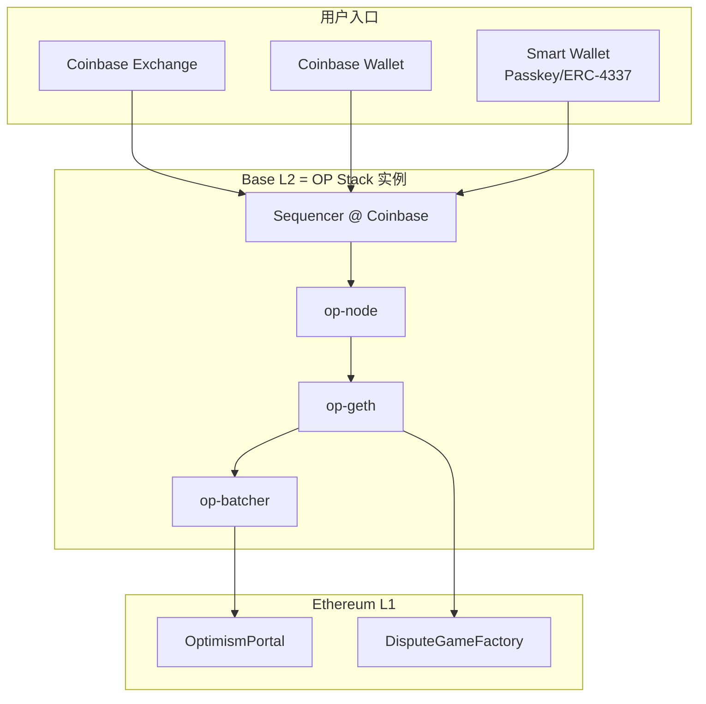
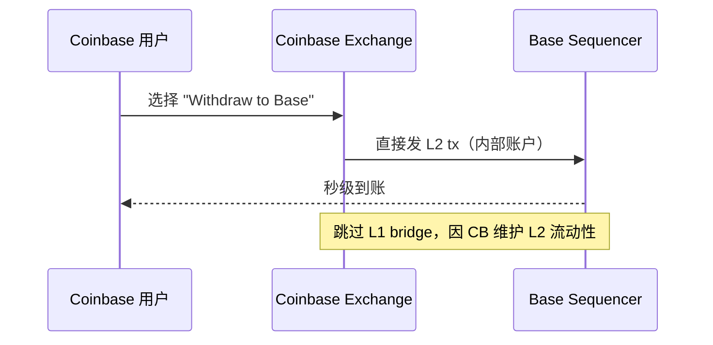

# Base（Coinbase L2 / OP Stack 实例）

> **TL;DR**：Base 是 Coinbase 于 2023-08-09 主网上线的 Optimistic Rollup，完全基于 **OP Stack**（Bedrock + Superchain），Coinbase 团队只运营 Sequencer，其余协议逻辑与 OP Mainnet 同构。它的独特价值不在技术创新，而在 **分发**：Coinbase Wallet、Coinbase Exchange、Coinbase Smart Wallet（ERC-4337）直接一键充值、美元法币入金、美国合规身份验证。2024 年 Base 一度成为交易活跃度最高的 L2（日均 tx > 600 万），MEME 币、Farcaster / Warpcast 社交、Onchain Summer 叙事等带来大量消费级用户。Base 无原生代币（Coinbase 承诺不发），收入来自 Sequencer 净利，向 Optimism Collective 国库贡献 2.5%（或者 15% 净利，取 max）。L2BEAT 评级 Stage 1（2024-10 升级）。

---

## 1. 背景与动机

Coinbase 选择做 L2 的动机分三层：

1. **规模化美国合规 Web3 入口**：Coinbase 是美国持牌交易所；自建 L2 可将交易 / 合约活动放在可审计、可降费的环境，且保持对 Ethereum 的安全继承。
2. **战略收入补充**：Sequencer 净利在 2024 年峰值达到月 $500 万+，是 Coinbase 链上业务的重要增长极。
3. **生态联盟**：加入 Superchain，与 OP、Zora、Worldchain 形成事实网络效应；Base 的技术投入（多数合并到 op-monorepo）提升上游共同代码。

选择 OP Stack 而非自研或 Arbitrum Orbit 的关键考虑：

- **开源 + 可复用**：Bedrock 合约已经审计，Coinbase 只需运营 Sequencer。
- **治理结构**：Superchain 承诺链与链之间平等共建，代码升级跟随 OP Stack 主干。
- **Coinbase 历史与 OP Labs 的深度合作**：2022–2023 Coinbase 工程师大量贡献 Bedrock。

Base 的战略呈现为 **"构建 onchain 的用户规模"**，其口号 *Base is for everyone* 强调 Consumer 场景（社交、Meme、支付）。

## 2. 核心原理

### 2.1 作为 OP Stack 实例的形式化定义

Base 和 OP Mainnet 在协议逻辑上是 **同构的两个副本**，都是 OP Stack 2024 Hardfork 同一版本：

$$\text{Base} \equiv \text{OP Stack v2024}(\text{chainId}=8453, \text{batcher}, \text{proposer}, \text{council})$$

不同点仅在：
- `chainId = 8453`（OP Mainnet 是 `10`）。
- `batcherHash` / `proposer` 由 Coinbase 密钥持有。
- Security Council 成员与 OP Foundation 有所不同，但同样采用 N-of-M 多签紧急权限。
- 经济上对 Collective 缴纳 Superchain Royalty。

### 2.2 核心机制：完全继承 OP Stack

所有核心机制与 `optimism.md §2` 相同：
- **Derivation Pipeline**：L1 Blob/calldata → L2 blocks。
- **Soft / Safe / Finalized 三态**。
- **Cannon MIPS Fault Proof**：2024-10 激活 Permissionless Fault Proofs。
- **7 天挑战期**。

### 2.3 Base 特有的用户层设计

1. **Smart Wallet（Coinbase Smart Wallet）**：基于 ERC-4337 + Passkey（WebAuthn），用户无需助记词，用指纹 / Face ID 签名；Gas Sponsorship（Paymaster）免费体验。
2. **OnchainKit**：React 组件库，前端一键接入 Base + Smart Wallet。
3. **Coinbase Exchange 深度集成**：用户从中心化账户直充 Base，无需经 L1 bridge。
4. **Base Names / Subname**：ENS Layer 集成，`*.base.eth` 子域。
5. **Verified Identity**：Coinbase One 用户可选 Soul-Bound 认证，解锁低 KYC 门槛 dApp。

### 2.4 关键参数

| 参数 | Base |
| --- | --- |
| 主网 | 2023-08-09 |
| ChainId | 8453 |
| Sequencer | Coinbase 单点 |
| 软确认 | 2 秒 |
| L2 Block Time | 2 秒 |
| Batch 发布 | 1–3 分钟 |
| Challenge Window | 7 天 |
| Fault Proof | Permissionless（2024-10 激活） |
| Security Council | 10/15 紧急多签 |
| Gas Token | ETH |
| 原生代币 | 无（Coinbase 官方承诺不发） |
| L2BEAT Stage | Stage 1 |

### 2.5 边界条件与失败模式

- **Sequencer 宕机**：Base 2024-09-05 曾出现 45 分钟完全停机；所有软确认停止，用户可走 L1 Force Inclusion 但体验不佳。事后 Coinbase 多 Region 热备。
- **Fault Proof bug**：与 OP Mainnet 共用 Cannon，2024-08 OP 官方因 bug 短暂回退 Council Mode，Base 同步回退。
- **Coinbase 合规压制**：理论上美国监管可要求 Coinbase 冻结特定地址；Base 的 Sequencer 可在 L2 层审查交易，但用户仍可走 L1 Portal 绕过。
- **Superchain 跨链漏洞**：若 OP Stack 出 0-day，Base 同受影响。
- **DA 回退 Alt-DA 风险（尚未启用）**：Coinbase 未宣布改 DA，但 OP Stack 支持；若启用 Celestia 则安全模型降级。

### 2.6 图示





## 3. 架构剖析

### 3.1 分层视图

与 Optimism 分层等同：Protocol（op-node + op-geth）/ DA（L1 Blob）/ Settlement（L1 Portal + Dispute）/ Governance（Base Security Council + Superchain 协同）。增加一层 **Coinbase User Layer**（Exchange、Wallet、Smart Wallet、OnchainKit）——这是 Base 独特的护城河。

### 3.2 核心模块清单

| 模块 | 来源 | 职责 |
| --- | --- | --- |
| op-node | OP Stack 共享 | L2 Driver |
| op-geth | OP Stack 共享 | EVM 执行 |
| op-batcher | Coinbase 私有部署 | Batch 提交 |
| op-proposer | Coinbase 私有部署 | Output root 提交 |
| op-challenger | 公开 + Coinbase 运营 | 监控 |
| contracts-bedrock | 部署到 L1 Base 地址 | L1 合约集 |
| OnchainKit | `coinbase/onchainkit` | React UI 库 |
| Base Names | `base-org/basenames` | ENS Subname |
| AgentKit | `coinbase/agentkit` | AI Agent on-chain（2025 上线） |

### 3.3 数据流

```text
T+0     Coinbase Wallet → Base RPC (https://mainnet.base.org)
T+500ms op-node 派生新 block；op-geth 执行；广播软确认
T+2s    下一 L2 block，N 视为 soft confirmed
T+1–2m  op-batcher → L1 Blob
T+12m   L1 finalized → Rollup safe
T+1h    op-proposer 提交 output root 到 DisputeGameFactory
T+7d    无挑战 → withdrawal 可兑现
```

对 Coinbase 内部用户：L1 bridge 路径被直接跳过，Coinbase 在 L2 预备流动性池（"Omnibus wallet"），内部账户直接瞬时上 Base。

### 3.4 客户端多样性

- 使用 op-geth + op-node 作为主客户端。
- 2025 起计划接入 op-reth（Rust），减少对 Go 实现的单一依赖。
- Coinbase Infrastructure 团队参与 OP Stack 代码 review，推高 CL/EL 的稳定性。

### 3.5 扩展 / 互操作接口

- **Standard Bridge**：ETH / ERC-20 双向。
- **Coinbase Exchange Direct Deposit**：off-chain 瞬时，内部承担流动性风险。
- **Smart Wallet / Gas Paymaster**：4337 兼容；任何 dApp 可接入 Coinbase 的 Paymaster 赞助交易。
- **OnchainKit**：前端组件库（Identity、Transaction、Swap、Checkout）。
- **Superchain Interop**：主网开放后 Base 可与 OP、Mode、Zora 等原子消息。
- **Farcaster Frames**：Base 是 Farcaster 去中心化社交的主要结算链（MEME 铸造、订阅）。

## 4. 关键代码 / 实现细节

Base 并非独立代码库，而是 **OP Stack 配置 + Coinbase 私有部署 manifests**。关键"代码"体现在 **Superchain Registry**：

[`superchain-registry/superchain/configs/mainnet/base.toml`](https://github.com/ethereum-optimism/superchain-registry/blob/main/superchain/configs/mainnet/base.toml)（示例片段）：

```toml
name = "Base"
chain_id = 8453
public_rpc = "https://mainnet.base.org"
sequencer_rpc = "https://mainnet-sequencer.base.org"
explorer = "https://basescan.org"
block_time = 2
seq_window_size = 3600
max_sequencer_drift = 600
data_availability_type = "eth-da"

[addresses]
SystemConfigProxy = "0x73a79Fab69143498Ed3712e519A88a918e1f4072"
OptimismPortalProxy = "0x49048044D57e1C92A77f79988d21Fa8fAF74E97e"
DisputeGameFactoryProxy = "0x43edB88C4B80fDD2AdFF2412A7BebF9dF42cB40e"
```

**Coinbase Smart Wallet 核心（ERC-4337 + Passkey）** — [`smart-wallet`](https://github.com/coinbase/smart-wallet) 合约要点：

```solidity
// 签名验证支持 WebAuthn（Passkey）
function _validateSignature(bytes32 hash, bytes calldata sig) internal view returns (bool) {
    // sig 格式：(keyType, signature, authenticatorData, clientDataJSON)
    if (keyType == KeyType.WebAuthn) {
        return WebAuthn.verify(hash, authenticatorData, clientDataJSON, r, s, pubKeyX, pubKeyY);
    }
    // 也兼容传统 secp256k1
    ...
}
```

## 5. 演进与版本对比

| 时间 | 事件 |
| --- | --- |
| 2023-02 | Base 公布，定位 Coinbase on-chain 入口 |
| 2023-07 | 开发者测试网 |
| **2023-08-09** | 主网开放（Onchain Summer 活动） |
| 2023-Q4 | Farcaster / Meme 爆发 |
| 2024-03 | EIP-4844 blob 接入，用户费用骤降 |
| 2024-06 | Coinbase Smart Wallet 上线 |
| 2024-09-05 | Sequencer 宕机 45 分钟（软件升级 bug） |
| 2024-10 | Permissionless Fault Proofs 激活；L2BEAT Stage 1 |
| 2025-Q2 | Superchain Interop 支持（Base ↔ OP / Mode / Zora） |
| 2025 | AgentKit、大规模 AI Agent x Onchain 场景 |
| 2026-Q1 | Base 被 TON / Solana 激烈竞争；MEME 大规模迁移；单日 TX 峰值 >800 万 |

## 6. 实战示例

**添加 Base 网络（EIP-3085）**：

```json
{
  "chainId": "0x2105",
  "rpcUrls": ["https://mainnet.base.org"],
  "nativeCurrency": { "name": "Ether", "symbol": "ETH", "decimals": 18 },
  "blockExplorerUrls": ["https://basescan.org"]
}
```

**Coinbase Smart Wallet 前端接入**：

```tsx
import { OnchainKitProvider } from "@coinbase/onchainkit"
import { base } from "viem/chains"
export function App() {
  return (
    <OnchainKitProvider apiKey={process.env.NEXT_PUBLIC_CDP_API_KEY} chain={base}>
      <YourDApp />
    </OnchainKitProvider>
  )
}
```

**L1 → Base 充值**：

```ts
import { ethers } from "ethers"
const portal = new ethers.Contract(
  "0x49048044D57e1C92A77f79988d21Fa8fAF74E97e", // OptimismPortalProxy (Base)
  ["function depositTransaction(address,uint256,uint64,bool,bytes) payable"],
  new ethers.Wallet(pk, new ethers.JsonRpcProvider(l1Rpc)),
)
await portal.depositTransaction(myAddr, ethers.parseEther("0.02"), 100000, false, "0x",
  { value: ethers.parseEther("0.02") })
```

## 7. 安全与已知攻击

1. **2024-09-05 Sequencer 停机**：软件升级回归 bug，45 分钟完全停机；无资金损失；事后 Coinbase 建多 Region 热备。
2. **2024-01 Friend.tech 迁出 + MEME Rug Pulls**：Base 开放 Permissionless 部署 → 大量劣质 Token 上线。Coinbase 在 Wallet 前端加风险提示，但链上合约不审查。
3. **2024-02 Munchables on Blast 抽水 $62M**（同 OP Stack，Base 不直接涉险，但系统性经验教训）：提醒 L2 dApp 运维签名泄漏风险。
4. **Smart Wallet 早期 Passkey 恢复争议**：Passkey 依赖手机厂商生态（Apple iCloud / Google Password Manager），社区关注私钥托管边界。
5. **Sequencer 审查能力**：Coinbase 理论上可过滤 tx。用户可走 L1 depositTransaction 绕过；历史上未见实际审查证据。
6. **Onchain Summer 期间 Gas 峰值**：一度 Sequencer 拥堵，软确认延迟数十秒；pre-4844 期尤为严重。
7. **Basenames 命名仿冒**：2024-05 多起 `.base.eth` 抢注案；社区需教育用户识别官方。

## 8. 与同类方案对比

| 维度 | Base | Optimism | Arbitrum One | BNB Chain（对比 sidechain） |
| --- | --- | --- | --- | --- |
| 安全继承 | Ethereum | Ethereum | Ethereum | 无（独立 PoS） |
| 去中心化 | Sequencer = Coinbase（单点） | 单 Sequencer | 单 Sequencer | 少量 BNB 巨头 |
| 原生代币 | **无** | OP | ARB | BNB |
| 费用 | $0.01–0.05 | $0.01–0.1 | $0.01–0.05 | $0.01 |
| 用户来源 | Coinbase + Farcaster | OP 治理社区 | DeFi 玩家 | 亚洲 Retail |
| 合规层 | 强（美国上市公司） | 中 | 中 | 弱 |
| 典型场景 | Social / Meme / 支付 | DeFi / 治理 | DeFi / Derivatives | High-freq retail |

## 9. 延伸阅读

- **官方**
  - Base Docs：<https://docs.base.org>
  - Base GitHub：<https://github.com/base-org>
  - Superchain Registry：<https://github.com/ethereum-optimism/superchain-registry>
  - OnchainKit：<https://onchainkit.xyz>
  - Coinbase Smart Wallet：<https://www.smartwallet.dev/>
- **Tier 2/3**
  - L2BEAT Base：<https://l2beat.com/scaling/projects/base>
  - Paradigm, *Why Base chose OP Stack*：<https://paradigm.xyz>
  - Coinbase Research Blog：<https://www.coinbase.com/blog>
  - 登链社区 Base 专栏：<https://learnblockchain.cn/tags/Base>
- **数据**
  - Dune Base Dashboard：<https://dune.com/queries/2993435>
  - Farcaster analytics：<https://dune.com/pixelhack/farcaster>

## 10. 术语表

| 术语 | 英文 | 释义 |
| --- | --- | --- |
| OP Stack | OP Stack | Base 所用的开源 L2 栈 |
| Superchain | Superchain | OP Stack 各链组成的互操作网络 |
| Smart Wallet | Coinbase Smart Wallet | Passkey + 4337 账户 |
| OnchainKit | OnchainKit | React 组件库 |
| Basename | Basename | `*.base.eth` 命名 |
| Gas Sponsorship | Paymaster | ERC-4337 赞助 gas |
| Farcaster | Farcaster | Base 上主流去中心化社交 |
| Omnibus Wallet | Omnibus | Coinbase 在 L2 托管的流动性池 |
| CDP | Coinbase Developer Platform | 开发者工具 + API 平台 |
| Agentic | AgentKit | Base 上的 AI Agent 框架 |

---

*Last verified: 2026-04-22*
