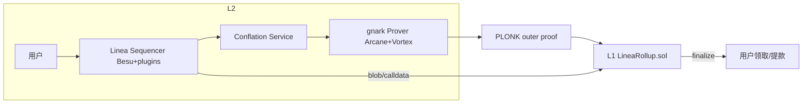

# Linea

> **TL;DR**：Linea 是 **ConsenSys**（MetaMask、Infura、Truffle 的母公司）于 2023-07 主网 Alpha 启动的 **zkEVM Rollup**，证明栈基于 ConsenSys 自研的 `gnark` 库，组合使用 **PLONK + Arcane/Vortex** 自研算术化与 **lattice-based commitment**；合约层为 **Type 2-ish zkEVM**，几乎无需修改即可运行 Solidity/Vyper bytecode。Linea 最大差异化优势在于 **与 MetaMask 深度原生整合**：MetaMask 内置网络、MetaMask Card、Linea Voyage 任务平台、LineaBuild 开发者门户；用户无需手动加 RPC，任意桌面/移动 MetaMask 用户零摩擦接入。截至 2026-04，Linea TVL 约 10 亿美元量级（DefiLlama），日活交易数常年位居 zkEVM 赛道前列，并完成 **EIP-4844 blob 迁移**、**Beta v1 状态** 与 **Linea Association** 去中心化治理转型。Linea 使用 **Canonical Bridge**、原生 **ETH burn + LINEA burn**（双通缩）经济模型，L1 与 L2 通过 `MessageService` 合约做消息传递。

---

## 1. 背景与动机

ConsenSys 作为以太坊生态 "全栈" 公司，2021 年起内部启动 "ConsenSys zkEVM" 研究（早期代号 "zkConsensys"）。2023-03 测试网公测，2023-07-11 主网 Alpha 上线。直接动机：

1. **给 MetaMask 的 3000 万+ 用户提供默认 L2**：任何 EVM L2 都要解决"用户怎么来"，Linea 天然拿到分销入口。
2. **给 Infura 的企业客户提供 ZK 基建**：Infura 已是以太坊 RPC 事实标准，Linea 成为其"托管 zk-Rollup"选项。
3. **复用 ConsenSys 开源栈**：`gnark`（SNARK 框架）、`Besu`（Java 以太坊客户端）、`Truffle/Hardhat` 工具链、`MetaMask SDK`、`Infura SDK`——Linea 把这些拼成一条 Rollup。
4. **面向机构/合规场景**：ConsenSys 长期服务传统金融（Société Générale、JP Morgan Onyx/Kinexys 等），Linea 在早期路演中强调合规友好的地址控制、可选 KYC 接入。

## 2. 核心原理

### 2.1 形式化定义

Linea Rollup 与通用 zkEVM 一致：

```
state', trace = EVM(state, batch)
π             = Prove_gnark(LineaCircuit(trace, state, state'))
1             = Verify_PLONK(vk, π, PI)
```

差异点在 **LineaCircuit**：不是 Halo2 Plonkish，也不是 Plonky2 FRI，而是 ConsenSys 自研 **Arcane**（列式约束 DSL）+ **Vortex** 多项式承诺（基于 Reed-Solomon + Merkle）+ **外层 PLONK with KZG**（在 `bn254` 上便于 L1 verify）。官方将其称作 "Linea zk prover"。

### 2.2 证明系统：gnark + Arcane + Vortex

`gnark` 是 ConsenSys 2020 起源开源的 Go 语言 SNARK 框架，支持 Groth16、PLONK、PLONKY2 兼容等；在 bn254 / bls12-381 / bw6 曲线上有高度优化。Linea 流水线：

- **Arcane**：描述 zkEVM 执行 trace 的列式约束系统（类 Plonkish）。把每条 opcode 拆成"若干列 × 若干行"的 trace 表，列与列之间通过 lookup / permutation 连接。
- **Vortex**：第一层多项式承诺——用 Reed-Solomon 码 + Merkle 树承诺大 trace，并通过 sumcheck-like 交互缩减 degree（FRI 的替代）。优势：proof 更小、prover 更快。
- **PLONK outer proof**：把 Vortex + Arcane 的 inner proof 再包一层 PLONK+KZG，使 L1 上的 verifier 仅需 `pairing(...)`。
- **Lattice commitment research**：Linea 团队在后 PQ（post-quantum）准备上有 lattice-based commitment 的研究投入（见 gnark-crypto）。

### 2.3 zkEVM 子机制

- **Execution trace**：Linea 使用 modified `besu`（Java）+ `linea-sequencer`（Java 插件）生产 trace；状态更新与 L1 EVM 完全一致（Type 2-ish）。
- **State tree**：使用 **Sparse Merkle Tree** 配合 MiMC 哈希（zk-friendly），而非 Keccak-MPT。
- **Trace lookup tables**：keccak、ECDSA、memory copy 等昂贵操作抽出来做大查表，与 Scroll 思路一致。
- **Conflation**：将多个区块的 trace 合并（conflate）成一个 **conflation batch** 再统一证明，减少证明开销。

### 2.4 桥与消息服务

- **L1 合约**：`LineaRollup.sol`（存 state root、提交 batch、验证 proof）、`L1MessageService`、`TokenBridge`。
- **L2 合约**：`L2MessageService`、`L2TokenBridge`。
- **Messaging**：跨域消息通过 `sendMessage(to, fee, calldata)` / `claimMessage(...)`；提现需等 proof finalize 后在 L1 `claim`。

### 2.5 参数与常量

| 参数 | 取值（2026-04） | 备注 |
| --- | --- | --- |
| Chain ID | 59144（主网）、59141（Sepolia） | linea-specification |
| L2 block time | ~2 秒 | Besu 配置 |
| Finalization cadence | 数十分钟 | 受 prover 吞吐影响 |
| State hash | MiMC-based SMT | Linea spec |
| Gas pricing | EIP-1559 风格 | 主网 2024 后对齐 L1 |

### 2.6 边界条件与失败模式

- **Sequencer 单点**：ConsenSys 运营；2024 年曾针对 Velocore 攻击者暂停 sequencer，引发去中心化争议。
- **Prover 故障**：prover 离线时区块仍可出，但无法 finalize。
- **MiMC 哈希假设**：MiMC 在 zk 场景流行，但其代数简洁性也带来潜在代数攻击面（社区有对 MiMC 压缩函数的代数攻击研究）；需持续关注。
- **桥风险**：大多数桥风险同业通用（中心化签名、合约漏洞）。



## 3. 架构剖析

### 3.1 分层视图

```
┌───────────────────────────────────────────────┐
│ L1 Contracts (Solidity)                        │
│   ├─ LineaRollup.sol                           │
│   ├─ L1MessageService                          │
│   └─ Plonk Verifier                            │
├───────────────────────────────────────────────┤
│ Prover Cluster                                 │
│   ├─ Trace Conflation Service                  │
│   ├─ Arcane Circuit                            │
│   ├─ Vortex Commitment                         │
│   └─ Outer PLONK Proof                         │
├───────────────────────────────────────────────┤
│ L2 Execution                                   │
│   ├─ Besu + linea-sequencer plugin             │
│   ├─ Mempool / Block builder                   │
│   └─ Tracing module (.toml configs)            │
├───────────────────────────────────────────────┤
│ User / Dev                                     │
│   ├─ MetaMask（内置网络）                       │
│   ├─ Infura Linea RPC                          │
│   └─ LineaScan / Etherscan                     │
└───────────────────────────────────────────────┘
```

### 3.2 核心模块清单

| 模块 | 仓库 / 路径 | 职责 | 可替换性 |
| --- | --- | --- | --- |
| linea-besu | `Consensys/linea-besu` | L2 EL 客户端（Besu fork） | 可再 fork |
| linea-sequencer | `Consensys/linea-sequencer` | Besu 插件，负责 trace 输出 | 单实现 |
| linea-monorepo | `Consensys/linea-monorepo` | 协调器、Bridge、DApp | 统一 repo |
| gnark | `Consensys/gnark` | SNARK 框架 | 独立通用库 |
| gnark-crypto | `Consensys/gnark-crypto` | 底层椭圆曲线、FFT、hash | 独立 |
| linea-specification | `Consensys/linea-specification` | 规范与电路 | 文档/论证 |
| Canonical Bridge | `LineaRollup.sol`、`TokenBridge.sol` | 资产跨域 | 多签升级 |
| LineaScan | Etherscan 定制 | 浏览器 | 第三方 |

### 3.3 数据流

1. 用户 Tx → Linea RPC（Infura 或自建）。
2. Sequencer (Besu + plugin) 在 mempool 收单、按 EIP-1559 排序、出块。
3. `linea-sequencer` 插件同步输出 trace `.lt` 文件。
4. **Conflation**：多个 block trace 组合成 conflation。
5. Prover 读 trace → Arcane 约束 → Vortex commit → Outer PLONK proof。
6. `LineaRollup.submitData` 提交 blob；`LineaRollup.finalizeBlocks` 提交 proof。
7. L1 验证通过，更新 `currentL2BlockNumber / stateRootHashes[blockNumber]`。

### 3.4 客户端与参考实现

- `linea-besu`：主 client，Java/Besu fork。
- 开发者完全沿用 **MetaMask / Ethers.js / Viem / Hardhat / Foundry**；Linea 专为 Hardhat 发布 `linea-deployer` 等插件。
- `gnark` 是通用 SNARK 库，被 Polygon Miden、Celo 等项目引用。

### 3.5 扩展 / 互操作接口

- 标准 `eth_*` JSON-RPC + 部分 `linea_*` 扩展（`linea_estimateGas` 考虑 L1 data cost）。
- MetaMask Snaps、MetaMask Delegation Framework、MetaMask Card 原生接入。
- `Post`/`Claim` 风格 L1↔L2 消息。
- 第三方桥：Orbiter、LayerZero、Stargate、Symbiosis、Across。

## 4. 关键代码 / 实现细节

**`gnark` PLONK 证明示意**（`Consensys/gnark` v0.x，`backend/plonk/bn254`）：

```go
// 定义电路（必须实现 Define 方法）
type CubicCircuit struct {
    X frontend.Variable `gnark:"x"`
    Y frontend.Variable `gnark:",public"`
}

func (c *CubicCircuit) Define(api frontend.API) error {
    x3 := api.Mul(c.X, c.X, c.X)
    api.AssertIsEqual(c.Y, api.Add(x3, c.X, 5))
    return nil
}

// 证明
ccs, _ := frontend.Compile(ecc.BN254.ScalarField(), r1cs.NewBuilder, &CubicCircuit{})
srs, _ := test.NewKZGSRS(ccs)
pk, vk, _ := plonk.Setup(ccs, srs)
proof, _ := plonk.Prove(ccs, pk, witness)
_ = plonk.Verify(proof, vk, publicWitness)
```

**L1 Rollup finalize 接口**（`LineaRollup.sol` 简化）：

```solidity
function finalizeBlocksWithProof(
    bytes calldata _aggregatedProof,
    uint256 _proofType,
    FinalizationData calldata _finalizationData
) external onlyRole(OPERATOR_ROLE) {
    _verifyProof(_aggregatedProof, _proofType, _finalizationData);
    currentL2BlockNumber = _finalizationData.finalBlockNumber;
    stateRootHashes[currentL2BlockNumber] = _finalizationData.finalStateRootHash;
    emit DataFinalized(currentL2BlockNumber,
        _finalizationData.parentStateRootHash,
        _finalizationData.finalStateRootHash, true);
}
```

## 5. 演进与版本对比

| 时间 | 事件 |
| --- | --- |
| 2021–2022 | ConsenSys 内部 zkEVM 研究（早期称 "zkConsenSys"） |
| 2023-03 | 公共 testnet Goerli |
| 2023-07-11 | **Mainnet Alpha** 上线 |
| 2023-Q4 | Linea Voyage 任务活动开始，Attested 用户激增 |
| 2024-03 | EIP-4844 blob 支持，gas 费显著下降 |
| 2024-06 | Velocore 攻击事件 & Sequencer 短暂暂停 |
| 2024-Q4 | Beta v1 阶段，prover 吞吐提升 |
| 2025 | **LINEA Token** 发行 + Linea Association 接管治理 |
| 2025–2026 | 去中心化 sequencer 路线图、MetaMask Card 广泛推出 |

## 6. 实战示例

```bash
# Linea Mainnet
# ChainID: 59144
# RPC:     https://rpc.linea.build
# Explorer: https://lineascan.build

# MetaMask 已内置，无需手动加网络
# 部署合约
forge create --rpc-url https://rpc.linea.build \
  --private-key $PRIV src/Counter.sol:Counter

# 从 L1 桥入 ETH（L1 主网）
# TokenBridge: 0x051F1D88f0aF5763fB888eC4378b4D8B29ea3319 (Canonical ETH Bridge)
cast send 0x051F... "sendMessage(address,uint256,bytes)" \
  $RECIPIENT 0 0x --value 0.01ether --rpc-url $L1_RPC --private-key $PRIV
```

预期：几分钟到 15 分钟内 L2 地址到账，LineaScan 可追踪。

## 7. 安全与已知攻击

1. **2024-06 Velocore 攻击与 Sequencer 暂停**：Velocore 被攻击者盗取约 180 万美元，ConsenSys 运营方暂停 Linea sequencer 阻止资金外流；引发社区对 "rollup 是否过度中心化" 的讨论。这是行业内最具代表性的中心化 Sequencer 使用案例。
2. **Prover 电路审计**：Linea 团队委托 OpenZeppelin、Least Authority 等多轮审计；`gnark` 主库也接受社区外审。
3. **MiMC 代数攻击面**：学术界对 zk-friendly 哈希的代数攻击研究（Gröbner basis 等）持续进展，Linea 监控并在升级中调整参数/函数。
4. **桥合约治理**：`LineaRollup` 由多签 + Security Council 控制；升级通过时间锁。
5. **MetaMask 依赖**：Linea 对 MetaMask 生态的深度绑定带来分销优势，但也意味着一旦 MetaMask 出现供应链攻击（历史上未发生），影响范围会集中。

## 8. 与同类方案对比

| 维度 | Linea | Scroll | zkSync Era | Polygon zkEVM |
| --- | --- | --- | --- | --- |
| 证明 | gnark + Arcane/Vortex + outer PLONK | Halo2 + KZG | Boojum STARK→PLONK | Plonky2 |
| State hash | MiMC SMT | Poseidon MPT | zkSync 私有 | Sparse MT |
| 等价性 | Type 2-ish | Type 2 | Type 4 | Type 2 |
| 客户端 | Besu fork | geth fork | 自研 | geth fork |
| 生态整合 | MetaMask / Infura / Truffle | PSE / Foundry / Etherscan | ZK Stack / Matter Labs | Polygon CDK / AggLayer |
| 治理 | Linea Association + ConsenSys | Scroll Foundation | Matter Labs + DAO | Polygon Labs + DAO |

**trade-off**：Linea 最大卖点是 **默认 MetaMask 分销 + Infura 运维**；缺点是目前仍在 L2BEAT Stage 0，中心化程度较高。

## 9. 延伸阅读

- **Tier 1（官方）**
  - 官方文档：<https://docs.linea.build>
  - Monorepo：<https://github.com/Consensys/linea-monorepo>
  - gnark：<https://github.com/Consensys/gnark>
  - Linea Specification：<https://github.com/Consensys/linea-specification>
  - ConsenSys 博客：<https://consensys.io/blog>
- **Tier 2（研究）**
  - L2BEAT：<https://l2beat.com/scaling/projects/linea>
  - DefiLlama：<https://defillama.com/chain/Linea>
  - Messari Linea 报告：<https://messari.io>
- **Tier 3（博客）**
  - Linea 官方博客：<https://linea.build/blog>
  - 登链社区 Linea 专栏：<https://learnblockchain.cn/tags/Linea>
  - OpenZeppelin zkEVM 审计回顾：<https://blog.openzeppelin.com>

## 10. 术语表

| 术语 | 英文 | 释义 |
| --- | --- | --- |
| gnark | gnark | ConsenSys 自研 Go SNARK 框架 |
| Arcane | Arcane | Linea 的列式约束 DSL |
| Vortex | Vortex | 基于 Reed-Solomon + Merkle 的多项式承诺 |
| MiMC | MiMC | zk-friendly 代数哈希函数 |
| Conflation | Conflation | 将多 block trace 合并的策略 |
| Canonical Bridge | Canonical Bridge | 官方 L1↔L2 资产桥 |
| Sequencer | Sequencer | 交易排序与出块节点 |
| Prover | Prover | 生成 zk proof 的节点 |

---

*Last verified: 2026-04-22*
