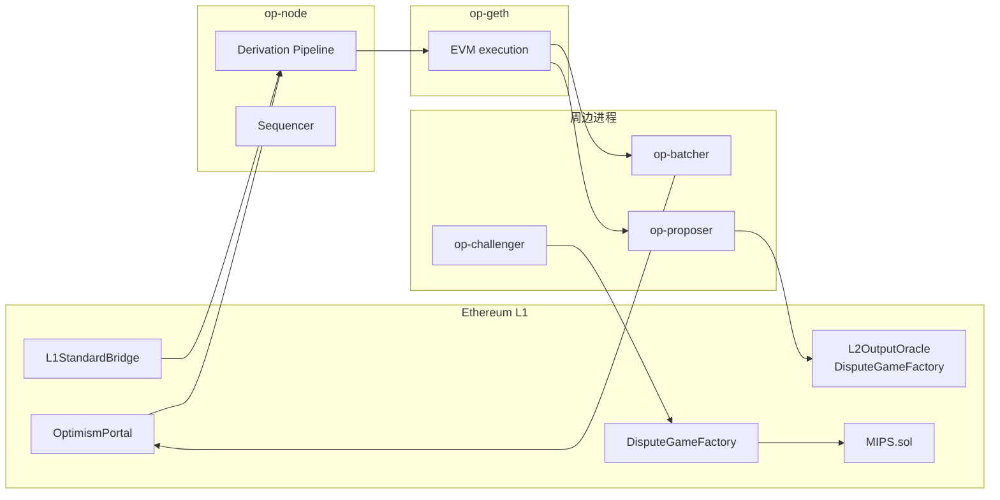
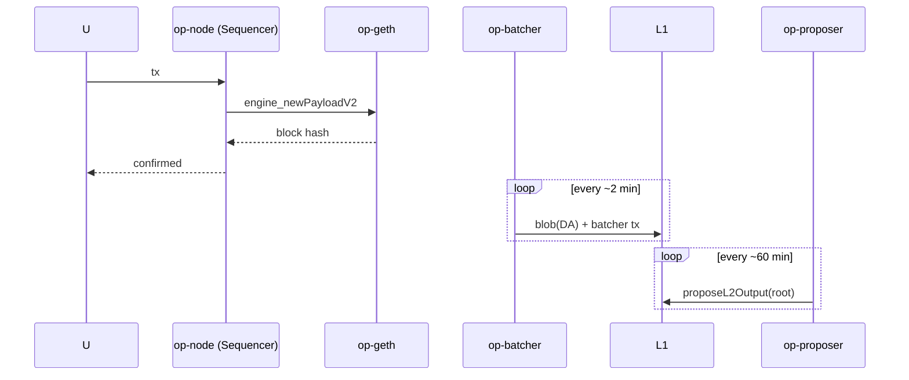

# Optimism 与 OP Stack / Superchain

> **TL;DR**：Optimism 是由 OP Labs（前 Plasma Group）主导的 Optimistic Rollup，2021-01 测试网、2021-12 主网，2023-06 完成 **Bedrock 升级** 将架构模块化为今日的 **OP Stack**——一组可被任何项目 fork 部署的开源 L2 栈。2023 年起 Optimism 基金会推出 **Superchain** 愿景：所有基于 OP Stack 的链（Optimism、Base、Mode、Zora、Blast、Worldchain、Fraxtal 等）共用协议、共享 Sequencer 安全池、跨链原子消息，形成"一链多实例"的 L2 网络操作系统。2024-06 上线 **Permissionless Fault Proofs**（Cannon + FaultDisputeGame），正式跨入 L2BEAT Stage 1。治理由 Optimism Foundation + Token House + Citizens' House 双院制把控；OP 代币 2022 年空投，当前总市值前 10。

---

## 1. 背景与动机

Optimism 团队前身 Plasma Group，2019 年放弃 Plasma 路线，改做 Optimistic Rollup。2021-01 测试网上线，2021-06 宣布首个主流 DeFi 部署（Synthetix、Uniswap v3 Beta）。早期版本 **OVM 1.0 / 2.0** 使用魔改 EVM，兼容性受限、维护成本高。

2022 年下半年团队启动 **Bedrock 重写**，目标：

1. **EVM 等价**：抛弃 OVM，直接 fork go-ethereum 为 `op-geth`。
2. **模块化**：把 Execution / Consensus / Batching / Bridge 分层，任何人都可以像组 Kubernetes 一样拼一条 L2。
3. **降低费用与出块时间**：1s 软确认；减少调用栈中的无效 call。
4. **Superchain 铺垫**：同栈链统一升级、统一经济与治理。

OP Stack 的开源 + 可复用特性催生了 2023-08 **Base**（Coinbase）、2024 **Blast、Mode、Zora**，把 OP Stack 推到主流 L2 事实标准地位。

## 2. 核心原理

### 2.1 形式化定义与 Derivation Pipeline

Bedrock 的核心算法是 **Derivation**：从 L1 数据流（calldata + blob + deposit events）派生出唯一确定的 L2 区块序列。

形式化：给定 L1 状态序列 $\{L1_0, L1_1, ...\}$ 与 Sequencer 公开密钥 $pk$，存在唯一函数

$$D(L1, pk) = \{L2_0, L2_1, ...\}$$

任何人只需 L1 数据就能独立重构 L2 历史；Sequencer 作恶只能影响"软确认"的顺序，无法伪造 L1 确认。

**Unsafe / Safe / Finalized** 三态：
- **Unsafe**：仅 Sequencer 背书。
- **Safe**：L1 上已存在对应的 BatcherTransaction。
- **Finalized**：对应 L1 block 已 Casper 终局化（~13 分钟）。

### 2.2 欺诈证明：Cannon + FaultDisputeGame

Bedrock 欺诈证明设计分三层：

1. **op-program**：Go 程序，实现 Derivation + State Transition。编译到 **MIPS32** 或 **MIPS64**（2024 Q4 升级到 64-bit）。
2. **Cannon**：一个 MIPS 解释器，离线用于生成争议的 trace；在线（L1）的 `MIPS.sol` 只执行一条指令。
3. **FaultDisputeGame**：L1 合约的二分游戏，最终调用 MIPS.sol 做 One-Step Proof。

2024-06 主网激活 **Permissionless Fault Proofs**，任何人可挑战、无需许可；2024-08 短暂因 bug 回退 Council Mode 后修复再上线。

### 2.3 Superchain Interop

2025 年主网的 **Interop**：不同 OP Stack 链之间原子消息。核心机制：

- 每条链的 `CrossL2Inbox` 合约可读取其他 OP 链的日志（通过共享序列器或 Cross-Chain Messenger Bridge）。
- 原子性靠 **同一 Superchain Sequencer 集合 + 共同 Finality Window**。
- 消息延迟目标：< 1 L2 块（2s）。

### 2.4 经济：Profit-Sharing + Retroactive Public Goods Funding

- **L1 Data Fee 50% 分给 Sequencer 运营成本，剩余归 Optimism Collective 国库**。
- **Base、Mode、Worldchain 等 OP Stack 实例按 Sequencer 净利 2.5% + 15% 的更大比例 / L1 DA 利润给到 Superchain 国库**（具体比例因协议变化）。
- **RetroPGF**：每季度从国库中划拨资金，由 Citizens' House 投票奖励对以太坊生态有公共价值的开发者。

### 2.5 六大子机制拆解

1. **op-node**：L2 Driver，运行 Derivation；类似于 Consensus Client。
2. **op-geth**：L2 Execution Client，根据 `engine_forkchoiceUpdatedV2` / `engine_newPayloadV2` 与 op-node 通信。
3. **op-batcher**：Sequencer 模式下聚合 L2 blocks、压缩、EIP-4844 上链。
4. **op-proposer**：每 N 分钟把 L2 output root 发到 `L2OutputOracle`（Bedrock）或 `DisputeGameFactory`（Fault Proofs）。
5. **op-challenger**：监控 output root；发现错误即启动 FaultDisputeGame。
6. **L1 Contracts**：`OptimismPortal`、`L2OutputOracle`、`DisputeGameFactory`、`SystemConfig`、`L1StandardBridge`、`L1CrossDomainMessenger`。

### 2.6 关键参数

| 参数 | Optimism Mainnet |
| --- | --- |
| 主网启动 | 2021-12-16（Bedrock 2023-06-06） |
| Sequencer | 单点，OP Labs 运营 |
| 软确认 | 2 秒（L2 block time） |
| Batch 频率 | 1–3 分钟 |
| Output Proposer 频率 | 每 1h（Bedrock）→ DisputeGameFactory 按需 |
| Challenge Window | 7 天 |
| Security Council | 8/13 紧急 |
| Gas Token | ETH |
| L2 区块 Gas Limit | 60M（可治理） |

### 2.7 图示





## 3. 架构剖析

### 3.1 分层视图

- **Protocol Layer**：`op-node` + `op-geth` 双进程；Engine API 通讯。
- **DA Layer**：默认 EIP-4844 blob；Alt-DA 可接 Celestia / EigenDA（2024-Q4 "Alt-DA spec" 上线）。
- **Settlement Layer**：Ethereum L1；Portal 合约负责资产跨桥；DisputeGameFactory 管理证明。
- **Governance Layer**：OP Foundation + Token House + Citizens' House + Security Council。

### 3.2 核心模块清单

| 模块 | 目录 | 职责 | 可替换性 |
| --- | --- | --- | --- |
| op-node | `op-node/` | Derivation + Rollup Driver | 低 |
| op-geth | `op-geth` (独立 repo) | L2 Execution | 中（有 op-reth） |
| op-batcher | `op-batcher/` | L2→L1 Data submission | 中 |
| op-proposer | `op-proposer/` | output root 提交 | 中 |
| op-challenger | `op-challenger/` | 挑战者 daemon | 可多个 |
| cannon | `cannon/` | MIPS emulator + onchain MIPS.sol | 可被 asterisc (RISC-V) 替换 |
| contracts-bedrock | `packages/contracts-bedrock/` | L1 合约集 | 低 |
| op-program | `op-program/` | Derivation + STF 的纯 Go 实现（被编译到 Cannon） | 低 |
| kona（Rust） | `anton-rs/kona` | 纯 Rust 版 op-program，便于 SP1 / Risc0 证明 | 中 |
| superchain-registry | 独立 repo | 所有 OP 链配置集中地 | - |

### 3.3 数据流

```text
T+0        tx → https://mainnet.optimism.io (op-node Sequencer)
T+500ms    op-geth engine_newPayload → block N
T+2s       下一个 block 产生；N 视为 soft confirmed
T+1–2min   op-batcher 打包 + 上 L1 blob
T+12min    L1 block finalized → rollup "safe"
T+60min    op-proposer 提交 output root（DisputeGameFactory.create）
T+7d       无挑战 → OptimismPortal.finalizeWithdrawalTransaction
```

### 3.4 客户端多样性

- **op-geth**：Go，主流（> 95% 节点）。
- **op-reth**：Rust，Paradigm 主导，2024 主网节点试点。
- **op-erigon**：归档优化，主要给 Indexer。
- **op-nethermind / op-besu**：实验阶段。

目标：2026 内 op-reth 份额 ≥ 30%，降低单客户端风险。

### 3.5 扩展 / 互操作接口

- **Standard Bridge**：`L1StandardBridge` + `L2StandardBridge`，ERC-20 双向。
- **Messenger**：`L1CrossDomainMessenger.sendMessage(target, data, gasLimit)`。
- **Deposit Tx**：L1 任何合约可直接向 Portal 发 `depositTransaction(to, value, gasLimit, isCreation, data)` 给 L2。
- **Alt-DA Spec**：允许 Sequencer 用 Celestia / EigenDA 替代 blob，成本更低但安全模型不同。
- **Superchain Interop**：2025 Q2 主网，`CrossL2Inbox.executeMessage(id, target, message)`。
- **Fault Proof as a Service**：Succinct / RiscZero 接入 kona Rust impl，生成 ZK 版 Fault Proof（2026 实验中）。

## 4. 关键代码 / 实现细节

**Derivation Pipeline** — [`op-node/rollup/derive/pipeline.go`](https://github.com/ethereum-optimism/optimism/blob/develop/op-node/rollup/derive/pipeline.go)（简化）：

```go
// Pipeline 从 L1 数据流产生 L2 payloads
func (dp *DerivationPipeline) Step(ctx context.Context) error {
    // 1. L1Traversal: 消费下一 L1 block
    l1Ref, err := dp.l1Traversal.Next(ctx)
    // 2. L1Retrieval: 读取 BatcherTx / Blob
    frames, err := dp.l1Retrieval.ReadFrames(ctx, l1Ref)
    // 3. ChannelBank: 组装 channel
    batch, err := dp.channelBank.NextBatch(frames)
    // 4. BatchQueue: 按 L1 epoch 排序 batch
    // 5. AttributesQueue: 把 batch → PayloadAttributes
    attr, err := dp.attrQueue.Next(ctx, batch)
    // 6. EngineQueue: 通过 Engine API 把 payload 交给 op-geth
    return dp.engineQueue.InsertPayload(attr)
}
```

**FaultDisputeGame One-Step 仲裁** — [`contracts-bedrock/src/dispute/FaultDisputeGame.sol`](https://github.com/ethereum-optimism/optimism/blob/develop/packages/contracts-bedrock/src/dispute/FaultDisputeGame.sol)（关键段）：

```solidity
function step(uint256 _claimIndex, bool _isAttack, bytes calldata _stateData, bytes calldata _proof) external {
    require(depth(_claimIndex) == MAX_GAME_DEPTH, "Not leaf");
    // 在 VM (MIPS.sol / asterisc) 上执行一条指令
    bytes32 poststate = VM.step(_stateData, _proof, _uuid(_claimIndex));
    // 比较 poststate 与宣称值决胜
    require(poststate == expectedPostState(_claimIndex, _isAttack), "Invalid step");
    _resolveLeaf(_claimIndex);
}
```

## 5. 演进与版本对比

| 版本 | 时间 | 关键 |
| --- | --- | --- |
| OVM 1.0 | 2021-01 | 测试网，魔改 EVM |
| OVM 2.0 | 2021-11 | EVM Equivalence first step |
| 主网全开 | 2021-12 | 从 whitelist 到 permissionless 部署 |
| OP Token + Collective | 2022-04 | 空投 + 双院制治理 |
| **Bedrock** | **2023-06** | 抛弃 OVM，OP Stack 雏形 |
| Superchain Vision | 2023-10 | 宣布愿景 |
| Base 加入 Superchain | 2023-08 | Coinbase 共建 |
| EIP-4844 接入 | 2024-03 | Blob 上链 |
| **Permissionless Fault Proofs** | **2024-06** | 主网激活 Cannon + FaultDisputeGame |
| Fault Proof pause & resume | 2024-08 | 发现 bug 暂回 Council，修复重启 |
| MIPS64 | 2024-Q4 | 性能优化 |
| Alt-DA GA | 2024-Q4 | Celestia / EigenDA 可选 |
| **Superchain Interop** | **2025-Q2** | 跨 OP 链原子消息 |
| ZK Fault Proof 探索 | 2025-2026 | kona + SP1 |

## 6. 实战示例

**本地开发 OP Stack Devnet**：

```bash
git clone https://github.com/ethereum-optimism/optimism
cd optimism
make devnet-up   # docker compose 启动 L1 + L2 + batcher + proposer
```

**向 OP Mainnet 发送 deposit**：

```ts
import { ethers } from "ethers"
const portal = new ethers.Contract(
  "0xbEb5Fc579115071764c7423A4f12eDde41f106Ed",
  ["function depositTransaction(address,uint256,uint64,bool,bytes) payable"],
  new ethers.Wallet(pk, new ethers.JsonRpcProvider(l1Rpc)),
)
await portal.depositTransaction(
  myL2Addr, ethers.parseEther("0.05"), 100_000, false, "0x",
  { value: ethers.parseEther("0.05") }
)
```

**监听 Superchain Interop 消息**（2025 Q2 后）：

```solidity
// 在 Mode 上调用 Base 合约
import "@eth-optimism/contracts-bedrock/src/L2/CrossL2Inbox.sol";
ICrossL2Inbox(0x...).executeMessage(id, target, message);
```

## 7. 安全与已知攻击

1. **2022-06 "Infinite Money Bug"**：白帽 Jay Freeman 发现 OVM 的 `SELFDESTRUCT` 处理错误，可铸造无限 ETH。及时修复并 $2M bounty。
2. **2022-09 Wintermute 错发 20M OP**：合约参数错误，Wintermute 协助返还。
3. **2023-06 Bedrock 升级平滑**：数月公开审计，Coinbase 同步集成，迁移零事故。
4. **2024-08 Fault Proof Pause**：主网激活 2 个月后发现 Cannon 中 MIPS 指令边界漏洞，暂停 4 天，改成 Permissioned，修复后重启。
5. **Sequencer 审查与去中心化**：OP Labs 独家运营，社区呼吁 Shared Sequencer（Espresso 合作中）。
6. **OP Token 治理攻击面**：Token House 投票阈值低，理论可被资金操纵；Citizens' House 持有否决权以制衡。
7. **Superchain 共用漏洞**：所有 OP Stack 链共享合约，0-day 可波及 Base / Mode / Blast 等全部。2024-03 Blast 首日白帽发现 `SystemConfig` 升级权限设置过宽。

## 8. 与同类方案对比

| 维度 | Optimism | Arbitrum One | Base | zkSync Era |
| --- | --- | --- | --- | --- |
| 客户端 | op-node + op-geth | Nitro | 同 OP Stack | EraVM |
| 欺诈 / 有效性 | Cannon Fault Proof | BoLD | 复用 OP | SNARK |
| L2BEAT Stage | Stage 1 | Stage 1 | Stage 1 | Stage 0 |
| 生态 | DeFi 中流 | DeFi 深度 | Social + Consumer | GameFi |
| 代币 / 治理 | OP + 双院制 | ARB + 单院 | 无代币 | ZK |
| Superchain | 原生 | 通过 Orbit（不同模型） | 是 | 不是 |
| MEV 治理 | Shared Sequencer 计划 | Timeboost | 同 OP | 内部 |

## 9. 延伸阅读

- **官方**
  - Optimism Docs：<https://docs.optimism.io>
  - OP Stack Specs：<https://specs.optimism.io>
  - Superchain Registry：<https://github.com/ethereum-optimism/superchain-registry>
- **论文 / 博客**
  - Vitalik, *Proposed Milestones for Rollups taking off training wheels*（Stages）：<https://vitalik.eth.limo/general/2023/06/20/stages.html>
  - Karl Floersch blog：<https://karl.tech>
  - Paradigm, *Fault Proofs in the wild*：<https://www.paradigm.xyz>
- **工具 / 数据**
  - L2BEAT Optimism：<https://l2beat.com/scaling/projects/optimism>
  - Dune OP dashboards
- **中文**
  - 登链社区 OP 专栏：<https://learnblockchain.cn/tags/Optimism>

## 10. 术语表

| 术语 | 英文 | 释义 |
| --- | --- | --- |
| Bedrock | Bedrock | 2023-06 的模块化升级 |
| OP Stack | OP Stack | 可被任何人部署的模块化 L2 栈 |
| Superchain | Superchain | 所有 OP Stack 链形成的互操作网络 |
| Derivation | Derivation | 从 L1 数据派生 L2 区块的算法 |
| Cannon | Cannon | MIPS 模拟器 + 欺诈证明执行环境 |
| FaultDisputeGame | FaultDisputeGame | 合约层面的欺诈证明游戏 |
| Token House | Token House | OP 代币持有者治理院 |
| Citizens' House | Citizens' House | 公民身份非财产化投票院 |
| RetroPGF | RetroPGF | 回溯性公共物品资助 |
| Alt-DA | Alternate DA | 非 blob 的数据可用性后端 |

---

*Last verified: 2026-04-22*
