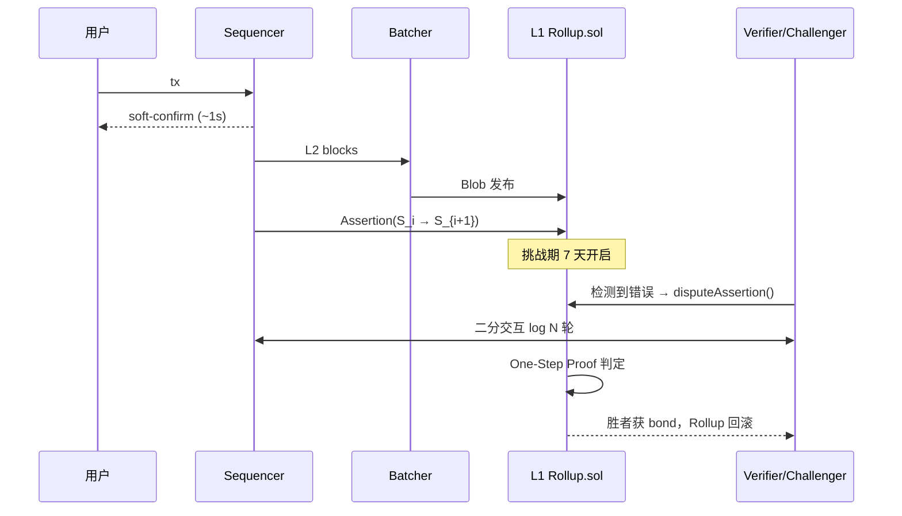
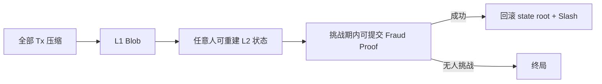

# Optimistic Rollup 原理（Optimistic Rollup）

> **TL;DR**：Optimistic Rollup（OR）是当前 TVL 最大的 L2 路线，核心哲学是 **"乐观默认正确，错了再证明"**。Sequencer 将 L2 Tx 执行后把压缩数据发布到 L1 Blob，同时提交一个 state root，进入 7 天挑战期；任何人都可在挑战期内通过交互式二分欺诈证明（Interactive Fraud Proof）证明 state root 错误，从而让合约回滚并罚没 Sequencer 的保证金。相比 ZK Rollup，OR 的优势是 EVM 等价性容易实现、无高昂证明成本；劣势是 7 天提款延迟与目前仍普遍缺失的 Permissionless Fault Proofs。2024–2025 年 Arbitrum BoLD、OP Permissionless Fault Proofs 相继主网激活，成为 L2BEAT Stage 1 评级的关键门槛。代表项目：Arbitrum One / Nova、Optimism、Base、Blast、Mode、Fraxtal。

---

## 1. 背景与动机

Optimistic Rollup 概念首次系统化定义见 2019 年 John Adler 的论文 *[Minimal Viable Merged Consensus](https://ethresear.ch/t/minimal-viable-merged-consensus/5617)* 与 Plasma Group 团队博客。它解决了 Plasma 的两大痛点：

- Plasma 的 **数据可用性假设**：用户必须自己离线备份数据，否则运营商作恶时无法挑战。
- Plasma 的 **大规模退出（Mass Exit）问题**：数万用户同时退出 L1，耗尽区块容量。

Optimistic Rollup 用两个设计"补上"这些漏洞：

1. **所有 Tx 数据必须上 L1**（calldata；EIP-4844 后改为 blob）——任何人都可以自行重建 L2 状态，不再需要相信 Operator。
2. **只提交 state root，欺诈证明机制兜底**——不像 ZK 那样每块都算证明，但仍然保证 Safety。

它和"侧链"（Sidechain）的根本差别也在于此：侧链有独立共识、安全性不传递到 L1；OR 的每个 block 都被 L1 数据"钉死"，且错误状态可被链上合约形式化拒绝。

## 2. 核心原理

### 2.1 形式化定义

令 L2 状态转换为 $\delta(S, B) \rightarrow S'$，Sequencer 每批 Tx $B_i$ 宣称结果 $S_{i+1}$。OR 合约存储一个 `Assertion` 三元组 $(S_i, S_{i+1}, D_i)$，其中 $D_i$ 是该批的数据承诺（blob versioned hash）。安全断言：

$$\forall i,\; \text{Finalized}(S_{i+1}) \iff \neg \exists \text{ valid Fraud Proof against } (S_i, S_{i+1}, D_i) \text{ within } \Delta$$

$\Delta$ = 7 天。OR 的安全性依赖 **至少一个诚实 Verifier 节点** 在 $\Delta$ 内运行。这是著名的 **1-of-N 信任模型**（对比 PBFT 的 2/3+1）。

### 2.2 数据可用性与压缩

L2 吞吐的物理上界是 L1 Blob 容量：EIP-4844 下每块 3 个 target blob（6 个 max），每 blob 128 KiB，折合 ~0.38 MB/slot × 12s = **~32 KB/s**。经 zlib + RLP 压缩后平均一笔 ERC-20 转账约 12–20 字节，理论上可支撑 **1,600–2,600 TPS**。Fusaka 的 PeerDAS 有望把 blob target 推到 12–16/block。

### 2.3 六大子机制拆解

1. **Sequencer 排序 + 执行**：接单，用改版的 geth 执行 EVM，产出 L2 block，广播软确认。
2. **Batch 压缩与发布**：Batcher 聚合数百到数千笔 Tx，压缩，切 ≤128KB frame，通过 EIP-4844 BLOB_TX（type 3）上链。
3. **State Commitment / Assertion**：Proposer 每 N 个 L2 block 把 state root + Batch hash 提交到 L1 的 `Rollup.sol`，开始挑战期计时。
4. **欺诈证明（交互式二分）**：Challenger 与 Asserter 通过 L1 合约进行 $O(\log N)$ 轮二分，最终锁定一条争议 VM 指令，由 L1 合约执行 One-Step Proof 判定胜负。
5. **保证金与 Slashing**：Asserter 需质押保证金（Arbitrum 100 ETH 级；OP 由提出者承担），败诉者 Slash，胜者获奖励。
6. **提款 / Exit**：挑战期结束后，用户在 L1 用 Merkle Proof 提取资金；期间可走第三方快速桥（付溢价即时到账）。

### 2.4 交互式欺诈证明的执行环境

- **Arbitrum Nitro**：把 geth 编译成 **WASM**，放入一个确定性 WAVM（Arbitrum WASM VM）里执行；One-Step Proof 在 L1 合约里重放一条 WASM 指令（几千 gas）。
- **Optimism Cannon**：把 op-geth 编译成 **MIPS** 指令集，在 L1 合约（`MIPS.sol`）里重放一条 MIPS 指令。2024 年新版 Cannon 支持 64-bit MIPS；更高效的 **Kroma/asterisc** 用 RISC-V。
- **非交互式（single-round）** Fraud Proof 变体：把整条 VM trace 压成 Merkle root，一次性证明。成本高，很少使用。

### 2.5 关键参数与常量

| 参数 | 典型值 | 含义 |
| --- | --- | --- |
| 挑战期 $\Delta$ | 7 天 (604,800 s) | OP / Arbitrum 主网 |
| Batch 频率 | 1–10 分钟 | Batcher submit 周期 |
| Assertion 频率 | 1h（Nitro）/ 1–6h（OP） | state root 上链 |
| 单 Batch 大小 | ≤ 6 blob = 768 KiB | EIP-4844 限制 |
| Fraud Proof 保证金 | ~3600 ETH（BoLD 全局 bond） | Arbitrum BoLD 设计 |
| 强制包含等待 | 24h（Arbitrum Delayed Inbox） | 用户绕过 Sequencer 的最长等待 |
| Force Include Tx Gas | ~100k gas on L1 | 强制上链 |

### 2.6 边界条件与失败模式

- **Sequencer 失活 + 无 Force Inclusion**：软确认停止；若 L2 设计未启用 Force Inclusion，用户资产暂不可动，但可通过 L1 Bridge Exit（7 天）。
- **Batcher 审查**：一旦 Batcher 不发布数据到 L1，Rollup Node 将判定为"Sequencing Window Expired"，自动 follow L1 上任何人发来的强制 Tx。
- **Prover 无人**：OR 的特点是不需要时时刻刻运行 Prover，只需有人 watching；但若全世界无 Verifier（Whitelisted Only 阶段），Safety 退化为多签信任。
- **挑战作恶者资金不足**：BoLD 设计里全局仅一个争议窗口，攻击者需一次性锁定 3,600 ETH 级保证金，抑制资源 DoS。
- **L1 拥堵导致挑战失败**：Fraud Proof 提交交易被 censor >7 天 → Rollup 会延长挑战期（EIP-4844 前普遍关注，Arbitrum BoLD 用"超时延长"处理）。

### 2.7 图示





## 3. 架构剖析

### 3.1 分层视图

- **L2 Execution Layer**：魔改 geth（OP 叫 op-geth，Arbitrum 叫 arbnode-geth）。
- **Rollup Driver / Node**：op-node 或 Nitro node，负责驱动 L2 出块、读取 L1 事件。
- **Batcher**：独立进程，订阅 L2 block，压缩后发到 L1。
- **Proposer / Validator**：提交 state root，运行 Fraud Proof 游戏。
- **L1 Contract Suite**：`SystemConfig` / `L2OutputOracle` / `OptimismPortal` / `FaultDisputeGame` / `L1CrossDomainMessenger` / `L1StandardBridge`。

### 3.2 核心模块清单（对 OP Stack Bedrock）

| 模块 | 目录 | 职责 | 可替换性 |
| --- | --- | --- | --- |
| op-geth | `op-geth/` | L2 执行客户端（fork of go-ethereum） | 低（生态锁定） |
| op-node | `op-node/` | 驱动 derivation pipeline | 低 |
| op-batcher | `op-batcher/` | L2→L1 Batch 上链 | 中（可接入 Alt-DA） |
| op-proposer | `op-proposer/` | 提交 L2 output root | 中 |
| op-challenger | `op-challenger/` | 监控 + 挑战 | 可有多个 |
| cannon | `cannon/` | MIPS 模拟器 + One-Step 电路 | 可被 asterisc 替换 |
| contracts-bedrock | `packages/contracts-bedrock/` | L1 合约集 | 低 |
| FaultDisputeGame.sol | `contracts-bedrock/src/dispute/` | 欺诈证明游戏 | 低 |

### 3.3 端到端数据流

1. **T+0**：用户签名并发送到 Sequencer RPC。
2. **T+1s**：Sequencer 生成 L2 block，返回 soft confirmation。
3. **T+30s–2min**：Batcher 打包近若干 block → zlib 压缩 → 切 frame → 组装 EIP-4844 blob tx → 发到 L1。
4. **T+12min**：L1 finalized；DA 写入 beacon chain（保留 18 天）。
5. **T+30min–3h**：Proposer 向 `L2OutputOracle` 提交 output root，挑战期开启。
6. **T+7d**：无挑战 → Withdrawal 可在 `OptimismPortal.finalizeWithdrawalTransaction` 提现。

### 3.4 客户端多样性

OR 生态里 Nitro 与 OP Stack 是两大主流：

- **Nitro 系**：Arbitrum One、Nova、Orbit 链（Xai、DeGen、Rari、PlayNance 等）。
- **OP Stack 系**：Optimism、Base、Mode、Blast、Zora、Fraxtal、Mantle（部分）、Kroma 等。

OP Stack 通过 Superchain Registry 做同步升级；Nitro 通过 Orbit 授权单链部署。当前两家都是 **单一客户端实现**，正在推动 op-reth / nitro-reth 等多客户端。

### 3.5 扩展 / 互操作接口

- **JSON-RPC 兼容层**：大部分方法与 Ethereum 一致；新增 `rollup_gasPrices`、`optimism_outputAtBlock`、`arb_getTransactionReceipt` 等。
- **L1 ↔ L2 Messenger**：`sendMessage(target, message, gasLimit)`；重入攻击通过 nonce + replay guard。
- **ERC-7683 / Fast Bridges**：第三方桥（Across、Hop、Synapse）用 Intent + LP 提供 < 10 min 提款。
- **Superchain Interop（OP 2025）**：跨 OP Stack 链原子消息，通过 `CrossL2Inbox` 合约读取其他 OP 链的 log。
- **AggLayer**：跨 Rollup 统一结算层（Polygon 主推，也覆盖 CDK OR 链）。

## 4. 关键代码 / 实现细节

**OP Stack 的 Fault Dispute Game** — [`FaultDisputeGame.sol`](https://github.com/ethereum-optimism/optimism/blob/develop/packages/contracts-bedrock/src/dispute/FaultDisputeGame.sol)（2024 主网版，简化）：

```solidity
// 简化：每一步都是一个 Claim，父子以 MAX_GAME_DEPTH 的二分定位
function attack(uint256 _parentIndex, Claim _claim) external payable {
    _move(_parentIndex, _claim, /*isAttack*/ true);
}
function defend(uint256 _parentIndex, Claim _claim) external payable {
    _move(_parentIndex, _claim, /*isAttack*/ false);
}
function step(uint256 _claimIndex, bool _isAttack, bytes calldata _stateData, bytes calldata _proof) external {
    // 在 MAX_GAME_DEPTH 时调用 MIPS.sol 单步执行验证
    // 胜者拿到败者 bond
    IBigStepper(VM).step(_stateData, _proof, uuid);
}
```

**Arbitrum BoLD 的 All-vs-All 证明**（[`ChallengeManager.sol`](https://github.com/OffchainLabs/nitro-contracts)）区别于 OP 的 1v1：BoLD 让任何挑战者在一个 **全局 BisectionTree** 里竞争，最终只需一个诚实参与者就能击败无数 Sybil。

## 5. 演进与版本对比

| 版本 | 时间 | 关键变化 |
| --- | --- | --- |
| Optimism OVM 1.0 | 2021-01 | 魔改 EVM，单客户端 |
| Arbitrum Classic | 2021-08 | Arbitrum VM + AVM 架构 |
| Optimism EVM Equivalence | 2021-11 | 抛弃 OVM，做 EVM 等价 |
| Arbitrum Nitro | 2022-08 | 全面改为 geth fork + WASM Fraud Proof |
| **Optimism Bedrock** | **2023-06** | 模块化 OP Stack，加快出块、降低费用 |
| EIP-4844 集成 | 2024-03 | Batcher 转向 blob |
| **Arbitrum BoLD** | **2024-Q4** | 全链无许可 Fraud Proof，Stage 1 达标 |
| **OP Permissionless Fault Proofs** | **2024-06** | 主网激活 Cannon + FaultDisputeGame |
| Superchain Interop | 2025 | 跨 OP 链原子消息 |
| Nitro Stylus | 2024-08 | Arbitrum 添加 WASM 合约支持 |

## 6. 实战示例

**本地跑一个 OP Stack 迷你 Rollup**（devnet，需 Docker）：

```bash
git clone https://github.com/ethereum-optimism/optimism
cd optimism && make devnet-up
# 默认启动 L1 (geth) + L2 (op-geth) + op-node + op-batcher + op-proposer
# L1 RPC: http://localhost:8545
# L2 RPC: http://localhost:9545
```

**提交一笔 L1 → L2 deposit**：

```ts
import { ethers } from "ethers"
const portal = new ethers.Contract(
  "0xbEb5Fc579115071764c7423A4f12eDde41f106Ed", // OptimismPortal Mainnet
  ["function depositTransaction(address,uint256,uint64,bool,bytes) payable"],
  new ethers.Wallet(pk, new ethers.JsonRpcProvider(l1Rpc)),
)
const tx = await portal.depositTransaction(
  myL2Addr, ethers.parseEther("0.1"), 100_000, false, "0x",
  { value: ethers.parseEther("0.1") },
)
```

## 7. 安全与已知攻击

1. **2020-12 Optimism OVM 首日 Bug**：`SELFBALANCE` opcode 返回 0，无资金损失，硬升级修复。
2. **2022-09 Optimism Wintermute**：约 20M OP 错发至未认领地址；Wintermute 作为白帽协助返还。
3. **2023-10 Nova (Arbitrum AnyTrust) 短时停机**：Sequencer 与 DAC 失联数小时；数据仍在 Committee 手上，未丢失。
4. **2024-06 Blast 跨链桥事件**：官方桥验证缺失，被指"假 Rollup"，L2BEAT 给出 Stage 0 最严警告。
5. **Permissioned Proposer 风险**：多数 OP Rollup 在 2023 之前 Proposer 是单地址，理论可偷走 7 天新近状态。2024 主网激活 Permissionless Fault Proofs 后被消除。
6. **Chain-Halt Recovery**：OP Bedrock 2024 年曾因 SSD 故障短暂停顿 1h；经验值说明单 Sequencer 集中化风险真实存在。
7. **Fraud Proof 资源 DoS**：BoLD 引入前，Arbitrum 1v1 挑战可被 Sybil 刷 N 轮；BoLD 合并为全局 bond 后被缓解。

## 8. 与同类方案对比

| 维度 | Optimistic Rollup | ZK Rollup | Validium | Sidechain（Polygon PoS） |
| --- | --- | --- | --- | --- |
| 安全继承 | 1-of-N 诚实观察者 | SNARK 算术安全 | 需信任 DAC/DA 层 | 独立共识（无继承） |
| 提款延迟 | 7 天 | 1–12 小时 | 1–12 小时 | 2–3 小时 |
| EVM 等价性 | 完整（Nitro / Bedrock） | 逐步（Type 1 少数） | 同 ZK | 完整 |
| L1 Gas 占用 | 数据 + state root | 数据 + proof | 仅 proof | 无 |
| 最坏情况 | 挑战失败+Batcher 失活 → 走 Force Exit | Prover 长期宕机 → 资金冻结 | DA 断 → 资金冻结 | 共识被俘获 → 资金损失 |
| 代表 | Arbitrum, Optimism, Base | zkSync, Scroll, Linea | Immutable X, StarkEx | Polygon PoS, Ronin |

## 9. 延伸阅读

- **一手源**
  - Vitalik, *An Incomplete Guide to Rollups*：<https://vitalik.eth.limo/general/2021/01/05/rollup.html>
  - OP Stack Spec：<https://specs.optimism.io>
  - Arbitrum Nitro Whitepaper：<https://github.com/OffchainLabs/nitro/blob/master/docs/Nitro-whitepaper.pdf>
  - BoLD Paper：<https://github.com/OffchainLabs/bold-docs>
- **Tier 2/3**
  - L2BEAT Fault Proof Tracker：<https://l2beat.com/scaling/tvl>
  - Paradigm, *Lessons from OP Fault Proofs*：<https://www.paradigm.xyz/>
  - Kelvin Fichter blog（smrtcontrcts）：<https://twitter.com/kelvinfichter>
  - 登链社区 OP / Arbitrum 分析：<https://learnblockchain.cn/tags/Optimism>
- **视频**
  - Devcon 7 "Fault Proofs in Production" 录像
  - Smart Contract Programmer YouTube

## 10. 术语表

| 术语 | 英文 | 释义 |
| --- | --- | --- |
| 断言 | Assertion | Sequencer 对 state root 的声明 |
| 二分挑战 | Bisection Game | 把 N 步 VM 执行二分定位到 1 步 |
| 单步证明 | One-Step Proof | L1 合约执行单条 VM 指令验证 |
| 强制包含 | Force Inclusion | 用户通过 L1 强制上链 |
| 排序窗口 | Sequencing Window | Sequencer 必须上传数据的时限 |
| AnyTrust | AnyTrust | Arbitrum Nova 的 DAC 模式 |
| WASM VM | WAVM | Arbitrum 的确定性 WASM 执行机 |
| MIPS VM | MIPS VM | Optimism Cannon 的确定性指令集 |
| 挑战者 | Challenger | 提交欺诈证明的实体 |
| 快速桥 | Fast Bridge | LP 提供的 1 小时内 L2→L1 出金 |

---

*Last verified: 2026-04-22*
