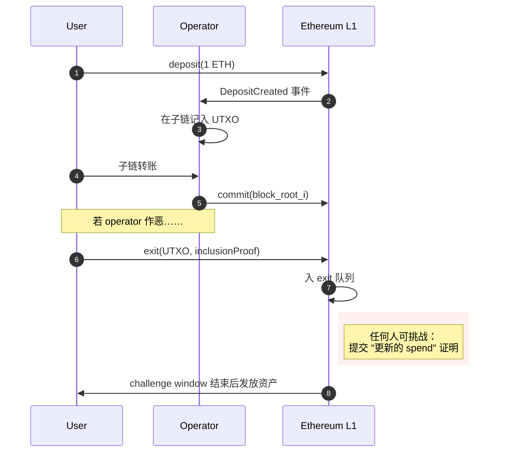

# Plasma

> **TL;DR**：**Plasma** 由 Joseph Poon（Lightning 合著者）与 Vitalik Buterin 于 2017-08 提出，是以太坊早期最有影响力的 L2 扩容方案之一。其核心思想是构造"**子链（child chain）**"：把绝大多数交易搬到由单一运营方（operator）产出的子链上执行，**仅把 block header（Merkle root）周期性 commit 到 L1**；通过 **欺诈证明（fraud proof）+ 退出游戏（exit game）** 保证任何时候用户都能以 L1 为仲裁强制提走本属于自己的资金。Plasma 是 **"最小化链上数据 + 最大化链下执行"** 这条思路的原型。它有多个变体：**Plasma MVP**（通用 UTXO）、**Plasma Cash**（NFT/单一资产，退出更简单）、**More VP**、**Plasma Prime / Cashflow**、**Minimal Viable Plasma 2**。2019 年后由于 **通用智能合约难以 Plasma 化**（状态依赖无法被局部退出游戏覆盖）、**用户需长期在线监视子链状态** 等根本限制，通用 Plasma 研究被 **Rollup** 全面取代。2023 年 Vitalik 提出"**Plasma meets ZK**"复兴思路——用 zk validity proof 解决状态依赖问题；2024 年 **OP Plasma**（OP Stack 的一个 mode）和 Celestia 社区也探索再次使用。理解 Plasma 对理解 Rollup 为什么"赢"至关重要。

---

## 1. 背景与动机

2017 年以太坊 TPS ~15，Gas 拥堵频繁，扩容是核心议题。Poon 和 Vitalik 借鉴比特币 Lightning 的思路——"只把最终结算与冲突仲裁留在 L1"——写成 Plasma 论文：

1. **L1 当法庭，L2 当赛场**：子链 operator 负责撮合与执行；L1 只在出现争议/提款时被调用。
2. **MapReduce-style 子链嵌套**：子链可有子子链，理论上无限分叉扩展。
3. **欺诈证明**：任意用户发现 operator 提交非法 root 时，可提交证据到 L1 合约挑战并获得奖励。
4. **退出游戏**：即便子链整体作恶，用户凭借自己持有的最新 UTXO/coin 证明，也能在 L1 上退出原始资产。

实战原型：**OMG Network**（原 OmiseGO，基于 MoreVP）、**Matic Plasma**（Polygon PoS 的早期阶段）、**Loom Network**、**LeapDAO**。

## 2. 核心原理

### 2.1 形式化定义

Plasma 链 `P` 与 L1 交互通过一对映射：

```
commit(block_hash_i, i)  : operator → L1
deposit(value)           : user    → L1 → P
exit(output, inclusion_proof, history_proof) : user → L1（启动退出）
challenge(tx_exit, tx_double_spend | newer_tx) : anyone → L1（挑战恶意退出）
```

状态是 **一组 UTXO**（MVP）或 **一组 indexed coin**（Cash）；合法状态转移是把若干 UTXO 输入 → 若干 UTXO 输出，签名由输入拥有者完成。operator 每隔 N 秒生成一个 block 并将 `merkleRoot` commit 到 L1。L1 合约只存 block hash 列表，**不验证内部交易合法性**。

### 2.2 欺诈证明（Fraud Proof）

若 operator 提交了包含非法转账的 block，任何持有：

- 非法 tx 的 Merkle inclusion proof，
- 该 tx 所用输入对应的**先前已被 spent** 的 Merkle proof，

的用户可以在挑战期内（通常 1–2 周）调用 L1 合约 `challenge`，合约验证两份 proof，若属实则**回滚** operator 的 block、罚没其 stake。

由于 L1 不存交易体，**用户必须自己下载并保存子链数据**，否则无法构造 proof。这是 Plasma 核心痛点。

### 2.3 退出游戏（Exit Game）

即便 operator 扣留整个子链数据（data withholding），用户仍可退出：

- **Plasma MVP（UTXO 通用）**：用户提交自己"最新的 UTXO + inclusion proof"。退出按 **UTXO age**（最老的先 finalize）排序；别人可用"更新的 spend"挑战你。
- **Plasma Cash**：每个资产是唯一 coin（像 NFT），存在固定 slot。用户必须证明自己这枚 coin 的完整历史（sparse Merkle branch）；coin 退出时提交 "**non-inclusion** proof for blocks after the claimed tx"——证明自己这枚 coin 在你获得后没被再转走。
- **MoreVP（More Viable Plasma）**：对 MVP 的优化，解决"两个不同 UTXO 依赖关系导致退出顺序混乱"的问题，用 *position priority* 解决跨 block 冲突。

### 2.4 子机制拆解

1. **Commit 机制**：operator 每个区块周期（如 15 秒–数分钟）提交 Merkle root；L1 合约记录 `blockHash[i]`。
2. **Deposit 机制**：用户在 L1 Plasma 合约 `deposit(amount)`，合约发出 `DepositCreated` 事件，operator 在子链对应插入 UTXO。
3. **Exit / Challenge**：L1 合约维护 **exit priority queue**，按（UTXO 位置，时间戳）排序；任何人可在 challenge window 内挑战。
4. **Mass Exit**：若子链整体不可用，所有用户同时退出。关键约束：**L1 必须有足够 gas 容纳所有人的退出**——Plasma 的**活性瓶颈**。
5. **Confirmation Signatures（MVP 特有）**：为避免 operator 与某 sender 合谋伪造"合法退出"，MVP 要求接收方对每次收款再次签名，UX 痛苦。
6. **Data Availability Challenge**：当怀疑 operator 扣留数据，用户发起 DA challenge；operator 必须在 timeout 内公开区块数据，否则区块回滚。

### 2.5 参数与常量（代表性）

| 参数 | OMG MoreVP | Plasma Cash | OP Plasma (2024) |
| --- | --- | --- | --- |
| Challenge window | 1 周 | 1–2 周 | 数天（可配置） |
| Exit bond | 小额 ETH | 同 | 同 |
| Block interval | ~15 秒 | 配置 | 数秒 |
| Operator stake | 有 | 可选 | 有 |

### 2.6 边界条件与失败模式

- **数据扣留 + 通用计算**：通用智能合约状态不是 UTXO 那样"谁的钱谁带走"，而是合约持有所有用户份额；若 operator 隐藏状态，用户无法独立证明自己在合约中的余额 → Plasma 通用化失败。
- **Mass exit 拥塞**：若 10 万用户同时退出，L1 gas 拥堵可能超过 challenge window → 理论上作恶 operator 可通过 "plasma-wide spam" 窃取资产。
- **长期在线要求**：用户必须本地运行轻客户端或委托给"守望者（watchtower）"——非技术用户几无可能。



## 3. 架构剖析

### 3.1 分层视图

```
┌──────────────────────────────────────────┐
│ L1 Ethereum                              │
│   ├─ PlasmaFramework.sol                 │
│   ├─ Exit Queue + Challenge logic        │
│   └─ Vault (ETH / ERC20 / ERC721)        │
├──────────────────────────────────────────┤
│ Child Chain                              │
│   ├─ Operator (block producer)           │
│   ├─ Watcher (fraud detection node)      │
│   └─ State DB (UTXO set)                 │
├──────────────────────────────────────────┤
│ Users                                    │
│   ├─ Plasma wallet                       │
│   └─ Watchtower delegates                │
└──────────────────────────────────────────┘
```

### 3.2 核心模块清单（以 OMG MoreVP 为例）

| 模块 | 路径 / 仓库 | 职责 | 可替换性 |
| --- | --- | --- | --- |
| PlasmaFramework | `omgnetwork/plasma-contracts` | 核心合约、exit 队列 | 单实现 |
| ExitGame | 同上 | 退出与挑战逻辑 | 可升级 |
| Vaults | 同上 | ETH / ERC20 / ERC721 vault 合约 | 分资产 |
| Child Chain Server | `omgnetwork/elixir-omg` | Elixir 实现的 operator | 单实现 |
| Watcher | 同上 | 扫区块、检测非法 tx、提醒用户 | 用户自部署 |
| Watcher Info | 同上 | 索引服务 | 公共服务 |
| Client SDK | `omgnetwork/omg-js` | JS 客户端 | 可替换 |
| Monitoring | Grafana/Prometheus | 运维 | 通用 |

### 3.3 数据流：一次存款到退出

1. **Deposit**：用户 L1 → `EthVault.deposit()`，合约写事件。
2. **Child Chain 收录**：operator 监听事件并在子链生成 UTXO。
3. **子链交易**：用户用 UTXO 签名构造 spend；operator 打包为 block，15 秒出块。
4. **Commit**：operator 调 `submitBlock(rootHash)`；L1 合约记录。
5. **Watcher 校验**：watcher 下载完整 block、检查每笔交易是否合法；发现问题立即触发 `challengeStandardExit/challengeInFlightExit`。
6. **Exit**：用户欲提款时调用 `startStandardExit(UTXOPosition, txBytes, proof)`；进入 challenge window。
7. **Finalize**：window 结束无挑战 → 合约 `processExit` 把资金打到 L1 地址。

### 3.4 客户端 / 参考实现

- **OMG Network**（Elixir 实现，MoreVP，2019 主网）—— 已退役，留档意义强。
- **Matic Plasma**（Polygon 早期 Plasma 合约）—— 已转 Polygon PoS，Plasma 合约仍在用于部分资产。
- **Leap DAO**（研究性实现，终止）。
- **Loom Network**（DappChains，侧链味更浓）。
- **OP Plasma**（Optimism 2024 引入）：OP Stack 的 plasma mode，主要给游戏/低价值应用使用 alt DA。

### 3.5 扩展接口

- L1 合约：`PlasmaFramework.addExitQueue`、`submitBlock`、`startStandardExit`、`challengeStandardExit` 等。
- 子链 RPC：`childchain/transaction.submit`、`block.get` 等（OMG spec）。
- Watcher WebSocket：实时推送 fraud 事件。

## 4. 关键代码 / 实现细节

**OMG `PlasmaFramework.submitBlock`**（概念性节选，风格参考 `omgnetwork/plasma-contracts`）：

```solidity
function submitBlock(bytes32 _blockRoot) public onlyFrom(authority) {
    uint256 submittedBlockNumber = nextChildBlock;
    blocks[submittedBlockNumber] = Block({
        root: _blockRoot,
        timestamp: block.timestamp
    });
    nextChildBlock = submittedBlockNumber.add(childBlockInterval);
    nextDepositBlock = 1;
    emit BlockSubmitted(submittedBlockNumber);
}
```

**标准退出入口**（简化）：

```solidity
function startStandardExit(StartStandardExitArgs memory args) external payable {
    require(msg.value == exitBond, "bond");
    require(_isUTXOOwned(args), "owner");
    require(_isNotAlreadyExiting(args.utxoPos), "dup");
    exitQueue.insert(_priority(args.utxoPos), args.utxoPos);
    emit ExitStarted(msg.sender, args.utxoPos);
}
```

**Plasma Cash coin history proof**（概念 Python）：

```python
def verify_coin_history(coin_id, proofs, blocks):
    # 对每个自己获得 coin 之后的 block，必须有 non-inclusion proof
    for i, block_root in enumerate(blocks):
        assert verify_non_inclusion(coin_id, proofs[i], block_root)
    return True
```

## 5. 演进与版本对比

| 时间 | 事件 |
| --- | --- |
| 2017-08 | Poon & Vitalik 发布 Plasma 白皮书 |
| 2017–2018 | Plasma MVP / Plasma Cash / MoreVP 等多个变体 |
| 2018 | Karl Floersch "Plasma 详解"演讲，ETHGlobal |
| 2019 | OMG MoreVP 主网；Matic Plasma 主网 |
| 2019–2020 | Rollup（zk / optimistic）兴起，Plasma 研究降温 |
| 2020-10 | OMG 逐步转向 OMG Network Generation 2 的 Rollup 方向 |
| 2022 | Plasma 在以太坊开发者路线图中淡出 |
| 2023-11 | Vitalik "Exit to Plasma" 博客 —— Plasma + ZK 复兴 |
| 2024 | OP Plasma（OP Stack mode） 发布 |
| 2024–2026 | 作为 alt DA 方案，与 Celestia/Avail/EigenDA 并列选项 |

## 6. 实战示例

> 目前生产级 Plasma 服务主要历史性留存；下面示意 OP Plasma 启动。

```bash
git clone https://github.com/ethereum-optimism/optimism
# 修改 rollup config：
#   "da_challenge_contract_address": "0x...",
#   "da_challenge_window": 43200,
#   "use_plasma": true,
# 启动 op-node + op-batcher + op-proposer + DA server（SimpleDA 或 EigenDA 插件）
docker compose up
```

在 OP Plasma 中，data commitment 发到 L1，实际数据存 alt DA（例如 SimpleDA / EigenDA）；challenge 机制由 L1 `DataAvailabilityChallenge` 合约实现。

## 7. 安全与已知攻击

1. **Data Withholding**（经典攻击）：operator 提交 root 但扣留 block，用户构造不出欺诈证明。Plasma Cash 的历史证明 partial 缓解；MVP 通过 confirmation signatures 缓解；根本问题直到 Rollup 才解决。
2. **Mass Exit Congestion**：大规模同时退出会堵塞 L1，攻击者可利用时间窗口作恶。
3. **Operator Equivocation**：operator 提交两个相互矛盾的 block root；被挑战后 stake 罚没。
4. **Re-org of L1**：若 L1 重组，Plasma 合约里的 exit 状态可能失效，要求 Plasma 合约对 L1 finality 做保守处理。
5. **Smart Contract State Plasma（通用 Plasma 未解决）**：共享状态（如 Uniswap 池）无法 per-user 退出 → Rollup 的根本优势。
6. **历史案例**：OMG 主网曾短暂暂停 operator 做升级，无直接资金损失；Matic Plasma 早期用户遗忘退出导致资产较长锁定期。

## 8. 与同类方案对比

| 维度 | Plasma | Optimistic Rollup | ZK Rollup | Validium | State Channel |
| --- | --- | --- | --- | --- | --- |
| 数据可用性 | 链下（弱） | 链上（强） | 链上（强） | 链下（中） | 点对点 |
| 安全模型 | 欺诈证明 + 退出游戏 | 欺诈证明（在 DA 保护下） | ZK validity | ZK validity（DA 弱） | 互相签名 |
| 通用智能合约 | 受限 | 是 | 是 | 是 | 受限（需定制合约） |
| 用户在线要求 | 高 | 中（有 watchtower） | 低 | 中 | 高 |
| L1 挑战期 | 1–2 周 | 7 天 | 无 | 无 | 即时（在 L2） |
| 吞吐 | 高 | 中 | 中高 | 很高 | 极高（点对点） |
| 历史地位 | 原型/过渡 | 主流 | 主流 | 补充 | 专用 |

**为什么 Rollup 赢了 Plasma**：DA 上链解决了通用智能合约的退出问题，把"用户长期在线监视"这条 UX 噩梦直接抹掉；zkRollup 进一步消除 challenge window。

## 9. 延伸阅读

- **Tier 1（一手）**
  - Plasma 原论文：<https://plasma.io/plasma-deprecated.pdf>
  - Ethereum Plasma 词条：<https://ethereum.org/en/developers/docs/scaling/plasma/>
  - ethresear.ch Plasma 讨论区：<https://ethresear.ch/c/plasma/29>
  - OMG 合约：<https://github.com/omgnetwork/plasma-contracts>
  - Minimal Viable Plasma（Vitalik）：<https://ethresear.ch/t/minimal-viable-plasma/426>
  - Plasma Cash（Buterin/Karl）：<https://ethresear.ch/t/plasma-cash-plasma-with-much-less-per-user-data-checking/1298>
- **Tier 2（研究）**
  - L2BEAT Plasma 历史页：<https://l2beat.com>
  - Vitalik "Exit to Plasma" (2023-11)：<https://vitalik.eth.limo/general/2023/11/14/neoplasma.html>
  - Dankrad on Plasma vs Rollup：<https://dankradfeist.de>
- **Tier 3（博客）**
  - Karl Floersch 视频 "Plasma 101"（Devcon 4）
  - OMG 工程博客（archived）
  - 登链社区 Plasma 专栏：<https://learnblockchain.cn/tags/Plasma>

## 10. 术语表

| 术语 | 英文 | 释义 |
| --- | --- | --- |
| 子链 | Child Chain | Plasma 链下执行环境 |
| 运营方 | Operator | 出块者，等价于 Sequencer |
| 欺诈证明 | Fraud Proof | 证明某个 state commitment 非法 |
| 退出游戏 | Exit Game | 用户从 Plasma 链退出到 L1 的博弈机制 |
| 挑战期 | Challenge Window | 允许挑战某退出的等待时间 |
| Watcher | Watcher | 持续监视子链、发起挑战的守望者 |
| MoreVP | More Viable Plasma | Plasma MVP 的改进版 |
| Plasma Cash | Plasma Cash | 以固定 slot 表达资产的 Plasma 变体 |
| Mass Exit | Mass Exit | 大规模同时退出事件 |

---

*Last verified: 2026-04-22*
