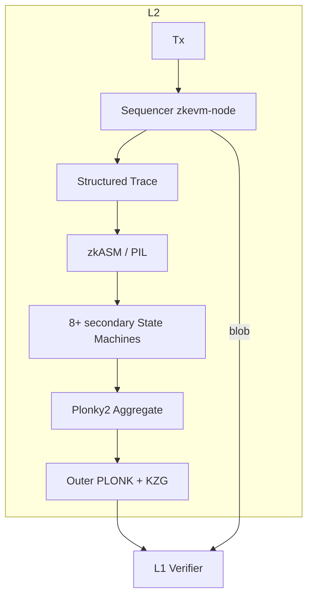

# Polygon zkEVM

> **TL;DR**：Polygon zkEVM 是 Polygon Labs（前 Matic 团队收购 Hermez Network 后）于 2023-03 主网 Beta 启动的 **Type 2 zkEVM Rollup**，以 **字节码等价** 方式兼容以太坊智能合约。其证明流水线独具特色：**zkASM（Hermez 汇编）+ PIL（Polynomial Identity Language）** 描述主执行器 **zkEVM Main State Machine**，再拆成 8+ 个 **二级 state machine**（Keccak、Memory、Arith、Binary、Padding、Storage 等），每个二级 state machine 单独证明，最后经 **Plonky2** 递归聚合并由外层 PLONK 压缩到 L1。2024 年起，Polygon 把 zkEVM 升级成 **Polygon CDK（Chain Development Kit）** 的参考实现，同时推出 **AggLayer**——一个跨多条 zk-chains 的**原子结算与流动性聚合层**，目标是"把 L2 碎片化问题用 ZK 一次性解决"。截至 2026-04，Polygon zkEVM 独立 TVL 处于 L2 中段（DefiLlama），更大规模部署在接入 AggLayer 的 CDK 链上（X1、Immutable zkEVM、Astar zkEVM、Canto 等）。

---

## 1. 背景与动机

Polygon Labs（原 Matic Network，2017 印度团队）长期以 **"Ethereum 扩容全家桶"** 定位。2021-08 以 2.5 亿美元收购 Hermez Network（zk-Rollup，专注 payments），延伸成 **Polygon Hermez → Polygon zkEVM** 通用路线。主要动机：

1. **补齐 Polygon 生态 zk 能力**：2021–2023 Polygon 同时做 Polygon PoS（侧链）、Miden（zk-friendly VM）、Zero（zkEVM 另一路线，后整合）、Nightfall（企业隐私），zkEVM 为中心落点。
2. **Type 2 等价 + Plonky2 快速证明**：Plonky2（Mir Protocol 开源）是 FRI-based SNARK，在 CPU 上证明极快（> 10x Groth16）；搭配 PIL/zkASM 能在不牺牲等价性的前提下保持证明可行。
3. **把 Polygon PoS、Polygon zkEVM、AggLayer 打包成 CDK 叙事**：不求 Polygon zkEVM 独大，而求成为 CDK / AggLayer 生态的"zk 参考链"。

## 2. 核心原理

### 2.1 形式化定义

```
state', trace = EVM(state, batch)
π_main        = Prove_Plonky2(MainSM(trace))
π_secondary   = Prove_Plonky2(Keccak/Memory/Arith/... SMs)
π_aggregate   = Aggregate(π_main, π_secondaries)
π_final       = CompressPLONK_KZG(π_aggregate)
1             = Verify_L1(vk, π_final, publicInput)
```

**zkEVM Main State Machine** 由 zkASM 描述，通过 PIL 编译成多项式约束；其每一"行"对应 zkEVM ROM 中一条 microop，每"列"是一个状态寄存器。

### 2.2 zkASM / PIL / PILStark

- **zkASM（Hermez Assembly）**：手写的类汇编，描述 zkEVM main / secondary SMs 的状态转移；解释每条 EVM opcode 如何分解为 micro ops。
- **PIL（Polynomial Identity Language）**：把 zkASM 的约束翻译成多项式恒等式。PIL 编译器产出 zk 友好电路。
- **PILCom / PILStark**：PIL 的编译器与 STARK prover 后端；把约束多项式转成可用 FRI 证明的 AIR 形式。
- **Plonky2**：Mir Protocol 的 FRI-based SNARK，Goldilocks field `2^64 - 2^32 + 1`；用作递归聚合的主要 backend。
- **外层 PLONK+KZG**：把 Plonky2 证明再包一层，便于 L1 低成本 verify（bn254 曲线）。

### 2.3 状态机拆解

| 子 SM | 职责 | 为什么单独拆 |
| --- | --- | --- |
| Main SM | 串联 EVM 执行 | 核心调度 |
| Memory SM | EVM memory 读写一致性 | 访问频繁，需独立 lookup |
| Storage SM | Sparse Merkle Tree 更新 | MPT 深度差异 |
| Arith SM | 乘法 / mod | bigint 代价高 |
| Binary SM | AND / OR / XOR | 位操作优化 |
| Keccak SM | Keccak-f[1600] | 非 zk-friendly，代价巨大 |
| Padding SM | Keccak 预处理 | 配套 Keccak |
| PoseidonG SM | Poseidon in Goldilocks | 内部哈希 |
| MemAlign SM | 对齐字段抽取 | 内存拷贝辅助 |

每个子 SM 独立生成证明，之间通过 **lookup argument** 关联（例如 Main SM 从 Storage SM 里"查"某笔写入是否合法）。

### 2.4 Merkle 树与状态承诺

Polygon zkEVM 使用 **Sparse Merkle Tree（SMT）+ Poseidon hash** 替代 L1 的 Keccak-MPT；属于 Type 2 声明的等价性差异之一。SMT 把每个账户 / storage slot 按固定 256-bit key 索引，固定深度，写入更新路径固定，利于电路化。

### 2.5 AggLayer 原理

**AggLayer**（原名 LxLy / Polygon 0） 是 2024 年推出的跨 chain 结算层：

- 各 CDK 链生成 **pessimistic proof** 证明自己"没有 double-spend"、"没有无效提现"。
- 所有链的 pessimistic proof + ZK state proof 聚合到一条 AggLayer 证明，一次 finalize 到 L1 Ethereum。
- 用户跨链时使用 **unified bridge**：同一套合约接口在所有 CDK 链上 atomic transfer。
- 目标：让 CDK 链之间的跨链像同一条链的内部转账一样原子、安全。

### 2.6 参数与常量

| 参数 | 值（2026-04） | 备注 |
| --- | --- | --- |
| Chain ID | 1101（zkEVM 主网）、1442（Goerli，已弃） | zkevm-contracts |
| L2 block time | 2 秒 | zkevm-node 配置 |
| Finalization | 约 30–60 分钟 | 受 prover 流水线影响 |
| Fork upgrades | Dragonfruit、Etrog、Elderberry、Feijoa | zkevm-contracts release |
| State hash | Poseidon SMT（Goldilocks） | 规范文档 |

### 2.7 边界条件与失败模式

- **Sequencer 单点** + **强制 queue**：用户可以直接向 L1 `forceBatch` 强制上链，Sequencer 必须在 timeout 内包含，否则社区可接管。
- **Prover 阶段锁**：若 prover 停摆，L2 继续但不 finalize；超 7 天进入 emergency 模式（治理可介入）。
- **电路 bug 历史**：2023-04 Polygon zkEVM 修复 Proof of Efficiency（PoE）合约一处 edge case，未发生资金损失；2024 披露过 "ForkID 切换" 中的潜在不一致，紧急升级修复。
- **Dragon Fruit/Etrog upgrade 数据一致性**：硬分叉升级需协调 sequencer、prover、L1 合约三者版本一致。



## 3. 架构剖析

### 3.1 分层视图

```
┌──────────────────────────────────────────────┐
│ L1 Contracts                                  │
│  ├─ PolygonZkEVMContract (state root)         │
│  ├─ PolygonZkEVMBridge (canonical bridge)     │
│  └─ Plonk Verifier                            │
├──────────────────────────────────────────────┤
│ Proving Pipeline                              │
│  ├─ zkASM / PIL                               │
│  ├─ 8+ Secondary State Machines               │
│  ├─ Plonky2 Aggregation                       │
│  └─ Outer PLONK (bn254/KZG)                   │
├──────────────────────────────────────────────┤
│ L2 Execution                                  │
│  ├─ zkevm-node (Go)                           │
│  ├─ zkevm-prover (C++ daemon)                 │
│  ├─ zkevm-bridge-service                      │
│  └─ RPC / JSON-RPC                            │
├──────────────────────────────────────────────┤
│ AggLayer Overlay                              │
│  ├─ Pessimistic proof                         │
│  ├─ Unified bridge                            │
│  └─ ZK settlement orchestrator                │
└──────────────────────────────────────────────┘
```

### 3.2 核心模块清单

| 模块 | 仓库 / 路径 | 职责 | 可替换性 |
| --- | --- | --- | --- |
| zkevm-node | `0xPolygonHermez/zkevm-node` | Go 实现的 sequencer / RPC / synchronizer | 主要实现 |
| zkevm-prover | `0xPolygonHermez/zkevm-prover` | C++ prover 守护进程 | 单实现 |
| zkevm-contracts | `0xPolygonHermez/zkevm-contracts` | L1 核心合约 | 多签升级 |
| zkevm-rom | `0xPolygonHermez/zkevm-rom` | 用 zkASM 写的 zkEVM ROM | 核心逻辑 |
| zkevm-proverjs | `0xPolygonHermez/zkevm-proverjs` | JS 参考 prover | 教学/测试 |
| plonky2 | `mir-protocol/plonky2` | FRI SNARK | 独立开源 |
| cdk-validium-node | `0xPolygon/cdk-validium-node` | CDK Validium 模式 | CDK 版 |
| AggLayer | `agglayer/` repos | 跨链聚合证明 | 独立服务 |
| Polygon CDK | `0xPolygon/cdk` | 一键发 zk-Rollup / Validium 的工具包 | 开源 |

### 3.3 数据流

**一次 Tx 生命周期**：

1. 用户 → Polygon zkEVM RPC。
2. `zkevm-node` 执行、出块（2 秒）。
3. `zkevm-node`（sequencer role）把一批 batch 提交到 L1 `PolygonZkEVMContract.sequenceBatches`。
4. Prover 组件（`zkevm-prover`，C++ 守护进程）从 `zkevm-node` 拉 trace，跑 PIL + Plonky2，生成最终 PLONK 证明。
5. Aggregator 调 L1 `verifyBatchesTrustedAggregator`，finalize state root。
6. L2 → L1 提现通过 `PolygonZkEVMBridge` + `claimAsset`，依赖 final state root 包含提现 Merkle 证明。

### 3.4 客户端 / 参考实现

- **zkevm-node**：Go 生产 sequencer。
- **cdk-validium-node**：Validium 模式 fork。
- **zkevm-proverjs**：教学/测试 prover；生产用 C++ `zkevm-prover`。
- Foundry/Hardhat/Remix 完全兼容（RPC 层 Ethereum JSON-RPC 兼容）。

### 3.5 扩展 / 互操作接口

- 标准 `eth_*` JSON-RPC + `zkevm_*`（如 `zkevm_batchNumber`）。
- `PolygonZkEVMBridge`：ERC-20 / ETH / NFT 跨域。
- AggLayer SDK：让 CDK 链加入 unified bridge。
- LxLy 跨链（Polygon zkEVM ↔ Polygon PoS 内部链互通）。

## 4. 关键代码 / 实现细节

**zkASM 片段**（`0xPolygonHermez/zkevm-rom/main/main.zkasm`，概念性节选）：

```
; zkASM 描述一条 ADD 的 micro operation
stackPop => A            ; 弹栈顶 to A
stackPop => B            ; 弹栈顶 to B
A + B => C :ARITH        ; 调用 Arith SM 做加法
C => stackPush           ; 结果压栈
GAS - 3 => GAS           ; 消耗 3 gas
```

**L1 `sequenceBatches`**（`PolygonZkEVMEtrog.sol` 简化）：

```solidity
function sequenceBatches(
    BatchData[] calldata batches,
    address l2Coinbase,
    uint64 maxSequenceTimestamp,
    uint64 initSequencedBatch,
    bytes32 expectedFinalAccInputHash
) external onlyTrustedSequencer {
    // 校验 batches 长度、累计 input hash 正确
    // 更新 lastBatchSequenced / sequencedBatches[batchNum]
    emit SequenceBatches(lastBatchSequenced, l1InfoRoot);
}

function verifyBatchesTrustedAggregator(
    uint64 pendingStateNum, uint64 initNumBatch, uint64 finalNewBatch,
    bytes32 newLocalExitRoot, bytes32 newStateRoot,
    bytes32[24] calldata proof
) external onlyTrustedAggregator {
    // 构造 publicInput；调用 rollupVerifier.verifyProof
    // 更新 batchNumToStateRoot[finalNewBatch] = newStateRoot;
    emit VerifyBatchesTrustedAggregator(finalNewBatch, newStateRoot);
}
```

## 5. 演进与版本对比

| 时间 | 事件 |
| --- | --- |
| 2021-08 | 收购 Hermez Network |
| 2023-03-27 | **Polygon zkEVM 主网 Beta 启动** |
| 2023-Q4 | Dragonfruit 硬分叉（gas 优化） |
| 2024-02 | Etrog 分叉（升级 Fork ID，修复电路） |
| 2024-Q2 | Elderberry 分叉（AggLayer 早期） |
| 2024-Q4 | **AggLayer v0.2 主网**，第一批 CDK 链接入（X Layer、Astar zkEVM、Immutable zkEVM） |
| 2025 | Feijoa / 后续分叉；POL 代币迁移完成 |
| 2025–2026 | AggLayer + Pessimistic proof 扩展到 Validium / sovereign rollup |

## 6. 实战示例

```bash
# Polygon zkEVM Mainnet
# ChainID: 1101
# RPC:     https://zkevm-rpc.com

# 部署合约
forge create --rpc-url https://zkevm-rpc.com \
  --private-key $PRIV src/Counter.sol:Counter

# 通过 Polygon Bridge 从 L1 桥入资产：
# https://portal.polygon.technology 图形化
# 合约： PolygonZkEVMBridge.bridgeAsset(destNetwork, destAddr, amount, token, forceUpdateRoot, metadata)
cast send $BRIDGE "bridgeAsset(uint32,address,uint256,address,bool,bytes)" \
  1 $RECIPIENT 10000000 $USDC true 0x \
  --rpc-url $L1_RPC --private-key $PRIV
```

## 7. 安全与已知攻击

1. **2023-04 PoE bounds**：Polygon zkEVM 团队在主网早期发现 PoE 合约一处潜在漏洞，紧急修补，未造成损失。
2. **Fork ID 升级风险**：多次硬分叉（Dragonfruit / Etrog / Elderberry / Feijoa）需严格协调升级；官方提供 fork timeline 文档。
3. **Sequencer 中心化 & Force Batch**：Polygon Labs 运营 trusted sequencer；`forceBatch` 提供抗审查逃生舱。
4. **桥 & AggLayer 新风险面**：Pessimistic proof 本质是"桥不会多出资金"；若证明系统或 accounting bug，可能影响全部接入链的资产。业界仍在审视其系统性风险。
5. **Plonky2 / PIL 内生复杂度**：多个二级 SM + 递归聚合提高 prover 审计难度；Polygon 依赖 Trail of Bits、Hexens、Spearbit 多家审计。
6. **治理**：升级由 Polygon Labs 多签 + DAO 控制，具体权限与时间锁见 `zkevm-contracts`。

## 8. 与同类方案对比

| 维度 | Polygon zkEVM | Scroll | zkSync Era | Linea |
| --- | --- | --- | --- | --- |
| 证明 | PIL + Plonky2 + PLONK | Halo2 + KZG | Boojum STARK→PLONK | gnark Arcane/Vortex + PLONK |
| 等价性 | Type 2 | Type 2 | Type 4 | Type 2-ish |
| State hash | Poseidon SMT（Goldilocks） | Poseidon MPT | zkSync 私有 Merkle | MiMC SMT |
| 生态策略 | CDK + AggLayer（多链） | 单链聚焦 | ZK Stack（多链） | MetaMask 分销 |
| L1 gas | 高（Plonky2 聚合复杂） | 中 | 中 | 中 |
| 开源度 | 高（prover、node、合约、ROM） | 高（与 PSE 共建） | 高（Boojum 开源） | 中高 |

**trade-off**：Polygon 的多 SM 拆解 + Plonky2 聚合在 prover 吞吐上占优，代价是架构复杂、审计链路长；AggLayer 是其长期战略杠杆。

## 9. 延伸阅读

- **Tier 1（官方）**
  - 官方文档：<https://docs.polygon.technology/zkEVM/>
  - zkevm-node：<https://github.com/0xPolygonHermez/zkevm-node>
  - zkevm-prover：<https://github.com/0xPolygonHermez/zkevm-prover>
  - zkevm-rom：<https://github.com/0xPolygonHermez/zkevm-rom>
  - AggLayer：<https://github.com/agglayer>
  - Plonky2：<https://github.com/mir-protocol/plonky2>
- **Tier 2（研究）**
  - L2BEAT：<https://l2beat.com/scaling/projects/polygonzkevm>
  - Vitalik zkEVM 分类：<https://vitalik.eth.limo/general/2022/08/04/zkevm.html>
  - Messari Polygon 报告：<https://messari.io>
- **Tier 3（博客）**
  - Polygon 博客：<https://polygon.technology/blog>
  - Jordi Baylina（首席科学家）演讲与 GitHub
  - 登链社区 Polygon zkEVM 专栏：<https://learnblockchain.cn/tags/Polygon>

## 10. 术语表

| 术语 | 英文 | 释义 |
| --- | --- | --- |
| zkASM | zkASM | Hermez 自定义 zk 汇编 |
| PIL | Polynomial Identity Language | 把 zkASM 翻成多项式约束的 DSL |
| Plonky2 | Plonky2 | Mir 开源的 FRI-based SNARK |
| SMT | Sparse Merkle Tree | 稀疏 Merkle 树 |
| Goldilocks field | Goldilocks | `2^64 - 2^32 + 1` 的 61-bit 素域 |
| AggLayer | Aggregation Layer | Polygon 的跨 chain 聚合结算层 |
| CDK | Chain Development Kit | Polygon 的一键部署 ZK / Validium 链工具 |
| Pessimistic proof | Pessimistic Proof | 保证跨 chain "不会多出资金" 的证明类型 |

---

*Last verified: 2026-04-22*
