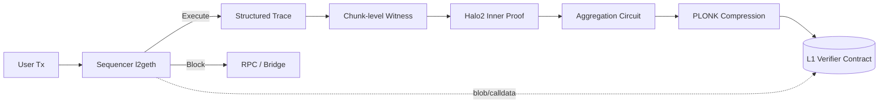

# Scroll

> **TL;DR**：Scroll 是由 Ye Zhang、Sandy Peng 等于 2021 年创立、2023-10 主网上线的 **字节码级等价（bytecode-level equivalent）zkEVM Rollup**。与 zkSync Era 编译 Solidity 到私有 IR、Polygon zkEVM 做 "Type 2" 等价不同，Scroll 坚持 **在 opcode 粒度与 EVM 等价**——使用魔改版 `go-ethereum`（`scroll-tech/go-ethereum`）产生 **EVM execution trace**，再由 **Halo2 + KZG** 电路（`scroll-tech/zkevm-circuits`）证明该 trace 的合法性，L1 上的 **PLONK verifier** 核验最终 proof。开发者无需改工具链：Foundry、Hardhat、OpenZeppelin、Etherscan verification 全部原生可用。截至 2026-04，Scroll 主网 TVL 约 5–8 亿美元（DefiLlama），完成 EIP-4844 blob 迁移与 **Euclid 升级**，sequencer 与 prover 均计划分阶段去中心化。Scroll 与以太坊基金会 PSE（Privacy & Scaling Explorations）长期合作开源 zkEVM 电路，是 ZK 赛道中最"EVM 原教旨主义"的项目之一。

---

## 1. 背景与动机

2021 年 Scroll 三位创始人来自斯坦福 + 清华背景，早期与 PSE 团队合作开源 zkEVM 研究。核心命题是：**既然 Ethereum L1 的终点是 "Rollup-centric scaling"，那么 zkEVM 必须在语义上与 L1 EVM 完全一致，才能让 L1 生态无痛迁移并在未来 **合并** 回 L1**。Vitalik 在 2022-08 "zkEVM 分类" 文中将完全等价称为 **Type 1**，性能代价最高；次之的 **Type 2** 略微修改 state trie / gas，换来更短证明。Scroll 定位为 **Type 2**（实践中接近 Type 2.5——修改极少）。

动机归结为：

1. **生态零迁移成本**：同一份 Solidity 源码、同一份 bytecode、同一份 JSON-RPC、同一份签名规则。
2. **长期可与 L1 合并**：若 L1 未来引入 zkEVM snark，可直接复用 Scroll 电路。
3. **开源共建**：Scroll 与 PSE 共同维护 zkevm-circuits，对社区研究友好，与 zkSync 的闭源 Boojum 形成对照。

## 2. 核心原理

### 2.1 形式化定义

Scroll Rollup 的状态转移与通用 zk-Rollup 同构，但多出一个关键约束：

```
  state', trace = EVM(state, batch)                // 完全遵循以太坊黄皮书
  π              = Prove_Halo2(zkEVMCircuit(trace, state, state'))
  1              = VerifyPLONK(vk, π, PI)
```

其中 `EVM(·)` 必须满足：对任何 bytecode B、任何调用数据 calldata，其行为与 `go-ethereum/core/vm.Interpreter` 在 `cancun/prague` 分叉下的输出**位相等**（modulo Scroll 显式豁免的少数差异，见 2.6）。`zkEVMCircuit` 是一个**多子电路联合体**（见 2.3），把 trace 解构成各子电路的 lookup 与 custom gate。

### 2.2 证明系统：Halo2 + KZG

Scroll 选择 Halo2（ECC 团队在 Zcash Orchard 中推广）的原因：

- **灵活的多项式承诺**：可插入 KZG（PLONK 风格，`bn254` 曲线）或 IPA（内积，无需 trusted setup）。Scroll 主网使用 **KZG**（复用 EIP-4844 / Powers-of-Tau）。
- **Plookup / halo2-lookup 原语**：可把"字节运算、keccak 常量、预编译表"等打成大查表，极大压缩约束个数。
- **递归友好**：Halo2 有成熟 folding / accumulation 方案，可聚合多 batch 证明，再由外层 SNARK 压缩以便 L1 便宜 verify。

递归结构如下：**Inner proof (Halo2, KZG)** → **Aggregation proof (Halo2)** → **Compression proof (PLONK)**，最终 L1 上只跑一次 `plonk-verifier.sol`。

### 2.3 zkEVM 电路子机制

`scroll-tech/zkevm-circuits` 的核心子电路（2023 版本后基本稳定）：

- **EVM Circuit**：逐 opcode 约束执行语义，state transition。是主干电路。
- **State Circuit**：验证 state read/write 的一致性（基于 random linear combination 的 RW Table）。
- **MPT Circuit**：以 Poseidon 为 hash 的 **Merkle Patricia Trie** 更新证明（与 L1 使用 Keccak 的 trie 不同——这是 Scroll 少数几处非 100% 等价之处，出于 zk-friendly 考量）。
- **Keccak Circuit**：证明预映像到摘要的 keccak-f[1600] 约束；代价极大，占电路容量的 25–40%。
- **ECDSA / EC Precompile Circuit**：secp256k1、modexp、ecrecover 等预编译的电路化。
- **Bytecode Circuit**：约束合约代码哈希与运行时逐 opcode 的一致性。
- **Copy Circuit / RLP Circuit / Tx Circuit**：处理 memory/copy 操作、交易 RLP 编码、交易签名验证等。

各子电路通过 **shared RW Table、Bytecode Table、Block Table、Tx Table** 交叉引用（lookup argument），保证"EVM 视角下同一变量在不同子电路中一致"。

### 2.4 Trace → Witness 生成

Sequencer 使用修改版 `scroll-tech/go-ethereum`（`l2geth`）执行区块，除了更新状态，还输出 **structured trace**：

- 每条 opcode 的 gas、stack top、memory slice、storage read/write；
- 预编译调用参数；
- state trie 变更路径。

Prover 以该 trace 为 witness 填满 zkEVM 电路，再用 Halo2 `create_proof` 生成 STARK-like proof（Halo2 底层是 FRI-free Plonkish）。

### 2.5 参数与常量

| 参数 | 取值（2026-04） | 出处 |
| --- | --- | --- |
| L2 block time | 3 秒 | `scroll` 配置 |
| Batch 大小 | ≈ 45 blocks | 动态调整 |
| Chain ID | 534352（主网）、534351（Sepolia） | scroll-tech/go-ethereum |
| L1 Verifier gas | ~200k–400k / batch（blob 后降低） | L1 监控 |
| Hashing in MPT | Poseidon | MPT Circuit spec |
| EVM 分叉 | 对齐 Cancun（2024），Prague/EOF 对齐中 | Scroll release notes |

### 2.6 与 L1 EVM 差异

Scroll 大方承认的等价性差异：

- **State trie hash**：Poseidon vs Keccak（出于 zk 成本）。对智能合约不可感知，除非用 `blockhash/EXTCODEHASH` 做某种 trie 深度依赖的断言。
- **不支持的预编译**：`RIPEMD160`、`BLAKE2F` 曾被禁用，后续引入。
- **Block hash / coinbase**：含义与 L1 语义略有调整。
- **Gas 调度**：与 L1 基本一致，个别 opcode（如 `SELFDESTRUCT`）在 Cancun 后与 L1 同步禁用。

### 2.7 边界条件与失败模式

- **Sequencer 审查**：单点 Sequencer 可拒交易；Scroll 计划经 L1 `force include queue` 保障审查抗性。
- **Prover 故障**：prover 是无状态的、可多实例并行；但若所有 prover 停摆，pre-confirmed 状态无法上链。
- **Trusted setup 风险**：KZG ceremony 复用以太坊 KZG ceremony（EIP-4844 同一份 `powers of tau`），全社区参与度高。
- **电路 bug**：zkEVM 电路极复杂，已有多轮 OpenZeppelin / Zellic 审计，并设 Security Council 用于紧急暂停。



## 3. 架构剖析

### 3.1 分层视图

```
┌───────────────────────────────────────────────┐
│ L1 Contracts                                   │
│  ├─ L1ScrollMessenger / L1MessageQueue         │
│  ├─ ScrollChain (rollup commit/finalize)       │
│  └─ PLONK Verifier (.sol)                      │
├───────────────────────────────────────────────┤
│ Coordinator / Prover Cluster                   │
│  ├─ Coordinator (Go)                           │
│  ├─ Chunk Prover / Batch Prover / Bundle Prover│
│  └─ GPU/CPU Halo2 circuits                     │
├───────────────────────────────────────────────┤
│ L2 Execution                                   │
│  ├─ Sequencer (scroll-tech/go-ethereum)        │
│  ├─ Relayer (L1↔L2 messaging)                 │
│  └─ Bridge History Indexer                     │
├───────────────────────────────────────────────┤
│ Node / Developer                               │
│  └─ RPC (eth_*) — 与 L1 完全同构                │
└───────────────────────────────────────────────┘
```

### 3.2 核心模块清单

| 模块 | 仓库 / 路径 | 职责 | 可替换性 |
| --- | --- | --- | --- |
| `l2geth` | `scroll-tech/go-ethereum` | L2 execution client，fork 自 go-ethereum | 向社区开放，可再 fork |
| `zkevm-circuits` | `scroll-tech/zkevm-circuits` | Halo2 zkEVM 电路 | 与 PSE 共建 |
| `zkevm-prover` | `scroll-tech/zkevm-prover`（历史 C++）、Rust `prover` crate | 跑 Halo2 + GPU 证明 | 多 prover 并行 |
| `coordinator` | `scroll-tech/scroll/coordinator` | 调度 prover 任务、收集 proof | 单实现 |
| `bridge-history-api` | `scroll-tech/bridge-history-api` | 存 L1↔L2 消息 | 独立 |
| `rollup-relayer` | `scroll-tech/scroll/rollup` | 把 batch commit/proof 提交 L1 | 单实现 |
| `contracts` | `scroll-tech/scroll-contracts` | L1 / L2 Solidity 合约 | 升级由 Security Council 管控 |
| `go-kzg-4844` | 复用以太坊 | blob 相关加密操作 | 共享以太坊栈 |

### 3.3 端到端数据流

**一次 Tx 生命周期**：

1. **用户 → RPC**：以 L1 兼容的 `eth_sendRawTransaction` 提交到 Scroll RPC；交易格式与 L1 完全一致（legacy / EIP-1559 / EIP-4844 blob tx 除外）。
2. **Sequencer 执行**：`l2geth` 本地执行，产生 receipts、state diff、结构化 trace；3 秒出块。
3. **Chunk 组装**：多个 block 组装成一个 chunk（证明单位，通常 10–60 个 block）。
4. **Chunk Proof**：Coordinator 把 chunk 的 trace 分配给空闲 Chunk Prover，产生 chunk-level Halo2 证明。
5. **Batch / Bundle Proof**：多 chunk 聚合为 batch，batch 再聚合为 bundle，最后一级用 PLONK 压缩。
6. **L1 提交**：
   - `commitBatch`：把 batch 的 data / blob 发到 L1（EIP-4844 blob 降低成本）。
   - `finalizeBatchWithProof`：发送压缩后的 proof，L1 `Verifier.verifyProof()` 通过则更新 `finalizedStateRoot`。
7. **L2→L1 提款**：用户等 finalize 后在 L1 `L1ScrollMessenger.relayMessageWithProof` 完成提现。

可观测点：RPC `eth_getBlockByNumber` / `eth_getTransactionReceipt`（状态）；Scrollscan 显示 `Batch Index / Chunk Index / Finalize Tx`；L1 事件 `CommitBatch`、`FinalizeBatch`。

### 3.4 客户端与参考实现

- `scroll-tech/go-ethereum`：主流；生产 sequencer / RPC / full node 都基于此。
- **Reth 适配**（研究中）：社区讨论把 `paradigmxyz/reth` 适配为 L2 client，实现客户端多样性。
- 开发者可使用任何兼容 EVM 的工具：**Hardhat、Foundry、Remix、Ethers.js、Viem、Ape** 均开箱可用。

### 3.5 扩展 / 互操作接口

- **标准 JSON-RPC**（`eth_`、`net_`、`web3_`）+ Scroll 特有 `scroll_traceBlock`、`scroll_getL1MessageQueueIndex`。
- **L1↔L2 Messaging**：`L1ScrollMessenger` / `L2ScrollMessenger`；兼容 Optimism 风格 cross-domain messenger。
- **Canonical Bridge**：ETH、ERC-20、ERC-721。
- **第三方桥**：Orbiter、Hop、Stargate、LayerZero。

## 4. 关键代码 / 实现细节

**`l2geth` 的 trace hook**（概念性片段，实际分散于 `core/vm/evm.go` 与 `rollup/tracing`）：

```go
// scroll-tech/go-ethereum/rollup/tracing/tracing.go（节选、简化）
type StructLog struct {
    Pc        uint64
    Op        OpCode
    Gas       uint64
    GasCost   uint64
    Stack     []*big.Int
    MemorySlice []byte
    Storage   map[Hash]Hash
}

func (t *StructLogger) CaptureState(pc uint64, op OpCode,
        gas, cost uint64, scope *ScopeContext, ...) {
    t.logs = append(t.logs, StructLog{
        Pc: pc, Op: op, Gas: gas, GasCost: cost,
        Stack: dupStack(scope.Stack),
        // ... memory / storage snapshot
    })
}
```

**L1 提交合约核心接口**（`scroll-tech/scroll-contracts/src/L1/rollup/ScrollChain.sol`，简化）：

```solidity
function commitBatch(
    uint8 version,
    bytes calldata parentBatchHeader,
    bytes[] memory chunks,
    bytes calldata skippedL1MessageBitmap
) external onlySequencer;

function finalizeBatchWithProof(
    bytes calldata batchHeader,
    bytes32 prevStateRoot,
    bytes32 postStateRoot,
    bytes32 withdrawRoot,
    bytes calldata aggrProof
) external onlyProver {
    require(verifier.verifyAggregateProof(version, batchHash, aggrProof, publicInput));
    finalizedStateRoots[batchIndex] = postStateRoot;
    withdrawRoots[batchIndex] = withdrawRoot;
    emit FinalizeBatch(batchIndex, batchHash, postStateRoot, withdrawRoot);
}
```

## 5. 演进与版本对比

| 时间 | 事件 |
| --- | --- |
| 2021-12 | Scroll 立项，与 PSE 合作 |
| 2022-Q3 | Pre-alpha testnet（无 proof） |
| 2023-02 | Alpha testnet（带 proof） |
| 2023-10-17 | **主网上线**（Scroll Mainnet Genesis） |
| 2024-03 | Cancun/EIP-4844 blob 支持，gas 费大幅下降 |
| 2024-06 | 引入 bundle proof，finalize 频率提高 |
| 2024-10 | Proof cost 降至 ~$0.0001 / tx 级 |
| 2025 | **Euclid Upgrade**：MPT -> Binary Merkle Tree 研究、Prover 性能 2x |
| 2025–2026 | Sequencer / Prover 去中心化、Stage 1 → Stage 2 目标 |

## 6. 实战示例

```bash
# 加网
# Scroll Mainnet: chainId 534352, RPC https://rpc.scroll.io
# 部署合约（Foundry 无需任何 Scroll 特殊参数）
forge create --rpc-url https://rpc.scroll.io \
  --private-key $PRIV \
  src/Counter.sol:Counter

# 存款 (L1 -> L2) 使用官方 Bridge 合约：
# L1GatewayRouter.depositETH{value: 0.01 ether}(l2Address, gasLimit)
cast send 0xF8B1378579659D8F7EE5f3C929c2f3E332E41Fd6 \
  "depositETH(address,uint256)" $RECIPIENT 170000 \
  --value 0.01ether --rpc-url $L1_RPC --private-key $PRIV
```

预期：几分钟后 L2 地址到账；Scrollscan 可查对应消息 hash。

## 7. 安全与已知攻击

1. **审计**：主网上线前由 OpenZeppelin、Zellic、Trail of Bits 审计核心合约与部分电路；结果公开。
2. **Security Council**：9/15 多签可紧急暂停合约、回滚 state root，治理文档见官方博客。
3. **Trusted Setup**：直接复用以太坊 KZG ceremony，社区 14 万+ 参与者，单点失效概率极低。
4. **电路 bug 案例**（行业级）：Scroll 虽暂无主网电路漏洞公开，但业内如 Polygon zkEVM 曾披露 critical（2023-04）— 提醒所有 zkEVM 持续审计必要。
5. **桥风险**：canonical bridge 是未来资产最大集中点；慢窗口提现 + Security Council 提供保护。
6. **Sequencer 审查**：用户可通过 `L1MessageQueue.appendCrossDomainMessage` 强制交易上链；Sequencer 必须在 T 块内处理，否则会被惩罚（未来阶段）。

## 8. 与同类方案对比

| 维度 | Scroll | zkSync Era | Polygon zkEVM | Linea | Starknet |
| --- | --- | --- | --- | --- | --- |
| 等价性 | Type 2（bytecode-level） | Type 4（language-level） | Type 2 | Type 2 | 不等价（Cairo VM） |
| 证明系统 | Halo2 + KZG（PLONK） | Boojum STARK→PLONK | Plonky2 | PLONK + Arcane | STARK |
| State hash | Poseidon MPT | zkSync 私有 Merkle | Sparse MT | Keccak MPT | Pedersen/Poseidon Patricia |
| 开源电路 | 是（与 PSE 共建） | 是（Boojum） | 部分（Plonky2） | 部分 | 是（Stone/Stwo） |
| 合约语言 | 任意 EVM bytecode | Solidity/Vyper → LLVM | 任意 EVM bytecode | 任意 EVM bytecode | Cairo |
| 账户抽象 | 需 ERC-4337 | 原生（Type 113） | 需 ERC-4337 | 需 ERC-4337 | 原生 |

**trade-off**：Scroll 牺牲部分性能（Type 2 电路更复杂、prover 更慢）以换取生态兼容；zkSync 主打 Rust/LLVM 管道性能但语义差异更大。

## 9. 延伸阅读

- **Tier 1（官方）**
  - 官方文档：<https://docs.scroll.io>
  - 主仓库：<https://github.com/scroll-tech/scroll>
  - zkEVM 电路：<https://github.com/scroll-tech/zkevm-circuits>
  - L2 geth：<https://github.com/scroll-tech/go-ethereum>
  - Scrollscan：<https://scrollscan.com>
- **Tier 2（研究）**
  - L2BEAT：<https://l2beat.com/scaling/projects/scroll>
  - Vitalik "zkEVM 分类"：<https://vitalik.eth.limo/general/2022/08/04/zkevm.html>
  - Electric Capital zkEVM 对比：<https://www.electriccapital.com>
- **Tier 3（博客）**
  - Scroll 官方博客：<https://scroll.io/blog>
  - PSE research notes：<https://privacy-scaling-explorations.github.io>
  - 登链社区 Scroll 专栏：<https://learnblockchain.cn/tags/Scroll>
  - Zellic zkEVM 审计回顾：<https://www.zellic.io/blog>

## 10. 术语表

| 术语 | 英文 | 释义 |
| --- | --- | --- |
| 字节码等价 | Bytecode-level equivalence | 在 opcode/bytecode 层面与 L1 EVM 完全一致 |
| Halo2 | Halo2 | Plonkish + IPA/KZG 的证明系统 |
| MPT | Merkle Patricia Trie | Ethereum 存储树，Scroll 用 Poseidon hash 版本 |
| KZG 承诺 | KZG Commitment | 多项式承诺方案，PLONK 核心 |
| Chunk / Batch / Bundle | Chunk/Batch/Bundle | Scroll 的三级证明聚合单元 |
| PSE | Privacy & Scaling Explorations | 以太坊基金会开源 ZK 研究组 |
| Sequencer | Sequencer | 负责排序并执行交易的节点 |
| Prover | Prover | 生成 zk proof 的节点 |

---

*Last verified: 2026-04-22*
