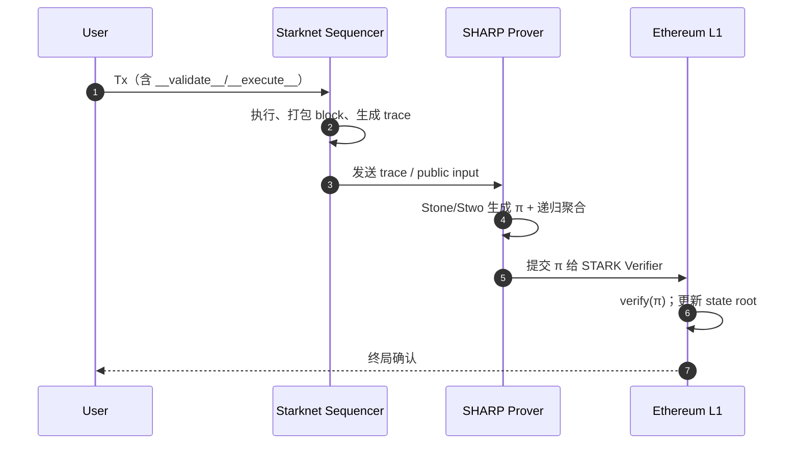

# Starknet

> **TL;DR**：Starknet 是 StarkWare 于 2021 年推出的以太坊 **通用型 ZK-Rollup**，在 L2 上以 **Cairo**（一种围绕代数中间表示 AIR 设计的图灵完备语言）编写合约，由 **Stone / Stwo prover** 生成 **STARK 证明**并通过 **SHARP（Shared Prover）批量递归聚合**，最终提交 **STARK 验证合约（Verifier）** 到 L1 结算。它选择 **STARK（多项式 IOP + Merkle + FRI）** 而非 SNARK，换来抗量子、无受信启动、证明规模对电路大小仅对数增长等性质，代价是证明体积更大、L1 验证 gas 更高。Starknet 原生实现 **账户抽象（Account Abstraction）**——不存在 EOA，所有账户都是合约，配合 **Paymaster**（SNIP-29）支持任意 gas 代币。截至 2026-04，主网 TVL 约 2–3 亿美元（DefiLlama），节点客户端包括 Rust 实现的 `pathfinder`、Go 实现的 `juno`、Rust 实现的 `papyrus` 官方参考节点，Sequencer 由 StarkWare 运营、逐步走向去中心化（Madara / Karnot / Starknet Stack）。

---

## 1. 背景与动机

2018 年 StarkWare 由 Eli Ben-Sasson、Alessandro Chiesa、Michael Riabzev 等 STARK 论文作者创立。最初产品 **StarkEx** 以"应用专用 Validium/Rollup"形式服务 dYdX、Immutable X、Sorare、rhino.fi，每家 dApp 部署一套 StarkEx 合约 + 定制电路。2021-11 StarkWare 在此基础上推出 **通用智能合约 L2——Starknet Alpha**，Ethereum Goerli Alpha 测试网启动；2022-05 Cairo 0 主网公测，2023-07 **Cairo 1 + Sierra** 架构全面切换，2024 年引入 **v0.13 Blockifier**（Rust 块执行器）、**Volition 模式（部分 DA off-chain）**、**STRK staking v1**。其存在的根本动机是：

1. **继承以太坊安全、突破吞吐瓶颈**：以太坊 L1 TPS 约 15，Gas 费波动大。Rollup 把执行移至链下、只把证明与数据提交 L1，可数量级提升吞吐。
2. **用 STARK 而非 SNARK 的工程选择**：STARK 对哈希函数以外无需结构化 setup、对量子计算机有抵抗性、证明生成后验证复杂度只与电路长度 `log(T)` 成正比，适合做"可扩展的计算完整性"。代价是证明 `O(log² T)` 规模偏大，L1 verifier 成本较高；SHARP 的聚合/递归恰好用来摊薄此成本。
3. **从 EVM 语义中解耦**：团队认为 EVM 不是 zk-friendly 架构（Keccak、256-bit 字长、栈模型），与其做 zkEVM 等价，不如设计 **zk-native VM（Cairo VM）** 直接获得更小电路，这是与 zkSync、Scroll、Polygon zkEVM 的根本分歧。

## 2. 核心原理

### 2.1 形式化定义

Starknet 作为 Rollup 的状态转移可抽象为一对函数：

```
(state', commitment) = STF(state, batch_of_txs)
π = Prove(AIR(state, batch, state'))
1 = Verify_L1(vk, π, public_inputs(state_root, state_root', batch_hash))
```

- 状态承诺：**Starknet state commitment** = Poseidon hash over 两棵 **Patricia-Merkle Trie**：`contract_trie`（合约存储与类哈希）与 `class_trie`（合约类定义哈希）。官方 spec 见 `starknet-specs/api/starknet_api_openrpc.json` 与 `docs.starknet.io/architecture/state/starknet-state`。
- 证明：执行轨迹（execution trace）编码为多项式，满足 **AIR（Algebraic Intermediate Representation）** 约束。Prover 用 **FRI（Fast Reed-Solomon IOP of Proximity）** 把"低度多项式"承诺降维为 `O(log n)` 轮 Merkle 打开。
- 公共输入：L1 Verifier 只看 `(prev_state_root, new_state_root, tx_data_hash, program_hash)`；凡 batch 内部细节都压进 π 中。

### 2.2 STARK 协议要点

核心密码学假设：**抗碰撞哈希（Rescue/Poseidon/Blake2s）+ Reed-Solomon 编码 + 随机预言机（Fiat-Shamir）**。不依赖椭圆曲线配对、不依赖可信设置（transparent setup）。主要组件：

- **Arithmetization**：任意可判定计算 → 一组多项式（trace polynomials）+ 约束多项式。Cairo 程序执行一步更新 15 个 "state columns"，每步用固定的约束模板。
- **LDE（Low-Degree Extension）**：把 trace 插值、超采样到更大域上（blow-up factor 常为 8–16），便于统计抽查。
- **FRI**：证明 trace 多项式确实是低阶。FRI 每轮把多项式"折半"降阶并 commit 新 Merkle root；Verifier 随机抽查，把 soundness error 推向可忽略。
- **Fiat-Shamir**：把交互式协议转为非交互式——所有 Verifier 随机数由之前 commit 的 Merkle root 派生。

### 2.3 Cairo / CASM / Sierra

Cairo（**Computer AIR**）是为 STARK arithmetization 设计的低级汇编 + 高级 Rust-like 语法：

- **Cairo 0（旧）**：直接写 CASM（Cairo Assembly）。
- **Cairo 1+（现用）**：引入 Rust-like 语法、线性类型、泛型；编译到 **Sierra（Safe Intermediate Representation）**——一种可向下编译到 CASM 且 **保证"任何 Sierra 程序都有合法 AIR 轨迹"** 的中间语言。Sierra 的引入解决了 Cairo 0 的一个关键问题：失败交易仍需收费，但"失败"状态必须在 prover 看来仍合法——Sierra 的 `panic` 分支被显式建模。
- **Builtins**：Pedersen、Range-check、Bitwise、Poseidon、EcOp 等专用算子有硬件化 AIR 槽，极大提升 zk-friendly 算子效率。
- **Field size**：Cairo 在素数域 `p = 2^251 + 17·2^192 + 1`（252-bit STARK-friendly prime）上做所有运算，与 EVM 的 256-bit 不兼容。

### 2.4 SHARP 与递归证明

**SHARP（Shared Prover）** 是 StarkWare 的云端证明器服务：

1. 多个 dApp / Rollup（Starknet、StarkEx 客户、旧 dYdX v3、Immutable X 等）把 Cairo 程序发给 SHARP。
2. SHARP 执行 `cairo-run` 得 trace，再跑 Stone/Stwo Prover 得 STARK 证明。
3. 多个证明通过 **Bootloader 程序 + 递归验证** 聚合：把"验证证明 π₁ 合法"本身写成 Cairo 程序、再证它；几十万笔 Tx 最终压成一张 proof。
4. 聚合后的 proof 提交给 L1 上的 **STARK Verifier 合约**（`starkware-libs/starkex-contracts`）。

递归聚合把 "每条 L2 Tx 单独上链的 L1 验证 gas" 摊薄到 **每笔几美分甚至更低**。

### 2.5 Account Abstraction 原生化

Starknet 没有 EOA：每个账户都是一个 **合约账户**，必须实现以下入口：

- `__validate__(calls)`：在 mempool 阶段被 Sequencer 调用，负责签名校验、nonce 检查。不允许访问外部存储（防止 DoS）。
- `__execute__(calls)`：验证通过后的实际执行。
- `__validate_deploy__` / `__validate_declare__`：部署/类声明路径。
- **Paymaster**（SNIP-29）：支持第三方替用户付 gas，以及用 USDC 等 ERC-20 付 gas（通过 fee token abstraction，v0.13 后稳定）。

默认账户合约如 **OpenZeppelin Cairo Account**、**Argent**、**Braavos**，签名方案不限于 secp256k1——可用 STARK 曲线、secp256r1（适配 iOS Passkeys）、WebAuthn 等。

### 2.6 数据可用性：Rollup / Validium / Volition

- **Rollup 模式**（默认）：每次 state diff 作为 `calldata` / `blob`（EIP-4844 后）发至 L1，保证 DA。
- **Validium 模式**：state diff 交给 **DAC（Data Availability Committee）** 或第三方 DA（Avail、Celestia、EigenDA）。成本更低，但安全性依赖 DAC。
- **Volition**：同一链上 **逐账户** 选择模式——用户可以把某些"热"账户（交易频繁、数据不敏感）放 Validium，其他放 Rollup。StarkEx 先行，Starknet v0.13 后支持。

### 2.7 参数与常量

| 参数 | 取值（2026-04） | 出处 |
| --- | --- | --- |
| L2 block time | 30 秒（平均） | Starknet v0.13 |
| STARK field prime | `2^251 + 17·2^192 + 1` | Cairo spec |
| Max steps / tx | 10M（主网） | `blockifier` 配置 |
| Max steps / block | 40M | v0.13 |
| L1→L2 messaging delay | 几分钟（取决于 L1 出块） | StarknetMessaging.sol |
| L2→L1 messaging delay | ~数小时（等证明上链） | 同上 |
| STRK staking minimum | 20,000 STRK（v1） | Starknet staking spec |

### 2.8 边界条件与失败模式

- **Sequencer 宕机**：当前 Sequencer 中心化；离线时 L2 暂停。L1 的 `force withdrawal` 逃逸舱口在 Madara 路线图中逐步完善。
- **Prover 离线**：L2 仍可产出区块（pre-confirmation），但无法最终在 L1 确认。pre-confirmation 状态不继承 L1 安全。
- **Cairo 程序 non-determinism 被滥用**：Cairo 允许 prover "给出提示"（hints）；若 Sierra 层面没正确约束，可能导致恶意 prover 伪造执行——Sierra 设计即为消除此攻击面。
- **L1 Verifier 漏洞**：STARK Verifier 曾多次审计（Trail of Bits、Least Authority），但若存在 soundness bug，允许伪造状态迁移。



## 3. 架构剖析

### 3.1 分层视图

```
┌────────────────────────────────────────────────┐
│  L1 (Ethereum)                                 │
│   ├─ Starknet Core Contract (state root)       │
│   ├─ STARK Verifier (Stone/Stwo verifier.sol)  │
│   └─ L1<->L2 Messaging bridge                  │
├────────────────────────────────────────────────┤
│  L2 Settlement / Proof                         │
│   ├─ SHARP (shared prover)                     │
│   ├─ Bootloader (recursion driver)             │
│   └─ State / Class tries (Patricia-Merkle)     │
├────────────────────────────────────────────────┤
│  L2 Execution                                  │
│   ├─ Sequencer (Papyrus / Madara)              │
│   ├─ Blockifier (Rust block executor)          │
│   └─ Cairo VM (C/Rust/Go/Python impls)         │
├────────────────────────────────────────────────┤
│  Client / Full node                            │
│   └─ Pathfinder (Rust) / Juno (Go) / Papyrus   │
└────────────────────────────────────────────────┘
```

### 3.2 核心模块清单

| 模块 | 仓库 / 路径 | 职责 | 可替换性 |
| --- | --- | --- | --- |
| Cairo 编译器 | `starkware-libs/cairo` | Cairo→Sierra→CASM | 单一官方实现 |
| Cairo VM | `lambdaclass/cairo-vm`（Rust）、`cairo-lang`（Py 参考） | 执行 Cairo 程序、生成 trace | 多实现（Rust、Go、Zig） |
| Blockifier | `starkware-libs/sequencer/crates/blockifier` | 块级执行、收 gas、写状态 | 可独立嵌入 sequencer |
| Sequencer | `starkware-libs/sequencer`、`madara-alliance/madara` | 接 RPC、排序、出块 | 走向去中心化（Madara/Karnot） |
| SHARP Prover | 闭源（StarkWare SaaS）+ `starkware-libs/stwo` 开源 | 生成 STARK proof | 新开源 prover Stwo 正在替代 Stone |
| Stone/Stwo | `starkware-libs/stone-prover`、`starkware-libs/stwo` | CPU/GPU 上跑的 STARK prover | Stwo（Circle STARK）逐步替代 |
| Full Node | `eqlabs/pathfinder`（Rust）、`NethermindEth/juno`（Go）、`starkware-libs/papyrus`（Rust） | 同步、RPC、状态查询 | ≥3 实现，客户端多样性良好 |
| L1 合约 | `starknet-io/starkgate-contracts`、`cairo-lang/src/starkware/starknet/solidity` | L1<->L2 桥、Verifier | 升级由 StarkWare / DAO 治理 |
| 账户合约 | `OpenZeppelin/cairo-contracts`、`argentlabs/argent-contracts-starknet` | AA 账户 | 多家（OZ / Argent / Braavos） |
| 开发工具链 | `foundry-rs/starknet-foundry`、`software-mansion/scarb` | 构建/测试 | Scarb 为官方包管理器 |

### 3.3 端到端数据流

**Invoke 交易生命周期**：

1. **用户 → Wallet**：Argent/Braavos 构造 `INVOKE_FUNCTION` tx，签名（STARK curve 或 secp256r1）。
2. **RPC → Sequencer**：Wallet 调用 `starknet_addInvokeTransaction`（JSON-RPC spec 见 `starknet-specs/api/starknet_api_openrpc.json`）。
3. **Mempool / `__validate__`**：Sequencer 调 blockifier 执行 `__validate__`，仅限受限操作（不允许读外部账户 storage）。
4. **区块打包**：每 30 秒出一个块，blockifier 执行 `__execute__`，累积 `StateDiff`。
5. **pre-confirmed**：Sequencer 广播区块，Full Node 更新本地状态——此时延迟 ~1–2 秒，但未 L1 确认。
6. **Proving**：每 N 个块（batch），Sequencer 把 trace 提交 SHARP。SHARP 生成聚合 proof，数十分钟—数小时。
7. **L1 提交**：`Starknet.sol.updateState(program_output, proof)` 调用 Verifier；gas 消耗在 EIP-4844 后降至 ~0.0x ETH/batch。
8. **终局 / L1 确认**：L1 确认即 Rollup 终局。L2→L1 消息（提款）需等 proof 上链后在 L1 `consumeMessage` 二次调用。

可观测性点：`starknet_getTransactionStatus` 返回 `ACCEPTED_ON_L2 / ACCEPTED_ON_L1`；L1 合约事件 `LogStateUpdate`、`LogMessageToL1`。

### 3.4 客户端多样性

- **Pathfinder**（Eqlabs，Rust，P0）：生产级最常用 full node。
- **Juno**（Nethermind，Go）：Go 生态，带 feeder gateway 兼容。
- **Papyrus**（StarkWare，Rust）：官方 reference，驱动内部 sequencer。
- **Deoxys**（Kasar，Rust）：社区 fork，聚焦性能。
- **Madara**（Madara Alliance，Rust，基于 Substrate）：目标是 **decentralized sequencer + app-chain** 框架。

### 3.5 扩展 / 互操作接口

- **JSON-RPC**：Starknet OpenRPC spec（`starknet_*` 方法）；独立版本号（当前 v0.7.x）。
- **Feeder Gateway**：旧 Python 网关遗留接口，逐步淘汰。
- **Messaging**：L1 `StarknetMessaging.sol` + L2 `starknet::syscalls::send_message_to_l1_syscall`。
- **Bridges**：StarkGate（官方桥）、Orbiter、LayerZero、zkBridge。

## 4. 关键代码 / 实现细节

**Cairo 2.x 合约 ERC-20 骨架**（风格参考 `OpenZeppelin/cairo-contracts` `src/token/erc20/erc20.cairo`，简化）：

```cairo
#[starknet::contract]
mod ERC20 {
    use starknet::{ContractAddress, get_caller_address};

    #[storage]
    struct Storage {
        name: felt252,
        symbol: felt252,
        total_supply: u256,
        balances: LegacyMap<ContractAddress, u256>,
        allowances: LegacyMap<(ContractAddress, ContractAddress), u256>,
    }

    #[event]
    #[derive(Drop, starknet::Event)]
    enum Event { Transfer: Transfer, Approval: Approval }

    #[constructor]
    fn constructor(ref self: ContractState,
                   name: felt252, symbol: felt252, initial_supply: u256,
                   recipient: ContractAddress) {
        self.name.write(name);
        self.symbol.write(symbol);
        self._mint(recipient, initial_supply);
    }

    #[abi(embed_v0)]
    impl ERC20Impl of IERC20<ContractState> {
        fn transfer(ref self: ContractState,
                    recipient: ContractAddress, amount: u256) -> bool {
            let sender = get_caller_address();
            self._transfer(sender, recipient, amount);
            true
        }
        // approve / transfer_from / balance_of 省略
    }
}
```

**最小 Account 合约**（简化自 `argent-contracts-starknet`）：

```cairo
#[starknet::contract(account)]
mod SimpleAccount {
    use starknet::account::Call;

    #[external(v0)]
    fn __validate__(ref self: ContractState, calls: Array<Call>) -> felt252 {
        // 1. verify signature 2. check nonce
        starknet::VALIDATED
    }

    #[external(v0)]
    fn __execute__(ref self: ContractState, calls: Array<Call>) -> Array<Span<felt252>> {
        execute_calls(calls)
    }
}
```

## 5. 演进与版本对比

| 版本 / 时间 | 关键变化 | 影响 |
| --- | --- | --- |
| 2021-11 Alpha on Goerli | 首个通用 Cairo L2 测试网 | 生态启动 |
| 2022-01 Mainnet Alpha | 主网上线 | 仅支持 Cairo 0 |
| 2023-07 v0.12 / Cairo 1 + Sierra | 引入 Sierra，消除 "failed tx 无法证明" | 安全性与 DX 大跃进 |
| 2024-01 STRK airdrop + governance | 去中心化治理启动 | 社区激励 |
| 2024-04 v0.13 Blockifier（Rust） | Py→Rust，区块执行大幅提速 | TPS 提升 |
| 2024-06 EIP-4844 blob | 数据成本大幅下降 | 手续费 <$0.01 |
| 2024-11 Parallel execution | 区块内交易并行 | 吞吐进一步提升 |
| 2025 Stwo Prover + Circle STARK | 下一代 prover，转向 31-bit 素域（M31） | 证明更快、更便宜 |
| 2025 Starknet Staking v1 | STRK 原生质押 | 向去中心化 sequencer 迈进 |

## 6. 实战示例

```bash
# 安装 Scarb（官方包管理器）+ Starknet Foundry
curl --proto '=https' --tlsv1.2 -sSf https://docs.swmansion.com/scarb/install.sh | sh
curl -L https://raw.githubusercontent.com/foundry-rs/starknet-foundry/master/scripts/install.sh | sh

# 新建项目
snforge init hello_starknet && cd hello_starknet

# 写合约 src/lib.cairo（省略）
scarb build              # 得 Sierra / CASM
snforge test             # 运行 Cairo 测试
sncast account create    # 生成账户
sncast declare --contract-name HelloStarknet   # 声明 class
sncast deploy --class-hash 0x...               # 部署实例
sncast invoke --contract-address 0x... --function increase_balance --calldata 42
```

## 7. 安全与已知攻击

1. **Sequencer 中心化风险**：目前单点 StarkWare 运营；历史上曾多次短时中断，L2 停止出块但无资金损失；逃生通道仍在完善。
2. **Starkgate Bridge 审计披露**：Peckshield / OpenZeppelin 审计中报告多条高危，均在发布前修复；桥资金额大，需持续关注。
3. **Argent 守护人机制社工风险**：Argent 引入硬件守护人恢复，理论上存在社工攻击面。
4. **Sierra 非确定性提示**：Cairo 0 时期曾有 hint manipulation 讨论，Sierra 1+ 已系统化约束。
5. **L1 Verifier 升级权限**：目前由 StarkWare 多签 + Security Council 掌控，中期计划转给 DAO。
6. **2024 StarkGate 部分代币 bridge 暂停**：发现潜在问题后主动暂停、恢复，体现响应机制。

## 8. 与同类方案对比

| 维度 | Starknet | zkSync Era | Scroll | Polygon zkEVM | Linea |
| --- | --- | --- | --- | --- | --- |
| VM | Cairo VM（zk-native） | zkEVM（LLVM-based） | zkEVM（bytecode-level） | zkEVM（Type 2） | zkEVM |
| 证明系统 | STARK（FRI） | Boojum STARK → PLONK | Halo2 + KZG | Plonky2 | PLONK + Arcane |
| 合约语言 | Cairo | Solidity/Vyper（via zkSolc） | Solidity（原生兼容） | Solidity | Solidity |
| 账户抽象 | 原生，无 EOA | 原生（Type 113） | 需 ERC-4337 | 需 ERC-4337 | 需 ERC-4337 |
| 抗量子 | 是 | 部分 | 否（KZG trusted setup） | 否 | 否 |
| L1 验证 gas | 较高（STARK） | 中等 | 中等 | 较高（Plonky2 aggregation） | 中等 |
| EVM 等价性 | 无（需 Kakarot zkEVM 兼容层） | Type 4 | Type 2 | Type 2 | Type 2 |

**trade-off**：Starknet 用 Cairo 换来更小电路、更快证明、原生 AA，代价是与 Solidity 生态不兼容（需要用 Kakarot zkEVM 或旧版 Warp 转译）。

## 9. 延伸阅读

- **Tier 1（官方）**
  - 官方文档：<https://docs.starknet.io>
  - Cairo Book：<https://book.cairo-lang.org>
  - STARK 论文（Ben-Sasson et al., 2018）：<https://eprint.iacr.org/2018/046>
  - 规范仓库：<https://github.com/starkware-libs/starknet-specs>
  - Cairo 编译器：<https://github.com/starkware-libs/cairo>
  - Stwo 下一代 prover：<https://github.com/starkware-libs/stwo>
- **Tier 2（研究）**
  - L2BEAT Starknet 页：<https://l2beat.com/scaling/projects/starknet>
  - Messari Starknet 报告：<https://messari.io/project/starknet>
  - a16z crypto 对 ZK 赛道分析：<https://a16zcrypto.com>
- **Tier 3（博客）**
  - StarkWare 官方博客：<https://starkware.co/blog/>
  - Dankrad on FRI：<https://dankradfeist.de/ethereum/2021/06/18/pcs-multiproofs.html>
  - 登链社区 Starknet 专栏：<https://learnblockchain.cn/tags/Starknet>
- **相关 SNIP**
  - SNIP-29 Fee Abstraction / Paymaster
  - SNIP-12 Typed Data Signing

## 10. 术语表

| 术语 | 英文 | 释义 |
| --- | --- | --- |
| 代数中间表示 | AIR (Algebraic Intermediate Representation) | 用多项式约束描述计算的 STARK 电路形式 |
| 快速 Reed-Solomon IOP | FRI | STARK 的 low-degree 证明核心 |
| 共享证明器 | SHARP | StarkWare 的多租户聚合 prover 服务 |
| Sierra | Safe Intermediate Representation | Cairo 中间语言，保证可证明性 |
| Poseidon | Poseidon Hash | STARK-friendly 哈希函数 |
| 账户抽象 | Account Abstraction | 账户即合约、无 EOA |
| Paymaster | Paymaster | 为用户代付 gas 的合约 |
| Validium / Volition | Validium / Volition | off-chain DA / 逐账户选 DA 的两种模式 |
| Blockifier | Blockifier | Starknet 的 Rust 块执行器 |

---

*Last verified: 2026-04-22*
