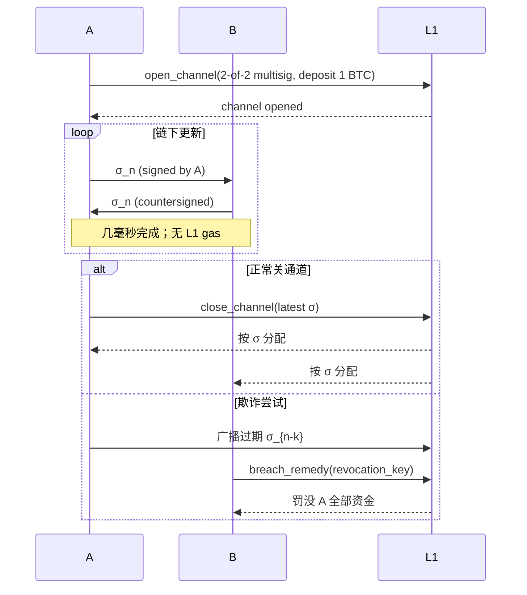

# 状态通道（State Channels）

> **TL;DR**：**状态通道（State Channels）** 是区块链最早的 L2 扩容模型：参与方先在 L1 存入抵押金打开一个通道，在通道存续期间**点对点链下交换带签名的状态更新**，L1 仅在 **开通道 / 关通道 / 争议裁决** 时被动介入。Bitcoin 上最知名实现是 **Lightning Network**（Poon-Dryja 2015 白皮书、BOLT 规范），以 HTLC（Hash Time-Locked Contract）+ 惩罚机制为基础，并演进出 **Eltoo**（SIGHASH_ANYPREVOUT）、**Taproot Channels**、**Async Payments**；Ethereum 上则有 **Raiden Network**（类 Lightning，ERC-20 支持）、**Connext**（早期 channel，后转为 generalized bridge）、**Perun**、**Magmo / statechannels.org** 等通用框架，但多数已失去长期维护。状态通道的根本优势是 **理论上无限 TPS + 零 L1 gas（通道存续期内）+ 即时终局**；根本劣势是 **仅限预先存在连接的两方或多跳网络、无法承载通用智能合约、要求用户或 watchtower 持续在线**。2019 年起通用扩容叙事被 Rollup 接管，状态通道收敛到 **支付专用**（尤其 BTC Lightning）与 **游戏/博弈等对 latency 极敏感** 的应用上。

---

## 1. 背景与动机

2015 年 Joseph Poon 与 Thaddeus Dryja 提交 Lightning 白皮书，比 Plasma 更早两年，解决比特币"区块 ≤ 7 tx/s"、手续费周期性拥堵、微支付不现实的问题。Vitalik 2016 以 Raiden 借鉴同类思想做到 ERC-20。动机要点：

1. **扩容的下限是 L1 本身**：链本身容量有限，若把交易挪到双边签名的 off-chain 消息，L1 只需当"终局结算"。
2. **端到端加密与隐私**：HTLC 多跳路由天然提供类似 onion routing 的隐私。
3. **即时性**：不受 L1 出块时间限制，链下状态更新是毫秒级。
4. **微支付**：Bitcoin L1 每笔数美元的 fee 使 < 1 美元支付无经济意义；通道内可做到几 sat 的支付。

## 2. 核心原理

### 2.1 形式化定义

定义通道 `C` 是双方（或多方）共同持有的多签 L1 UTXO/合约地址 + 通道状态 `σ`，`σ` 包含：

```
σ_n = (balance_A, balance_B, nonce = n, ... application_state)
```

合法状态更新 `σ_n → σ_{n+1}` 要求双方在 L2 对 `σ_{n+1}` **共同签名**；`nonce` 单调递增。任意一方可提交最近签过的 `σ_n` 到 L1 合约关通道；L1 合约在 **争议期（dispute window）** 内接受对手方提交更高 nonce 的版本覆盖；期满按最高版本按余额分配。

即：`L1 合约 = 一个仲裁机 + 一个按最终状态结算的托管账户`。

### 2.2 HTLC（Hash Time-Locked Contract）

多跳路径关键组件。A→B→C 转 1 BTC 步骤：

1. C 生成随机 `R`，发 `H = SHA256(R)` 给 A。
2. A 锁 1 BTC 给 B，条件：在 48 小时内提供 `preimage H⁻¹` 或 超时退回 A。
3. B 锁 1 BTC 给 C，条件：在 24 小时内提供 `preimage` 或超时退回 B。
4. C 提交 `R` 领 B 的 1 BTC；B 用同 `R` 领 A 的 1 BTC。
5. 若任何一跳超时未领，对应锁定退回。

核心数学：`R` 相同→中间节点无法私吞；时间锁阶梯保证上游超时晚于下游。

### 2.3 Lightning 惩罚机制（Poon-Dryja）

通道 commitment 具有 **非对称**性质：A 持有的 commitment 描述"A 的钱延迟 `to_self_delay` 块后可花"；B 持有的对称版本反之。若 A 尝试广播过期 `σ_{n-k}` 欺骗：

- B 使用 **revocation key**（每次更新通道后双方互换的老 commitment 撤销密钥）立刻 **罚没整个通道 balance**——attacker 不仅没得逞，还会丢光所有钱。

这是 Lightning 对"过期状态广播"最有力的威慑。

### 2.4 Eltoo（SIGHASH_ANYPREVOUT）

Poon-Dryja 要求状态互换撤销密钥、累积复杂度 O(n)，易丢数据；**Eltoo** 由 Decker/Russell/Osuntokun 2018 提出，用 `SIGHASH_NOINPUT`（Taproot 后改为 `SIGHASH_ANYPREVOUT`）让 **任意更高 nonce 的状态覆盖较低 nonce**，无需惩罚机制。2024 Taproot Assets + Eltoo 路线令 LN 从"惩罚模型"转向"更新模型"。但 `SIGHASH_ANYPREVOUT` 软分叉尚未在 Bitcoin 上激活，Eltoo 目前仅为规范。

### 2.5 Raiden 的通用化

Raiden（以太坊）把 HTLC 用 Solidity 合约 + secp256k1 签名做实现：

- `TokenNetwork` 合约：每个 ERC-20 一个网络合约，管理所有通道实例。
- `MonitoringService`：watchtower 经济激励设计。
- **Pathfinding Service (PFS)**：链下路由服务找最便宜路径。
- **Light Client (Raiden Light)**：浏览器可用的纯 JS 实现。

Raiden 还探讨 **通用状态通道（Generalized State Channels）**——在通道里跑任何可证明的 FSM（游戏、拍卖），但这部分研究后来由 **L4、Counterfactual、Magmo** 团队接过，形成 `statechannels.org` 规范；至 2020 年主流兴趣被 Rollup 稀释。

### 2.6 参数与常量（代表性）

| 参数 | Lightning | Raiden |
| --- | --- | --- |
| 开通道 L1 Tx | 2-of-2 multisig funding | `TokenNetwork.openChannel` |
| `to_self_delay` | ~144 块（24 小时） | 数天 |
| HTLC cltv_expiry_delta | 40 块左右 | 区块 or 秒 |
| Max channel size | ~10 BTC（早期上限已取消，Wumbo channel） | 视部署参数 |
| 路由算法 | BOLT #7 基于 gossip 的 Dijkstra | PFS 基于 token 网络图 |

### 2.7 边界条件与失败模式

- **对手方离线**：无法广播最新状态；需等对方回来或 watchtower 帮忙。
- **区块重组**：HTLC 超时判定需 "confirmations"；深度重组可能使同一 preimage 在两条分叉引发双花（实践中极少）。
- **Routing failure**：多跳路径中某跳无流动性/离线，payment fail，HTLC 按超时退回。
- **通用合约限制**：通道内参与者封闭集合；第三方"旁观者"无法与通道内状态交互。



## 3. 架构剖析

### 3.1 分层视图

```
┌──────────────────────────────────────────┐
│ L1 (Bitcoin / Ethereum)                  │
│   ├─ Funding multisig / TokenNetwork     │
│   ├─ Dispute / Close contract            │
│   └─ Watchtowers (contract or service)   │
├──────────────────────────────────────────┤
│ Node Software                            │
│   ├─ BOLT stack: lnd / core-lightning /  │
│   │    Eclair / LDK / Electrum LSP       │
│   └─ Raiden node / Light Client          │
├──────────────────────────────────────────┤
│ Routing / Gossip                         │
│   ├─ P2P gossip (BOLT #7)                │
│   └─ Raiden Pathfinding Service          │
├──────────────────────────────────────────┤
│ Application                              │
│   ├─ Wallet / POS / LSP                  │
│   └─ Streaming payments, games, lnurl    │
└──────────────────────────────────────────┘
```

### 3.2 核心模块清单

| 模块 | 典型实现 | 职责 | 可替换性 |
| --- | --- | --- | --- |
| Funding | Bitcoin Core / TokenNetwork.sol | L1 锁抵押 | 链决定 |
| Commitment 构造 | BOLT #3 / Raiden | 生成可广播的 off-chain tx | 实现相同语义 |
| HTLC | BOLT #3 / Raiden | 多跳原子支付 | 协议标准 |
| Channel State DB | 各 node 本地 | 保存全部 commitment | 关键备份点 |
| Gossip / Routing | BOLT #7 / PFS | 路径查找 | ✓ |
| Watchtower | Eye-of-Satoshi、LND watchtower | 代 user 监控欺诈 | ✓ |
| LSP | Lightning Service Provider（Voltage、Blink） | 为移动端开通道 | 第三方 |
| Light Client | Neutrino / SPV / lncli web | 手机使用 | ✓ |

### 3.3 端到端流程：Lightning 一笔 1000 sat 支付

1. 商家生成 `BOLT-11` invoice（含 `payment_hash = H(R)`、金额、路由 hints）。
2. 钱包发起 `sendpayment`：在本地路由表里找从自己到商家的多跳路径。
3. 钱包对路径每一跳用 **Sphinx** 洋葱加密构造 `onion_packet`，送给第一跳节点。
4. 每一跳节点剥一层 onion，检查 HTLC 参数、锁定自己的 channel，把消息转下一跳。
5. 商家收到 HTLC，检查金额 ok，用 `R` 解锁，payment_preimage 回传。
6. 每一跳用 `R` 结算自己的 HTLC，channel commitment 更新到新 balance。
7. 整个过程数百毫秒到数秒，L1 无任何交易。

### 3.4 客户端多样性

- **Bitcoin / Lightning**：
  - `lnd`（Lightning Labs，Go）
  - `core-lightning`（Blockstream，C）
  - `eclair`（ACINQ，Scala）
  - `LDK`（Lightning Dev Kit，Rust）——嵌入式 SDK，Spark、Cash App 等使用
  - `Electrum-LSP` 轻客户端
- **Ethereum / Raiden**：`raiden-network/raiden` 主实现，社区活跃度近年下降；其思想被 L2 Rollup 继承。

### 3.5 扩展 / 互操作接口

- **BOLT（Basis of Lightning Technology）**：BOLT 1-11 规范。BOLT 11 invoice / BOLT 12 offers。
- **LNURL** / **LNURL-auth / pay / withdraw**：Web 与 LN 交互标准。
- **Taproot Assets**（TARO）：在 LN 上发资产，2024 Alpha。
- **Submarine Swap**：LN ↔ on-chain 原子互换（Boltz 等）。
- **Cross-chain atomic swap via HTLC**：如 BTC ↔ LTC、BTC ↔ Ethereum（理论可行，实际限用）。

## 4. 关键代码 / 实现细节

**Raiden 通道 `closeChannel`** 简化（`raiden-network/raiden-contracts/contracts/TokenNetwork.sol`）：

```solidity
function closeChannel(
    uint256 channel_identifier,
    address partner,
    bytes32 balance_hash,
    uint256 nonce,
    bytes32 additional_hash,
    bytes calldata signature
) external {
    // 验证 partner 签名覆盖 (balance_hash, nonce, additional_hash, chain_id)
    address recovered = recoverAddressFromBalanceProof(
        channel_identifier, balance_hash, nonce, additional_hash, signature);
    require(recovered == partner, "invalid sig");
    // 进入 settlement window
    channels[key].state = State.Closed;
    channels[key].settle_block_number = block.number + settle_timeout;
    emit ChannelClosed(channel_identifier, msg.sender, nonce, balance_hash);
}
```

**Lightning HTLC commitment 片段**（概念化 Python 伪代码）：

```python
def build_commitment(local_balance, remote_balance, htlcs, to_self_delay, revocation_pubkey):
    outputs = []
    outputs.append(p2wsh(to_local_script(local_delayed_pubkey, to_self_delay, revocation_pubkey),
                         local_balance))
    outputs.append(p2wpkh(remote_pubkey, remote_balance))
    for htlc in htlcs:
        script = offered_htlc_script(htlc.payment_hash, htlc.cltv_expiry,
                                     local_htlcpubkey, remote_htlcpubkey, revocation_pubkey)
        outputs.append(p2wsh(script, htlc.amount))
    return Transaction(inputs=[funding_utxo], outputs=outputs)
```

## 5. 演进与版本对比

| 时间 | 事件 |
| --- | --- |
| 2015-01 | Poon & Dryja Lightning 白皮书 |
| 2016 | Vitalik 提出 Raiden 类比 |
| 2018-03 | Lightning mainnet 开始大规模使用 |
| 2018–2019 | Generalized state channels（Counterfactual、Magmo） |
| 2019-12 | Raiden Red Eyes / Alderaan 主网 |
| 2020 | Bitcoin Wumbo channels（取消单通道 ≤ 0.1677 BTC 限制） |
| 2021-11 | Taproot 激活，为 Taproot Channels 铺路 |
| 2022 | El Salvador 官方采用 LN（Chivo wallet） |
| 2023 | Lightning Service Providers（LSP）标准化推进 |
| 2023–2024 | Taproot Assets v0.x，LN 之上发 ERC-20 风格资产 |
| 2024 | Async Payments / Splicing 规范渐入实现 |
| 2025–2026 | Eltoo / `SIGHASH_ANYPREVOUT` 软分叉讨论继续 |

## 6. 实战示例

**LND 开通道 → 支付 → 关通道**：

```bash
# 启动一个 bitcoind（signet）+ lnd 本地节点
lnd --bitcoin.active --bitcoin.signet
# 连接对手方
lncli connect <pubkey>@<host>:9735
# 开通道，锁 100000 sat
lncli openchannel --node_key=<pubkey> --local_amt=100000
# 等 3 confirm
# 对方发来 invoice
lncli decodepayreq <bolt11>
# 支付
lncli sendpayment --pay_req=<bolt11>
# 关通道（协作式）
lncli closechannel --chan_point=<txid:idx>
```

**Raiden 开通道**：

```bash
raiden --network-id mainnet \
       --eth-rpc-endpoint $RPC \
       --keystore-path ~/.ethereum/keystore
# Web UI 内打开通道、转账
```

## 7. 安全与已知攻击

1. **Data loss → 丢 revocation key**：若一方丢数据后尝试恢复、对方用"旧但对自己最优" commitment 关通道，受害者无法出示惩罚证据。Static Channel Backups (SCB) + DLP (Data Loss Protocol) 缓解。
2. **Flood & Loot 攻击**（Harris/Zohar 2020）：攻击者同时用大量 HTLC 在多通道中阻塞目标节点的 commitment 大小，导致受害者无法按时广播 HTLC-timeout。TLV `max_accepted_htlcs` 调整 + anchor outputs 缓解。
3. **Jamming Attack**：恶意锁住路径中的 HTLC 容量使正常支付被拒；经济防御（upfront fees）正在讨论。
4. **Time-dilation eclipse attack**（Riard/Naumenko 2020）：隔离受害节点的 L1 视野，诱其接受陈旧 commitment。靠多样化对等连接、外部时间源缓解。
5. **Fee race in congested market**：当 L1 mempool 极拥塞，关通道的 HTLC-timeout 无法及时确认，HTLC 可能双花风险。Anchor outputs + CPFP 缓解。
6. **Raiden 历史**：无大规模资金损失公开事件；项目活跃度下降是生态层面风险。

## 8. 与同类方案对比

| 维度 | State Channel | Plasma | Optimistic Rollup | ZK Rollup | Sidechain |
| --- | --- | --- | --- | --- | --- |
| L1 使用频率 | 开/关/争议 | 区块 header 周期 commit | 每 batch | 每 batch | 独立链，~对等 |
| 可扩展性上限 | 极高（端对端） | 高 | 中高 | 中高 | 高 |
| 通用合约 | 弱（需定制 FSM） | 弱 | 强 | 强 | 强 |
| 在线要求 | 双方在线或 watchtower | 用户监视子链 | 低 | 极低 | 低 |
| 即时终局 | 是（双方签名） | 否（challenge period） | 否（7 天） | 是（proof 上链后） | 取决于共识 |
| 典型场景 | 支付、博弈、游戏 | 支付（历史） | 通用 DeFi | 通用 DeFi | 独立生态 |

## 9. 延伸阅读

- **Tier 1（一手）**
  - Lightning 白皮书：<https://lightning.network/lightning-network-paper.pdf>
  - BOLT 规范：<https://github.com/lightning/bolts>
  - lnd：<https://github.com/lightningnetwork/lnd>
  - core-lightning：<https://github.com/ElementsProject/lightning>
  - Raiden 主仓库：<https://github.com/raiden-network/raiden>
  - statechannels.org 规范：<https://github.com/statechannels/statechannels>
  - Sphinx 路由论文：<https://ieeexplore.ieee.org/document/5504533>
- **Tier 2（研究）**
  - Flood & Loot：<https://arxiv.org/abs/2006.08513>
  - Time-dilation：<https://arxiv.org/abs/2011.02974>
  - L2BEAT state channel 资料：<https://l2beat.com>
  - a16z crypto scaling explainers
- **Tier 3（博客）**
  - Lightning Labs blog：<https://lightning.engineering/blog>
  - ACINQ blog：<https://medium.com/@ACINQ>
  - Voltage、Amboss、Mempool Space LN 数据：<https://amboss.space>
  - 登链社区 Lightning / Raiden 专栏：<https://learnblockchain.cn>

## 10. 术语表

| 术语 | 英文 | 释义 |
| --- | --- | --- |
| 状态通道 | State Channel | 链下双/多方签名维护状态、链上仅仲裁 |
| HTLC | Hash Time-Locked Contract | 哈希时间锁合约，多跳原子支付基础 |
| 撤销密钥 | Revocation Key | Poon-Dryja 惩罚机制的关键材料 |
| 守望者 | Watchtower | 代客户监视欺诈状态的服务 |
| BOLT | Basis of Lightning Technology | Lightning 协议规范族 |
| Eltoo | Eltoo | 基于 `SIGHASH_ANYPREVOUT` 的新通道模型 |
| LSP | Lightning Service Provider | 为终端用户开通道的服务商 |
| Sphinx | Sphinx | Lightning 使用的洋葱路由加密 |
| Splicing | Splicing | 在不关通道的情况下增减抵押金 |

---

*Last verified: 2026-04-22*
