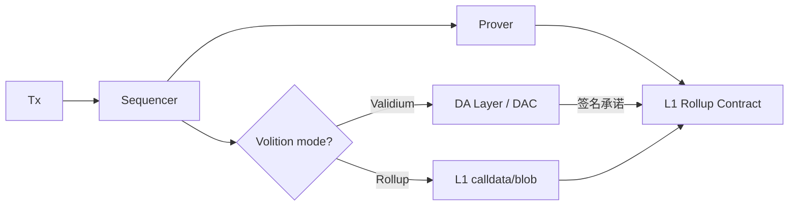

# Validium 与 Volition

> **TL;DR**：**Validium** 是一种把 **有效性证明（validity proof，通常 zk-SNARK/STARK）** 与 **链下数据可用性（off-chain DA）** 结合的 L2 扩容模型；它与 **ZK-Rollup** 的唯一差异就是**数据不上链**——状态正确性仍由 ZK 证明保障，但"你的账户余额到底是多少"的原始数据托管在链下委员会（DAC）、通用 DA 层（Celestia、Avail、EigenDA）或 DAS（Data Availability Sampling）系统。**Volition** 由 StarkWare 2020 年提出，是 Validium 的 "软一级"：允许 **同一条链上每个账户或每笔交易自选**使用 Rollup（on-chain DA）或 Validium（off-chain DA）。Validium 的收益是 **单笔成本比 Rollup 低 10–100×**，适合高频、数据敏感、资产不易丢失的应用（dYdX v3、Immutable X、Sorare、rhino.fi、Apex）；代价是 **"DA 层作恶 = 资金冻结"——虽不能窃取，但可让用户无法构造提款证明**。截至 2026-04，Validium/Volition 已是模块化叙事中的一等公民，所有主流 ZK Stack（StarkEx、Polygon CDK、zkSync ZK Stack、Scroll）都支持 Validium 模式；Starknet v0.13 原生支持 Volition。

---

## 1. 背景与动机

以太坊 L1 的最大扩容瓶颈之一是 **数据成本**：EIP-4844 之前，Rollup 把交易 calldata 写入 L1 占总费用 80%+；即便有 blob，大规模 L2 使用下 blob 也会拥堵。对许多高频应用（交易所订单、游戏、NFT 铸造）来说：

1. **数据不需要被全世界长久存储**：订单历史是可重建/可重放的；
2. **用户愿意用稍低的安全保证换更低的 gas**：例如 10x 成本差值足以改变 PMF；
3. **链下 DA 方案快速成熟**：Celestia (2023-10 主网)、Avail、EigenDA 提供经济安全的 DA。

Validium 就诞生于这些诉求。它最早由 StarkWare 在 StarkEx 中实现（2020 dYdX v3、Sorare 上线）。Volition 的提出把 "Rollup vs Validium" 从"链级二选一"降级为"账户/交易级动态选"，是一次工程细化。

## 2. 核心原理

### 2.1 形式化定义

设状态 `S`、交易批次 `B`、状态转移 `STF`。

- **Rollup 模式**：
  ```
  (S', π) = Prove(STF(S, B));  commit  (S', hash(B))  → L1
  ```
  数据 `B` 本身作为 calldata/blob 上链。
- **Validium 模式**：
  ```
  (S', π) = Prove(STF(S, B));  commit  S'            → L1
  ```
  只把新 state root 上链；`B` 存于 DAC 或 DA 层。**L1 永远不知道 `B`**，只知道"存在一个合法 `B` 满足 `S → S'`"。
- **Volition 模式**：逐交易 `tx_i` 标记 `mode_i ∈ {Rollup, Validium}`，Rollup 交易的数据上链、Validium 交易的数据在 DAC；状态更新统一由 ZK 证明。

### 2.2 数据可用性攻击面

Validium 的核心风险是 **DA 扣留（withhold）攻击**：恶意 DAC / DA 层扣住某时刻的数据 `B`，使得正常用户无法查询自己的当前余额、无法构造提款 Merkle proof，**资金被冻结但不会被偷**。为何无法被偷？因为每次 `S → S'` 仍受 ZK 证明约束，任何非法转账都不会进入 `S'`。

关键子问题：

- **DA 保证**（Data Availability guarantee）：如何证明数据确实被"可用地"保存？
- **回应门（data response）**：DAC 被 challenge 时是否有强制回应机制？
- **逃生舱（escape hatch）**：用户在 DA 停摆时能否仅凭 L1 已知信息强制提款？

### 2.3 DA 方案谱系

**(A) DAC（Data Availability Committee）**：8–16 个信誉实体组成多签，对每个 batch 签 "我已存储该批数据"；StarkEx、Immutable X 早期用该模型。要求 DAC 2/3 以上签名才能 commit state root。风险：DAC 全集体作恶或被胁迫。

**(B) 通用 DA 层**：
- **Celestia**：基于 Tendermint + Namespaced Merkle Tree + DAS（Data Availability Sampling），通过 Reed-Solomon 编码 + 2D Merkle + 抽样，使轻节点以 `O(log N)` 查询成本保证数据可用。
- **Avail**（Polygon 前 Avail 团队）：基于 KZG 多项式承诺的 DAS，与 Celestia 类似但承诺方案不同。
- **EigenDA**：EigenLayer 上的 restaking DA，安全来自 ETH restaking 组；Celestia/Avail 来自原生 token 抵押。
- **Ethereum Danksharding（远期）**：终极 DA，自带 DAS。

**(C) 零知识 DA（PoDA / DAS + SNARK）**：前沿研究方向，通过 SNARK 证明数据被足够多节点抽样到。

### 2.4 子机制拆解

1. **State commitment**：L1 上只存 Merkle/Verkle/SMT 根。
2. **Proof system**：与 Rollup 完全相同（Halo2、Plonky2、STARK）。Validium 的证明不因 DA 模式而变。
3. **DA commitment**：DA 层返回一个 commitment（如 Celestia 的 `DataCommitment`、DAC 的 multisig）；L1 合约在 `commitBatch` 阶段检查该 commitment 签名。
4. **Escape hatch**：L1 合约保留"若超过 N 天 state root 未更新，用户可用已知 Merkle path 强制提款"的函数。要求用户持续同步自己账户的 Merkle proof（"tick data" 备份）。
5. **Volition routing**：L2 交易里加入 `da_mode` 字段；Sequencer 按 mode 分流到 Rollup calldata 或 Validium DAC。
6. **Force transaction**：Volition 模式下的 Rollup 通道可作为 Validium 用户的应急通道。

### 2.5 参数与常量（代表性）

| 参数 | StarkEx Validium | Polygon CDK Validium | Immutable zkEVM |
| --- | --- | --- | --- |
| DAC 成员 | 8–10（公开名单） | 可配置 | 公开 |
| 签名阈值 | 2/3 | 可配置 | 类似 |
| DA 层可选 | DAC / Avail / Celestia | Avail / Celestia / EigenDA / DAC | 自有 committee |
| Escape delay | ~7–30 天（应用可调） | 依 CDK 部署 | 项目层 |

### 2.6 边界条件

- **DAC 全员作恶**：数据永久丢失 → 资金冻结；用户若离线则无 Merkle 路径备份无法逃出。
- **DA 层经济安全失效**：例如 Celestia 被长期分叉，可能暂时不可用，但 L1 不会因此接受无效 state root。
- **Sequencer 与 DAC 合谋**：Sequencer 提交"已签名但数据为空"的 commit，理论上需 DAC 成员诚实签名才能成立；若多数 DAC 恶意，能用"看起来合法的空数据"卡住提款。



## 3. 架构剖析

### 3.1 分层视图

```
┌──────────────────────────────────────────────┐
│ L1 Settlement (Ethereum)                      │
│  ├─ Rollup Contract (state root)              │
│  ├─ DA Commitment Verifier                    │
│  └─ Escape Hatch / Force Withdraw             │
├──────────────────────────────────────────────┤
│ Data Availability                             │
│  ├─ DAC multisig OR                           │
│  ├─ Celestia / Avail / EigenDA OR             │
│  └─ ZK-DA research                            │
├──────────────────────────────────────────────┤
│ Execution (zkEVM / Cairo / Custom)            │
│  ├─ Sequencer                                 │
│  ├─ Prover cluster                            │
│  └─ DA mode router (Volition only)            │
├──────────────────────────────────────────────┤
│ Application                                   │
│  └─ dApp layer (DEX, game, NFT, social)       │
└──────────────────────────────────────────────┘
```

### 3.2 核心模块清单

| 模块 | 职责 | 典型实现 | 可替换 |
| --- | --- | --- | --- |
| L1 合约 | state root + DA commit | StarkEx / zkEVMRollup / CDK Validium | ✓ |
| ZK Prover | validity proof | Stone/Stwo / Halo2 / Plonky2 | ✓ |
| DAC | 托管链下数据 | StarkEx DAC / Immutable Committee | ✓ |
| DA 层 | 通用 DA | Celestia、Avail、EigenDA | ✓ |
| Sequencer | 排序/出块 | 各项目自研 | 难替换 |
| Volition Router | 按 mode 分流 | Starknet v0.13、CDK | ✓ |
| Escape Service | 应急提款客户端 | Starkware `reverse-mm` 等 | 应用层工具 |
| Indexer / Explorer | 链下数据 mirror | StarkEx API、L2BEAT Data | ✓ |

### 3.3 数据流：Validium Tx 端到端

1. 用户签名 Tx → Sequencer。
2. Sequencer 执行、生成 state diff。
3. Sequencer 把 batch 上传到 DA 层（Celestia `PayForBlobs`、或 DAC multisig）。
4. DA 返回 commitment / signatures。
5. Prover 生成 validity proof。
6. Sequencer 调 L1 `updateState(proof, newRoot, daCommitment)`；L1 合约核验 proof + DA 签名。
7. 用户查余额：从 DA 层拉 batch，重放或直接查索引服务。
8. 用户提款：提交 Merkle proof，L1 合约核对 state root。

### 3.4 Volition：逐 tx 分流

Volition 要求 L1 合约同时支持 **两种 commit 路径**：
- `commitBatch(rollupData, validiumCommitment)`；
- 两部分数据通过单一 validity proof 约束一致（proof 约束 `tx_i.mode → 数据存在于相应位置`）。

从开发体验上看，用户/DApp 设置 `daMode`；钱包/SDK 透明路由。

### 3.5 客户端 / 参考实现

- **StarkEx**：首个 Validium 产品，服务 Sorare、Immutable X、rhino.fi、ApeX；闭源 core + 开源 `starkex-contracts`。
- **Polygon CDK Validium**：`0xPolygon/cdk-validium-node` + `0xPolygon/cdk-data-availability`。
- **zkSync ZK Stack Validium Mode**：通过 `zksync-era` 的 DA plugin 支持 EigenDA / Avail。
- **Starknet Volition**：v0.13 原生。
- **Immutable zkEVM**：基于 Polygon CDK Validium 部署。

### 3.6 扩展 / 互操作

- DA 层 RPC：Celestia `celestia-node` gRPC、Avail light client、EigenDA Disperser。
- DAC 签名接口：以 EIP-712 / EdDSA 批量签批。
- 跨 chain：Validium 的资产桥可在 AggLayer、LayerZero、Wormhole 等通用桥上映射。

## 4. 关键代码 / 实现细节

**StarkEx Validium 状态更新接口**（概念性，参考 `starkex-contracts/src/interactions/StarkExValidium.sol`）：

```solidity
function updateState(
    uint256[] calldata publicInput,
    uint256[] calldata applicationData,
    bytes calldata availabilityProof // DAC 多签
) external onlyOperator {
    // 1. 校验 DAC 签名数 ≥ 阈值
    require(dacVerifier.verify(batchHash, availabilityProof), "DAC");
    // 2. 校验 ZK proof（由 STARK Verifier 另行 verify）
    require(proofRegistry.verified(batchProofHash), "ZKP");
    // 3. 写新 state root
    stateRoot = newStateRoot;
    emit LogStateTransition(batchId, stateRoot);
}
```

**Celestia DA blob 提交**（`celestiaorg/celestia-node`）：

```go
// 提交 blob
blob, _ := blob.NewBlobV0(nsBytes, batchData)
resp, err := client.Blob.Submit(ctx, []*blob.Blob{blob}, blob.DefaultGasPrice())
// 得到 commitment，之后交 Validium sequencer 写入 L1
```

## 5. 演进与版本对比

| 时间 | 事件 |
| --- | --- |
| 2019 | StarkWare 白皮书提出 validity proof + off-chain data |
| 2020-04 | dYdX v3 基于 StarkEx（Validium 模式）上线 |
| 2020-10 | Volition 概念首次公开发表 |
| 2021 | Immutable X、Sorare、rhino.fi 选用 Validium |
| 2022 | Polygon Miden / zkSync 讨论 Validium plugin |
| 2023-10 | Celestia 主网上线，成为通用 DA 选项 |
| 2024 | Polygon CDK Validium 正式发布；X Layer、Canto 等接入 |
| 2024 | Starknet v0.13 支持 Volition |
| 2024 | EigenDA 主网上线 |
| 2025 | Ethereum Pectra 后 blob 扩容，Rollup 与 Validium 成本差继续演化 |

## 6. 实战示例

**示例：Immutable X 上查询 Validium 状态**

```bash
# Immutable 官方 REST API
curl "https://api.x.immutable.com/v2/balances/${ADDRESS}"
# 返回该账户在 StarkEx Validium 中的余额；数据来自 DAC + Immutable 节点镜像
```

**示例：CDK Validium 启动（概念命令）**

```bash
git clone https://github.com/0xPolygon/cdk-validium-node
cd cdk-validium-node
docker-compose -f docker-compose.yml up \
  sequencer prover dac db
# dac 服务负责与 DA committee 交互
```

**示例：Celestia blob 提交**

```bash
celestia blob submit 0x0123... "hello validium"
# 返回 commitment，可由 L1 合约引用
```

## 7. 安全与已知攻击

1. **DAC 扣留模拟**：学术上多次讨论；StarkEx 采用 8/n 签名阈值 + 公开成员身份 + 用户持续下载 Merkle proof 减轻风险。
2. **Celestia / Avail 分叉风险**：DA 层若分叉且 Rollup 合约引用旧 commitment，可能认可错误数据。设计上要求 finality 检查。
3. **EigenDA restaking 系统性风险**：Restaking 链路长，见 EigenLayer 研究与 Restaking risk 文献。
4. **应用级事件**：
   - **dYdX v3 部分提款延迟**（2021）：非安全漏洞，而是 StarkEx prover 吞吐限制。
   - **Immutable X DAC 透明度争议**：社区推动 DAC 成员多样化。
5. **Force withdraw 失效风险**：若用户没有保存 Merkle proof 备份、DA 又不可用，资金实质冻结。
6. **Volition 模式攻击面**：Rollup 模式交易需正常 DA，Validium 模式交易需 DAC 签名；两者电路共享，需保证 mode 字段不可伪造。

## 8. 与同类方案对比

| 维度 | Rollup（on-chain DA） | Validium（DAC） | Validium（通用 DA） | Volition | Plasma |
| --- | --- | --- | --- | --- | --- |
| DA 存储 | L1 calldata/blob | DAC | Celestia/Avail/EigenDA | Rollup/Validium 可选 | 链下（依赖运营方） |
| 无效状态防护 | ZK / 欺诈证明 | ZK | ZK | ZK | 欺诈证明 |
| 冻结风险 | 几乎无（L1 保有数据） | DAC 作恶时有 | DA 层失效时有 | 用户自选 | 高（依赖运营方在线） |
| 成本 | 中（受 blob 影响） | 低 | 较低 | 可弹性 | 极低 |
| 典型场景 | 通用 DeFi | Perps/DEX/Game | 游戏/RWA | 混合型 L2 | 支付 |

**trade-off**：Validium 以 DA 信任换成本；Volition 让用户对安全-成本曲线细粒度选点；Rollup 是默认的"最保守"选项。

## 9. 延伸阅读

- **Tier 1（官方 / 学术）**
  - 以太坊 Validium 词条：<https://ethereum.org/en/developers/docs/scaling/validium/>
  - StarkEx 文档：<https://docs.starkware.co/starkex/>
  - Celestia 规范：<https://celestiaorg.github.io/celestia-app/>
  - Avail 文档：<https://docs.availproject.org>
  - EigenDA：<https://docs.eigenlayer.xyz/eigenda/overview>
  - Danksharding / EIP-4844：<https://eips.ethereum.org/EIPS/eip-4844>
  - Polygon CDK Validium：<https://github.com/0xPolygon/cdk-validium-node>
- **Tier 2（研究）**
  - L2BEAT Data Availability 专栏：<https://l2beat.com/data-availability>
  - a16z crypto "Making Sense of Data Availability"：<https://a16zcrypto.com>
  - Vitalik "Data Availability Sampling"：<https://vitalik.eth.limo>
- **Tier 3（博客）**
  - StarkWare 博客 Volition 原文：<https://medium.com/starkware>
  - Celestia 博客：<https://blog.celestia.org>
  - Dankrad Feist DAS：<https://dankradfeist.de>
  - 登链社区 DA 专栏：<https://learnblockchain.cn>

## 10. 术语表

| 术语 | 英文 | 释义 |
| --- | --- | --- |
| 有效性证明 | Validity Proof | 用 ZK 证明状态转移合法 |
| 链下 DA | Off-chain Data Availability | 数据不写 L1 calldata/blob |
| DAC | Data Availability Committee | 托管链下数据的多签委员会 |
| DAS | Data Availability Sampling | 轻节点抽样检验数据是否可用 |
| Volition | Volition | Rollup/Validium 混合模式 |
| Escape Hatch | Escape Hatch | 链下失效时的应急提款通道 |
| Plasma | Plasma | 早期 L2 模型，依赖欺诈证明与退出游戏 |
| Rollup | Rollup | 数据上链的标准扩容模型 |

---

*Last verified: 2026-04-22*
