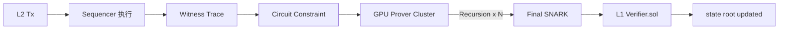
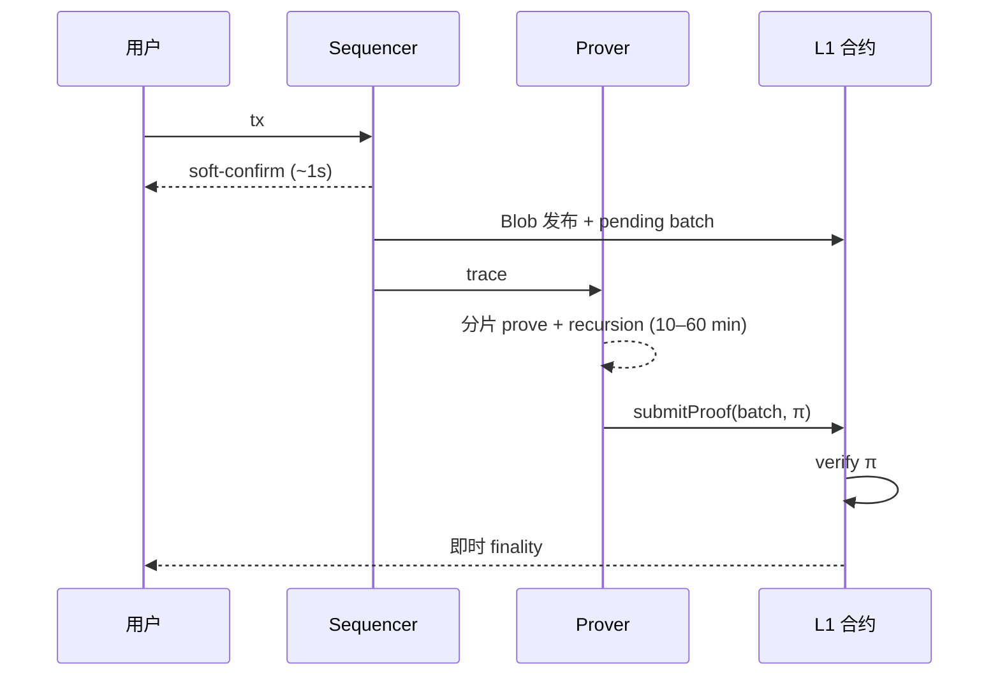

# ZK Rollup 原理（Zero-Knowledge Rollup）

> **TL;DR**：ZK Rollup 用 **Validity Proof**（SNARK / STARK）替代 Optimistic 的欺诈证明，每一批 L2 交易在提交到 L1 时附带一份简洁证明，L1 合约一次验证即可确认整个 Batch 的状态转换正确——**无挑战期、即时最终性、更强密码学安全**。代价是：证明系统本身复杂、证明生成成本高（GPU 集群、分钟到小时级）、EVM 等价性实现困难（Vitalik 定义的 Type 1–4 分级）。2022–2024 年主网陆续上线 zkSync Era（Type 4 → 3）、Polygon zkEVM（Type 3）、Scroll（Type 2.5）、Linea（Type 2）、Taiko（Type 1），2025 年后开始朝 Type 1 全 EVM 等价收敛。硬件侧 GPU Prover 成本已从 2022 年 ~$1/tx 降到 2026 年 ~$0.001/tx 级别。

---

## 1. 背景与动机

ZK Rollup 的想法可以追溯到 2018 年 Barry Whitehat 的 *[roll_up](https://github.com/barryWhiteHat/roll_up)* 项目与 Matter Labs 在 2019 年上线的 zkSync Lite（非 EVM，定制电路支持转账 / 兑换）。核心动机是 **用密码学而非经济博弈保证 L2 安全**：

- Optimistic 依赖 "1-of-N 诚实观察者 + 7 天挑战期"；ZK 依赖 "可信设置 / 离散对数假设"。
- Optimistic 提款 7 天；ZK 提款 = L1 finalize 时间 (~13 分钟) + Prover 生成时间。
- Optimistic 需要 Verifier 持续在线；ZK 由 L1 合约一次性验证。

L2 世界的根本命题由 Vitalik 在 [The different types of ZK-EVMs](https://vitalik.eth.limo/general/2022/08/04/zkevm.html) 给出：**证明 L2 EVM 语义时，对 L1 EVM 的兼容越彻底，电路越复杂、Prover 越慢，但开发者成本越低**。

> Type 1: 完全等价（重放 L1 Prune-able 状态，未来 Ethereum L1 将用 zk-EVM Prove 自己）
> Type 2: 与 L1 EVM 语义等价，但存储布局改变
> Type 3: 有少量 opcode 不支持 / 改造
> Type 4: 高级语言等价（Solidity OK），VM 全新设计（如 EraVM、Cairo）

## 2. 核心原理

### 2.1 形式化定义

令 L2 状态机 $\delta: (S, B) \rightarrow S'$。ZK Rollup 的证明 $\pi$ 满足：

$$\pi = \text{Prove}(C_\delta,\; \text{witness} = (S, B, S'))$$

其中 $C_\delta$ 是把 $\delta$ 写成 arithmetic circuit（R1CS / Plonkish / AIR）。Verifier 算法 `Verify(C_\delta, pubInput, \pi)` 在 L1 合约中以亚秒级（SNARK）或毫秒级（PlonK-KZG）完成。

**Soundness**：除以可忽略概率外，伪造 $\pi$ 需破解 Discrete Log / Knowledge of Exponent（SNARK）或 Collision-Resistant Hash（STARK）。
**Succinctness**：SNARK 证明 192–576 字节，Verify 200k–500k L1 gas；STARK 10–100 KB，Verify 1–5M gas（常折中走 STARK + wrap SNARK）。
**Zero-Knowledge**：尽管叫 "ZK Rollup"，多数 L2 不强制 ZK（Transparent），只为 Succinctness 使用 SNARK；Validium / ZK-EVM 的状态都是公开的。

### 2.2 证明系统族谱

| 系统 | 承诺方案 | 可信设置 | 代表 |
| --- | --- | --- | --- |
| Groth16 | KZG over BN254 | 每电路独立 Trusted Setup | zkSync Lite, Semaphore |
| PlonK / Halo2 | KZG / IPA | 通用 Setup | zkSync Era（Boojum），Scroll |
| STARK | FRI over Goldilocks/M31 | 无 | StarkNet, Polygon zkEVM 底层 |
| Plonky2 / Plonky3 | FRI + Poseidon | 无 | Polygon Zero, Taiko |
| Boojum / Nova / SuperNova / HyperNova | Folding schemes | 无 | Matter Labs，Lurk |

### 2.3 六大子机制拆解

1. **Sequencer**：同 OP，产生软确认；可兼任 Prover 协调者。
2. **Execution Trace Capture**：EVM / EraVM / Cairo VM 执行时产出 witness 文件（所有 stack / memory / storage 访问记录）。
3. **Witness 生成 + Circuit 约束检查**：把 trace 转成电路 column + 多项式约束；Halo2 / PIL / gnark 等 DSL 编译。
4. **Prover 集群**：GPU 分片计算 FFT / MSM；大型 Batch 拆成多 chunk 并行，最后 **递归聚合**（recursion）为一份证明。
5. **Verifier Contract**：Solidity 预编译（ecpairing、BLS12-381）验证 proof；gas 约 200k–1M。
6. **DA + State Commitment**：状态以 SMT 存储；每 Batch 结束将新 root 和压缩 tx 数据发到 L1 Blob。

### 2.4 zk-EVM 电路设计关键

- **算术化**：EVM opcode 分类 → Gadgets；SLOAD/SSTORE 需 MPT/SMT inclusion proof；PUSH / ADD 纯算术。
- **Lookup Tables**：对 256 位算术、Keccak、位操作用查表降约束数（Halo2 / LogUp）。
- **MPT 证明代价**：Ethereum 的 hex-trie 在 SNARK 里极贵；Scroll 用优化后的 zkTrie，zkSync 直接上 SMT。
- **Keccak 电路**：Keccak-256 每 call 约 ~150k 约束（zkSync Era 2024 数据），是 gas cost 主要来源。EIP-7667 拟降 Keccak gas 反而提高 L2 成本。
- **递归与聚合**：单 block 证明 → batch 证明 → final SNARK（Groth16）。Boojum 用 ~70 层 PLONK 递归。

### 2.5 关键参数

| 参数 | zkSync Era | Scroll | StarkNet |
| --- | --- | --- | --- |
| 证明系统 | Boojum（PLONK+FRI→SNARK） | Halo2（PSE 分叉） | Cairo + STARK |
| 终局时间 | 1 小时 | 1–2 小时 | 4–12 小时 |
| L1 Verifier gas | ~500k | ~400k | ~5M |
| 单 block Prover 时间 | 10–20 min on GPU | 20–40 min | 30–60 min |
| EVM 等价 | Type 4（EraVM） | Type 2.5 | 非 EVM（Cairo） |
| DA 模式 | Rollup / Validium 可选 | Rollup | Rollup / Volition |

### 2.6 边界条件与失败模式

- **Prover 宕机**：状态前进停止；资金安全但不可流动。用户 ~24h 内可继续收发 L2 tx（Sequencer 仍记账），但无法提现。
- **电路漏洞（Soundness break）**：最危险。可让 Prover 伪造状态。2023 年 Polygon zkEVM 审计中发现 "Last Byte Truncation"、"Memory Out-of-Bounds" 级别的 bug（未入主网）。zkSync 2024 审计发现 Booleanity missing。
- **Trusted Setup 污染**（KZG 系）：Powers of Tau Ceremony 若全部参与者串通可伪造证明。多数系统 >100k 参与者，风险工程上可忽略。
- **Verifier 合约升级风险**：大多数 zk-EVM 把 Verifier 地址放在可升级代理后，多签可换。L2BEAT 特别追踪此点。
- **DA 暂停 Validium 分支**：zkSync / StarkEx 的 Validium 模式下 DAC 作恶 → 状态可证明但不可重建。

### 2.7 图示





## 3. 架构剖析

### 3.1 分层视图

1. **L2 Execution**：EraVM（zkSync） / 改版 EVM（Scroll、Linea）。
2. **Sequencer + State Keeper**：出块、管理 mempool、更新 SMT。
3. **Witness & Proof Pipeline**：多阶段工作队列（通常基于 PostgreSQL + Kafka）。
4. **Prover Subnet**：Rust + CUDA / OpenCL GPU nodes，可为 Permissioned（matter-labs 自运营）或 Permissionless（Aligned Layer、RiscZero Bonsai）。
5. **L1 Contracts**：`Verifier.sol` + `Executor.sol` + `DiamondProxy`（zkSync）、`Rollup.sol`（Scroll）、`ZkEvm.sol`（Polygon）。

### 3.2 核心模块清单（zkSync Era）

| 模块 | 路径 | 职责 |
| --- | --- | --- |
| EraVM | `zksync-era/core/lib/vm` | Rust 实现的 L2 VM，非 EVM opcode |
| State Keeper | `core/lib/state-keeper` | 出块 / 封批 |
| Witness Generator | `prover/witness_generator` | 生成 circuit witness |
| Prover（Boojum） | `prover/boojum` | GPU prover |
| Proof Compressor | `prover/proof_compressor` | STARK→SNARK wrap |
| Commitment Generator | `core/lib/commitment_generator` | L1 发布批处理 |
| L1 Contracts | `l1-contracts` | `DiamondProxy`、`Executor`、`Verifier` |
| Ethereum Sender | `core/lib/eth_sender` | Batcher + Proposer |
| zk_toolbox | `zk_toolbox` | 本地 / 主网部署工具链 |

### 3.3 端到端数据流

```text
T+0      tx 进入 Sequencer mempool
T+1s     soft-confirm，写入 Era block
T+30s–2m Batch 封批，数据经压缩 → Blob
T+2–30m  Witness 生成（多线程 CPU）
T+10–60m Prover GPU cluster 分片证明 + 递归聚合
T+60–90m Proof wrapped as Groth16，与 state root 一起发到 L1
T+90m    L1 `Verifier.verify(proof, publicInput)` → state finalized
T+~24h   用户可在 L1 提现
```

### 3.4 客户端多样性

目前 zk 系普遍 **单客户端 + 单 Prover 实现**：
- zkSync Era：matter-labs（Rust + Go）
- Scroll：scroll-tech（Go / Rust）
- Linea：ConsenSys（Go / Java）
- Polygon zkEVM：Polygon Labs（Go）
- StarkNet：StarkWare（Rust + Cairo）
- Taiko：Taiko Labs（Rust, PSE Halo2）

代 Prover 市场（Aligned Layer、RiscZero Bonsai、Succinct SP1）正在把"单 Prover"拆成市场，2025 年起逐步接入主流 L2。

### 3.5 扩展 / 互操作接口

- **Hyperchains / ZK Stack**：zkSync 的 L3 工厂，允许任何项目部署自己的 ZK Chain，共享 Prover 市场。
- **Shared Proving Market**：Aligned Layer、RiscZero、Succinct 接受多个 L2 的证明任务，降低单链 Prover 成本。
- **AggLayer**：Polygon 主推的跨 Rollup 统一消息层，借 zk Pessimistic Proof 避免单桥信任。
- **ERC-7683 Cross-Chain Intents**：Across 协议主推，ZK 桥可作为后端。

## 4. 关键代码 / 实现细节

**zkSync Era Verifier 合约** — [`l1-contracts/contracts/zksync/facets/Executor.sol`](https://github.com/matter-labs/era-contracts)（v24, 2024）：

```solidity
// 简化：batch 提交必须附带 proof，verifier 返回 bool
function executeBatches(StoredBatchInfo[] calldata _batches) external onlyValidator {
    // 1. 从 _batches 取出 公开输入（prevStateRoot, newStateRoot, batchHash, l2LogsTreeRoot）
    bytes32[] memory publicInputs = _computePublicInputs(_batches);
    // 2. 走 Plonk Verifier
    require(
        IVerifier(verifier).verify(publicInputs, proof),
        "Invalid proof"
    );
    // 3. state root 上链
    s.totalBatchesExecuted += _batches.length;
    s.storedBatchHashes[newIdx] = _batches[i].commitment;
}
```

**Scroll 的 zkTrie**（[`scroll-tech/zktrie`](https://github.com/scroll-tech/zktrie)）改良自 Ethereum MPT：用 Poseidon 哈希+二叉 Merkle 树，把 MPT 证明步数压缩 2–3 倍，大幅降低电路约束。

## 5. 演进与版本对比

| 版本 | 时间 | 关键变化 |
| --- | --- | --- |
| zkSync Lite | 2020-06 | 非 EVM，定制电路，仅支持 Transfer / Swap |
| Loopring 3.6 | 2020 | DEX 专用 ZK，撮合 off-chain |
| StarkEx (dYdX, IMX) | 2021 | STARK 驱动，permissioned Validium |
| Polygon Hermez | 2021 | zkEVM 先驱（非 Type 1） |
| **zkSync Era 主网** | **2023-03** | Type 4 EraVM，基于 PLONK+KZG |
| **Polygon zkEVM 主网** | **2023-03** | Type 3，走向 Type 2 |
| **Scroll 主网** | **2023-10** | Type 2.5，原生 Keccak 电路 |
| **Linea 主网** | **2023-07** | Type 2 目标，gnark + Vortex |
| **Boojum 升级** | **2023-08** | zkSync 迁到 STARK+FRI，大幅降硬件门槛 |
| **Taiko 主网** | **2024-05** | 第一个 Type 1 zk-EVM |
| EIP-4844 集成 | 2024-03 | 所有 ZK Rollup 迁到 blob |
| Shared Prover | 2025 | Aligned / Succinct 接入多链 |
| RISC-V / SP1 zkVM | 2025 | 下一代通用 zkVM，编译 Rust → 证明 |
| zkEVM Type 1 收敛 | 2026+ | zkSync 3, Polygon 2, 各家逐步 Type 1 |

## 6. 实战示例

**zkSync Era 快速发起一笔转账**（走 zksync-ethers）：

```ts
import { Provider, Wallet, utils } from "zksync-ethers"
import { ethers } from "ethers"
const provider = new Provider("https://mainnet.era.zksync.io")
const l1 = new ethers.JsonRpcProvider(process.env.L1_RPC)
const wallet = new Wallet(process.env.PK, provider, l1)
// 发送一笔 L2 ETH 转账
const tx = await wallet.transfer({
  to: "0xAbc...",
  token: utils.ETH_ADDRESS,
  amount: ethers.parseEther("0.01"),
})
const receipt = await tx.wait()
console.log("L2 finalized:", receipt.hash)
```

**查询 Prover 状态**（zkSync）：

```bash
curl -s "https://mainnet.era.zksync.io" \
  -X POST -H "Content-Type: application/json" \
  -d '{"jsonrpc":"2.0","method":"zks_getL1BatchDetails","params":[12345],"id":1}'
```

## 7. 安全与已知攻击

1. **2023-03 Polygon zkEVM audit bugs**（Hexens + Spearbit）：存储 slot 碰撞、除零未 constrain，多个 Soundness 级别漏洞，主网前修复。
2. **2024-01 zkSync Era 时序 bug**：区块号边界条件错误导致短暂回滚，资金无损。
3. **2024-06 Polygon zkEVM "Infinite Proof Mint" 理论漏洞**：由 0xkarmacoma 披露 `transfer(from, from, amount)` 未做 from==to 约束，快速修复。
4. **Starkware Cairo 0 语义变更**：Cairo 0→1 迁移要求所有合约重写；曾短暂打破 dYdX 的 Migration 流程。
5. **Aztec（非 Rollup，但 ZK 系）2022 关闭 zk.money**：合规压力；展示 ZK Privacy 链的法规风险。
6. **Prover 私钥 / 系统密钥丢失**：若 multi-party trusted setup 私密份额被收集，攻击者可造假证明。Powers of Tau 参与者越多越安全。
7. **Circuit CVE**：RISC Zero 2024 披露 circuit 漏洞，紧急升级。全生态 zkVM 审计工具仍薄弱。

## 8. 与同类方案对比

| 维度 | ZK Rollup | Optimistic Rollup | Validium | StarkEx (App-Chain) |
| --- | --- | --- | --- | --- |
| 安全 | 密码学 | 经济博弈 + 诚实观察 | 密码学 + DAC 信任 | 同 ZK |
| 提款延迟 | 分钟–小时 | 7 天 | 分钟–小时 | 分钟–小时 |
| EVM 等价 | 逐步 | 完整 | 同 ZK | 无（App 定制） |
| 成本结构 | 固定 Prover 成本 | 动态 Verifier 成本 | 极低 | 最低 |
| 适合应用 | 支付 / DeFi / 托管 | 通用 DeFi / MEV | 游戏 / NFT | 交易所 / 游戏 |
| 代表项目 | zkSync, Scroll, Linea, StarkNet | Arbitrum, OP, Base | IMX, Sorare | dYdX v3, IMX |

## 9. 延伸阅读

- **一手源**
  - Vitalik, *Different Types of ZK-EVMs*：<https://vitalik.eth.limo/general/2022/08/04/zkevm.html>
  - zkSync Docs：<https://docs.zksync.io>
  - Scroll Docs：<https://docs.scroll.io>
  - StarkNet Book：<https://book.starknet.io>
  - Halo2 Book：<https://zcash.github.io/halo2/>
- **论文**
  - Groth16：<https://eprint.iacr.org/2016/260>
  - PLONK：<https://eprint.iacr.org/2019/953>
  - FRI / STARK：<https://eprint.iacr.org/2018/046>
  - Boojum Whitepaper（Matter Labs blog）
- **Tier 2/3**
  - L2BEAT zk Section：<https://l2beat.com>
  - Paradigm, *Compute-Efficient zk Proving*：<https://paradigm.xyz>
  - 0xPARC blog：<https://0xparc.org>
  - 登链社区 zk 专题：<https://learnblockchain.cn/tags/ZK>
- **视频**
  - zkSummit 全录
  - zkWarsaw / ZK Summit London

## 10. 术语表

| 术语 | 英文 | 释义 |
| --- | --- | --- |
| 有效性证明 | Validity Proof | 证明状态转换正确的简洁证明 |
| 零知识证明 | ZK Proof | Prover 不泄露 witness 即可说服 Verifier |
| 可信设置 | Trusted Setup | Groth16 / KZG 所需的一次性初始化 |
| 算术化 | Arithmetization | 把计算写成多项式约束 |
| 查表 | Lookup / LogUp | Halo2 降约束数的技巧 |
| 递归 | Recursion | 证明一个 Verifier 的执行 |
| 证明聚合 | Aggregation | 多证明合并为一 |
| 类型 1 等价 | Type 1 zk-EVM | 与 L1 EVM 完全语义等价 |
| 稀疏默克尔树 | Sparse Merkle Tree, SMT | ZK 友好的状态树结构 |
| zkVM | zkVM | 可运行通用程序并输出证明的虚拟机 |

---

*Last verified: 2026-04-22*
