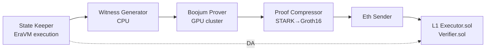
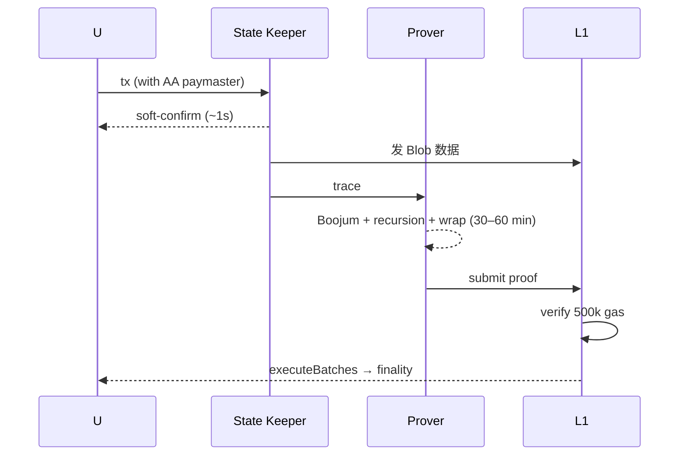

# zkSync Era（Boojum / EraVM / ZK Stack / Validium）

> **TL;DR**：zkSync Era 是 Matter Labs 于 2023-03-24 主网上线的 **Type 4 zk-EVM** Rollup，用 Rust 实现的 **EraVM** 替代 EVM，围绕 ZK 友好特性（native account abstraction、native paymaster、自定义 precompile）优化。证明系统 **Boojum**（2023-08 上线）基于 Plonky2 风格的 STARK + FRI + 最终 Groth16 wrap，把硬件门槛降到 **单张 RTX 4090** 可加入 Prover 市场。2024 年宣布 **ZK Stack**——全开源、可 fork 的多链框架，支持开发者部署独立 **Hyperchain**（Rollup 或 Validium 模式）。2024-12 上线 **Elastic Chain / Interop**，所有 ZK Stack 链共享流动性与消息。2024-06 发行 **ZK 代币**（争议的空投），治理入驻 ZK Nation。L2BEAT 评级 Stage 0（2026-04），主要短板是 Council 可升级 Verifier 合约。

---

## 1. 背景与动机

Matter Labs 创始人 Alex Gluchowski 在 2019 年推出 zkSync 1.0（Lite），用定制电路支持转账 / 兑换，但非 EVM 兼容。随后团队投入 2 年研发 zkSync 2.0（后改名 Era），目标是 **实用化 zk-EVM**。

技术取向关键决策：

1. **不做 Type 1 EVM 等价**：Matter Labs 判断 Type 1 电路成本极高、性能差，选择 Type 4——合约源码（Solidity / Vyper）兼容，编译器输出 EraVM 字节码。
2. **Native Account Abstraction**：每个账户都是合约，无 EOA；ERC-4337 的一等公民支持、Paymaster 无需额外合约。
3. **Boojum：STARK-first 架构**：2023-08 从 Groth16 + SNARK 切换到 STARK + FRI 递归，大幅降硬件要求（从 A100 到消费级 4090）。
4. **ZK Stack 模块化**：用户可部署自己的 Rollup 或 Validium，共享 Prover 与安全池。

## 2. 核心原理

### 2.1 EraVM：非 EVM 但兼容 Solidity

EraVM 是基于寄存器的 VM（而非 EVM 的栈式），32-bit 字长主体 + 256-bit 扩展寄存器，设计为电路友好：

- **寄存器 + Memory**：16 个通用寄存器减少栈压栈；内存是按 heap 组织。
- **精细化 Opcode**：`precompile` 被作为一等调用；`SSTORE` 差分计费。
- **无 CALL / STATICCALL 区分**：统一成 `far_call(address, input, ...flags)`。
- **Hash**：首选 `Blake2s`（电路友好），Keccak-256 保留但贵。
- **Solidity 源码 → zkSolc / zkVyper 编译**：直接输出 EraVM 字节码，外部 ABI 与 EVM 一致。

### 2.2 Boojum 证明栈

```text
Witness (EraVM trace)
    ↓ Boojum STARK (FRI over Goldilocks)
单 block proof
    ↓ recursion ×多层（leaf → node → scheduler）
batch proof (aggregate N blocks)
    ↓ SNARK wrap (Groth16 over BN254)
L1 verifiable proof (~500k gas)
```

- **Goldilocks prime**：$p = 2^{64} - 2^{32} + 1$，64-bit 友好。
- **Poseidon / Blake2s 海绵哈希**：代替 Keccak 作为电路内 hash。
- **Recursion**：~70 层，减少 L1 Verifier cost。
- **硬件目标**：RTX 3090 / 4090 + 64 GB RAM 可运行 Prover；未来 Prover Market（Fermah、RiscZero Bonsai）接入多方。

### 2.3 Native Account Abstraction

- **所有账户 = 合约**：包括"EOA"在 Era 中其实是 Matter Labs 提供的 `DefaultAccount.sol`。
- **`validateTransaction` + `executeTransaction`**：账户合约自定义签名、支付 gas 的逻辑。
- **Paymaster**：独立合约，可全额或部分代付 gas，比 ERC-4337 的 Bundler-Paymaster 链路更原生。
- **示例**：多签、社交恢复、Session Key、ZK Passport、WebAuthn 都可直接实现。

### 2.4 六大子机制拆解

1. **State Keeper（Sequencer）**：Rust 实现，管理 L2 mempool、EraVM 执行、出块。
2. **Metadata / Commitment Generator**：计算批处理 commitment、L2 logs Merkle 根。
3. **Witness Generator**：把 EraVM trace 转成 Boojum circuit witness（CPU 密集）。
4. **Prover（Boojum）**：GPU 集群证明 + 递归聚合。
5. **Proof Compressor**：STARK → Groth16 wrap。
6. **Eth Sender**：上传 Batch 数据（Blob / Validium）+ 上传最终 Groth16 proof。

### 2.5 Rollup / Validium / Volition（Hyperchain 模式）

ZK Stack 的链可选择：
- **Rollup**：L1 Blob 发数据，最安全。
- **Validium**：数据交给 DAC 或 Celestia / Avail，最便宜。
- **Volition**（2025 Q2 上线）：每笔 tx 在 tx 级别选 DA 模式（DeFi 高价值走 Rollup，小额游戏走 Validium）。

### 2.6 关键参数

| 参数 | zkSync Era Mainnet |
| --- | --- |
| 主网 | 2023-03-24 |
| ChainId | 324 |
| 状态树 | Sparse Merkle Tree（4-ary） |
| Block time | 1 秒 |
| Batch close | 每 ~2 分钟或 batch 满 |
| Proof 生成时延 | 10–60 min（batch）+ 10 min compression |
| L1 finality | ~1–4 小时（取决于 Prover 队列） |
| L1 Verifier gas | ~500k（Groth16） |
| Gas Token | ETH |
| 原生代币 | ZK（治理，2024-06 TGE） |
| L2BEAT Stage | Stage 0（Verifier 可升级） |

### 2.7 边界条件与失败模式

- **Prover 宕机**：State Keeper 仍出块，但 L1 不前进；用户无法提现，但 L2 内部功能正常。2024-02 曾出现 ~4 小时 Prover 停顿。
- **Circuit bug**（Soundness 破坏）：最严重。ZK Stack 有多轮审计（ChainSecurity、Halborn、OpenZeppelin、Spearbit），2024 年曾修复 Booleanity 漏洞。
- **DAC offline（Validium 模式）**：证明仍成立但无法重建状态，资金锁。
- **Bridge Verifier 升级风险**：Security Council 可替换 Verifier 合约——被 L2BEAT 单独标示。
- **空投政策**：2024-06 ZK 空投排除部分低质量地址，社区争议；技术本身不受影响。

### 2.8 图示





## 3. 架构剖析

### 3.1 分层视图

1. **L2 Execution（EraVM）**：Rust 实现的 VM，寄存器模型。
2. **Sequencer / State Keeper**：接单、出块、封批。
3. **Prover Pipeline**：Witness → Boojum → Compression。
4. **Eth Sender**：L1 数据与 proof 双通道。
5. **L1 Contracts**：`DiamondProxy`（EIP-2535）组合 `Executor` / `Getters` / `Admin` / `Mailbox`，加 `Verifier.sol`。

### 3.2 核心模块清单

| 模块 | 路径 | 职责 |
| --- | --- | --- |
| core/lib/vm | `core/lib/multivm` | EraVM 实现（multiple versions） |
| core/lib/state_keeper | `core/node/state_keeper` | Sequencer 主循环 |
| core/lib/commitment_generator | `core/node/commitment_generator` | L1 batch commitment |
| prover/witness_generator | `prover/witness_generator` | CPU 预处理 |
| prover/boojum | `prover/crates/bin/prover_cli` | GPU 证明 |
| prover/proof_compressor | `prover/proof_compressor` | wrap 成 SNARK |
| core/lib/eth_sender | `core/node/eth_sender` | L1 Tx 发送 |
| l1-contracts | `l1-contracts/` | Diamond + Verifier |
| zk_toolbox | `zk_toolbox/` | 部署 Hyperchain 工具 |
| system-contracts | `system-contracts/` | L2 预编译与 bootloader |

### 3.3 数据流

```text
T+0       tx → https://mainnet.era.zksync.io (State Keeper)
T+~1s     soft-confirm，EraVM 执行，记录 trace
T+30s–2m  Batch 封批；Eth Sender 发 Blob
T+2–30m   Witness Generator 生成多阶段 witness
T+10–60m  Boojum GPU Prover 分片证明 + recursion
T+60–90m  Proof Compressor wrap Groth16
T+~90m    Eth Sender 提交 proof；L1 Executor.verify 通过 → finality
T+~24h    用户 L1 提现（走 L1 Mailbox + withdraw）
```

### 3.4 客户端多样性

- 主实现 `matter-labs/zksync-era`（Rust + Go）。
- 无第二实现；Matter Labs 承诺 2026 后开源 Reth-based full node。
- Prover 市场 2025 起允许第三方接入（ZK Credo 计划）。

### 3.5 扩展 / 互操作接口

- **Native AA**：用户合约自定义 `validate` / `execute`。
- **zks_* JSON-RPC**：`zks_getL1BatchDetails`、`zks_getL2ToL1MsgProof` 等。
- **Shared Bridge**：Era、ZK Stack 链共享 `L1SharedBridge.sol`，资产无需跨 bridge 重复。
- **Elastic Chain Interop**（2024-12）：所有 ZK Stack 链在 L1 层通过统一 Gateway Ha，ZK Proof 聚合到一条链。
- **Hyperchain 工具链 `zk_toolbox`**：一键部署 Rollup / Validium。
- **Paymaster 合约市场**：付 USDC 等 ERC-20 作为 gas。

## 4. 关键代码 / 实现细节

**L1 Executor 验证 proof** — [`l1-contracts/contracts/state-transition/chain-deps/facets/Executor.sol`](https://github.com/matter-labs/era-contracts)（简化）：

```solidity
function _proveBatches(StoredBatchInfo calldata _prevBatch, StoredBatchInfo[] calldata _commitedBatches,
                      ProofInput calldata _proof) internal {
    // 1. 计算 public input 作为 verifier 输入
    uint256[] memory proofPublicInput = new uint256[](_commitedBatches.length);
    for (uint256 i; i < _commitedBatches.length; ++i) {
        proofPublicInput[i] = _getBatchProofPublicInput(
            _prevBatch.batchHash, _commitedBatches[i].batchHash,
            s.storedBatchHashes[_commitedBatches[i].batchNumber]
        );
    }
    // 2. Verifier 合约 (Groth16)
    require(s.verifier.verify(proofPublicInput, _proof.serializedProof, _proof.recursiveAggregationInput), "PROOF");
    s.totalBatchesVerified += _commitedBatches.length;
}
```

**EraVM Default Account**（bootloader 内置） — [`system-contracts/contracts/DefaultAccount.sol`](https://github.com/matter-labs/era-contracts)：

```solidity
function validateTransaction(bytes32, bytes32 _suggestedSignedHash, Transaction calldata _tx)
    external payable override onlyBootloader returns (bytes4) {
    // 校验签名（ECDSA）
    bytes32 txHash = _suggestedSignedHash == bytes32(0) ? _tx.encodeHash() : _suggestedSignedHash;
    bool valid = _isValidSignature(txHash, _tx.signature);
    if (valid) return ACCOUNT_VALIDATION_SUCCESS_MAGIC;
    return bytes4(0);
}
```

## 5. 演进与版本对比

| 版本 | 时间 | 关键 |
| --- | --- | --- |
| zkSync 1.0 (Lite) | 2020-06 | 非 EVM；定制电路 |
| Era Alpha | 2023-02 | 主网 baby alpha |
| **Era GA** | **2023-03-24** | Fair Onboarding Alpha → 公开主网 |
| **Boojum 升级** | **2023-08** | STARK+FRI 主力 Prover；成本 × 10↓ |
| Hyperchains 概念 | 2023-09 | ZK Stack 初步框架 |
| ZK Credo | 2024-01 | 开源承诺；治理 / 空投预热 |
| EIP-4844 Blob | 2024-03 | 发 blob，成本再跌 |
| **ZK 代币 TGE** | **2024-06-17** | 空投 3.6B ZK；ZK Nation 治理 |
| **Elastic Chain / Interop** | **2024-12** | 所有 ZK Stack 链聚合 |
| Validium 模式 | 2024-12 | ZK Stack 可选 Celestia / Avail DA |
| Volition（2025 Q2） | 2025 | tx 级 DA 选择 |
| EraVM v23 优化 | 2025 | Prover 成本再降；Keccak 优化 |
| Fermah 市场接入 | 2025 | 第三方 Prover |
| Stage 1 路线 | 2026+ | 降 Council 权限、公开 Verifier 升级窗口 |

## 6. 实战示例

**添加 zkSync Era 网络**：

```json
{
  "chainId": "0x144",
  "rpcUrls": ["https://mainnet.era.zksync.io"],
  "nativeCurrency": { "name": "ETH", "symbol": "ETH", "decimals": 18 },
  "blockExplorerUrls": ["https://explorer.zksync.io"]
}
```

**使用 Paymaster（付 USDC 当 gas）**：

```ts
import { Provider, Wallet, utils, types } from "zksync-ethers"
const provider = new Provider("https://mainnet.era.zksync.io")
const wallet = new Wallet(process.env.PK, provider)

const paymasterParams = utils.getPaymasterParams(PAYMASTER_ADDR, {
    type: "ApprovalBased",
    token: USDC_ADDR,
    minimalAllowance: 1_000_000n,  // 1 USDC
    innerInput: new Uint8Array(),
})
const tx = await wallet.sendTransaction({
    to: TARGET,
    data: calldata,
    customData: { gasPerPubdata: utils.DEFAULT_GAS_PER_PUBDATA_LIMIT, paymasterParams },
})
```

**部署一条自己的 Hyperchain（Validium 模式）**：

```bash
npm i -g zksync-cli
zksync-cli dev chain create --name my-validium --da-mode validium
```

## 7. 安全与已知攻击

1. **2023-11 Token 合约漏洞（并非协议）**：Merlin Chain（基于 zkSync Stack fork）上一 DeFi 项目出事，zkSync Era 主网无关。
2. **2024-02 Prover 队列堵塞 4 小时**：Proof 生成系统负载峰值，L1 finality 延迟；无资金损失。
3. **2024-04 批处理延迟窗口短暂回退**：Boojum 优化版上线的轻微回归，修复后恢复。
4. **Verifier 可升级风险**：Matter Labs Security Council 可替换 `Verifier.sol`——是 Stage 0 评级的主要原因。
5. **空投争议 → Sybil & Bot 问题**：并非技术漏洞，但反映 L2 激励机制的设计难点。
6. **ZK Circuit Audit Findings**：多次公开审计发现 Booleanity missing、Overflow 等；主网前 / 主网升级时修复。
7. **zkSolc 编译器 bug**：2023–2024 有数个编译 miscompilation 修复（例如 `MCOPY` 处理差异），部分合约需重部署。

## 8. 与同类方案对比

| 维度 | zkSync Era | Scroll | Linea | Arbitrum One | Optimism |
| --- | --- | --- | --- | --- | --- |
| 证明类型 | Boojum STARK+SNARK wrap | Halo2 SNARK | gnark PLONK | Fraud Proof | Fraud Proof |
| EVM 等价 | Type 4（EraVM） | Type 2.5 | Type 2 目标 | 完整 | 完整 |
| AA 原生 | **是** | 否（4337） | 否（4337） | 否（4337） | 否（4337） |
| Validium 支持 | **是**（ZK Stack） | 否 | Linea Volition 计划 | Nova AnyTrust | Alt-DA 可选 |
| 提款延迟 | 1–4h | 1–2h | 1–2h | 7 天 | 7 天 |
| L2BEAT Stage | 0 | 0 | 0 | 1 | 1 |
| 代币 | ZK | 无（Scroll Saga 规划） | 无 | ARB | OP |
| 开发者 UX | zksolc 需改编译；debug 工具在成熟 | 接近 L1 | 接近 L1 | 接近 L1 | 接近 L1 |

## 9. 延伸阅读

- **一手源**
  - zkSync Docs：<https://docs.zksync.io>
  - Matter Labs GitHub：<https://github.com/matter-labs>
  - era-boojum：<https://github.com/matter-labs/era-boojum>
  - ZK Credo：<https://github.com/zksync/credo>
  - Elastic Chain 白皮书：<https://matter-labs.mirror.xyz>
- **Tier 2/3**
  - Vitalik *ZK-EVM types*：<https://vitalik.eth.limo/general/2022/08/04/zkevm.html>
  - L2BEAT zkSync：<https://l2beat.com/scaling/projects/zksync-era>
  - Paradigm Research, *zkEVM State of the Art*
  - 0xPARC blog：<https://0xparc.org>
  - 登链社区 zkSync 专栏：<https://learnblockchain.cn/tags/zkSync>
- **视频 / Talk**
  - zkSummit：<https://www.zksummit.com>
  - Matter Labs 官方 YouTube

## 10. 术语表

| 术语 | 英文 | 释义 |
| --- | --- | --- |
| EraVM | EraVM | zkSync 的寄存器型 L2 VM |
| Boojum | Boojum | Matter Labs 自研 STARK 证明系统 |
| zkSolc | zkSolc | Solidity → EraVM 编译器 |
| Hyperchain | Hyperchain | 基于 ZK Stack 的独立链 |
| ZK Stack | ZK Stack | 开源模块化 ZK L2 框架 |
| Elastic Chain | Elastic Chain | ZK Stack 链的聚合互操作层 |
| Volition | Volition | tx 级 DA 选择模式 |
| Native AA | Native AA | 每账户为合约，无 EOA |
| Paymaster | Paymaster | 代付 gas 的合约 |
| Shared Bridge | Shared Bridge | ZK Stack 共享 L1 桥合约 |

---

*Last verified: 2026-04-22*
