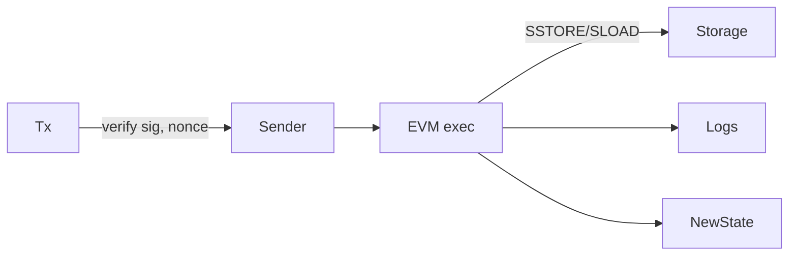

# Account 账本模型（Ethereum）

> **TL;DR**：Account 模型将链状态表达为账户集合 $\mathsf{State}: \mathrm{Addr} \to (\mathrm{nonce}, \mathrm{balance}, \mathrm{storageRoot}, \mathrm{codeHash})$。每笔 tx 直接修改账户字段，通过 **nonce** 严格序列化替代 UTXO 的消费模型以防重放和双花。Ethereum 由 EOA + 合约账户两类组成，整个状态存于 Merkle-Patricia Trie。Account 模型对智能合约自然，但并发弱、tx 依赖强、ZK-unfriendly；EIP-7702 与 AA 进一步模糊 EOA/合约边界。

## 1. 背景与动机

2013 年 Vitalik 提出 Ethereum 时放弃 Bitcoin UTXO 的原因：
- **合约天然有状态**：持续的账本 (balance + storage) 更符合程序员心智。
- **复用地址**：合约地址恒定，其他合约与 EOA 通过地址直接交互。
- **省空间**：不用在每笔 tx 列出一串 UTXO 输入。
- **DApp 可组合**：同步调用合约需共享状态。

代价：
- **tx 必须串行化**：修改同一账户的 tx 不能并行。
- **状态爆炸**：所有历史留存直至剪枝。
- **隐私弱**：余额完全公开。
- **重放风险**：必须引入 nonce、chainId (EIP-155) 等。

## 2. 核心原理

### 2.1 形式化定义（Yellow Paper）

世界状态 $\sigma: \mathrm{Addr} \to \mathbb{A}$，每个账户 $\mathbb{A} = (n, b, s, c)$：
- $n$: nonce（外部账户 = tx 计数，合约 = CREATE 计数）。
- $b$: balance (wei)。
- $s$: storageRoot (Merkle-Patricia root of $\mathrm{Storage}: 32B \to 32B$)。
- $c$: codeHash (keccak256 of bytecode)。

**状态转移** $\sigma' = \Upsilon(\sigma, T)$：
1. 验证 $T.\mathrm{sig}, T.\mathrm{chainId}, T.\mathrm{nonce} = \sigma[\mathrm{sender}].n$。
2. 扣 upfront gas：$\sigma[\mathrm{sender}].b -= T.\mathrm{gasLimit} \times T.\mathrm{gasPrice}$。
3. $n \mathrel{+}= 1$。
4. EVM 执行：消费 gas、修改 storage、emit logs。
5. 未用 gas 退回，EIP-1559 base fee burn。
6. 矿工/提议者收 priority fee。

**不变式**：$\sum b$ 除 burn 外保持；合约代码不可变（自毁除外）。

### 2.2 Merkle-Patricia Trie (MPT)

状态以 16-ary Merkle Patricia Trie 组织：
- 叶节点：$(rlp(account), keccak(account))$。
- 分支节点：16 子指针 + value。
- 扩展节点：压缩路径。

树根 $\mathsf{stateRoot}$ 写入 block header，支持 light client SPV。

### 2.3 账户类型

- **EOA (Externally Owned Account)**：`codeHash = keccak("")`，由 secp256k1 私钥控制。
- **合约账户**：`codeHash != empty`，只能由 tx 触发。
- **EIP-7702 delegation (Pectra, 2025)**：EOA 可临时拥有代码，使 AA 无需合约钱包。

### 2.4 子机制拆解

- **Nonce**：tx 唯一序，杜绝重放。Gas sponsor (EIP-4337) 用自己的 nonce。
- **Gas**：每 opcode 消耗固定/动态 gas；防 DoS。
- **EVM**：256-bit word 栈 VM，1024 栈深。
- **Logs / Receipts**：索引事件，off-chain 查询。
- **State Trie vs Storage Trie**：双层嵌套。
- **Replay Protection (EIP-155)**：签名加入 chainId。
- **EIP-1559**：base fee 动态调整 + burn。
- **EIP-4844 Blob**：独立 blob space，KZG 承诺，不入 state。

### 2.5 关键参数

| 参数 | 值 | 来源 |
| --- | --- | --- |
| Block gas limit | ~36M (2025) | miner vote |
| Base fee elasticity | 2x target | EIP-1559 |
| Slot duration | 12 s | Beacon |
| Epoch | 32 slots | LMD-GHOST |
| Max tx blob | 9 (Pectra raise) | EIP-7691 |
| MAX_INITCODE_SIZE | 49152 B | EIP-3860 |

### 2.6 失败模式

- **Reentrancy**：DAO 2016, ~60M USD。
- **State explosion**：statelessness 仍未交付。
- **Nonce gap**：mempool 堵车（pending tx 等待低 nonce）。
- **Account abstraction 边界**：7702 delegate 可被 front-run 以 revoke。
- **Trie 破坏**：old Geth bug 2021 chain fork。



```
World State
/root/
  |- 0xAlice: (nonce=5, bal=2.3e18, storage=∅, code=0)
  |- 0xBob:   (nonce=0, bal=1e18, ...)
  |- 0xUSDT:  (nonce=1, bal=0, storage={...}, code=0x6080...)
```

## 3. 架构剖析

### 3.1 分层视图

1. **Execution Layer (EL)**：Geth / Nethermind / Erigon / Besu / Reth。
   - Networking: devp2p
   - Mempool, EVM, StateDB, RPC.
2. **Consensus Layer (CL)**：Prysm / Lighthouse / Teku / Nimbus / Lodestar。
   - LMD-GHOST + Casper FFG.
3. **Engine API**：EL ↔ CL JSON-RPC。
4. **Wallet / DApp**：MetaMask, viem, ethers.
5. **L2 Rollup**：OP / Arbitrum / zkSync / Scroll / Linea / Starknet.

### 3.2 核心模块清单

| 模块 | 职责 | 依赖 | 路径 |
| --- | --- | --- | --- |
| StateDB | 账户状态管理 | LevelDB/Pebble | `go-ethereum/core/state/statedb.go` |
| EVM | 字节码解释 | gas table | `go-ethereum/core/vm/interpreter.go` |
| TxPool | 排序 mempool | sig verify | `go-ethereum/core/txpool/` |
| Consensus | Beacon finalize | CL | `go-ethereum/consensus/beacon/` |
| BlockChain | 链顶维护 | StateDB | `go-ethereum/core/blockchain.go` |
| Engine API | CL 对接 | RPC | `go-ethereum/eth/catalyst/` |

### 3.3 数据流：一笔 Ethereum tx 的生命周期

1. 钱包 `eth_sendRawTransaction` → RPC → mempool。
2. Mempool 校验 nonce、gas、sig，转入 pending/queued。
3. Proposer（via MEV-Boost）接收 bundle，构块。
4. Engine API `engine_forkchoiceUpdated` + `engine_newPayload` 与 EL 对齐。
5. CL 通过 LMD-GHOST 选择、Casper 每 2 epoch 终局化。
6. tx 被打包 → receipt 写入。
7. Full node 执行并更新 state。
8. Finalized after ~12.8 min（2 epoch）。

### 3.4 参考实现

- **Geth** Go：主流 ~50%。
- **Nethermind** .NET：第二。
- **Erigon** Go：存储优化。
- **Besu** Java：Enterprise。
- **Reth** Rust：Paradigm，新锐高性能。

### 3.5 扩展接口

- JSON-RPC: `eth_call`, `eth_getStorageAt`, `eth_getLogs`, `eth_feeHistory`。
- ERC 标准库: EIP-20/721/1155/4626/2612 (permit) 等。
- ERC-4337 (Account Abstraction) EntryPoint 合约。
- EIP-3074 AUTH/AUTHCALL → 被 7702 取代。
- EIP-4844 blob tx type 3。

## 4. 关键代码 / 实现细节

`StateDB.Finalise` + `IntermediateRoot` 简化（go-ethereum v1.14）：

```go
// go-ethereum/core/state/statedb.go
func (s *StateDB) Finalise(deleteEmptyObjects bool) {
    for addr := range s.journal.dirties {
        obj, exist := s.stateObjects[addr]
        if !exist { continue }
        if obj.suicided || (deleteEmptyObjects && obj.empty()) {
            obj.deleted = true
            s.trie.TryDelete(addr.Bytes())
        } else {
            obj.finalise(true)
            s.updateStateObject(obj) // 写回 trie
        }
        s.stateObjectsPending[addr] = struct{}{}
    }
}

func (s *StateDB) IntermediateRoot(deleteEmptyObjects bool) common.Hash {
    s.Finalise(deleteEmptyObjects)
    for addr := range s.stateObjectsPending {
        if obj := s.stateObjects[addr]; !obj.deleted {
            obj.updateRoot(s.db) // storage trie
            s.updateStateObject(obj)
        }
    }
    return s.trie.Hash()
}
```

## 5. 演进与版本对比

| 硬分叉 | 日期 | 关键变化 |
| --- | --- | --- |
| Homestead | 2016 | 稳定 |
| Byzantium | 2017 | Precompile BN256, Staticcall |
| Spurious Dragon | 2016 | EIP-155 replay |
| Istanbul | 2019 | Gas reprice |
| London | 2021 | EIP-1559 |
| The Merge | 2022 | PoW → PoS |
| Shanghai | 2023 | Withdrawals |
| Dencun | 2024 | EIP-4844 blob |
| Pectra | 2025 | EIP-7702, 7691 |
| Fusaka | 2026 (计划) | PeerDAS, Verkle |

## 6. 实战示例

```bash
# foundry
forge init demo && cd demo
cast wallet new
# 本地 anvil
anvil --chain-id 31337 &
# 发送 tx
cast send 0xRecipient --value 1ether --private-key $PK --rpc-url http://localhost:8545
cast nonce $ADDR --rpc-url http://localhost:8545
```

## 7. 安全与已知攻击

- **DAO Hack 2016**：reentrancy，触发硬分叉产生 ETC。
- **Shanghai DoS 2016**：多个 opcode gas 重新定价。
- **Nonce 乱序堵塞**：pending tx 卡在 queued。
- **Geth 2021 共识分叉**：单一客户端 bug 说明多样性重要。
- **Pectra EIP-7702 风险**：delegate target 可被恶意 frontrun。

## 8. 与同类方案对比

| 维度 | Account (Ethereum) | UTXO (Bitcoin) | EUTXO (Cardano) | Object (Sui) |
| --- | --- | --- | --- | --- |
| 并发性 | 低（同 sender 串行） | 高 | 高 | 高 |
| 智能合约 | 图灵完备 | 有限 | 图灵完备 | 图灵完备 |
| 状态模型 | Trie | UTXO set | EUTXO set | Object set |
| 重放保护 | nonce | prevout | prevout | object version |
| 适合 | DeFi / DApp | 支付 | DApp | 并发 DApp |

## 9. 延伸阅读

- Wood G., "Ethereum: A Secure Decentralised Generalised Transaction Ledger (Yellow Paper)"
- execution-specs: https://github.com/ethereum/execution-specs
- Buterin V., "An Incomplete Guide to Rollups"
- EIP-1559, EIP-4844, EIP-7702 讨论帖

## 10. 术语表

| 术语 | 英文 | 释义 |
| --- | --- | --- |
| EOA | Externally Owned Account | 私钥控制的账户 |
| Nonce | Nonce | tx 顺序号 |
| MPT | Merkle-Patricia Trie | 状态树 |
| Storage Root | Storage Root | 合约 storage 树根 |
| Blob | Blob | EIP-4844 数据 blob |

---

*Last verified: 2026-04-22*
