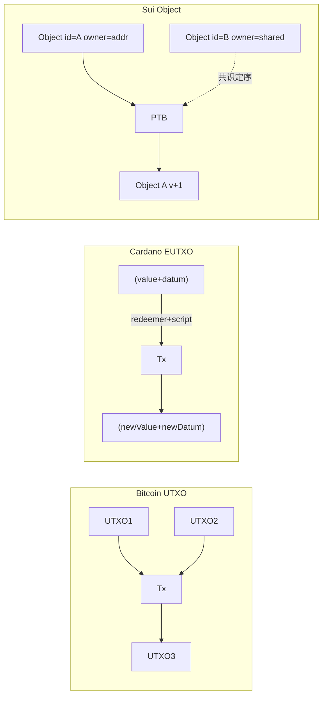

# 混合账本模型（Hybrid Ledger: Sui Object / Cardano EUTXO / Fuel）

> **TL;DR**：纯 UTXO（Bitcoin）擅长并行但不擅长状态依赖计算；纯 Account（Ethereum）擅长状态共享但串行瓶颈明显。2017 年后出现的「混合模型」试图兼得：**Cardano EUTXO** 为每个 UTXO 附加 datum + validator 脚本；**Sui Object-Centric** 把每个资源表达为带 ID 与 owner 的 Object，并以 DAG 依赖解并发；**Fuel** 在 UTXO 上增加合约账户 + calldata，实现可并行 EVM 等价物。这三者代表当前混合账本的三条主流路线，本篇对比其形式化定义、并发模型与编程范式。

## 1. 背景与动机

UTXO 与 Account 的取舍见 `01-infrastructure/ledger-model/utxo.md` 与 `account.md`。简而言之：

- **UTXO 优势**：交易天然无共享状态，可并行验证；隐私性好；形式化验证简单。
- **UTXO 劣势**：有状态应用（DeFi 池、NFT 市场）需要"全局共享可变状态"，UTXO 里模拟成本极高（需要手动链 reference）。
- **Account 优势**：状态就像数据库行，合约直接读写；智能合约编程直观。
- **Account 劣势**：全局状态串行化 → 并发瓶颈（Ethereum ~15 tps）。

2010 年代末，几支团队开始寻找**既能表达复杂合约，又能并行执行**的账本模型：

1. **IOHK/Cardano**（2017 论文 "Extended UTXO Model"）——给 UTXO 加"携带数据"与"验证脚本"能力。
2. **Diem/Libra → Meta Novi → Sui & Aptos**（2019-2022）——重构账本为 Object 粒度，MoveVM 原生支持"资源"语义。
3. **Fuel Labs**（2020-2024）——在 UTXO 基础上支持 EVM-like 合约，目标成为 Ethereum 最快执行层。

这三个方向共同点是把"账本单元"从"账户余额"细化到"带 ID 的资源"，让**读写集天然小而独立**，从而支持乐观或静态并发。

## 2. 核心原理

### 2.1 形式化定义：三种模型的数学表达

**Bitcoin UTXO**：账本 $L_n$ 是 UTXO 集合 $\{u_1, u_2, …\}$，每个 $u = (value, scriptPubKey)$。一笔交易 $T$ 消耗 $\{u_i\}$ 生成 $\{u_j\}$，有效当且仅当所有 scriptSig 满足对应 scriptPubKey 且总输入 ≥ 总输出。

**Cardano EUTXO**（Extended UTXO）：$u = (value, addr, datum, validator)$。交易额外携带 `redeemer`：

$$
\text{valid}(T) = \forall i: \text{validator}_i(datum_i, redeemer_i, ctx) = \text{true}
$$

其中 `ctx`（ScriptContext）包含整笔交易信息（所有输入、输出、时间、证书、签名者）。

**Sui Object**：账本 $L$ 是 Object 全集 $\{o_{id}\}$，$o = (id, version, owner, type, fields)$。Owner 可为：
- **Address-owned**（单用户拥有）
- **Shared**（全局共享，需共识排序）
- **Immutable**（冻结）
- **Object-owned**（嵌套）

一笔 Transaction Block 包含一组 PTB 指令（Move call / transfer / merge / split），输入读写集显式声明。**只涉及 address-owned objects 的交易不走共识**，只过 DAG 排序（Narwhal）。

**Fuel v1 UTXO+**：$u = (value, owner, assetId, data)$。合约作为特殊 UTXO：每次调用需要携带 contract input（UTXOID + stateRoot），合约修改后产生新 stateRoot 在输出中。

### 2.2 子机制一：携带数据的 UTXO（EUTXO）

Cardano EUTXO 的"携带 datum"让 UTXO 变成一个"微型状态机快照"。

示例：一个 DEX 池子作为 EUTXO：
```
UTXO_pool = (
  value: 10 ADA + 500 TokenA + 300 TokenB,
  addr: script_address,
  datum: { reserveA: 500, reserveB: 300, feeBps: 30 },
  validator: DEX_script
)
```

用户发 swap tx 消耗 UTXO_pool，产生新的 UTXO_pool'（新储备）。`validator` 脚本检查 constant-product 不变量（x·y=k）。

**代价**：UTXO 同一时刻只能被一人消耗 → 高并发下"争抢同一池子"成为冲突焦点（concurrency contention）。Cardano 通过 Hydra、Partner Chains 缓解，或用多 UTXO 池子并行。

### 2.3 子机制二：Object + Owner 模型（Sui）

Sui 为每个对象分配 globally unique id，并通过 owner 字段将并发语义清晰化：

- **Address-owned**：仅对 owner 可见，单 writer，可绕过共识（Narwhal DAG 排序够了）。
- **Shared**：类似 Ethereum 合约全局状态，需 Bullshark/Mysticeti 共识定序。
- **Immutable**：只读，读取可完全并行。
- **Object-owned**：树形依赖（动态字段、Kiosk）。

并发执行路径：
```
交易到达 → 静态分析读写集 → 
  if 全部 address-owned/immutable: Fast Path (Bullshark bypass)
  else: Consensus Path (Mysticeti 共识)
  → Move VM 执行 → 更新 Object Store
```

2026 Sui 主网 TPS 峰值 > 297k（历史测试），平均 2000-5000，约 80% 交易走 Fast Path。

### 2.4 子机制三：Move 语言对 Object 的支持

Move 的"资源"（linear type）天然匹配 Object 语义：

```move
module example::coin {
    public struct Coin has key, store { id: UID, value: u64 }

    public fun split(c: &mut Coin, amount: u64, ctx: &mut TxContext): Coin {
        assert!(c.value >= amount, 0);
        c.value = c.value - amount;
        Coin { id: object::new(ctx), value: amount }
    }
}
```

`has key` 表明它是顶级对象；`has store` 允许嵌套。编译器阻止"复制 Coin"这种违反资源语义的操作。

### 2.5 子机制四：Fuel 的 UTXO + 合约

Fuel 保留 UTXO 核心：每笔 tx 有 inputs/outputs。但引入 **ContractInput / ContractOutput**，契约地址对应一个特殊 UTXO，内含 `stateRoot`。Sway 语言写的合约在 FuelVM（RISC-V-like）内执行，读写合约存储时更新 stateRoot。

```
Tx {
  inputs: [coin_utxo_1, contract_utxo (DEX)],
  outputs: [coin_utxo_2, contract_utxo' (DEX'), change_utxo],
  scripts: [call_swap(args)]
}
```

并发：每个合约一个 UTXO，不同合约可并行；同一合约仍串行。

### 2.6 关键参数与常量

| 参数 | Cardano EUTXO | Sui Object | Fuel |
| --- | --- | --- | --- |
| 目标 TPS | ~250（Hydra 16× 后 ~4000） | ~297k 峰值 | 数千 |
| 状态存储 | Datum（UTXO 内联） | Object Store（全局 KV） | Contract UTXO stateRoot |
| 最大 tx 大小 | 16 KB | 128 KB | 100 KB |
| 共识 | Ouroboros Praos/Peras | Mysticeti + Narwhal | （依赖底层 Ethereum 或独立） |
| 脚本语言 | Plutus (Haskell subset) | Move | Sway (Rust-like) |

### 2.7 边界条件与失败模式

- **EUTXO Contention**：热点 UTXO（如 DEX 池）在高并发下只能串行，UX 退化（"你的 tx 用的 UTXO 已被消耗，请重试"）。
- **Sui 版本冲突**：两个 tx 同时修改同一 object 的新版本，后到的必被拒绝，需客户端重放。
- **Shared Object 堆积**：Sui shared objects 多时，Mysticeti 共识吞吐下降。
- **Fuel 合约 UTXO**：单一合约 UTXO 成瓶颈，设计时需 sharding 合约状态。

### 2.8 图示：三种模型的并发拓扑



## 3. 架构剖析

### 3.1 分层视图：Sui 全栈

```
┌─────────────────────────┐
│ SDK (TS, Rust, Python)  │
├─────────────────────────┤
│ JSON-RPC / GraphQL      │
├─────────────────────────┤
│ Full Node (RPC)         │
├─────────────────────────┤
│ Validator               │
│ ├ Mysticeti Consensus   │
│ ├ Narwhal Mempool/DAG   │
│ └ Move Execution Engine │
├─────────────────────────┤
│ RocksDB Store (Objects) │
└─────────────────────────┘
```

### 3.2 Cardano EUTXO 架构

Cardano 分两层：**CSL**（Consensus Layer，Ouroboros）+ **CL**（Computation Layer，Plutus）。交易先在 CSL 被排序，验证阶段运行 Plutus 脚本。Plutus 脚本**不能从链上随机读数据**（这是 EUTXO 不变量的来源），只能读取被 redeemer 指定的 UTXO 与 datum → 天然适合**形式化验证**。

### 3.3 核心模块清单

| 模块 | Cardano | Sui | Fuel |
| --- | --- | --- | --- |
| 共识 | Ouroboros Praos/Peras | Mysticeti | Rollup/独立 |
| VM | Plutus Core | MoveVM | FuelVM |
| 状态存储 | UTXO 内嵌 datum | Object Store（RocksDB） | UTXO + Contract stateRoot |
| 语言 | Plutus / Aiken / Marlowe | Move | Sway |
| SDK | Lucid / cardano-cli | sui-sdk | fuels-rs / fuels-ts |
| 桥 | Milkomeda / Wanchain | Wormhole / LayerZero | Native to Ethereum |

### 3.4 生命周期：Sui 一笔 swap 的路径

1. dApp 用 @mysten/sui SDK 构造 `TransactionBlock`。
2. 用户 Sui Wallet 签名，POST 到 Full Node。
3. Full Node 转发 > 2f+1 Validator（quorum）。
4. Validator 静态分析读写集；如果全部 address-owned → "Fast Path"，每个 Validator 独立签字，无共识。
5. Client 聚合 quorum → "certificate"。
6. Certificate 提交共识（如果包含 shared objects）或直接执行。
7. 执行成功后 `effects` 返回用户。
8. 每 ~500ms 一次 checkpoint，Object 版本持久化。

### 3.5 客户端多样性

- **Sui**：目前只有官方 Rust 实现（sui-node）。**风险高**。Aptos 已在开发第二 client。
- **Cardano**：Haskell（IOHK）+ Scala（cardano-jormungandr 已废弃）→ 基本单实现。
- **Fuel**：Rust（fuel-core）单实现。

### 3.6 互操作接口

- **Cardano**：CIP-30（Wallet API）、CIP-25（NFT metadata）、CIP-68（Datum standards）。
- **Sui**：JSON-RPC + GraphQL + Move Event 流。
- **Fuel**：GraphQL。

## 4. 关键代码：Sui Coin 转账

Sui 官方仓库 `sui/crates/sui-framework/packages/sui-framework/sources/coin.move`：

```move
// sui-framework/sources/coin.move (精简)
module sui::coin {
    public struct Coin<phantom T> has key, store {
        id: UID,
        balance: Balance<T>,
    }

    public fun split<T>(
        self: &mut Coin<T>, split_amount: u64, ctx: &mut TxContext
    ): Coin<T> {
        Coin { id: object::new(ctx), balance: balance::split(&mut self.balance, split_amount) }
    }

    public entry fun transfer<T>(c: Coin<T>, recipient: address) {
        sui::transfer::public_transfer(c, recipient)
    }
}
```

## 5. 演进与版本对比

| 版本 | 时间 | 关键变化 |
| --- | --- | --- |
| Sui Testnet → Mainnet | 2023-05 | Object 模型、Move v2 |
| Sui Mysticeti 共识 | 2024-08 | 单阶段 BFT、低延迟 |
| Sui Deepbook v3 | 2024-Q4 | CLOB on-chain |
| Cardano Shelley | 2020-07 | 去中心化出块 |
| Cardano Alonzo | 2021-09 | Plutus 上线，EUTXO 带 datum |
| Cardano Vasil | 2022-09 | Inline datum、Reference input |
| Cardano Chang | 2024-09 | 治理升级 |
| Fuel v1 Mainnet | 2024-05 | 作为 Ethereum 执行层 |

## 6. 实战示例：Sui CLI 一键部署 Move 包

```bash
# 安装
curl -fsSL https://sh.rustup.rs | sh
cargo install --git https://github.com/MystenLabs/sui --branch mainnet sui

# 创建 Move 包
sui move new my_pkg && cd my_pkg
# 编辑 sources/coin.move (见 §4)
sui move build
sui client publish --gas-budget 100000000
# 输出 packageId、newly created objects
```

## 7. 安全与已知攻击

- **Sui 2024-10** bug：某 validator 在升级时产生 fork，影响 6 分钟（快速回滚无用户损失）。
- **Cardano Plutus 脚本成本爆炸**：2022 Alonzo 刚上线时，脚本单位限制过低，导致 DEX 卡顿。
- **Fuel 早期 Predicate 验证**：2023 audit 发现 predicate 和 script 语义边界易错（后由 Trail of Bits 修复）。

## 8. 与同类方案对比

| 维度 | Bitcoin UTXO | Ethereum Account | Cardano EUTXO | Sui Object | Fuel UTXO+ |
| --- | --- | --- | --- | --- | --- |
| 并行 | 天然 | 差 | 中（UTXO 天然，datum 非原生热点） | 强（owner 分类） | 合约粒度 |
| 合约能力 | 无 | 强 | 强（局限于可静态分析） | 强（Move 资源） | 强（EVM 等价） |
| 形式化 | 易 | 难 | 易 | 中 | 中 |
| 生态 | 大 | 最大 | 中 | 中 | 新 |
| 隐私 | 弱+（Taproot） | 弱 | 弱 | 弱 | 弱 |

## 9. 延伸阅读

- IOHK EUTXO paper (2020)：Chakravarty et al., The Extended UTXO Model。
- Sui Lutris paper (2023)：Blackshear et al., Sui Lutris: A Blockchain Combining Broadcast and Consensus。
- Move Book：move-book.com。
- Fuel Docs：docs.fuel.network。
- Vitalik 2016 blog：Merging Accounts and UTXO。

## 10. 术语表

| 术语 | 英文 | 释义 |
| --- | --- | --- |
| 混合账本 | Hybrid Ledger | 兼具 UTXO 并行与 Account 可编程的模型 |
| EUTXO | Extended UTXO | Cardano 的扩展 UTXO，带 datum |
| Object | Object | Sui 的账本基本单元 |
| Redeemer | Redeemer | Plutus 脚本的"输入参数" |
| Datum | Datum | UTXO 内嵌的状态数据 |
| PTB | Programmable Tx Block | Sui 的交易组合器 |
| FuelVM | FuelVM | Fuel 的执行引擎，RISC-V-like |

---

*Last verified: 2026-04-22*
