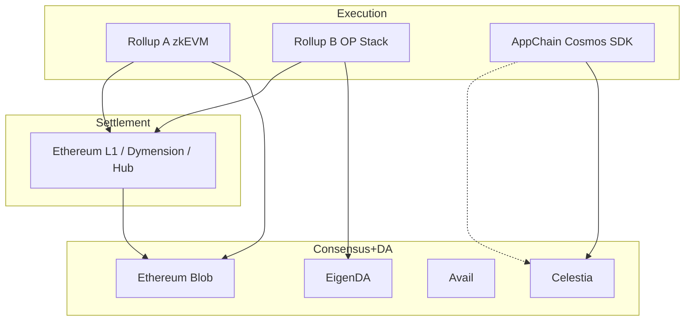

# 模块化区块链范式

> **TL;DR**：**模块化区块链（Modular Blockchain）** 把传统"一条链干所有事"的 **单体（monolithic）架构** 拆解为 **四个解耦的层**：**执行（Execution）、结算（Settlement）、共识（Consensus）、数据可用性（Data Availability, DA）**。每层可由专门的协议承担，通过明确接口组合；用户得以像搭 Lego 一样挑选 "Rollup（执行）+ Celestia（DA）+ Ethereum（结算+共识）" 这样的栈。Mustafa Al-Bassam 等在 2019 LazyLedger 论文首次系统提出；Celestia 2023-10 主网上线成为业界首个生产级 "pure DA" 层；随后 Avail、EigenDA、Polygon Avail 等加入 DA 赛道，**AltLayer、Rollkit、ZK Stack、OP Stack、Polygon CDK** 提供一键式执行层 SDK，**EigenLayer + AVS** 提供可租用的经济安全。Ethereum 本身通过 **Rollup-centric roadmap** 主动选择了"Ethereum = 高安全结算 + DA + 通用共识"的定位，放弃把执行扩到 L1。理解模块化不是理解"某条链"，而是理解 **"区块链协议栈的解耦与重组"**——它重新定义了 2023 年后所有 L1/L2 叙事。

---

## 1. 背景与动机

2009 Bitcoin、2015 Ethereum 都是 **单体链**：同一批节点同时做共识、执行交易、存交易数据、验证合法性。这种设计简单，但带来 **扩展性三难（scalability trilemma）**——安全、去中心化、可扩展三选二。单体链要扩容，要么提 block size（牺牲去中心化，BTC/ETH 社区拒绝），要么改共识（风险大），要么引入分片（工程极难）。

2018 年前后，两条思路从两端逼近同一结论：

1. **Ethereum 方向**：Vitalik "Rollup-centric roadmap"（2020-10）——L1 不做执行扩容，L2 Rollup 负责执行、L1 只做 DA+结算；等 danksharding 完成，L1 DA 大幅扩容。
2. **Celestia 方向**：Mustafa Al-Bassam 2019 LazyLedger 论文——"完全 lazy 的链，只保证排序与数据可用性，不解释交易内容"。任何 Rollup/主权链都可以把数据发来。

两条路线共同走向 **模块化**：把链拆层，让每层选最合适技术。AltLayer 等 Rollup-as-a-Service 厂商把这个拆解具象化——"你要几个执行层？几个 DA？什么结算链？"

模块化的价值：

- **可替换**：任意层可换方案（比如换 DA 从 calldata → Celestia），不用推倒重来。
- **专业化**：每个层选最优技术，而不是折中。
- **复用安全**：EigenLayer 让很多协议**复用 Ethereum PoS 的经济安全**，不用自建验证者集。
- **加速创新**：新团队不必从创世做起；数月可启动专用 Rollup。

## 2. 核心原理

### 2.1 四层定义

- **Execution**：执行交易、维护状态、生成 receipts；关心 "怎么算"。典型：Ethereum L1、zkEVM Rollup、Arbitrum Nitro、Solana、Cairo VM。
- **Settlement**：承诺状态转移最终性、处理争议、桥接资产；关心 "结果认不认"。典型：Ethereum L1、Cosmos Hub（通过 IBC）、Dymension Hub。
- **Consensus**：节点就 **交易顺序** 达成共识；关心 "谁先谁后"。典型：Tendermint、Ethereum Gasper、Solana Tower BFT。
- **Data Availability**：保证所有节点能读到每笔交易原始数据；关心 "数据真的在"。典型：Ethereum blob space（EIP-4844）、Celestia、Avail、EigenDA。

**关键观察**：共识 + DA 常被组合在"基础层"，因为"排好序"与"数据可用"是链下任何重放/证明的前提；执行 + 结算常组合在"Rollup 侧"。但它们完全可以按需解耦。

### 2.2 形式化：可验证执行 + 可用数据

一个模块化系统的**安全性**可分解为以下四点必须同时满足：

```
1. Data Availability：任何人能取到 block/batch 数据 B
2. Ordering Finality：B 在共识层中达成 finality
3. Validity：state' = STF(state, B) 被 Execution 层保证（ZK or Fraud Proof）
4. Settlement：state' 在 Settlement 层被承认，争议有裁决
```

模块化不是"去掉"这四点，而是 **把每一条分派给最适合的层**。任何一层失守都会导致系统级故障。

### 2.3 子机制拆解

1. **DAS（Data Availability Sampling）**：轻节点随机抽样若干 cell 来统计判定数据可用。配合 2D Reed-Solomon 编码，`O(log N)` 样本即可达到 `1 - 2^{-k}` 置信度。这是 Celestia、Avail 核心原语，也是 Ethereum Danksharding 的目标。
2. **Proofs of Custody / Namespaced Merkle Tree**：Celestia 用 NMT 让每个 Rollup "只需下载自己 namespace" 的数据，DA 按需。
3. **Pessimistic vs Optimistic Rollup 调用 DA**：Optimistic Rollup 需要 DA 保证挑战者可重放；ZK Rollup 则利用 DA 保证用户能生成自己的提款证明——两者都离不开 DA，但要求不同。
4. **Settlement Layer's "Bridge"**：Settlement 层需要理解执行层的状态转移语义（例如 zkEVM 的 proof 结构），以便验收。Ethereum L1 上部署的 Verifier 合约是典型桥。
5. **Shared Security / Restaking**：EigenLayer 把 ETH 质押经济价值"租"给 AVS（Actively Validated Service）——DA、Oracle、桥、Rollup 排序器都可以复用。
6. **主权 Rollup（Sovereign Rollup）**：只把数据与顺序放在 DA 层，不把结算放在 Settlement 层；升级由本链社会共识决定。Celestia 生态首创。

### 2.4 参数与常量（代表）

| 层 | 典型系统 | 关键参数 |
| --- | --- | --- |
| DA | Celestia | Block size 2MB→32MB 演进、Namespace ID 32 bytes、BLS 签名 |
| DA | Ethereum EIP-4844 | 每 block 3 blob（目标）~125KB，Dencun 后 |
| DA | EigenDA | 吞吐 10 MB/s 量级，restake 经济安全 |
| Execution | Arbitrum Nitro | 10,000+ TPS 理论上限 |
| Execution | zkEVM | 100–1000 TPS 受 prover 限制 |
| Settlement | Ethereum | 12s slot、2 epoch finality (~13 min) |

### 2.5 边界条件与失败模式

- **DA 层扣留**：Rollup 虽然提交 proof 但用户无法拿到提款数据——资金冻结。对应 Validium 威胁模型。
- **Sequencer/Execution 恶意排序**：DA 和 Settlement 看起来正常，但 MEV 被抽取 / 交易被审查。
- **Restaking 级联风险**：多个 AVS 共用同一批 ETH stake；一次 slash 触发可能引发多服务连锁惩罚。
- **跨层握手错误**：例如 Settlement 层 Verifier 合约升级与执行层版本不匹配，导致暂时无法 finalize。
- **sovereign rollup 软硬分叉**：没有外部 settlement，只能靠社区分叉解决争议，治理风险偏高。



## 3. 架构剖析

### 3.1 典型组合表

| 执行 | 结算 | 共识 + DA | 典型案例 |
| --- | --- | --- | --- |
| Arbitrum Nitro | Ethereum L1 | Ethereum Blob | Arbitrum One |
| OP Stack | Ethereum L1 | Ethereum Blob | Base, Optimism |
| OP Stack | Ethereum L1 | Celestia | Mantle, Manta Pacific |
| zkSync ZK Stack | Ethereum L1 | EigenDA / Avail / Eth | zkSync hyperchain |
| Rollkit | 主权 | Celestia | Sovereign Rollup（如 Dymension RollApps） |
| Cosmos SDK | 本链共识 | Tendermint + 自己 DA | Cosmos Hub / Osmosis |
| Polygon CDK | Ethereum L1 | Ethereum / Avail / Celestia | X Layer, Astar zkEVM |

### 3.2 核心模块清单

| 模块 | 作用 | 代表项目 / 仓库 |
| --- | --- | --- |
| DA layer | 提供数据可用性与排序 | `celestiaorg/celestia-core`, `availproject/avail`, EigenDA |
| Rollup SDK | 一键搭建执行层 | `ethereum-optimism/optimism` (OP Stack), `OffchainLabs/nitro`, `matter-labs/zksync-era` (ZK Stack), `0xPolygon/cdk`, `rollkit/rollkit` |
| Settlement contract | L1 结算合约 / 桥 | `L1StandardBridge`, `LineaRollup.sol`, `Starknet.sol` |
| Shared security | 复用底层安全 | `Layr-Labs/eigenlayer-contracts`, Babylon (BTC staking), Symbiotic |
| Sequencer shared | 多 Rollup 共享排序 | Espresso Systems, Radius, Astria |
| Proving service | 共享 prover | Succinct、=nil Foundation、SHARP |
| Bridging / Interop | 跨 Rollup | LayerZero、Wormhole、AggLayer、Hyperlane、CCIP |
| RaaS | Rollup-as-a-Service | AltLayer, Caldera, Conduit, Gelato |

### 3.3 生命周期：一次 Tx 在模块化栈中的旅程

以 "OP Stack Rollup + Celestia DA + Ethereum Settlement" 为例：

1. 用户发 Tx 到 Rollup Sequencer（OP Stack）。
2. Sequencer 执行、打包成 **batch**。
3. Sequencer 把 batch 数据作为 blob 发到 **Celestia**，拿到 `DataCommitment` + Celestia block height。
4. Sequencer 把 `(stateRoot, celestiaCommitment)` 作为一笔 L1 交易提交到 **Ethereum 结算合约**。
5. Ethereum `L1 OutputOracle` 记录新的 `stateRoot`；进入 7 天 challenge window（Optimistic）或等 ZK proof（ZK）。
6. 用户查数据：下载 Celestia block / Rollup full node 同步。
7. 提款：在 L1 合约提交 Merkle proof，等 challenge window 结束。

可观测性点：Rollup RPC（`eth_getBlockByNumber`）、Celestia `blob.get`、L1 事件 `OutputProposed`。

### 3.4 实现多样性

- **OP Stack**（Rust + Go）——最活跃的 modular L2 框架。
- **Nitro**（Go）——Arbitrum 系。
- **ZK Stack**（Rust）——zkSync 系。
- **Polygon CDK**（Go）——Polygon zkEVM 衍生。
- **Rollkit**（Go）——主权 Rollup 首选。
- **Sovereign SDK**（Rust）——主打 ZK 的 sovereign rollup。
- **Cosmos SDK**（Go）——modular 思想的鼻祖之一（应用链）。
- **Dymension RDK**（Go）——RollApp 专用。

### 3.5 扩展 / 互操作接口

- **Data Commitment Interface**：Rollup ↔ DA，通常是 `submitBlob` + `getCommitment`。
- **Settlement Bridge**：Rollup ↔ Settlement，Verifier 合约 + state root registry。
- **Interop Bus**：Optimism Superchain Interop、AggLayer 统一桥、LayerZero ULN、Hyperlane ISM。
- **AVS Interface**：EigenLayer 的 `registerOperator / slash`。
- **Shared Sequencer API**：Espresso、Astria 提供的排序 API。

## 4. 关键代码 / 实现细节

**Celestia blob 提交客户端**（`celestiaorg/celestia-node`）：

```go
blobOne, _ := blob.NewBlobV0(namespace, []byte("Rollup batch bytes..."))
commitments := []*blob.Blob{blobOne}
txResponse, err := client.Blob.Submit(ctx, commitments, blob.DefaultGasPrice())
// 得到 commitment → Rollup 合约引用
```

**OP Stack 里使用 Alt DA（`op-plasma` 模式）**（`ethereum-optimism/optimism/op-plasma/`）：

```go
// 典型 config
type Config struct {
    DAServerURL            string // Celestia light node / S3-compat
    VerifyOnRead           bool
    DAChallengeContract    common.Address
    DAChallengeWindow      uint64  // blocks
    DAResolveWindow        uint64
}
```

**EigenLayer AVS 注册**（`Layr-Labs/eigenlayer-contracts`，简化）：

```solidity
function registerOperatorToAVS(
    address operator,
    ISignatureUtils.SignatureWithSaltAndExpiry memory operatorSignature
) external {
    require(isOperator[operator], "not operator");
    avsOperatorStatus[msg.sender][operator] = OperatorAVSRegistrationStatus.REGISTERED;
    emit OperatorAVSRegistrationStatusUpdated(operator, msg.sender, true);
}
```

## 5. 演进与版本对比

| 时间 | 事件 |
| --- | --- |
| 2019-05 | Mustafa Al-Bassam "LazyLedger" 论文 |
| 2020-10 | Vitalik "Rollup-centric roadmap" |
| 2021-06 | Celestia (LazyLedger 更名) 白皮书 |
| 2021-11 | EIP-4844 Proto-Danksharding 开始成型 |
| 2022-06 | AltLayer、Caldera、Conduit 等 RaaS 启动 |
| 2022-10 | Rollkit 发布，sovereign rollup 具象化 |
| 2023-01 | zkSync Era / Polygon zkEVM / Scroll 主网在即 |
| 2023-03 | EigenLayer 测试网 |
| 2023-10-31 | **Celestia 主网**上线 |
| 2024-03 | **Ethereum Dencun**（EIP-4844 blob） |
| 2024-04 | **EigenDA、Avail** 主网 |
| 2024-07 | Polygon AggLayer v0.2 |
| 2025 | OP Stack Superchain Interop、Shared sequencer 初期部署 |

## 6. 实战示例

**用 Rollkit + Celestia 几行代码起一条主权 Rollup**：

```bash
# 启动 Celestia light node（已同步 namespace）
celestia light start --core.ip consensus.lunaroasis.net --p2p.network mocha-4

# 用 rollkit-cli 起链
rollkit-cli start \
  --rollkit.da_layer celestia \
  --rollkit.da_config='{"base_url":"http://localhost:26659","auth_token":"..."}' \
  --rollkit.namespace_id 0x010203040506070809 \
  --rollkit.block_time 1s
```

**用 OP Stack + EigenDA 启 Rollup（概念）**：

```bash
git clone https://github.com/ethereum-optimism/optimism
# 修改 genesis：
# "data_availability": { "plasma_mode": true, "da_server": "https://eigenda-proxy.xyz" }
make devnet-up
```

## 7. 安全与已知攻击

1. **DA Sampling Soundness**：DAS 的安全依赖"足够多诚实轻节点抽样"。若诚实轻节点数量不足，攻击者可选择性扣留未被抽到的那一小片数据，欺骗系统。Celestia 按照研究论证估计的安全阈值设置。
2. **EigenLayer Slashing 级联风险**：Restaking 链条放大 slashing 的"扫射效应"。AVS 设计必须认真考虑 objective slashing condition。
3. **Sequencer 中心化（跨层共性）**：模块化并未解决单 sequencer 审查问题；Shared sequencer 与 based sequencing（L1 内 propose L2）是方向。
4. **跨层版本错配**：Settlement 合约升级 vs Execution 升级 vs DA 层升级，三者节奏不一致时可能发生"消息延迟/丢失"。2024 年多个 L2 升级出过短暂故障。
5. **主权 Rollup 社会共识风险**：无 L1 仲裁，争议靠链下协调，存在恶性分叉威胁。
6. **经济同构脆弱性**：多个 Rollup 共享 ETH 安全时，若 ETH 本身受到极端攻击，所有依赖 ETH 的模块化栈同时受损——"集中式去中心化"的悖论。

## 8. 与同类方案对比

| 维度 | 模块化栈（如 OP+Celestia） | 单体 L1（Solana、Sui） | 主权侧链（BSC、Polygon PoS） | 分片（Ethereum 2 设想 / Near） |
| --- | --- | --- | --- | --- |
| TPS 上限 | 随层扩容 | 单体硬件上限 | 单体硬件上限 | 分片相加 |
| 安全来源 | 多层复合（Ethereum+Celestia+AVS） | 自身验证者集 | 自身验证者集 | 共享 beacon chain |
| 组合复杂度 | 高 | 低 | 低 | 中 |
| 升级敏捷性 | 各层独立升级 | 全链升级 | 全链升级 | 跨分片协调 |
| 典型时延 | L2 秒级，L1 结算分钟/天 | 亚秒 | 秒 | 视分片 |

**trade-off**：模块化为创新和扩容提供空间，但增加了安全边界与治理复杂度。单体链简单直接，但扩容上限受硬件制约。

## 9. 延伸阅读

- **Tier 1（一手）**
  - Celestia Learn：<https://celestia.org/learn/basics-of-modular-blockchains/>
  - LazyLedger 论文：<https://arxiv.org/abs/1905.09274>
  - Ethereum Rollup Roadmap：<https://ethereum.org/en/roadmap/>
  - Avail Docs：<https://docs.availproject.org>
  - EigenLayer Docs：<https://docs.eigenlayer.xyz>
  - Rollkit：<https://rollkit.dev>
- **Tier 2（研究）**
  - Vitalik "Endgame"：<https://vitalik.eth.limo/general/2021/12/06/endgame.html>
  - Vitalik "Proto-Danksharding FAQ"：<https://notes.ethereum.org/@vbuterin/proto_danksharding_faq>
  - Dankrad Feist on DAS：<https://dankradfeist.de>
  - a16z crypto "Making Sense of DA"：<https://a16zcrypto.com>
  - Messari "Modular Thesis"：<https://messari.io/research>
  - L2BEAT Data Availability：<https://l2beat.com/data-availability>
- **Tier 3（博客）**
  - Mustafa Al-Bassam blog：<https://musalbas.com>
  - Jon Charbonneau "Do Rollups Inherit Security?"：<https://dba.xyz>
  - Celestia blog：<https://blog.celestia.org>
  - 登链社区模块化专栏：<https://learnblockchain.cn/tags/Celestia>

## 10. 术语表

| 术语 | 英文 | 释义 |
| --- | --- | --- |
| 模块化区块链 | Modular Blockchain | 把链分为执行/结算/共识/DA 的范式 |
| 执行层 | Execution Layer | 运行交易、维护状态 |
| 结算层 | Settlement Layer | 最终性确认与争议仲裁 |
| 共识层 | Consensus Layer | 对交易顺序达成一致 |
| 数据可用性层 | Data Availability Layer | 保证数据可供任意节点获取 |
| DAS | Data Availability Sampling | 轻节点抽样检验数据可用 |
| 共享安全 | Shared Security | 多个协议复用同一批质押 |
| Restaking | Restaking | 把已质押资产再抵押给其他服务 |
| AVS | Actively Validated Service | EigenLayer 中的可被共享安全保护的服务 |
| 主权 Rollup | Sovereign Rollup | 仅用 DA 层、不绑定外部结算的 Rollup |

---

*Last verified: 2026-04-22*
