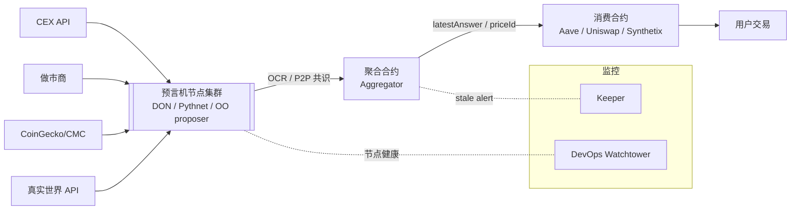

# 预言机总览（Oracle Overview）

> **TL;DR**：预言机（Oracle）是把 **链下数据** 与 **链下计算** 安全传递到链上智能合约的中间件，被称为 Web3 的"I/O 系统"。由于区块链是确定性、封闭的状态机，它不能主动访问外部 API、不能读取金融行情、不能生成随机数、不能调用链外计算，这就是所谓的 **"Oracle Problem"**。当前主流分三大范式：**推模式（Push / Data Feed）**——以 Chainlink Data Feed、API3 dAPI 为代表，由 DON 周期性把价格写上链；**拉模式（Pull / On-demand）**——以 Pyth Pull、RedStone Core 为代表，数据在链下预签后由用户/keeper 按需提交，节省 Gas 与延迟；**乐观模式（Optimistic）**——以 UMA OO 为代表，先提出结果、异议期内挑战，适合长尾/主观数据。预言机支撑了 DeFi（清算、兑换、利率）、保险、衍生品、跨链消息（CCIP、Wormhole）、RWA、游戏随机数等几乎所有高价值合约，一旦失灵会引发闪电贷价格操纵（bZx/Harvest/Mango/Cream 等数亿美元级损失）。本文给出预言机的统一心智模型、分类法、主流方案对比与评估框架。

---

## 1. 背景与动机

### 1.1 Oracle Problem 的来源

区块链要达到全网一致，必须让每个全节点 **独立重放** 同一笔交易都得到同一结果。这要求执行是 **纯函数**：输入（区块数据 + 先前状态）→ 输出（新状态）。任何对外部非确定源的依赖——HTTP 请求、系统时间、随机数——都会破坏这一性质。但绝大多数现实合约都需要外部输入：

- DEX / 衍生品 / 借贷需要 **资产价格**（为什么 Uniswap V2 spot price 不安全？因为它可在一个区块内被闪电贷操纵）。
- 保险需要 **航班延误 / 降雨量** 等真实事件。
- 游戏 / NFT 铸造需要 **不可预测随机数**。
- RWA 需要 **链下资产审计证明**（Proof of Reserve）。
- 跨链需要 **另一条链的区块头或消息状态**。

Smart contract 无法自己"伸手"去拉数据，必须由一个可信中介把数据 **推** 进来。一旦这个中介被贿赂或攻击，合约就会基于错误输入执行，造成灾难性损失。这就是 **Oracle Problem**：如何以去信任方式把链外真相传递到链上。

### 1.2 历史演进

- **2014–2016：单点预言机时代**。Oraclize（现 Provable）靠 TLSNotary 等方式对 HTTPS 做存在证明，是早期中心化代表。
- **2017：Chainlink 白皮书**（Ellis、Juels、Nazarov 9 月发布），提出 **去中心化预言机网络（DON）**，用多节点聚合 + LINK 质押。
- **2019–2021：DeFi 夏天催生行业爆发**。Maker、Synthetix、Aave、Compound 都依赖预言机。Band Protocol、API3、Tellor、UMA 相继出现。
- **2020–2021：bZx、Harvest、Cream 等十余起闪电贷价格操纵事件**，让业界认识到"预言机来源隔离 + TWAP" 比单纯"更多节点" 更关键。
- **2022：Pyth Network 在 Pythnet 上线**，首创第一方发布模式（交易所、做市商直接签名）。
- **2023：拉模式崛起**。Pyth、RedStone 通过 EVM 外数据 + 用户 calldata 触发更新，大幅降低 Gas。
- **2024：OEV（Oracle Extractable Value）成为显学**。清算订单被提前嗅探 → API3 OEV Auction、Chainlink SVR (Smart Value Recapture) 把这部分 MEV 返还给协议。
- **2024–2026：CCIP / Wormhole / LayerZero 将预言机原语延伸到跨链 messaging**；Chainlink Staking v0.2 上线。

### 1.3 预言机在技术栈中的位置

```
┌─ DApp / 用户 ──────────────────────────────┐
│  前端、钱包、子图                              │
├────────────────────────────────────────────┤
│  Smart Contract 层（Aave / Uni / Pendle）    │
│          ↑ 读取 latestAnswer() / priceId    │
├────────────────────────────────────────────┤
│  预言机合约层（Aggregator / Reader）           │
│          ↑ 聚合 / 验签                        │
├────────────────────────────────────────────┤
│  预言机网络层（DON / Pythnet / OO）             │
│          ↑ OCR / P2P / 共识                  │
├────────────────────────────────────────────┤
│  数据源层（CEX、做市商、Web API、真实世界传感器）  │
└────────────────────────────────────────────┘
```

## 2. 核心原理

### 2.1 形式化定义

令 `O` 为一个预言机协议，它的作用是实现映射：

```
O : (query q, time t) → (value v, proof π)
```

其中 `q` 是查询（如 "ETH/USD"），`v` 是返回值，`π` 是可验证证明。合约通过 `Verify(q, v, π) = 1` 判断是否接受。设计目标是让如下三个性质同时成立：

1. **正确性（Correctness）**：在诚实多数假设下，`v` 等于或 ε-近似真实值 `v*`。
2. **活性（Liveness）**：在有限延迟 Δ 内总能获得 `v`。
3. **经济安全（Economic security）**：攻击成本 `C_attack > C_benefit`，即贿赂 / 腐蚀预言机的成本大于操纵合约获利。

任何预言机都是在这三者上做权衡：乐观预言机牺牲 Liveness 换更低的常态成本；Pull 模式牺牲一部分正确性稳健性换取低 Gas；Push 模式消耗持续 Gas 换强 Liveness。

### 2.2 分类法（Taxonomy）

**按数据流方向**：

| 维度 | Push Oracle | Pull Oracle | Optimistic Oracle |
| --- | --- | --- | --- |
| 更新触发 | 心跳 + 偏离阈值自动写链 | 用户交易时提交最新签名 | 提出人发布 → 异议期 |
| 常态 Gas | DON 承担（每笔更新 ~200k gas） | 使用者承担（~100k gas） | 仅有争议时付 |
| 延迟 | 最新一次写入（秒 ~ 分钟） | 亚秒级（Pythnet 400 ms） | 异议期（通常 1–4 小时） |
| 适用场景 | 高 TVL、低频标的 | 高频衍生品、多链 | 长尾 / 主观事件 / RWA |
| 代表 | Chainlink Data Feed、API3 dAPI | Pyth Network、RedStone | UMA、Reality.eth |

**按信任根**：

| 类型 | 特点 | 代表 |
| --- | --- | --- |
| 中心化（First-party single source） | 单一数据源签名直传，无聚合 | Tellor Lite、某些 RWA 审计 |
| 去中心化（DON） | 多节点 + OCR 聚合 | Chainlink、API3 |
| 第一方网络 | 交易所/做市商直接发布签名 | Pyth |
| 乐观（Game-theoretic） | 质押 + 挑战 | UMA、Kleros |
| Schelling-point | 多报答者投票中位数 | Maker Medianizer（早期）、Augur |

**按数据类型**：Price Feed、VRF（随机数）、Proof of Reserve、Weather / Sports、Cross-chain message、Off-chain compute（Chainlink Functions）。

### 2.3 聚合算法

**中位数（Median）**：抗离群值能力最强，被 Chainlink、Maker 广泛采用。n 个样本 `x_1..x_n`，输出 `x_{(⌈n/2⌉)}`。破坏中位数需控制 ⌈(n+1)/2⌉ 个节点。

**截尾均值（Trimmed mean）**：剔除最大 / 最小 k 个后取平均。Pyth 采用 **加权中位数 + 置信区间**（confidence interval），每个发布者附带自己的 ±σ。

**TWAP（Time-weighted average price）**：`TWAP_T = (1/T) ∫_{t0}^{t0+T} p(t) dt`，抵抗单块价格操纵。Uniswap V2 cumulative price + V3 Oracle library 是 DEX 内置 TWAP。

**EMA（Exponential moving average）**：`EMA_t = α·x_t + (1-α)·EMA_{t-1}`。Pyth Publishing 会给出 `ema_price` / `ema_confidence`。

### 2.4 更新策略：心跳 + 偏离阈值

Push 预言机不可能每区块更新（Gas 成本线性爆炸），工业界约定：

- **偏离阈值（Deviation threshold）**：当最新聚合值 vs 链上值 `|Δ| / p > θ` 时触发写入。常见 θ = 0.1% ~ 1%。
- **心跳（Heartbeat）**：即便未偏离，最长 H 时间必须写一次，防止陈旧。常见 H = 1 h ~ 24 h。
- **条件**：`update ⟺ |Δ|/p > θ ∨ t - t_last > H`。

例：Chainlink ETH/USD on Ethereum mainnet 通常为 `θ=0.5%, H=1h`。

### 2.5 边界条件与失败模式

| 故障 | 现象 | 缓解 |
| --- | --- | --- |
| 数据源失联 | stale price | 心跳 + round-timeout，合约检查 `updatedAt` |
| 多数 DON 节点被贿赂 | 恶意聚合 | 节点地理分布 + Staking slash |
| 链拥堵无法及时写入 | 心跳超期 | 备用 feed（fallback oracle） |
| 极端行情（UST depeg） | 真实价格剧变被误判 | 熔断器（circuit breaker）、最小/最大值裁剪 |
| L2 排序器宕机 | 价格不动 | Chainlink L2 Sequencer Uptime Feed |
| 市场价非全网一致 | 例如不同 CEX 价差 | 用成交量加权或流动性筛选 |

### 2.6 系统全景图



## 3. 架构剖析

### 3.1 分层视图

任何成熟预言机系统可抽象为 5 层，每一层的替换都会产生截然不同的产品形态：

| 层 | 职责 | Chainlink | Pyth | UMA |
| --- | --- | --- | --- | --- |
| 数据源层（Source） | 原始真相 | 聚合 CEX + DEX + CMC | 第一方发布（交易所/做市商） | 提出人自由主张 |
| 采集层（Collection） | 节点拉取 / 接收签名 | 节点 fetchData job | Publisher 直接广播 | 无，链上直接 assert |
| 共识层（Consensus） | 多节点达成单值 | Off-Chain Reporting (OCR 2.0) | Pythnet（Solana-fork + wormhole bridge） | DVM 投票（仅争议时） |
| 发布层（Publication） | 写入目标链 | Aggregator 合约 | Wormhole VAA + receiver 合约 | OptimisticOracleV3 合约 |
| 消费层（Consumption） | 合约读取 | AggregatorV3Interface | PythStructs.Price | OO request/settle |

### 3.2 核心模块清单

| 模块 | 职责 | 依赖 | 可替换性 |
| --- | --- | --- | --- |
| Publisher / Data Provider | 签名并广播原始报价 | HTTPS + 私钥 | 独立实体可多供应商竞争 |
| Aggregator Contract | 链上验签 + 聚合 + 存储 | EVM / Move / Solana | 链特定实现 |
| Transmitter / Reporter | 从 DON 把 OCR 报告上链 | gas 账户、RPC | 角色轮换 |
| Registry / Router | 合约可发现所有 feed | 治理多签 | 可升级 |
| Staking / Dispute Vault | 经济安全 | 原生代币（LINK / UMA / API3） | 核心差异点 |
| Keeper / Automation | 心跳触发、清算触发 | 外部网络（Chainlink Automation、Gelato） | 与主 Oracle 解耦 |
| Monitoring & Fallback | 观测 stale / 降级 | Grafana / Dune | 消费方自备 |

### 3.3 数据流生命周期（以 Chainlink ETH/USD 为例）

1. **采集**：31 个独立节点同时拉取 Coinbase / Kraken / Binance / Bitstamp 等 5+ 个交易所 REST API。
2. **规范化**：各节点把不同单位、时区、交易对转换为统一 USD 报价。
3. **OCR round**：节点通过 libp2p gossip 交换签名观测值；Leader 收集至少 2f+1 份签名后组装 report，广播给所有节点多签。
4. **提交**：`Transmitter` 角色的节点把聚合 report（附带 n 份签名）提交到 Aggregator 合约。
5. **链上验签 + 偏离检查**：如满足偏离阈值或心跳，写入新 round，触发 `AnswerUpdated` 事件。
6. **合约读取**：Aave `priceOracle.getAssetPrice(WETH)` → `AggregatorV3Interface.latestRoundData()`，拿到 `(answer, updatedAt, roundId)`。
7. **下游消费**：进入清算健康因子计算。全程 1 个 slot ~ 12 s。

### 3.4 实现多样性

- **Chainlink**：Go 节点（`smartcontractkit/chainlink`），Solidity 合约。
- **Pyth**：Rust publisher SDK + Pythnet（基于 Solana 分叉）+ 多链 receiver。
- **API3**：Airnode（Node.js，serverless 部署）+ dAPI Proxy（Solidity）。
- **UMA**：Node 节点 + OptimisticOracleV3（Solidity）。
- **RedStone**：Rust + TypeScript 节点，EVM 合约。

消费方只需理解 `AggregatorV3Interface` 风格的最小接口即可。

### 3.5 接口与兼容

- **EVM**：`AggregatorV3Interface.latestRoundData()` 事实标准，几乎所有方案都提供适配器。
- **Solana**：`pyth-sdk-solana` / `switchboard-v2` Cross-Program Invocation。
- **Move**：Sui / Aptos 通过 `pyth::pyth::get_price`。
- **Cross-chain**：Chainlink CCIP Oracle、Wormhole Pyth、API3 OEV Cross-chain。

## 4. 关键代码 / 实现细节

最小 Consumer（EVM，跨方案兼容）：

```solidity
// SPDX-License-Identifier: MIT
pragma solidity ^0.8.20;

interface AggregatorV3Interface {
    function latestRoundData() external view returns (
        uint80 roundId, int256 answer, uint256 startedAt,
        uint256 updatedAt, uint80 answeredInRound
    );
    function decimals() external view returns (uint8);
}

contract SafePriceReader {
    AggregatorV3Interface public immutable feed;
    uint256 public constant MAX_STALE = 1 hours;

    constructor(address _feed) { feed = AggregatorV3Interface(_feed); }

    /// @notice 稳健读取：检查 stale、非负、同轮
    function readPrice() external view returns (uint256 price, uint8 decimals) {
        (uint80 rid, int256 ans,, uint256 updatedAt, uint80 answeredInRound) = feed.latestRoundData();
        require(ans > 0, "neg or zero");
        require(updatedAt != 0, "incomplete round");
        require(block.timestamp - updatedAt <= MAX_STALE, "stale");
        require(answeredInRound >= rid, "old answer");
        return (uint256(ans), feed.decimals());
    }
}
```

> 简化：省略了 L2 序列器 uptime feed、回退预言机、EIP-4626 资产适配等生产必需逻辑。

## 5. 演进与版本对比

| 阶段 | 时间 | 关键事件 | 对行业影响 |
| --- | --- | --- | --- |
| v0 单点 | 2014–2016 | Oraclize、Maker medianizer v1 | 证明可行但单点风险大 |
| v1 DON | 2017–2020 | Chainlink mainnet，OCR 1.0 | DeFi Summer 基础设施 |
| v1.5 抗操纵 | 2020–2021 | Uniswap V2 TWAP、Pyth 诞生 | bZx 之后的反思 |
| v2 Pull | 2022–2024 | Pyth Pull、RedStone Core | 衍生品 / 高频 / 多链 |
| v2.5 OEV | 2024– | API3 OEV、Chainlink SVR | 清算 MEV 回流协议 |
| v3 跨链 & 计算 | 2024– | CCIP、Chainlink Functions、Pyth Entropy | 预言机成为"通用 I/O" |

## 6. 实战示例：同一需求的三种实现

目标：在以太坊上让合约使用 ETH/USD 价格。

**① Chainlink Data Feed（Push）**

```solidity
// Mainnet 地址：0x5f4eC3Df9cbd43714FE2740f5E3616155c5b8419
SafePriceReader reader = new SafePriceReader(0x5f4eC3Df9cbd43714FE2740f5E3616155c5b8419);
(uint256 p, uint8 d) = reader.readPrice();
```

**② Pyth（Pull）**

```solidity
IPyth pyth = IPyth(0x4305FB66699C3B2702D4d05CF36551390A4c69C6);
bytes[] memory updateData = /* 从 Hermes HTTP API 拉取 */;
uint fee = pyth.getUpdateFee(updateData);
pyth.updatePriceFeeds{value: fee}(updateData);
PythStructs.Price memory p = pyth.getPriceNoOlderThan(ETH_USD_ID, 30);
```

**③ UMA Optimistic Oracle**

```solidity
OptimisticOracleV3 oo = OptimisticOracleV3(0xfb55F43fB9F48F1d350e8689Ef64C3dBa0A1F9d7);
bytes32 id = oo.assertTruth("ETH/USD at 2026-04-22 12:00 UTC is 3200 USD", asserter);
// 等待 challenge window（默认 2h），无异议 → oo.settleAndGetAssertionResult(id)
```

## 7. 安全与已知攻击

### 7.1 闪电贷价格操纵家族

- **bZx（2020-02，$630 k + $645 k）**：借大量 ETH → Uniswap V1 单点价压跌 → 在 bZx 超额借贷。根因：用 Uniswap spot 作价。
- **Harvest Finance（2020-10，$34 M）**：用 Curve Y 池 spot 价算 fToken 份额；攻击者把稳定币池瞬间失衡再存款获得多余份额。
- **Mango Markets（2022-10，$114 M）**：5 分钟内在低流动性市场把 MNGO spot 拉升 1000%，Mango 用此价作质押借走其他资产。
- **Cream Finance（2021-10，$130 M）**：yUSDVault 的 pricePerShare 可闪电贷操纵。

**通用教训**：永远不要用单个 DEX spot、尤其是 V2 实时价做借贷/清算基准；必须 TWAP + 深度过滤，或改用 Chainlink/Pyth 报价。

### 7.2 其他

- **陈旧价格**：多起事件中消费方未检查 updatedAt。
- **L2 序列器停机**：Arbitrum 2022-09、Optimism 多次短暂停机 → Chainlink 推出 L2 Sequencer Uptime Feed。
- **治理攻击**：若升级权在单多签，攻击者控制多签可指向任意 Aggregator。Chainlink 采用时间锁 + 多地理多签。

## 8. 与同类方案对比

| 维度 | Chainlink | Pyth | API3 | UMA | RedStone |
| --- | --- | --- | --- | --- | --- |
| 模式 | Push DON | Pull first-party | Push first-party | Optimistic | Hybrid Pull/Push |
| 数据源 | 第三方聚合 | 交易所/做市商直接 | API 提供方直接 | 任何提议者 | 聚合 + 第三方 |
| 支持链 | 100+ | 80+ | 40+ | 15+ | 70+ |
| 成本承担 | 协议（LINK 费） | 用户（Pull gas） | 协议（API3 费） | 提议人（债券） | 用户 |
| 典型延迟 | 1 h 心跳 / 偏离 | 400 ms Pythnet → 按需 | 类似 Chainlink | 2 h 异议期 | 秒级 |
| 经济安全 | 节点 LINK staking v0.2 | Publisher 信誉 + PYTH | API 提供方声誉 + 质押 | UMA token 债券 | 节点 RED 质押 |
| 典型场景 | Aave、Compound | Drift、Synthetix v3、Kamino | 长尾 API 数据 | Polymarket、UMA IP | 衍生品 / 高频 |
| 开源度 | 部分开源 | 开源 | 开源 | 开源 | 开源 |

## 9. 延伸阅读

- **综述**：Chainlink《[Whitepaper v2.0](https://research.chain.link/whitepaper-v2.pdf)》（Ellis, Juels, Nazarov 2021）。
- **学术**：Breidenbach et al. *DECO: Liberating Web Data Using Decentralized Oracles for TLS*（CCS 2020）。
- **文章**：Paradigm《Oracles Are the New Bridges》；a16z《The Oracle Manipulation Problem》。
- **博客**：samczsun "Taking undercollateralized loans for fun and for profit"（bZx 复盘）。
- **视频**：Chainlink Summit 2024；Pyth Protocol Deep Dive on YouTube。
- **中文**：登链社区《预言机专题》；odaily《DeFi 清算 MEV 与 OEV》。

## 10. 术语表

| 术语 | 英文 | 释义 |
| --- | --- | --- |
| 预言机问题 | Oracle Problem | 区块链无法自主访问链外数据的根本局限 |
| DON | Decentralized Oracle Network | 去中心化预言机网络 |
| OCR | Off-Chain Reporting | Chainlink 的链下聚合协议 |
| Push 模式 | Push Oracle | 周期性推送数据上链 |
| Pull 模式 | Pull Oracle | 使用者按需上链 |
| TWAP | Time-weighted Average Price | 时间加权平均价 |
| VRF | Verifiable Random Function | 可验证随机函数 |
| OEV | Oracle Extractable Value | 预言机触发可提取价值 |
| PoR | Proof of Reserve | 储备证明 |
| Stale Price | Stale Price | 陈旧价格 |
| Heartbeat | Heartbeat | 最大无更新间隔 |
| Deviation | Deviation threshold | 偏离阈值 |

---

*Last verified: 2026-04-22*
