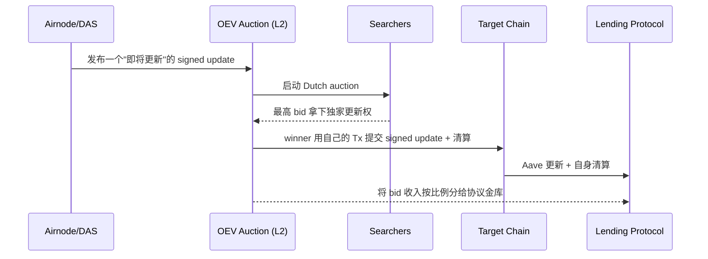

# API3（第一方预言机与 OEV）

> **TL;DR**：API3 由 Heikki Vänttinen、Burak Benligiray 与 Saša Milić 2020 年从 ChainAPI 团队孵化，提出 **"把中间层去掉"** 的预言机设计：让 **API 提供方自己经营 Oracle 节点**（第一方预言机），而不是由第三方节点爬 API 后再发布。核心组件是 **Airnode**——一个 serverless 化的 Oracle 中间件，让任何 Web2 API 拥有者只需配置即可把自己的数据上链。由多个 Airnode 组成的聚合数据源称为 **dAPI（Decentralized API）**，由 API3 DAO 治理、可被任何合约读取。2023 年 API3 推出 **OEV Network**：一条 L2 拍卖链，**把清算等 "Oracle Extractable Value" 以 Dutch auction 的形式卖给 searcher，收入回流给借贷协议**，是目前最具代表性的 OEV 捕获方案。API3 与 Chainlink 的根本差异：Chainlink 用多节点冗余解决单点信任；API3 用"API 方自己是节点"解决"数据源 ↔ 节点不透明"。

---

## 1. 背景与动机

Chainlink 模型中，真正掌握数据的是 API 提供方（如 CoinGecko、Kaiko、Polygon IO），但上链的是**第三方节点**：他们拉 API → 签名 → 发布。这产生两个问题：

1. **夹层导致的信任冗余**：API 提供方本已运行 HTTPS 服务，第三方节点不过是把数据"搬一次"，不创造新真相，却索取 LINK 费用。
2. **责任模糊**：如果数据错了，是 API 错还是节点错？Chainlink 节点会声明自己"诚实地转发了",卸责给 API；而 API 提供方不是预言机参与者，不会承担链上后果。

API3 的主张："让拥有数据的人自己签名发数据"。于是 API 提供方运行 **Airnode**（serverless，部署在 AWS Lambda / GCP Cloud Function / 自托管），自己的私钥直接签 response，实现 **first-party oracle**。再由多个 first-party 节点聚合成 dAPI 即得到去中心化。这简化了信任链、降低了运营成本、让商业关系直接落在 API 提供方与 DApp 之间。

## 2. 核心原理

### 2.1 形式化模型

一个 dAPI d 由集合 `A = {Airnode_1, …, Airnode_n}` 组成。每个 Airnode 签名其 response `r_i = σ_i(data, timestamp)`。链上 DapiServer 合约：

- 维护每个 dAPI 的 `(value, timestamp)`；
- 使用 **beacon**（单节点数据流）作为原子；
- 聚合 `value = median(beacons[].value)`，`timestamp = median(beacons[].timestamp)`；
- 在偏离阈值或心跳触发时更新。

形式化：`update d ⟺ |median(r_i) − value_on_chain| / value_on_chain > θ ∨ now - timestamp_on_chain > H`。

### 2.2 Airnode：serverless 第一方节点

Airnode 是一个 **无状态 HTTP handler**，部署在 Lambda 级别的 FaaS：

- 配置 `config.json` 指向 API endpoint、path、参数映射；
- 私钥由 KMS / Secrets Manager 管理；
- 收到请求时，Airnode 调 API → 规范化 → EIP-712 签名 → 返回 / 上链。

两种调用模式：
- **Request-Response (RRP)**：合约显式发起请求，等待回调（较传统）。
- **Publish-Subscribe (PSP)**：Airnode 自己 push 数据上链（Beacon）；dAPI 由 Beacon 聚合。

无状态设计让运维门槛极低——API 提供方只需上传配置，无需维护以太坊 RPC、mempool、nonce。

### 2.3 dAPI：聚合与治理

- dAPI = 一组 Beacon → median 聚合；
- dAPI 分 **Managed**（由 API3 DAO 代付 gas，用户付年费）与 **Self-funded**（用户充值小额池，由 keeper 推动更新）。
- 切换 Beacon 组合、加减 Airnode 由 DAO 投票控制，或由 "Sponsor" 合约按规则自动替换失效源。
- 数据类型不限于价格：天气、宏观经济、体育比分、RNG（QRNG，基于 ANU 量子随机数）。

### 2.4 OEV Network：清算 MEV 回流

**OEV（Oracle Extractable Value）**：预言机更新后 **立刻可收割** 的利润（主要是 DeFi 清算、衍生品爆仓、TWAP 超过阈值触发）。传统模型：

1. Chainlink update 写入 Aave 价格；
2. Mempool 中大量 searcher 争夺该更新后的清算机会；
3. 最终搜索者通过 Flashbots 等 mev relay 取得机会，**利润全归 searcher 与区块生产者**。

API3 观察：数据更新的权柄在预言机。既然预言机掌握更新时机，**预言机应把这个时间权 + 内容权卖给最终价值捕获方**，让 **借贷协议（资金池）自己拿走一部分 OEV**。流程：



经济效果：清算机会"在链下"被卖给 searcher → bid 收入回流协议（官方称 **OEV Share**）。Aave 2024 开始与 API3 集成试点。

### 2.5 参数与常量

| 参数 | 值 | 说明 |
| --- | --- | --- |
| 默认偏离阈值 | 0.25% – 1% | 取决于 feed |
| 心跳 | 24 h（主流） | 可治理 |
| Airnode 签名格式 | EIP-712 | 标准化 |
| OEV auction 持续 | ~几秒 | Dutch 衰减 |
| dAPI 最小 Beacon 数 | 通常 ≥ 7 | 聚合抗单点 |
| Managed dAPI 年费 | 数百–数千 USDC / feed | Dashboard 定价 |
| QRNG 信号源 | ANU (澳国立量子 RNG) | 随机熵 |

### 2.6 边界与失败模式

- 单 Airnode 宕机 → beacon stale，dAPI 仍可聚合。
- API 提供方合谋 → 治理可移除。
- OEV 拍卖无人出价 → 回退到普通更新路径。
- 用户自充池（Self-funded）余额耗尽 → keeper 停更；合约须读 stale 保护。

## 3. 架构剖析

### 3.1 分层视图

1. **API Provider 层**：API 所有者（如 Kaiko、Finage、Twelve Data、IEX）。
2. **Airnode 层**：serverless Oracle runtime（[api3dao/airnode](https://github.com/api3dao/airnode)）。
3. **On-chain Beacon / Dapi 层**：`DapiServer`、`Api3ServerV1`（Solidity）。
4. **DAO & Treasury 层**：API3 DAO 管理 dAPI 注册、Airnode 白名单、参数治理。
5. **OEV Network 层**：基于 ArbitrumOrbit / OP Stack 的 appchain，运行拍卖合约。
6. **SDK 层**：`@api3/contracts`、`@api3/airnode-protocol-v1`。

### 3.2 核心模块表

| 模块 | 路径/仓库 | 职责 | 可替换性 |
| --- | --- | --- | --- |
| airnode-node | `api3dao/airnode/packages/airnode-node` | serverless Oracle runtime | 核心 |
| airnode-protocol-v1 | `api3dao/airnode-protocol-v1` | 合约层 | 核心 |
| Api3ServerV1.sol | protocol-v1/contracts | Beacon 存储 & 聚合 | 否 |
| dapi-proxy | protocol-v1 | 兼容 AggregatorV3Interface | 是 |
| OEV Auction House | oev.network 合约 | Dutch 拍卖 | 是（算法可改） |
| QRNG Airnode | [api3dao/qrng](https://github.com/api3dao/qrng) | 量子随机数 | 是 |
| DAO contracts | api3dao/api3-dao | 治理 | 否 |

### 3.3 数据流：self-funded dAPI 更新

1. 用户为某 dAPI 充值 ETH 到 `DataFeedUpdater`；
2. Keeper（官方/任意人）定时 eth_call 模拟 dAPI 聚合值；
3. 若偏离 > θ：keeper 构造调用 `updateBeaconSetWithBeacons([signedData_i])` 上链；
4. 合约验证每个 Airnode 签名、取 median、写 `_dataFeeds[dataFeedId]`；
5. 消费合约通过 `DapiProxy.read()` 读取。

### 3.4 实现多样性

- Airnode 官方为 TS/Node 实现，serverless 部署支持 AWS Lambda / GCP / Azure / self-hosted。
- 合约层 Solidity 唯一实现，但核心逻辑简单，第三方审计通过。
- OEV Network 基于 Arbitrum Orbit stack。

### 3.5 接口

- `IProxy.read() → (int224 value, uint32 timestamp)`（API3 风格）。
- 同时提供 `AggregatorV3Interface` 适配器，无缝替换 Chainlink 消费者。
- OEV 接入：合约调 `oevFeed.read()`，当 auction 被触发时 update 由 winner 附带。

## 4. 关键代码 / 实现细节

Api3ServerV1 的 Beacon 集更新（`api3dao/airnode-protocol-v1`，简化）：

```solidity
function updateBeaconSetWithBeacons(bytes32[] memory beaconIds)
    external returns (bytes32 beaconSetId)
{
    uint256 n = beaconIds.length;
    int256[] memory values = new int256[](n);
    uint256[] memory timestamps = new uint256[](n);
    for (uint256 i = 0; i < n; ++i) {
        DataFeed storage f = _dataFeeds[beaconIds[i]];
        values[i] = f.value;
        timestamps[i] = f.timestamp;
    }
    int224 aggregatedValue = int224(_median(values));
    uint32 aggregatedTs    = uint32(_median(timestamps));
    beaconSetId = deriveBeaconSetId(beaconIds);
    _dataFeeds[beaconSetId] = DataFeed({value: aggregatedValue, timestamp: aggregatedTs});
    emit UpdatedBeaconSetWithBeacons(beaconSetId, aggregatedValue, aggregatedTs);
}

function updateBeaconWithSignedData(
    address airnode, bytes32 templateId, uint256 timestamp,
    bytes calldata data, bytes calldata signature
) external returns (bytes32 beaconId) {
    require(timestamp > lastTimestamp[airnode][templateId], "non-monotonic");
    bytes32 digest = keccak256(abi.encodePacked(templateId, timestamp, data));
    require(airnode == ECDSA.recover(digest, signature), "bad sig");
    int256 v = abi.decode(data, (int256));
    beaconId = deriveBeaconId(airnode, templateId);
    _dataFeeds[beaconId] = DataFeed({value: int224(v), timestamp: uint32(timestamp)});
    lastTimestamp[airnode][templateId] = timestamp;
}
```

消费合约的 Chainlink 兼容代理：

```solidity
interface IProxy { function read() external view returns (int224 value, uint32 timestamp); }

contract ChainlinkCompatAdapter is AggregatorV3Interface {
    IProxy public immutable proxy;
    function latestRoundData() external view returns (uint80, int256, uint256, uint256, uint80) {
        (int224 v, uint32 t) = proxy.read();
        return (0, int256(v), t, t, 0);
    }
    function decimals() external pure returns (uint8) { return 18; }
}
```

## 5. 演进与版本对比

| 版本 | 时间 | 关键变化 |
| --- | --- | --- |
| ChainAPI（前身） | 2018–2019 | Airnode 原型 |
| API3 白皮书 | 2020-04 | 第一方预言机概念 |
| Airnode v0 | 2021 | RRP 模式 |
| Airnode v0.x & dAPI v1 | 2022 | PSP + Beacon |
| Api3ServerV1 | 2023 | 抽象 Beacon + BeaconSet |
| OEV Network Devnet | 2023-11 | 拍卖雏形 |
| Managed dAPI 2.0 | 2024 | 订阅化定价 |
| OEV Network Mainnet | 2024 | Aave / 其他借贷集成 |
| QRNG v2 | 2024 | 兼容 Chainlink VRF 接口 |

## 6. 实战示例

**读取 ETH/USD dAPI**：

```solidity
import {IProxy} from "@api3/contracts/v0.8/interfaces/IProxy.sol";

contract UsePriceFeed {
    address public immutable proxy;
    constructor(address p) { proxy = p; }
    function getPrice() external view returns (int224 value, uint256 ts) {
        (int224 v, uint32 t) = IProxy(proxy).read();
        require(t + 1 days > block.timestamp, "stale");
        return (v, t);
    }
}
```

**部署 Airnode（CLI）**：

```bash
npm install -g @api3/airnode-deployer
airnode-deployer deploy --configuration config.json --secrets secrets.env
```

## 7. 安全与已知攻击

- **2022 Airnode 部分权限配置失误**：某用户把 `airnodeXpub` 错写导致 beacon 无法验证；已在文档加校验工具。
- **OEV Network 初期集中度**：目前拍卖合约治理由小多签掌控，API3 承诺逐步去中心化。
- **API 源共谋**：若 Managed dAPI 多家 API 提供方受同一数据供应商（如都用 CryptoCompare backend）影响，存在"伪多样性"。DAO 需审核数据独立性。
- **QRNG 信道风险**：ANU 量子服务不可用时，回退签名被质疑是否仍"真量子"；有改进提案引入多量子源。

## 8. 与同类方案对比

| 维度 | API3 | Chainlink | Pyth |
| --- | --- | --- | --- |
| 数据源 | API 提供方自营节点 | 第三方节点爬 API | 做市商 / CEX 直接签 |
| 聚合 | Beacon median | OCR 2.0 | Pythnet weighted median |
| 更新模式 | Push（Managed/Self-funded） | Push DON | Pull 为主 |
| OEV 策略 | OEV Auction → 协议回流 | SVR（2024）Flashbots | Express Relay |
| 多链 | 40+ | 100+ | 80+ |
| 典型客户 | dTrade、Angle、借贷新协议 | Aave、Compound、Maker | Synthetix v3、Drift |
| QRNG / VRF | QRNG（量子） | VRF（EC-VRF） | Entropy（commit-reveal） |

## 9. 延伸阅读

- **白皮书**：API3《[Airnode Whitepaper](https://github.com/api3dao/api3-whitepaper)》（2020）。
- **文档**：[docs.api3.org](https://docs.api3.org/)；OEV Network docs。
- **研究**：API3 DAO Forum "OEV: Theory and Market Design"。
- **博客**：Burak Benligiray on "First-party oracles"（API3 Medium）。
- **视频**：ETHCC Paris 2024 API3 OEV keynote。
- **中文**：登链社区《API3 与 OEV》。

## 10. 术语表

| 术语 | 英文 | 释义 |
| --- | --- | --- |
| 第一方预言机 | First-party oracle | API 方自营的节点 |
| Airnode | Airnode | 无状态 serverless Oracle 中间件 |
| Beacon | Beacon | 单个 Airnode 产生的数据流 |
| dAPI | Decentralized API | 多个 Beacon 聚合的 feed |
| RRP | Request-Response Protocol | 请求响应模式 |
| PSP | Publish-Subscribe Protocol | 订阅模式 |
| OEV | Oracle Extractable Value | 预言机触发 MEV |
| OEV Network | OEV Network | API3 的拍卖 L2 |
| QRNG | Quantum RNG | 量子随机数 |
| Managed dAPI | Managed dAPI | DAO 托管的 feed |
| Self-funded | Self-funded dAPI | 用户自充值 feed |
| Dutch auction | Dutch Auction | 降价拍卖 |

---

*Last verified: 2026-04-22*
