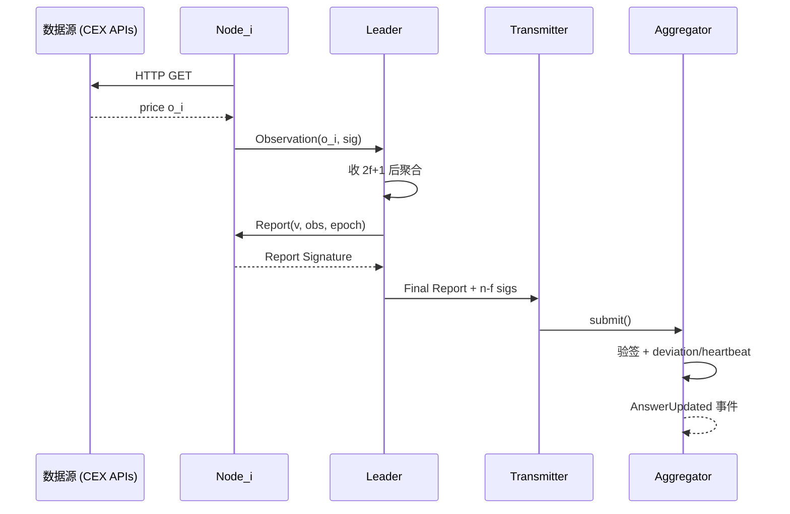

# Chainlink（去中心化预言机网络）

> **TL;DR**：Chainlink 是由 Sergey Nazarov 与 Steve Ellis 2017 年推出的 **去中心化预言机网络（DON）**，已成为预言机事实标准。其核心能力由五块积木组成：**Data Feed（资产价格/储备证明/利率）**、**VRF（可验证随机数）**、**Automation（链上 Cron/Keeper）**、**Functions（可编程链下计算）**、以及 **CCIP（跨链互操作协议）**。底层技术支柱是 **OCR 2.0（Off-Chain Reporting）**——让 DON 节点在链下通过 P2P 网络共识产出一份聚合签名报告，再由一个 Transmitter 一次性上链，把聚合 n 笔预言机查询的 Gas 成本降到 1 笔。2023-12 启动的 **Staking v0.2** 在 Arbitrum 上锁定 4500 万 LINK、让节点运营方承担 slashing 责任，完成了从"声誉信任"到"经济信任"的升级。截至 2026-04，Chainlink 已覆盖 100+ 条链、累计促成 >$20T 的 on-chain transaction value，是 Aave、Compound、Maker、Synthetix 等头部 DeFi 协议的默认报价来源。

---

## 1. 背景与动机

2017 年以前，主流预言机是 Oraclize 式的 **单节点 + TLSNotary** 证明——虽然解决了"数据是否来自声称的 URL"，但无法解决 **"节点是否诚实"**。Chainlink 白皮书提出：把同一个查询分发给一组独立节点，由合约聚合多份回答（中位数 / 均值）。核心论点有三：

1. **数据源多样化**（data source decentralization）：不把蛋放一个 API；
2. **节点多样化**（node decentralization）：不把蛋放一个运营方；
3. **经济激励 + 声誉**：用 LINK 支付 + 质押 + 声誉评分，使作恶不理性。

2020 年 DeFi Summer 后，借贷、DEX、衍生品协议对价格的依赖呈指数级，Chainlink 的 AggregatorV3Interface 迅速成为"链上报价的事实 API"。2022 年 The Merge、2023 年 L2 大爆发带来跨链需求，Chainlink 以 CCIP 把预言机模型扩展到 messaging，并在 2024 年推出 **Data Streams（低延迟拉模式）** 正面迎战 Pyth。Chainlink Labs 本身商业化程度高，团队逾 700 人，其客户既有加密原生（Aave）也有传统金融（SWIFT PoC、DTCC）。

## 2. 核心原理

### 2.1 形式化定义与安全模型

设 DON 由 n 个节点组成，容忍上限 f = ⌊(n-1)/3⌋ 个拜占庭节点。节点 `i` 对查询 `q` 的本地观测为 `o_i`。目标是输出 `v` 满足 `|v − med{o_i}| ≤ ε`，并附带至少 `n-f` 份签名的可验证报告。**OCR 2.0** 的核心定理：在同步/部分同步网络、不超过 f 拜占庭下，Leader-based 聚合协议能以 O(n) 通信复杂度（而非朴素多签的 O(n²)）生成一份可验证聚合报告。

### 2.2 Off-Chain Reporting (OCR) 2.0

OCR 把"每节点各自 submit → 链上聚合"的旧模型改为"链下共识 → 单笔 submit"，Gas 效率提升 >90%：

1. **Query**：Leader 广播 epoch & query（如"取 ETH/USD"）。
2. **Observation**：每节点拉取自有数据源，得到 `o_i`，对 `o_i‖epoch‖round` 签名返回给 Leader。
3. **Report**：Leader 收到至少 `2f+1` 条观测后，计算聚合值（默认 median），构造 `Report = (v, obs_set, epoch)` 并要求所有节点签名。
4. **Transmit**：任一指定 Transmitter（轮换）把 Report 提交到链上 Aggregator；合约验签 ≥ `f+1` 签名、核对偏离/心跳后写入。



### 2.3 Data Feed：聚合器架构

Data Feed 是 Chainlink 最高 TVL 的产品。链上 Aggregator 合约保存历史 round：

- `latestRoundData() → (roundId, answer, startedAt, updatedAt, answeredInRound)`；
- `AccessController` 控制谁可读（部分链上限企业客户）；
- 通过 `EACAggregatorProxy`（Entry Access Controlled）让消费合约地址稳定、底层 Aggregator 可升级。

每个 Feed 都有 **参数集**：节点数、触发偏离 θ、心跳 H、聚合方法（median/mean/weighted-median）、最小/最大答案裁剪。以 mainnet ETH/USD 为例：31 节点、θ = 0.5%、H = 3600 s。

### 2.4 VRF（可验证随机数）

合约需要"事前承诺 + 事后可验证" 的随机。Chainlink VRF 使用 **Goldberg-Micali 式椭圆曲线 VRF**：

- 请求方支付 LINK 调用 `requestRandomWords(keyHash, subId, ...)`，发出 `RandomWordsRequested`。
- 预言机节点读取请求，以自己的私钥 `sk` 对 `(seed, blockhash)` 计算 VRF 输出 `(π, y)`，其中 `y = H(sk · H(m))`。
- 回到链上 VRFCoordinator 验签 `VRF.Verify(pk, m, π) == y`，然后回调消费合约 `fulfillRandomWords(requestId, [y])`。
- **V2.5** 支持原生 ETH 支付与 subscription / direct funding 两种模式。

设计要点：
- 合约以 `keyHash` 锁定唯一 oracle，避免 oracle 偷偷挑选最利己的 randomness（Chainlink 的 "post-commitment 不可选择" 性质）。
- `minRequestConfirmations`（默认 3）用于避免 re-org 风险。

### 2.5 Automation（Keeper）

链上合约不能自触发（如定期清算、限价单）。Automation = **条件监视 + 自动执行 Keeper 网络**：

- 合约实现 `checkUpkeep(bytes) returns (bool, bytes)`；
- Keeper 周期性链下 eth_call `checkUpkeep`；为 true 时链上调用 `performUpkeep(bytes)`。
- Automation 2.0 引入 **Log-triggered / Conditional / Time-based / Custom Logic** 四种触发。

Gas 由 Upkeep subscription 的 LINK 池自动按链上 gasPrice 换算扣除。

### 2.6 CCIP（跨链互操作协议）

CCIP 的安全由 **三份相互独立的 DON + Risk Management Network** 提供：

- **Committing DON**：在 source chain 观测 `CCIPSend` 事件 → 打包 Merkle root → 签名 → 提交到 destination。
- **Executing DON**：把具体消息 + proof 提交到 destination 执行。
- **Risk Management Network (ARM)**：独立代码库、独立签名、有否决（Veto）权；检测到异常可暂停。
- 支持 `programmable token transfer`（消息 + 代币一包发）与 rate limit。

### 2.7 参数与常量

| 参数 | 值 | 可治理 |
| --- | --- | --- |
| OCR epoch 长度 | 通常 1–3 s | 否 |
| 节点最小数 | 11–31（因 feed 而异） | 否（需升级 Aggregator） |
| VRF minRequestConfirmations | 3 | 用户可调 |
| Automation gasCeiling | 5e6 | 订阅可调 |
| Staking v0.2 pool cap | 45M LINK | 治理 |
| Slashing 比例（v0.2） | 上限 0.2% / 事件 | 治理 |

### 2.8 边界条件与失败模式

- **少于 f+1 节点在线**：OCR 无法出 report → 长时间停写，消费合约应 stale 保护。
- **L2 序列器宕机**：Aggregator 不被触发 → 使用 L2 Sequencer Uptime Feed 暂停消费。
- **VRF 节点丢失请求**：回调永不到达 → 消费合约设超时回退。
- **CCIP 恶意消息**：ARM 可 Veto，强制暂停。

## 3. 架构剖析

### 3.1 分层视图

Chainlink 可视为 5 层：

1. **Data / Source Layer**：CEX REST / WebSocket、DEX、Web API、企业 API。
2. **Node Layer**：[smartcontractkit/chainlink](https://github.com/smartcontractkit/chainlink)（Go）。关键子系统：Job Runner、OCR2、Keystore、Head Tracker、Transmitter、Mercury。
3. **DON Coordination Layer**：节点间 libp2p + noise handshake + Berkeley-DB 状态；通过 OCR2 Config transactions 更新成员。
4. **On-chain Contract Layer**：Aggregator / VRFCoordinator / AutomationRegistry / CCIP Router。
5. **Client / SDK Layer**：`@chainlink/contracts`（Solidity）、`chainlink-ccip`（Go）、`hardhat-chainlink`。

### 3.2 核心模块表

| 模块 | 路径（`smartcontractkit/chainlink`） | 职责 | 可替换性 |
| --- | --- | --- | --- |
| Head Tracker | `core/chains/evm/headtracker` | 跟踪链头，处理 reorg | 链无关抽象，可插 Solana/StarkNet |
| Log Broadcaster | `core/chains/evm/log` | 订阅 logs 派发给 Job | 否 |
| OCR2 Plugin | `core/services/ocr2` | OCR 协议栈 | 否 |
| Mercury | `core/services/ocr2/plugins/mercury` | Data Streams 低延迟报价 | 独立 plugin |
| Keystore | `core/services/keystore` | 多链私钥、VRF key | 可外接 HSM |
| VRF v2/v2.5 | `core/services/vrf` | VRF 节点逻辑 | 是（新算法插件） |
| Automation Registry | `core/services/ocr2/plugins/ocr2keeper` | Keeper 协议 | 是 |
| CCIP | `smartcontractkit/ccip` | 跨链 DON | 独立仓库 |

### 3.3 数据流生命周期（Aave 清算触发）

1. ETH 价格下跌 → Aave 某仓位 HF < 1。
2. OCR round (t0)：31 节点拉取 CEX spot，观测到偏离 > 0.5%，Leader 发起 round。
3. (t0 + 2 s)：报告被 Transmitter 提交到 ETH/USD Aggregator，新 roundId + answer 写入。
4. (t0 + 3 s)：链上 `AnswerUpdated` 事件 → MEV searchers + Chainlink Automation 同时看到。
5. Searcher 构造 `liquidationCall()` 抢先交易；或 Aave 使用 SVR（Smart Value Recapture）把 OEV 通过 Flashbots auction 回流。
6. Aave 合约 `getAssetPrice(WETH)` 读 Aggregator，判定可清算 → 清算成功。

### 3.4 客户端多样性

官方节点 Go 版是事实唯一实现（生产用），但合约端、SDK 多元化：`@chainlink/contracts` 覆盖 EVM；Aptos / Sui / Starknet 有各自 adapter。没有替代 Node 实现会被视为中心化风险，Chainlink Labs 承诺会逐步规范化以支持第三方 Node 实现。

### 3.5 接口

- `AggregatorV3Interface`（Solidity）—— 事实标准。
- `VRFConsumerBaseV2Plus`。
- `AutomationCompatibleInterface`。
- `IRouterClient`（CCIP）—— `ccipSend(destinationChainSelector, message)`。
- Functions: `FunctionsClient.sendRequest(source, args, subId, gasLimit)`。

## 4. 关键代码 / 实现细节

OCR2 Aggregator 核心 `transmit`（摘自 `@chainlink/contracts` v1.x，简化）：

```solidity
// chainlink/contracts/src/v0.8/shared/ocr2/OCR2Base.sol （摘要，commit 参考 contracts-v1.2.0）
function transmit(
    bytes32[3] calldata reportContext,
    bytes calldata report,
    bytes32[] calldata rs,
    bytes32[] calldata ss,
    bytes32 rawVs
) external {
    // 1. 校验配置 digest 与 epoch 单调
    require(reportContext[0] == s_latestConfigDigest, "digest mismatch");
    // 2. 重构哈希 m = keccak256(report || reportContext)
    bytes32 h = keccak256(abi.encodePacked(keccak256(report), reportContext));
    // 3. 逐个 ecrecover 签名，统计签名人去重
    address[maxNumOracles] memory signed;
    uint256 signedCount;
    for (uint i = 0; i < rs.length; i++) {
        address signer = ecrecover(h, uint8(rawVs[i]) + 27, rs[i], ss[i]);
        // 去重 + 校验签名人属于 oracle 集合
        ...
        signedCount++;
    }
    require(signedCount > s_f, "threshold not met");
    // 4. 解析 report -> (observations, median)，写入 aggregator state
    _report(report);
}
```

VRF V2 Coordinator verify 片段（`VRFCoordinatorV2_5.sol`）：

```solidity
function fulfillRandomWords(Proof memory proof, RequestCommitment memory rc) external {
    bytes32 keyHash = hashOfKey(proof.pk);
    uint256 requestId = uint256(keccak256(abi.encode(keyHash, proof.seed)));
    // 重算 seed = keccak256(keyHash, blockhash, subId, nonce)
    uint256 actualSeed = uint256(keccak256(abi.encodePacked(proof.seed, rc.blockHash)));
    // 调用库验证 VRF proof (y, π) 对 (pk, actualSeed)
    uint256 randomness = VRF.randomValueFromVRFProof(proof, actualSeed);
    // 回调消费者
    VRFConsumerBaseV2Plus(rc.sender).rawFulfillRandomWords(requestId, _expand(randomness, rc.numWords));
}
```

## 5. 演进与版本对比

| 版本 | 发布 | 关键变化 | 影响 |
| --- | --- | --- | --- |
| v1（OCR 1.0） | 2019 | 链下聚合概念 | 解决多签 Gas 爆炸 |
| VRF v1 → v2 | 2021 | 订阅模式、批量 fulfill | 成本降低 60% |
| OCR 2.0 | 2022 | 多链通用、多 plugin | 统一框架 |
| CCIP GA | 2023-07 | 跨链消息 | 迈入 interop |
| Staking v0.1 / v0.2 | 2022 / 2023-12 | 节点质押 & slashing | 经济安全升级 |
| Data Streams | 2024 | 低延迟 Pull 模式 | 对标 Pyth |
| Functions GA | 2024 | 链下可编程计算 | Web2-Web3 融合 |
| VRF v2.5 | 2024 | 原生 ETH 支付 | 体验优化 |
| SVR | 2024 | OEV 回流协议 | MEV 重分配 |

## 6. 实战示例：使用 VRF 抽奖

```solidity
import {VRFConsumerBaseV2Plus} from "@chainlink/contracts/src/v0.8/vrf/dev/VRFConsumerBaseV2Plus.sol";
import {VRFV2PlusClient} from "@chainlink/contracts/src/v0.8/vrf/dev/libraries/VRFV2PlusClient.sol";

contract Lottery is VRFConsumerBaseV2Plus {
    uint256 public s_subId;
    bytes32 public immutable s_keyHash;
    address public winner;
    address[] public players;

    constructor(address coordinator, uint256 subId, bytes32 keyHash)
        VRFConsumerBaseV2Plus(coordinator)
    {
        s_subId = subId;
        s_keyHash = keyHash;
    }

    function draw() external onlyOwner {
        VRFV2PlusClient.RandomWordsRequest memory req = VRFV2PlusClient.RandomWordsRequest({
            keyHash: s_keyHash, subId: s_subId, requestConfirmations: 3,
            callbackGasLimit: 300_000, numWords: 1,
            extraArgs: VRFV2PlusClient._argsToBytes(
                VRFV2PlusClient.ExtraArgsV1({nativePayment: false})
            )
        });
        s_vrfCoordinator.requestRandomWords(req);
    }

    function fulfillRandomWords(uint256, uint256[] calldata words) internal override {
        winner = players[words[0] % players.length];
    }
}
```

## 7. 安全与已知攻击

- **2020 bZx 复盘**：不属 Chainlink 被攻击，但引发行业用 Chainlink 替换 DEX spot，是 Chainlink TVL 起飞的关键事件。
- **2022 Venus / Mango**：Venus 因 LUNA 崩盘时 Chainlink LUNA 报价过慢导致清算激增，暴露心跳设置过松；业界开始加熔断器。
- **Chainlink 节点运营方多次 RPC 故障**：节点依赖 Infura / Alchemy 时曾小规模 stale；改造为多 RPC 回退。
- **CCIP 安全**：ARM 代码采用 Rust 独立实现，与主 DON 代码库隔离，降低单点 bug 风险。

Chainlink 整体至今未发生因 DON 被攻破导致的 Feed 失效重大事件，主要风险点集中在"消费合约误用"。

## 8. 与同类方案对比

| 维度 | Chainlink | Pyth | API3 | UMA |
| --- | --- | --- | --- | --- |
| 核心模式 | Push OCR DON | Pull first-party | Push first-party | Optimistic |
| 节点数 / Feed | 11–31 | 90+ Publishers | 数十 API | 任意断言者 |
| 成本承担 | 协议付 LINK | 用户付 Gas | 协议付 API3 | 断言人押债券 |
| 延迟 | 秒 ~ 分钟 | 亚秒 | 秒 ~ 分钟 | 小时 |
| 产品广度 | Feed+VRF+Auto+CCIP+Fn | Feed+Entropy+Express Relay | dAPI+OEV+QRNG | OO+DVM |
| 多链 | 100+ | 80+ | 40+ | 15+ |
| 最优场景 | 主流借贷/稳定币 | 衍生品 / 高频 | 长尾 API | 主观事件 / 保险 |

## 9. 延伸阅读

- **白皮书**：《[Chainlink Whitepaper v1](https://link.smartcontract.com/whitepaper)》（2017）；《[Chainlink 2.0: Next Steps](https://research.chain.link/whitepaper-v2.pdf)》（2021）。
- **VRF 论文**：Goldberg et al. *Verifiable Random Functions*；Papadopoulos 等 *Making NSEC5 Practical for DNSSEC*（VRF-VRFProof 格式）。
- **博客**：blog.chain.link；Paradigm "A Guide to Decentralized Oracle Systems"。
- **代码**：[smartcontractkit/chainlink](https://github.com/smartcontractkit/chainlink)；[smartcontractkit/ccip](https://github.com/smartcontractkit/ccip)。
- **视频**：SmartCon 历届 keynote；Patrick Collins YouTube Chainlink 教程。
- **中文**：登链社区 Chainlink 专栏；Chainlink 中国官方公众号。

## 10. 术语表

| 术语 | 英文 | 释义 |
| --- | --- | --- |
| OCR | Off-Chain Reporting | 链下聚合协议 |
| DON | Decentralized Oracle Network | 去中心化预言机网络 |
| Aggregator | Aggregator Contract | 链上聚合合约 |
| VRF | Verifiable Random Function | 可验证随机函数 |
| Automation | Automation / Keeper | 自动触发网络 |
| CCIP | Cross-Chain Interoperability Protocol | 跨链互操作协议 |
| ARM | Active Risk Management | CCIP 风险网络 |
| SVR | Smart Value Recapture | OEV 回流机制 |
| Data Streams | Data Streams | 低延迟 pull 报价 |
| Functions | Chainlink Functions | 链下可编程计算 |
| Mercury | Mercury | Data Streams 节点插件 |
| Slashing | Slashing | 节点恶意时削减质押 |

---

*Last verified: 2026-04-22*
