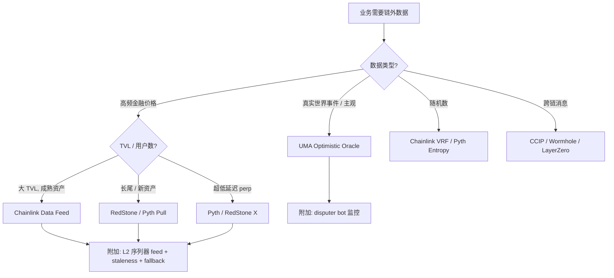
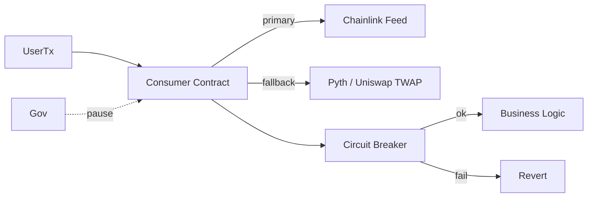

# 预言机设计原理（Oracle Design Principles）

> **TL;DR**：本文抽取主流预言机（Chainlink / Pyth / API3 / UMA / RedStone / Uniswap TWAP）的共性设计原语，回答一个工程问题：**"给定我的业务，我到底需要什么样的预言机？"**。核心五维度：**交付模型（Push / Pull / Optimistic / DEX TWAP）**、**聚合算法（median / weighted median / TWAP / EMA / MAD）**、**新鲜度控制（deviation threshold + heartbeat + staleness）**、**信任模型（DON / first-party / schelling / 单源）**、**OEV 捕获策略**。此外给出 **选型决策树**、**参数调优经验值**、**反模式清单**、**合约侧防御要求**。设计结论：不存在"最好的预言机"，只有"业务匹配的预言机"；多源 fallback + 严格合约侧校验比追求完美单源更重要。

---

## 1. 背景与动机

每次 DeFi 协议被闪电贷攻破，事后复盘都会指向"预言机没选好"或者"合约侧没防御"。但开发者往往只问"接 Chainlink 还是 Pyth"——而真正决定安全的是一串连贯决策：来源独立性、聚合算法、更新策略、回退机制、L2 sequencer 检查、staleness guard、TWAP 窗口等。本文从第一性原理出发，把这些决策结构化。

## 2. 核心原理

### 2.1 交付模型（Delivery Model）

| 模型 | 触发 | 常态 Gas | 延迟 | 典型业务 |
| --- | --- | --- | --- | --- |
| **Push** | 预言机周期性写入 | 预言机付 | 最慢一次更新 | 借贷（Aave）、稳定币（Maker） |
| **Pull** | 用户 Tx 携带签名 | 使用者付 | 本 block | 衍生品、LRT |
| **Optimistic** | 断言 + 异议期 | 无人挑战时近零 | ≥ 小时 | 预测市场、保险、结果市场 |
| **DEX Spot** | 每 Tx 实时计算 | 极低 | 同块（可被操纵） | 只能做参考，不可做基准 |
| **DEX TWAP** | 事后读取 cumulative | 低 | 窗口（如 30 min） | 抗操纵的从属价 |

**决策原则**：
- 高 TVL 稳定资产：Push（Chainlink）+ 二级 Pull fallback。
- 高频衍生品：Pull（Pyth / RedStone X）。
- 主观/事件类：Optimistic（UMA）。
- 新/长尾资产无成熟 feed：Push + TWAP + deviation 熔断。

### 2.2 聚合算法

对 n 个观测 `x_1, ..., x_n`：

1. **Median**（中位数）：对异常值最鲁棒；需控制 ⌈(n+1)/2⌉ 节点才能扭曲输出。公式：`m = sort(x)[⌈n/2⌉]`。
2. **Weighted median**：按权重 `w_i` 排序后取累积权重过半的那个 x。Pyth 对 Publisher 声誉/质押加权。
3. **Trimmed mean**：剔除 `k` 个极端值后取均值：`(1/(n-2k)) * Σ x_(k+1..n-k)`。
4. **EMA（指数移动平均）**：`EMA_t = α·x_t + (1-α)·EMA_{t-1}`，平滑短时尖刺。
5. **TWAP**：`TWAP_[t0,t1] = (∫ p dt) / (t1-t0)`；Uniswap V2 `cumulative_price`、V3 `tick cumulatives` 均提供 O(1) 查询。
6. **VWAP**：按成交量加权，贴近真实可成交价；Chainlink Feed 背后的 adapter 常引入 VWAP。
7. **MAD / IQR 过滤**：在聚合前剔除偏离 1.5·IQR 的样本。

设计取舍：median 简单但信息利用不足；weighted median 利用质押/容量信息；TWAP 抗操纵但滞后。

### 2.3 新鲜度：Deviation + Heartbeat + Staleness

- **Deviation threshold θ**：价格变动 > θ 触发 push。θ 越小越准确但 Gas 越贵。BTC/ETH 常 θ = 0.2–0.5%；稳定币 0.1%；长尾 1–2%。
- **Heartbeat H**：无偏离也必须更新的最大间隔。H = 1 h（主流）、24 h（长尾）。
- **Staleness guard（合约侧）**：`require(block.timestamp - updatedAt < H + margin)`，`margin ≈ 2–5 分钟`。
- **round sanity check**：`require(answeredInRound >= roundId)` 防止"旧答案被回填到新 round"。

**推论**：Staleness guard 必须**严格大于** Heartbeat + L2 sequencer allowance；否则正常周期末端就会 revert 用户交易。

### 2.4 信任模型

| 模型 | 作恶假设 | 成本 | 代表 |
| --- | --- | --- | --- |
| 单源 | 单实体诚实 | 无，声誉驱动 | 单一 API 签名 |
| DON（多节点） | 多节点 Byz < 1/3 | 节点 OCR 成本 | Chainlink |
| First-party | 多 API 方竞合，共谋难 | 商誉成本 | Pyth / API3 |
| Optimistic | 任一监视者在线诚实 | disputer bot | UMA |
| Schelling-point | 多数投票者诚实 + 经济 | 质押代币 | UMA DVM、Augur |

关键安全量：**Cost of corruption (CoC) > Profit from corruption (PfC)**。CoC 与质押量、节点数量、声誉损失、法律风险正相关。工程上应要求 `CoC / PfC > 10` 的保守系数。

### 2.5 OEV（Oracle Extractable Value）

**定义**：每次预言机更新可能让某些链上位置触发价值可提取事件（清算、期权行权、TWAP 阈值执行）。过去这部分 MEV 100% 流向 searcher / builder。

**捕获方案**：

- **Chainlink SVR**：价格更新被分发到 Flashbots private bundle；第一批能包含它的 builder 需把 OEV 利润回流 Aave 金库（share ~50%）。
- **API3 OEV Network**：Dutch auction 把更新权 + 清算右专卖给 winner；bid 流向协议。
- **Pyth Express Relay**：第三方 relay 绕过公链 mempool 直接到 searcher，收取 auction fee。
- **自定义 MEV share**：协议也可自建拍卖（如 Morpho 早期思路）。

设计含义：借贷 / 衍生品协议在选预言机时已不止比价格精度，而要看 **OEV 捕获率**，这直接影响金库收入。

### 2.6 Mermaid：选型决策树



## 3. 架构剖析

### 3.1 合约侧参考架构

一个稳健的 DeFi 合约在使用预言机时应包含 4 段：

1. **Primary read**：主预言机读取，做数据新鲜度检查。
2. **Fallback read**：第二预言机或 TWAP。
3. **Circuit breaker**：对单次读取做最大/最小裁剪；对单笔交易做最大滑点容忍；对 Δ/Δt 做熔断。
4. **Pause switch**：治理可暂停使用（应对彻底失灵）。



### 3.2 模块清单（推荐抽象）

| 模块 | 职责 | 可替换性 |
| --- | --- | --- |
| PriceOracle abstraction | 暴露 `getPrice(asset) → (p, confidence, updatedAt)` | 多实现 |
| Primary adapter | 封装 Chainlink / Pyth | 是 |
| Fallback adapter | 封装 Uniswap V3 TWAP / RedStone | 是 |
| Sequencer feed check | L2 专用 | 是 |
| Staleness checker | require(block.timestamp - updatedAt < MAX) | 否 |
| Bounds checker | min / max 裁剪 | 否 |
| Pause / Governance | Gov multisig + timelock | 否 |

### 3.3 数据流（一笔 Aave 风格清算）

1. 清算人（搜索者）观测到某仓位健康因子 < 1。
2. 调 `liquidationCall(user, debtAsset, collateralAsset, amount, receiveAToken)`。
3. Aave 内部 `getReserveData(collateralAsset)` → `priceOracle.getAssetPrice(collateralAsset)`：
   a. 读 Chainlink Aggregator `latestRoundData()`；
   b. `updatedAt`, `answeredInRound` 校验；
   c. 读 L2 sequencer uptime feed，检查序列器在线。
4. 返回价格，计算 `healthFactor`；若仍 < 1，执行清算。
5. 事件发出 → 触发 Chainlink SVR / API3 OEV bid，把 OEV 部分回流。

### 3.4 参考实现多样性

- Solidity 标准：OpenZeppelin AccessControl + Chainlink 官方接口。
- Aave V3 `AaveOracle`：主 + fallback；EACAggregatorProxy 适配。
- Morpho Blue `ChainlinkOracle`：单 feed 严格 staleness。
- Synthetix V3 `MarketPriceReader`：Pyth 主、Chainlink 备。

### 3.5 对外接口设计

- **Pull 风格**：`readPrice(asset, bytes updateData) returns (uint, uint8, uint)` —— 通用框架容纳 Pyth、RedStone。
- **Push 风格**：`readPrice(asset) returns (uint, uint8, uint)` —— Chainlink/API3。
- **统一**：大多数成熟协议抽象 `IPriceOracle.getAssetPrice(address)`，在内部 adapter 处理差异。

## 4. 关键代码 / 实现细节

Aave V3 `AaveOracle.getAssetPrice` 简化：

```solidity
// aave-v3-core/contracts/misc/AaveOracle.sol（取自官方 v3.0.x，简化）
function getAssetPrice(address asset) public view override returns (uint256) {
    AggregatorInterface source = assetsSources[asset];
    if (asset == BASE_CURRENCY) return BASE_CURRENCY_UNIT;
    if (address(source) == address(0)) {
        return _fallbackOracle.getAssetPrice(asset);
    }
    int256 price = source.latestAnswer();
    if (price > 0) return uint256(price);
    return _fallbackOracle.getAssetPrice(asset);
}
```

Chainlink L2 Sequencer Uptime Check 范式：

```solidity
AggregatorV2V3Interface seq = AggregatorV2V3Interface(SEQ_FEED);
(, int256 answer, uint256 startedAt,,) = seq.latestRoundData();
require(answer == 0, "Sequencer down"); // answer=0 表 up
require(block.timestamp - startedAt > GRACE_PERIOD, "Grace period");
```

一个合成器带 fallback + bounds + deviation 的完整结构：

```solidity
contract SafeOracle {
    AggregatorV3Interface public primary;
    AggregatorV3Interface public fallback_;
    uint256 public minAnswer;
    uint256 public maxAnswer;
    uint256 public maxStale = 1 hours;

    function read() external view returns (uint256 price) {
        (uint80 rid, int256 ans,, uint256 updatedAt, uint80 answered) = primary.latestRoundData();
        bool fresh = block.timestamp - updatedAt <= maxStale
                    && answered >= rid && ans > 0;
        if (!fresh) {
            (, int256 fbAns,, uint256 fbTs,) = fallback_.latestRoundData();
            require(block.timestamp - fbTs <= maxStale * 2, "both stale");
            ans = fbAns;
        }
        uint256 a = uint256(ans);
        require(a >= minAnswer && a <= maxAnswer, "out of bounds");
        return a;
    }
}
```

## 5. 演进与版本对比

| 阶段 | 时间 | 设计范式 | 进步 |
| --- | --- | --- | --- |
| 早期 | 2017–2019 | 单源 / 朴素多节点 | 可用 |
| 抗操纵 | 2020–2021 | TWAP + 多节点 | bZx 后 |
| OCR 2.0 | 2022 | 链下共识 + 单 Tx 上链 | 降本提效 |
| 拉模式 | 2023 | calldata inline 验签 | 高频衍生品可行 |
| OEV | 2024 | MEV 回流 | 经济模型进化 |
| Staking / Restaking | 2024–2025 | LINK/PYTH/RED 质押 slash | 强化经济安全 |

## 6. 实战示例：一个小合约应如何"接"预言机

**错误做法**（bZx 类）：

```solidity
// BAD：用 UniswapV2 spot 做借贷基准
uint price = pair.getReserves() ... ;  // 可被闪电贷同块操纵
```

**正确做法**：

```solidity
// 1) 主 feed：Chainlink
(uint80 rid, int256 p,, uint256 ts, uint80 ar) = chainlink.latestRoundData();
require(p > 0 && ts + 1 hours > block.timestamp && ar >= rid, "stale");
// 2) 备用 feed：Uniswap V3 TWAP（30min）
uint256 twapPrice = OracleLibrary.consult(pool, 1800);
// 3) 偏离检查
require(_abs(uint256(p) - twapPrice) * 100 / twapPrice < 5, "oracle divergence");
// 4) L2 序列器（若在 L2）
```

## 7. 安全与已知攻击

- **忽略 staleness**：Compound 2020 某提案因未检查 updatedAt 导致一次 price freeze。
- **没有 sequencer check**：Arbitrum 2022-09 序列器停机若无 check，借贷协议价格冻结可致错误清算。
- **过小 bond 的 OO**：早期 UMA 集成方曾设置 100 USDC bond，恶意 flood 可行。
- **混用 base currency 假设**：把 ETH 价 feed 当作美元 feed 使用是常见 bug。
- **decimals 混淆**：Chainlink USD feed 常 8 decimals，ETH/USD 8，BTC 8，但 WBTC 有 1e8，必须对齐 scale。
- **Uniswap V2 累积价溢出**：cumulative price 在长时间内会 overflow（设计时就考虑，在订阅窗口内正常）。

## 8. 与同类方案对比（维度矩阵）

| 维度 | Chainlink | Pyth | API3 | UMA | RedStone |
| --- | --- | --- | --- | --- | --- |
| 交付 | Push | Pull | Push | Optimistic | Pull + Push |
| 聚合 | OCR median | weighted median + conf | Beacon median | DVM 投票 | median |
| 新鲜度 | heartbeat + deviation | publish_time + conf | heartbeat + deviation | liveness | fresh window |
| 信任 | DON | First-party | First-party API | Schelling | DON（节点） |
| OEV | SVR | Express Relay | OEV Network | n/a | n/a |
| 失败代价（合约侧） | 最成熟 | 需正确 staleness | 中 | 需监控 bot | 中 |
| 最佳场景 | 主流借贷 | 衍生品 / 多链 | 长尾 API | 事件市场 | 新资产 |

## 9. 延伸阅读

- **理论**：Chainlink Whitepaper v2；paper《A New Era of Blockchain Oracles》by Breidenbach 等。
- **工程**：Aave V3 `AaveOracle.sol`；Morpho Blue Oracle；Synthetix V3 Oracle module。
- **反思**：samczsun "Taking undercollateralized loans"；SigmaPrime《Oracle Audit Checklist》。
- **OEV**：Flashbots SUAVE discussion；Paradigm 《Priestly Oracles》。
- **中文**：登链社区《预言机使用最佳实践》。

## 10. 术语表

| 术语 | 英文 | 释义 |
| --- | --- | --- |
| 交付模型 | Delivery model | Push / Pull / Optimistic / DEX |
| 偏离阈值 | Deviation threshold | 触发更新的价格变动比例 |
| 心跳 | Heartbeat | 最大无更新间隔 |
| 新鲜度 | Staleness guard | 消费合约侧时间校验 |
| TWAP | Time-weighted average price | 时间加权均价 |
| VWAP | Volume-weighted average price | 成交量加权均价 |
| MAD | Median absolute deviation | 中位数绝对偏差 |
| CoC | Cost of Corruption | 攻击成本 |
| PfC | Profit from Corruption | 攻击收益 |
| OEV | Oracle Extractable Value | 预言机触发 MEV |
| Fallback oracle | Fallback oracle | 备用预言机 |
| Circuit breaker | Circuit breaker | 熔断 / 越界裁剪 |
| Sequencer feed | L2 Sequencer Uptime Feed | L2 序列器在线性 |

---

*Last verified: 2026-04-22*
