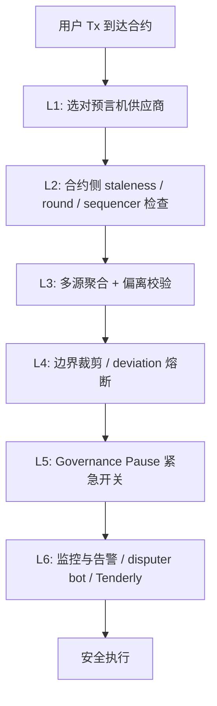

# 预言机安全与已知攻击（Oracle Security）

> **TL;DR**：预言机是 DeFi 攻击面上最"昂贵"的故障点——自 2020 年以来累计损失数十亿美元，几乎所有头部借贷 / 衍生品协议都有过相关事故。本文以复盘视角梳理六大攻击家族：**闪电贷价格操纵（bZx、Harvest、Cream、Mango、Eminence、Inverse、Rari/Fei、BonqDAO）**、**DEX Spot 误用**、**Stale Price 陈旧价**、**L2 排序器停机**、**Oracle 汇率换算错误**、**治理/升级攻击**。每种攻击附上真实事件链接、根因、补救措施。然后给出统一防御工具箱：**TWAP 替代 spot、Chainlink Fallback、staleness guard、Sequencer Uptime Feed、bounds & deviation 熔断、multi-oracle 中位数、pause switch、OEV 回流**。结尾给出安全评审清单（20+ 项），供协议集成方与审计师使用。

---

## 1. 背景与动机

区块链 TVL 大多通过预言机作价值判断：借贷的 LTV、衍生品的 oracle price、稳定币的 peg、保险的 trigger。一个错误报价可以让价值 1 亿美金的抵押品瞬间被清算给任何攻击者。与合约层的 reentrancy 或 arithmetic overflow 不同，预言机攻击往往发生在 **合约代码本身逻辑正确** 的情况下——bug 出在"数据源"与"合约信任假设"之间的缝隙。这类攻击一旦发生，损失通常 > 1000 万美金，且难以追回。

## 2. 核心原理：六大攻击家族

### 2.1 闪电贷价格操纵（Flashloan Price Manipulation）

**模型**：攻击者在同一笔交易内：
1. 从 Aave/Compound 闪电贷借入巨额资产；
2. 在某 DEX（通常低流动性）买 / 卖操纵资产 X 的 spot 价；
3. 在消费方合约（借贷/合成/LP）按被扭曲的 spot 价获利；
4. 归还闪电贷。

公式：若消费合约读的 spot 是 `p = y/x`（简单 AMM），攻击者只需短期改变 x/y 比例即可将 p 拉到 10 × 原价。损失 = 异常 LTV × 被借走的资产。

**案例**：

- **bZx v1/v2（2020-02）**：两次闪电贷攻击分别损失 $630k / $645k，用 Uniswap V1 / Kyber spot 做基准。
- **Harvest（2020-10，$34M）**：fToken pricePerShare 用 Curve Y 池 `get_virtual_price` 短时波动。
- **Value DeFi（2020-11，$6M）**：Curve spot。
- **Cheese Bank / Warp Finance（2020）**：Uniswap spot。
- **Mango（2022-10，$114M）**：操纵低流动性 perp spot；攻击者 Avraham Eisenberg 后被起诉。
- **Cream Finance v1（2021-10，$130M）**：yUSDVault `pricePerShare`。
- **Inverse Finance（2022-04，$15.6M）**：Keep3r TWAP 选取周期过短。
- **BonqDAO（2023-02，$88M）**：Tellor Oracle 上的 ALBT price 短时写入。
- **Euler（2023-03，$197M）**：虽非直接 oracle 攻击，但涉及 donateToReserves + liquidation 逻辑对 oracle 的隐含假设。

**根因**：
- 用 AMM `reserve0/reserve1` 作基准；
- TWAP 窗口过短（< 30 min）；
- 流动性不足导致单笔 swap 显著移动中位价；
- 假设稳定币总 1:1。

**缓解**：
- 永远不用单区块 DEX spot 做价值判断；
- Uniswap V3 TWAP ≥ 30 min，且需校验 pool 流动性；
- Chainlink 等多源预言机 + fallback；
- 对 LP token / ctoken / vault share 使用 "资产相对价格" 计算而非 `virtual_price`；
- 对低流动性资产加"抵押类型白名单 + LTV 上限"。

### 2.2 DEX Spot 误用

子分支：不是闪电贷，而是把 **Uniswap V2 `getReserves()` / V3 `slot0`** 当权威。slot0 价格由最后一笔 swap 决定，可在 1 笔 Tx 内被改变。Uniswap 本身文档警告过，但历年仍有新协议踩坑（如 2022 Rari Fuse Pool 90/91/95 系列）。

**规范**：
- V2 必须使用 `price0CumulativeLast / price1CumulativeLast` 构造 TWAP；
- V3 使用 `observe(secondsAgos)` + `OracleLibrary.consult` 取 `tickCumulatives` 差分。

### 2.3 Stale Price 陈旧价

预言机更新被延迟，合约仍使用老价格。原因：

- 网络拥塞 / Gas 不足 → Chainlink 节点未能按心跳写入；
- L2 排序器停机 → 整个 L2 无新交易；
- 价格源失联 → DON 无法达成共识；
- 集成方禁用 / 暂停了该 feed。

**事故**：2022-05 LUNA / UST 死亡螺旋期间，多家协议使用 stale LUNA 价导致错误清算 / 错误铸造。2023 Arb One 短暂拥堵 → USDT/USD 价 20 分钟无更新。

**防御**：

```solidity
require(block.timestamp - updatedAt < MAX_STALE, "stale");
require(answeredInRound >= roundId, "old answer");
```

并设置 `MAX_STALE = heartbeat × 1.5 + sequencer grace`。

### 2.4 L2 Sequencer 停机

Rollup 的排序器若宕机：

- Chainlink 无法 push 新 round → 价格僵死；
- 即使价格实际变化，合约仍按僵死价继续运作 → 用户不能清算自救，攻击者在序列器恢复一瞬间收割。

**事故**：Arbitrum One 2022-09-01 停机 4h；Optimism 多次短暂停机。

**防御**：Chainlink 官方 Sequencer Uptime Feed（如 `0xFdB631F5EE196F0ed6FAa767959853A9F217697D` 是 Arbitrum 的 feed）：

```solidity
(, int256 answer, uint256 startedAt,,) = seq.latestRoundData();
require(answer == 0, "seq down"); // 0=up
require(block.timestamp - startedAt > GRACE, "grace");
```

**陷阱**：很多早期 Arb / OP 部署合约没有这段检查。

### 2.5 汇率换算错误

- **Decimals 不匹配**：USDC 是 6 decimals，ETH 是 18。Chainlink USD feed 通常 8 decimals（BTC/USD、ETH/USD）；但 ETH/BTC feed 可能是 18。合约里若写死 1e8 可能溢出或归零。
- **Base currency 错位**：把 ETH/USD 当作 wstETH/USD 使用（wstETH 含 staking exchange rate）导致算 wstETH 抵押价值偏低/偏高。正确做法：`wstETH/USD = wstETH/stETH × stETH/ETH × ETH/USD`。
- **Inverted pair**：把 USD/ETH 当 ETH/USD。
- **Underlying token mispricing**：Yearn yVault 份额价 = `pricePerShare × underlying price`。若漏乘会低估 1 yVault 价值。

**事故**：多起小型借贷协议 LRT (weETH / rsETH) 定价错误，资产报价偏低导致被挤兑。2024 多家协议对 Renzo ezETH 的价格错用 ezETH/ETH spot 导致脱锚时清算失真。

### 2.6 治理 / 升级攻击

Aggregator 合约通常由多签升级。若多签被接管（或阈值过低），攻击者可：
- 指向一个恶意 Aggregator，返回任意价格；
- 把某 feed 的 min/max 边界改掉；
- 替换消费合约的 oracle 地址。

**事故**：2022 Horizon Bridge、2023 Euler 等虽非直接 Oracle，但属同类"关键合约升级权"攻击范式。

**防御**：
- 任意 Oracle 升级走 TimeLock（≥ 48 h）；
- 多签阈值 ≥ 5/9 且多地理多机构；
- 公布可监视的"预言机白名单" 链上事件；
- 消费方可独立锁定地址（Aave V3 可替换单资产 Oracle，Governance 已暂停过异常 feed）。

## 3. 架构剖析：防御工具箱

### 3.1 分层防御（Defense in Depth）



### 3.2 核心防御控件表

| 控件 | 目的 | 实现建议 |
| --- | --- | --- |
| Staleness guard | 防陈旧 | `now - updatedAt < heartbeat × 1.5` |
| Round sanity | 防旧轮回填 | `answeredInRound >= roundId` |
| Sequencer check | 防 L2 停机 | L2 Uptime feed + grace period |
| Multi-oracle median | 防单源失真 | Chainlink + Pyth 取 median，偏离 > X 熔断 |
| TWAP fallback | 主源失效时降级 | UniV3 `OracleLibrary.consult(pool, 1800)` |
| Bounds (min/max) | 防突破历史极值 | hardcoded 或 governance 可调 |
| Deviation breaker | 防瞬时跳变 | 与上次读数比较 |
| Pause switch | 最后防线 | Gov multisig + TimeLock |
| Monitoring | 快速响应 | Tenderly alert / OpenZeppelin Defender |
| Disputer bot | OO 模式监控 | UMA/Kleros 必备 |

### 3.3 代码实现示例：SafeOracleWithTWAP

```solidity
// SPDX-License-Identifier: MIT
pragma solidity ^0.8.20;

import "@chainlink/contracts/src/v0.8/shared/interfaces/AggregatorV3Interface.sol";
import "@uniswap/v3-core/contracts/interfaces/IUniswapV3Pool.sol";
import "@uniswap/v3-periphery/contracts/libraries/OracleLibrary.sol";

contract SafeOracle {
    AggregatorV3Interface public immutable chainlink;
    AggregatorV3Interface public immutable sequencer; // L2 only
    IUniswapV3Pool public immutable twapPool;
    uint32 public constant TWAP_WINDOW = 1800;    // 30min
    uint256 public constant MAX_STALE  = 3600;    // 1h
    uint256 public constant GRACE      = 1800;    // 30min L2 grace
    uint256 public constant DIV_BP     = 500;     // 5% 偏离容忍
    uint256 public minPrice = 10e8;
    uint256 public maxPrice = 100_000e8;
    bool public paused;
    address public gov;

    modifier whenActive() { require(!paused, "paused"); _; }
    modifier onlyGov() { require(msg.sender == gov, "gov"); _; }

    function readPrice() external view whenActive returns (uint256 price) {
        // 1) L2 sequencer 检查
        if (address(sequencer) != address(0)) {
            (, int256 seqAns, uint256 seqStart,,) = sequencer.latestRoundData();
            require(seqAns == 0, "seq down");
            require(block.timestamp - seqStart > GRACE, "grace");
        }
        // 2) Chainlink 读取 + staleness
        (uint80 rid, int256 ans,, uint256 updatedAt, uint80 answeredInRound) =
            chainlink.latestRoundData();
        require(ans > 0, "neg");
        require(block.timestamp - updatedAt <= MAX_STALE, "stale");
        require(answeredInRound >= rid, "old ans");
        uint256 cl = uint256(ans);
        // 3) 边界
        require(cl >= minPrice && cl <= maxPrice, "bounds");
        // 4) TWAP 对比
        (int24 tick,) = OracleLibrary.consult(address(twapPool), TWAP_WINDOW);
        uint256 twap  = OracleLibrary.getQuoteAtTick(tick, 1e18, token0, token1); // 省略 token 变量
        uint256 diff  = cl > twap ? cl - twap : twap - cl;
        require(diff * 10000 / twap <= DIV_BP, "divergence");
        return cl;
    }

    function pause() external onlyGov { paused = true; }
    function setBounds(uint256 lo, uint256 hi) external onlyGov { minPrice=lo; maxPrice=hi; }
}
```

### 3.4 数据流：安全清算生命周期

1. 用户发起 `liquidationCall`。
2. 合约 → `SafeOracle.readPrice()` 触发 6 层检查。
3. 返回 price，计算 HF < 1；
4. 执行清算；
5. OEV（如有）通过 SVR/OEV Network 回流 50% 给金库；
6. 合约事件 → Tenderly 告警订阅者。

### 3.5 客户端 & 工具

- **Chainlink Automation / Keeper**：看守 staleness，触发协议 pause。
- **Tenderly Web3 Actions**：订阅 Aggregator `AnswerUpdated` + 比较阈值，Webhook 告警。
- **OpenZeppelin Defender Sentinel**：订阅 price 偏离 / pause 事件。
- **Forta Agents**：社区共识监测异常价格。

## 4. 关键代码 / 实现细节（典型漏洞复刻与修复）

**漏洞复刻**（可被闪电贷攻击）：

```solidity
// BAD: bZx 风格
function collateralValue(uint256 amount) external view returns (uint256) {
    (uint112 r0, uint112 r1,) = IUniswapV2Pair(pair).getReserves();
    uint256 price = uint256(r1) * 1e18 / uint256(r0); // 可被操纵
    return amount * price / 1e18;
}
```

**修复**：

```solidity
function collateralValue(uint256 amount) external view returns (uint256) {
    // V2 cumulative price → TWAP，这里展示 V3：
    (int24 tick,) = OracleLibrary.consult(pool, 1800);
    uint256 price = OracleLibrary.getQuoteAtTick(tick, 1e18, token0, token1);
    // Cross-check with Chainlink
    (, int256 clAns,, uint256 ts,) = chainlink.latestRoundData();
    require(block.timestamp - ts < 1 hours, "stale");
    uint256 cl = uint256(clAns) * 1e10; // decimals 对齐
    uint256 diff = price > cl ? price - cl : cl - price;
    require(diff * 10000 / cl < 500, "divergence");
    return amount * price / 1e18;
}
```

## 5. 演进与版本对比

| 时期 | 主流认知 | 代表事件 |
| --- | --- | --- |
| 2019 | "价格不重要"、"多节点就够" | Synthetix sKRW 乌龙 |
| 2020 | "spot 不可用，TWAP 救我" | bZx、Harvest |
| 2021 | "TWAP 仍可被长窗攻击" | Inverse |
| 2022 | "低流动性长尾是炸药桶" | Mango、BonqDAO |
| 2023 | "LST/LRT 汇率误用" | 多起 stETH 事件 |
| 2024 | "OEV 归属与治理" | Aave SVR 试点 |
| 2025–2026 | "多源 + Governance + Monitoring 组合拳" | 主流协议把 oracle 模块独立开源 |

## 6. 实战示例：清算攻击模拟与防御

假设一个低流动性 token X，Uniswap V2 池子 1M TVL。攻击者：

```
闪电贷 5M USDC
→ Uniswap 卖出 5M 买 X （spot 跳升 5×）
→ 在 Lending 协议存 X 为抵押
→ 借出 原本仅能借 1M 的 5M USDC 等值资产
→ 归还闪电贷 + 赚 4M
```

防御合约代码：

```solidity
// 1) 基于 Chainlink + TWAP 双源，差距 > 5% 即 revert
// 2) 对 X 设 LTV 上限 25% 与白名单；
// 3) 对 X 最大借款额度 500k（池深度的 0.5×）。
```

## 7. 安全与已知攻击（扩展复盘）

本节是第 2 节六大家族的真实案例索引：

- rekt.news 总排行榜累计预言机相关损失 > $2B（含非直接事件）。
- Samczsun《Taking undercollateralized loans》首开科普先河。
- BlockSec awesome-defi-security 维护事件库。
- OpenZeppelin、Trail of Bits、Cyfrin 发布多份 checklist。

## 8. 与同类方案对比（单点 vs 多层防御）

| 策略 | 有效性 | 成本 | 副作用 |
| --- | --- | --- | --- |
| 单一 Chainlink | 中 | 低 | 仍依赖 DON |
| Chainlink + TWAP | 高 | 中 | 偏离可能导致正当场景 revert |
| 双预言机 median | 高 | 中高 | 实现复杂 |
| 乐观预言机为主 | 中 | 低 | 延迟高，不适合高频 |
| 本地熔断 + pause | 高 | 低 | 治理集中风险 |
| OEV 回流 | 间接增益 | 低 | 不减少被攻击概率 |

**结论**：最佳实践 = 主 feed + fallback + sequencer + bounds + pause + monitoring；缺一不可。

## 9. 安全评审清单（Audit Checklist）

1. 使用的是 DEX spot 吗？→ 替换为 TWAP / Chainlink。
2. TWAP 窗口 ≥ 30 分钟？
3. Chainlink feed 是否正确匹配资产对（含 decimals）？
4. 是否检查 `block.timestamp - updatedAt < H × 1.5`？
5. 是否检查 `answeredInRound >= roundId`？
6. L2 部署：是否有 Sequencer Uptime Feed 检查？
7. 是否有 min/max 边界裁剪？
8. 是否有偏离熔断（相对上次或相对 TWAP）？
9. 是否有 Fallback oracle？
10. 是否有 pause switch，且走 TimeLock？
11. 治理多签阈值 ≥ 5/9？
12. 是否对 LST/LRT 做 exchange rate 乘法链？
13. 是否对 LP token / vault share 使用"资产相对价格公式"？
14. 是否有低流动性资产 LTV 上限白名单？
15. 是否监听 `AnswerUpdated` / `RoundUpdated` 告警？
16. 如使用 OO：是否部署 disputer bot？
17. 是否发布事件给前端展示 oracle 健康？
18. 是否做过价格突变模拟？
19. 是否覆盖多链场景（Arb / OP / Base）的 uptime 检查？
20. 是否考虑 OEV 归属？

## 10. 术语表

| 术语 | 英文 | 释义 |
| --- | --- | --- |
| 闪电贷操纵 | Flashloan price manipulation | 单 Tx 内借贷扭曲 spot |
| 陈旧价格 | Stale price | 未及时更新的旧价 |
| 序列器停机 | Sequencer downtime | L2 排序器不可用 |
| Fallback Oracle | Fallback oracle | 备用预言机 |
| 熔断器 | Circuit breaker | 偏离超限 revert |
| 边界裁剪 | Bounds check | min/max 价格上下限 |
| TWAP | Time-weighted avg price | 时间加权均价 |
| OEV | Oracle extractable value | 预言机触发 MEV |
| Uptime Feed | Sequencer Uptime Feed | L2 状态预言机 |
| TimeLock | TimeLock | 治理延迟执行 |
| Pause switch | Pause | 紧急暂停开关 |
| Defender Sentinel | Sentinel | OZ 监控工具 |

---

*Last verified: 2026-04-22*
