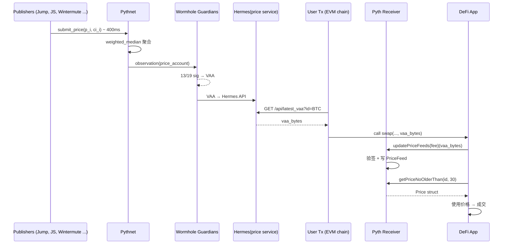

# Pyth Network（第一方拉模式预言机）

> **TL;DR**：Pyth Network 是 2021 年由 Jump Trading、Jane Street、Two Sigma、Wintermute、GTS、Virtu 等 **做市商/交易所直接参与** 而创建的预言机网络，最大差异是 **第一方数据源（first-party data）** 与 **拉模式（Pull）**。Publisher 在 **Pythnet**（一条基于 Solana 分叉的 appchain）上以约 400 ms 频率提交签名价格，由 Pythnet 做聚合得到 `(price, confidence, ema)` 三元组；消费链通过 **Wormhole** 收到 signed Verifiable Action Approval (VAA) 后，由 **使用者在交易中自行提交** 更新（这笔 Gas 由使用者承担）。这种设计把"谁用谁付"的经济模型、亚秒级延迟、跨多条链的通用格式合到一起，尤其适合 **永续合约、期权、多链 DEX**。截至 2026-04，Pyth 提供 500+ 价格符号、覆盖 80+ 条链、超过 120 个 Publisher，单日更新次数破千亿；同时推出 Pyth Entropy（VRF）、Pyth Lazer（低延迟流）、Pyth Express Relay（MEV 去除）。

---

## 1. 背景与动机

早期 Solana 上衍生品协议（Mango、Drift、01）发现 Chainlink 在 Solana 的更新频率跟不上链的 400 ms block time，且成本高昂。2021 年，一批做市商组成联盟：**把自己已经拥有的交易台价格** 直接签名发布——既省掉中间商二手聚合的偏差，又把数据新鲜度与 CEX 拉齐。2022 年 Pyth 从 Solana 迁移到独立 appchain **Pythnet**，通过 Wormhole 把 VAA 分发到 80+ 条链。2023 年引入 "拉模式 (Pull)"：目标链不做周期写入，而是消费方把最新 VAA 作为 calldata 提交再读取，**只有被消费的报价才付 Gas**。2024 年推出 Pyth 治理代币 `PYTH`，并启动 OIS（Oracle Integrity Staking）让 Publisher 承担经济责任。

## 2. 核心原理

### 2.1 形式化定义

对于每个价格符号 s（例：`Crypto.BTC/USD`），在时间 t Pythnet 聚合 N 个 Publisher 的报价 `{(p_i, ci_i)}_{i=1..N}`（`ci_i` 为置信区间）：

- 聚合价 `P_t = weighted_median({p_i}, weights_i)`，权重基于 Publisher 的 `stakeScore` 与历史表现；
- 置信区间 `C_t = max( σ(p_i), max(ci_i) )` —— 取观测方差与声明区间中较大者，保守估计不确定度；
- EMA：`EMA_t = α·P_t + (1-α)·EMA_{t-1}`，同时输出 `ema_price` 与 `ema_conf`；
- 输出结构：`PriceUpdate = (price P_t, conf C_t, ema_price, ema_conf, publish_time, prev_publish_time)`，由 Pythnet 验证者多签形成 **VAA**。

消费合约使用价格时应检查 `|P_t/C_t| > k`（典型 k = 20）否则拒用，即拒绝置信度过差的报价。

### 2.2 Pythnet：定制 appchain

Pythnet 是一条 **基于 Solana 代码分叉** 的许可链：验证者由 Publisher 组成（自己验证自己），交易零手续费。它的主程序 `oracle` 维护每个符号的 `PriceAccount`：每笔 Publisher 提交 → 聚合任务 → 更新 `aggregate.price`。约 400 ms 一次更新。Pythnet 不直接存在于消费链，它的输出通过 **Wormhole Guardian 网络** 打包：

- Wormhole 19 个 Guardian 监听 Pythnet `price_account` 变化；
- 13/19 签名即生成 VAA（Verified Action Approval），可在任何支持 Wormhole receiver 的链上验证。

### 2.3 Pull 模式流程



### 2.4 第一方数据源的影响

- **源头最短路径**：Publisher 即信息来源（不是二次爬 CEX REST）；
- **声明式置信区间**：Publisher 清楚自己 book 的 depth，给出 `confidence` 更贴近现实；
- **抗操纵**：即使少数 Publisher 报假价，加权中位数 + 置信度放大会使其被丢弃；
- **风险**：Publisher 之间可能共谋，但相互竞争的大型做市商合谋成本极高。

### 2.5 关键参数

| 参数 | 值 | 说明 |
| --- | --- | --- |
| Publisher 更新频率 | ~400 ms | Pythnet slot 长度 |
| 聚合算法 | weighted median + conf | 自定 program |
| VAA 最终性 | ~13 s | 13 Guardian 签名时间 |
| 默认 staleness 检查 | 用户自定 | 常用 10–60 s |
| Update fee | 1 wei × 更新数 | receiver 合约收费 |
| Publisher 数 | 120+ | 持续扩张 |

### 2.6 边界与失败模式

- **Wormhole 瘫痪**：VAA 无法生成 → 消费链停更，合约应 stale 保护。
- **Publisher 合谋**：加权中位数降低影响；配合 OIS 经济惩罚。
- **提交 VAA 被延迟**：用户交易 revert；前端应重拉最新 VAA。
- **消费方忘记 update**：读到极旧价格 → 必须用 `getPriceNoOlderThan`。

## 3. 架构剖析

### 3.1 分层视图

1. **Publisher 层**：做市商 / 交易所的私有行情系统，运行 `pyth-client` 或自研签名器。
2. **Pythnet 层**：appchain，`oracle` 程序在每个 slot 聚合。
3. **Wormhole 层**：跨链消息总线。
4. **Receiver 层**：各链（EVM/SOL/SUI/APTOS/COSMWASM）上的 Pyth 合约。
5. **Hermes 层**：官方托管的 VAA 分发服务（HTTP + WebSocket），开源可自建。
6. **SDK 层**：`@pythnetwork/pyth-evm-js`、`pyth-sdk-solidity`、`pyth-sdk-solana` 等。

### 3.2 核心模块表

| 模块 | 仓库/路径 | 职责 | 可替换性 |
| --- | --- | --- | --- |
| pyth-client | [pyth-network/pyth-client](https://github.com/pyth-network/pyth-client) | Publisher 侧 C 代码、签名提交 | 可被自研替代 |
| oracle program | `pyth-client/program/rust` | Pythnet 上聚合合约 | 否 |
| Pythnet validator | 基于 Solana | 区块链层 | 否 |
| Wormhole Core | Guardian + receivers | 跨链通信 | 原则上可换 IBC/LayerZero |
| pyth-crosschain | [pyth-crosschain](https://github.com/pyth-network/pyth-crosschain) | 各链 receiver 合约 | 必须匹配链 |
| Hermes | [pyth-crosschain/apps/hermes](https://github.com/pyth-network/pyth-crosschain/tree/main/apps/hermes) | VAA 聚合/REST | 任何人可运行 |
| SDK | `pyth-sdk-solidity` 等 | 消费端接口 | 独立 |

### 3.3 数据流生命周期（EVM 消费者一次更新）

1. 前端调用 Hermes `GET /v2/updates/price/latest?ids[]=<BTC>` 拿到 `hex-encoded VAA`（~ 800 B）。
2. 用户交易携带 VAA 调 `perp.openPosition(..., updateData)`。
3. 合约 `IPyth.getUpdateFee(updateData)` 得到费用（通常极小）。
4. 合约 `updatePriceFeeds{value:fee}(updateData)` → Pyth receiver 验证 Wormhole 签名 (13/19)、写入 `PriceFeed` 状态。
5. 合约 `getPriceNoOlderThan(priceId, 30)` 读取 `Price` 结构，校验 `conf/price` 后使用。
6. 全部发生在单笔 Tx 内，延迟 = Hermes → 链 ≈ 区块时间。

### 3.4 客户端多样性

Publisher 侧：开源 `pyth-client`（C），多家做市商自研；Pythnet 验证者软件 = Solana validator（`pythnet/pythnet` fork）。这一特殊链的代码由 Pyth Data Association 托管，短期内实现多样性有限，但 Wormhole Guardian 本身有多实现（Go / Rust）。

### 3.5 扩展接口

- **EVM**：`IPyth.updatePriceFeeds`, `getPriceUnsafe`, `getPriceNoOlderThan`, `getEmaPriceNoOlderThan`。
- **Solana**：`pyth-sdk-solana::load_price_account`。
- **Move（Sui/Aptos）**：`pyth::pyth::get_price_no_older_than`。
- **CosmWasm**：`pyth-sdk-cw`。
- **Pyth Entropy**：`IEntropy.requestWithCallback`（VRF）。
- **Pyth Lazer**：WebSocket 超低延迟流（< 100 ms）。

## 4. 关键代码 / 实现细节

EVM receiver 的 `updatePriceFeeds`（简化自 `pyth-crosschain/target_chains/ethereum/contracts/contracts/pyth/Pyth.sol`，tag v1.3.x）：

```solidity
function updatePriceFeeds(bytes[] calldata updateData) public payable override {
    uint totalNumUpdates = 0;
    for (uint i = 0; i < updateData.length; ++i) {
        totalNumUpdates += updatePriceBatchFromVm(updateData[i]);
    }
    // 按更新数 × 单价收取 fee
    uint requiredFee = getTotalFee(totalNumUpdates);
    require(msg.value >= requiredFee, "insufficient fee");
}

function updatePriceBatchFromVm(bytes calldata encodedVm) internal returns (uint) {
    // 1. Wormhole 核心合约验签 VAA
    (IWormhole.VM memory vm, bool valid, string memory reason) =
        wormhole().parseAndVerifyVM(encodedVm);
    require(valid, reason);
    // 2. 校验 emitterChain 与 emitterAddress 是 Pythnet 官方
    require(isValidDataSource(vm.emitterChainId, vm.emitterAddress), "invalid source");
    // 3. 解析 Pyth 批次 payload
    PythInternalStructs.PriceInfo[] memory updates = parseBatchAttestation(vm.payload);
    for (uint i = 0; i < updates.length; ++i) {
        bytes32 id = updates[i].priceId;
        // 若新报价时间 > 已存在，覆盖
        if (updates[i].publishTime > latestPriceInfo[id].publishTime) {
            latestPriceInfo[id] = updates[i];
            emit PriceFeedUpdate(id, updates[i].publishTime, updates[i].price, updates[i].conf);
        }
    }
    return updates.length;
}
```

Pythnet `oracle` 程序聚合（`pyth-client/program/rust/src/processor/c_upd_aggregate.rs`，简化）：

```rust
// 伪代码：对启用的 Publisher 取加权中位数
let mut quotes: Vec<Quote> = publishers.iter()
    .filter(|p| p.price.valid && current_slot - p.slot <= MAX_STALE_SLOTS)
    .map(|p| Quote { price: p.price, conf: p.conf, weight: p.caps })
    .collect();

quotes.sort_by_key(|q| q.price);
let agg_price = weighted_median(&quotes);
let agg_conf  = weighted_iqr_conf(&quotes, agg_price);
// EMA
price_account.ema_price = update_ema(price_account.ema_price, agg_price, alpha);
price_account.aggregate = Aggregate { price: agg_price, conf: agg_conf, publish_slot: clock.slot };
```

## 5. 演进与版本对比

| 版本 | 时间 | 关键变化 |
| --- | --- | --- |
| Pyth v1 (on Solana) | 2021 | 仅 Solana native |
| Pyth v2 / Pythnet 迁移 | 2022 | 独立 appchain，Wormhole 跨链 |
| Pull 模式 | 2023 | EVM receiver + Hermes |
| PYTH 代币 & 治理 | 2023-11 | 空投与 DAO |
| Pyth Entropy | 2024 | 跨链 VRF |
| Oracle Integrity Staking (OIS) | 2024 | Publisher 押 PYTH、可被 slash |
| Express Relay | 2024 | OEV 拍卖机制 |
| Pyth Lazer | 2025 | 100 ms 低延迟流 |

## 6. 实战示例：最小 Pull Consumer

```solidity
import "@pythnetwork/pyth-sdk-solidity/IPyth.sol";
import "@pythnetwork/pyth-sdk-solidity/PythStructs.sol";

contract PriceConsumer {
    IPyth public immutable pyth;
    bytes32 public constant ETH_USD = 0xff61491a931112ddf1bd8147cd1b641375f79f5825126d665480874634fd0ace;
    constructor(address _pyth) { pyth = IPyth(_pyth); }

    function exec(bytes[] calldata updateData) external payable {
        uint fee = pyth.getUpdateFee(updateData);
        pyth.updatePriceFeeds{value: fee}(updateData);

        PythStructs.Price memory p = pyth.getPriceNoOlderThan(ETH_USD, 30);
        require(p.conf > 0 && uint64(p.price) / p.conf >= 20, "low confidence");
        // p.price 有 expo（负数），真实价格 = price * 10^expo
        int64 priceUsd = p.price;
        int32 expo     = p.expo;
        // ... 使用
    }
}
```

Hermes 拉取（Node.js）：

```ts
import { PriceServiceConnection } from "@pythnetwork/price-service-client";
const c = new PriceServiceConnection("https://hermes.pyth.network");
const ids = ["0xff61491a931112ddf1bd8147cd1b641375f79f5825126d665480874634fd0ace"];
const updateData = await c.getPriceFeedsUpdateData(ids);
```

## 7. 安全与已知攻击

- **2023-05 重入预警**：研究员发现某 EVM receiver 在 update 回调中未 `nonReentrant`，Pyth 迅速热补丁，无资金损失。
- **2022-09 错误报价**：Pyth BTC/USD 短暂显示 $20 / BTC，原因是某 Publisher 配置错误。权重聚合放大了离群值。Pyth 事后引入更严格的离群剔除与 `conf` 放大。
- **Wormhole 2022-02 被盗 3.2 亿**：与 Pyth 无关但显示底层通信层风险；Pyth 后期将 receiver 设计为可切换 guardian set。
- **Publisher 系统入侵**：理论上若某机构内网私钥泄露可发假价，OIS 设计让其 slashing 损失 > 攻击收益。

## 8. 与同类方案对比

| 维度 | Pyth | Chainlink | API3 | RedStone |
| --- | --- | --- | --- | --- |
| 模式 | Pull first-party | Push DON | Push first-party | Hybrid pull |
| 更新频率 | 400 ms (Pythnet) | 秒–分钟 | 秒–分钟 | 秒 |
| Publisher | 做市商直接 | 第三方节点聚合 | API 提供方 | 节点聚合 |
| 多链 | 80+ via Wormhole | 100+ via 独立部署 | 40+ | 70+ |
| 延迟（目标链） | 1 块 + VAA 解析 | 新 round 写入 | 新 round 写入 | 1 块 |
| Gas 支付 | 使用者 | 协议 | 协议 | 使用者 |
| 抗操纵 | 120 Publisher + conf | 31 节点 + multi source | 节点 + 声誉 | 节点 + 聚合 |
| 最佳场景 | 高频衍生品 / 多链 | 高 TVL 主流 DeFi | 长尾 API | 新链 / 新资产 |

## 9. 延伸阅读

- **白皮书**：[Pyth Network Whitepaper v2.0](https://pyth.network/whitepaper_v2.pdf)（2022）。
- **官方文档**：[docs.pyth.network](https://docs.pyth.network/price-feeds)。
- **代码**：[pyth-network/pyth-crosschain](https://github.com/pyth-network/pyth-crosschain)、[pyth-network/pyth-client](https://github.com/pyth-network/pyth-client)。
- **研究**：Fiat Currency Oracle via Pyth (Jump Trading tech blog)。
- **视频**：Pyth Breakpoint 2023 keynote；SmartCon Pull vs Push 辩论。
- **中文**：登链社区 Pyth 集成教程；odaily 《Pyth Network 深度》。

## 10. 术语表

| 术语 | 英文 | 释义 |
| --- | --- | --- |
| 第一方预言机 | First-party oracle | 数据源直接发布签名价格 |
| 拉模式 | Pull oracle | 使用者把签名数据作为 calldata 更新链上 |
| Publisher | Publisher | 数据发布机构（做市商/CEX） |
| Pythnet | Pythnet | Pyth 的 Solana 分叉 appchain |
| VAA | Verifiable Action Approval | Wormhole 多签消息 |
| Confidence Interval | Confidence | 报价 ±σ |
| EMA price | Exponential Moving Avg | 指数加权均价 |
| Hermes | Hermes | 官方 VAA 服务 |
| OIS | Oracle Integrity Staking | Publisher 质押 / slashing |
| Entropy | Pyth Entropy | 基于 VRF 的随机数 |
| Express Relay | Express Relay | MEV 回流机制 |
| Lazer | Pyth Lazer | 低延迟流 |

---

*Last verified: 2026-04-22*
