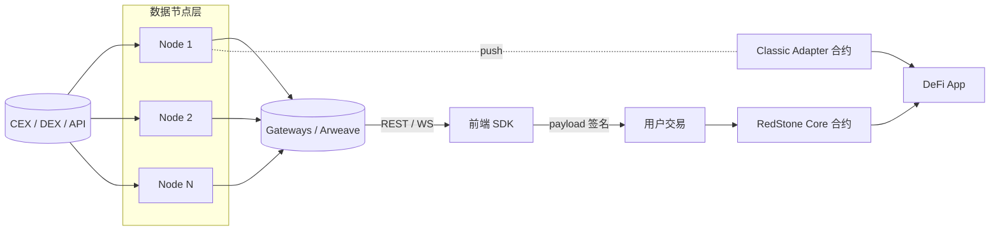

# RedStone（混合拉推预言机）

> **TL;DR**：RedStone 是 2020 年由 Jakub Wojciechowski 在波兰创立的预言机项目，核心创新是 **把价格数据放在链下（Arweave 永久存储 + P2P 节点签名），只有被真正使用时才携带到链上**——称为 **"On-demand oracle"** 或 **"Modular Oracle"**。RedStone 提供三种消费模型：**Core（Pull）**—— 用户交易附带节点签名数据、合约侧 inline 验签；**Classic（Push）**—— 类 Chainlink 心跳 / 偏离写链；**X**—— 低延迟 100 ms 拉模式，专为 perp/option 设计。RedStone 的卖点是 **多链覆盖广（70+ 链，含非主流 L2 与 new L1）** 与 **低成本接入**（Core 模式用户付几十 k Gas 即用）。其旗舰客户包括 Morpho、Pendle、Venus、Ether.fi、Renzo 等，以 LST / LRT 等新资产定价为主——这也是 RedStone 的市场定位：在 Chainlink/Pyth 不覆盖或反应慢的长尾新资产上抢占空白。

---

## 1. 背景与动机

2020 年多数 DeFi 协议只用 Chainlink，但 Chainlink 上新 feed 缓慢、费用高、对长尾资产支持不足。RedStone 问：**为什么每块都要把价格写进合约？** 绝大多数合约交互只在用户调用时需要价格；反之，心跳式 push 在无人使用时白烧 Gas。

思路：

1. 节点仍持续聚合价格，但把结果 **签名后发布到去中心化存储 (Arweave)** 与 P2P 层；
2. 前端 / dApp 在用户交易前调取最新签名数据；
3. 交易在 EVM calldata 中附带签名，合约侧 inline 验签（ecrecover），用完即抛。

这样 **只有真正被消费的数据点才付 Gas**，并且价格新鲜度取决于用户何时发起交易，而非心跳周期。对于衍生品、跨链桥、LRT 铸造这类"交易即结算"的场景尤其匹配。RedStone 用 Arweave 做历史归档，满足审计与争议回溯。

## 2. 核心原理

### 2.1 数据流与三模型



三种交付模型：

- **Core（默认 Pull）**：`redstone-evm-connector` 在调用合约时把报价打包进 calldata 末尾。合约继承 `RedstoneConsumerNumericBase`，在业务逻辑中调 `getOracleNumericValueFromTxMsg(dataFeedId)`。
- **Classic (Push)**：节点定期调用 `UpdatePriceAdapter.updateDataFeedsValues(...)`。接口与 Chainlink AggregatorV3 兼容。
- **X**：更新模型类似 Pyth Pull，但价格源粒度 100 ms；用于 Kwenta、Synthetix v3 类 perp。

### 2.2 签名数据结构

每条价格条目 `DataPoint = (dataFeedId, value)`，多个条目合成 `DataPackage`：

```
DataPackage = (dataPoints[], timestamp, signerAddress, signature)
signature   = ECDSA_sign(skNode, keccak256(dataPoints || timestamp))
```

调用附带多个 DataPackage（来自不同节点）。合约按 `requiredSignersCount` 校验，例如 "至少 3 个白名单节点签名 + 报价相差 ≤ 1% → 取 median"。

### 2.3 链上验证

合约继承 `RedstoneConsumerNumericBase`：

- 从 calldata 尾部解析 packages；
- 对每个 package 重算哈希 → ecrecover 签名 → 判断是否在 authorizedSigners 集合；
- 时间戳 freshness 检查（默认 3 min）；
- 对同一 dataFeedId 多签名 → 取 median 作为返回值。

这一全过程发生在 EVM 内，成本约 60k–150k gas（随签名数线性）。

### 2.4 聚合与 Aggregator Contract

Classic 模式下，`MergedPriceFeedAdapter` 是中心合约：

- 存储最新 `(value, timestamp, roundId)`；
- 更新时验签 + deviation / heartbeat 检查；
- 提供 `latestRoundData()` 完全兼容 Chainlink。

### 2.5 参数

| 参数 | 值 | 说明 |
| --- | --- | --- |
| 默认 signer 数 | 3–10 | 按资产设定 |
| 数据新鲜度 | ≤ 3 min | 可合约自配 |
| Classic 心跳 | 24 h | 主流资产 |
| Classic 偏离阈值 | 0.5%–2% | 按资产 |
| Arweave 归档 | 每 10 s 一条 | 任何人可拉取 |
| 支持链 | 70+ | 持续扩张 |

### 2.6 边界与失败

- **Gateway 宕机**：前端无法取最新签名 → 回退缓存或多 gateway。
- **签名人跑路**：合约 `requiredSignersCount` 仍可满足；治理可更换 signer 名单。
- **时钟漂移**：node 时间戳不同步 → 3 min freshness 容忍。
- **用户篡改 calldata**：签名校验失败即 revert。

## 3. 架构剖析

### 3.1 分层视图

1. **Data Source 层**：CEX / DEX / CoinGecko / Chainlink fallback / 自建做市深度等。
2. **Node 层**：RedStone Oracle Node（TypeScript + Rust，[redstone-finance/redstone-oracles-monorepo](https://github.com/redstone-finance/redstone-oracles-monorepo)）。
3. **Storage / Cache 层**：Arweave（长期归档）+ streamr 或自营 gateway（实时）。
4. **Delivery 层**：`@redstone-finance/evm-connector`、`@redstone-finance/sdk`、REST/WS 网关。
5. **On-chain 层**：`RedstoneConsumerNumericBase`（Pull）、`PriceFeedAdapter`（Push）、`redstoneX-updater`。
6. **Consumer 层**：继承 base 合约的 DeFi 协议。

### 3.2 核心模块

| 模块 | 路径 | 职责 | 可替换性 |
| --- | --- | --- | --- |
| oracle-node | `packages/oracle-node` | 拉数据 + 聚合 + 签名 | 核心 |
| on-chain-relayer | `packages/on-chain-relayer` | Classic 模式 keeper | 是 |
| evm-connector | `packages/evm-connector` | 客户端 SDK（injecting） | 是 |
| redstone-smart-contracts | `packages/evm-contracts` | Solidity 基类 | 否 |
| RedstoneConsumerBase.sol | evm-contracts | calldata 解析 / 验签 | 否 |
| PriceFeedBase / Adapter | evm-contracts | Push 存储 | 否 |
| gateways | `packages/cache-service` | 缓存与 REST | 是 |

### 3.3 数据流：Morpho 集成 weETH 定价（Core）

1. 用户在 Morpho blue 市场借款，前端调用 `morphoOracle.price()`。
2. 前端用 SDK 拉 N 个 signer 对 "weETH/USD" 的最新签名数据（~ 5 s 内）。
3. 前端把 DataPackages 附加到交易 `borrow(data ... packages)`。
4. Morpho Oracle 合约继承 base，`getOracleNumericValueFromTxMsg("weETH/USD")` 解析出聚合价。
5. Morpho 用该价计算 LTV → 放款。
6. 全程 1 块，合约消耗约 120k gas 验签。

### 3.4 客户端多样性

节点软件单实现（TS/Rust monorepo）；签名器私钥可放 KMS；gateway 可以自建。合约层标准 Solidity，已有 Move/Stylus 实验实现。开放性不及 Chainlink，但 Arweave 归档提供可验证性。

### 3.5 扩展接口

- Core：继承 `MainDemoConsumerBase` 或 `RedstoneConsumerNumericBase`，重写 `getUniqueSignersThreshold` / `getAuthorizedSigners`。
- Classic：`IRedstoneAdapter.getValueForDataFeed(bytes32 id)` 或 `AggregatorV3Interface`。
- RedStone X：`PerpsAdapter` + low-latency WS gateway。

## 4. 关键代码 / 实现细节

合约基类核心逻辑（`evm-contracts/contracts/core/RedstoneConsumerBase.sol`，简化 v0.7.x）：

```solidity
abstract contract RedstoneConsumerBase {
  function getUniqueSignersThreshold() public view virtual returns (uint8) { return 3; }
  function getAuthorisedSignerIndex(address signerAddress) public view virtual returns (uint8);

  function getOracleNumericValueFromTxMsg(bytes32 dataFeedId)
      internal view returns (uint256) {
    // 从 calldata 尾部取 payload
    (uint256[] memory values, uint256 timestamp) =
        _extractOracleValuesAndTimestampFromTxMsg(new bytes32[](1).push(dataFeedId));
    // 校验 timestamp 在 [now - 3min, now + 1min] 内
    validateTimestamp(timestamp);
    // 校验 signer 唯一性 ≥ threshold；values 已 median 聚合
    require(values[0] > 0, "value=0");
    return values[0];
  }

  function _extractOracleValuesAndTimestampFromTxMsg(bytes32[] memory ids)
      internal view returns (uint256[] memory, uint256) {
    // 1. 解析 payload: n 个 DataPackage
    // 2. 对每个 package ecrecover 取 signer；
    // 3. 校验 signer ∈ authorised & 不重复；
    // 4. 对每个 dataFeedId 聚合 → median
    // 省略... 详见 CalldataExtractor.sol
  }
}

contract WeETHOracle is MainDemoConsumerBase {
    function latestPrice() external view returns (uint256) {
        return getOracleNumericValueFromTxMsg(bytes32("weETH/USD"));
    }
}
```

Classic MergedPriceFeedAdapter `updateDataFeedsValues`：

```solidity
function updateDataFeedsValues(bytes32[] calldata dataFeedsIds, uint256 proposedTimestamp)
    external
{
  // 0. freshness
  require(proposedTimestamp > lastUpdateTimestamp, "old ts");
  require(block.timestamp - proposedTimestamp <= 3 minutes, "stale");
  // 1. 从 calldata 解析 packages + 聚合
  uint256[] memory values = getOracleNumericValuesFromTxMsg(dataFeedsIds);
  // 2. deviation 检查
  for (uint i = 0; i < dataFeedsIds.length; ++i) {
    _checkDeviation(dataFeedsIds[i], values[i]);
    _storeValue(dataFeedsIds[i], values[i], proposedTimestamp);
    emit ValueUpdate(dataFeedsIds[i], values[i], proposedTimestamp);
  }
  lastUpdateTimestamp = proposedTimestamp;
}
```

## 5. 演进与版本对比

| 版本 | 时间 | 关键变化 |
| --- | --- | --- |
| RedStone v1 | 2021 | Arweave-only 存储 |
| Core (Pull) | 2022 | inline calldata 验签 |
| Classic (Push) | 2023 | 对 Chainlink 兼容适配 |
| RedStone X | 2024 | 100 ms Perp 专用 |
| Multichain expansion | 2024–2025 | 覆盖 EigenLayer AVS / Monad / Berachain 等新链 |
| RED token TGE | 2025 | 节点 staking & 治理 |

## 6. 实战示例

Pull 合约（Core）：

```solidity
import "@redstone-finance/evm-connector/contracts/data-services/MainDemoConsumerBase.sol";

contract WeEthLend is MainDemoConsumerBase {
    function borrow() external {
        uint256 p = getOracleNumericValueFromTxMsg(bytes32("weETH/USD"));
        // ... 使用价格
    }
}
```

前端注入：

```ts
import { WrapperBuilder } from "@redstone-finance/evm-connector";
const wrapped = WrapperBuilder.wrap(weEthLend).usingDataService({
  dataServiceId: "redstone-main-demo",
  uniqueSignersCount: 3,
  dataFeeds: ["weETH/USD"],
});
await wrapped.borrow();
```

Classic（Chainlink 兼容读取）：

```solidity
AggregatorV3Interface feed = AggregatorV3Interface(REDSTONE_PRICE_FEED);
(, int256 answer,, uint256 updatedAt,) = feed.latestRoundData();
```

## 7. 安全与已知攻击

- **Core 模式 attack vector：前端被植入**。前端若被劫持，可注入低质量 signer 名单 → 合约端的 `authorizedSigners` 白名单 + threshold 是最终防线。
- **2024 Morpho-RedStone 某 LRT feed 短暂滞后**：Arweave gateway 限流，更换多 gateway 后恢复。
- **Gateway 层 DDoS**：用户交易失败 → 已引入多 gateway 并在 SDK 支持快速切换。
- **Signer 私钥泄露**：减少 threshold 有效性，可治理 revoke；Classic 模式额外需 keeper 去链上刷新黑名单。

RedStone 对新资产（LRT、RWA）的响应速度明显优于 Chainlink，但相应地也承担了数据源不成熟导致的偶发偏差，这推高了集成方对 fallback oracle 的需求。

## 8. 与同类方案对比

| 维度 | RedStone Core | Pyth Pull | Chainlink Data Feed | API3 Self-funded |
| --- | --- | --- | --- | --- |
| 交付模式 | calldata inline | calldata inline | 链上存储 | 链上存储 |
| 签名来源 | RedStone 节点 | Wormhole (Pythnet + guardian) | OCR DON | Airnode |
| 延迟 | 取决于 TX 时 | Pythnet 400 ms | 1 h 心跳 / 偏离 | 类 Chainlink |
| 多链 | 70+ | 80+ | 100+ | 40+ |
| 特色 | 新资产广、覆盖 LRT | CEX-grade 高频 | 最成熟 | 第一方 + OEV |
| 成本承担 | 用户 (~100k gas) | 用户 (~50k) | 协议 | 协议 |

## 9. 延伸阅读

- **文档**：[docs.redstone.finance](https://docs.redstone.finance/docs/introduction)。
- **仓库**：[redstone-finance/redstone-oracles-monorepo](https://github.com/redstone-finance/redstone-oracles-monorepo)。
- **博客**：[blog.redstone.finance](https://blog.redstone.finance/)；《Pull vs Push》系列。
- **研究**：Morpho Labs 关于 LRT Oracle design 的技术文章。
- **中文**：登链社区 RedStone 集成；odaily RedStone 深度。

## 10. 术语表

| 术语 | 英文 | 释义 |
| --- | --- | --- |
| 混合预言机 | Modular / Hybrid Oracle | Pull + Push 同时支持 |
| Core | RedStone Core | Pull 模型 |
| Classic | RedStone Classic | Push 模型 |
| RedStone X | RedStone X | 100 ms 低延迟 perp 模型 |
| DataPackage | DataPackage | 签名数据包 |
| Gateway | Gateway | 缓存节点 |
| Arweave archive | Arweave archive | 永久归档 |
| Authorized signer | Authorized signer | 合约白名单签名地址 |
| Freshness window | Freshness | 时间戳容忍范围 |
| Unique signers threshold | Threshold | 最少不同签名数 |
| LRT | Liquid Restaking Token | 重质押代币 |
| Adapter | Adapter contract | Chainlink 兼容代理 |

---

*Last verified: 2026-04-22*
