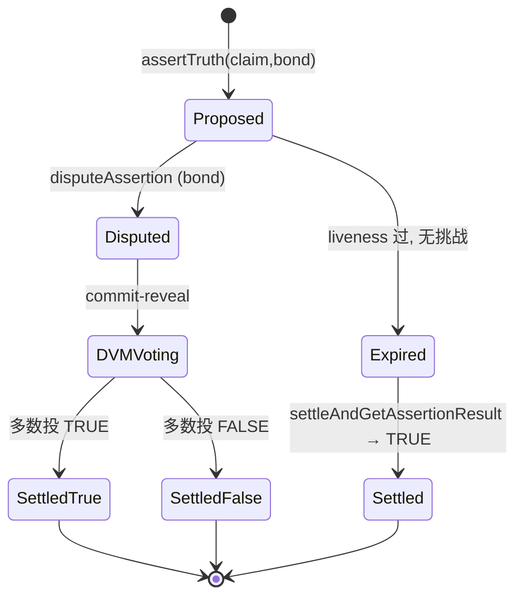

# UMA（乐观预言机）

> **TL;DR**：UMA（Universal Market Access）由 Hart Lambur 与 Allison Lu 2018 年创立，提出与 Chainlink/Pyth 完全不同的预言机范式——**Optimistic Oracle（OO）**：任何人都可以"断言一个事实为真"（assert truth），只要在 **异议窗口（challenge window，默认 2 小时）** 无人质疑，这个断言就被合约视为确认。若有人质疑，进入 **DVM（Data Verification Mechanism）**——UMA token 持有者投票裁决，败方债券被罚没给胜方。其核心优势是 **通用**：价格、事件、保险、NFT、RWA、跨链声明都能走同一接口；常态 Gas 极低（无 push 心跳）；适合 **主观 / 长尾 / 低频** 数据；最知名的应用是 **Polymarket**（结果市场）与 **Across Protocol**（跨链桥），前者 2024 美国大选期间单市场 TVL 曾破 $10B。UMA 目前主力版本为 OOv3，已在 Ethereum、Arbitrum、Optimism、Polygon、Base 部署。

---

## 1. 背景与动机

2018 年 UMA 白皮书《Priceless Financial Contracts》尝试不用预言机做合成资产——用 **惩罚性超额抵押**（若你敢违约清算就罚你）代替精确报价。实践中发现：总要有人判定"是否违约"。于是引入 **Optimistic Oracle**：按需调用、争议时才走仲裁。这一思路由 Augur 的 REP 机制启发，但做得更通用。

核心观察：**大多数情况下，真相是显然的**。如果"美联储 12 月是否加息"答案写在 FOMC 公告，99% 的时间没人会花钱去反驳。只有边缘争议才值得走昂贵的仲裁。传统 Push 预言机对所有数据点付出相同成本（高频心跳），而 Optimistic Oracle 把付出推迟到真正需要裁决的时候——对长尾、非金融数据尤其经济高效。

## 2. 核心原理

### 2.1 形式化定义

OO 是一个谓词查询系统：

- 提议者 asserter 发起 `assertTruth(claim, bond, liveness)`，质押 `bond` 并声明 `claim` 为真，给出挑战期 `liveness`。
- 在 `[T0, T0+liveness]` 内任何人可 `disputeAssertion(assertionId)`，质押等额 bond 成为 disputer。
- 若无人挑战：`claim = TRUE`，asserter 取回 bond，合约可 `settleAndGetAssertionResult()`。
- 若被挑战：提交到 **DVM**。UMA token holders 投票（commit-reveal），多数判定真伪；败方 bond 的 50% 归胜方，50% 归 DVM 作 burn/rebate。

**安全定理（Schelling-point / truthful voting）**：若诚实选民投票期望收益 > 贿赂收益，且腐蚀所有投票者成本 > 协议 TVL 上限，则 Truthfulness 是纳什均衡。UMA 强制要求 `TVL × threshold < Total_UMA_staked_in_DVM`，这就是所谓 **"Cost of Corruption" > "Profit from Corruption"** 条件。

### 2.2 DVM：仲裁机制

DVM 是 UMA 的核心——一个 **链上 commit-reveal 投票系统**：

1. **Commit 阶段（24 h）**：UMA 质押者提交 `commit = hash(vote, salt)`。
2. **Reveal 阶段（24 h）**：公开 `(vote, salt)` 验签。
3. **Finalize**：按质押加权统计中位数 / 众数决定真伪。
4. **发奖/惩罚**：与多数一致的 voter 获 UMA 通胀奖励；少数侧承担机会成本。

这给 UMA token 以"truthful-labor 工作量"意义，形成 **schelling-point oracle**。DVM v2 将投票期延长、引入懒惰惩罚（未投票也扣奖励份额）。

### 2.3 OOv3：极简接口

OOv3 把使用门槛降到最低。对每个声明只需：

- `asserter`：发起人（需授权 bond token）；
- `claim`：URL 或任意 bytes（建议附上 IPFS 链接，包含证据）；
- `bond`：挑战者必须匹配的抵押，通常 5000 USDC；
- `liveness`：挑战窗口，通常 7200 s。

关键合约：`OptimisticOracleV3.sol`，提供 `assertTruth / disputeAssertion / settleAndGetAssertionResult`。

### 2.4 Cost of Corruption 模型

攻击者若想让 `claim` 虚假为真需：

1. 存 `bond` 提出虚假断言（成本 = bond）；
2. 在挑战期内阻止所有 disputer（难：任何人观察到都可挑战）；
3. 若被挑战：操纵 DVM 投票（需购入并投票 > 50% UMA）。

UMA 要求任意 OO 消费者必须把 TVL 限制在 **TVL ≤ f(StakedUMA)**，否则攻击收益可能超过腐蚀成本。协议治理随时可暂停单个 OO 工厂。

### 2.5 Mermaid 状态机



### 2.6 参数与常量

| 参数 | 典型值 | 说明 |
| --- | --- | --- |
| liveness | 2 h – 24 h | 挑战期 |
| bond | 5000 USDC / 0.05 ETH | 可定制 |
| DVM commit 阶段 | 24 h | 投票窗 |
| DVM reveal 阶段 | 24 h | 揭示窗 |
| 惩罚比例 | 败方 bond × 50% burn, 50% → winner | 经济激励 |
| 最小 UMA stake（voter） | — | 任意（按占比权重） |
| Final fee | 链 gas + 小额 protocol fee | 治理可调 |

### 2.7 边界条件

- **挑战期过短**：诚实监控者未来得及挑战 → 虚假 claim 被通过。UMA 推荐不低于 2 h。
- **TVL 超过安全上限**：贿赂收益 > 腐蚀成本 → 理论可攻击。需治理审查使用方。
- **UMA token 集中**：若单人持 > 50% → 51% DVM 攻击。UMA 总分布较广，但需持续监测。
- **长尾 claim 被 flood**：恶意 actor 大量 spam assertion 制造监视疲劳。bond 本身是反 spam。

## 3. 架构剖析

### 3.1 分层视图

1. **应用层**：Polymarket、Across、Snapshot oSnap、Sherlock 保险、Outcome Finance。
2. **OO 层**：`OptimisticOracleV2/V3`、`SkinnyOptimisticOracle`。
3. **DVM 层**：`Voting`, `VotingToken (UMA)`, `FinderInterface`。
4. **治理层**：UMA DAO Governor、时间锁。
5. **监控层**：UMA Disputer Bot、protocol 监控社群。

### 3.2 核心模块

| 模块 | 路径（`UMAprotocol/protocol`） | 职责 | 可替换性 |
| --- | --- | --- | --- |
| OptimisticOracleV3 | `packages/core/contracts/optimistic-oracle-v3` | 核心断言 | 是（新版本） |
| Voting / VotingV2 | `packages/core/contracts/oracle/implementation` | DVM | 否 |
| Finder | `Finder.sol` | 地址注册表 | 是 |
| Store | `Store.sol` | 手续费 / 罚没金库 | 否 |
| FundingRateStore | `financial-templates/funding-rate-store` | 永续利率 | 是 |
| AddressWhitelist | `AddressWhitelist.sol` | 支持的 bond token | 是 |
| Disputer bot | `packages/disputer-bot` | 自动监听并挑战 | 是（任意人运行） |

### 3.3 数据流：Polymarket 结果结算

1. 市场结束（如总统大选结果出炉）。
2. Polymarket UMA adapter 调用 `OptimisticOracleV3.assertTruth(claim="Trump wins presidential election 2024", bond=5000 USDC)`。
3. 2 h liveness 内：如果没人挑战，`settleAndGetAssertionResult → TRUE`；Polymarket 合约按此派发奖金。
4. 如果有人挑战：DVM 投票 48 h；胜负决定结果。
5. UMA OO 产生事件 `AssertionMade / AssertionDisputed / AssertionSettled`。

### 3.4 客户端与实现

UMA 协议绝大部分逻辑在合约（Solidity）；链下仅需要 **Disputer bot**（TypeScript）。Disputer 职责：

- 订阅 `AssertionMade` 事件；
- 去对应 claim 证据源（IPFS、URL）验证；
- 若虚假，执行 `disputeAssertion`。
- 任何人都可以运行，自带经济激励（胜诉赚走对方 bond 的 50%）。

### 3.5 接口

- `assertTruth(bytes claim, address asserter) → bytes32 assertionId`
- `disputeAssertion(bytes32 assertionId, address disputer)`
- `settleAndGetAssertionResult(bytes32 assertionId) → bool`
- `getAssertion(bytes32) → Assertion`
- 集成 SDK：`@uma/sdk`、`@uma/contracts-node`。

## 4. 关键代码 / 实现细节

OptimisticOracleV3 `assertTruth`（简化自 `optimistic-oracle-v3/OptimisticOracleV3.sol`，commit `master` 快照）：

```solidity
function assertTruth(
    bytes memory claim,
    address asserter,
    address callbackRecipient,
    address escalationManager,
    uint64 liveness,
    IERC20 currency,
    uint256 bond,
    bytes32 identifier,
    bytes32 domainId
) public returns (bytes32 assertionId) {
    require(liveness >= minimumLiveness, "liveness too short");
    require(bond >= getMinimumBond(address(currency)), "bond too low");
    assertionId = _getId(claim, bond, uint64(block.timestamp), liveness,
                        currency, callbackRecipient, escalationManager, identifier);
    require(assertions[assertionId].asserter == address(0), "duplicate");
    // 锁定 bond
    currency.safeTransferFrom(msg.sender, address(this), bond);
    assertions[assertionId] = Assertion({
        escalationManagerSettings: EscalationManagerSettings({
            arbitrateViaEscalationManager: false,
            discardOracle: false, validateDisputers: false,
            assertingCaller: msg.sender, escalationManager: escalationManager
        }),
        asserter: asserter,
        disputer: address(0),
        callbackRecipient: callbackRecipient,
        currency: currency,
        bond: bond,
        assertionTime: uint64(block.timestamp),
        expirationTime: uint64(block.timestamp) + liveness,
        settled: false,
        settlementResolution: false,
        domainId: domainId,
        identifier: identifier
    });
    emit AssertionMade(assertionId, domainId, claim, asserter, callbackRecipient,
                       escalationManager, msg.sender, liveness, currency, bond,
                       assertions[assertionId].expirationTime);
}

function settleAssertion(bytes32 assertionId) public {
    Assertion storage a = assertions[assertionId];
    require(!a.settled, "already settled");
    if (a.disputer == address(0)) {
        require(block.timestamp >= a.expirationTime, "not expired");
        a.settled = true;
        a.settlementResolution = true;
        a.currency.safeTransfer(a.asserter, a.bond);
    } else {
        // 查询 DVM
        int256 resolvedPrice = _getOracle().getPrice(a.identifier, a.assertionTime, _stampAssertion(assertionId));
        a.settled = true;
        a.settlementResolution = resolvedPrice == 1e18;
        address winner = a.settlementResolution ? a.asserter : a.disputer;
        uint256 oracleFee = (burnedBondPercentage * a.bond) / 1e18;
        a.currency.safeTransfer(address(_getStore()), oracleFee);
        a.currency.safeTransfer(winner, (a.bond * 2) - oracleFee);
    }
    if (a.callbackRecipient != address(0))
        OptimisticOracleV3CallbackRecipientInterface(a.callbackRecipient)
            .assertionResolvedCallback(assertionId, a.settlementResolution);
}
```

## 5. 演进与版本对比

| 版本 | 时间 | 关键变化 |
| --- | --- | --- |
| UMA v1 Priceless | 2019 | 超额抵押合成资产 |
| OOv1 | 2020 | 最早乐观预言机 |
| OOv2 | 2021 | 加入 escalation manager |
| OOv3 | 2023 | 极简接口，现主流 |
| DVM v2 | 2023 | commit-reveal 改进、通胀奖励 |
| Sherlock / oSnap | 2023–2024 | Snapshot 治理乐观执行 |
| Polymarket 现象级增长 | 2024 大选 | 验证长尾预言机价值 |
| Across v3 相关集成 | 2024 | 跨链桥依赖 OO |

## 6. 实战示例：断言一个事实

```solidity
import "@uma/core/contracts/optimistic-oracle-v3/interfaces/OptimisticOracleV3Interface.sol";
import "@openzeppelin/contracts/token/ERC20/IERC20.sol";

contract Assertor {
    OptimisticOracleV3Interface public oo;
    IERC20 public usdc;
    bytes32 public constant IDENT = bytes32("ASSERT_TRUTH");

    constructor(address _oo, address _usdc) {
        oo = OptimisticOracleV3Interface(_oo);
        usdc = IERC20(_usdc);
    }

    function submit(bytes memory claim) external returns (bytes32 id) {
        usdc.transferFrom(msg.sender, address(this), 5000e6);
        usdc.approve(address(oo), 5000e6);
        id = oo.assertTruth(
            claim,               // 例如 "ipfs://Qm.../2026-01-nonfarm-payroll-is-250k"
            msg.sender,
            address(0), address(0),
            7200,                // 2 小时
            usdc, 5000e6,
            IDENT, bytes32(0)
        );
    }

    function finalize(bytes32 id) external returns (bool truthful) {
        truthful = oo.settleAndGetAssertionResult(id);
    }
}
```

## 7. 安全与已知攻击

- **Polymarket "Ukraine Gas Price" 争议（2022）**：claim 模糊导致多次 escalation。教训：claim 必须明确可验证，配合 IPFS 规则文档。
- **Upolis / Mistakes in OOv2**：旧版本未检查 bond token 白名单，曾误允许冷门 token → 已在 OOv3 强制校验。
- **51% UMA 攻击的风险**：UMA 流通量约 1 亿，市值在 1–5 亿美元浮动；理论上拥有半数可操纵 DVM。协议方通过设置每个 OO 使用方 TVL 上限缓解。
- **Snapshot oSnap 被质疑**：治理提案执行走 OO，如果社群缺乏监控，恶意提案 2 h 后自动执行过。已加入多重 disputer bot 与社区告警。

## 8. 与同类方案对比

| 维度 | UMA OO | Chainlink Push | Pyth Pull | Kleros（乐观竞对） |
| --- | --- | --- | --- | --- |
| 定位 | 通用乐观断言 | 价格 Push | 高频价格 Pull | 通用仲裁 |
| 延迟 | 异议期（≥2h） | 秒–分钟 | 亚秒 | 数天（陪审团投票） |
| 常态成本 | 极低（不发则零） | 持续心跳 | 使用者 Gas | 极低 |
| 适用数据 | 主观 / 长尾 / 事件 | 高频金融 | 高频金融 | 法律 / 仲裁 |
| 经济安全 | bond + DVM 投票 | 节点 staking | Publisher 信誉 | PNK 陪审 |
| 明星场景 | Polymarket、Across、oSnap | Aave、Maker | Drift、Synthetix | Reality.eth |

## 9. 延伸阅读

- **白皮书**：《[Priceless Financial Contracts](https://github.com/UMAprotocol/whitepaper)》（2019）；UMA DVM 设计 blog。
- **文档**：[docs.uma.xyz](https://docs.uma.xyz/)。
- **代码**：[UMAprotocol/protocol](https://github.com/UMAprotocol/protocol)。
- **博客**：[blog.uma.xyz](https://blog.uma.xyz/)；Hart Lambur 演讲。
- **案例**：Polymarket UMA adapter；Across Protocol 设计。
- **中文**：登链社区《乐观预言机》；Crypto Pragmatist UMA 分析。

## 10. 术语表

| 术语 | 英文 | 释义 |
| --- | --- | --- |
| 乐观预言机 | Optimistic Oracle | 先提议后挑战的预言机 |
| 断言 | Assertion | 提议者声明为真的 claim |
| 挑战期 | Liveness / Challenge window | 可被反对的时间窗 |
| 争议 | Dispute | 有人反对并质押 bond |
| DVM | Data Verification Mechanism | UMA 仲裁投票系统 |
| bond | Bond | 质押保证金 |
| commit-reveal | commit-reveal voting | 防抄袭投票 |
| Schelling point | Schelling-point oracle | 汇聚真相的博弈均衡 |
| Escalation Manager | Escalation Manager | 自定义仲裁路由 |
| oSnap | Optimistic Snapshot | Snapshot 提案乐观执行 |
| Across | Across Protocol | 基于 OO 的跨链桥 |
| Polymarket | Polymarket | UMA 最大用例（预测市场） |

---

*Last verified: 2026-04-22*
